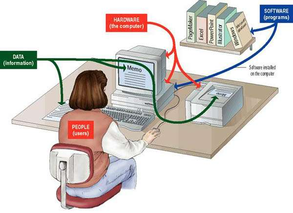
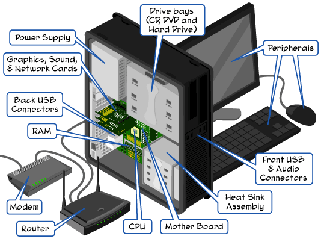
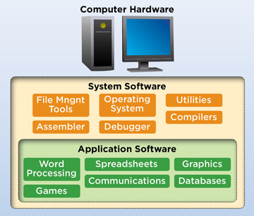
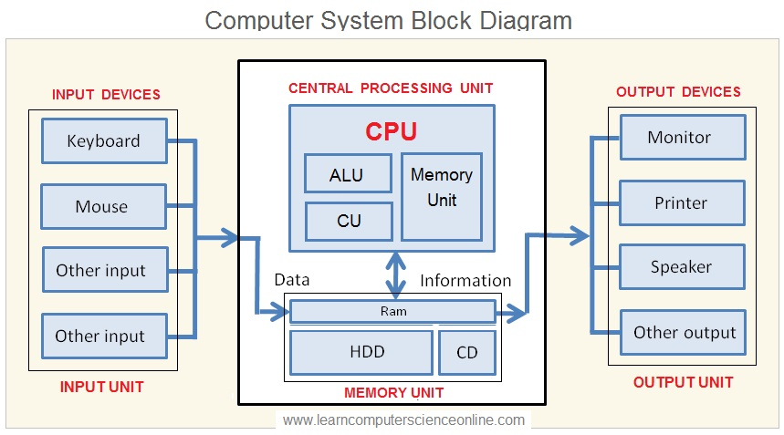
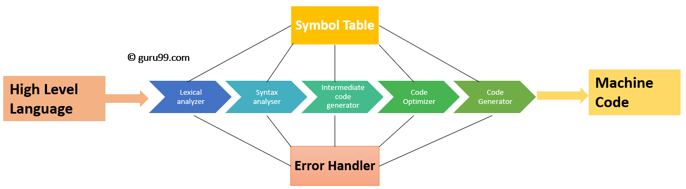
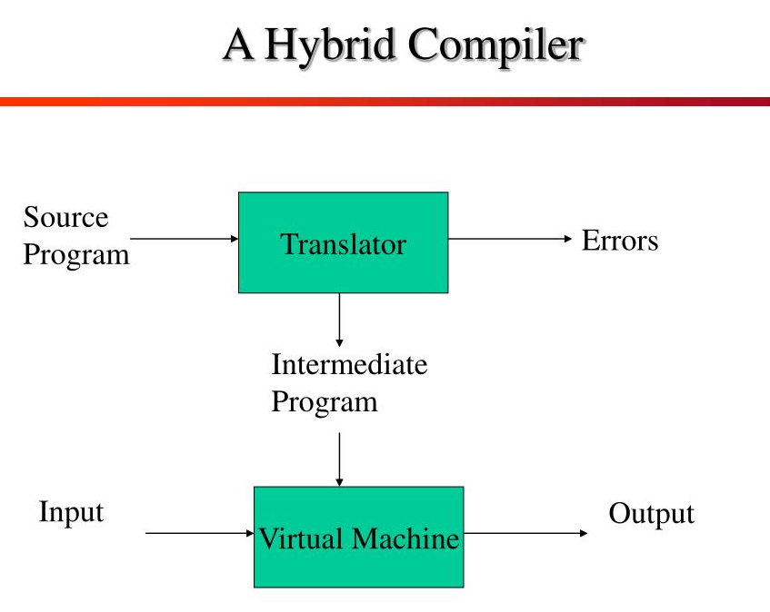

<h1 align="center"> Logic Programming in Java </h1>

# Content

1. [Project Status](#projectstatus)
2. [About the Project](#abouttheproject)
3. [Project Description](#projectdescription)
4. [Chapter 1: Introduction](#chapter1)
    - [Chapter 1 - Part 1: Algorithms](#chapter1part1)
    - [Chapter 1 - Part 2: Automation and Computers](#chapter1part2)
    - [Chapter 1 - Part 3: Programming Language](#chapter1part3)
    - [Chapter 1 - Part 4: IDE](#chapter1part4)
    - [Chapter 1 - Part 5: Compiler and Interpreter](#chapter1part5)
    - [Chapter 1 - Part 6: GCC MinGW Compiler Installation](#chapter1part6)
    - [Chapter 1 - Part 7: Code Blocks IDE Installation](#chapter1part7)
    - [Chapter 1 - Part 8: First Program in C](#chapter1part8)
5. [Chapter 2: Sequential Structures](#chapter2)
    - [Chapter 2 - Part 1: Arithmetic Expressions](#chapter2part1)
    - [Chapter 2 - Part 2: Variables](#chapter2part2)
    - [Chapter 2 - Part 3: Data Input](#chapter2part3)
    - [Chapter 2 - Part 4: Data Processing](#chapter2part4)
    - [Chapter 2 - Part 5: Data Output](#chapter2part5)
    - [Chapter 2 - Part 6: Mathematical Functions](#chapter2part6)
6. [Chapter 3: Conditional Structures](#chapter3)
    - [Chapter 3 - Part 1: Comparable Expressions](#chapter3part1)
    - [Chapter 3 - Part 2: Logical Expressions](#chapter3part2)
    - [Chapter 3 - Part 3: Simple Conditional Structure](#chapter3part3)
    - [Chapter 3 - Part 4: Compound Conditional Structure](#chapter3part4)
    - [Chapter 3 - Part 5: Chaining Conditional Structures](#chapter3part5)
7. [Chapter 4: Repetitive Structures](#chapter4)
    - [Chapter 4 - Part 1: While Repetitive Structure](#chapter4part1)
    - [Chapter 4 - Part 2: For Repetitive Structure](#chapter4part2)
8. [Chapter 5: Vectors](#chapter5)
    - [Chapter 5 - Part 1: Theory](#chapter5part1)
    - [Chapter 5 - Part 2: Declaration and Creation](#chapter5part2)
    - [Chapter 5 - Part 3: Access](#chapter5part3)
9. [Chapter 6: Matrices](#chapter6)
    - [Chapter 6 - Part 1: Theory](#chapter6part1)
    - [Chapter 6 - Part 2: Declaration and Creation](#chapter6part2)
    - [Chapter 6 - Part 3: Access](#chapter6part3)
10. [Usage](#usage)
11. [Contributors](#contributors)
12. [Contributing](#contributing)
13. [Roadmap](#roadmap)
14. [To Do](#todo)
15. [Contacts](#contacts)
16. [License](#license)

# Project Status <a name="projectstatus"></a>

Project Status: Under Development :warning:

# About the Project <a name="abouttheproject"></a>

This project have a propose to introduce the reader the basics of logic programming with C.

In my [GitHub profile][github-url], you will see repositories named as "logic-programming-in-(language name)-basics". This repositories concist in tutorials to introduce the reader the basics in logical programming using the most usable languages in the market.

[![Project][project-shield]][project-url] <!-- Put the link of the github page of the tutorial her -->

This tutorial was based in the course from Phd Professor [Nelio Alves - Algorithms and Programming Logical][logicalcourse-url].

# Project Description <a name="projectdescription"></a>

Logical Programming is the first step in the computer science course and the first skill to learn when you want to become a software developer.

Logical Programming have to be independet of what programming language you will use, because the logic always will be the same. 

The basic content of a programming logic course consists:

- Introduction: Algorithms, Programming Language, IDE, Compiler and Interpreter, Compiler Installation, IDE Installation and First Program in the Language.
- Sequential Structures: Arithmetic Expressions, Variables, Data Input, Data Processing, Data Output and Mathematical Functions.
- Conditional Structures: Comparable Expressions, Logical Expressions, Simple Conditional Structure, Compound Conditional Structure and Chaining Conditional Structures.
- Repetitive Structures: While Repetitive Structure and For Repetitive Structure.
- Vectors: Theory, Declaration and Creation and Access.
- Matrices: Theory, Declaration, Creation and Access.
  
## <a name="chapter1"></a>Chapter 1: Introduction

#### <a name="chapter1part1"></a>Chapter 1 - Part 1: Algorithms

In essence, algorithms are simply a series of instructions that are followed, step by step, to do something useful or solve a problem. You could consider a cake recipe an algorithm for making a cake, for example.

Example of a cake recipe algorithm:

1. Preheat the oven
2. Gather the ingredients
3. Measure out the ingredients
4. Mix together the ingredients to make the batter
5. Grease a pan
6. Pour the batter into the pan
7. Put the pan in the oven
8. Set a timer
9. When the timer goes off, take the pan out of the oven
10. Enjoy!

In Mathematic and Computer Science, an algorithm is any well-defined computational procedure that takes some value, or set of values, as input and produces some value, or set of values, as output. An algorithm is thus a sequence of computational steps that transform the input into the output [THOMAS C. CORMEN][cormen-url].

Example of a bubble sort algorithm:

1. Enter a unsorted array of 5 integer elements. (Input)
2. Start with the first two elements and sort them in ascending order. (Compare the element to check which one is greater). (processing)
3. Compare the second and third element to check which one is greater, and sort them in ascending order. (processing)
4. Compare the third and fourth element to check which one is greater, and sort them in ascending order. (processing)
5. Compare the fourth and fifth element to check which one is greater, and sort them in ascending order. (processing)
6. Repeat steps 1–5 until no more swaps are required. (processing)
7. Show in the screen the sorted array (Output)

<br>

<div align="center"><br><sub>Fig 1 - Bubble Sort Algorithm Working</sub></div>

<br>


#### <a name="chapter1part2"></a>Chapter 1 - Part 2: Automation and Computers

Automation describes a wide range of technologies that reduce human intervention in processes. 

In the example of the algorithm to make a cake, we can automation the process with a machine that is capable to do everything or a part of it...

<br>

<div align="center"><br><sub>Fig 2 - Automation the Cake Recipe Algorithm</sub></div>

<br>

The automation machine that is capable to automate the bubble sort algorithm is the computer.

What is a Computer?

A machine that is capable to automate calculos algorithms. Down below, a simple reference what is a computer:

<br>

<div align="center"><br><sub>Fig 3 - Basic Computer</sub></div>

<br>

A computer have Hardware (Physical parts - machine): 

<br>

<div align="center"><br><sub>Fig 4 - Computer Hardware</sub></div>

<br>

And a Software (Logical parts - Programms):

<br>

<div align="center"><br><sub>Fig 5 - Computer Softwares</sub></div>

<br>

Computer programms is algorithms executade by the computer. For this, hardware and software work together to get the input of the user, process through software and hardware and output the result in screen.

To make a Computer Programm we need four things:

- **Programming language:** Lexical and syntactic rules for writing the program.

- **IDE:** Software to edit and test the program.

- **Compiler**: Transform the source code into object code.

- **Code generator or virtual machine**: Software that allows the program to run.

<br>

<div align="center"><br><sub>Fig 6 - Computer Input/Processing/Output Diagram Software Level</sub></div>

<br>

<div align="center"><br><sub>Fig 7 - Computer Input/Processing/Output Diagram Hardware Level</sub></div>

<br>

<div align="center"><br><sub>Fig 8 - Computer Input/Processing/Output Common Diagram Common Level</sub></div>

<br>

The Bubble Algorithm can be automatize with the C program Language. Bellow, there is the source code of the programm:

```c
#include <stdio.h>
void bubble_sort(int a[], int n) {
    int i = 0, j = 0, tmp;
    for (i = 0; i < n; i++) {   // loop n times - 1 per element
        for (j = 0; j < n - i - 1; j++) { // last i elements are sorted already
            if (a[j] > a[j + 1]) {  // swop if order is broken
                tmp = a[j];
                a[j] = a[j + 1];
                a[j + 1] = tmp;
            }
        }
    }
}
int main() {
  int a[100], n, i, d, swap;
  printf("Enter number of elements in the array:\n");
  scanf("%d", &n); 
  printf("Enter %d integers\n", n);
  for (i = 0; i < n; i++)
    scanf("%d", &a[i]);
  bubble_sort(a, n);
  printf("Printing the sorted array:\n");
  for (i = 0; i < n; i++)
     printf("%d\n", a[i]);
  return 0;
}
```
    
#### <a name="chapter1part3"></a>Chapter 1 - Part 3: Programming Language

Programming languages are the tools we use to write instructions for computers to follow. 

Computers “think” in binary — strings of 1s and 0s. Programming languages allow us to translate the 1s and 0s into something that humans can understand and write. A programming language is made up of a series of symbols that serves as a bridge that allow humans to translate our thoughts into instructions computers can understand.

**Low-Level vs. High-Level Programming Languages**

Programming languages fall into two different classifications — low-level and high-level.

Low-level programming languages are closer to machine code, or binary. Therefore, they’re more difficult for humans to read (although they’re still easier to understand than 1s and 0s). The benefit of low-level languages is that they’re fast and offer precise control over how the computer will function.

High-level programming languages are closer to how humans communicate. High-level languages use words (like object, order, run, class, request, etc.) that are closer to the words we use in our everyday lives. This means they’re easier to program in than low-level programming languages, although they do take more time to translate into machine code for the computer.

**Lexical Rules and Syntax Rules**

Programm language have a lexical rules (orthography) and syntax rules (grammar) to write programms.

- Lexical

    Is about the correct words orhography
    
    | Example English                                 | Example Programm Language  |
    |:------------------------------------------------|:---------------------------|
    | Dog (Correct)                                   | Main (Correct)             |
    | Dogo (Wrong)                                    | Maim (Wrong)               |
    
- Syntax

   Is about the correct sentences grammar
   
    | Example English                                 | Example Programm Language       |
    |:------------------------------------------------|:--------------------------------|
    | He is a Daniel in judgment (Correct)            | x = 2 + y (Correct)             |
    | Daniel is a He in judgment (Wrong)              | x = + 2 y (Wrong)               |
    

#### <a name="chapter1part4"></a>Chapter 1 - Part 4: IDE

An integrated development environment (IDE) is a software application that provides comprehensive facilities to computer programmers for software development. An IDE normally consists of at least a source code editor, build automation tools and a debugger.

#### <a name="chapter1part5"></a>Chapter 1 - Part 5: Compiler and Interpreter

**Source Code**

In computing, source code is any collection of code, with or without comments, written using a human-readable programming language, usually as plain text. 

The source code of a program is specially designed to facilitate the work of computer programmers, who specify the actions to be performed by a computer mostly by writing source code.

<div align="center"><br><sub>Fig 9 - Source Code Example - Java vs Python</sub></div>

To computer understand the source code, this code have to be  assembler or compiler into binary machine code that can be executed by the computer.

**Compilation**

Compilation is the process the computer takes to convert a high-level programming language into a machine language that the computer can understand. The software which performs this conversion is called a compiler.

<div align="center"><br><sub>Fig 10 - Compiler Process</sub></div>

**Compiled Languages vs Interpreted Languages**

Compiled languages are converted directly into machine native code by a compiler program.They require an explicit build step before execution. That is why we need to rebuild the program every time we make a code change.Compiled languages tend to be faster and more efficient than interpreted languages. However, their generated machine code is platform-specific.

On the other hand, in interpreted languages there are no build steps. Instead, interpreters operate on the source code of the program while executing it.Interpreted languages were once considered significantly slower than compiled languages.

<div align="center"><br><sub>Fig 11 - Compiler Vs Interpreter</sub></div>

- Example of Compiled Languages:
    - C
    - C++

- Example of Interpreted Languages:
    - PHP
    - JavaScript
    - Ruby
    - Python

**Hybrid Languages**

Hybrid compiler is a compiler which translates a human readable source code to an intermediate byte code for later interpretation. So these languages do have both features of a compiler and an interpreter. These types of compilers are commonly known as Just In-time Compilers (JIT).

Java is one good example for these types of compilers.

<div align="center"><br><sub>Fig 12 - Hybrid Language</sub></div>

- Example of Hybrid Languages:
    - Java (Virtual Machine: JVM)
    - C# (Virtual Machine: Microsoft .NET Framework)

#### <a name="chapter1part6"></a>Chapter 1 - Part 6: GCC MinGW Compiler Installation

Lorem ipsum dolor sit amet, consectetur adipiscing elit. Integer accumsan id neque ut tempor. Nulla facilisi. Aliquam eu eros fermentum, commodo est sed, pharetra est. 
Curabitur lacinia blandit turpis rhoncus varius. Proin vulputate orci nulla, nec porttitor nibh consequat in. Suspendisse ac neque ut massa commodo auctor in sed libero. 
Sed tincidunt mauris eu tempor malesuada. Mauris feugiat vitae risus quis iaculis.

<div align="center"><br><sub>Fig 1 - Aplication Deploy</sub></div>

#### <a name="chapter1part7"></a>Chapter 1 - Part 7: Code Blocks IDE Installation

Lorem ipsum dolor sit amet, consectetur adipiscing elit. Integer accumsan id neque ut tempor. Nulla facilisi. Aliquam eu eros fermentum, commodo est sed, pharetra est. 
Curabitur lacinia blandit turpis rhoncus varius. Proin vulputate orci nulla, nec porttitor nibh consequat in. Suspendisse ac neque ut massa commodo auctor in sed libero. 
Sed tincidunt mauris eu tempor malesuada. Mauris feugiat vitae risus quis iaculis.

<div align="center"><br><sub>Fig 1 - Aplication Deploy</sub></div>

#### <a name="chapter1part8"></a>Chapter 1 - Part 8: First Program in C

Lorem ipsum dolor sit amet, consectetur adipiscing elit. Integer accumsan id neque ut tempor. Nulla facilisi. Aliquam eu eros fermentum, commodo est sed, pharetra est. 
Curabitur lacinia blandit turpis rhoncus varius. Proin vulputate orci nulla, nec porttitor nibh consequat in. Suspendisse ac neque ut massa commodo auctor in sed libero. 
Sed tincidunt mauris eu tempor malesuada. Mauris feugiat vitae risus quis iaculis.

<div align="center"><br><sub>Fig 1 - Aplication Deploy</sub></div>

## <a name="chapter2"></a>Chapter 2: Sequential Structures

#### <a name="chapter2part1"></a>Chapter 2 - Part 1: Arithmetic Expressions

Lorem ipsum dolor sit amet, consectetur adipiscing elit. Integer accumsan id neque ut tempor. Nulla facilisi. Aliquam eu eros fermentum, commodo est sed, pharetra est. 
Curabitur lacinia blandit turpis rhoncus varius. Proin vulputate orci nulla, nec porttitor nibh consequat in. Suspendisse ac neque ut massa commodo auctor in sed libero. 
Sed tincidunt mauris eu tempor malesuada. Mauris feugiat vitae risus quis iaculis.

<div align="center"><br><sub>Fig 1 - Aplication Deploy</sub></div>

#### <a name="chapter2part2"></a>Chapter 2 - Part 2: Variables

Lorem ipsum dolor sit amet, consectetur adipiscing elit. Integer accumsan id neque ut tempor. Nulla facilisi. Aliquam eu eros fermentum, commodo est sed, pharetra est. 
Curabitur lacinia blandit turpis rhoncus varius. Proin vulputate orci nulla, nec porttitor nibh consequat in. Suspendisse ac neque ut massa commodo auctor in sed libero. 
Sed tincidunt mauris eu tempor malesuada. Mauris feugiat vitae risus quis iaculis.

<div align="center"><br><sub>Fig 1 - Aplication Deploy</sub></div>

#### <a name="chapter2part3"></a>Chapter 2 - Part 3: Data Input

Lorem ipsum dolor sit amet, consectetur adipiscing elit. Integer accumsan id neque ut tempor. Nulla facilisi. Aliquam eu eros fermentum, commodo est sed, pharetra est. 
Curabitur lacinia blandit turpis rhoncus varius. Proin vulputate orci nulla, nec porttitor nibh consequat in. Suspendisse ac neque ut massa commodo auctor in sed libero. 
Sed tincidunt mauris eu tempor malesuada. Mauris feugiat vitae risus quis iaculis.

<div align="center"><br><sub>Fig 1 - Aplication Deploy</sub></div>

#### <a name="chapter2part4"></a>Chapter 2 - Part 4: Data Processing

Lorem ipsum dolor sit amet, consectetur adipiscing elit. Integer accumsan id neque ut tempor. Nulla facilisi. Aliquam eu eros fermentum, commodo est sed, pharetra est. 
Curabitur lacinia blandit turpis rhoncus varius. Proin vulputate orci nulla, nec porttitor nibh consequat in. Suspendisse ac neque ut massa commodo auctor in sed libero. 
Sed tincidunt mauris eu tempor malesuada. Mauris feugiat vitae risus quis iaculis.

<div align="center"><br><sub>Fig 1 - Aplication Deploy</sub></div>

#### <a name="chapter2part5"></a>Chapter 2 - Part 5: Data Output

Lorem ipsum dolor sit amet, consectetur adipiscing elit. Integer accumsan id neque ut tempor. Nulla facilisi. Aliquam eu eros fermentum, commodo est sed, pharetra est. 
Curabitur lacinia blandit turpis rhoncus varius. Proin vulputate orci nulla, nec porttitor nibh consequat in. Suspendisse ac neque ut massa commodo auctor in sed libero. 
Sed tincidunt mauris eu tempor malesuada. Mauris feugiat vitae risus quis iaculis.

<div align="center"><br><sub>Fig 1 - Aplication Deploy</sub></div>

#### <a name="chapter2part6"></a>Chapter 2 - Part 6: Mathematical Functions

Lorem ipsum dolor sit amet, consectetur adipiscing elit. Integer accumsan id neque ut tempor. Nulla facilisi. Aliquam eu eros fermentum, commodo est sed, pharetra est. 
Curabitur lacinia blandit turpis rhoncus varius. Proin vulputate orci nulla, nec porttitor nibh consequat in. Suspendisse ac neque ut massa commodo auctor in sed libero. 
Sed tincidunt mauris eu tempor malesuada. Mauris feugiat vitae risus quis iaculis.

<div align="center"><br><sub>Fig 1 - Aplication Deploy</sub></div>

## <a name="chapter3"></a>Chapter 3: Conditional Structures

#### <a name="chapter3part1"></a>Chapter 3 - Part 1: Comparable Expressions

Lorem ipsum dolor sit amet, consectetur adipiscing elit. Integer accumsan id neque ut tempor. Nulla facilisi. Aliquam eu eros fermentum, commodo est sed, pharetra est. 
Curabitur lacinia blandit turpis rhoncus varius. Proin vulputate orci nulla, nec porttitor nibh consequat in. Suspendisse ac neque ut massa commodo auctor in sed libero. 
Sed tincidunt mauris eu tempor malesuada. Mauris feugiat vitae risus quis iaculis.

<div align="center"><br><sub>Fig 1 - Aplication Deploy</sub></div>

#### <a name="chapter3part2"></a>Chapter 3 - Part 2: Logical Expressions

Lorem ipsum dolor sit amet, consectetur adipiscing elit. Integer accumsan id neque ut tempor. Nulla facilisi. Aliquam eu eros fermentum, commodo est sed, pharetra est. 
Curabitur lacinia blandit turpis rhoncus varius. Proin vulputate orci nulla, nec porttitor nibh consequat in. Suspendisse ac neque ut massa commodo auctor in sed libero. 
Sed tincidunt mauris eu tempor malesuada. Mauris feugiat vitae risus quis iaculis.

<div align="center"><br><sub>Fig 1 - Aplication Deploy</sub></div>

#### <a name="chapter3part3"></a>Chapter 3 - Part 3: Simple Conditional Structure

Lorem ipsum dolor sit amet, consectetur adipiscing elit. Integer accumsan id neque ut tempor. Nulla facilisi. Aliquam eu eros fermentum, commodo est sed, pharetra est. 
Curabitur lacinia blandit turpis rhoncus varius. Proin vulputate orci nulla, nec porttitor nibh consequat in. Suspendisse ac neque ut massa commodo auctor in sed libero. 
Sed tincidunt mauris eu tempor malesuada. Mauris feugiat vitae risus quis iaculis.

<div align="center"><br><sub>Fig 1 - Aplication Deploy</sub></div>

#### <a name="chapter3part4"></a>Chapter 3 - Part 4: Compound Conditional Structure

Lorem ipsum dolor sit amet, consectetur adipiscing elit. Integer accumsan id neque ut tempor. Nulla facilisi. Aliquam eu eros fermentum, commodo est sed, pharetra est. 
Curabitur lacinia blandit turpis rhoncus varius. Proin vulputate orci nulla, nec porttitor nibh consequat in. Suspendisse ac neque ut massa commodo auctor in sed libero. 
Sed tincidunt mauris eu tempor malesuada. Mauris feugiat vitae risus quis iaculis.

<div align="center"><br><sub>Fig 1 - Aplication Deploy</sub></div>

#### <a name="chapter3part5"></a>Chapter 3 - Part 5: Chaining Conditional Structures

Lorem ipsum dolor sit amet, consectetur adipiscing elit. Integer accumsan id neque ut tempor. Nulla facilisi. Aliquam eu eros fermentum, commodo est sed, pharetra est. 
Curabitur lacinia blandit turpis rhoncus varius. Proin vulputate orci nulla, nec porttitor nibh consequat in. Suspendisse ac neque ut massa commodo auctor in sed libero. 
Sed tincidunt mauris eu tempor malesuada. Mauris feugiat vitae risus quis iaculis.

<div align="center"><br><sub>Fig 1 - Aplication Deploy</sub></div>

## <a name="chapter4"></a>Chapter 4: Repetitive Structures

#### <a name="chapter4part1"></a>Chapter 4 - Part 1: While Repetitive Structure

Lorem ipsum dolor sit amet, consectetur adipiscing elit. Integer accumsan id neque ut tempor. Nulla facilisi. Aliquam eu eros fermentum, commodo est sed, pharetra est. 
Curabitur lacinia blandit turpis rhoncus varius. Proin vulputate orci nulla, nec porttitor nibh consequat in. Suspendisse ac neque ut massa commodo auctor in sed libero. 
Sed tincidunt mauris eu tempor malesuada. Mauris feugiat vitae risus quis iaculis.

<div align="center"><br><sub>Fig 1 - Aplication Deploy</sub></div>

#### <a name="chapter4part2"></a>Chapter 4 - Part 2: For Repetitive Structure

Lorem ipsum dolor sit amet, consectetur adipiscing elit. Integer accumsan id neque ut tempor. Nulla facilisi. Aliquam eu eros fermentum, commodo est sed, pharetra est. 
Curabitur lacinia blandit turpis rhoncus varius. Proin vulputate orci nulla, nec porttitor nibh consequat in. Suspendisse ac neque ut massa commodo auctor in sed libero. 
Sed tincidunt mauris eu tempor malesuada. Mauris feugiat vitae risus quis iaculis.

<div align="center"><br><sub>Fig 1 - Aplication Deploy</sub></div>

## <a name="chapter5"></a>Chapter 5: Vectors

#### <a name="chapter5part1"></a>Chapter 5 - Part 1: Theory

Lorem ipsum dolor sit amet, consectetur adipiscing elit. Integer accumsan id neque ut tempor. Nulla facilisi. Aliquam eu eros fermentum, commodo est sed, pharetra est. 
Curabitur lacinia blandit turpis rhoncus varius. Proin vulputate orci nulla, nec porttitor nibh consequat in. Suspendisse ac neque ut massa commodo auctor in sed libero. 
Sed tincidunt mauris eu tempor malesuada. Mauris feugiat vitae risus quis iaculis.

<div align="center"><br><sub>Fig 1 - Aplication Deploy</sub></div>

#### <a name="chapter5part2"></a>Chapter 5 - Part 2: Declaration and Creation

Lorem ipsum dolor sit amet, consectetur adipiscing elit. Integer accumsan id neque ut tempor. Nulla facilisi. Aliquam eu eros fermentum, commodo est sed, pharetra est. 
Curabitur lacinia blandit turpis rhoncus varius. Proin vulputate orci nulla, nec porttitor nibh consequat in. Suspendisse ac neque ut massa commodo auctor in sed libero. 
Sed tincidunt mauris eu tempor malesuada. Mauris feugiat vitae risus quis iaculis.

<div align="center"><br><sub>Fig 1 - Aplication Deploy</sub></div>

#### <a name="chapter5part3"></a>Chapter 5 - Part 3: Access

Lorem ipsum dolor sit amet, consectetur adipiscing elit. Integer accumsan id neque ut tempor. Nulla facilisi. Aliquam eu eros fermentum, commodo est sed, pharetra est. 
Curabitur lacinia blandit turpis rhoncus varius. Proin vulputate orci nulla, nec porttitor nibh consequat in. Suspendisse ac neque ut massa commodo auctor in sed libero. 
Sed tincidunt mauris eu tempor malesuada. Mauris feugiat vitae risus quis iaculis.

<div align="center"><br><sub>Fig 1 - Aplication Deploy</sub></div>

## <a name="chapter6"></a>Chapter 6: Matrices

#### <a name="chapter6part1"></a>Chapter 6 - Part 1: Theory

Lorem ipsum dolor sit amet, consectetur adipiscing elit. Integer accumsan id neque ut tempor. Nulla facilisi. Aliquam eu eros fermentum, commodo est sed, pharetra est. 
Curabitur lacinia blandit turpis rhoncus varius. Proin vulputate orci nulla, nec porttitor nibh consequat in. Suspendisse ac neque ut massa commodo auctor in sed libero. 
Sed tincidunt mauris eu tempor malesuada. Mauris feugiat vitae risus quis iaculis.

<div align="center"><br><sub>Fig 1 - Aplication Deploy</sub></div>

#### <a name="chapter6part2"></a>Chapter 6 - Part 2: Declaration and Creation

Lorem ipsum dolor sit amet, consectetur adipiscing elit. Integer accumsan id neque ut tempor. Nulla facilisi. Aliquam eu eros fermentum, commodo est sed, pharetra est. 
Curabitur lacinia blandit turpis rhoncus varius. Proin vulputate orci nulla, nec porttitor nibh consequat in. Suspendisse ac neque ut massa commodo auctor in sed libero. 
Sed tincidunt mauris eu tempor malesuada. Mauris feugiat vitae risus quis iaculis.

<div align="center"><br><sub>Fig 1 - Aplication Deploy</sub></div>

#### <a name="chapter6part3"></a>Chapter 6 - Part 3: Access

Lorem ipsum dolor sit amet, consectetur adipiscing elit. Integer accumsan id neque ut tempor. Nulla facilisi. Aliquam eu eros fermentum, commodo est sed, pharetra est. 
Curabitur lacinia blandit turpis rhoncus varius. Proin vulputate orci nulla, nec porttitor nibh consequat in. Suspendisse ac neque ut massa commodo auctor in sed libero. 
Sed tincidunt mauris eu tempor malesuada. Mauris feugiat vitae risus quis iaculis.

<div align="center"><br><sub>Fig 1 - Aplication Deploy</sub></div>

# Usage <a name="usage"></a>

Use this space to show useful examples of how a project can be used. Additional screenshots, code examples and demos work well in this space. You may also link to more
resources.

_For more examples, please refer to the [Documentation](https://example.com)_

# Contributors <a name="contributors"></a>

| [ <br> <sub> Vitor Garcia </sub>][github-url] | 
| :-----------------------------------------------------------------------------------------------------: |

# Contributing <a name="contributing"></a>

Contributions are what make the open source community such an amazing place to be learn, inspire, and create. Any contributions you make are **greatly appreciated**.

1. Fork the Project
2. Create your Feature Branch (`git checkout -b feature/AmazingFeature`)
3. Commit your Changes (`git commit -m 'Add some AmazingFeature'`)
4. Push to the Branch (`git push origin feature/AmazingFeature`)
5. Open a Pull Request

# Roadmap <a name="roadmap"></a>

See the [![Issues][issues-shield]][issues-url]  for a list of proposed features (and known issues).

# To Do <a name="todo"></a>

If so, list tasks / features that still need to be implemented in your application

:memo: To Do 1 

:memo: To Do 2

:memo: To Do 3 


# Contacts <a name="contacts"></a>

| Vitor Garcia                                     |
| :----------------------------------------------- |
| [![LinkedIn][linkedin-shield]][linkedin-url]     |
| [![Portfolio][portfolio-shield]][portfolio-url]  |
| [![GitHub][github-shield]][github-url]           |

# License <a name="License"></a>

- [![MIT License][license-shield]][license-url]

- Distributed under the MIT License. See `LICENSE` for more information.


<!-- README TUTORIALS -->

<!--

https://dev.to/reginadiana/como-escrever-um-readme-md-sensacional-no-github-4509

-->

<!-- 

Mark Down Guide - Readme Text Format Style

https://www.markdownguide.org/

-->

<!-- 

How to Create your Badges

https://gist.github.com/rupeshtiwari/8558ca0d8ec1c15619e4492dcd6aa81a

-->

<!-- USEFUL LINKS -->

<!--

Free Images Without Copyright

https://unsplash.com/


-->

<!-- MY BADGES -->

[project-shield]: https://img.shields.io/badge/link-project-green.svg
[project-url]: https://github.com/vitorstabile/logic-programming-in-c-basics
[linkedin-shield]: https://img.shields.io/badge/my-linkedin-blue.svg 
[linkedin-url]: https://www.linkedin.com/in/vitor-stabile-garcia-5b151b67
[portfolio-shield]: https://img.shields.io/badge/my-portfolio-red.svg
[portfolio-url]: https://vitorstabile.github.io
[github-shield]: https://img.shields.io/badge/my-github-green.svg
[github-url]: https://github.com/vitorstabile
[issues-shield]: https://img.shields.io/badge/link-issues-green.svg
[issues-url]: https://github.com/vitorstabile/logic-programming-in-c-basics/issues
[license-shield]: https://img.shields.io/badge/license-mit-blue.svg 
[license-url]: https://github.com/vitorstabile/logic-programming-in-c-basics/blob/master/LICENSE.txt
[logicalcourse-url]: https://www.udemy.com/course/curso-algoritmos-logica-de-programacao/
[cormen-url]: https://www.amazon.com/Introduction-Algorithms-third-Thomas-Cormen-ebook/dp/B08FH8N996
