<h1 align="center"> Java </h1>

# Content

1. [Chapter 1: Introduction to Java and Setting Up Your Environment](#chapter1)
    - [Chapter 1 - Part 1: What is Java and Why Learn It?](#chapter1part1)
      - [Chapter 1 - Part 1.1: What is Java?](#chapter1part1.1)
      - [Chapter 1 - Part 1.2: Why Learn Java?](#chapter1part1.2)
    - [Chapter 1 - Part 2: Understanding the Java Ecosystem: JVM, JRE, JDK](#chapter1part2)
      - [Chapter 1 - Part 2.1: Compilation and Interpretation, Source Code and Object Code, Virtual Machine](#chapter1part2.1)
      - [Chapter 1 - Part 2.2: The Java Virtual Machine (JVM)](#chapter1part2.2)
      - [Chapter 1 - Part 2.3: The Java Runtime Environment (JRE)](#chapter1part2.3)
      - [Chapter 1 - Part 2.4: The Java Development Kit (JDK)](#chapter1part2.4)
      - [Chapter 1 - Part 2.5: Relationship Between JVM, JRE, and JDK](#chapter1part2.5)
      - [Chapter 1 - Part 2.6: Choosing the Right Version](#chapter1part2.6)
    - [Chapter 1 - Part 3: Installing the Java Development Kit (JDK)](#chapter1part3)
      - [Chapter 1 - Part 3.1: Understanding the JDK and its Components](#chapter1part3.1)
      - [Chapter 1 - Part 3.2: Downloading the JDK](#chapter1part3.2)
      - [Chapter 1 - Part 3.3: Installing the JDK](#chapter1part3.3)
      - [Chapter 1 - Part 3.4: Setting Environment Variables](#chapter1part3.4)
      - [Chapter 1 - Part 3.5: Verifying the Installation](#chapter1part3.5)
      - [Chapter 1 - Part 3.6: Troubleshooting Common Installation Issues](#chapter1part3.6)
    - [Chapter 1 - Part 4: Setting Up a Java Development Environment (IDE): IntelliJ IDEA or Eclipse](#chapter1part4)
      - [Chapter 1 - Part 4.1: Understanding Integrated Development Environments (IDEs)](#chapter1part4.1)
      - [Chapter 1 - Part 4.2: IntelliJ IDEA](#chapter1part4.2)
      - [Chapter 1 - Part 4.3: Eclipse](#chapter1part4.3)
    - [Chapter 1 - Part 5: Writing and Running Your First Java Program: "Hello, World!"](#chapter1part5)
      - [Chapter 1 - Part 5.1: Creating Your First Java Program: "Hello, World!"](#chapter1part5.1)
      - [Chapter 1 - Part 5.2: Understanding the Compilation Process](#chapter1part5.2)
      - [Chapter 1 - Part 5.3: Common Errors and Troubleshooting](#chapter1part5.3)
    - [Chapter 1 - Part 6: Understanding Basic Java Program Structure](#chapter1part6)
      - [Chapter 1 - Part 6.1: Anatomy of a Java Program](#chapter1part6.1)
      - [Chapter 1 - Part 6.2: Putting It All Together: A Complete Java Program](#chapter1part6.2)
      - [Chapter 1 - Part 6.3: Common Errors and How to Avoid Them](#chapter1part6.3)
2. [Chapter 2: Java Fundamentals: Data Types, Variables, and Operators](#chapter2)
    - [Chapter 2 - Part 1: Understanding Primitive Data Types: int, double, boolean, char](#chapter2part1)
      - [Chapter 2 - Part 1.1: Data Types in Java](#chapter2part1.1)
      - [Chapter 2 - Part 1.2: Integer Data Type: int](#chapter2part1.2)
      - [Chapter 2 - Part 1.3: Floating-Point Data Type: double](#chapter2part1.3)
      - [Chapter 2 - Part 1.4: Boolean Data Type: boolean](#chapter2part1.4)
      - [Chapter 2 - Part 1.5: Character Data Type: char](#chapter2part1.5)
    - [Chapter 2 - Part 2: Declaring and Initializing Variables](#chapter2part2)
      - [Chapter 2 - Part 2.1: Understanding Variable Declaration](#chapter2part2.1)
      - [Chapter 2 - Part 2.2: Understanding Variable Initialization](#chapter2part2.2)
      - [Chapter 2 - Part 2.3: Best Practices for Declaring and Initializing Variables](#chapter2part2.3)
      - [Chapter 2 - Part 2.4: Casting](#chapter2part2.4)
      - [Chapter 2 - Part 2.5: Variable Scope (Java Scope)](#chapter2part2.5)
      - [Chapter 2 - Part 2.6: Examples and Demonstrations](#chapter2part2.6)
    - [Chapter 2 - Part 3: Working with Strings](#chapter2part3)
      - [Chapter 2 - Part 3.1: Creating Strings](#chapter2part3.1)
      - [Chapter 2 - Part 3.2: String Immutability](#chapter2part3.2)
      - [Chapter 2 - Part 3.3: String Manipulation](#chapter2part3.3)
      - [Chapter 2 - Part 3.4: String Comparison](#chapter2part3.4)
      - [Chapter 2 - Part 3.5: String Methods](#chapter2part3.5)
    - [Chapter 2 - Part 4: Arithmetic Operators: +, -, *, /, %](#chapter2part4)
      - [Chapter 2 - Part 4.1: Basic Arithmetic Operators](#chapter2part4.1)
      - [Chapter 2 - Part 4.2: Operator Precedence](#chapter2part4.2)
      - [Chapter 2 - Part 4.3: Practical Examples and Demonstrations](#chapter2part4.3)
    - [Chapter 2 - Part 5: Assignment Operators: =, +=, -=, *=, /=](#chapter2part5)
      - [Chapter 2 - Part 5.1: Understanding the Basic Assignment Operator (=)](#chapter2part5.1)
      - [Chapter 2 - Part 5.2: Compound Assignment Operators (+=, -=, *=, /=)](#chapter2part5.2)
      - [Chapter 2 - Part 5.3: Practical Examples and Demonstrations](#chapter2part5.3)
    - [Chapter 2 - Part 6: Comparison Operators: ==, !=, >, <, >=, <=](#chapter2part6)
      - [Chapter 2 - Part 6.1: Understanding Comparison Operators](#chapter2part6.1)
      - [Chapter 2 - Part 6.2: Practical Examples and Demonstrations](#chapter2part6.2)
    - [Chapter 2 - Part 7: Logical Operators: &&, ||, !](#chapter2part7)
      - [Chapter 2 - Part 7.1: Understanding Logical Operators](#chapter2part7.1)
      - [Chapter 2 - Part 7.2: Combining Logical Operators](#chapter2part7.2)
      - [Chapter 2 - Part 7.3: Practical Examples](#chapter2part7.3)
    - [Chapter 2 - Part 8: Bitwise Operators](#chapter2part8)
    - [Chapter 2 - Part 9: Operator Precedence](#chapter2part9)
      - [Chapter 2 - Part 9.1: Understanding Operator Precedence in Java](#chapter2part9.1)
      - [Chapter 2 - Part 9.2: Using Parentheses to Control Precedence](#chapter2part9.2)
      - [Chapter 2 - Part 9.3: Practical Examples and Demonstrations](#chapter2part9.3)
3. [Chapter 3: Control Flow: Making Decisions and Repeating Actions](#chapter3)
    - [Chapter 3 - Part 1: Introduction to Control Flow Statements](#chapter3part1)
      - [Chapter 3 - Part 1.1: Understanding Control Flow](#chapter3part1.1)
      - [Chapter 3 - Part 1.2: Decision-Making Statements: An Overview](#chapter3part1.2)
      - [Chapter 3 - Part 1.3: Looping Statements: An Introduction](#chapter3part1.3)
      - [Chapter 3 - Part 1.4: Using break and continue Statements](#chapter3part1.4)
    - [Chapter 3 - Part 2: The `if` Statement: Conditional Execution](#chapter3part2)
      - [Chapter 3 - Part 2.1: Understanding the if Statement](#chapter3part2.1)
      - [Chapter 3 - Part 2.2: Practical Examples of the if Statement](#chapter3part2.2)
    - [Chapter 3 - Part 3: The `if-else` Statement: Choosing Between Two Options](#chapter3part3)
      - [Chapter 3 - Part 3.1: Understanding the if-else Statement](#chapter3part3.1)
      - [Chapter 3 - Part 3.2: Omitting Curly Braces](#chapter3part3.2)
      - [Chapter 3 - Part 3.3: Nested if-else Statements](#chapter3part3.3)
      - [Chapter 3 - Part 3.4: Short-Hand if-else](#chapter3part3.4)
      - [Chapter 3 - Part 3.5: Common Errors and Pitfalls](#chapter3part3.5)
    - [Chapter 3 - Part 4: The `if-else if-else` Statement: Handling Multiple Conditions](#chapter3part4)
      - [Chapter 3 - Part 4.1: Understanding the if-else if-else Statement](#chapter3part4.1)
    - [Chapter 3 - Part 5: The `switch` Statement: Selecting from Multiple Cases](#chapter3part5)
      - [Chapter 3 - Part 5.1: Understanding the switch Statement](#chapter3part5.1)
      - [Chapter 3 - Part 5.2: Practical Examples and Demonstrations](#chapter3part5.2)
    - [Chapter 3 - Part 6: The `while` Loop: Repeating Code While a Condition is True](#chapter3part6)
      - [Chapter 3 - Part 6.1: Understanding the while Loop](#chapter3part6.1)
      - [Chapter 3 - Part 6.2: Using while Loops with User Input](#chapter3part6.2)
      - [Chapter 3 - Part 6.3: Using while Loops with Boolean Flags](#chapter3part6.3)
      - [Chapter 3 - Part 6.4: Nested while Loops](#chapter3part6.4)
    - [Chapter 3 - Part 7: The `do-while` Loop: Ensuring Code Executes at Least Once](#chapter3part7)
      - [Chapter 3 - Part 7.1: Understanding the do-while Loop](#chapter3part7.1)
      - [Chapter 3 - Part 7.2: Practical Examples of do-while Loops](#chapter3part7.2)
    - [Chapter 3 - Part 8: The `for` Loop: Repeating Code a Specific Number of Times](#chapter3part8)
      - [Chapter 3 - Part 8.1: Understanding the for Loop Syntax](#chapter3part8.1)
      - [Chapter 3 - Part 8.2: How the for Loop Works](#chapter3part8.2)
      - [Chapter 3 - Part 8.3: Practical Examples of for Loops](#chapter3part8.3)
      - [Chapter 3 - Part 8.4: Variations of the for Loop](#chapter3part8.4)
      - [Chapter 3 - Part 8.5: Common Mistakes and How to Avoid Them](#chapter3part8.5)
    - [Chapter 3 - Part 9: Using `break` and `continue` Statements](#chapter3part9)
      - [Chapter 3 - Part 9.1: Understanding the break Statement](#chapter3part9.1)
      - [Chapter 3 - Part 9.2: Understanding the continue Statement](#chapter3part9.2)
      - [Chapter 3 - Part 9.3: Practical Examples and Demonstrations](#chapter3part9.3)
4. [Chapter 4: Working with Arrays and Strings](#chapter4)
    - [Chapter 4 - Part 1: Introduction to Arrays: Storing Collections of Data](#chapter4part1)
      - [Chapter 4 - Part 1.1: Declaring and Initializing Arrays](#chapter4part1.1)
      - [Chapter 4 - Part 1.2: Accessing Array Elements](#chapter4part1.2)
      - [Chapter 4 - Part 1.3: Looping Through Arrays](#chapter4part1.3)
      - [Chapter 4 - Part 1.4: Exercises](#chapter4part1.4)
    - [Chapter 4 - Part 2: Declaring and Initializing Arrays](#chapter4part2)
      - [Chapter 4 - Part 2.1: Declaring Arrays](#chapter4part2.1)
      - [Chapter 4 - Part 2.2: Initializing Arrays](#chapter4part2.2)
      - [Chapter 4 - Part 2.3: Accessing Array Elements](#chapter4part2.3)
      - [Chapter 4 - Part 2.4: Looping Through Arrays](#chapter4part2.4)
      - [Chapter 4 - Part 2.5: Practice Activities](#chapter4part2.5)
    - [Chapter 4 - Part 3: Accessing Array Elements](#chapter4part3)
      - [Chapter 4 - Part 3.1: Accessing Array Elements Using Indices](#chapter4part3.1)
      - [Chapter 4 - Part 3.2: ArrayIndexOutOfBoundsException](#chapter4part3.2)
      - [Chapter 4 - Part 3.3: Practical Examples and Demonstrations](#chapter4part3.3)
      - [Chapter 4 - Part 3.4: Exercises](#chapter4part3.4)
      - [Chapter 4 - Part 3.5: Summary and Next Steps](#chapter4part3.5)
    - [Chapter 4 - Part 4: Looping Through Arrays](#chapter4part4)
      - [Chapter 4 - Part 4.1: Understanding the Need for Loops](#chapter4part4.1)
      - [Chapter 4 - Part 4.2: Types of Loops in Java](#chapter4part4.2)
      - [Chapter 4 - Part 4.3: The for Loop](#chapter4part4.3)
      - [Chapter 4 - Part 4.4: The Enhanced for Loop (For-Each Loop)](#chapter4part4.4)
      - [Chapter 4 - Part 4.5: The while Loop](#chapter4part4.5)
      - [Chapter 4 - Part 4.6: The do-while Loop](#chapter4part4.6)
      - [Chapter 4 - Part 4.7: Practice Activities](#chapter4part4.7)
      - [Chapter 4 - Part 4.8: Summary](#chapter4part4.8)
    - [Chapter 4 - Part 5: Multidimensional Arrays](#chapter4part5)
      - [Chapter 4 - Part 5.1: Understanding Multidimensional Arrays](#chapter4part5.1)
      - [Chapter 4 - Part 5.2: Practical Examples and Demonstrations](#chapter4part5.2)
      - [Chapter 4 - Part 5.3: Exercises](#chapter4part5.3)
    - [Chapter 4 - Part 6: Introduction to Strings: Working with Text](#chapter4part6)
      - [Chapter 4 - Part 6.1: Creating Strings](#chapter4part6.1)
      - [Chapter 4 - Part 6.2: String Manipulation](#chapter4part6.2)
      - [Chapter 4 - Part 6.3: String Comparison: equals() vs. ==](#chapter4part6.3)
      - [Chapter 4 - Part 6.4: String Methods: toUpperCase(), toLowerCase(), trim()](#chapter4part6.4)
      - [Chapter 4 - Part 6.5: Exercises](#chapter4part6.5)
      - [Chapter 4 - Part 6.6: Summary](#chapter4part6.6)
    - [Chapter 4 - Part 7: String Manipulation: Concatenation, Substrings, Length](#chapter4part7)
      - [Chapter 4 - Part 7.1: String Concatenation](#chapter4part7.1)
      - [Chapter 4 - Part 7.2: Extracting Substrings](#chapter4part7.2)
      - [Chapter 4 - Part 7.3: Determining String Length](#chapter4part7.3)
      - [Chapter 4 - Part 7.4: Exercises](#chapter4part7.4)
      - [Chapter 4 - Part 7.5: Summary](#chapter4part7.5)
    - [Chapter 4 - Part 8: String Comparison: equals() vs. ==](#chapter4part8)
      - [Chapter 4 - Part 8.1: Understanding String Immutability and the String Pool](#chapter4part8.1)
      - [Chapter 4 - Part 8.2: The equals() Method: Comparing String Content](#chapter4part8.2)
      - [Chapter 4 - Part 8.3: The == Operator: Comparing Object References](#chapter4part8.3)
      - [Chapter 4 - Part 8.4: When to Use equals() vs. ==](#chapter4part8.4)
      - [Chapter 4 - Part 8.5: Practice Activities](#chapter4part8.5)
      - [Chapter 4 - Part 8.6: Preparing for Future Lessons](#chapter4part8.6)
      - [Chapter 4 - Part 8.7: Summary](#chapter4part8.7)
    - [Chapter 4 - Part 9: String Methods: toUpperCase(), toLowerCase(), trim()](#chapter4part9)
      - [Chapter 4 - Part 9.1: Understanding toUpperCase() and toLowerCase()](#chapter4part9.1)
      - [Chapter 4 - Part 9.2: Understanding trim()](#chapter4part9.2)
      - [Chapter 4 - Part 9.3: Combining String Methods](#chapter4part9.3)
5. [Chapter 5: Object-Oriented Programming (OOP) Fundamentals](#chapter5)
    - [Chapter 5 - Part 1: Introduction to Object-Oriented Programming (OOP)](#chapter5part1)
      - [Chapter 5 - Part 1.1: Understanding Classes and Objects](#chapter5part1.1)
      - [Chapter 5 - Part 1.2: Defining Classes: Attributes (Fields) and Behaviors (Methods)](#chapter5part1.2)
      - [Chapter 5 - Part 1.3: Creating Objects: Instantiating Classes](#chapter5part1.3)
      - [Chapter 5 - Part 1.4: Accessing Object Attributes and Calling Methods](#chapter5part1.4)
      - [Chapter 5 - Part 1.5: Constructors: Initializing Objects](#chapter5part1.5)
      - [Chapter 5 - Part 1.6: The this Keyword: Referring to the Current Object](#chapter5part1.6)
      - [Chapter 5 - Part 1.7: Introduction to Encapsulation: Hiding Data](#chapter5part1.7)
      - [Chapter 5 - Part 1.8: Exercises](#chapter5part1.8)
      - [Chapter 5 - Part 1.9: Summary](#chapter5part1.9)
      - [Chapter 5 - Part 1.10: Next Steps](#chapter5part1.10)
    - [Chapter 5 - Part 2: Understanding Classes and Objects](#chapter5part2)
      - [Chapter 5 - Part 2.1: Understanding Classes](#chapter5part2.1)
      - [Chapter 5 - Part 2.2: Creating Objects: Instantiating Classes](#chapter5part2.2)
      - [Chapter 5 - Part 2.3: Accessing Object Attributes and Calling Methods](#chapter5part2.3)
      - [Chapter 5 - Part 2.4: Constructors: Initializing Objects](#chapter5part2.4)
      - [Chapter 5 - Part 2.5: The this Keyword: Referring to the Current Object](#chapter5part2.5)
      - [Chapter 5 - Part 2.6: Introduction to Encapsulation: Hiding Data](#chapter5part2.6)
      - [Chapter 5 - Part 2.7: Exercises](#chapter5part2.7)
    - [Chapter 5 - Part 3: Defining Classes: Attributes (Fields) and Behaviors (Methods)](#chapter5part3)
      - [Chapter 5 - Part 3.1: Understanding Classes and Objects](#chapter5part3.1)
      - [Chapter 5 - Part 3.2: Defining Classes: Attributes (Fields)](#chapter5part3.2)
      - [Chapter 5 - Part 3.3: Defining Classes: Behaviors (Methods)](#chapter5part3.3)
      - [Chapter 5 - Part 3.4: Practical Examples and Demonstrations](#chapter5part3.4)
      - [Chapter 5 - Part 3.5: Exercises](#chapter5part3.5)
      - [Chapter 5 - Part 3.6: Summary and Next Steps](#chapter5part3.6)
    - [Chapter 5 - Part 4: Creating Objects: Instantiating Classes](#chapter5part4)
      - [Chapter 5 - Part 4.1: Understanding Object Instantiation](#chapter5part4.1)
      - [Chapter 5 - Part 4.2: Practical Examples and Demonstrations](#chapter5part4.2)
      - [Chapter 5 - Part 4.3: Exercises](#chapter5part4.3)
      - [Chapter 5 - Part 4.4: Summary and Next Steps](#chapter5part4.4)
    - [Chapter 5 - Part 5: Accessing Object Attributes and Calling Methods](#chapter5part5)
      - [Chapter 5 - Part 5.1: Accessing Object Attributes](#chapter5part5.1)
      - [Chapter 5 - Part 5.2: Calling Methods](#chapter5part5.2)
      - [Chapter 5 - Part 5.3: Practice Activities](#chapter5part5.3)
      - [Chapter 5 - Part 5.4: Summary and Next Steps](#chapter5part5.4)
    - [Chapter 5 - Part 6: Constructors: Initializing Objects](#chapter5part6)
      - [Chapter 5 - Part 6.1: Understanding Constructors](#chapter5part6.1)
      - [Chapter 5 - Part 6.2: Default Constructor (No-Argument Constructor)](#chapter5part6.2)
      - [Chapter 5 - Part 6.3: Parameterized Constructor](#chapter5part6.3)
      - [Chapter 5 - Part 6.4: The this Keyword](#chapter5part6.4)
      - [Chapter 5 - Part 6.5: Practical Examples and Demonstrations](#chapter5part6.5)
      - [Chapter 5 - Part 6.6: Exercises](#chapter5part6.6)
      - [Chapter 5 - Part 6.7: Summary](#chapter5part6.7)
      - [Chapter 5 - Part 6.8: Next Steps and Future Learning Directions](#chapter5part6.8)
    - [Chapter 5 - Part 7: The `this` Keyword: Referring to the Current Object](#chapter5part7)
      - [Chapter 5 - Part 7.1: Understanding the this Keyword](#chapter5part7.1)
      - [Chapter 5 - Part 7.2: Practical Examples and Demonstrations](#chapter5part7.2)
      - [Chapter 5 - Part 7.3: Exercises](#chapter5part7.3)
      - [Chapter 5 - Part 7.4: Summary and Next Steps](#chapter5part7.4)
    - [Chapter 5 - Part 8: Introduction to Encapsulation: Hiding Data](#chapter5part8)
      - [Chapter 5 - Part 8.1: Understanding Encapsulation](#chapter5part8.1)
      - [Chapter 5 - Part 8.2: Implementing Encapsulation in Java](#chapter5part8.2)
      - [Chapter 5 - Part 8.3: Advanced Encapsulation Techniques](#chapter5part8.3)
      - [Chapter 5 - Part 8.4: Practice Activities](#chapter5part8.4)
      - [Chapter 5 - Part 8.5: Summary](#chapter5part8.5)
      - [Chapter 5 - Part 8.6: Next Steps and Future Learning Directions](#chapter5part8.6)
6. [Chapter 6: Methods and Classes in Depth](#chapter6)
    - [Chapter 6 - Part 1: Method Overloading: Creating Methods with the Same Name](#chapter6part1)
      - [Chapter 6 - Part 1.1: Understanding Method Overloading](#chapter6part1.1)
      - [Chapter 6 - Part 1.2: Practical Examples and Demonstrations](#chapter6part1.2)
      - [Chapter 6 - Part 1.3: Exercises and Practice Activities](#chapter6part1.3)
      - [Chapter 6 - Part 1.4: Summary and Next Steps](#chapter6part1.4)
    - [Chapter 6 - Part 2: Method Parameters and Return Types](#chapter6part2)
      - [Chapter 6 - Part 2.1: Understanding Method Parameters](#chapter6part2.1)
      - [Chapter 6 - Part 2.2: Understanding Return Types](#chapter6part2.2)
      - [Chapter 6 - Part 2.3: Practical Examples and Demonstrations](#chapter6part2.3)
      - [Chapter 6 - Part 2.4: Exercises](#chapter6part2.4)
      - [Chapter 6 - Part 2.5: Summary and Next Steps](#chapter6part2.5)
    - [Chapter 6 - Part 3: Static Variables and Methods: Class-Level Members](#chapter6part3)
      - [Chapter 6 - Part 3.1: Understanding Static Variables](#chapter6part3.1)
      - [Chapter 6 - Part 3.2: Understanding Static Methods](#chapter6part3.2)
      - [Chapter 6 - Part 3.3: Static Blocks](#chapter6part3.3)
      - [Chapter 6 - Part 3.4: Real-World Applications](#chapter6part3.4)
      - [Chapter 6 - Part 3.5: Summary](#chapter6part3.5)
      - [Chapter 6 - Part 3.6: Next Steps](#chapter6part3.6)
    - [Chapter 6 - Part 4: Understanding Access Modifiers: public, private, protected, default](#chapter6part4)
      - [Chapter 6 - Part 4.1: Understanding Access Modifiers](#chapter6part4.1)
      - [Chapter 6 - Part 4.2: Access Levels: A Summary](#chapter6part4.2)
      - [Chapter 6 - Part 4.3: Practical Examples and Demonstrations](#chapter6part4.3)
      - [Chapter 6 - Part 4.4: Exercises](#chapter6part4.4)
      - [Chapter 6 - Part 4.5: Summary and Next Steps](#chapter6part4.5)
    - [Chapter 6 - Part 5: Introduction to Inheritance: Creating Hierarchies of Classes](#chapter6part5)
      - [Chapter 6 - Part 5.1: Understanding Inheritance](#chapter6part5.1)
      - [Chapter 6 - Part 5.2: The extends Keyword](#chapter6part5.2)
      - [Chapter 6 - Part 5.3: Method Overriding](#chapter6part5.3)
      - [Chapter 6 - Part 5.4: The super Keyword](#chapter6part5.4)
      - [Chapter 6 - Part 5.5: Practice Activities](#chapter6part5.5)
      - [Chapter 6 - Part 5.6: Summary and Next Steps](#chapter6part5.6)
    - [Chapter 6 - Part 6: The `extends` Keyword: Inheriting from a Parent Class](#chapter6part6)
      - [Chapter 6 - Part 6.1: Understanding the extends Keyword](#chapter6part6.1)
      - [Chapter 6 - Part 6.2: Practical Examples and Demonstrations](#chapter6part6.2)
      - [Chapter 6 - Part 6.3: Exercises](#chapter6part6.3)
      - [Chapter 6 - Part 6.4: Summary and Next Steps](#chapter6part6.4)
    - [Chapter 6 - Part 7: Method Overriding: Changing Inherited Behavior](#chapter6part7)
      - [Chapter 6 - Part 7.1: Understanding Method Overriding](#chapter6part7.1)
      - [Chapter 6 - Part 7.2: The super Keyword and Method Overriding](#chapter6part7.2)
      - [Chapter 6 - Part 7.3: Method Overriding vs. Method Overloading](#chapter6part7.3)
      - [Chapter 6 - Part 7.4: Practical Examples and Demonstrations](#chapter6part7.4)
      - [Chapter 6 - Part 7.5: Exercises](#chapter6part7.5)
      - [Chapter 6 - Part 7.6: Summary](#chapter6part7.6)
      - [Chapter 6 - Part 7.7: Next Steps and Future Learning Directions](#chapter6part7.7)
    - [Chapter 6 - Part 8: The `super` Keyword: Accessing Parent Class Members](#chapter6part8)
      - [Chapter 6 - Part 8.1: Understanding the super Keyword](#chapter6part8.1)
      - [Chapter 6 - Part 8.2: Exercises](#chapter6part8.2)
      - [Chapter 6 - Part 8.3: Summary](#chapter6part8.3)
7. [Chapter 7: Exception Handling and Basic Input/Output](#chapter7)
    - [Chapter 7 - Part 1: Introduction to Exception Handling: Dealing with Errors](#chapter7part1)
      - [Chapter 7 - Part 1.1: Understanding Exceptions](#chapter7part1.1)
      - [Chapter 7 - Part 1.2: The try-catch Block: Handling Exceptions](#chapter7part1.2)
      - [Chapter 7 - Part 1.3: Common Exception Types](#chapter7part1.3)
      - [Chapter 7 - Part 1.4: Best Practices for Exception Handling](#chapter7part1.4)
      - [Chapter 7 - Part 1.5: Exercises](#chapter7part1.5)
      - [Chapter 7 - Part 1.6: Summary](#chapter7part1.6)
      - [Chapter 7 - Part 1.7: Next Steps](#chapter7part1.7)
    - [Chapter 7 - Part 2: The `try-catch` Block: Handling Exceptions](#chapter7part2)
      - [Chapter 7 - Part 2.1: Understanding Exceptions](#chapter7part2.1)
      - [Chapter 7 - Part 2.2: The try-catch Block: A Detailed Explanation](#chapter7part2.2)
      - [Chapter 7 - Part 2.3: Best Practices for Using try-catch Blocks](#chapter7part2.3)
      - [Chapter 7 - Part 2.4: Exercises](#chapter7part2.4)
    - [Chapter 7 - Part 3: The `finally` Block: Ensuring Code Executes](#chapter7part3)
      - [Chapter 7 - Part 3.1: Understanding the finally Block](#chapter7part3.1)
      - [Chapter 7 - Part 3.2: Practical Examples of Using finally](#chapter7part3.2)
      - [Chapter 7 - Part 3.3: Best Practices and Considerations](#chapter7part3.3)
      - [Chapter 7 - Part 3.4: Exercises](#chapter7part3.4)
    - [Chapter 7 - Part 4: Common Exception Types: NullPointerException, ArrayIndexOutOfBoundsException](#chapter7part4)
      - [Chapter 7 - Part 4.1: Understanding Exceptions](#chapter7part4.1)
      - [Chapter 7 - Part 4.2: The NullPointerException](#chapter7part4.2)
      - [Chapter 7 - Part 4.3: The ArrayIndexOutOfBoundsException](#chapter7part4.3)
      - [Chapter 7 - Part 4.4: Exercises](#chapter7part4.4)
      - [Chapter 7 - Part 4.5: Summary](#chapter7part4.5)
    - [Chapter 7 - Part 5: Custom Exceptions](#chapter7part5)
      - [Chapter 7 - Part 5.1: What is Custom Exception](#chapter7part5.1)
      - [Chapter 7 - Part 5.2: Creating Custom Exceptions](#chapter7part5.2)
    - [Chapter 7 - Part 6: Reading Input from the Console: Using the `Scanner` Class](#chapter7part6)
      - [Chapter 7 - Part 6.1: Introduction to the Scanner Class](#chapter7part6.1)
      - [Chapter 7 - Part 6.2: Reading Different Data Types](#chapter7part6.2)
      - [Chapter 7 - Part 6.3: Handling Input Mismatch Exceptions](#chapter7part6.3)
      - [Chapter 7 - Part 6.4: Practical Examples and Demonstrations](#chapter7part6.4)
      - [Chapter 7 - Part 6.5: Exercises](#chapter7part6.5)
    - [Chapter 7 - Part 7: Writing Output to the Console: Using `System.out.println()`](#chapter7part7)
      - [Chapter 7 - Part 7.1: Understanding System.out.println()](#chapter7part7.1)
      - [Chapter 7 - Part 7.2: Practical Examples and Demonstrations](#chapter7part7.2)
      - [Chapter 7 - Part 7.3: Exercises](#chapter7part7.3)
      - [Chapter 7 - Part 7.4: Summary](#chapter7part7.4)
      - [Chapter 7 - Part 7.5: Next Steps](#chapter7part7.5)
    - [Chapter 7 - Part 8: Introduction to File Input/Output: Reading and Writing Text Files](#chapter7part8)
      - [Chapter 7 - Part 8.1: Understanding File Input/Output (I/O)](#chapter7part8.1)
      - [Chapter 7 - Part 8.2: Reading Text Files](#chapter7part8.2)
      - [Chapter 7 - Part 8.3: Writing Text Files](#chapter7part8.3)
      - [Chapter 7 - Part 8.4: Practice Activities](#chapter7part8.4)
      - [Chapter 7 - Part 8.5: Summary](#chapter7part8.5)
8. [Chapter 8: Java Date and Time](#chapter8)
    - [Chapter 8 - Part 1: Java Date and Time](#chapter8part1)
9. [Chapter 9: Java Enums](#chapter9)
    - [Chapter 9 - Part 1: Java Enums](#chapter9part1)
10. [Chapter 10: Reference Type vs. Value Types, Garbage Collector, Boxing, unboxing and wrapper classes](#chapter10)
    - [Chapter 10 - Part 1: Reference Type vs. Value Types](#chapter8part1)
    - [Chapter 10 - Part 2: Garbage Collector](#chapter8part2)
    - [Chapter 10 - Part 3:  Boxing, unboxing and wrapper classes](#chapter8part3)
    - [Chapter 10 - Part 4:  hashCode and equals](#chapter8part4)
11. [Chapter 11: Java Interfaces](#chapter14)
    - [Chapter 11 - Part 1: Java Interfaces](#chapter11part1)
    - [Chapter 11 - Part 2: Dependency Injection and Inversion of Control](#chapter11part2)
    - [Chapter 11 - Part 3: Inheritance vs Interfaces](#chapter11part3)
    - [Chapter 11 - Part 4: Multiple Inheritance and Interfaces](#chapter11part4)
    - [Chapter 11 - Part 5: Comparable Interface](#chapter11part5)
    - [Chapter 11 - Part 6: Default methods](#chapter11part6)
12. [Chapter 12: Collections](#chapter12)
    - [Chapter 12 - Part 1: ArrayList](#chapter12part1)
    - [Chapter 12 - Part 2: HashMap](#chapter12part2)
    - [Chapter 12 - Part 3: HashSet](#chapter12part3)
13. [Chapter 13: Java Lambda Expression](#chapter13)
    - [Chapter 13 - Part 1: Java Lambda Expression](#chapter13part1)
   
|               |                 |                 |                 |                 |                 |                 |                 |                 | 
| :-----------: | :-------------: | :-------------: | :-------------: | :-------------: | :-------------: | :-------------: | :-------------: | :-------------: |
|               |                 |                 |                 |                 |                 |                 |                 |                 |
|               |                 |                 |                 |                 |                 |                 |                 |                 |
|               |                 |                 |                 |                 |                 |                 |                 |                 |
|               |                 |                 |                 |                 |                 |                 |                 |                 |

## <a name="chapter1"></a>Chapter 1: Introduction to Java and Setting Up Your Environment

#### <a name="chapter1part1"></a>Chapter 1 - Part 1: What is Java and Why Learn It?

Java's enduring presence in the software development landscape makes it a crucial language to learn, especially for aspiring programmers. Its versatility, platform independence, and vast ecosystem contribute to its widespread use in enterprise applications, mobile development (Android), web applications, and more. Understanding the core principles of Java and its advantages will provide a solid foundation for building robust and scalable software solutions. This lesson will explore what Java is, its key features, and the reasons why it remains a relevant and valuable skill in today's technology-driven world.

#### <a name="chapter1part1.1"></a>Chapter 1 - Part 1.1: What is Java?

Java is a high-level, class-based, object-oriented programming language that is designed to have as few implementation dependencies as possible. It is a general-purpose programming language intended to let application developers write once, run anywhere (WORA), meaning that compiled Java code can run on all platforms that support Java without the need for recompilation. Java applications are typically compiled to bytecode that can run on any Java Virtual Machine (JVM) regardless of the underlying computer architecture.

**Key Features of Java**

- **Object-Oriented**: Java is built around the concepts of objects, classes, inheritance, and polymorphism. This allows for modular, reusable, and maintainable code.
- **Platform Independent**: The "write once, run anywhere" principle is a cornerstone of Java. Java achieves this through the JVM, which acts as an intermediary between the Java code and the underlying operating system.
- **Robust**: Java has strong memory management and automatic garbage collection, preventing memory leaks and improving application stability. It also incorporates exception handling to manage runtime errors gracefully.
- **Secure**: Java provides built-in security features, such as bytecode verification and security managers, to protect against malicious code.
- **Multithreaded**: Java supports multithreading, allowing multiple threads of execution to run concurrently within a single program. This enables the development of responsive and scalable applications.
- **High Performance**: Java's performance has improved significantly over the years with advancements in JVM technology and just-in-time (JIT) compilers.
- **Dynamic**: Java is a dynamic language that supports dynamic class loading and reflection, allowing programs to load and inspect classes at runtime.

**Java Editions**

Java is available in different editions to cater to various development needs:

- **Java Standard Edition (Java SE)**: The foundation of the Java platform, providing the core libraries and APIs for developing general-purpose applications. This is what we will be focusing on in this course.
- **Java Enterprise Edition (Java EE)**: Built on top of Java SE, providing additional APIs and runtime environments for developing enterprise-level applications, such as web applications and distributed systems.
- **Java Micro Edition (Java ME)**: Designed for developing applications for embedded systems and mobile devices.

#### <a name="chapter1part1.2"></a>Chapter 1 - Part 1.2: Why Learn Java?

Java's widespread adoption and rich ecosystem make it a valuable skill for software developers. Here are some compelling reasons to learn Java:

**High Demand in the Job Market**

Java developers are in high demand across various industries. Many companies rely on Java for building and maintaining their enterprise applications, web applications, and Android mobile apps. Learning Java can open doors to numerous job opportunities with competitive salaries.

**Versatility and Portability**

Java's platform independence allows developers to write code once and run it on any platform that supports the JVM. This versatility makes Java suitable for developing a wide range of applications, from desktop applications to web applications to mobile apps.

**Large and Active Community**

Java has a large and active community of developers who contribute to its growth and provide support to fellow developers. This community offers a wealth of resources, including online forums, tutorials, and open-source libraries, making it easier to learn and use Java.

**Extensive Libraries and Frameworks**

Java boasts a rich collection of libraries and frameworks that simplify the development process and provide pre-built components for common tasks. Some popular Java frameworks include Spring, Hibernate, and Struts.

**Android App Development**

Java is the primary language for developing Android mobile apps. Learning Java is essential for anyone who wants to build apps for the Android platform, which has a massive user base worldwide.

**Enterprise Application Development**

Java is widely used in enterprise application development due to its scalability, reliability, and security features. Many large organizations rely on Java for building their mission-critical systems.

**Real-World Examples**

- **Enterprise Applications**: Large financial institutions and e-commerce companies use Java to build their backend systems, handle transactions, and manage customer data.
- **Android Mobile Apps**: Popular apps like Spotify, Twitter, and many games are built using Java (or Kotlin, which is fully interoperable with Java) for the Android platform.
- **Web Applications**: Many web applications, including those used for online banking, e-learning platforms, and social media, are built using Java frameworks like Spring.

#### <a name="chapter1part2"></a>Chapter 1 - Part 2: Understanding the Java Ecosystem: JVM, JRE, JDK

The Java ecosystem is a crucial foundation for understanding how Java code runs and interacts with your computer. It's comprised of three core components: the Java Virtual Machine (JVM), the Java Runtime Environment (JRE), and the Java Development Kit (JDK). Each plays a distinct role in the development and execution of Java applications. Understanding these components is essential for any Java developer, as it allows you to troubleshoot issues, optimize performance, and choose the right tools for your projects. This lesson will provide a comprehensive overview of each component, their relationships, and their significance in the Java development process.

#### <a name="chapter1part2.1"></a>Chapter 1 - Part 2.1: Compilation and Interpretation, Source Code and Object Code, Virtual Machine

The Basic operations of a computer is Input of Data, Processing of Data and the output of the result or data.

The processing is made by the CPU

<br>

<div align="center">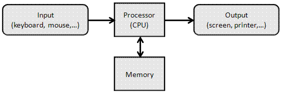<br><sub>Fig 15 -Basic Operations of a Computer - (<a href='http://cs.sru.edu/~mullins/cpsc100book/module02_introduction/module02-04_introduction.html'>Work by Paul Mullins</a>) </sub></div>

<br>

**Source Code**: is the code written by the programmer in a programming language

Ex:

```java
package application;

import java.util.Scanner;
import java.util.Locale;

public class Program {

	public static void main(String[] args) {
		
		Locale.setDefault(Locale.US);
		Scanner sc = new Scanner(System.in);
		
        	double x, y, media;
        
		System.out.print("Enter the First Number: ");
        	x = sc.nextDouble(); //input: 2
        	System.out.print("Enter the Second Number: ");
        	y = sc.nextDouble(); //input: 4
        
        	media = (x + y)/2.0;
        
       		System.out.println("Media = " + media);
        	sc.close();
	}
}

/*
Console

----input---
Enter the First Number: 2.0
Enter the First Number: 4.0

----output---
Media = 3.0
*/
```
<br>

<div align="center"><br><sub>Fig 1 - Compilation and Interpretation Process</sub></div>

<br>

<div align="center">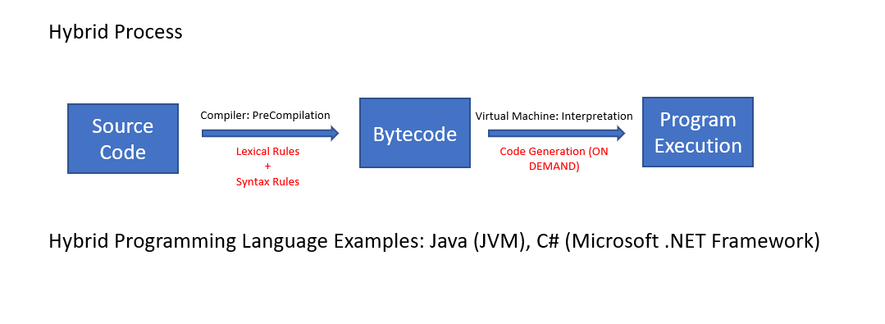<br><sub>Fig 2 - Hybrid Process</sub></div>

<br>

- **Compilation**:
	- Program Speed
	- Compiler Assistance Before Execution
	- Disadvantage: Platform dependence of the generated binary code

- **Interpretation**:
	- Flexibility of Maintaining the Application in Production
	- Expressiveness of Language
	- Source Code does not need to be Recompiled to run on different platform
	- Disadvantage: Execution speed compared to compiled languages.

- **Hybrid**:
	- Compiler Assistance Before Execution
	- Source Code does not need to be Recompiled to run on different platform

#### <a name="chapter1part2.2"></a>Chapter 1 - Part 2.2: The Java Virtual Machine (JVM)

JVM is the Java Virtual Machine to execute Java Programs in your system.

Java take the advantages of compilation and interpretation and create the hybrid interpretation with JVM.

Below, there some of compilation process examples in Java:

<br>

<div align="center">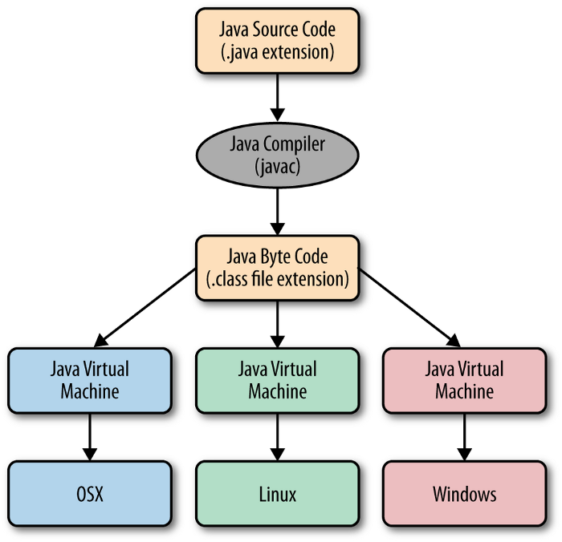<br><sub>Fig 3 - Compilation Process in Java - (<a href='https://medium.com/@PrayagBhakar/lesson-2-behind-the-scenes-4df6a461f31f'>Work by Prayag Bhakar</a>) </sub></div>

<br>

<div align="center">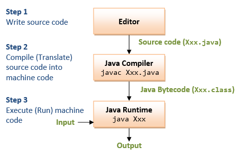<br><sub>Fig 4 - Compilation Process in Java - (<a href='https://www3.ntu.edu.sg/home/ehchua/programming/java/J1a_Introduction.html'>Work by Chua Hock-Chuan</a>) </sub></div>

<br>

<div align="center"><br><sub>Fig 5 - Compilation Process in Java - (<a href='https://www.w3schools.in/java-tutorial/compile-java-file-using-javac/'>Work by  w3schools</a>) </sub></div>

<br>

The process to execute the bytecode is called JIT (Just in Time) Compilation. Is more faster than interpretation because the compiler revise before the run time, if the bytecode is lexical and syntactical correct.

<br>

<div align="center">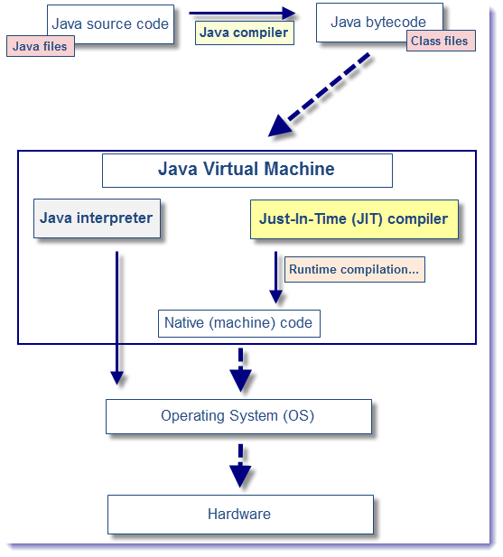<br><sub>Fig 6 - Compilation Process in Java - (<a href='http://javaeesupportpatterns.blogspot.com/2013/07/java-just-in-time-compilation-more-than.html'>Work by javaeesupportpatterns</a>) </sub></div>

<br>

The Java Virtual Machine (JVM) is the heart of the Java platform. It's an abstract computing machine, meaning it's a specification that can be implemented in different ways by different vendors. The JVM's primary role is to execute Java bytecode.

**What is Bytecode?**

When you write Java code, it's saved in .java files. These files are then compiled by the Java compiler (javac) into .class files. These .class files contain bytecode, which is a platform-independent set of instructions that the JVM can understand and execute.

Example:

Let's say you have a simple Java program:

```java
public class Example {
    public static void main(String[] args) {
        int x = 10;
        int y = 5;
        int sum = x + y;
        System.out.println("Sum: " + sum);
    }
}
```

After compiling this code, the Example.class file will contain bytecode instructions that tell the JVM how to perform the addition and print the result. You can inspect the bytecode using the javap command-line tool (part of the JDK): javap -c Example. The output will be assembly-like instructions.

**Key Functions of the JVM**

- **Loading Bytecode**: The JVM loads .class files containing bytecode into memory.
- **Bytecode Verification**: Before executing bytecode, the JVM verifies that it's valid and doesn't violate any security constraints. This helps prevent malicious code from harming the system.
- **Execution**: The JVM executes the bytecode instructions. This can be done through interpretation or just-in-time (JIT) compilation.
- **Just-in-Time (JIT) Compilation**: The JIT compiler is a part of the JVM that translates bytecode into native machine code during runtime. This significantly improves performance because native code executes much faster than interpreted bytecode. The JIT compiler analyzes the bytecode and identifies frequently executed sections (hotspots) to optimize.
- **Memory Management**: The JVM automatically manages memory through garbage collection. It allocates memory for objects and reclaims memory that is no longer in use, preventing memory leaks.

**JVM Implementations**

Different vendors provide their own implementations of the JVM specification. Some popular JVM implementations include:

- **HotSpot**: Developed by Oracle, HotSpot is the most widely used JVM. It's known for its advanced JIT compilation and garbage collection capabilities.
- **OpenJ9**: Developed by Eclipse, OpenJ9 is another high-performance JVM that's designed for cloud environments.
- **GraalVM**: A polyglot VM that supports multiple languages, including Java. GraalVM can also compile Java code ahead-of-time (AOT) for faster startup times.

**Platform Independence**

The JVM is what makes Java platform-independent. Because the bytecode is executed by the JVM, the same Java code can run on any operating system that has a JVM implementation. This "write once, run anywhere" (WORA) capability is a key advantage of Java.

Example:

You can compile your Java code on a Windows machine and then run the resulting .class files on a Linux server, as long as both machines have a compatible JVM installed.

**Hypothetical Scenario**

Imagine a company developing a cross-platform application that needs to run on Windows, macOS, and Linux. By using Java, they can write the application once and deploy it to all three platforms without having to rewrite the code for each operating system. The JVM handles the platform-specific details, allowing the developers to focus on the application logic.

#### <a name="chapter1part2.3"></a>Chapter 1 - Part 2.3: The Java Runtime Environment (JRE)

The Java Runtime Environment (JRE) provides the necessary resources to run Java applications. It includes the JVM, along with libraries and other components needed to execute Java bytecode.

**Components of the JRE**

- **JVM**: As mentioned earlier, the JVM is the core component of the JRE.
- **Java Class Libraries**: The JRE includes a set of standard Java class libraries that provide pre-built functionality for common tasks, such as input/output, networking, and data structures. These libraries are essential for developing Java applications.
- **Other Supporting Files**: The JRE also includes other supporting files, such as configuration files and security policies.

**JRE vs. JVM**

It's important to understand the difference between the JRE and the JVM. The JVM is the abstract specification for executing bytecode, while the JRE is a concrete implementation of that specification, along with the necessary libraries and supporting files. You can think of the JRE as a package that contains the JVM and everything else needed to run Java applications.

Analogy:

Think of the JVM as an engine and the JRE as the entire car. The engine (JVM) is responsible for running the car, but the car (JRE) also includes the wheels, seats, and other components needed to make it functional.

**Using the JRE**

When you want to run a Java application, you need to have the JRE installed on your system. The JRE provides the java command, which you use to launch Java applications.

Example:

To run a Java application named MyApp.class, you would use the following command:

```
java MyApp
```

This command tells the JRE to load the MyApp.class file, start the JVM, and execute the bytecode in the file.

**Real-World Example**

Consider a web server that hosts Java-based web applications. The server needs to have the JRE installed to run these applications. When a user accesses a web page that requires Java code to be executed, the JRE on the server handles the execution of that code.

**Hypothetical Scenario**

A small business uses a Java-based accounting application. Each employee who needs to use the application must have the JRE installed on their computer. The JRE allows them to run the application and access the company's financial data.

#### <a name="chapter1part2.4"></a>Chapter 1 - Part 2.4: The Java Development Kit (JDK)

The Java Development Kit (JDK) is a superset of the JRE. It includes everything in the JRE, plus additional tools and utilities needed for developing Java applications.

**Components of the JDK**

- **JRE**: The JDK includes the complete JRE.
- **Java Compiler (javac)**: The javac compiler translates Java source code (.java files) into bytecode (.class files).
- **Java Debugger (jdb)**: The jdb debugger allows you to debug Java code by stepping through the code, inspecting variables, and setting breakpoints.
- **Java Archive (jar)**: The jar tool allows you to package Java class files and resources into a single archive file (.jar file).
- **Java Documentation Generator (javadoc)**: The javadoc tool generates HTML documentation from Java source code comments.
- **Other Development Tools**: The JDK also includes other development tools, such as jconsole (for monitoring JVM performance) and jprofiler (for profiling Java applications).

**JDK vs. JRE**

The key difference between the JDK and the JRE is that the JDK is for developers, while the JRE is for users who just want to run Java applications. If you want to write, compile, and debug Java code, you need the JDK. If you just want to run Java applications, you only need the JRE.

Analogy:

Think of the JDK as a mechanic's toolkit and the JRE as the car itself. The mechanic (developer) needs the toolkit (JDK) to build and repair cars, while the driver (user) only needs the car (JRE) to drive.

**Using the JDK**

When you install the JDK, you get access to the javac compiler, which you use to compile your Java code.

Example:

To compile the Example.java file, you would use the following command:

```
javac Example.java
```

This command creates the Example.class file containing the bytecode.

**Real-World Example**

A software development company uses the JDK to develop and maintain its Java-based applications. The developers use the javac compiler to compile the code, the jdb debugger to debug the code, and the jar tool to package the applications for deployment.

**Hypothetical Scenario**

A student learning Java needs to install the JDK on their computer to write and run Java programs. The JDK provides the necessary tools for compiling, debugging, and testing their code.

#### <a name="chapter1part2.5"></a>Chapter 1 - Part 2.5: Relationship Between JVM, JRE, and JDK

The JVM, JRE, and JDK are closely related. The JDK includes the JRE, and the JRE includes the JVM.

```
JDK (Java Development Kit)
  |
  +-- JRE (Java Runtime Environment)
      |
      +-- JVM (Java Virtual Machine)
```

- The JDK is the complete development environment for Java applications.
- The JRE is the runtime environment for executing Java applications.
- The JVM is the virtual machine that executes Java bytecode.

#### <a name="chapter1part2.6"></a>Chapter 1 - Part 2.6: Choosing the Right Version

When installing the JDK or JRE, you'll need to choose a version. Oracle releases new versions of Java regularly, and each version may include new features, performance improvements, and security updates. It's generally recommended to use the latest stable version of the JDK or JRE, unless you have a specific reason to use an older version.

**Long-Term Support (LTS) Versions**

Oracle designates certain Java versions as Long-Term Support (LTS) versions. LTS versions receive extended support and security updates, making them a good choice for production environments. As of this writing, Java 11 and Java 17 are LTS versions.

**Considerations**

- **Compatibility**: Make sure that the version of the JDK or JRE you choose is compatible with your applications and libraries.
- **New Features**: Consider whether you need the new features and improvements offered by the latest version.
- **Support**: Choose an LTS version for long-term stability and support.

#### <a name="chapter1part3"></a>Chapter 1 - Part 3: Installing the Java Development Kit (JDK)

Installing the Java Development Kit (JDK) is the first crucial step in your journey to becoming a Java programmer. The JDK provides the necessary tools to compile, run, and debug Java code. Without it, you won't be able to execute the programs you write. This lesson will guide you through the process of downloading and installing the JDK on your system, ensuring you have a solid foundation for the rest of the course.

#### <a name="chapter1part3.1"></a>Chapter 1 - Part 3.1: Understanding the JDK and its Components

The Java JDK come with some of most used packages to help the developer like awt, beans, io, lang, math, net, nio, sql, util and each package have a class or a interface.

<br>

<div align="center">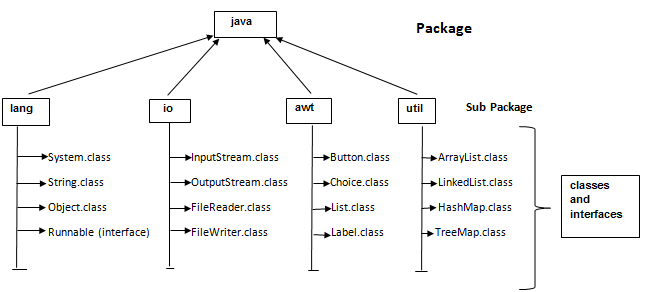<br><sub>Fig 8 -Java Packages - (<a href='http://www.wellnwill.com/tutorial/core-java/package/package'>Work by Well N Will</a>) </sub></div>

<br>

Oracle have a documentation about all his packages: https://docs.oracle.com/javase/8/docs/api/

<br>

<div align="center">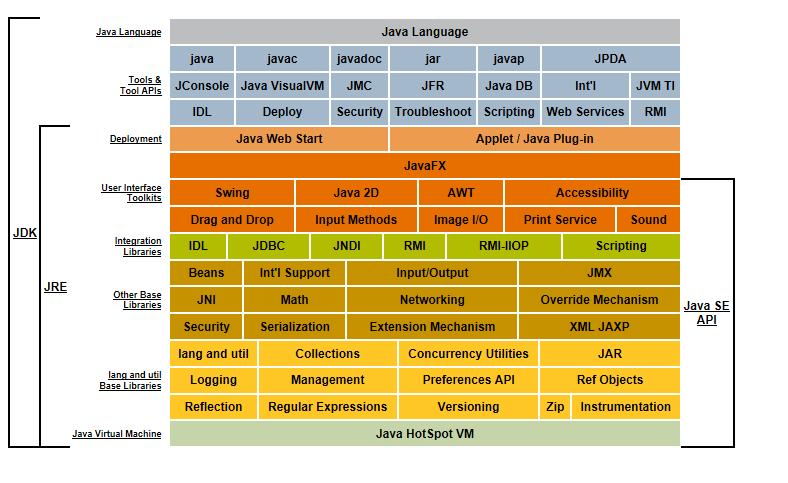<br><sub>Fig 9 -Java Packages - (<a href='https://docs.oracle.com/javase/8/docs/technotes/guides/desc_jdk_structure.html'>Work by Oracle</a>) </sub></div>

<br>

One of the most famous used packages is java.util.collections and java.util.map

<br>

<div align="center"><br><sub>Fig 10 -Java Packages - (<a href='https://ukode.es/colecciones-i-introduccion-y-conceptos-basicos/'>Work by Jose Antonio Simón</a>) </sub></div>

<br>

<div align="center">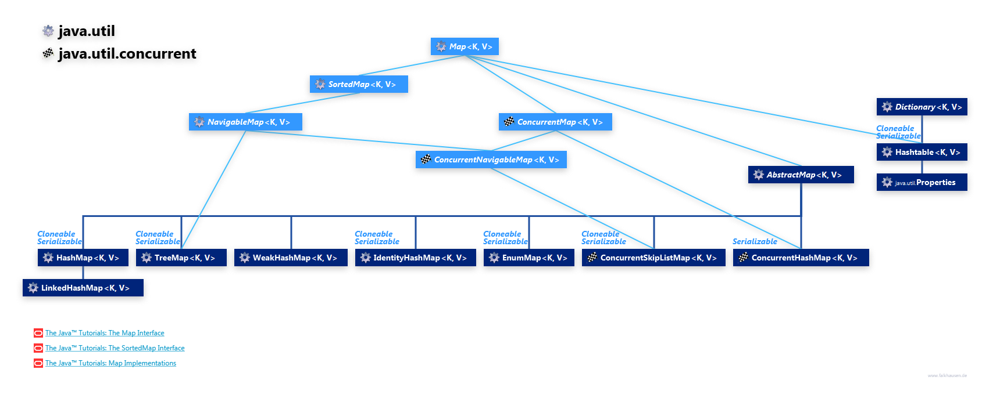<br><sub>Fig 11 -Java Packages - (<a href='https://ukode.es/colecciones-i-introduccion-y-conceptos-basicos/'>Work by Jose Antonio Simón</a>) </sub></div>

<br>

<div align="center"><br><sub>Fig 12 -Java Packages - (<a href='https://www.javatpoint.com/collections-in-java'>Work by JavaPoint</a>) </sub></div>

<br>

The Java Development Kit (JDK) is a software development environment used for developing Java applications. It includes the Java Runtime Environment (JRE), compilers, debuggers, and other tools necessary for developing, testing, and running Java programs.

**Key Components of the JDK**

- **Java Runtime Environment (JRE)**: The JRE provides the runtime environment in which Java programs can execute. It includes the Java Virtual Machine (JVM), core classes, and supporting files. You encountered the JRE in the previous lesson when learning about the Java ecosystem.
- **Java Compiler (javac)**: This tool compiles Java source code (.java files) into bytecode (.class files) that can be executed by the JVM.
- **Java Debugger (jdb)**: This tool helps you find and fix errors in your Java code.
- **Java Archive (jar)**: This tool packages Java class files and related resources into a single archive file.
- **Other Tools**: The JDK also includes other useful tools such as javadoc (for generating API documentation) and jps (for listing running Java processes).

**Why is the JDK Necessary?**

The JDK is essential because it provides the tools needed to translate human-readable Java code into machine-executable bytecode. Without the JDK, you can't compile your code, and therefore, you can't run it. The JRE alone is sufficient for running pre-compiled Java applications, but the JDK is required for developing them.

#### <a name="chapter1part3.2"></a>Chapter 1 - Part 3.2: Downloading the JDK

The JDK can be downloaded from several sources, but the most common and recommended source is Oracle. Alternatively, you can use OpenJDK builds from vendors like Adoptium (Eclipse Temurin).

**Downloading from Oracle**

- **Visit the Oracle Website**: Go to the Oracle Java SE Downloads page.
- **Choose the Appropriate Version**: Select the latest Long-Term Support (LTS) version of Java. LTS versions are supported for a longer period, making them a stable choice for development.
- **Select Your Operating System**: Choose the appropriate installer for your operating system (Windows, macOS, or Linux).
- **Download the Installer**: Download the installer file. You may need to create an Oracle account to proceed with the download.

**Downloading from Adoptium (Eclipse Temurin)**

- **Visit the Adoptium Website**: Go to the Adoptium website.
- **Choose the Appropriate Version**: Select the latest LTS version of Java.
- **Select Your Operating System**: Choose the appropriate installer for your operating system (Windows, macOS, or Linux).
- **Download the Installer**: Download the installer file.

#### <a name="chapter1part3.3"></a>Chapter 1 - Part 3.3: Installing the JDK

The installation process varies slightly depending on your operating system.

**Installing on Windows**

- **Run the Installer**: Double-click the downloaded installer file to start the installation process.

- **Follow the Prompts**: Follow the on-screen instructions. You'll typically be prompted to choose an installation directory. The default location is usually fine.

- **Set the JAVA_HOME Environment Variable**:
  - Open the System Properties window (search for "environment variables" in the Start menu).
  - Click "Environment Variables".
  - Under "System variables", click "New".
  - Enter JAVA_HOME as the variable name.
  - Enter the installation directory of the JDK as the variable value (e.g., C:\Program Files\Java\jdk-17).
  - Click "OK" to close all windows.
 
- **Update the Path Environment Variable**:
  - In the System Variables section, find the Path variable and select it, then click "Edit".
  - Click "New" and add %JAVA_HOME%\bin to the list.
  - Click "OK" to close all windows.
 
- **Verify the Installation**: Open a new command prompt window and type java -version. You should see the version information for the installed JDK.

**Installing on macOS**

- **Run the Installer**: Double-click the downloaded .dmg file to mount it.

- **Open the Package**: Double-click the .pkg file to start the installation process.

- **Follow the Prompts**: Follow the on-screen instructions. The JDK will typically be installed in /Library/Java/JavaVirtualMachines/.

- **Set the JAVA_HOME Environment Variable (Optional)**: While macOS doesn't strictly require setting JAVA_HOME, some tools might rely on it. You can set it in your .bash_profile or .zshrc file:
  - Open Terminal.
  - Type nano ~/.zshrc (or nano ~/.bash_profile if you're using Bash).
  - Add the following lines:

```
export JAVA_HOME=$(/usr/libexec/java_home)
export PATH=$JAVA_HOME/bin:$PATH
```

  - Press Ctrl+X, then Y, then Enter to save and exit.
  - Type source ~/.zshrc (or source ~/.bash_profile) to apply the changes.

- **Verify the Installation**: Open a new Terminal window and type java -version. You should see the version information for the installed JDK.

**Installing on Linux**

The installation process on Linux varies depending on the distribution. Here are instructions for Debian/Ubuntu and Fedora/CentOS.

**Debian/Ubuntu**

- **Download the .deb Package**: Download the .deb package for your architecture.

- **Install the Package**: Open a terminal and navigate to the directory where you downloaded the package. Then, run the following command:

```
sudo apt install ./<package_name>.deb
```

Replace <package_name>.deb with the actual name of the downloaded file.

- **Set the JAVA_HOME Environment Variable**:
  - Open the /etc/environment file with root privileges:
 
```
sudo nano /etc/environment
```

  - Add the following line, replacing /usr/lib/jvm/java-17-openjdk-amd64 with the actual path to your JDK installation:

```
JAVA_HOME="/usr/lib/jvm/java-17-openjdk-amd64"
```

  - Save the file and exit.
  - Apply the changes by running:

```
source /etc/environment
```

- **Update the Path Environment Variable**:

  - Edit the ~/.bashrc or ~/.zshrc file:
 
```
nano ~/.bashrc
```

  - Add the following lines:

```
export PATH="$JAVA_HOME/bin:$PATH"
```

- Save the file and exit.
- Apply the changes by running:

```
source ~/.bashrc
```

- **Verify the Installation**: Open a new terminal window and type java -version. You should see the version information for the installed JDK.

**Fedora/CentOS**

- **Download the .rpm Package**: Download the .rpm package for your architecture.

- **Install the Package**: Open a terminal and navigate to the directory where you downloaded the package. Then, run the following command:

```
sudo rpm -i <package_name>.rpm
```

Replace <package_name>.rpm with the actual name of the downloaded file.

- **Set the JAVA_HOME Environment Variable**:
  
  - Open the /etc/environment file with root privileges:
 
```
sudo nano /etc/environment
```

  - Add the following line, replacing /usr/lib/jvm/java-17-openjdk-amd64 with the actual path to your JDK installation:

```
JAVA_HOME="/usr/lib/jvm/java-17-openjdk-amd64"
```

- Save the file and exit.
- Apply the changes by running:

```
source /etc/environment
```

- **Update the Path Environment Variable**:
  - Edit the ~/.bashrc or ~/.zshrc file:
 
```
nano ~/.bashrc
```

  - Add the following lines:

```
export PATH="$JAVA_HOME/bin:$PATH"
```

- Save the file and exit.
- Apply the changes by running:

```
source ~/.bashrc
```

- **Verify the Installation**: Open a new terminal window and type java -version. You should see the version information for the installed JDK.

#### <a name="chapter1part3.4"></a>Chapter 1 - Part 3.4: Setting Environment Variables

Setting environment variables is a crucial step in the installation process. These variables tell your operating system where to find the Java executables.

**Why are Environment Variables Important?**

Environment variables allow you to run Java commands from any directory in your terminal or command prompt. Without them, you would have to navigate to the JDK's bin directory every time you want to compile or run a Java program.

```**JAVA_HOME**```

The JAVA_HOME variable points to the installation directory of the JDK. This variable is used by many Java-based tools and applications to locate the JDK.

```**Path**```

The Path variable is a list of directories that the operating system searches when you execute a command. By adding the JDK's bin directory to the Path, you can run Java commands like java and javac from any directory.

#### <a name="chapter1part3.5"></a>Chapter 1 - Part 3.5: Verifying the Installation

After installing the JDK and setting the environment variables, it's important to verify that the installation was successful.

**Using the Command Line**

Open a new command prompt or terminal window and type the following command:

```
java -version
```

If the JDK is installed correctly, you should see output similar to the following:

```
java 17.0.2 2022-01-18 LTS
Java(TM) SE Runtime Environment (build 17.0.2+8-LTS-86)
Java HotSpot(TM) 64-Bit Server VM (build 17.0.2+8-LTS-86, mixed mode, sharing)
```

This output confirms that the Java runtime environment is installed and accessible.

Next, type the following command:

```
javac -version
```

If the JDK is installed correctly, you should see output similar to the following:

```
javac 17.0.2
```

This output confirms that the Java compiler is installed and accessible.

If you don't see this output, double-check that you have set the JAVA_HOME and Path environment variables correctly and that you have opened a new command prompt or terminal window after setting them.

#### <a name="chapter1part3.6"></a>Chapter 1 - Part 3.6: Troubleshooting Common Installation Issues

Even with careful instructions, installation issues can arise. Here are some common problems and their solutions:

**```java``` or ```javac``` Command Not Found**

This usually indicates that the Path environment variable is not set correctly. Double-check that you have added the JDK's bin directory to the Path and that you have opened a new command prompt or terminal window.

**Incorrect Java Version**

If you have multiple versions of Java installed on your system, the java -version command might show the wrong version. Ensure that the JAVA_HOME variable points to the correct JDK installation directory.

**Installation Errors**

If you encounter errors during the installation process, consult the JDK documentation or search online for solutions specific to your operating system and the error message you received.

#### <a name="chapter1part4"></a>Chapter 1 - Part 4: Setting Up a Java Development Environment (IDE): IntelliJ IDEA or Eclipse

Setting up a Java Development Environment (IDE) is a crucial step for any aspiring Java programmer. An IDE provides a comprehensive suite of tools that streamline the coding process, making it easier to write, debug, and run Java applications. This lesson will guide you through the process of setting up two popular IDEs: IntelliJ IDEA and Eclipse. We'll explore their key features, installation procedures, and basic configurations to get you ready to write your first Java programs.

#### <a name="chapter1part4.1"></a>Chapter 1 - Part 4.1: Understanding Integrated Development Environments (IDEs)

An Integrated Development Environment (IDE) is a software application that provides comprehensive facilities to computer programmers for software development. An IDE normally consists of at least a source code editor, build automation tools, and a debugger.

**Key Features of an IDE**

- **Source Code Editor**: A text editor designed specifically for writing and editing code, with features like syntax highlighting, code completion, and code formatting.
- **Build Automation Tools**: Tools that automate the process of compiling, linking, and packaging code into executable programs.
- **Debugger**: A tool that allows developers to step through code, inspect variables, and identify and fix errors.
- **Compiler**: Translates human-readable code into machine-executable code.
- **Interpreter**: Executes code line by line.
- **Version Control Integration**: Integration with version control systems like Git, allowing developers to track changes to their code and collaborate with others.
- **Testing Tools**: Tools for writing and running unit tests and integration tests.
- **Refactoring Tools**: Tools for restructuring code without changing its behavior, making it easier to maintain and improve.

**Why Use an IDE?**

Using an IDE offers several advantages over using a simple text editor and command-line tools:

- **Increased Productivity**: IDEs automate many common tasks, such as compiling code, running tests, and debugging, which can save developers a significant amount of time.
- **Improved Code Quality**: IDEs provide features like syntax highlighting, code completion, and code formatting, which can help developers write cleaner, more readable code.
- **Easier Debugging**: IDEs provide powerful debugging tools that allow developers to step through code, inspect variables, and identify and fix errors more easily.
- **Better Collaboration**: IDEs integrate with version control systems, making it easier for developers to collaborate on projects.

#### <a name="chapter1part4.2"></a>Chapter 1 - Part 4.2: IntelliJ IDEA

IntelliJ IDEA is a popular Java IDE known for its intelligent code assistance, comprehensive feature set, and user-friendly interface. It is developed by JetBrains and is available in two editions: Community (free and open-source) and Ultimate (commercial). For beginners, the Community Edition is sufficient.

**Installing IntelliJ IDEA**

- **Download IntelliJ IDEA**: Go to the JetBrains website (https://www.jetbrains.com/idea/download/) and download the Community Edition for your operating system (Windows, macOS, or Linux).

- **Run the Installer**: Once the download is complete, run the installer and follow the on-screen instructions.

- **Installation Options**: During the installation process, you may be prompted to configure some options, such as:
  - **Installation Location**: Choose the directory where you want to install IntelliJ IDEA.
  - **Create Desktop Shortcut**: Create a shortcut on your desktop for easy access to IntelliJ IDEA.
  - **Update PATH variable (restart needed)**: Add IntelliJ IDEA's bin folder to your system's PATH variable, allowing you to run IntelliJ IDEA from the command line.
  - **Associate .java**: Associate .java files with IntelliJ IDEA, so that double-clicking a .java file will open it in IntelliJ IDEA.
 
- **Complete the Installation**: Once you have configured the options, click "Install" to begin the installation process.

- **Run IntelliJ IDEA**: After the installation is complete, you can run IntelliJ IDEA from the Start menu (Windows) or the Applications folder (macOS).

**Configuring IntelliJ IDEA**

- **Import Settings (Optional)**: If you have used IntelliJ IDEA before, you can import your settings from a previous installation. Otherwise, choose "Do not import settings."
- **UI Theme**: Choose a UI theme (e.g., Light or Dark).
- **Featured Plugins**: IntelliJ IDEA suggests installing some featured plugins. You can install them now or later.
- **Start Using IntelliJ IDEA**: Click "Start using IntelliJ IDEA" to open the IDE.

**Creating a New Java Project in IntelliJ IDEA**

- **Open IntelliJ IDEA**: Launch IntelliJ IDEA.
- **Create New Project**: On the Welcome screen, click "New Project."
- **Choose Project Type**: In the "New Project" dialog, select "Java" from the left-hand menu.
- **Project SDK**: Ensure that the Project SDK is set to the JDK you installed in the previous lesson. If it's not, click "Install JDK" or select the correct JDK from the dropdown menu.
- **Project Template**: You can choose a template or create an empty project. For a simple project, select "Create project from template" and choose "Command Line App".
- **Project Name and Location**: Enter a name for your project (e.g., "HelloWorld") and choose a location to save the project files.
- **Finish**: Click "Finish" to create the project.

**IntelliJ IDEA Interface Overview**

- **Project Tool Window**: Displays the project structure, including source files, libraries, and other resources.
- **Editor Window**: Where you write and edit your code.
- **Navigation Bar**: Located at the top of the editor window, it shows the current file path and allows you to navigate to other files.
- **Run/Debug Tool Window**: Displays the output of your program and allows you to debug your code.
- **Terminal Tool Window**: Provides a command-line interface for running commands and scripts.

#### <a name="chapter1part4.3"></a>Chapter 1 - Part 4.3: Eclipse

Eclipse is another popular open-source IDE widely used for Java development. It's known for its flexibility, extensive plugin ecosystem, and strong community support.

**Installing Eclipse**

- **Download Eclipse**: Go to the Eclipse website (https://www.eclipse.org/downloads/) and download the Eclipse IDE for Java Developers for your operating system.
- **Run the Installer**: Run the installer and follow the on-screen instructions.
- **Choose Installation Folder**: Select the directory where you want to install Eclipse.
- **Launch Eclipse**: Once the installation is complete, you can launch Eclipse from the Start menu (Windows) or the Applications folder (macOS).

**Configuring Eclipse**

- **Workspace**: When you first launch Eclipse, you will be prompted to choose a workspace. A workspace is a directory where Eclipse stores your project files and settings. Choose a location for your workspace and click "Launch."
- **Welcome Screen**: The Eclipse Welcome screen provides links to tutorials, documentation, and other resources. You can close the Welcome screen to start using Eclipse.

**Creating a New Java Project in Eclipse**

- **Open Eclipse**: Launch Eclipse.
- **Create New Project**: Go to File > New > Java Project.
- **Project Name**: Enter a name for your project (e.g., "HelloWorld").
- **Use default location**: You can either use the default location or specify a custom location for your project.
- **JRE**: Ensure that the JRE is set to the JDK you installed in the previous lesson. If it's not, click "Configure JREs" and add the correct JDK.
- **Layout**: Keep the default project layout.
- **Finish**: Click "Finish" to create the project.

**Eclipse Interface Overview**

- **Package Explorer**: Displays the project structure, including source files, libraries, and other resources.
- **Editor Area**: Where you write and edit your code.
- **Outline View**: Displays the structure of the current file, including classes, methods, and fields.
- **Console View**: Displays the output of your program.
- **Problems View**: Displays errors and warnings in your code.

#### <a name="chapter1part5"></a>Chapter 1 - Part 5: Writing and Running Your First Java Program: "Hello, World!"

Let's embark on the journey of writing and running your very first Java program. This is a pivotal step in becoming a Java programmer. We'll create the classic "Hello, World!" program, which serves as a fundamental introduction to the structure and execution of Java code. This exercise will solidify your understanding of the Java Development Kit (JDK) and the Integrated Development Environment (IDE) you set up in the previous lessons. By the end of this lesson, you'll have a tangible result – a working Java program – and a foundational understanding of how to build upon it.

#### <a name="chapter1part5.1"></a>Chapter 1 - Part 5.1: Creating Your First Java Program: "Hello, World!"

The "Hello, World!" program is a time-honored tradition in programming. It's a simple program that displays the text "Hello, World!" on the console. Creating this program in Java involves a few key steps: writing the code, saving the file, compiling the code, and running the compiled code.

**Step 1: Writing the Code**

Open your chosen IDE (IntelliJ IDEA or Eclipse). Create a new Java file. The name of the file should match the name of the class you'll define within it, and it should end with the .java extension. For this example, let's name the file HelloWorld.java.

Now, enter the following code into the HelloWorld.java file:

```java
public class HelloWorld { // Declares a class named HelloWorld
    public static void main(String[] args) { // Declares the main method
        System.out.println("Hello, World!"); // Prints "Hello, World!" to the console
    }
}
```

Let's break down this code:

- ```**public class HelloWorld { ... }**```: This line declares a class named HelloWorld. In Java, everything resides within a class. The public keyword means that this class can be accessed from anywhere in your program. Classes are the fundamental building blocks of Java programs, and we'll delve deeper into them in Module 5.

- ```**public static void main(String[] args) { ... }**```: This is the main method. It's the entry point of your program – the code that the Java Virtual Machine (JVM) executes first.
  - ```**public**```: Similar to the class, public means this method can be accessed from anywhere.
  - ```**static**```: This keyword means that the method belongs to the HelloWorld class itself, rather than to an instance of the HelloWorld class. We'll explore static methods in more detail in Module 6.
  - ```**void**```: This indicates that the method doesn't return any value. Methods can perform actions and optionally return a result.
  - ```**main(String[] args)**```: This is the name of the method (main) and its parameters. String[] args is an array of strings that can be used to pass arguments to the program from the command line. We won't use command-line arguments in this simple program, but they can be useful for more complex applications.
 
- ```**System.out.println("Hello, World!");**```: This line is the heart of the program. It prints the text "Hello, World!" to the console.
  - ```**System.out**```: This is a standard output stream in Java. It represents the console (your terminal or command prompt).
  - ```**println()**```: This is a method of the System.out object that prints a line of text to the console. The text to be printed is enclosed in double quotes " ".
 
**Step 2: Saving the File**

Save the file as HelloWorld.java in a directory of your choice. Make sure the file name matches the class name exactly (including capitalization).

**Step 3: Compiling the Code**

Before you can run the program, you need to compile it. Compilation is the process of translating the human-readable Java code into bytecode, which the JVM can understand and execute.

- **Using IntelliJ IDEA**: IntelliJ IDEA usually compiles your code automatically as you type. However, you can also manually compile the code by going to Build > Build Project.
- **Using Eclipse**: Eclipse also typically compiles your code automatically. If not, you can compile it by going to Project > Build Project.

If the compilation is successful, you won't see any error messages. If there are errors, the IDE will highlight them and provide descriptions to help you fix them. Common errors include typos, missing semicolons, and incorrect syntax.

**Step 4: Running the Code**

Once the code is compiled successfully, you can run it.

- **Using IntelliJ IDEA**: Right-click in the code editor and select Run 'HelloWorld.main()'. Alternatively, you can click the green "play" button in the gutter next to the main method declaration.
- **Using Eclipse**: Right-click in the code editor and select Run As > Java Application.

If everything is set up correctly, you should see the text "Hello, World!" printed on the console in your IDE.

#### <a name="chapter1part5.2"></a>Chapter 1 - Part 5.2: Understanding the Compilation Process

The compilation process is a crucial step in Java development. When you compile a Java program, the Java compiler (javac) takes your .java file as input and produces a .class file. This .class file contains the bytecode representation of your program. Bytecode is a platform-independent intermediate language that the JVM can execute.

The JVM then interprets or compiles this bytecode into machine code that is specific to the underlying operating system and hardware. This is what makes Java platform-independent – the same bytecode can run on any system that has a JVM.

#### <a name="chapter1part5.3"></a>Chapter 1 - Part 5.3: Common Errors and Troubleshooting

| Compile-time                                                                                                              | Runtime                                                                                                                              | 
| :------------------------------------------------------------------------------------------------------------------------ | :-----------------------------------------------------------------------------------------------------------------------------------:|
| The compile-time errors are the errors which are produced at the compile-time, and they are detected by the compiler.     | The runtime errors are the errors which are not generated by the compiler and produce an unpredictable result at the execution time. |
| In this case, the compiler prevents the code from execution if it detects an error in the program.]                       | In this case, the compiler does not detect the error, so it cannot prevent the code from the execution.                              |
| It contains the syntax and semantic errors such as missing semicolon at the end of the statement.                         | It contains the errors such as division by zero, determining the square root of a negative number.                                   |

Even with a simple program like "Hello, World!", you might encounter errors. Here are some common errors and how to fix them:

- ```**ClassNotFoundException**```: This error usually means that the JVM can't find the .class file for your program. Make sure that the file is in the correct directory and that the class name matches the file name. Also, ensure that the code has been compiled.
- ```**NoSuchMethodError**```: main: This error indicates that the JVM can't find the main method in your class. Double-check that the main method is declared exactly as public static void main(String[] args).
- ```**Syntax errors**```: These errors are usually caused by typos, missing semicolons, or incorrect syntax. The IDE will typically highlight these errors and provide descriptions to help you fix them. Pay close attention to the error messages and carefully review your code.

#### <a name="chapter1part6"></a>Chapter 1 - Part 6: Understanding Basic Java Program Structure

Understanding the basic structure of a Java program is crucial for writing any Java code. It's like learning the alphabet before writing sentences. This lesson will break down the essential components of a Java program, explaining each part in detail and providing examples to illustrate how they work together. By the end of this lesson, you'll be able to read, understand, and write simple Java programs with confidence, setting a solid foundation for more advanced topics.

Java is an object-oriented language and your base unit is the class.  Every Code in Java have to be in a class.

The classes is organize in packages and the packages is organize in modules. A Java application is a set of modules with packages.

Bellow, there is a example of a Java application:

<br>

<div align="center">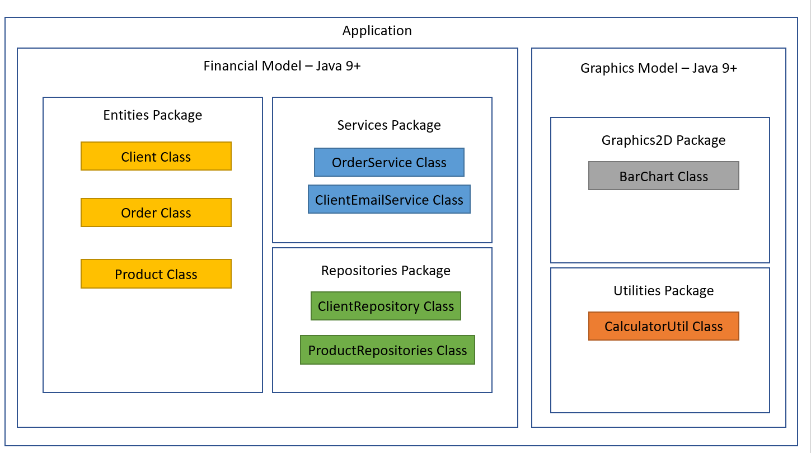<br><sub>Fig 7 - Application Structure in Java Application </sub></div>

<br>

#### <a name="chapter1part6.1"></a>Chapter 1 - Part 6.1: Anatomy of a Java Program

Every Java program has a specific structure that the Java compiler expects. Understanding this structure is essential for writing code that compiles and runs correctly. The basic structure consists of the following key elements:

- **Class Declaration**: This is the foundation of any Java program. Everything in Java resides inside a class.
- **main Method**: This is the entry point of your program. When you run a Java program, the Java Virtual Machine (JVM) starts executing code from the main method.
- **Statements**: These are the instructions that the program executes. They perform actions such as calculations, printing output, or making decisions.
- **Comments**: These are explanatory notes that you can add to your code to make it more readable. They are ignored by the compiler.

Let's examine each of these elements in detail.

**Class Declaration**

In Java, everything is an object, and every piece of code must reside inside a class. A class is a blueprint for creating objects. The basic syntax for declaring a class is:

```java
public class ClassName {
    // Class body (fields and methods)
}
```

- ```**public**```: This is an access modifier that determines the visibility of the class. public means that the class can be accessed from anywhere. We'll delve deeper into access modifiers in a later module.
- ```**class**```: This keyword is used to declare a class.
- ```**ClassName**```: This is the name of the class. Class names should start with an uppercase letter and follow the camel case naming convention (e.g., MyFirstClass, StudentDetails).
- ```**{}**```: The curly braces enclose the body of the class, which contains fields (variables) and methods (functions).

**Example**

```java
public class MyFirstProgram {
    // Class body will go here
}
```

In this example, we've declared a class named MyFirstProgram. Currently, the class body is empty, but we'll add more to it in the following sections.

**The main Method**

The main method is the entry point of any Java program. It's where the execution begins. Every standalone Java program must have a main method. The syntax for the main method is:

```java
public static void main(String[] args) {
    // Statements to be executed
}
```

Let's break down each part of this declaration:

- ```**public**```: As with the class declaration, public means that the main method can be accessed from anywhere.
- ```**static**```: This keyword means that the main method belongs to the class itself, rather than to an instance of the class. This allows the JVM to call the main method without creating an object of the class. We'll discuss static in more detail in Module 6.
- ```**void**```: This indicates that the main method does not return any value.
- ```**main**```: This is the name of the method. It's a special name that the JVM recognizes as the entry point of the program.
- ```**String[] args**```: This is the parameter list of the main method. It's an array of strings that can be used to pass command-line arguments to the program. We'll cover arrays in Module 4. For now, you can think of it as a way to provide input to your program when you run it from the command line.

**Example:**

```java
public class MyFirstProgram {
    public static void main(String[] args) {
        // Statements to be executed
    }
}
```

In this example, we've added the main method to our MyFirstProgram class. Now, we can add statements inside the main method to make our program do something.

**Statements**

Statements are the instructions that the program executes. They can be simple assignments, calculations, method calls, or control flow statements (which we'll cover in Module 3). Every statement in Java must end with a semicolon (;).

**Example:**

```java
public class MyFirstProgram {
    public static void main(String[] args) {
        System.out.println("Hello, World!"); // This is a statement
    }
}
```

In this example, we've added a statement that prints the text "Hello, World!" to the console.

- ```**System.out.println()**```: This is a method call that prints a line of text to the console. System.out is an object that represents the standard output stream (usually the console), and println() is a method of that object. We'll discuss methods in detail in Module 6.
- ```**"Hello, World!"**```: This is a string literal, which is a sequence of characters enclosed in double quotes.

**Comments**

Comments are explanatory notes that you can add to your code to make it more readable. They are ignored by the compiler. Java supports two types of comments:

- **Single-line comments**: These start with // and continue until the end of the line.
- **Multi-line comments**: These start with /* and end with */. They can span multiple lines.

**Example**:

```java
public class MyFirstProgram {
    public static void main(String[] args) {
        // This is a single-line comment
        /*
         * This is a multi-line comment.
         * It can span multiple lines.
         */
        System.out.println("Hello, World!"); // This statement prints "Hello, World!" to the console
    }
}
```

Comments are extremely useful for explaining what your code does, especially when it's complex. They can also be used to temporarily disable code by "commenting it out."

#### <a name="chapter1part6.2"></a>Chapter 1 - Part 6.2: Putting It All Together: A Complete Java Program

Let's combine all the elements we've discussed to create a complete Java program that calculates the sum of two numbers and prints the result to the console.

```java
public class SumCalculator { // Class declaration
    public static void main(String[] args) { // Main method
        int num1 = 10; // Declare and initialize the first number
        int num2 = 20; // Declare and initialize the second number
        int sum = num1 + num2; // Calculate the sum
        System.out.println("The sum of " + num1 + " and " + num2 + " is: " + sum); // Print the result
    }
}
```

In this program:

- We declare a class named SumCalculator.
- We define the main method, which is the entry point of the program.
- Inside the main method, we declare two integer variables, num1 and num2, and initialize them with the values 10 and 20, respectively. We'll learn more about variables and data types in Module 2.
- We calculate the sum of num1 and num2 and store the result in a variable named sum.
- We print the result to the console using System.out.println(). The + operator is used to concatenate strings and variables.

#### <a name="chapter1part6.3"></a>Chapter 1 - Part 6.3: Common Errors and How to Avoid Them

When you're starting out with Java, it's common to make mistakes. Here are some common errors related to program structure and how to avoid them:

- **Missing semicolon**: Every statement in Java must end with a semicolon. Forgetting the semicolon is a very common error.
  - **Example**: int x = 10 (missing semicolon)
  - **Solution**: int x = 10;
 
- **Incorrect class name**: The class name must match the name of the file (with the .java extension). For example, if your class is named MyClass, the file must be named MyClass.java.
  - **Example**: Class name is MyClass, but the file is named Myclass.java.
  - **Solution**: Ensure the class name and file name match exactly, including capitalization.
 
- **Missing main method**: If your program doesn't have a main method with the correct signature (public static void main(String[] args)), the JVM won't be able to find the entry point of your program.

  - **Example**: public void main(String[] args) (missing static)
  - **Solution**: Double-check the signature of the main method to make sure it's exactly public static void main(String[] args).
 
- **Mismatched curly braces**: Every opening curly brace ({) must have a corresponding closing curly brace (}). Mismatched curly braces can lead to syntax errors that are difficult to debug.

**Example:**

```java
public class MyClass {
    public static void main(String[] args) {
        System.out.println("Hello");
    // Missing closing curly brace for the main method
} // Closing curly brace for the class
```

- **Solution**: Use an IDE like IntelliJ IDEA or Eclipse, which can automatically match curly braces and highlight errors.

## <a name="chapter2"></a>Chapter 2: Java Fundamentals: Data Types, Variables, and Operators

#### <a name="chapter2part1"></a>Chapter 2 - Part 1: Understanding Primitive Data Types: int, double, boolean, char

Primitive data types are the fundamental building blocks for representing data in Java. Understanding them is crucial because they dictate the kind of values a variable can hold and the operations that can be performed on it. This lesson will provide a comprehensive overview of four essential primitive data types: int, double, boolean, and char. We'll explore their characteristics, how to declare and use them, and their significance in Java programming.

#### <a name="chapter2part1.1"></a>Chapter 2 - Part 1.1: Data Types in Java

In Java, we have the 8 primitive data types. Other types are Non-primitive like the diagram below:

<br>

<div align="center"><br><sub>Fig 13 -Java Data Types - (<a href='https://getkt.com/blog/reintroduction-to-java-data-types/'>Work by neotam</a>) </sub></div>

<br>

<div align="center">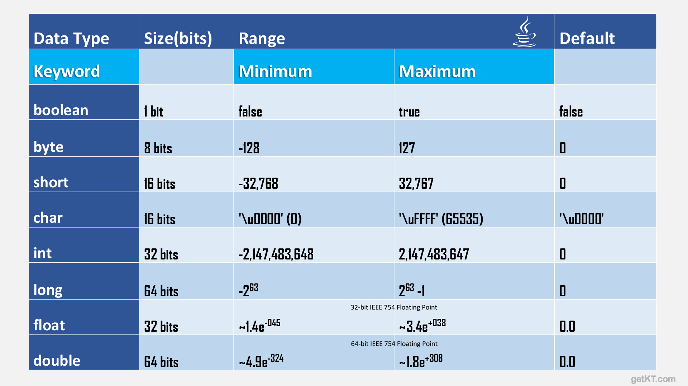<br><sub>Fig 14 -Java Data Primitive Types - (<a href='https://getkt.com/blog/reintroduction-to-java-data-types/'>Work by neotam</a>) </sub></div>

<br>

The size of a data (bits) is the number of the values this variable can store: The byte type can store 8 bits. Each bit store 1 or 0.

So: 2x2x2x2x2x2x2x2x2 = 2^8 = 256 possible values (-128 to 127)


To see the range of max and min of a type of variable do:

```java
int myMinIntValue = Integer.MIN_VALUE;
int myMaxIntValue = Integer.MAX_VALUE;
System.out.println("Integer Minimum Value = " + myMinIntValue);
System.out.println("Integer Maximum Value = " + myMaxIntValue);

int myMaxIntTest = 2_147_483_647; // another form to express

byte myMinByteValue = Byte.MIN_VALUE;
byte myMaxByteValue = Byte.MAX_VALUE;
System.out.println("Byte Minimum Value = " + myMinByteValue);
System.out.println("Byte Maximum Value = " + myMaxByteValue);

short myMinShortValue = Short.MIN_VALUE;
short myMaxShortValue = Short.MAX_VALUE;
System.out.println("Short Minimum Value = " + myMinShortValue);
System.out.println("Short Maximum Value = " + myMaxShortValue);
        
long myLongValue = 100; // Wrong -> Use L
long myMinLongValue = Long.MIN_VALUE;
long myMaxLongValue = Long.MAX_VALUE;
System.out.println("Long Minimum Value = " + myMinLongValue);
System.out.println("Long Maximum Value = " + myMaxLongValue);
long bigLongLiteralValue = 2_147_483_647_234L;
System.out.println(bigLongLiteralValue);

short bigShortLiteralValue = 32767;

/*

Output

Integer Minimum Value = -2147483648
Integer Maximum Value = 2147483647
Byte Minimum Value = -128
Byte Maximum Value = 127
Short Minimum Value = -32768
Short Maximum Value = 32767
Long Minimum Value = -9223372036854775808
Long Maximum Value = 9223372036854775807
2147483647234
*/
```

If you try to add a value in a Maximun or Minimun Value, will occur a overflow in a Maximun and underflow in Minimun. The Computer will convert the maximun to minimun and vice-versa

```java
int myMinIntValue = Integer.MIN_VALUE;
int myMaxIntValue = Integer.MAX_VALUE;
System.out.println("Integer Minimum Value = " + myMinIntValue);
System.out.println("Integer Maximum Value = " + myMaxIntValue);
System.out.println("Busted MAX value = " + (myMaxIntValue + 1)); // overflow
System.out.println("Busted MIN value = " + (myMinIntValue - 1)); // underflow

/*
Output

Integer Minimum Value = -2147483648
Integer Maximum Value = 2147483647
Busted MAX value = -2147483648
Busted MIN value = 2147483647
*/
```


Wrapper types(Reference Types) provided by java for corresponding Primitive Types

| Primitive Types  | Wrapper types(Reference Types) |
| :--------------: | :-----------------------------:|
| boolean          | Boolean                        | 
| byte             | Byte                           |
| character        | Character                      |
| short            | Short                          |
| int              | Int                            | 
| long             | Long                           |
| float            | Float                          |
| double           | double                         |

**Variables Name -> Camel Case** Ex: myVariable

**Class Name -> Pascal Case** Ex: MyClass


#### <a name="chapter2part1.2"></a>Chapter 2 - Part 1.2: Integer Data Type: int

The int data type is used to store whole numbers (integers) without any fractional part. It's one of the most commonly used data types in Java.

**Characteristics of int**

- **Size**: int occupies 4 bytes (32 bits) of memory.
- **Range**: The range of values that an int can hold is from -2,147,483,648 (-231) to 2,147,483,647 (231 - 1).
- **Usage**: Suitable for representing counts, indices, quantities, and other whole number values.

**Declaring and Initializing int Variables**

To declare an int variable, you use the int keyword followed by the variable name. To initialize it, you assign a value to it using the assignment operator =.

```java
int age; // Declaration
age = 30; // Initialization

int count = 100; // Declaration and initialization in one line
```

**Examples of int Usage**

```java
int numberOfStudents = 25;
int temperature = 72;
int score = 1000;
int negativeNumber = -5;
```

**int Operations**

You can perform various arithmetic operations on int variables, such as addition, subtraction, multiplication, and division.

```java
int x = 10;
int y = 5;

int sum = x + y; // sum is 15
int difference = x - y; // difference is 5
int product = x * y; // product is 50
int quotient = x / y; // quotient is 2
int remainder = x % y; // remainder is 0
```

**When to Use int**

Use int when you need to represent whole numbers within the specified range and when you don't need to store fractional parts. For example, representing the number of items in a shopping cart, the age of a person, or the score in a game.

#### <a name="chapter2part1.3"></a>Chapter 2 - Part 1.3: Floating-Point Data Type: double

The double data type is used to store floating-point numbers, which are numbers with a fractional part (decimal numbers).

**Characteristics of double**

**Size**: double occupies 8 bytes (64 bits) of memory.
**Range**: double can represent a wide range of values, both positive and negative, including very large and very small numbers. It uses the IEEE 754 standard for representing floating-point numbers.
**Precision**: double provides approximately 15-17 decimal digits of precision.
**Usage**: Suitable for representing measurements, scientific calculations, financial values, and other values that require fractional precision.

**Declaring and Initializing double Variables**

To declare a double variable, you use the double keyword followed by the variable name. To initialize it, you assign a floating-point value to it.

```java
double price; // Declaration
price = 19.99; // Initialization

double temperature = 98.6; // Declaration and initialization in one line
```

**Examples of double Usage**

```java
double pi = 3.14159;
double gravity = 9.81;
double bankBalance = 1234.56;
double percentage = 0.75;
```

**double Operations**

You can perform arithmetic operations on double variables, similar to int.

```java
double x = 10.5;
double y = 3.2;

double sum = x + y; // sum is 13.7
double difference = x - y; // difference is 7.3
double product = x * y; // product is 33.6
double quotient = x / y; // quotient is 3.28125
```

**When to Use double**

Use double when you need to represent numbers with fractional parts or when you require a wider range and higher precision than int can provide. For example, representing the price of an item, the temperature of a room, or the result of a scientific calculation.

#### <a name="chapter2part1.4"></a>Chapter 2 - Part 1.4: Boolean Data Type: boolean

The boolean data type represents a logical value that can be either true or false. It's used to represent conditions and make decisions in your code.

**Characteristics of boolean**

- **Size**: The size of a boolean is not precisely defined in the Java specification, but it's typically considered to be 1 bit, although it might occupy more memory depending on the JVM implementation.
- **Values**: boolean can only hold two values: true or false.
- **Usage**: Used to represent conditions, flags, and logical states.

**Declaring and Initializing boolean Variables**

To declare a boolean variable, you use the boolean keyword followed by the variable name. To initialize it, you assign either true or false to it.

```java
boolean isRaining; // Declaration
isRaining = true; // Initialization

boolean isLoggedIn = false; // Declaration and initialization in one line
```

**Examples of boolean Usage**

```java
boolean hasPermission = true;
boolean isFinished = false;
boolean isValidInput = true;
```

**boolean Operations**

boolean variables are primarily used with logical operators to create complex conditions. These operators will be covered in detail in a later lesson, but here's a brief overview:

- ```&&``` (AND): Returns true if both operands are true.
- ```||``` (OR): Returns true if at least one operand is true.
- ```!``` (NOT): Inverts the value of the operand.

```java
boolean x = true;
boolean y = false;

boolean andResult = x && y; // andResult is false
boolean orResult = x || y; // orResult is true
boolean notX = !x; // notX is false
```

**When to Use boolean**

Use boolean when you need to represent a binary state or a condition that can be either true or false. For example, representing whether a user is logged in, whether a file exists, or whether a certain condition is met.

#### <a name="chapter2part1.5"></a>Chapter 2 - Part 1.5: Character Data Type: char

The char data type is used to store a single character. It represents characters using the Unicode character set.

**Characteristics of char**

- **Size**: char occupies 2 bytes (16 bits) of memory.
- **Range**: char can represent characters from the Unicode character set, which includes letters, digits, symbols, and special characters from various languages.
- **Usage**: Used to represent individual characters, such as letters, digits, or symbols.

**Declaring and Initializing char Variables**

To declare a char variable, you use the char keyword followed by the variable name. To initialize it, you assign a character literal to it, enclosed in single quotes.

```java
char initial; // Declaration
initial = 'J'; // Initialization

char grade = 'A'; // Declaration and initialization in one line
```

**Examples of char Usage**

```java
char letter = 'a';
char digit = '5';
char symbol = '$';
char unicodeChar = '\u0041'; // Unicode for 'A'
```

**char Operations**

You can perform some arithmetic operations on char variables, as they are represented by numerical Unicode values. However, it's more common to use them for character manipulation and comparison.

```java
char letterA = 'A';
char letterB = 'B';

int difference = letterB - letterA; // difference is 1 (Unicode value of 'B' - Unicode value of 'A')
```

**Escape Sequences**

char also supports escape sequences, which are special character combinations that represent characters that are difficult or impossible to type directly.

- ```\n```: Newline
- ```\t```: Tab
- ```\'```: Single quote
- ```\"```: Double quote
- ```\\```: Backslash

```java
char newline = '\n';
char tab = '\t';
char singleQuote = '\'';
char doubleQuote = '\"';
char backslash = '\\';

System.out.println("This is a line" + newline + "This is a new line");
System.out.println("Column 1" + tab + "Column 2");
System.out.println("He said, " + singleQuote + "Hello" + singleQuote);
```

**When to Use char**

Use char when you need to represent a single character. For example, representing a letter in a name, a digit in a code, or a symbol in a password.

#### <a name="chapter2part2"></a>Chapter 2 - Part 2: Declaring and Initializing Variables

Declaring and initializing variables are fundamental concepts in Java programming. They are the building blocks for storing and manipulating data within your programs. Understanding how to properly declare and initialize variables is crucial for writing correct and efficient code. This lesson will cover the different ways to declare and initialize variables, best practices, and common pitfalls to avoid.

#### <a name="chapter2part2.1"></a>Chapter 2 - Part 2.1: Understanding Variable Declaration

In Java, before you can use a variable, you must declare it. Declaring a variable means specifying its data type and giving it a name. The syntax for declaring a variable is:

```java
dataType variableName;
```

- **dataType**: This specifies the type of data the variable will hold (e.g., int, double, boolean, char, String). We covered primitive data types in the previous lesson.
- **variableName**: This is the name you choose for the variable. Variable names must follow certain rules:
  - They must start with a letter, underscore (_), or dollar sign ($).
  - They can contain letters, digits, underscores, and dollar signs.
  - They cannot be a Java keyword (e.g., class, public, static, void, int).
  - They are case-sensitive (e.g., myVariable and myvariable are different variables).
  - By convention, variable names should start with a lowercase letter and use camelCase for multi-word names (e.g., numberOfStudents).
 
Here are some examples of variable declarations:

```java
int age;          // Declares an integer variable named 'age'
double salary;     // Declares a double variable named 'salary'
boolean isEmployed; // Declares a boolean variable named 'isEmployed'
char initial;       // Declares a character variable named 'initial'
String name;       // Declares a String variable named 'name'
```

**Multiple Declarations**

You can declare multiple variables of the same data type in a single line, separated by commas:

```java
int x, y, z; // Declares three integer variables: x, y, and z
```

However, it's generally recommended to declare each variable on a separate line for better readability, especially when initializing them.

#### <a name="chapter2part2.2"></a>Chapter 2 - Part 2.2: Understanding Variable Initialization

Initialization is the process of assigning an initial value to a variable. In Java, you can initialize a variable at the time of declaration or later in your code.

**Initialization at Declaration**

The most common and recommended way to initialize a variable is at the time of declaration:

```java
dataType variableName = value;
```

Here are some examples:

```java
int age = 25;             // Declares an integer variable 'age' and initializes it to 25
double salary = 50000.0;    // Declares a double variable 'salary' and initializes it to 50000.0
boolean isEmployed = true;  // Declares a boolean variable 'isEmployed' and initializes it to true
char initial = 'J';          // Declares a character variable 'initial' and initializes it to 'J'
String name = "John Doe";   // Declares a String variable 'name' and initializes it to "John Doe"
```

**Initialization After Declaration**

You can also declare a variable first and then initialize it later:

```java
int age;     // Declares an integer variable 'age'
age = 25;    // Initializes the variable 'age' to 25
```

However, it's generally better to initialize variables at the time of declaration whenever possible. This makes your code more readable and reduces the risk of using a variable before it has been assigned a value.

**Default Values**

If you declare a variable without initializing it, Java assigns a default value to it. These default values depend on the data type:

- ```int```: 0
- ```double```: 0.0
- ```boolean```: false
- ```char```: \u0000 (null character)
- ```String```: null

However, it's important to note that local variables (variables declared inside a method) must be initialized before they are used. The compiler will generate an error if you try to use an uninitialized local variable. Instance variables (variables declared within a class but outside any method) are automatically initialized with default values. We will cover classes and methods in later modules.

```java
public class Example {
    int instanceVariable; // Automatically initialized to 0

    public void myMethod() {
        int localVariable; // Not automatically initialized
        // System.out.println(localVariable); // Error: variable 'localVariable' might not have been initialized
    }
}
```

#### <a name="chapter2part2.3"></a>Chapter 2 - Part 2.3: Best Practices for Declaring and Initializing Variables

Initialize variables at the time of declaration: This makes your code more readable and prevents errors caused by using uninitialized variables.

- **Choose meaningful variable names**: Use names that clearly indicate the purpose of the variable.

- **Use appropriate data types**: Select the data type that best represents the type of data the variable will hold.

- **Follow naming conventions**: Use camelCase for variable names (e.g., numberOfStudents, firstName).

- **Avoid using uninitialized local variables**: Always initialize local variables before using them.

- **Consider using final for constants**: If a variable's value should not change after initialization, declare it as final. This makes your code more robust and easier to understand.

```java
final double PI = 3.14159;
// PI = 3.14; // Error: cannot assign a value to final variable PI
```

#### <a name="chapter2part2.4"></a>Chapter 2 - Part 2.4: Casting

It is the explicit conversion from one type to another.

It is necessary when the compiler is not able to “guess” that the result of an expression must be of another type.

```java
int x3, y3;
		
double resultado;
		
x3 = 5;
y3 = 2;
resultado = x3 / y3; // result a int -> 2.0 and not 2.5
		
System.out.println(resultado);
		
resultado = (double) x3 / y3; // casting
		
System.out.println(resultado);
		
double x4;
int y4;
		
x4 = 5.0;
y4 = (int) x4; // -> You can convert double to int - make a casting
		
System.out.println(y4);

int myIntValue = 100;
byte myByteValue = 100;
short myShortValue = 100;
		
int myIntTotal = (myIntValue)/2;
byte myByteTotal = (byte) ((myByteValue)/2);
short myShortTotal = (short) ((myShortValue)/2);


/*
Console

----output---
2.0
2.5
5

*/
```

#### <a name="chapter2part2.5"></a>Chapter 2 - Part 2.5: Variable Scope (Java Scope)

In Java, variables are only accessible inside the region they are created. This is called **scope**.

Scope of a variable: is the region of the program where the variable is valid, that is, where it can be referenced.

Variables declared directly inside a method are available anywhere in the method following the line of code in which they were declared:

**Method Scope**

Variables declared directly inside a method are available anywhere in the method following the line of code in which they were declared:

```java

public class Main {
  public static void main(String[] args) {

    // Code here CANNOT use x

    int x = 100;

    // Code here can use x
    System.out.println(x);
  }
}

```

**Block Scope**

A block of code refers to all of the code between curly braces ```{}```.

Variables declared inside blocks of code are only accessible by the code between the curly braces, which follows the line in which the variable was declared:

```java

public class Main {
  public static void main(String[] args) {

    // Code here CANNOT use x

    { // This is a block

      // Code here CANNOT use x

      int x = 100;

      // Code here CAN use x
      System.out.println(x);

   } // The block ends here

  // Code here CANNOT use x

  }
}

```

OBS: A block of code may exist on its own or it can belong to an ```if```, ```while``` or ```for``` statement. In the case of ```for``` statements, variables declared in the statement itself are also available inside the block's scope.

```java

double price = sc.nextDouble();

if (price > 100.0) {

double discount = price * 0.1;

// Code here CAN use variable discount

}

// Code here CANNOT use variable discount

```

#### <a name="chapter2part2.6"></a>Chapter 2 - Part 2.6: Examples and Demonstrations

Let's look at some more detailed examples of declaring and initializing variables in Java.

**Example 1: Calculating the Area of a Rectangle**

```java
public class RectangleArea {
    public static void main(String[] args) {
        // Declare and initialize the length and width of the rectangle
        double length = 10.5;
        double width = 5.0;

        // Calculate the area
        double area = length * width;

        // Print the area to the console
        System.out.println("The area of the rectangle is: " + area);
    }
}
```

In this example, we declare and initialize the length and width variables with double values. We then calculate the area and store it in the area variable, also a double. Finally, we print the result to the console.

**Example 2: Determining if a Number is Even**

```java
public class EvenNumber {
    public static void main(String[] args) {
        // Declare and initialize an integer variable
        int number = 20;

        // Check if the number is even
        boolean isEven = (number % 2 == 0);

        // Print whether the number is even or not
        System.out.println("Is the number even? " + isEven);
    }
}
```

Here, we declare an int variable number and initialize it. We then use the modulo operator (%) to check if the number is even. The result is stored in a boolean variable isEven, which is then printed to the console.

**Example 3: Storing a User's Name**

```java
import java.util.Scanner;

public class UserGreeting {
    public static void main(String[] args) {
        // Create a Scanner object to read input from the console
        Scanner scanner = new Scanner(System.in);

        // Prompt the user to enter their name
        System.out.print("Enter your name: ");

        // Declare and initialize a String variable to store the user's name
        String name = scanner.nextLine();

        // Print a greeting to the user
        System.out.println("Hello, " + name + "!");

        // Close the scanner
        scanner.close();
    }
}
```

In this example, we use the Scanner class (which we will cover in more detail in a later module) to read input from the console. We declare a String variable name and initialize it with the user's input. Then, we print a personalized greeting to the user.

#### <a name="chapter2part3"></a>Chapter 2 - Part 3: Working with Strings

Strings are fundamental to programming, representing text and enabling interaction with users and data. In Java, strings are objects, not primitive data types, which means they have associated methods that allow for powerful manipulation and analysis. Understanding how to work with strings is crucial for tasks ranging from simple text output to complex data processing. This lesson will cover the essentials of working with strings in Java, including their creation, manipulation, and comparison.

#### <a name="chapter2part3.1"></a>Chapter 2 - Part 3.1: Creating Strings

In Java, strings are objects of the String class. There are several ways to create string objects.

**String Literals**

The most common way to create a string is by using a string literal, which is a sequence of characters enclosed in double quotes.

```java
String message = "Hello, world!"; // Creating a string literal
System.out.println(message); // Output: Hello, world!
```

When you use a string literal, Java checks if a string with the same content already exists in the string pool. If it does, the new variable will refer to the existing string in the pool. If not, a new string object is created in the string pool. The string pool is a special memory area in the Java heap that stores string literals to optimize memory usage.

**Using the new Keyword**

You can also create a string using the new keyword, which explicitly creates a new String object in the heap, regardless of whether an identical string already exists in the string pool.

```java
String anotherMessage = new String("Hello, world!"); // Creating a string object using 'new'
System.out.println(anotherMessage); // Output: Hello, world!
```

While both methods achieve the same result, using string literals is generally preferred for efficiency because it leverages the string pool. Using new creates a new object even if an identical string exists, which can be less memory-efficient.

**Creating Strings from Character Arrays**

You can create a string from an array of characters using the String constructor.

```java
char[] charArray = {'J', 'a', 'v', 'a'};
String fromCharArray = new String(charArray);
System.out.println(fromCharArray); // Output: Java
```

This method is useful when you need to convert character data into a string format.

#### <a name="chapter2part3.2"></a>Chapter 2 - Part 3.2: String Immutability

A crucial concept to understand about strings in Java is that they are immutable. This means that once a String object is created, its value cannot be changed. Any operation that appears to modify a string actually creates a new String object.

```java
String text = "Hello";
text = text + " world!"; // A new String object is created
System.out.println(text); // Output: Hello world!
```

In the example above, the original "Hello" string is not modified. Instead, a new string "Hello world!" is created, and the text variable is updated to refer to this new string. The old "Hello" string might eventually be garbage collected if it's no longer referenced.

**Implications of Immutability**

Immutability has several important implications:

- **Thread Safety**: Immutable objects are inherently thread-safe, as their state cannot be modified after creation. This makes them safe to use in concurrent environments without the need for synchronization.
- **Caching**: Immutable strings can be safely cached and reused, as their value will never change. This is the basis for the string pool optimization.
- **Predictability**: Immutability makes code more predictable and easier to reason about, as you can be confident that a string's value will not change unexpectedly.

#### <a name="chapter2part3.3"></a>Chapter 2 - Part 3.3: String Manipulation

While strings are immutable, Java provides a rich set of methods for manipulating strings and creating new strings based on existing ones.

**Concatenation**

String concatenation is the process of combining two or more strings into a single string. In Java, you can use the + operator or the concat() method to concatenate strings.

**Using the + Operator**

The + operator is the most common and convenient way to concatenate strings.

```java
String firstName = "John";
String lastName = "Doe";
String fullName = firstName + " " + lastName;
System.out.println(fullName); // Output: John Doe
```

When you use the + operator with a string and another data type (e.g., an integer), Java automatically converts the other data type to a string and concatenates them.

```java
String age = "Age: ";
int personAge = 30;
String ageString = age + personAge;
System.out.println(ageString); // Output: Age: 30
```

**Using the concat() Method**

The concat() method is another way to concatenate strings. It takes a string as an argument and returns a new string that is the concatenation of the original string and the argument.

```java
String greeting = "Hello";
String name = " Alice";
String fullGreeting = greeting.concat(name);
System.out.println(fullGreeting); // Output: Hello Alice
```

While both methods achieve the same result, the + operator is generally preferred for its simplicity and readability.

**Substrings**

A substring is a contiguous sequence of characters within a string. Java provides the substring() method to extract substrings from a string.

```java
String message = "This is a test message";
String sub = message.substring(5, 12); // Extracts characters from index 5 (inclusive) to 12 (exclusive)
System.out.println(sub); // Output: is a te
```

The substring() method takes two arguments: the starting index (inclusive) and the ending index (exclusive). You can also use a single argument, which specifies the starting index, and the substring will extend to the end of the string.

```java
String message = "This is a test message";
String sub2 = message.substring(8); // Extracts characters from index 8 to the end of the string
System.out.println(sub2); // Output: a test message
```

**Length**

The length() method returns the number of characters in a string.

```java
String text = "Java";
int len = text.length();
System.out.println(len); // Output: 4
```

The length of a string includes all characters, including spaces and special characters.

#### <a name="chapter2part3.4"></a>Chapter 2 - Part 3.4: String Comparison

Comparing strings is a common task in programming. Java provides several ways to compare strings, each with its own nuances.

**```equals()``` vs. ```==```**

It's crucial to understand the difference between the equals() method and the == operator when comparing strings.

- The equals() method compares the content of two strings. It returns true if the strings have the same sequence of characters, and false otherwise.

- The == operator compares the references of two strings. It returns true if the two variables refer to the same String object in memory, and false otherwise.

```java
String str1 = "Hello";
String str2 = "Hello";
String str3 = new String("Hello");

System.out.println(str1.equals(str2)); // Output: true (same content)
System.out.println(str1 == str2);    // Output: true (same object from string pool)
System.out.println(str1.equals(str3)); // Output: true (same content)
System.out.println(str1 == str3);    // Output: false (different objects)
```

In the example above, str1 and str2 refer to the same string in the string pool, so == returns true. However, str3 is a new String object created using new, so == returns false even though the content is the same.

**Always use the equals() method to compare the content of strings**. Using == can lead to unexpected results, especially when dealing with strings created using new or strings obtained from external sources.

**```equalsIgnoreCase()```**

The equalsIgnoreCase() method compares the content of two strings, ignoring case differences.

```java
String str1 = "Hello";
String str2 = "hello";

System.out.println(str1.equals(str2));          // Output: false (case-sensitive comparison)
System.out.println(str1.equalsIgnoreCase(str2)); // Output: true (case-insensitive comparison)
```

This method is useful when you want to compare strings without regard to case.

**```compareTo()```**

The compareTo() method compares two strings lexicographically (based on the Unicode values of their characters). It returns:

- A negative value if the first string is lexicographically less than the second string.
- A positive value if the first string is lexicographically greater than the second string.
- Zero if the strings are equal.

```java
String str1 = "apple";
String str2 = "banana";
String str3 = "apple";

System.out.println(str1.compareTo(str2)); // Output: Negative value (apple comes before banana)
System.out.println(str2.compareTo(str1)); // Output: Positive value (banana comes after apple)
System.out.println(str1.compareTo(str3)); // Output: 0 (strings are equal)
```

The compareTo() method is useful for sorting strings or determining their relative order.

#### <a name="chapter2part3.5"></a>Chapter 2 - Part 3.5: String Methods

Java's String class provides a wide range of methods for manipulating and analyzing strings. Here are some commonly used methods:

**```toUpperCase()``` and ```toLowerCase()```**

These methods convert a string to uppercase or lowercase, respectively.

```java
String text = "Java is Fun";
String upper = text.toUpperCase();
String lower = text.toLowerCase();

System.out.println(upper); // Output: JAVA IS FUN
System.out.println(lower); // Output: java is fun
```

These methods are useful for normalizing strings or performing case-insensitive comparisons.

**```trim()```**

The trim() method removes leading and trailing whitespace from a string.

```java
String text = "   Hello World   ";
String trimmed = text.trim();

System.out.println(text);    // Output:    Hello World
System.out.println(trimmed); // Output: Hello World
```

Whitespace includes spaces, tabs, and newline characters. The trim() method is useful for cleaning up user input or data from external sources.

**```replace()```**

The replace() method replaces all occurrences of a specified character or substring with another character or substring.

```java
String text = "This is a test";
String replaced = text.replace("test", "sample");
System.out.println(replaced); // Output: This is a sample

String replacedChar = text.replace('i', 'a');
System.out.println(replacedChar); // Output: Thas as a tast
```

**```indexOf()``` and ```lastIndexOf()```**

The indexOf() method returns the index of the first occurrence of a specified character or substring within a string. The lastIndexOf() method returns the index of the last occurrence. If the character or substring is not found, both methods return -1.

```java
String text = "This is a test";
int firstIndex = text.indexOf("is");
int lastIndex = text.lastIndexOf("is");

System.out.println(firstIndex); // Output: 2
System.out.println(lastIndex);  // Output: 5

int notFound = text.indexOf("xyz");
System.out.println(notFound);   // Output: -1
```

**```startsWith()``` and ```endsWith()```**

The startsWith() method checks if a string starts with a specified prefix. The endsWith() method checks if a string ends with a specified suffix. Both methods return a boolean value.

```java
String text = "Hello World";
boolean startsWithHello = text.startsWith("Hello");
boolean endsWithWorld = text.endsWith("World");

System.out.println(startsWithHello); // Output: true
System.out.println(endsWithWorld);   // Output: true
```

#### <a name="chapter2part4"></a>Chapter 2 - Part 4: Arithmetic Operators: +, -, *, /, %

Arithmetic operators are fundamental building blocks in Java, allowing you to perform mathematical calculations within your programs. Understanding how these operators work is crucial for manipulating numerical data and creating dynamic applications. This lesson will cover the five basic arithmetic operators in Java: addition, subtraction, multiplication, division, and modulus. We'll explore their syntax, usage, and potential pitfalls, equipping you with the knowledge to confidently perform arithmetic operations in your Java code.

#### <a name="chapter2part4.1"></a>Chapter 2 - Part 4.1: Basic Arithmetic Operators

Java provides five primary arithmetic operators:

- **Addition (+)**: Adds two operands.
- **Subtraction (-)**: Subtracts the second operand from the first.
- **Multiplication (*)**: Multiplies two operands.
- **Division (/)**: Divides the first operand by the second.
- **Modulus (%)**: Returns the remainder of a division operation.

**Addition (+)**

The addition operator (+) is used to sum two numerical values.

```java
int a = 10;
int b = 5;
int sum = a + b; // sum will be 15
System.out.println("Sum: " + sum);
```

In this example, the + operator adds the values of a and b, storing the result in the sum variable. The System.out.println() statement then prints the value of sum to the console.

String Concatenation: The + operator also performs string concatenation. If one of the operands is a string, Java treats the + operator as a string concatenation operator, converting the other operand to a string and joining them together.

```java
String firstName = "John";
String lastName = "Doe";
String fullName = firstName + " " + lastName; // fullName will be "John Doe"
System.out.println("Full Name: " + fullName);
```

Here, the + operator concatenates the firstName, a space (" "), and the lastName strings to create the fullName string.

**Subtraction (-)**

The subtraction operator (-) is used to find the difference between two numerical values.

```java
int a = 10;
int b = 5;
int difference = a - b; // difference will be 5
System.out.println("Difference: " + difference);
```

In this example, the - operator subtracts the value of b from a, storing the result in the difference variable.

Unary Minus: The - operator can also be used as a unary operator to negate a single operand.

```java
int a = 10;
int negativeA = -a; // negativeA will be -10
System.out.println("Negative A: " + negativeA);
```

**Multiplication (*)**

The multiplication operator (*) is used to find the product of two numerical values.

```java
int a = 10;
int b = 5;
int product = a * b; // product will be 50
System.out.println("Product: " + product);
```

In this example, the * operator multiplies the values of a and b, storing the result in the product variable.

**Division (/)**

The division operator (/) is used to divide the first operand by the second.

```java
int a = 10;
int b = 5;
int quotient = a / b; // quotient will be 2
System.out.println("Quotient: " + quotient);
```

In this example, the / operator divides the value of a by b, storing the result in the quotient variable.

Integer Division: When both operands are integers, the / operator performs integer division, which truncates the decimal part of the result.

```java
int a = 11;
int b = 5;
int quotient = a / b; // quotient will be 2 (not 2.2)
System.out.println("Quotient: " + quotient);
```

To obtain a floating-point result, at least one of the operands must be a floating-point number (e.g., double or float).

```java
double a = 11.0;
int b = 5;
double quotient = a / b; // quotient will be 2.2
System.out.println("Quotient: " + quotient);
```

Division by Zero: Dividing by zero results in an ArithmeticException at runtime. It's crucial to avoid division by zero in your code.

```java
int a = 10;
int b = 0;
// int quotient = a / b; // This will throw an ArithmeticException
```

**Modulus (%)**

The modulus operator (%) returns the remainder of a division operation.

```java
int a = 10;
int b = 3;
int remainder = a % b; // remainder will be 1
System.out.println("Remainder: " + remainder);
```

In this example, the % operator divides a by b and returns the remainder, which is 1.

Use Cases: The modulus operator is useful for various tasks, such as:

- Determining if a number is even or odd: number % 2 == 0 indicates an even number.
- Wrapping around a range: index = (index + 1) % arrayLength ensures that the index stays within the bounds of the array.
- Extracting digits from a number: lastDigit = number % 10 extracts the last digit of the number.

#### <a name="chapter2part4.2"></a>Chapter 2 - Part 4.2: Operator Precedence

Arithmetic operators have a specific order of precedence, which determines the order in which they are evaluated in an expression. The precedence of arithmetic operators in Java is as follows (from highest to lowest):

- **1**: Multiplication (*), Division (/), Modulus (%)
- **2**: Addition (+), Subtraction (-)

Operators with higher precedence are evaluated before operators with lower precedence. When operators have the same precedence, they are evaluated from left to right.

```java
int result = 10 + 5 * 2; // Multiplication is performed before addition
System.out.println("Result: " + result); // Output: 20
```

In this example, the multiplication 5 * 2 is performed first, resulting in 10. Then, the addition 10 + 10 is performed, resulting in 20.

Using Parentheses: You can use parentheses () to override the default operator precedence and explicitly specify the order of evaluation.

```java
int result = (10 + 5) * 2; // Addition is performed before multiplication due to parentheses
System.out.println("Result: " + result); // Output: 30
```

In this example, the addition 10 + 5 is performed first because it is enclosed in parentheses, resulting in 15. Then, the multiplication 15 * 2 is performed, resulting in 30.

#### <a name="chapter2part4.3"></a>Chapter 2 - Part 4.3: Practical Examples and Demonstrations

Let's explore some practical examples of using arithmetic operators in Java.

**Calculating the Area of a Rectangle**

```java
double length = 10.5;
double width = 5.0;
double area = length * width; // Calculate the area
System.out.println("Area of the rectangle: " + area);
```

This example calculates the area of a rectangle by multiplying its length and width.

**Calculating the Average of Three Numbers**

```java
double num1 = 85.0;
double num2 = 90.0;
double num3 = 78.0;
double average = (num1 + num2 + num3) / 3; // Calculate the average
System.out.println("Average: " + average);
```

This example calculates the average of three numbers by summing them and dividing by 3.

**Converting Celsius to Fahrenheit**

```java
double celsius = 25.0;
double fahrenheit = (celsius * 9 / 5) + 32; // Convert Celsius to Fahrenheit
System.out.println("Fahrenheit: " + fahrenheit);
```

This example converts a temperature from Celsius to Fahrenheit using the standard conversion formula.

**Calculating the Remaining Seats**

Imagine a scenario where you are managing seats for an event. You have a total number of seats and a certain number of seats have been booked. You can use subtraction to calculate the remaining seats.

```java
int totalSeats = 200;
int bookedSeats = 120;
int remainingSeats = totalSeats - bookedSeats;
System.out.println("Remaining seats: " + remainingSeats);
```

#### <a name="chapter2part5"></a>Chapter 2 - Part 5: Assignment Operators: =, +=, -=, *=, /=

Assignment operators are fundamental to programming in Java. They provide a concise way to assign values to variables and perform arithmetic operations simultaneously. Understanding these operators is crucial for writing efficient and readable code. This lesson will cover the basic assignment operator (=) and the compound assignment operators (+=, -=, *=, /=), explaining their functionality and demonstrating their usage with examples.

#### <a name="chapter2part5.1"></a>Chapter 2 - Part 5.1: Understanding the Basic Assignment Operator (=)

The most basic assignment operator in Java is the equals sign (=). It assigns the value on the right-hand side of the operator to the variable on the left-hand side.

**Syntax**

```java
variable = expression;
```

**Explanation**

- ```variable```: This is the name of the variable that will store the value.
- ```=```: The assignment operator.
- ```expression```: This is any valid Java expression that evaluates to a value. The value must be compatible with the data type of the variable.

**Examples**

```java
int age = 25; // Assigns the integer value 25 to the variable 'age'
double price = 19.99; // Assigns the double value 19.99 to the variable 'price'
String name = "Alice"; // Assigns the String value "Alice" to the variable 'name'
boolean isValid = true; // Assigns the boolean value true to the variable 'isValid'
```

**Important Notes**

- The assignment operator assigns the value of the expression to the variable. If the expression involves other variables, their current values are used.
- Assignment is right-associative, meaning that in an expression like a = b = c;, the value of c is first assigned to b, and then the value of b is assigned to a. It's generally better to avoid chaining assignments like this for readability.
- The variable on the left-hand side must be declared before it can be used in an assignment.

#### <a name="chapter2part5.2"></a>Chapter 2 - Part 5.2: Compound Assignment Operators (+=, -=, *=, /=)

Compound assignment operators combine an arithmetic operation with assignment. They provide a shorthand way to update the value of a variable.

**The += Operator (Addition Assignment)**

The += operator adds the value of the right-hand operand to the value of the left-hand operand and assigns the result to the left-hand operand.

**Syntax**

```java
variable += expression; // Equivalent to: variable = variable + expression;
```

**Example**

```java
int x = 10;
x += 5; // Equivalent to x = x + 5;
System.out.println(x); // Output: 15
```

**The -= Operator (Subtraction Assignment)**

The -= operator subtracts the value of the right-hand operand from the value of the left-hand operand and assigns the result to the left-hand operand.

**Syntax**

```java
variable -= expression; // Equivalent to: variable = variable - expression;
```

**Example**

```java
int y = 20;
y -= 7; // Equivalent to y = y - 7;
System.out.println(y); // Output: 13
```

**The ```*=``` Operator (Multiplication Assignment)**

The *= operator multiplies the value of the left-hand operand by the value of the right-hand operand and assigns the result to the left-hand operand.

**Syntax**

```java
variable *= expression; // Equivalent to: variable = variable * expression;
```

**Example**

```java
int z = 5;
z *= 4; // Equivalent to z = z * 4;
System.out.println(z); // Output: 20
```

**The /= Operator (Division Assignment)**

The /= operator divides the value of the left-hand operand by the value of the right-hand operand and assigns the result to the left-hand operand.

**Syntax**

```java
variable /= expression; // Equivalent to: variable = variable / expression;
```

**Example**

```java
double a = 100.0;
a /= 2.5; // Equivalent to a = a / 2.5;
System.out.println(a); // Output: 40.0
```

**Implicit Casting with Compound Assignment Operators**

Compound assignment operators perform an implicit cast if necessary. This means that if the result of the operation is of a different type than the variable, Java will automatically convert the result to the variable's type. This can be useful, but it's important to be aware of potential loss of precision.

**Example**

```java
int num = 5;
num += 2.5; // Equivalent to num = (int)(num + 2.5);
System.out.println(num); // Output: 7 (2.5 is truncated to 2)
```

In this example, num + 2.5 would normally result in a double. However, because we're using the += operator, the result is implicitly cast back to an int, truncating the decimal part. If we had used num = num + 2.5; directly, it would have resulted in a compile-time error because you can't directly assign a double to an int without explicit casting.

#### <a name="chapter2part5.3"></a>Chapter 2 - Part 5.3: Practical Examples and Demonstrations

Let's look at some more practical examples of how assignment operators can be used in Java programs.

**Example 1: Calculating the Sum of Numbers**

```java
public class SumCalculator {
    public static void main(String[] args) {
        int sum = 0; // Initialize the sum to 0
        sum += 10; // Add 10 to the sum
        sum += 25; // Add 25 to the sum
        sum += 5; // Add 5 to the sum

        System.out.println("The sum is: " + sum); // Output: The sum is: 40
    }
}
```

**Example 2: Updating a Product Price**

```java
public class PriceUpdater {
    public static void main(String[] args) {
        double price = 99.99; // Initial price
        double discount = 0.20; // 20% discount

        price -= price * discount; // Apply the discount
        System.out.println("The discounted price is: " + price); // Output: The discounted price is: 79.992
    }
}
```

**Example 3: Incrementing a Counter**

```java
public class Counter {
    public static void main(String[] args) {
        int count = 0; // Initialize the counter
        count++; // Increment the counter (covered in the next lesson, but shown here for context)
        count += 1; // Increment the counter using +=

        System.out.println("The count is: " + count); // Output: The count is: 2
    }
}
```

**Example 4: Accumulating Values in a Loop**

```java
public class LoopAccumulator {
    public static void main(String[] args) {
        int total = 0;
        for (int i = 1; i <= 5; i++) {
            total += i; // Add the current value of i to the total
        }
        System.out.println("The total is: " + total); // Output: The total is: 15
    }
}
```

#### <a name="chapter2part6"></a>Chapter 2 - Part 6: Comparison Operators: ==, !=, >, <, >=, <=

Comparison operators are fundamental building blocks in Java, allowing you to create logic that makes decisions based on the relationship between values. They are essential for controlling the flow of your program and performing different actions based on specific conditions. Understanding how to use comparison operators correctly is crucial for writing effective and bug-free Java code. This lesson will provide a comprehensive overview of each comparison operator, along with practical examples and exercises to solidify your understanding.

#### <a name="chapter2part6.1"></a>Chapter 2 - Part 6.1: Understanding Comparison Operators

Comparison operators are used to compare two values. The result of a comparison operation is always a boolean value: true or false. Java provides six comparison operators:

- ```==``` (equal to)
- ```!=``` (not equal to)
- ```>``` (greater than)
- ```<``` (less than)
- ```>=``` (greater than or equal to)
- ```<=``` (less than or equal to)

These operators can be used to compare primitive data types (like int, double, char, boolean) and, with some caveats, objects (specifically using == and !=).

**The == (Equal To) Operator**

The == operator checks if two values are equal. If they are, it returns true; otherwise, it returns false.

**Example with Integers**:

```java
int x = 5;
int y = 5;
int z = 10;

System.out.println(x == y); // Output: true
System.out.println(x == z); // Output: false
```

**Example with Doubles:**

```java
double a = 3.14;
double b = 3.14;
double c = 2.71;

System.out.println(a == b); // Output: true
System.out.println(a == c); // Output: false
```

**Example with Characters:**

```java
char p = 'A';
char q = 'A';
char r = 'B';

System.out.println(p == q); // Output: true
System.out.println(p == r); // Output: false
```

**Important Note Regarding Objects**:

When using == with objects (like Strings, or custom objects you'll learn to create later), it checks if the two variables refer to the same object in memory, not whether the objects have the same value. This is a crucial distinction.

```java
String str1 = new String("Hello");
String str2 = new String("Hello");
String str3 = str1;

System.out.println(str1 == str2); // Output: false (different objects)
System.out.println(str1 == str3); // Output: true (same object)
```

To compare the content of objects (like Strings), you should use the .equals() method, which will be covered in a later module.

**The != (Not Equal To) Operator**

The != operator checks if two values are not equal. It returns true if they are different, and false if they are the same.

**Example with Integers**:

```java
int x = 5;
int y = 5;
int z = 10;

System.out.println(x != y); // Output: false
System.out.println(x != z); // Output: true
```

**Example with Doubles**:

```java
double a = 3.14;
double b = 3.14;
double c = 2.71;

System.out.println(a != b); // Output: false
System.out.println(a != c); // Output: true
```

**Example with Characters**:

```java
char p = 'A';
char q = 'A';
char r = 'B';

System.out.println(p != q); // Output: false
System.out.println(p != r); // Output: true
```

**Important Note Regarding Objects**:

Similar to ==, when using != with objects, it checks if the two variables refer to different objects in memory.

```java
String str1 = new String("Hello");
String str2 = new String("Hello");

System.out.println(str1 != str2); // Output: true (different objects)
```

**The ```>``` (Greater Than) Operator**:

The > operator checks if the value on the left is greater than the value on the right. It returns true if it is, and false otherwise. This operator is typically used with numerical data types.

**Example with Integers**:

```java
int x = 10;
int y = 5;
int z = 10;

System.out.println(x > y); // Output: true
System.out.println(y > x); // Output: false
System.out.println(x > z); // Output: false
```

**Example with Doubles**:

```java
double a = 3.14;
double b = 2.71;
double c = 3.14;

System.out.println(a > b); // Output: true
System.out.println(b > a); // Output: false
System.out.println(a > c); // Output: false
```

**Example with Characters**:

Characters can also be compared using >, as they have underlying numerical (Unicode) values.

```java
char p = 'C'; // Unicode value 67
char q = 'A'; // Unicode value 65

System.out.println(p > q); // Output: true (67 > 65)
```

**The ```<``` (Less Than) Operator**:

The < operator checks if the value on the left is less than the value on the right. It returns true if it is, and false otherwise. This operator is also typically used with numerical data types.

**Example with Integers**:

```java
int x = 5;
int y = 10;
int z = 5;

System.out.println(x < y); // Output: true
System.out.println(y < x); // Output: false
System.out.println(x < z); // Output: false
```

**Example with Doubles**:

```java
double a = 2.71;
double b = 3.14;
double c = 2.71;

System.out.println(a < b); // Output: true
System.out.println(b < a); // Output: false
System.out.println(a < c); // Output: false
```

**Example with Characters**:

```java
char p = 'A'; // Unicode value 65
char q = 'C'; // Unicode value 67

System.out.println(p < q); // Output: true (65 < 67)
```

**The ```>=``` (Greater Than or Equal To) Operator**:

The >= operator checks if the value on the left is greater than or equal to the value on the right. It returns true if it is, and false otherwise.

**Example with Integers**:

```java
int x = 10;
int y = 5;
int z = 10;

System.out.println(x >= y); // Output: true
System.out.println(x >= z); // Output: true
System.out.println(y >= x); // Output: false
```

**Example with Doubles**:

```java
double a = 3.14;
double b = 2.71;
double c = 3.14;

System.out.println(a >= b); // Output: true
System.out.println(a >= c); // Output: true
System.out.println(b >= a); // Output: false
```

**Example with Characters**:

```java
char p = 'C'; // Unicode value 67
char q = 'A'; // Unicode value 65
char r = 'C'; // Unicode value 67

System.out.println(p >= q); // Output: true (67 >= 65)
System.out.println(p >= r); // Output: true (67 >= 67)
```

**The ```<=``` (Less Than or Equal To) Operator**:

The <= operator checks if the value on the left is less than or equal to the value on the right. It returns true if it is, and false otherwise.

**Example with Integers**:

```java
int x = 5;
int y = 10;
int z = 5;

System.out.println(x <= y); // Output: true
System.out.println(x <= z); // Output: true
System.out.println(y <= x); // Output: false
```

**Example with Doubles**:

```java
double a = 2.71;
double b = 3.14;
double c = 2.71;

System.out.println(a <= b); // Output: true
System.out.println(a <= c); // Output: true
System.out.println(b <= a); // Output: false
```

**Example with Characters**:

```java
char p = 'A'; // Unicode value 65
char q = 'C'; // Unicode value 67
char r = 'A'; // Unicode value 65

System.out.println(p <= q); // Output: true (65 <= 67)
System.out.println(p <= r); // Output: true (65 <= 65)
```

#### <a name="chapter2part6.2"></a>Chapter 2 - Part 6.2: Practical Examples and Demonstrations

Let's look at some more practical examples of how comparison operators can be used in Java programs.

**Example 1: Checking if a number is within a range**

```java
int age = 25;
int votingAge = 18;

boolean isEligibleToVote = age >= votingAge;

System.out.println("Is eligible to vote: " + isEligibleToVote); // Output: true
```

**Example 2: Comparing two double values with a tolerance**

Due to the way floating-point numbers are represented in computers, direct comparison using == can sometimes be unreliable. It's often better to check if the difference between two doubles is within a small tolerance.

```java
double value1 = 0.1 + 0.2;
double value2 = 0.3;
double tolerance = 0.00001;

boolean areEqual = Math.abs(value1 - value2) < tolerance;

System.out.println("Are equal: " + areEqual); // Output: true
```

**Example 3: Comparing characters to determine alphabetical order**

```java
char char1 = 'M';
char char2 = 'P';

if (char1 < char2) {
    System.out.println(char1 + " comes before " + char2 + " in the alphabet.");
} else {
    System.out.println(char2 + " comes before " + char1 + " in the alphabet.");
}
// Output: M comes before P in the alphabet.
```

#### <a name="chapter2part7"></a>Chapter 2 - Part 7: Logical Operators: &&, ||, !

Logical operators are fundamental building blocks in Java, allowing you to create more complex and nuanced conditions in your code. They enable you to combine multiple boolean expressions, creating powerful decision-making capabilities within your programs. Understanding and effectively using logical operators is crucial for controlling the flow of execution and implementing sophisticated logic.

#### <a name="chapter2part7.1"></a>Chapter 2 - Part 7.1: Understanding Logical Operators

Logical operators are used to combine two or more boolean expressions into a single boolean result. Java provides three main logical operators:

- **```&&```  (Logical AND)**: Returns true if both operands are true. Otherwise, it returns false.

- **```||``` (Logical OR)**: Returns true if at least one of the operands is true. It returns false only if both operands are false.

- **```!``` (Logical NOT)**: This is a unary operator that inverts the boolean value of its operand. If the operand is true, ! returns false, and vice versa.

**Logical AND ```(&&)```**:

The logical AND operator (&&) evaluates to true only when both operands are true. Think of it as requiring both conditions to be met.

|Operand 1	|Operand 2	|Result|
| :-----------: | :-------------: | :-------------: |
|true	|true	|true|
|true	|false	|false|
|false	|true	|false|
|false	|false	|false|

**Example**

```java
int age = 25;
boolean isStudent = true;

// Check if the person is both older than 18 AND a student
boolean isEligibleForDiscount = age > 18 && isStudent;
System.out.println("Eligible for discount: " + isEligibleForDiscount); // Output: true

age = 16;
isEligibleForDiscount = age > 18 && isStudent;
System.out.println("Eligible for discount: " + isEligibleForDiscount); // Output: false
```

In the first case, both conditions (age > 18 and isStudent) are true, so the result is true. In the second case, age > 18 is false, so the entire expression becomes false.

**Short-circuiting**: The && operator exhibits short-circuiting behavior. This means that if the left-hand operand evaluates to false, the right-hand operand is not evaluated. This is because the result of the entire expression will be false regardless of the value of the right-hand operand. This can improve performance and prevent potential errors.

```java
int x = 5;
int y = 0;

// The second condition (y != 0 && x / y > 2) will not be evaluated because x > 10 is false.
if (x > 10 && x / y > 2) {
    System.out.println("This will not be printed.");
} else {
    System.out.println("Short-circuiting occurred."); // Output: Short-circuiting occurred.
}
```

In this example, if the right-hand operand was evaluated, it would result in a division by zero error. However, because of short-circuiting, this error is avoided.

**Logical OR ```(||)```**:

The logical OR operator (||) evaluates to true if at least one of the operands is true. It only evaluates to false if both operands are false.

|Operand 1|	Operand 2|	Result|
| :-----------: | :-------------: | :-------------: |
|true	|true	|true|
|true	|false	|true|
|false|	true	|true|
|false	|false	|false|

**Example**:

```java
int temperature = 28;
boolean isRaining = false;

// Check if it's either hot OR raining
boolean shouldWearJacket = temperature < 15 || isRaining;
System.out.println("Should wear a jacket: " + shouldWearJacket); // Output: false

temperature = 10;
shouldWearJacket = temperature < 15 || isRaining;
System.out.println("Should wear a jacket: " + shouldWearJacket); // Output: true
```

In the first case, both conditions (temperature < 15 and isRaining) are false, so the result is false. In the second case, temperature < 15 is true, so the entire expression becomes true.

**Short-circuiting**: Similar to &&, the || operator also exhibits short-circuiting. If the left-hand operand evaluates to true, the right-hand operand is not evaluated. This is because the result of the entire expression will be true regardless of the value of the right-hand operand.

```java
String name = null;

// The second condition (name.length() > 5) will not be evaluated because name == null is true.
if (name == null || name.length() > 5) {
    System.out.println("Name is null or longer than 5 characters."); // Output: Name is null or longer than 5 characters.
}
```

In this example, if the right-hand operand was evaluated, it would result in a NullPointerException. However, because of short-circuiting, this exception is avoided.

**Logical NOT ```(!)```**:

The logical NOT operator (!) is a unary operator that inverts the boolean value of its operand. If the operand is true, ! returns false, and if the operand is false, ! returns true.

|Operand	|Result|
| :-----------: | :-------------: |
|true	|false|
|false	|true|

**Example**:

```java
boolean isLoggedIn = false;

// Check if the user is NOT logged in
boolean isLoggedOut = !isLoggedIn;
System.out.println("Is logged out: " + isLoggedOut); // Output: true

isLoggedIn = true;
isLoggedOut = !isLoggedIn;
System.out.println("Is logged out: " + isLoggedOut); // Output: false
```

In the first case, isLoggedIn is false, so !isLoggedIn is true. In the second case, isLoggedIn is true, so !isLoggedIn is false.

**Using NOT to simplify conditions**: The NOT operator can sometimes be used to make conditions more readable or to express them in a different way.

```java
int score = 75;
boolean isPassing = score >= 60;
boolean isFailing = !isPassing; // Equivalent to score < 60

System.out.println("Is passing: " + isPassing); // Output: true
System.out.println("Is failing: " + isFailing); // Output: false
```

#### <a name="chapter2part7.2"></a>Chapter 2 - Part 7.2: Combining Logical Operators

You can combine multiple logical operators to create more complex conditions. When combining operators, it's important to understand operator precedence (which will be covered in the next lesson) and to use parentheses to ensure that the expression is evaluated in the order you intend.

**Example**:

```java
int age = 20;
boolean hasLicense = true;
boolean isInsured = false;

// Check if the person is of legal age AND has a license AND is insured
boolean canDrive = age >= 18 && hasLicense && isInsured;
System.out.println("Can drive: " + canDrive); // Output: false

// Check if the person is of legal age AND (has a license OR is insured)
canDrive = age >= 18 && (hasLicense || isInsured);
System.out.println("Can drive: " + canDrive); // Output: true
```

In the first case, all three conditions must be true for canDrive to be true. In the second case, the person must be of legal age, and they must have either a license or insurance (or both). The parentheses ensure that the || operation is performed before the && operation.

#### <a name="chapter2part7.3"></a>Chapter 2 - Part 7.3: Practical Examples

Let's consider a scenario where you're building a simple e-commerce application. You might use logical operators to determine whether a user is eligible for a discount based on their membership status and purchase amount.

```java
boolean isMember = true;
double purchaseAmount = 120.0;

// Check if the user is a member OR if their purchase amount is greater than $100
boolean isEligibleForDiscount = isMember || purchaseAmount > 100.0;

if (isEligibleForDiscount) {
    System.out.println("User is eligible for a discount."); // Output: User is eligible for a discount.
} else {
    System.out.println("User is not eligible for a discount.");
}

// Check if the user is a member AND their purchase amount is greater than $50
boolean isEligibleForFreeShipping = isMember && purchaseAmount > 50.0;

if (isEligibleForFreeShipping) {
    System.out.println("User is eligible for free shipping."); // Output: User is eligible for free shipping.
} else {
    System.out.println("User is not eligible for free shipping.");
}
```

In this example, the || operator is used to check if the user is either a member or has a purchase amount greater than $100. The && operator is used to check if the user is both a member and has a purchase amount greater than $50.

#### <a name="chapter7part8"></a>Chapter 7 - Part 8: Bitwise Operators

The Bitwise operators are used to perform a bit manipulation on numbers. This Operator can be used with any integral type(char, int, short, etc) but it cannot be applied to double and float.

<br>

<div align="center"><br><sub>Fig 24 - Bitwise Operators used in Java - (<a href='https://www.javastudypoint.com/2019/12/bitwise-operators-in-java.html'>Work by javastudypoint</a>) </sub></div>

<br>

**Types of Bitwise Operators in Java**

1. **Bitwise AND (&) Operator:** This operator returns 1 if both the operands are also 1 else it returns 0.

2. **Bitwise OR (|) Operator:** This operator returns 1 if either of the bits in the operand is 1, else it returns 0.

3. **Bitwise Complement (~) Operator:** This operator inverts all of the bits of its operands.

4. **Bitwise Exclusive OR (^) Operator:** This operator returns 1 if the corresponding bits are different, else it returns 0.

5. **Bitwise Shift Left (<<) Operator:** This operator shifts the bits of the number to the left and fills 0 in the void spaces that are left as a result.

6. **Bitwise Shift Right (>>) Operator:** This operator shifts the bits of the number to the right and fills 0 in the void spaces that are left as a result.

7. **Shift Right Zero Fill (>>>), Operator:** This operator shifts the bits of the number to the right and fills 0 in the void spaces that are left as a result. The leftmost bit is set to be 0.

<br>

<div align="center">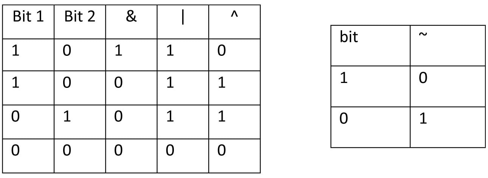<br><sub>Fig 25 - Bitwise Operators Truth Table - (<a href='https://www.javastudypoint.com/2019/12/bitwise-operators-in-java.html'>Work by  freeCodeCamp</a>) </sub></div>

<br>

```java

public class BitwiseOperator {
    public static void main(String[] args)
    {
        //Initial values
        int a = 6;
        int b = 7;

        // bitwise and
        // 0110 & 0111=0110 = 6
        System.out.println("a&b = " + (a & b));

        // bitwise or
        // 0110 | 0111=0111 = 7
        System.out.println("a|b = " + (a | b));

        // bitwise xor
        // 0110 ^ 0111=0001 = 1
        System.out.println("a^b = " + (a ^ b));

        // bitwise and
        // ~0110=1001
        // will give 2's complement of 1001 = -7
        System.out.println("~a = " + ~a);

		// bitwise left shift
		System.out.println("a << 2 = " +(a << 2));

		// bitwise right shift
		System.out.println("a >> 2 = " +(a >> 2));

		// bitwise shift right zero fill
		System.out.println("b >>> 2 = " +(b >>> 2));
	}

}

```

```java


    int a = 60;	      /* 60 = 0011 1100 represents 60 in binary*/
    int b = 13;	      /* 13 = 0000 1101 */
    int c = 0;
    
    c = a & b;        /* 12 = 0000 1100 */
    c = a | b;        /* 61 = 0011 1101 */
    c = a ^ b;        /* 49 = 0011 0001 */
    c = ~a;           /*-61 = 1100 0011  :Invert all bits */
    
    // shift operators : zeros are shifted in to replace the discarded bits
    c = a << 2;       /* 240 = 1111 0000 : Shift left 2 bits*/
    c = a >> 2;       /* 15 = 1111 */
    c = a >>> 2;      /* 15 = 0000 1111 : Zero fill right shift*/

```

```java

import java.util.Scanner;

public class Program {
	
	public static void main(String[] args) {
		
		Scanner sc = new Scanner(System.in);
		
		int mask = 0b100000; //binary number declared in Java, in this case, 32
		System.out.println(mask);
		int n = sc.nextInt();
		
		if ((n & mask) != 0) {
			System.out.println("6th bit is true!");
		} else {
			System.out.println("6th bit is false");
		}
		sc.close();
	}
}

```


#### <a name="chapter2part9"></a>Chapter 2 - Part 9: Operator Precedence

Operator precedence dictates the order in which operators are evaluated in a Java expression. Understanding operator precedence is crucial for writing correct and predictable code. Without this knowledge, the results of calculations might be unexpected, leading to bugs that are difficult to find. This lesson will cover the rules of operator precedence in Java, providing examples and exercises to solidify your understanding.

#### <a name="chapter2part9.1"></a>Chapter 2 - Part 9.1: Understanding Operator Precedence in Java

Operator precedence determines which operations are performed first in an expression. Operators with higher precedence are evaluated before operators with lower precedence. When operators have the same precedence, their associativity determines the order of evaluation (left-to-right or right-to-left).

Here's a table summarizing the precedence of common Java operators, from highest to lowest:

|Precedence	|Operator(s)	|Associativity|
| :-----------: | :-------------: | :-------------: |
|1	|```[]```, ```.```, ```()``` (method call)|	Left-to-right|
|2	|```++```, ```--``` (postfix)|	Left-to-right|
|3	|```++```, ```--``` (prefix), ```+```, ```-```, ```!```, ```~```|	Right-to-left|
|4	|```*```, ```/```, ```%```|	Left-to-right|
|5	|```+```, ```-```|	Left-to-right|
|6	|```<<```, ```>>```, ```>>>```|	Left-to-right|
|7	|```<```, ```<=```, ```>```, ```>=```, instanceof|	Left-to-right|
|8	|```==```, ```!=```|	Left-to-right|
|9	|```&```|	Left-to-right|
|10	|```^```|	Left-to-right|
|11	|&&|	Left-to-right|
|12	|```? :```|	Right-to-left|
|13	|```=```, ```+=```, ```-=```, ```*=```, ```/=```, ```%=```, ```&=```, ```^=```|	```=```, ```<<=```, ```>>=```, ```>>>=```|

**Arithmetic Operators**

Arithmetic operators (```*```, ```/```, ```%```, ```+```, ```-```) follow the standard mathematical order of operations. Multiplication, division, and modulus have higher precedence than addition and subtraction.

**Example 1**:

```java
int result = 5 + 3 * 2; // Multiplication is performed before addition
System.out.println(result); // Output: 11
```

In this example, 3 * 2 is evaluated first, resulting in 6. Then, 5 + 6 is evaluated, resulting in 11.

**Example 2**:

```java
int result = (5 + 3) * 2; // Parentheses change the order of operations
System.out.println(result); // Output: 16
```

Here, the parentheses force 5 + 3 to be evaluated first, resulting in 8. Then, 8 * 2 is evaluated, resulting in 16.

**Increment and Decrement Operators**

Increment (```++```) and decrement (```--```) operators can be used in prefix or postfix form. The precedence differs depending on the form.

Postfix: The value is used before it is incremented/decremented. Prefix: The value is incremented/decremented before it is used.

Example 1 (Postfix):

```java
int x = 5;
int y = x++; // y = 5, then x = 6
System.out.println("x = " + x + ", y = " + y); // Output: x = 6, y = 5
```

**Example 2 (Prefix)**:

```java
int x = 5;
int y = ++x; // x = 6, then y = 6
System.out.println("x = " + x + ", y = " + y); // Output: x = 6, y = 6
```

**Example 3 (Precedence with other operators)**:

```java
int x = 5;
int y = 10;
int result = ++x + y--; // x becomes 6, then 6 + 10 is evaluated, then y becomes 9
System.out.println("x = " + x + ", y = " + y + ", result = " + result); // Output: x = 6, y = 9, result = 16
```

In this example, the prefix increment ++x has higher precedence than the addition + and the postfix decrement y--. Therefore, x is incremented to 6 first. Then, 6 + y is evaluated (using the original value of y, which is 10), resulting in 16. Finally, y is decremented to 9.

**Comparison Operators**

Comparison operators (```==```, ```!=```, ```>```, ```<```, ```>=```, ```<=```) are used to compare values. They have lower precedence than arithmetic operators.

Example:

```java
int x = 5;
int y = 10;
boolean result = x + 5 > y - 2; // Arithmetic operations are performed before comparison
System.out.println(result); // Output: false (10 > 8 is false)
```

Here, x + 5 is evaluated to 10, and y - 2 is evaluated to 8. Then, 10 > 8 is evaluated, resulting in false.

**Logical Operators**

Logical operators (&&, ||, !) are used to combine boolean expressions. ! (logical NOT) has the highest precedence among logical operators, followed by && (logical AND), and then || (logical OR).

**Example 1**:

```java
boolean a = true;
boolean b = false;
boolean result = a || b && false; // AND is performed before OR
System.out.println(result); // Output: true (true || (false && false) -> true || false -> true)
```

In this example, b && false is evaluated first, resulting in false. Then, a || false is evaluated, resulting in true.

**Example 2**:

```java
boolean a = true;
boolean b = false;
boolean result = (a || b) && false; // Parentheses change the order of operations
System.out.println(result); // Output: false ((true || false) && false -> true && false -> false)
```

Here, the parentheses force a || b to be evaluated first, resulting in true. Then, true && false is evaluated, resulting in false.

**Example 3**:

```java
boolean a = true;
boolean b = false;
boolean result = !b && a; // NOT is performed before AND
System.out.println(result); // Output: true ((!false) && true -> true && true -> true)
```

In this example, !b is evaluated first, resulting in true. Then, true && a is evaluated, resulting in true.

**Assignment Operators**

Assignment operators (=, +=, -=, *=, /=, %=) have the lowest precedence. They are evaluated after all other operations in the expression.

**Example**:

```java
int x = 5;
int y = 10;
x += y * 2; // Multiplication is performed before addition and assignment
System.out.println(x); // Output: 25 (x = x + (y * 2) -> x = 5 + (10 * 2) -> x = 5 + 20 -> x = 25)
```

Here, y * 2 is evaluated to 20. Then, x + 20 is evaluated to 25. Finally, x is assigned the value 25.

#### <a name="chapter2part9.2"></a>Chapter 2 - Part 9.2: Using Parentheses to Control Precedence

Parentheses () can be used to override the default operator precedence. Expressions within parentheses are always evaluated first. This can improve code readability and prevent unexpected results.

**Example 1**:

```java
int result = 10 - 2 * 3; // Multiplication is performed before subtraction
System.out.println(result); // Output: 4
```

**Example 2**:

```java
int result = (10 - 2) * 3; // Parentheses change the order of operations
System.out.println(result); // Output: 24
```

In the first example, 2 * 3 is evaluated first, resulting in 6. Then, 10 - 6 is evaluated, resulting in 4. In the second example, 10 - 2 is evaluated first due to the parentheses, resulting in 8. Then, 8 * 3 is evaluated, resulting in 24.

#### <a name="chapter2part9.3"></a>Chapter 2 - Part 9.3: Practical Examples and Demonstrations

Let's consider a more complex example that combines multiple operators:

```java
int a = 5;
int b = 3;
int c = 10;
int result = a++ + b * 2 - c / 3;
System.out.println("Initial values: a = 5, b = 3, c = 10");
// a++ (postfix increment): a is used as 5, then incremented to 6
// b * 2: 3 * 2 = 6
// c / 3: 10 / 3 = 3 (integer division)
// 5 + 6 - 3 = 8
System.out.println("a = " + a + ", b = " + b + ", c = " + c + ", result = " + result); // Output: a = 6, b = 3, c = 10, result = 8
```

Here's a breakdown of the evaluation:

- a++ is evaluated. The current value of a (which is 5) is used in the expression, and then a is incremented to 6.
- b * 2 is evaluated, resulting in 6.
- c / 3 is evaluated, resulting in 3 (integer division).
- 5 + 6 - 3 is evaluated from left to right, resulting in 8.
- The value 8 is assigned to result.

## <a name="chapter3"></a>Chapter 3: Control Flow: Making Decisions and Repeating Actions

Control flow statements are the fundamental building blocks that allow programs to make decisions and repeat actions. Without control flow, a program would execute sequentially, line by line, offering no flexibility or adaptability. This lesson introduces the core concepts of control flow and sets the stage for understanding how to write more complex and dynamic Java programs. We'll explore the different types of control flow statements available in Java and how they alter the execution path of your code.

#### <a name="chapter3part1"></a>Chapter 3 - Part 1: Introduction to Control Flow Statements

Control flow refers to the order in which individual statements, instructions or function calls of an imperative program are executed or evaluated. In simple terms, it's the path your code takes as it runs. By default, Java executes code sequentially, from top to bottom, within a method. Control flow statements allow you to deviate from this linear execution, enabling your program to respond to different conditions and perform repetitive tasks.

#### <a name="chapter3part1.1"></a>Chapter 3 - Part 1.1: Understanding Control Flow

Control flow refers to the order in which individual statements, instructions or function calls of an imperative program are executed or evaluated. In simple terms, it's the path your code takes as it runs. By default, Java executes code sequentially, from top to bottom, within a method. Control flow statements allow you to deviate from this linear execution, enabling your program to respond to different conditions and perform repetitive tasks.

**Types of Control Flow Statements**

- **Decision-Making Statements**: These statements allow your program to choose between different paths of execution based on certain conditions. The primary decision-making statements in Java are:
  - ```if``` statement
  - ```if-else``` statement
  - ```if-else if-else``` statement
  - ```switch``` statement
 
- **Looping Statements**: These statements allow you to repeat a block of code multiple times. The looping statements in Java are:
  - ```while``` loop
  - ```do-while``` loop
  - ```for``` loop
  - ```for-each``` loop
 
**Importance of Control Flow**

Control flow statements are essential for creating programs that can:

- **React to User Input**: A program can take different actions based on what the user enters.
- **Process Data Conditionally**: A program can perform different calculations or operations depending on the data it receives.
- **Automate Repetitive Tasks**: A program can repeat a set of instructions multiple times, saving time and effort.
- **Implement Complex Algorithms**: Many algorithms rely on conditional execution and repetition to solve problems.

#### <a name="chapter3part1.2"></a>Chapter 3 - Part 1.2: Decision-Making Statements: An Overview

Decision-making statements allow a program to execute specific blocks of code only when certain conditions are met. These conditions are evaluated as boolean expressions (i.e., they result in either true or false).

**The ```if``` Statement**

The if statement is the simplest form of decision-making. It executes a block of code only if a specified condition is true.

```java
if (condition) {
    // Code to be executed if the condition is true
}
```

**Example**:

```java
int age = 20;

if (age >= 18) {
    System.out.println("You are eligible to vote.");
}
```

In this example, the message "You are eligible to vote." will be printed to the console only if the value of the age variable is greater than or equal to 18.

**The ```if-else``` Statement**

The if-else statement provides an alternative block of code to execute when the condition in the if statement is false.

**Syntax**:

```java
if (condition) {
    // Code to be executed if the condition is true
} else {
    // Code to be executed if the condition is false
}
```

**Example**:

```java
int age = 16;

if (age >= 18) {
    System.out.println("You are eligible to vote.");
} else {
    System.out.println("You are not eligible to vote yet.");
}
```

In this example, since age is 16 (less than 18), the message "You are not eligible to vote yet." will be printed.

**The ```if-else if-else``` Statement**

The if-else if-else statement allows you to check multiple conditions in sequence. It provides a way to handle more complex decision-making scenarios where you have several possible outcomes.

**Syntax**:

```java
if (condition1) {
    // Code to be executed if condition1 is true
} else if (condition2) {
    // Code to be executed if condition1 is false AND condition2 is true
} else if (condition3) {
    // Code to be executed if condition1 and condition2 are false AND condition3 is true
} else {
    // Code to be executed if all conditions are false
}
```

**Example**:

```java
int score = 75;

if (score >= 90) {
    System.out.println("Grade: A");
} else if (score >= 80) {
    System.out.println("Grade: B");
} else if (score >= 70) {
    System.out.println("Grade: C");
} else if (score >= 60) {
    System.out.println("Grade: D");
} else {
    System.out.println("Grade: F");
}
```

In this example, the program checks the value of the score variable against a series of conditions. Since score is 75, the message "Grade: C" will be printed.

**The ```switch``` Statement**

The switch statement provides a more efficient way to select one block of code to execute from a set of possible cases, based on the value of a single variable or expression. It's particularly useful when you have multiple possible values to check against.

**Syntax**:

```java
switch (expression) {
    case value1:
        // Code to be executed if expression equals value1
        break;
    case value2:
        // Code to be executed if expression equals value2
        break;
    case value3:
        // Code to be executed if expression equals value3
        break;
    default:
        // Code to be executed if expression doesn't match any of the cases
}
```

**Explanation**:

- The switch statement evaluates the expression.
- The case labels specify the different possible values of the expression.
- If the value of the expression matches a case label, the code within that case block is executed.
- The break statement is crucial. It terminates the switch statement and prevents the execution of subsequent case blocks. If you omit the break statement, the program will "fall through" to the next case block, even if the value of the expression doesn't match that case.
- The default case is optional. It provides a block of code to execute if the value of the expression doesn't match any of the case labels.

**Example**:

```java
int dayOfWeek = 3;

switch (dayOfWeek) {
    case 1:
        System.out.println("Monday");
        break;
    case 2:
        System.out.println("Tuesday");
        break;
    case 3:
        System.out.println("Wednesday");
        break;
    case 4:
        System.out.println("Thursday");
        break;
    case 5:
        System.out.println("Friday");
        break;
    case 6:
        System.out.println("Saturday");
        break;
    case 7:
        System.out.println("Sunday");
        break;
    default:
        System.out.println("Invalid day");
}
```

In this example, since dayOfWeek is 3, the message "Wednesday" will be printed.

#### <a name="chapter3part1.3"></a>Chapter 3 - Part 1.3: Looping Statements: An Introduction

Looping statements allow you to execute a block of code repeatedly, as long as a certain condition remains true. This is incredibly useful for automating tasks that need to be performed multiple times.

**The ```while``` Loop**

The while loop executes a block of code repeatedly as long as a specified condition is true. The condition is checked before each iteration of the loop.

**Syntax**:

```java
while (condition) {
    // Code to be executed repeatedly as long as the condition is true
}
```

**Example**:

```java
int count = 1;

while (count <= 5) {
    System.out.println("Count: " + count);
    count++; // Increment the counter
}
```

In this example, the loop will execute as long as the value of count is less than or equal to 5. The message "Count: " followed by the current value of count will be printed in each iteration. The count++ statement increments the value of count by 1 after each iteration. Without this increment, the loop would run indefinitely (an infinite loop).

**The ```do-while``` Loop**

The do-while loop is similar to the while loop, but with one key difference: the condition is checked after each iteration of the loop. This means that the code block inside the do-while loop will always be executed at least once, even if the condition is initially false.

**Syntax**:

```java
do {
    // Code to be executed repeatedly as long as the condition is true
} while (condition);
```

**Example**:

```java
int count = 6;

do {
    System.out.println("Count: " + count);
    count++;
} while (count <= 5);
```

In this example, even though count is initially 6 (which is greater than 5), the code inside the do block will be executed once. The message "Count: 6" will be printed. Then, the condition count <= 5 will be checked. Since it's false, the loop will terminate.

**The ```for``` Loop**

The for loop provides a more concise way to write loops that iterate a specific number of times. It combines the initialization, condition checking, and increment/decrement steps into a single statement.

**Syntax**:

```java
for (initialization; condition; increment/decrement) {
    // Code to be executed repeatedly as long as the condition is true
}
```

**Explanation**:

- **Initialization**: This part is executed only once, at the beginning of the loop. It's typically used to declare and initialize a loop counter variable.
- **Condition**: This condition is checked before each iteration of the loop. If it's true, the loop body is executed. If it's false, the loop terminates.
- **Increment/Decrement**: This part is executed after each iteration of the loop. It's typically used to update the loop counter variable.

**Example**:

```java
for (int i = 1; i <= 5; i++) {
    System.out.println("Iteration: " + i);
}
```

In this example, the loop will execute 5 times. The variable i is initialized to 1. The loop continues as long as i is less than or equal to 5. After each iteration, i is incremented by 1.

**The ```for-each``` Loop**

The for-each loop automatically handles the iteration process, so you don't need to worry about index variables or incrementing counters. It iterates through each element in the array or collection, one at a time, and makes the element available to you within the loop's body.

```java
for (dataType element : arrayOrCollection) {
    // Code to be executed for each element
    // You can use the 'element' variable to access the current element
}
```

**Explanation**:

- **dataType**: The data type of the elements in the array or collection.
- **element**: A variable that will hold the current element during each iteration.
- **arrayOrCollection**: The array or collection you want to iterate through.

**Example with Arrays**:

```java
public class ForEachArrayExample {
    public static void main(String[] args) {
        int[] numbers = {1, 2, 3, 4, 5};

        // Using a for-each loop to print each element in the array
        for (int number : numbers) {
            System.out.println(number);
        }
    }
}
```

```
1
2
3
4
5
```

#### <a name="chapter3part1.4"></a>Chapter 3 - Part 1.4: Using break and continue Statements

The break and continue statements provide additional control over the execution of loops.

**The ```break``` Statement**

The break statement is used to terminate a loop prematurely. When a break statement is encountered inside a loop, the loop is immediately exited, and the program continues with the next statement after the loop.

**Example**:

```java
for (int i = 1; i <= 10; i++) {
    if (i == 5) {
        break; // Exit the loop when i is 5
    }
    System.out.println("Iteration: " + i);
}
```

In this example, the loop is intended to iterate from 1 to 10. However, when i becomes 5, the break statement is executed, and the loop terminates. The output will be:

```
Iteration: 1
Iteration: 2
Iteration: 3
Iteration: 4
```

**The ```continue``` Statement**

The continue statement is used to skip the current iteration of a loop and proceed to the next iteration. When a continue statement is encountered inside a loop, the remaining code in the current iteration is skipped, and the loop proceeds to the next iteration.

**Example**:

```java
for (int i = 1; i <= 10; i++) {
    if (i % 2 == 0) {
        continue; // Skip even numbers
    }
    System.out.println("Iteration: " + i);
}
```

In this example, the loop iterates from 1 to 10. However, when i is an even number (i.e., i % 2 == 0 is true), the continue statement is executed, and the remaining code in the current iteration (the System.out.println() statement) is skipped. The output will be:

```
Iteration: 1
Iteration: 3
Iteration: 5
Iteration: 7
Iteration: 9
```

#### <a name="chapter3part2"></a>Chapter 3 - Part 2: The `if` Statement: Conditional Execution

#### <a name="chapter3part2.1"></a>Chapter 3 - Part 2.1: Understanding the if Statement

#### <a name="chapter3part2.2"></a>Chapter 3 - Part 2.2: Practical Examples of the if Statement

#### <a name="chapter3part2.3"></a>Chapter 3 - Part 2.3: Exercises

#### <a name="chapter3part2.4"></a>Chapter 3 - Part 2.4: Preparing for Future Lessons

#### <a name="chapter3part3"></a>Chapter 3 - Part 3: The `if-else` Statement: Choosing Between Two Options

#### <a name="chapter3part3.1"></a>Chapter 3 - Part 3.1: Understanding the if-else Statement

#### <a name="chapter3part3.2"></a>Chapter 3 - Part 3.2: Omitting Curly Braces

#### <a name="chapter3part3.3"></a>Chapter 3 - Part 3.3: Nested if-else Statements

#### <a name="chapter3part3.4"></a>Chapter 3 - Part 3.4: Short-Hand if-else

Optional structure to ```if-else``` when you want to decide a **VALUE** based on a condition.

**The Short Hand If...Else Statement**

```java

variable = (condition) ? expressionTrue :  expressionFalse;

```

Instead of writing:

```java

int time = 20;
if (time < 18) {
  System.out.println("Good day.");
} else {
  System.out.println("Good evening.");
}

```

You can simply write:

```java

int time = 20;
String result = (time < 18) ? "Good day." : "Good evening.";
System.out.println(result);

```

#### <a name="chapter3part3.5"></a>Chapter 3 - Part 3.5: Common Errors and Pitfalls

#### <a name="chapter3part3.5"></a>Chapter 3 - Part 3.5: Practice Activities

#### <a name="chapter3part3.6"></a>Chapter 3 - Part 3.6: Preparing for Future Lessons

#### <a name="chapter3part4"></a>Chapter 3 - Part 4: The `if-else if-else` Statement: Handling Multiple Conditions

#### <a name="chapter3part4.1"></a>Chapter 3 - Part 4.1: Understanding the if-else if-else Statement

#### <a name="chapter3part4.2"></a>Chapter 3 - Part 4.2: Practice Activities

#### <a name="chapter3part4.3"></a>Chapter 3 - Part 4.3: Preparing for Future Lessons

#### <a name="chapter3part5"></a>Chapter 3 - Part 5: The `switch` Statement: Selecting from Multiple Cases

#### <a name="chapter3part5.1"></a>Chapter 3 - Part 5.1: Understanding the switch Statement

#### <a name="chapter3part5.2"></a>Chapter 3 - Part 5.2: Practical Examples and Demonstrations

#### <a name="chapter3part5.3"></a>Chapter 3 - Part 5.3: Exercises and Practice Activities

#### <a name="chapter3part5.4"></a>Chapter 3 - Part 5.4: Summary and Next Steps

#### <a name="chapter3part6"></a>Chapter 3 - Part 6: The `while` Loop: Repeating Code While a Condition is True

#### <a name="chapter3part6.1"></a>Chapter 3 - Part 6.1: Understanding the while Loop

#### <a name="chapter3part6.2"></a>Chapter 3 - Part 6.2: Using while Loops with User Input

#### <a name="chapter3part6.3"></a>Chapter 3 - Part 6.3: Using while Loops with Boolean Flags

#### <a name="chapter3part6.4"></a>Chapter 3 - Part 6.4: Nested while Loops

#### <a name="chapter3part6.5"></a>Chapter 3 - Part 6.5: Practice Activities

#### <a name="chapter3part7"></a>Chapter 3 - Part 7: The `do-while` Loop: Ensuring Code Executes at Least Once

#### <a name="chapter3part7.1"></a>Chapter 3 - Part 7.1: Understanding the do-while Loop

#### <a name="chapter3part7.2"></a>Chapter 3 - Part 7.2: Practical Examples of do-while Loops

#### <a name="chapter3part7.3"></a>Chapter 3 - Part 7.3: Exercises

#### <a name="chapter3part7.4"></a>Chapter 3 - Part 7.4: Preparing for Future Lessons

#### <a name="chapter3part8"></a>Chapter 3 - Part 8: The `for` Loop: Repeating Code a Specific Number of Times

#### <a name="chapter3part8.1"></a>Chapter 3 - Part 8.1: Understanding the for Loop Syntax

#### <a name="chapter3part8.2"></a>Chapter 3 - Part 8.2: How the for Loop Works

#### <a name="chapter3part8.3"></a>Chapter 3 - Part 8.3: Practical Examples of for Loops

#### <a name="chapter3part8.4"></a>Chapter 3 - Part 8.4: Variations of the for Loop

#### <a name="chapter3part8.5"></a>Chapter 3 - Part 8.5: Common Mistakes and How to Avoid Them

#### <a name="chapter3part8.6"></a>Chapter 3 - Part 8.6: Exercises

#### <a name="chapter3part9"></a>Chapter 3 - Part 9: Using `break` and `continue` Statements

#### <a name="chapter3part9.1"></a>Chapter 3 - Part 9.1: Understanding the break Statement

#### <a name="chapter3part9.2"></a>Chapter 3 - Part 9.2: Understanding the continue Statement

#### <a name="chapter3part9.3"></a>Chapter 3 - Part 9.3: Practical Examples and Demonstrations

#### <a name="chapter3part9.4"></a>Chapter 3 - Part 9.4: Exercises

## <a name="chapter4"></a>Chapter 4: Working with Arrays and Strings

#### <a name="chapter4part1"></a>Chapter 4 - Part 1: Introduction to Arrays: Storing Collections of Data

#### <a name="chapter4part1.1"></a>Chapter 4 - Part 1.1: Declaring and Initializing Arrays

#### <a name="chapter4part1.2"></a>Chapter 4 - Part 1.2: Accessing Array Elements

#### <a name="chapter4part1.3"></a>Chapter 4 - Part 1.3: Looping Through Arrays

#### <a name="chapter4part1.4"></a>Chapter 4 - Part 1.4: Exercises

#### <a name="chapter4part2"></a>Chapter 4 - Part 2: Declaring and Initializing Arrays

#### <a name="chapter4part2.1"></a>Chapter 4 - Part 2.1: Declaring Arrays

#### <a name="chapter4part2.2"></a>Chapter 4 - Part 2.2: Initializing Arrays

#### <a name="chapter4part2.3"></a>Chapter 4 - Part 2.3: Accessing Array Elements

#### <a name="chapter4part2.4"></a>Chapter 4 - Part 2.4: Looping Through Arrays

#### <a name="chapter4part2.5"></a>Chapter 4 - Part 2.5: Practice Activities

#### <a name="chapter4part3"></a>Chapter 4 - Part 3: Accessing Array Elements

#### <a name="chapter4part3.1"></a>Chapter 4 - Part 3.1: Accessing Array Elements Using Indices

#### <a name="chapter4part3.2"></a>Chapter 4 - Part 3.2: ArrayIndexOutOfBoundsException

#### <a name="chapter4part3.3"></a>Chapter 4 - Part 3.3: Practical Examples and Demonstrations

#### <a name="chapter4part3.4"></a>Chapter 4 - Part 3.4: Exercises

#### <a name="chapter4part3.5"></a>Chapter 4 - Part 3.5: Summary and Next Steps

#### <a name="chapter4part4"></a>Chapter 4 - Part 4: Looping Through Arrays

#### <a name="chapter4part4.1"></a>Chapter 4 - Part 4.1: Understanding the Need for Loops

#### <a name="chapter4part4.2"></a>Chapter 4 - Part 4.2: Types of Loops in Java

#### <a name="chapter4part4.3"></a>Chapter 4 - Part 4.3: The for Loop

#### <a name="chapter4part4.4"></a>Chapter 4 - Part 4.4: The Enhanced for Loop (For-Each Loop)

#### <a name="chapter4part4.5"></a>Chapter 4 - Part 4.5: The while Loop

#### <a name="chapter4part4.6"></a>Chapter 4 - Part 4.6: The do-while Loop

#### <a name="chapter4part4.7"></a>Chapter 4 - Part 4.7: Practice Activities

#### <a name="chapter4part4.8"></a>Chapter 4 - Part 4.8: Summary

#### <a name="chapter4part5"></a>Chapter 4 - Part 5: Multidimensional Arrays

#### <a name="chapter4part5.1"></a>Chapter 4 - Part 5.1: Understanding Multidimensional Arrays

#### <a name="chapter4part5.2"></a>Chapter 4 - Part 5.2: Practical Examples and Demonstrations

#### <a name="chapter4part5.3"></a>Chapter 4 - Part 5.3: Exercises

#### <a name="chapter4part6"></a>Chapter 4 - Part 6: Introduction to Strings: Working with Text

#### <a name="chapter4part6.1"></a>Chapter 4 - Part 6.1: Creating Strings

#### <a name="chapter4part6.2"></a>Chapter 4 - Part 6.2: String Manipulation

#### <a name="chapter4part6.3"></a>Chapter 4 - Part 6.3: String Comparison: equals() vs. ==

#### <a name="chapter4part6.4"></a>Chapter 4 - Part 6.4: String Methods: toUpperCase(), toLowerCase(), trim()

#### <a name="chapter4part6.5"></a>Chapter 4 - Part 6.5: Exercises

#### <a name="chapter4part6.6"></a>Chapter 4 - Part 6.6: Summary

#### <a name="chapter4part7"></a>Chapter 4 - Part 7: String Manipulation: Concatenation, Substrings, Length

#### <a name="chapter4part7.1"></a>Chapter 4 - Part 7.1: String Concatenation

#### <a name="chapter4part7.2"></a>Chapter 4 - Part 7.2: Extracting Substrings

#### <a name="chapter4part7.3"></a>Chapter 4 - Part 7.3: Determining String Length

#### <a name="chapter4part7.4"></a>Chapter 4 - Part 7.4: Exercises

#### <a name="chapter4part7.5"></a>Chapter 4 - Part 7.5: Summary

#### <a name="chapter4part8"></a>Chapter 4 - Part 8: String Comparison: equals() vs. ==

#### <a name="chapter4part8.1"></a>Chapter 4 - Part 8.1: Understanding String Immutability and the String Pool

#### <a name="chapter4part8.2"></a>Chapter 4 - Part 8.2: The equals() Method: Comparing String Content

#### <a name="chapter4part8.3"></a>Chapter 4 - Part 8.3: The == Operator: Comparing Object References

#### <a name="chapter4part8.4"></a>Chapter 4 - Part 8.4: When to Use equals() vs. ==

#### <a name="chapter4part8.5"></a>Chapter 4 - Part 8.5: Practice Activities

#### <a name="chapter4part8.6"></a>Chapter 4 - Part 8.6: Preparing for Future Lessons

#### <a name="chapter4part8.7"></a>Chapter 4 - Part 8.7: Summary

#### <a name="chapter4part9"></a>Chapter 4 - Part 9: String Methods: toUpperCase(), toLowerCase(), trim()

#### <a name="chapter4part9.1"></a>Chapter 4 - Part 9.1: Understanding toUpperCase() and toLowerCase()

#### <a name="chapter4part9.2"></a>Chapter 4 - Part 9.2: Understanding trim()

#### <a name="chapter4part9.3"></a>Chapter 4 - Part 9.3: Combining String Methods

## <a name="chapter5"></a>Chapter 5: Object-Oriented Programming (OOP) Fundamentals

#### <a name="chapter5part1"></a>Chapter 5 - Part 1: Introduction to Object-Oriented Programming (OOP)

#### <a name="chapter5part1.1"></a>Chapter 5 - Part 1.1: Understanding Classes and Objects

#### <a name="chapter5part1.2"></a>Chapter 5 - Part 1.2: Defining Classes: Attributes (Fields) and Behaviors (Methods)

#### <a name="chapter5part1.3"></a>Chapter 5 - Part 1.3: Creating Objects: Instantiating Classes

#### <a name="chapter5part1.4"></a>Chapter 5 - Part 1.4: Accessing Object Attributes and Calling Methods

#### <a name="chapter5part1.5"></a>Chapter 5 - Part 1.5: Constructors: Initializing Objects

#### <a name="chapter5part1.6"></a>Chapter 5 - Part 1.6: The this Keyword: Referring to the Current Object

#### <a name="chapter5part1.7"></a>Chapter 5 - Part 1.7: Introduction to Encapsulation: Hiding Data

#### <a name="chapter5part1.8"></a>Chapter 5 - Part 1.8: Exercises

#### <a name="chapter5part1.9"></a>Chapter 5 - Part 1.9: Summary

#### <a name="chapter5part1.10"></a>Chapter 5 - Part 1.10: Next Steps

#### <a name="chapter5part2"></a>Chapter 5 - Part 2: Understanding Classes and Objects

#### <a name="chapter5part2.1"></a>Chapter 5 - Part 2.1: Understanding Classes

#### <a name="chapter5part2.2"></a>Chapter 5 - Part 2.2: Creating Objects: Instantiating Classes

#### <a name="chapter5part2.3"></a>Chapter 5 - Part 2.3: Accessing Object Attributes and Calling Methods

#### <a name="chapter5part2.4"></a>Chapter 5 - Part 2.4: Constructors: Initializing Objects

#### <a name="chapter5part2.5"></a>Chapter 5 - Part 2.5: The this Keyword: Referring to the Current Object

#### <a name="chapter5part2.6"></a>Chapter 5 - Part 2.6: Introduction to Encapsulation: Hiding Data

#### <a name="chapter5part2.7"></a>Chapter 5 - Part 2.7: Exercises

#### <a name="chapter5part3"></a>Chapter 5 - Part 3: Defining Classes: Attributes (Fields) and Behaviors (Methods)

#### <a name="chapter5part3.1"></a>Chapter 5 - Part 3.1: Understanding Classes and Objects

#### <a name="chapter5part3.2"></a>Chapter 5 - Part 3.2: Defining Classes: Attributes (Fields)

#### <a name="chapter5part3.3"></a>Chapter 5 - Part 3.3: Defining Classes: Behaviors (Methods)

#### <a name="chapter5part3.4"></a>Chapter 5 - Part 3.4: Practical Examples and Demonstrations

#### <a name="chapter5part3.5"></a>Chapter 5 - Part 3.5: Exercises

#### <a name="chapter5part3.6"></a>Chapter 5 - Part 3.6: Summary and Next Steps

#### <a name="chapter5part4"></a>Chapter 5 - Part 4: Creating Objects: Instantiating Classes

#### <a name="chapter5part4.1"></a>Chapter 5 - Part 4.1: Understanding Object Instantiation

#### <a name="chapter5part4.2"></a>Chapter 5 - Part 4.2: Practical Examples and Demonstrations

#### <a name="chapter5part4.3"></a>Chapter 5 - Part 4.3: Exercises

#### <a name="chapter5part4.4"></a>Chapter 5 - Part 4.4: Summary and Next Steps

#### <a name="chapter5part5"></a>Chapter 5 - Part 5: Accessing Object Attributes and Calling Methods

#### <a name="chapter5part5.1"></a>Chapter 5 - Part 5.1: Accessing Object Attributes

#### <a name="chapter5part5.2"></a>Chapter 5 - Part 5.2: Calling Methods

#### <a name="chapter5part5.3"></a>Chapter 5 - Part 5.3: Practice Activities

#### <a name="chapter5part5.4"></a>Chapter 5 - Part 5.4: Summary and Next Steps

#### <a name="chapter5part6"></a>Chapter 5 - Part 6: Constructors: Initializing Objects

#### <a name="chapter5part6.1"></a>Chapter 5 - Part 6.1: Understanding Constructors

#### <a name="chapter5part6.2"></a>Chapter 5 - Part 6.2: Default Constructor (No-Argument Constructor)

#### <a name="chapter5part6.3"></a>Chapter 5 - Part 6.3: Parameterized Constructor

#### <a name="chapter5part6.4"></a>Chapter 5 - Part 6.4: The this Keyword

#### <a name="chapter5part6.5"></a>Chapter 5 - Part 6.5: Practical Examples and Demonstrations

#### <a name="chapter5part6.6"></a>Chapter 5 - Part 6.6: Exercises

#### <a name="chapter5part6.7"></a>Chapter 5 - Part 6.7: Summary

#### <a name="chapter5part6.8"></a>Chapter 5 - Part 6.8: Next Steps and Future Learning Directions

#### <a name="chapter5part7"></a>Chapter 5 - Part 7: The `this` Keyword: Referring to the Current Object

#### <a name="chapter5part7.1"></a>Chapter 5 - Part 7.1: Understanding the this Keyword

#### <a name="chapter5part7.2"></a>Chapter 5 - Part 7.2: Practical Examples and Demonstrations

#### <a name="chapter5part7.3"></a>Chapter 5 - Part 7.3: Exercises

#### <a name="chapter5part7.4"></a>Chapter 5 - Part 7.4: Summary and Next Steps

#### <a name="chapter5part8"></a>Chapter 5 - Part 8: Introduction to Encapsulation: Hiding Data

#### <a name="chapter5part8.1"></a>Chapter 5 - Part 8.1: Understanding Encapsulation

#### <a name="chapter5part8.2"></a>Chapter 5 - Part 8.2: Implementing Encapsulation in Java

#### <a name="chapter5part8.3"></a>Chapter 5 - Part 8.3: Advanced Encapsulation Techniques

#### <a name="chapter5part8.4"></a>Chapter 5 - Part 8.4: Practice Activities

#### <a name="chapter5part8.5"></a>Chapter 5 - Part 8.5: Summary

#### <a name="chapter5part8.6"></a>Chapter 5 - Part 8.6: Next Steps and Future Learning Directions

## <a name="chapter6"></a>Chapter 6: Methods and Classes in Depth

#### <a name="chapter6part1"></a>Chapter 6 - Part 1: Method Overloading: Creating Methods with the Same Name

#### <a name="chapter6part1.1"></a>Chapter 6 - Part 1.1: Understanding Method Overloading

#### <a name="chapter6part1.2"></a>Chapter 6 - Part 1.2: Practical Examples and Demonstrations

#### <a name="chapter6part1.3"></a>Chapter 6 - Part 1.3: Exercises and Practice Activities

#### <a name="chapter6part1.4"></a>Chapter 6 - Part 1.4: Summary and Next Steps

#### <a name="chapter6part2"></a>Chapter 6 - Part 2: Method Parameters and Return Types

#### <a name="chapter6part2.1"></a>Chapter 6 - Part 2.1: Understanding Method Parameters

#### <a name="chapter6part2.2"></a>Chapter 6 - Part 2.2: Understanding Return Types

#### <a name="chapter6part2.3"></a>Chapter 6 - Part 2.3: Practical Examples and Demonstrations

#### <a name="chapter6part2.4"></a>Chapter 6 - Part 2.4: Exercises

#### <a name="chapter6part2.5"></a>Chapter 6 - Part 2.5: Summary and Next Steps

#### <a name="chapter6part3"></a>Chapter 6 - Part 3: Static Variables and Methods: Class-Level Members

#### <a name="chapter6part3.1"></a>Chapter 6 - Part 3.1: Understanding Static Variables

#### <a name="chapter6part3.2"></a>Chapter 6 - Part 3.2: Understanding Static Methods

#### <a name="chapter6part3.3"></a>Chapter 6 - Part 3.3: Static Blocks

#### <a name="chapter6part3.4"></a>Chapter 6 - Part 3.4: Real-World Applications

#### <a name="chapter6part3.5"></a>Chapter 6 - Part 3.5: Summary

#### <a name="chapter6part3.6"></a>Chapter 6 - Part 3.6: Next Steps

#### <a name="chapter6part4"></a>Chapter 6 - Part 4: Understanding Access Modifiers: public, private, protected, default

#### <a name="chapter6part4.1"></a>Chapter 6 - Part 4.1: Understanding Access Modifiers

#### <a name="chapter6part4.2"></a>Chapter 6 - Part 4.2: Access Levels: A Summary

#### <a name="chapter6part4.3"></a>Chapter 6 - Part 4.3: Practical Examples and Demonstrations

#### <a name="chapter6part4.4"></a>Chapter 6 - Part 4.4: Exercises

#### <a name="chapter6part4.5"></a>Chapter 6 - Part 4.5: Summary and Next Steps

#### <a name="chapter6part5"></a>Chapter 6 - Part 5: Introduction to Inheritance: Creating Hierarchies of Classes

#### <a name="chapter6part5.1"></a>Chapter 6 - Part 5.1: Understanding Inheritance

#### <a name="chapter6part5.2"></a>Chapter 6 - Part 5.2: The extends Keyword

#### <a name="chapter6part5.3"></a>Chapter 6 - Part 5.3: Method Overriding

#### <a name="chapter6part5.4"></a>Chapter 6 - Part 5.4: The super Keyword

#### <a name="chapter6part5.5"></a>Chapter 6 - Part 5.5: Practice Activities

#### <a name="chapter6part5.6"></a>Chapter 6 - Part 5.6: Summary and Next Steps

#### <a name="chapter6part6"></a>Chapter 6 - Part 6: The `extends` Keyword: Inheriting from a Parent Class

#### <a name="chapter6part6.1"></a>Chapter 6 - Part 6.1: Understanding the extends Keyword

#### <a name="chapter6part6.2"></a>Chapter 6 - Part 6.2: Practical Examples and Demonstrations

#### <a name="chapter6part6.3"></a>Chapter 6 - Part 6.3: Exercises

#### <a name="chapter6part6.4"></a>Chapter 6 - Part 6.4: Summary and Next Steps

#### <a name="chapter6part7"></a>Chapter 6 - Part 7: Method Overriding: Changing Inherited Behavior

#### <a name="chapter6part7.1"></a>Chapter 6 - Part 7.1: Understanding Method Overriding

#### <a name="chapter6part7.2"></a>Chapter 6 - Part 7.2: The super Keyword and Method Overriding

#### <a name="chapter6part7.3"></a>Chapter 6 - Part 7.3: Method Overriding vs. Method Overloading

#### <a name="chapter6part7.4"></a>Chapter 6 - Part 7.4: Practical Examples and Demonstrations

#### <a name="chapter6part7.5"></a>Chapter 6 - Part 7.5: Exercises

#### <a name="chapter6part7.6"></a>Chapter 6 - Part 7.6: Summary

#### <a name="chapter6part7.7"></a>Chapter 6 - Part 7.7: Next Steps and Future Learning Directions

#### <a name="chapter6part8"></a>Chapter 6 - Part 8: The `super` Keyword: Accessing Parent Class Members

#### <a name="chapter6part8.1"></a>Chapter 6 - Part 8.1: Understanding the super Keyword

#### <a name="chapter6part8.2"></a>Chapter 6 - Part 8.2: Exercises

#### <a name="chapter6part8.3"></a>Chapter 6 - Part 8.3: Summary

## <a name="chapter7"></a>Chapter 7: Exception Handling and Basic Input/Output

#### <a name="chapter7part1"></a>Chapter 7 - Part 1: Introduction to Exception Handling: Dealing with Errors

#### <a name="chapter7part1.1"></a>Chapter 7 - Part 1.1: Understanding Exceptions

#### <a name="chapter7part1.2"></a>Chapter 7 - Part 1.2: The try-catch Block: Handling Exceptions

#### <a name="chapter7part1.3"></a>Chapter 7 - Part 1.3: Common Exception Types

#### <a name="chapter7part1.4"></a>Chapter 7 - Part 1.4: Best Practices for Exception Handling

#### <a name="chapter7part1.5"></a>Chapter 7 - Part 1.5: Exercises

#### <a name="chapter7part1.6"></a>Chapter 7 - Part 1.6: Summary

#### <a name="chapter7part1.7"></a>Chapter 7 - Part 1.7: Next Steps

#### <a name="chapter7part2"></a>Chapter 7 - Part 2: The `try-catch` Block: Handling Exceptions

#### <a name="chapter7part2.1"></a>Chapter 7 - Part 2.1: Understanding Exceptions

#### <a name="chapter7part2.2"></a>Chapter 7 - Part 2.2: The try-catch Block: A Detailed Explanation

#### <a name="chapter7part2.3"></a>Chapter 7 - Part 2.3: Best Practices for Using try-catch Blocks

#### <a name="chapter7part2.4"></a>Chapter 7 - Part 2.4: Exercises

#### <a name="chapter7part3"></a>Chapter 7 - Part 3: The `finally` Block: Ensuring Code Executes

#### <a name="chapter7part3.1"></a>Chapter 7 - Part 3.1: Understanding the finally Block

#### <a name="chapter7part3.2"></a>Chapter 7 - Part 3.2: Practical Examples of Using finally

#### <a name="chapter7part3.3"></a>Chapter 7 - Part 3.3: Best Practices and Considerations

#### <a name="chapter7part3.4"></a>Chapter 7 - Part 3.4: Exercises

#### <a name="chapter7part4"></a>Chapter 7 - Part 4: Common Exception Types: NullPointerException, ArrayIndexOutOfBoundsException

#### <a name="chapter7part4.1"></a>Chapter 7 - Part 4.1: Understanding Exceptions

#### <a name="chapter7part4.2"></a>Chapter 7 - Part 4.2: The NullPointerException

#### <a name="chapter7part4.3"></a>Chapter 7 - Part 4.3: The ArrayIndexOutOfBoundsException

#### <a name="chapter7part4.4"></a>Chapter 7 - Part 4.4: Exercises

#### <a name="chapter7part4.5"></a>Chapter 7 - Part 4.5: Summary

#### <a name="chapter7part5"></a>Chapter 7 - Part 5: Custom Exceptions

#### <a name="chapter7part5.1"></a>Chapter 7 - Part 5.1: What is Custom Exception

#### <a name="chapter7part5.2"></a>Chapter 7 - Part 5.2: Creating Custom Exceptions

#### <a name="chapter7part6"></a>Chapter 7 - Part 6: Reading Input from the Console: Using the `Scanner` Class

#### <a name="chapter7part6.1"></a>Chapter 7 - Part 6.1: Introduction to the Scanner Class

#### <a name="chapter7part6.2"></a>Chapter 7 - Part 6.2: Reading Different Data Types

#### <a name="chapter7part6.3"></a>Chapter 7 - Part 6.3: Handling Input Mismatch Exceptions

#### <a name="chapter7part6.4"></a>Chapter 7 - Part 6.4: Practical Examples and Demonstrations

#### <a name="chapter7part6.5"></a>Chapter 7 - Part 6.5: Exercises

#### <a name="chapter7part7"></a>Chapter 7 - Part 7: Writing Output to the Console: Using `System.out.println()`

#### <a name="chapter7part7.1"></a>Chapter 7 - Part 7.1: Understanding System.out.println()

#### <a name="chapter7part7.2"></a>Chapter 7 - Part 7.2: Practical Examples and Demonstrations

#### <a name="chapter7part7.3"></a>Chapter 7 - Part 7.3: Exercises

#### <a name="chapter7part7.4"></a>Chapter 7 - Part 7.4: Summary

#### <a name="chapter7part7.5"></a>Chapter 7 - Part 7.5: Next Steps

#### <a name="chapter7part8"></a>Chapter 7 - Part 8: Introduction to File Input/Output: Reading and Writing Text Files

#### <a name="chapter7part8.1"></a>Chapter 7 - Part 8.1: Understanding File Input/Output (I/O)

#### <a name="chapter7part8.2"></a>Chapter 7 - Part 8.2: Reading Text Files

#### <a name="chapter7part8.3"></a>Chapter 7 - Part 8.3: Writing Text Files

#### <a name="chapter7part8.4"></a>Chapter 7 - Part 8.4: Practice Activities

#### <a name="chapter7part8.5"></a>Chapter 7 - Part 8.5: Summary

## <a name="chapter8"></a>Chapter 8: Java Date and Time

#### <a name="chapter8part1"></a>Chapter 8 - Part 1: Java Date and Time

## <a name="chapter9"></a>Chapter 9: Java Enums

#### <a name="chapter9part1"></a>Chapter 9 - Part 1: Java Enums

## <a name="chapter10"></a>Chapter 10: Reference Type vs. Value Types, Garbage Collector, Boxing, unboxing and wrapper classes

#### <a name="chapter8part1"></a>Chapter 10 - Part 1: Reference Type vs. Value Types

#### <a name="chapter8part2"></a>Chapter 10 - Part 2: Garbage Collector

#### <a name="chapter8part3"></a>Chapter 10 - Part 3:  Boxing, unboxing and wrapper classes

#### <a name="chapter8part4"></a>Chapter 10 - Part 4:  hashCode and equals

## <a name="chapter14"></a>Chapter 11: Java Interfaces

#### <a name="chapter11part1"></a>Chapter 11 - Part 1: Java Interfaces

#### <a name="chapter11part2"></a>Chapter 11 - Part 2: Dependency Injection and Inversion of Control

#### <a name="chapter11part3"></a>Chapter 11 - Part 3: Inheritance vs Interfaces

#### <a name="chapter11part4"></a>Chapter 11 - Part 4: Multiple Inheritance and Interfaces

#### <a name="chapter11part5"></a>Chapter 11 - Part 5: Comparable Interface

#### <a name="chapter11part6"></a>Chapter 11 - Part 6: Default methods

## <a name="chapter12"></a>Chapter 12: Collections

#### <a name="chapter12part1"></a>Chapter 12 - Part 1: ArrayList

#### <a name="chapter12part2"></a>Chapter 12 - Part 2: HashMap

#### <a name="chapter12part3"></a>Chapter 12 - Part 3: HashSet

## <a name="chapter13"></a>Chapter 13: Java Lambda Expression

#### <a name="chapter13part1"></a>Chapter 13 - Part 1: Java Lambda Expression

Lambda Expressions were added in Java 8.

A lambda expression is a short block of code which takes in parameters and returns a value. Lambda expressions are similar to methods, but they do not need a name and they can be implemented right in the body of a method.
	
**Syntax**
	
The simplest lambda expression contains a single parameter and an expression:
	
```java
	
parameter -> expression
	
```
	
To use more than one parameter, wrap them in parentheses:
	
```java
	
(parameter1, parameter2) -> expression
	
```
	
Expressions are limited. They have to immediately return a value, and they cannot contain variables, assignments or statements such as if or for. In order to do more complex operations, a code block can be used with curly braces. If the lambda expression needs to return a value, then the code block should have a return statement.
	
```java
	
(parameter1, parameter2) -> { code block }
	
```
	
**Using Lambda Expressions**
	
Lambda expressions are usually passed as parameters to a function:
	
Use a lambda expression in the ArrayList's forEach() method to print every item in the list:

```java

import java.util.ArrayList;

public class Main {
  public static void main(String[] args) {
    ArrayList<Integer> numbers = new ArrayList<Integer>();
    numbers.add(5);
    numbers.add(9);
    numbers.add(8);
    numbers.add(1);
    numbers.forEach( (n) -> { System.out.println(n); } );
  }
}

```
	
Lambda expressions can be stored in variables if the variable's type is an interface which has only one method. The lambda expression should have the same number of parameters and the same return type as that method. Java has many of these kinds of interfaces built in, such as the ```Consumer``` interface (found in the ```java.util``` package) used by lists.
	
Use Java's Consumer interface to store a lambda expression in a variable:
	
```java
	
import java.util.ArrayList;
import java.util.function.Consumer;

public class Main {
  public static void main(String[] args) {
    ArrayList<Integer> numbers = new ArrayList<Integer>();
    numbers.add(5);
    numbers.add(9);
    numbers.add(8);
    numbers.add(1);
    Consumer<Integer> method = (n) -> { System.out.println(n); };
    numbers.forEach( method );
  }
}
	
```
	
To use a lambda expression in a method, the method should have a parameter with a single-method interface as its type. Calling the interface's method will run the lambda expression:
	
```java
	
interface StringFunction {
  String run(String str);
}

public class Main {
  public static void main(String[] args) {
    StringFunction exclaim = (s) -> s + "!";
    StringFunction ask = (s) -> s + "?";
    printFormatted("Hello", exclaim);
    printFormatted("Hello", ask);
  }
  public static void printFormatted(String str, StringFunction format) {
    String result = format.run(str);
    System.out.println(result);
  }
}
	
```


## <a name="chapter4"></a>Chapter 4: Conditional Structure

#### <a name="chapter4part1"></a>Chapter 4 - Part 1: Comparison Operators in Java

Comparison operators are used to compare two values. This is important in programming, because it helps us to find answers and make decisions.

The return value of a comparison is either ```true``` or ```false```.

```java
int x = 5;
int y = 3;
System.out.println(x > y);

/*

Console

----output---
// returns true, because 5 is higher than 3

*/

```

| Operator | Name                     |Example     |
| :-------:| :-----------------------:|:---------: |
| ==       | Equal to                 | x == y     |
| !=       | Not equal                | x != y     |
| >        | Greater than             | x > y      |
| <        | Less than                | x < y      |
| >=       | Greater than or equal to | x >= y     |
| <=       | Less than or equal to    | x <= y     |

#### <a name="chapter4part2"></a>Chapter 4 - Part 2: Logical Operators in Java

You can also test for true or false values with logical operators.

Logical operators are used to determine the logic between variables or values:

| Operator     | Name         | Description                                             |Example                       |
| :-----------:| :-----------:|:------------------------------------------------------: |:---------------------------: |
| &&           | Logical and  | Returns true if both statements are true                | x < 5 &&  x < 10             |
| &#124;&#124; | Logical or   | Returns true if one of the statements is true           | x < 5 &#124;&#124; x < 4     |
| !            | Logical not  | Reverse the result, returns false if the result is true | !(x < 5 && x < 10)           |

<br>

<div align="center"><br><sub>Fig 16 -Truth Table in Java - (<a href='http://ntci.on.ca/compsci/java/ch3/3_4.html'>Work by ntci</a>) </sub></div>

<br>

#### <a name="chapter4part3"></a>Chapter 4 - Part 3: Conditional Statement in Java (if-else)

It's a control structure which allows you to define that a certain command block will only run production of a condition:

<br>

<div align="center">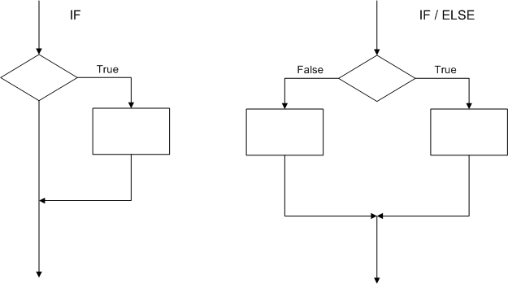<br><sub>Fig 17 - If and Else Control Flow - (<a href='https://web.ics.purdue.edu/~jricha14/Control_Statements/control_statements.htm'>Work by ics</a>) </sub></div>

<br>

**The if Statement**

Use the ```if``` statement to specify a block of Java code to be executed if a condition is ```true```.

```java

if (condition) {
  // block of code to be executed if the condition is true
}

```

OBS: Note that if is in lowercase letters. Uppercase letters (If or IF) will generate an error.

Example

```java

int x = 20;
int y = 18;
if (x > y) {
  System.out.println("x is greater than y");
}

/*

Console

----output---
// x is greater than y

*/

```

**The else Statement**

Use the ```else``` statement to specify a block of code to be executed if the condition is ```false```.

```java

if (condition) {
  // block of code to be executed if the condition is true
} else {
  // block of code to be executed if the condition is false
}

```

Example

```java

int time = 20;
if (time < 18) {
  System.out.println("Good day.");
} else {
  System.out.println("Good evening.");
}

/*

Console

----output---
// Outputs "Good evening."

*/

```

**The else if Statement**

Use the ```else if``` statement to specify a new condition if the first condition is ```false```.

```java

if (condition1) {
  // block of code to be executed if condition1 is true
} else if (condition2) {
  // block of code to be executed if the condition1 is false and condition2 is true
} else {
  // block of code to be executed if the condition1 is false and condition2 is false
}

```

Example

```java

int time = 22;
if (time < 10) {
  System.out.println("Good morning.");
} else if (time < 20) {
  System.out.println("Good day.");
} else {
  System.out.println("Good evening.");
}
// Outputs "Good evening."

/*

Console

----output---
// Outputs "Good evening."

*/

```

Write a program to wish you good morning if the time is from 6 am to 12 pm, good afternoon from 12 pm to 6 pm and good night for other times.

```java

import java.util.Scanner;

public class Main {

	public static void main(String[] args) {
		
		Scanner sc = new Scanner(System.in);
		
		int time;
		System.out.print("Enter a time of day: ");
		time = sc.nextInt();
		
		if (6 <= time && time < 12) {
		System.out.println("Good Morning!");
		}
		else if (12 <= time && time < 18) {
			System.out.println("Good Afternoon!");
			}
		else {
		System.out.println("Good Night!");
		}
		
		sc.close();

	}

}

```
#### <a name="chapter4part4"></a>Chapter 4 - Part 4: Conditional Statement in Java(Short Hand If...Else)


#### <a name="chapter4part5"></a>Chapter 4 - Part 5: Conditional Statement in Java(switch-case)

When you have multiple flow options to handle based on the value of a variable, rather than multiple chained if-else structures, some prefer to use the switch-case structure.

Instead of writing many ```if..else``` statements, you can use the ```switch``` statement.

<br>

<div align="center">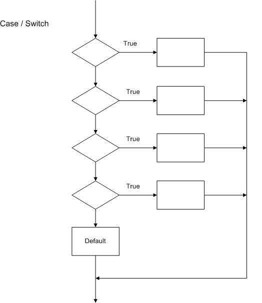<br><sub>Fig 18 - Switch-Case Control Flow - (<a href='https://web.ics.purdue.edu/~jricha14/Control_Statements/control_statements.htm'>Work by ics</a>) </sub></div>

<br>

**The switch Statement**

```java

switch(expression) {
  case x:
    // code block
    break;
  case y:
    // code block
    break;
  default:
    // code block
}

```

This is how it works:

- The switch expression is evaluated once.
- The value of the expression is compared with the values of each case.
- If there is a match, the associated block of code is executed.
- The break and default keywords are optional, and will be described later in this chapter

The example below uses the weekday number to calculate the weekday name:

```java

int day = 4;
switch (day) {
  case 1:
    System.out.println("Monday");
    break;
  case 2:
    System.out.println("Tuesday");
    break;
  case 3:
    System.out.println("Wednesday");
    break;
  case 4:
    System.out.println("Thursday");
    break;
  case 5:
    System.out.println("Friday");
    break;
  case 6:
    System.out.println("Saturday");
    break;
  case 7:
    System.out.println("Sunday");
    break;
}
// Outputs "Thursday" (day 4)

```

**The break Keyword**

When Java reaches a ```break``` keyword, it breaks out of the switch block.

This will stop the execution of more code and case testing inside the block.

When a match is found, and the job is done, it's time for a break. There is no need for more testing.

OBS: A break can save a lot of execution time because it "ignores" the execution of all the rest of the code in the switch block.

**The default Keyword**

The ```default``` keyword specifies some code to run if there is no case match:

```java

int day = 4;
switch (day) {
  case 6:
    System.out.println("Today is Saturday");
    break;
  case 7:
    System.out.println("Today is Sunday");
    break;
  default:
    System.out.println("Looking forward to the Weekend");
}
// Outputs "Looking forward to the Weekend"

```

OBS: Note that if the default statement is used as the last statement in a switch block, it does not need a break.

## <a name="chapter5"></a>Chapter 5: Repetition Structure

#### <a name="chapter5part1"></a>Chapter 5 - Part 1: Repetition Statement in Java(while)

Loops can execute a block of code as long as a specified condition is reached.

Loops are handy because they save time, reduce errors, and they make code more readable.

It is a **control structure** that **repeat** a block of commands **as long as** a condition is true.

The ```while``` loop loops through a block of code as long as a specified condition is ```true```

**When to use**: when **not** know in advance the amount of repetitions to be performed.

<br>

<div align="center">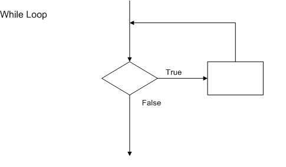<br><sub>Fig 19 - While Control Flow - (<a href='https://web.ics.purdue.edu/~jricha14/Control_Statements/control_statements.htm'>Work by ics</a>) </sub></div>

<br>

**The while Statement**

```java

while (condition) {
  // code block to be executed
}

```

In the example below, the code in the loop will run, over and over again, as long as a variable (i) is less than 5:

```java

int i = 0;
while (i < 5) {
  System.out.println(i);
  i++;
}

```

OBS: Do not forget to increase the variable used in the condition, otherwise the loop will never end!

Exercise: Make a program that reads numbers integers until a zero is read. To final shows the sum of the numbers read.

```java

import java.util.Scanner;

public class Main {

	public static void main(String[] args) {

		Scanner sc = new Scanner(System.in);
		
		int x, sum;
		
		sum = 0;
		System.out.print("Enter the first number: ");
		x = sc.nextInt();
		
		while (x != 0) {
			sum = sum + x;
			System.out.print("Enter another number: ");
			x = sc.nextInt();
		}
		
		System.out.println("SUM = " + sum);
		
		sc.close();
	}

}

```

#### <a name="chapter5part2"></a>Chapter 5 - Part 2: Repetition Statement in Java(for)

It is a **control structure** that **repeat** a block of commands **for a certain range ofvalues.** a condition is true.

When you know exactly how many times you want to loop through a block of code, use the ```for``` loop instead of a ```while``` loop

When to use: when you know previously the amount of repetitions, or the interval of values.

<br>

<div align="center">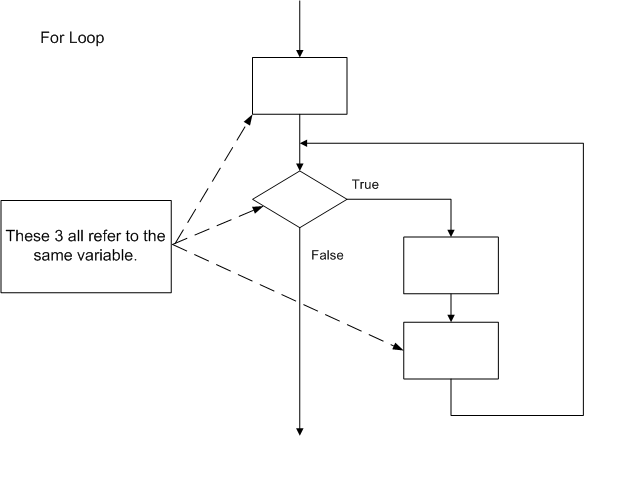<br><sub>Fig 20 - For Control Flow - (<a href='https://web.ics.purdue.edu/~jricha14/Control_Statements/control_statements.htm'>Work by ics</a>) </sub></div>

<br>

**The while Statement**

```java

for (statement 1; statement 2; statement 3) {
  // code block to be executed
}

```

**Statement 1** is executed (one time) before the execution of the code block.

**Statement 2** defines the condition for executing the code block.

**Statement 3** is executed (every time) after the code block has been executed.

The example below will print the numbers 0 to 4:

```java

for (int i = 0; i < 5; i++) {
  System.out.println(i);
}

```

Example explained

Statement 1 sets a variable before the loop starts (int i = 0).

Statement 2 defines the condition for the loop to run (i must be less than 5). If the condition is true, the loop will start over again, if it is false, the loop will end.

Statement 3 increases a value (i++) each time the code block in the loop has been executed.

Example: Make a program that reads a value integer N and then N integers. At the end, it shows the sum of the N numbers read

```java

import java.util.Scanner;

public class Main {

	public static void main(String[] args) {

		Scanner sc = new Scanner(System.in);

		int N, i, x, sum;

		System.out.print("How many numbers will be enter? ");
		N = sc.nextInt();

		sum = 0;
		for (i = 1; i <= N; i++) {
			System.out.print("Enter a number: ");
			x = sc.nextInt();
			sum = sum + x;
		}
		
		System.out.println("SUM = " + sum);
		
		sc.close();

	}

}

```

#### <a name="chapter5part3"></a>Chapter 5 - Part 3: Repetition Statement in Java(do-while)

Loops can execute a block of code as long as a specified condition is reached.

Loops are handy because they save time, reduce errors, and they make code more readable.

The command block executes at least once, as the condition is checked at the end.

The ```do/while``` loop is a variant of the ```while``` loop. This loop will execute the code block once, before checking if the condition is true, then it will repeat the loop as long as the condition is true.

<br>

<div align="center">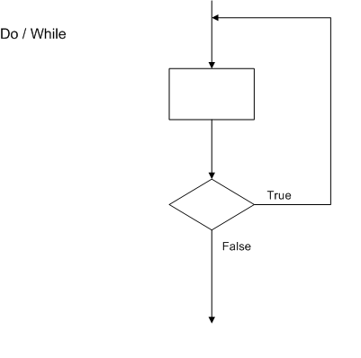<br><sub>Fig 21 - Do/While Control Flow - (<a href='https://web.ics.purdue.edu/~jricha14/Control_Statements/control_statements.htm'>Work by ics</a>) </sub></div>

<br>

**The do/while Statement**

```java

do {
  // code block to be executed
}
while (condition);

```

#### <a name="chapter5part4"></a>Chapter 5 - Part 4: Repetition Statement in Java(For-Each)

There is also a ```for-each``` loop, which is used exclusively to loop through elements in an ```array``` or Collections class (eg, ArrayList):

**The for-each Statement**

```java

for (type variableName : arrayName) {
  // code block to be executed
}

```

The following example outputs all elements in the **cars** array, using a **for-each** loop:

```java

String[] cars = {"Volvo", "BMW", "Ford", "Mazda"};
for (String i : cars) {
  System.out.println(i);
}

```

#### <a name="chapter5part5"></a>Chapter 5 - Part 5: Break and Continue Statement in Java

**Java Break**

You have already seen the ```break``` statement used in an earlier chapter of this tutorial. It was used to "jump out" of a ```switch``` statement.

The ```break``` statement can also be used to jump out of a loop.

This example stops the loop when i is equal to 4:

```java

for (int i = 0; i < 10; i++) {
  if (i == 4) {
    break;
  }
  System.out.println(i);
}

```

**Java Continue**

The continue statement breaks one iteration (in the loop), if a specified condition occurs, and continues with the next iteration in the loop.

This example skips the value of 4:

```java

for (int i = 0; i < 10; i++) {
  if (i == 4) {
    continue;
  }
  System.out.println(i);
}

```

**Break and Continue in While Loop**

You can also use **break** and **continue** in while loops:

```java

int i = 0;
while (i < 10) {
  System.out.println(i);
  i++;
  if (i == 4) {
    break;
  }
}

```

```java

int i = 0;
while (i < 10) {
  if (i == 4) {
    i++;
    continue;
  }
  System.out.println(i);
  i++;
}

```

## <a name="chapter6"></a>Chapter 6: Arrays

#### <a name="chapter6part1"></a>Chapter 6 - Part 1: Array

In programming, "vector" is the name given to one-dimensional arrays.

Array is a data Structure:
- Homogeneous (data of the same type)
- Ordered (elements accessed through positions)
- Allocated at once, in a contiguous block of memory

Advantages:
- Immediate access to elements by their position

Disadvantages:
- Fixed Size
- Difficulty performing insertions and deletions

<br>

<div align="center">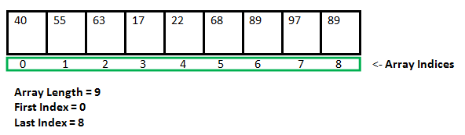<br><sub>Fig 22 - Array - (<a href='https://www.geeksforgeeks.org/arrays-in-java/'>Work by geeksforgeeks</a>) </sub></div>

<br>

Arrays are used to store multiple values in a single variable, instead of declaring separate variables for each value.

To declare an array, define the variable type with **square brackets** ```[]```:

```java

String[] cars;

```

We have now declared a variable that holds an array of strings. To insert values to it, you can place the values in a comma-separated list, inside curly braces:

```java

String[] cars = {"Volvo", "BMW", "Ford", "Mazda"};

```

To create an array of integers, you could write:

```java

int[] myNum = {10, 20, 30, 40};

```

**Access the Elements of an Array**

You can access an array element by referring to the index number.

This statement accesses the value of the first element in cars:

```java

String[] cars = {"Volvo", "BMW", "Ford", "Mazda"};
System.out.println(cars[0]);
// Outputs Volvo

```

OBS: Array indexes start with 0: [0] is the first element. [1] is the second element, etc.

**Change an Array Element**

To change the value of a specific element, refer to the index number:

```java

cars[0] = "Opel";

```

```java

String[] cars = {"Volvo", "BMW", "Ford", "Mazda"};
cars[0] = "Opel";
System.out.println(cars[0]);
// Now outputs Opel instead of Volvo

```

**Array Length**

To find out how many elements an array has, use the ```length``` property:

```java

String[] cars = {"Volvo", "BMW", "Ford", "Mazda"};
System.out.println(cars.length);
// Outputs 4

```

Example: Create a program that reads a certain amount of given double numbers and that in the end they are displayed on the screen

```java

import java.util.Locale;
import java.util.Scanner;

public class Main {

	public static void main(String[] args) {
		
		Locale.setDefault(Locale.US);
		Scanner sc = new Scanner(System.in);
		
		int N, i;
		
		System.out.print("How many numbers will be enter? ");
		N = sc.nextInt();
		
		double[] vet = new double[N];
		
		for (i = 0; i < N; i++) {
			System.out.print("Enter a number: ");
			vet[i] = sc.nextDouble();
		}
		
		System.out.println("\nTyped Numbers:");
		for (i = 0; i < N; i++) {
			System.out.println(String.format("%.1f", vet[i]));
		}
		
		sc.close();

	}

}

```

#### <a name="chapter6part2"></a>Chapter 6 - Part 2: Loop Through an Array

You can loop through the array elements with the ```for``` loop, and use the ```length``` property to specify how many times the loop should run.

The following example outputs all elements in the cars array:

```java

String[] cars = {"Volvo", "BMW", "Ford", "Mazda"};
for (int i = 0; i < cars.length; i++) {
  System.out.println(cars[i]);
}

```

There is also a ```for-each``` loop, which is used exclusively to loop through elements in an ```array``` or Collections class (eg, ArrayList):

**The for-each Statement**

```java

for (type variableName : arrayName) {
  // code block to be executed
}

```

The following example outputs all elements in the **cars** array, using a **for-each** loop:

```java

String[] cars = {"Volvo", "BMW", "Ford", "Mazda"};
for (String i : cars) {
  System.out.println(i);
}

```

The example above can be read like this: **for each** ```String``` element (called **i** - as in **i**ndex) in **cars**, print out the value of **i**.

If you compare the ```for``` loop and **for-each** loop, you will see that the **for-each** method is easier to write, it does not require a counter (using the length property), and it is more readable.

#### <a name="chapter6part3"></a>Chapter 6 - Part 3: Multidimensional Arrays

A multidimensional array is an array of arrays.

In programming, "Matriz" is the name given to two-dimensional arrays.
obs: array is an array of arrays.

Array is a data Structure:
- Homogeneous (data of the same type)
- Ordered (elements accessed through positions)
- Allocated at once, in a contiguous block of memory

Advantages:
- Immediate access to elements by their position

Disadvantages:
- Fixed Size
- Difficulty performing insertions and deletions

To create a two-dimensional array, add each array within its own set of **curly braces** ```[][]```:

<br>

<div align="center">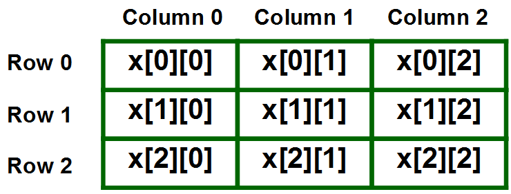<br><sub>Fig 23 - Multidimensional Array - (<a href='https://www.geeksforgeeks.org/multidimensional-arrays-in-java/?ref=lbp'>Work by geeksforgeeks</a>) </sub></div>

<br>

```java

int[][] myNumbers = { {1, 2, 3, 4}, {5, 6, 7} };

```

**myNumbers** is now an array with two arrays as its elements.

To access the elements of the **myNumbers** array, specify two indexes: one for the array, and one for the element inside that array. This example accesses the third element (2) in the second array (1) of myNumbers:

```java

int[][] myNumbers = { {1, 2, 3, 4}, {5, 6, 7} };
int x = myNumbers[1][2];
System.out.println(x); // Outputs 7

```

We can also use a ```for loop``` inside another ```for loop``` to get the elements of a two-dimensional array (we still have to point to the two indexes):

```java

public class Main {
  public static void main(String[] args) {
    int[][] myNumbers = { {1, 2, 3, 4}, {5, 6, 7} };
    for (int i = 0; i < myNumbers.length; ++i) {
      for(int j = 0; j < myNumbers[i].length; ++j) {
        System.out.println(myNumbers[i][j]);
      }
    }
  }
}

```

Example: Create a Matrix

```java

import java.util.Scanner;

public class Main {

	public static void main(String[] args) {
		
		Scanner sc = new Scanner(System.in);
		
		int M, N, i, j;
		
		System.out.print("How many rows the matrix will be? ");
		M = sc.nextInt();
		System.out.print("How many columns the matrix will be? ");
		N = sc.nextInt();
		
		int[][] mat = new int[M][N];
		
		for (i = 0; i < M; i++) {
			for (j = 0; j < N; j++) {
				System.out.print("Element [" + i + "," + j + "]: ");
				mat[i][j] = sc.nextInt();
			}
		}
		
		System.out.println("\nTyped Matrix:");
		for (i = 0; i < M; i++) {
			for (j = 0; j < N; j++) {
				System.out.print(mat[i][j] + " ");	
			}
			System.out.println();
		}
		
		sc.close();
	}

}

```

## <a name="chapter7"></a>Chapter 7: Conventions, Strings, bitwise operators and functions

#### <a name="chapter7part1"></a>Chapter 7 - Part 1: Name Convention

Restrictions for variable names:

- Cannot start with a digit: use a letter or _
- Do not use accents or tildes
- Cannot have white space
- Tip: Use names that have meaning

**wrong**:
int 5minutes;
int salário;
int salario do funcionario;

**Correct**:
int _5minutes;
int salario;
int salarioDoFuncionario;

Conventions

Camel Case: lastName
- packages
- attributes
- methods
- variables and parameters

Pascal Case: ProductService
- classes

```java

package entities;

public class Account {

	private String holder;
	private Double balance;
	
	public Account(String holder, Double balance) {
		this.holder = holder;
		this.balance = balance;
	}
	
	public String getHolder() {
		return holder;
	}
	
	public void deposit(double amount) {
		balance += amount;
	}
	
	public void withdraw(double amount) {
		balance -= amount;
	}
	
}

```

#### <a name="chapter7part3"></a>Chapter 7 - Part 3: String Functions

[For more Strings Methods](https://www.w3schools.com/java/java_ref_string.asp)

- Format: toLowerCase(), toUpperCase(), trim()

- Cut: substring(start), substring(start, end)

- Replace: Replace(char, char), Replace(string, string)

- Search: IndexOf, LastIndexOf

-  str.Split(" ")

```java

public class Program {

	public static void main(String[] args) {
	
		String txt = "ABCDEFGHIJKLMNOPQRSTUVWXYZ";
		
		System.out.println("The length of the txt string is: " + txt.length()); //The length of the txt string is: 26

		String original = "abcde FGHIJ ABC abc DEFG ";

		String s01 = original.toLowerCase();

		String s02 = original.toUpperCase();

		String s03 = original.trim();

		String s04 = original.substring(2);

		String s05 = original.substring(2, 9);

		String s06 = original.replace('a', 'x');

		String s07 = original.replace("abc", "xy");

		int i = original.indexOf("bc");

		int j = original.lastIndexOf("bc");

		System.out.println("Original: -" + original + "-"); // Original: -abcde FGHIJ ABC abc DEFG -

		System.out.println("toLowerCase: -" + s01 + "-"); // toLowerCase: -abcde fghij abc abc defg -

		System.out.println("toUpperCase: -" + s02 + "-"); // toUpperCase: -ABCDE FGHIJ ABC ABC DEFG -

		System.out.println("trim: -" + s03 + "-"); // trim: -abcde FGHIJ ABC abc DEFG-

		System.out.println("substring(2): -" + s04 + "-"); // substring(2): -cde FGHIJ ABC abc DEFG -
		
		System.out.println("substring(2, 9): -" + s05 + "-"); // substring(2, 9): -cde FGH-

		System.out.println("replace('a', 'x'): -" + s06 + "-"); // replace('a', 'x'): -xbcde FGHIJ ABC xbc DEFG -

		System.out.println("replace('abc', 'xy'): -" + s07 + "-"); // replace('abc', 'xy'): -xyde FGHIJ ABC xy DEFG -

		System.out.println("Index of 'bc': " + i); // Index of 'bc': 1

		System.out.println("Last index of 'bc': " + j); // Last index of 'bc': 17
	}
}

```

```java

public class Program {

	public static void main(String[] args) {
	
		String s = "potato apple lemon";
		String[] vect = s.split(" ");
		String word1 = vect[0];
		String word2 = vect[1];
		String word3 = vect[2];
		
		System.out.println(word1); // potato
		System.out.println(word2); // apple
		System.out.println(word3); // lemon
		
	}
}

```

**String Concatenation**

The ```+``` operator can be used between strings to combine them. This is called concatenation:

```java

String firstName = "John";
String lastName = "Doe";
System.out.println(firstName + " " + lastName); //John Doe 

```

OBS: Note that we have added an empty text (" ") to create a space between firstName and lastName on print.

You can also use the ```concat()``` method to concatenate two strings:

```java

String firstName = "John ";
String lastName = "Doe";
System.out.println(firstName.concat(lastName)); //John Doe 


```

**Adding Numbers and Strings**


WARNING!

Java uses the ```+``` operator for both addition and concatenation.

Numbers are added. Strings are concatenated.

If you add two numbers, the result will be a number:

```java

int x = 10;
int y = 20;
int z = x + y;  // z will be 30 (an integer/number)

```

If you add two strings, the result will be a string concatenation:

```java

String x = "10";
String y = "20";
String z = x + y;  // z will be 1020 (a String)

```

If you add a number and a string, the result will be a string concatenation:

```java

String x = "10";
int y = 20;
String z = x + y;  // z will be 1020 (a String)

```

**Strings - Special Characters**

Because strings must be written within quotes, Java will misunderstand this string, and generate an error:

```java

Because strings must be written within quotes, Java will misunderstand this string, and generate an error:

```

The solution to avoid this problem, is to use the **backslash escape character**.

The backslash (```\```) escape character turns special characters into string characters:

| Escape character | Result   |Description   |
| :---------------:| :-------:|:-----------: |
| \'               | '        | Single quote |
| \"               | "        | Double quote |
| \\               | \        | Backslash    |


The sequence ```\"```  inserts a double quote in a string:

```java

String txt = "We are the so-called \"Vikings\" from the north.";

```

The sequence ```\'```  inserts a single quote in a string:

```java

String txt = "It\'s alright.";

```

The sequence ```\\```  inserts a single backslash in a string:

```java

String txt = "The character \\ is called backslash.";

```

| Code | Result          |
| :---:| :--------------:|
| \n   | New Line        |
| \r   | Carriage Return | 
| \t   | Tab             |
| \b   | Backspace       |
| \f   | Form Feed       |

#### <a name="chapter7part4"></a>Chapter 7 - Part 4: Comments

Block Comment: 

```java

/*

Your comment her

*/

```

Line Comment: 

```java

// Your comment her

```

```java

import java.util.Locale;
import java.util.Scanner;

/*
Este programa calcula as raízes de uma equação do segundo grau

Os valores dos coeficientes devem ser digitados um por linha
*/

public class Program {
	public static void main(String[] args) {
		
		Locale.setDefault(Locale.US);
		Scanner sc = new Scanner(System.in);
		
		double a, b, c, delta;
		
		System.out.println("Digite os valores dos coeficientes:");
		a = sc.nextDouble();
		b = sc.nextDouble();
		c = sc.nextDouble();
		
		delta = b * b - 4 * a * c; // cálculo do valor de delta
		
		System.out.println(delta);
		
		sc.close();

	}
}

```

#### <a name="chapter7part5"></a>Chapter 7 - Part 5: Functions

They represent a processing that has a meaning:

- Math.sqrt(double)
-  System.out.println(string)

Main advantages:

- modularization, delegation and reuse

Functions can Input and output data:

- Functions can receive input data (parameters or arguments)
- Functions may or may not return an output

 In object orientation, functions in classes are called "methods"
 
 Example: Write a program to read three integers and display the largest one on the screen
 
 **Without Function Implementation**
 
 ```java
 
 import java.util.Scanner;

public class Program {
	public static void main(String[] args) {
		
		Scanner sc = new Scanner(System.in);
		
		System.out.println("Enter three numbers:");
		int a = sc.nextInt();
		int b = sc.nextInt();
		int c = sc.nextInt();
		
		if (a > b && a > c) {
			System.out.println("Higher = " + a);
		} else if (b > c) {
			System.out.println("Higher = " + b);
		} else {
			System.out.println("Higher = " + c);
		}
		
		sc.close();

	}
}
 
 ```
 
 **With Function Implementation**
 
  ```java
  
  import java.util.Scanner;

public class Program {
	public static void main(String[] args) {

		Scanner sc = new Scanner(System.in);
		
		System.out.println("Enter three numbers:");
		int a = sc.nextInt();
		int b = sc.nextInt();
		int c = sc.nextInt();
		
		int higher = max(a, b, c);
		
		showResult(higher);
		
		sc.close();
	}

	public static int max(int x, int y, int z) { //max function creation
		int aux;
		if (x > y && x > z) {
			aux = x;
		} else if (y > z) {
			aux = y;
		} else {
			aux = z;
		}
		return aux;
	}

	public static void showResult(int value) {
		System.out.println("Higher = " + value);
	}

}
  
   ```

#### <a name="chapter9part2"></a>Chapter 9 - Part 2: Classes, Objects and Attributes in Java

Classes and objects are the two main aspects of object-oriented programming.

**Class**

- Class: is the definition of the type

- It is a structured type that can contain (members):
  - Attributes (data / fields)
  - Methods (functions / operations)

- The class can also provide many other features, such as:
  - Constructors
  - Overloading
  - Encapsulation
  - Inheritance
  - Polymorphism

- Examples:
  - Entities: Product, Customer, Triangle
  - Services: ProductService, ClienteService, EmailService, StorageService
  - Controllers: ProductController, ClienteController
  - Utilities: Calculator, Compactor
  - Others (views, repositories, managers, etc.)

Everything in Java is associated with classes and objects, along with its attributes and methods. For example: in real life, a car is an object. The car has attributes, such as weight and color, and methods, such as drive and brake. 

A Class is like an object constructor, or a "blueprint" for creating objects.

**Create a Class**

To create a class, use the keyword ```class```:

```java

public class Triangle { //class Triangle
	public double a; // attribute of a triangle
	public double b; // attribute of a triangle
	public double c; // attribute of a triangle
}

```

**Object**

- Objects: are instances of the class

**Create a Object**

In Java, an object is created from a class. We have already created the class named ```Triangle```, so now we can use this to create objects.

To create an object of ```Triangle```, specify the class name, followed by the object name, and use the keyword ```new```:

```java

public class Program {
	
	public static void main(String[] args) {
	
		Triangle x, y;
		x = new Triangle();
		y = new Triangle();
	}
}

```

Now we created two objects of Class type Triagle, x and y.

Look at the following illustration to see the difference between class and objects:

<br>

<div align="center">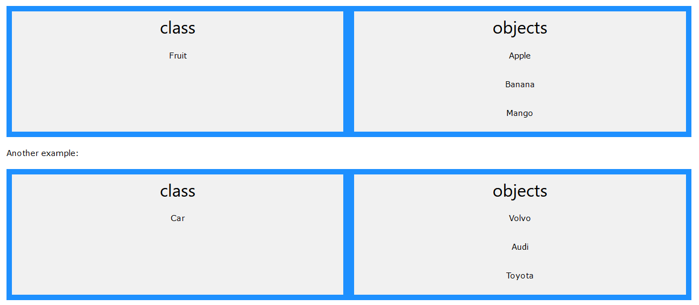<br><sub>Fig 28 - Class and objects - (<a href='https://www.w3schools.com/java/java_oop.asp'>Work by  w3schools</a>) </sub></div>

<br>

So, a class is a template for objects, and an object is an instance of a class.

When the individual objects are created, they inherit all the variables and methods from the class.

**Attributes**

In the class ```Triangle``` we used the term "variable" for ```a```, ```b``` and ```c```. It is actually an attribute of the class. Or you could say that class attributes are variables within a class.


```java

public class Triangle { //class Triangle
	public double a; // attribute of a triangle
	public double b; // attribute of a triangle
	public double c; // attribute of a triangle
}

```

**Accessing Attributes**

You can access attributes by creating an object of the class, and by using the dot syntax (```.```):

```java

import java.util.Locale;

public class Program {
	
	public static void main(String[] args) {
		
		Locale.setDefault(Locale.US);
		

		Triangle x, y;
		x = new Triangle();
		y = new Triangle();
		
		x.a = 3.00;
		x.b = 4.00;
		x.c = 5.00;
		
		y.a = 7.50;
		y.b = 4.50;
		y.c = 4.02;
		
	}
}

```

**Modify Attributes**

You can also modify attribute values:

```java

public class Main {
  int x;

  public static void main(String[] args) {
    Main myObj = new Main();
    myObj.x = 40;
    System.out.println(myObj.x);
  }
}


```

Or override existing values:

```java

public class Main {
  int x = 10;

  public static void main(String[] args) {
    Main myObj = new Main();
    myObj.x = 25; // x is now 25
    System.out.println(myObj.x);
  }
}

```

If you don't want the ability to override existing values, declare the attribute as ```final```:

```java

public class Main {
  final int x = 10;

  public static void main(String[] args) {
    Main myObj = new Main();
    myObj.x = 25; // will generate an error: cannot assign a value to a final variable
    System.out.println(myObj.x);
  }
}

```

OBS1: The ```final``` keyword is useful when you want a variable to always store the same value, like PI (3.14159...).

OBS2: The ```final``` keyword is called a "modifier".

#### <a name="chapter9part3"></a>Chapter 9 - Part 3: Solving the same Problem with object orientation

Create the class ```Triangle``` with the attributes

```java

public class Triangle { //class Triangle
	public double a; // attribute of a triangle
	public double b; // attribute of a triangle
	public double c; // attribute of a triangle
}

```

Now, create the Program, calling the class ```Triangle```

```java

import java.util.Locale;
import java.util.Scanner;

public class Program {
	
	public static void main(String[] args) {
		
		Locale.setDefault(Locale.US);
		Scanner sc = new Scanner(System.in);
		

		Triangle x, y;
		x = new Triangle();
		y = new Triangle();
		
		System.out.println("Enter the measures of triangle X: ");
		x.a = sc.nextDouble();
		x.b = sc.nextDouble();
		x.c = sc.nextDouble();
		System.out.println("Enter the measures of triangle Y: ");
		y.a = sc.nextDouble();
		y.b = sc.nextDouble();
		y.c = sc.nextDouble();
		
		double p = (x.a + x.b + x.c) / 2.0;
		double areaX = Math.sqrt(p * (p - x.a) * (p - x.b) * (p - x.c));
		
		p = (y.a + y.b + y.c) / 2.0;
		double areaY = Math.sqrt(p * (p - y.a) * (p - y.b) * (p - y.c));
		
		System.out.printf("Triangle X area: %.4f%n", areaX);
		System.out.printf("Triangle Y area: %.4f%n", areaY);
		
		if (areaX > areaY) {
			System.out.println("Larger area: X");
		} else {
			System.out.println("Larger area: Y");
		}
		
		sc.close();
	}
}

```

#### <a name="chapter9part4"></a>Chapter 9 - Part 4: Methods in Java

A method is a block of code which only runs when it is called.

You can pass data, known as parameters, into a method.

Methods are used to perform certain actions, and they are also known as functions.

Why use methods? To reuse code: define the code once, and use it many times.

**Create a Method**

A method must be declared within a class. It is defined with the name of the method, followed by parentheses ```()```. Java provides some pre-defined methods, such as ```System.out.println()```, but you can also create your own methods to perform certain actions:

Create a method inside Main:

```java

public class Main {
  static void myMethod() {
    // code to be executed
  }
}

```

Example Explained: 

- ```myMethod()``` is the name of the method
- ```static``` means that the method belongs to the Main class and not an object of the Main class. You will learn more about objects and how to access methods through objects later in this tutorial.

- ```void``` means that this method does not have a return value. You will learn more about return values later in this chapter

**Call a Method**

To call a method in Java, write the method's name followed by two parentheses ```()``` and a semicolon```;```

In the following example, ```myMethod()``` is used to print a text (the action), when it is called:

Inside ```main```, call the ```myMethod()``` method:

```java

public class Main {
  static void myMethod() {
    System.out.println("I just got executed!");
  }

  public static void main(String[] args) {
    myMethod();
  }
}

// Outputs "I just got executed!"

```

A method can also be called multiple times:

```java

public class Main {
  static void myMethod() {
    System.out.println("I just got executed!");
  }

  public static void main(String[] args) {
    myMethod();
    myMethod();
    myMethod();
  }
}

// I just got executed!
// I just got executed!
// I just got executed!

```

**Parameters and Arguments**

Information can be passed to methods as parameter. Parameters act as variables inside the method.

Parameters are specified after the method name, inside the parentheses. You can add as many parameters as you want, just separate them with a comma.

The following example has a method that takes a ```String``` called fname as parameter. When the method is called, we pass along a first name, which is used inside the method to print the full name: 

```java

public class Main {
  static void myMethod(String fname) {
    System.out.println(fname + " Refsnes");
  }

  public static void main(String[] args) {
    myMethod("Liam");
    myMethod("Jenny");
    myMethod("Anja");
  }
}
// Liam Refsnes
// Jenny Refsnes
// Anja Refsnes

```

OBS: When a **parameter** is passed to the method, it is called an **argument**. So, from the example above: ```fname``` is a **parameter**, while ```Liam```, ```Jenny``` and ```Anja``` are **arguments**.

**Multiple Parameters**

You can have as many parameters as you like:

```java

public class Main {
  static void myMethod(String fname, int age) {
    System.out.println(fname + " is " + age);
  }

  public static void main(String[] args) {
    myMethod("Liam", 5);
    myMethod("Jenny", 8);
    myMethod("Anja", 31);
  }
}

// Liam is 5
// Jenny is 8
// Anja is 31

```

OBS:Note that when you are working with multiple parameters, the method call must have the same number of arguments as there are parameters, and the arguments must be passed in the same order.

**Return Values**

The ```void``` keyword, used in the examples above, indicates that the method should not return a value. If you want the method to return a value, you can use a primitive data type (such as ```int```, ```char```, etc.) instead of ```void```, and use the ```return``` keyword inside the method:

```java

public class Main {
  static int myMethod(int x) {
    return 5 + x;
  }

  public static void main(String[] args) {
    System.out.println(myMethod(3));
  }
}
// Outputs 8 (5 + 3)

```

This example returns the sum of a method's two parameters:

```java

public class Main {
  static int myMethod(int x, int y) {
    return x + y;
  }

  public static void main(String[] args) {
    System.out.println(myMethod(5, 3));
  }
}
// Outputs 8 (5 + 3)

```

You can also store the result in a variable (recommended, as it is easier to read and maintain):

```java

public class Main {
  static int myMethod(int x, int y) {
    return x + y;
  }

  public static void main(String[] args) {
    int z = myMethod(5, 3);
    System.out.println(z);
  }
}
// Outputs 8 (5 + 3)

```

**A Method with If...Else**

It is common to use ```if...else``` statements inside methods:

```java

public class Main {

  // Create a checkAge() method with an integer variable called age
  static void checkAge(int age) {

    // If age is less than 18, print "access denied"
    if (age < 18) {
      System.out.println("Access denied - You are not old enough!");

    // If age is greater than, or equal to, 18, print "access granted"
    } else {
      System.out.println("Access granted - You are old enough!");
    }

  }

  public static void main(String[] args) {
    checkAge(20); // Call the checkAge method and pass along an age of 20
  }
}

// Outputs "Access granted - You are old enough!"

```

**Method Overloading**

With method overloading, multiple methods can have the same name with different parameters:

```java

int myMethod(int x)
float myMethod(float x)
double myMethod(double x, double y)

```

Consider the following example, which has two methods that add numbers of different type:

```java

static int plusMethodInt(int x, int y) {
  return x + y;
}

static double plusMethodDouble(double x, double y) {
  return x + y;
}

public static void main(String[] args) {
  int myNum1 = plusMethodInt(8, 5);
  double myNum2 = plusMethodDouble(4.3, 6.26);
  System.out.println("int: " + myNum1);
  System.out.println("double: " + myNum2);
}

```

Instead of defining two methods that should do the same thing, it is better to overload one.

In the example below, we overload the ```plusMethod``` method to work for both ```int``` and ```double```:

```java

static int plusMethod(int x, int y) {
  return x + y;
}

static double plusMethod(double x, double y) {
  return x + y;
}

public static void main(String[] args) {
  int myNum1 = plusMethod(8, 5);
  double myNum2 = plusMethod(4.3, 6.26);
  System.out.println("int: " + myNum1);
  System.out.println("double: " + myNum2);
}

```

OBS: Note: Multiple methods can have the same name as long as the number and/or type of parameters are different.

**Method Scope**

Variables declared directly inside a method are available anywhere in the method following the line of code in which they were declared:

```java

public class Main {
  public static void main(String[] args) {

    // Code here CANNOT use x

    int x = 100;

    // Code here can use x
    System.out.println(x);
  }
}

```

**Block Scope**

A block of code refers to all of the code between curly braces ```{}```.

Variables declared inside blocks of code are only accessible by the code between the curly braces, which follows the line in which the variable was declared:

```java

public class Main {
  public static void main(String[] args) {

    // Code here CANNOT use x

    { // This is a block

      // Code here CANNOT use x

      int x = 100;

      // Code here CAN use x
      System.out.println(x);

   } // The block ends here

  // Code here CANNOT use x

  }
}

```

OBS: A block of code may exist on its own or it can belong to an ```if```, ```while``` or ```for``` statement. In the case of ```for``` statements, variables declared in the statement itself are also available inside the block's scope.

**Static vs. Public**

You will often see Java programs that have either ```static``` or ```public``` attributes and methods.

In the example above, we created a ```static``` method, which means that it can be accessed without creating an object of the class, unlike ```public```, which can only be accessed by objects:

An example to demonstrate the differences between ```static``` and ```public``` methods:

```java

public class Main {
  // Static method
  static void myStaticMethod() {
    System.out.println("Static methods can be called without creating objects");
  }

  // Public method
  public void myPublicMethod() {
    System.out.println("Public methods must be called by creating objects");
  }

  // Main method
  public static void main(String[] args) {
    myStaticMethod(); // Call the static method
    // myPublicMethod(); This would compile an error

    Main myObj = new Main(); // Create an object of Main
    myObj.myPublicMethod(); // Call the public method on the object
  }
}

```

**Access Methods With an Object**

Create a Car object named ```myCar```. Call the ```fullThrottle()``` and ```speed()``` methods on the ```myCar``` object, and run the program:

```java

// Create a Main class
public class Main {
 
  // Create a fullThrottle() method
  public void fullThrottle() {
    System.out.println("The car is going as fast as it can!");
  }

  // Create a speed() method and add a parameter
  public void speed(int maxSpeed) {
    System.out.println("Max speed is: " + maxSpeed);
  }

  // Inside main, call the methods on the myCar object
  public static void main(String[] args) {
    Main myCar = new Main();   // Create a myCar object
    myCar.fullThrottle();      // Call the fullThrottle() method
    myCar.speed(200);          // Call the speed() method
  }
}

// The car is going as fast as it can!
// Max speed is: 200


```

**Example explained**

- 1) We created a custom ```Main``` class with the ```class``` keyword.

- 2) We created the ```fullThrottle()``` and ```speed()``` methods in the ```Main``` class.

- 3) The ```fullThrottle()``` method and the ```speed()``` method will print out some text, when they are called.

- 4) The ```speed()``` method accepts an ```int``` parameter called ```maxSpeed``` - we will use this in VIII).

- 5) In order to use the ```Main``` class and its methods, we need to create an **object** of the ```Main``` Class.

- 6) Then, go to the ```main()``` method, which you know by now is a built-in Java method that runs your program (any code inside main is executed).

- 7) By using the ```new``` keyword we created an object with the name ```myCar```.

- 8) Then, we call the ```fullThrottle()``` and ```speed()``` methods on the ```myCar``` object, and run the program using the name of the object (```myCar```), followed by a dot (```.```), followed by the name of the method (```fullThrottle();``` and ```speed(200);```). Notice that we add an ```int``` parameter of **200** inside the ```speed()``` method.

#### <a name="chapter9part5"></a>Chapter 9 - Part 5: Continuing to solve the Problem with object orientation

Create the class ```Triangle``` with the attributes

```java

public class Triangle { //class Triangle
	public double a; // attribute of a triangle
	public double b; // attribute of a triangle
	public double c; // attribute of a triangle
	
	public double area() { // method of triangle
		double p = (a + b + c) / 2.0;
		return Math.sqrt(p * (p - a) * (p - b) * (p - c));
	}
}

```

Now, create the Program, calling the class ```Triangle```

```java

import java.util.Locale;
import java.util.Scanner;

public class Program {
	
	public static void main(String[] args) {
		
		Locale.setDefault(Locale.US);
		Scanner sc = new Scanner(System.in);
		

		Triangle x, y;
		x = new Triangle();
		y = new Triangle();
		
		System.out.println("Enter the measures of triangle X: ");
		x.a = sc.nextDouble();
		x.b = sc.nextDouble();
		x.c = sc.nextDouble();
		System.out.println("Enter the measures of triangle Y: ");
		y.a = sc.nextDouble();
		y.b = sc.nextDouble();
		y.c = sc.nextDouble();
		
		double areaX = x.area();
		double areaY = y.area();
		
		System.out.printf("Triangle X area: %.4f%n", areaX);
		System.out.printf("Triangle Y area: %.4f%n", areaY);
		
		if (areaX > areaY) {
			System.out.println("Larger area: X");
		} else {
			System.out.println("Larger area: Y");
		}
		
		sc.close();
	}
}

```

#### <a name="chapter9part6"></a>Chapter 9 - Part 6: Second problem with object orientation

Write a program to read the data of a product in stock (name, price and quantity in stock).

Then:

- Show product data (name, price, quantity in stock, total value on inventory)

- Make a stock entry and show the product data again

- Carry out an issue in the stock and show the product data again

To solve this problem, you must create a CLASS according to the project on the side:

<br>

<div align="center">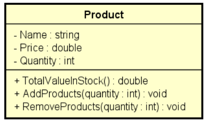<br><sub>Fig 29 - Problem with OOP - (<a href='https://www.udemy.com/course/java-curso-completo/'>Work by  Nelio Alves</a>) </sub></div>

<br>

<div align="center">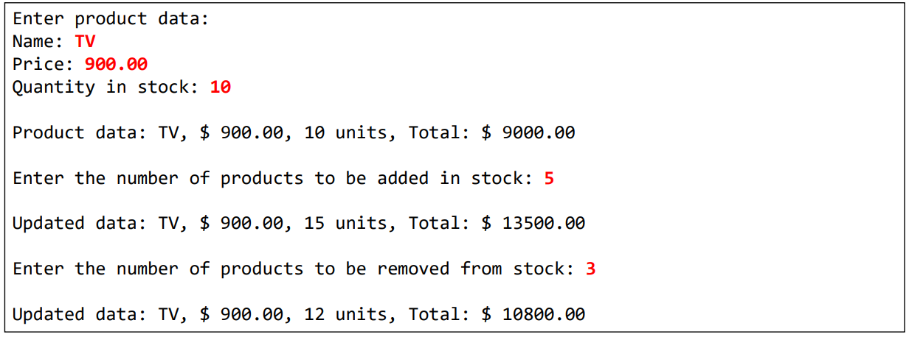<br><sub>Fig 29 - Problem with OOP - (<a href='https://www.udemy.com/course/java-curso-completo/'>Work by  Nelio Alves</a>) </sub></div>

<br>

To solve this problem, we need to understand the Object Class in Java

#### <a name="chapter9part7"></a>Chapter 9 - Part 7: Object Class in Java

**Object Class in Java**

The **Object class** is the parent class of all the classes in java by default. In other words, it is the topmost class of java.

The Object class is beneficial if you want to refer any object whose type you don't know. Notice that parent class reference variable can refer the child class object, know as upcasting.

<br>

<div align="center">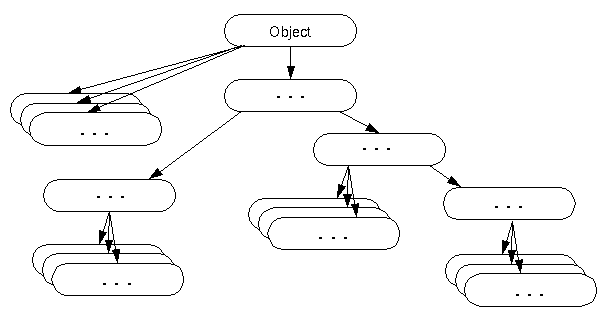<br><sub>Fig 30 - Class Object Inheritance in Java - (<a href='https://www.javatpoint.com/object-class'>Work by  java T Point</a>) </sub></div>

<br>

Let's take an example, there is getObject() method that returns an object but it can be of any type like Employee,Student etc, we can use Object class reference to refer that object. For example:

```java

Object obj=getObject();//we don't know what object will be returned from this method  

```

The Object class provides some common behaviors to all the objects such as object can be compared, object can be cloned, object can be notified etc. 


<br>

<div align="center">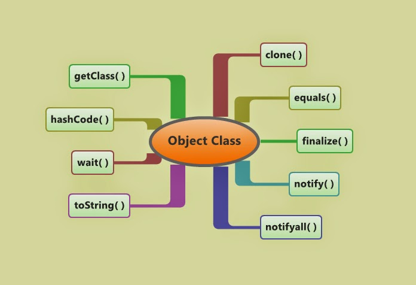<br><sub>Fig 31 - Class Object Methods in Java - (<a href='https://www.javatpoint.com/object-class'>Work by  java T Point</a>) </sub></div>

<br>

**Methods of Object class**

| Method                                                                      | Description     |
| :--------------------------------------------------------------------------:| :--------------:|
| public final Class getClass()                                               | returns the Class class object of this object. The Class class can further be used to get the metadata of this class.       |
| public int hashCode()                                                       | returns the hashcode number for this object. | 
| public boolean equals(Object obj)                                           | compares the given object to this object.             |
| protected Object clone() throws CloneNotSupportedException                  | creates and returns the exact copy (clone) of this object.       |
| public String toString()                                                    |returns the string representation of this object.       |
| public final void notify()                                                  | wakes up single thread, waiting on this object's monitor.       |
| public final void notifyAll()                                               | wakes up all the threads, waiting on this object's monitor.       |
| public final void wait(long timeout)throws InterruptedException             | causes the current thread to wait for the specified milliseconds, until another thread notifies (invokes notify() or notifyAll() method).       |
| public final void wait(long timeout,int nanos)throws InterruptedException   | causes the current thread to wait for the specified milliseconds and nanoseconds, until another thread notifies (invokes notify() or notifyAll() method).       |
| public final void wait()throws InterruptedException                         | causes the current thread to wait, until another thread notifies (invokes notify() or notifyAll() method).       |
| protected void finalize()throws Throwable                                   | is invoked by the garbage collector before object is being garbage collected.       |


Now, we will use the method ```toString()``` that will be able to display the name and attributes of the Product.

**Class Product**

```java

public class Product {

	public String name;
	public double price;
	public int quantity;

	public double totalValueInStock() {
		return price * quantity;
	}

	public void addProducts(int quantity) {
		this.quantity += quantity;
	}

	public void removeProducts(int quantity) {
		this.quantity -= quantity;
	}
	
	public String toString() {
		return name
		+ ", $ "
		+ String.format("%.2f", price)
		+ ", "
		+ quantity
		+ " units, Total: $ "
		+ String.format("%.2f", totalValueInStock());
	}

}

```

**Program**

```java

import java.util.Locale;
import java.util.Scanner;

public class Program {
	
	public static void main(String[] args) {
		
		Locale.setDefault(Locale.US);
		Scanner sc = new Scanner(System.in);
		
		Product product = new Product();
		System.out.println("Enter product data: ");
		System.out.print("Name: ");
		product.name = sc.nextLine();
		System.out.print("Price: ");
		product.price = sc.nextDouble();
		System.out.print("Quantity in stock: ");
		product.quantity = sc.nextInt();
		
		System.out.println();
		System.out.println("Product data: " + product);
		
		System.out.println();
		System.out.print("Enter the number of products to be added in stock: ");
		int quantity = sc.nextInt();
		product.addProducts(quantity);
		
		System.out.println();
		System.out.println("Updated data: " + product);
		
		System.out.println();
		System.out.print("Enter the number of products to be removed from stock: ");
		quantity = sc.nextInt();
		product.removeProducts(quantity);
		
		System.out.println();
		System.out.println("Updated data: " + product);
		
		sc.close();
	}
}

```

#### <a name="chapter9part8"></a>Chapter 9 - Part 8: Third problem with object orientation

Make a program to read any numerical value, and then display what would be the value of a circle and the volume of a sphere for a radius of that value. Also inform the value of PI with two decimal places.

Ex:

Enter radius: 3.0
Circumference: 18.85
Volume: 113.10
PI value: 3.14

**Version 1**: methods in the program's own class. OBS: inside a static method you cannot call members of instance of the same class.

```java

import java.util.Locale;
import java.util.Scanner;

public class Program {
	
	public static final double PI = 3.14159;
	
	public static void main(String[] args) {
		
		Locale.setDefault(Locale.US);
		Scanner sc = new Scanner(System.in);
		
		System.out.print("Enter radius: ");
		double radius = sc.nextDouble();
		
		double c = circumference(radius);
		
		double v = volume(radius);
		
		sc.close();
	}
	
	public static double circumference(double radius) {
		return 2.0 * PI * radius;
	}
	
	public static double volume(double radius) {
		return 4.0 * PI * radius * radius * radius / 3.0;
	}
}

```

**Version 2**: Calculator class with instance members

Class Calculator

```java

public class Calculator {
	
	public final double PI = 3.14159;
	
	public double circumference(double radius) {
		return 2.0 * PI * radius;
	}
	
	public double volume(double radius) {
		return 4.0 * PI * radius * radius * radius / 3.0;
	}

}

```

Program

```java

public class Program {

	public static void main(String[] args) {

		Locale.setDefault(Locale.US);
		Scanner sc = new Scanner(System.in);

		Calculator calc = new Calculator();
		
		System.out.print("Enter radius: ");
		double radius = sc.nextDouble();
		
		double c = calc.circumference(radius);
		
		double v = calc.volume(radius);
		
		System.out.printf("Circumference: %.2f%n", c);
		System.out.printf("Volume: %.2f%n", v);
		System.out.printf("PI value: %.2f%n", calc.PI);
		
		sc.close();
	}
}

```

**Version 3**: Calculator class with static method

Class Calculator

```java

public class Calculator {
	
	public static final double PI = 3.14159;
	
	public static double circumference(double radius) {
		return 2.0 * PI * radius;
	}
	
	public static double volume(double radius) {
		return 4.0 * PI * radius * radius * radius / 3.0;
	}

}

```

```java

public class Program {

	public static void main(String[] args) {

		Locale.setDefault(Locale.US);
		Scanner sc = new Scanner(System.in);

		System.out.print("Enter radius: ");
		double radius = sc.nextDouble();
		
		double c = Calculator.circumference(radius);
		
		double v = Calculator.volume(radius);
		
		System.out.printf("Circumference: %.2f%n", c);
		System.out.printf("Volume: %.2f%n", v);
		System.out.printf("PI value: %.2f%n", Calculator.PI);
		
		sc.close();
	}
}

```

#### <a name="chapter9part9"></a>Chapter 9 - Part 9: Constructors in Java

**Java Constructors**

A constructor in Java is a **special method** that is used to initialize objects.

Common uses:
- Start attribute values
- Allow or oblige the object to receive data / dependencies at the time of its instantiation (dependency injection)

If a custom constructor is not specified, the class provides the default constructor:
- ```Product p = new Product();```

It is possible to specify more than one constructor in the same class (overload):

The constructor is called when an object of a class is created. It can be used to set initial values for object attributes:

Create a constructor:

```java

// Create a Main class
public class Main {
  int x;  // Create a class attribute

  // Create a class constructor for the Main class
  public Main() {
    x = 5;  // Set the initial value for the class attribute x
  }

  public static void main(String[] args) {
    Main myObj = new Main(); // Create an object of class Main (This will call the constructor)
    System.out.println(myObj.x); // Print the value of x
  }
}

// Outputs 5

```

OBS1: Note that the constructor name must match the class name, and it cannot have a return type (like void).

OBS2: Also note that the constructor is called when the object is created.

OBS3: All classes have constructors by default: if you do not create a class constructor yourself, Java creates one for you. However, then you are not able to set initial values for object attributes.

**Constructor Parameters**

Constructors can also take parameters, which is used to initialize attributes.

The following example adds an ```int y``` parameter to the constructor. Inside the constructor we set x to y (x=y). When we call the constructor, we pass a parameter to the constructor (5), which will set the value of x to 5:

```java

public class Main {
  int x;

  public Main(int y) {
    x = y;
  }

  public static void main(String[] args) {
    Main myObj = new Main(5);
    System.out.println(myObj.x);
  }
}

// Outputs 5

```

You can have as many parameters as you want:

```java

public class Main {
  int modelYear;
  String modelName;

  public Main(int year, String name) {
    modelYear = year;
    modelName = name;
  }

  public static void main(String[] args) {
    Main myCar = new Main(1969, "Mustang");
    System.out.println(myCar.modelYear + " " + myCar.modelName);
  }
}

// Outputs 1969 Mustang

```

**Definition and Usage of ```this``` keyword**

The this keyword refers to the current object in a method or constructor.

The most common use of the ```this``` keyword is to eliminate the confusion between class attributes and parameters with the same name (because a class attribute is shadowed by a method or constructor parameter). If you omit the keyword in the example above, the output would be "0" instead of "5".

```this``` can also be used to:

- Invoke current class constructor
- Invoke current class method
- Return the current class object
- Pass an argument in the method call
- Pass an argument in the constructor call

Using ```this``` with a class attribute (x):

```java

public class Main {
  int x;

  // Constructor with a parameter
  public Main(int x) {
    this.x = x;
  }

  // Call the constructor
  public static void main(String[] args) {
    Main myObj = new Main(5);
    System.out.println("Value of x = " + myObj.x);
  }
}


```

```java

public class Product {

	public String name;
	public double price;
	public int quantity;
	
	public Product(String name, double price, int quantity) {
		this.name = name;
		this.price = price;
		this.quantity = quantity;
	}

	public double totalValueInStock() {
		return price * quantity;
	}

	public void addProducts(int quantity) {
		this.quantity += quantity;
	}

	public void removeProducts(int quantity) {
		this.quantity -= quantity;
	}
	
	public String toString() {
		return name
		+ ", $ "
		+ String.format("%.2f", price)
		+ ", "
		+ quantity
		+ " units, Total: $ "
		+ String.format("%.2f", totalValueInStock());
	}

}

```

**Overloading**

It is a feature that a class has to offer more than one operation with the same name, but with different lists of parameters.

```java

public class Product {

	public String name;
	public double price;
	public int quantity;
	
	public Product() {
	}
	
	public Product(String name, double price, int quantity) {
		this.name = name;
		this.price = price;
		this.quantity = quantity;
	}
	
	public Product(String name, double price) {
		this.name = name;
		this.price = price;
	}

	public double totalValueInStock() {
		return price * quantity;
	}

	public void addProducts(int quantity) {
		this.quantity += quantity;
	}

	public void removeProducts(int quantity) {
		this.quantity -= quantity;
	}
	
	public String toString() {
		return name
		+ ", $ "
		+ String.format("%.2f", price)
		+ ", "
		+ quantity
		+ " units, Total: $ "
		+ String.format("%.2f", totalValueInStock());
	}

}

```

#### <a name="chapter9part10"></a>Chapter 9 - Part 10: Modifiers in Java

By now, you are quite familiar with the ```public``` keyword that appears in almost all of our examples:

```java

public class Main

```

The ```public``` keyword is an **access modifier**, meaning that it is used to set the access level for classes, attributes, methods and constructors.

We divide modifiers into two groups:

- Access Modifiers - controls the access level
- Non-Access Modifiers - do not control access level, but provides other functionality

**Access Modifiers**

For **classes**, you can use either ```public``` or default:

| Modifier | Description                                                                                                   |
| :-------:| :------------------------------------------------------------------------------------------------------------:|
| public   | The class is accessible by any other class                                                                    |
| default  | The class is only accessible by classes in the same package. This is used when you don't specify a modifier.  | 

For **attributes, methods and constructors**, you can use the one of the following:

| Modifier   | Description                                                                                       |
| :---------:| :------------------------------------------------------------------------------------------------:|
| public     | The code is accessible for all classes                                                            |
| private    | The code is only accessible within the declared class                                             |
| default    | The code is only accessible in the same package. This is used when you don't specify a modifier.  | 
| protected  | The code is accessible in the same package and subclasses.                                        | 

<br>

<div align="center">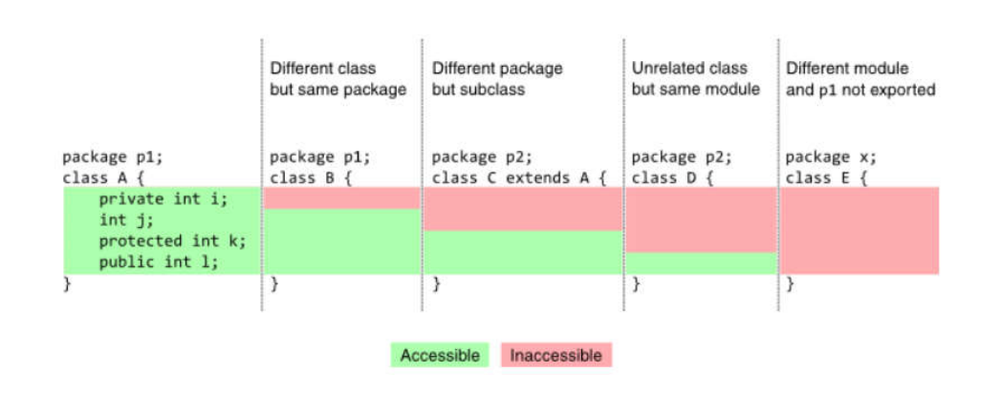<br><sub>Fig 32 - Modifiers in Java - (<a href='https://stackoverflow.com/questions/215497/what-is-the-difference-between-public-protected-package-private-and-private-in'>Work by  aioobe</a>) </sub></div>

<br>

**Non-Access Modifiers**

For **classes**, you can use either ```final``` or ```abstract```:

| Modifier  | Description                                                                                                       |
| :--------:| :----------------------------------------------------------------------------------------------------------------:|
| final     | The class cannot be inherited by other classes                                                                    |
| abstract  | The class cannot be used to create objects (To access an abstract class, it must be inherited from another class. | 

For **attributes and methods**, you can use the one of the following:

| Modifier      | Description                                                                                                       |
| :------------:| :----------------------------------------------------------------------------------------------------------------:|
| final         | Attributes and methods cannot be overridden/modified                                                                    |
| static        | Attributes and methods belongs to the class, rather than an object |
| abstract      | Can only be used in an abstract class, and can only be used on methods. The method does not have a body, for example **abstract void run();**. The body is provided by the subclass (inherited from).  | 
| transient     | Attributes and methods are skipped when serializing the object containing them | 
| synchronized  | Methods can only be accessed by one thread at a time | 
| volatile      | The value of an attribute is not cached thread-locally, and is always read from the "main memory" |

**Final**

If you don't want the ability to override existing attribute values, declare attributes as ```final```:

```java

public class Main {
  final int x = 10;
  final double PI = 3.14;

  public static void main(String[] args) {
    Main myObj = new Main();
    myObj.x = 50; // will generate an error: cannot assign a value to a final variable
    myObj.PI = 25; // will generate an error: cannot assign a value to a final variable
    System.out.println(myObj.x);
  }
}

```

**Static**

A ```static``` method means that it can be accessed without creating an object of the class, unlike ```public```:

An example to demonstrate the differences between ```static``` and ```public``` methods:

```java

public class Main {
  // Static method
  static void myStaticMethod() {
    System.out.println("Static methods can be called without creating objects");
  }

  // Public method
  public void myPublicMethod() {
    System.out.println("Public methods must be called by creating objects");
  }

  // Main method
  public static void main(String[ ] args) {
    myStaticMethod(); // Call the static method
    // myPublicMethod(); This would output an error

    Main myObj = new Main(); // Create an object of Main
    myObj.myPublicMethod(); // Call the public method
  }
}

```

**Abstract**

An ```abstract``` method belongs to an ```abstract``` class, and it does not have a body. The body is provided by the subclass:

```java

// Code from filename: Main.java
// abstract class
abstract class Main {
  public String fname = "John";
  public int age = 24;
  public abstract void study(); // abstract method
}

// Subclass (inherit from Main)
class Student extends Main {
  public int graduationYear = 2018;
  public void study() { // the body of the abstract method is provided here
    System.out.println("Studying all day long");
  }
}
// End code from filename: Main.java

// Code from filename: Second.java
class Second {
  public static void main(String[] args) {
    // create an object of the Student class (which inherits attributes and methods from Main)
    Student myObj = new Student();

    System.out.println("Name: " + myObj.fname);
    System.out.println("Age: " + myObj.age);
    System.out.println("Graduation Year: " + myObj.graduationYear);
    myObj.study(); // call abstract method
  }
}

```

#### <a name="chapter9part11"></a>Chapter 9 - Part 11: Encapsulation in Java

It is a principle consisting of hide implementation details of a class, exposing only safe operations and maintain objects in a consistent state.

Golden rule: the object must always be in a consistent state, and the class itself must guarantee this.

**An object must NOT expose any attributes (access modifier private)**

**Attributes must be accessed via get and set methods. [JavaBeans](https://en.wikipedia.org/wiki/JavaBeans)**

The meaning of Encapsulation, is to make sure that "sensitive" data is hidden from users. To achieve this, you must:

- declare class variables/attributes as ```private```.
- provide public get and set methods to access and update the value of a ```private``` variable

**Get and Set**

You learned from the previous chapter that ```private``` variables can only be accessed within the same class (an outside class has no access to it). However, it is possible to access them if we provide public get and set methods.

The ```get``` method returns the variable value, and the ```set``` method sets the value.

Syntax for both is that they start with either ```get``` or ```set```, followed by the name of the variable, with the first letter in upper case:

```java

public class Person {
  private String name; // private = restricted access

  // Getter
  public String getName() {
    return name;
  }

  // Setter
  public void setName(String newName) {
    this.name = newName;
  }
}

```

The ```get``` method returns the value of the variable ```name```.

The ```set``` method takes a parameter (```newName```) and assigns it to the ```name``` variable. The ```this``` keyword is used to refer to the current object.

However, as the ```name``` variable is declared as ```private```, we cannot access it from outside this class:

```java

public class Main {
  public static void main(String[] args) {
    Person myObj = new Person();
    myObj.name = "John";  // error
    System.out.println(myObj.name); // error 
  }
}


```

If the variable was declared as ```public```, we would expect the following output:

```John```

However, as we try to access a ```private``` variable, we get an error:

Instead, we use the ```getName()``` and ```setName()``` methods to access and update the variable:

```java

public class Main {
  public static void main(String[] args) {
    Person myObj = new Person();
    myObj.setName("John"); // Set the value of the name variable to "John"
    System.out.println(myObj.getName());
  }
}

// Outputs "John"

```

**Why Encapsulation?**

- Better control of class attributes and methods
- Class attributes can be made read-only (if you only use the ```get``` method), or write-only (if you only use the set method)
- Flexible: the programmer can change one part of the code without affecting other parts
- Increased security of data


```java

public class Product {

	private String name;
	private double price;
	private int quantity;
	
	public Product() {
	}
	
	public Product(String name, double price, int quantity) {
		this.name = name;
		this.price = price;
		this.quantity = quantity;
	}
	
	public Product(String name, double price) {
		this.name = name;
		this.price = price;
	}
	
	public String getName() {
		return name;
	}
	
	public void setName(String name) {
		this.name = name;
	}
	
	public double getPrice() {
		return price;
	}
	
	public void setPrice(double price) {
		this.price = price;
	}
	
	public int getQuantity() {
		return quantity;
	}

```

#### <a name="chapter9part12"></a>Chapter 9 - Part 12: Classes Composition in Java

It is a type of association that allows one object to contain another

"has-one" or "has-many" relationship

Advantages
- Organization: division of responsibilities
- Cohesion
- Flexibility
- Reuse

<br>

<div align="center">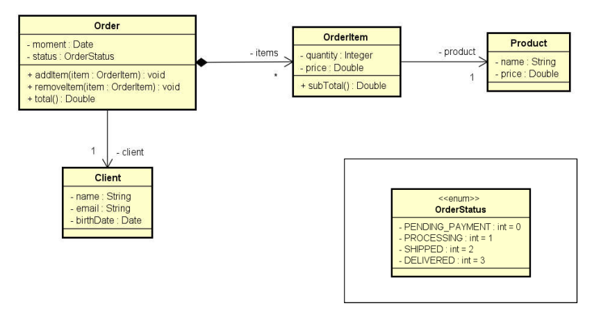<br><sub>Fig 39 - Composition - (<a href='https://www.udemy.com/course/java-curso-completo/'>Work by  Nelio Alves</a>) </sub></div>

<br>

Exercise: Read data from a worker with N contracts (N provided by the user). then request a month and show the employee's salary in that month, as shown in the example

<br>

<div align="center">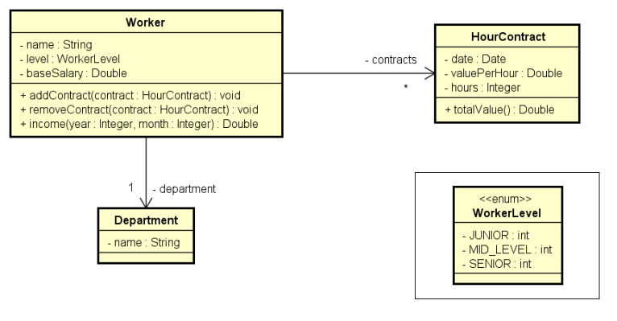<br><sub>Fig 39 - Compostion Exercise - (<a href='https://www.udemy.com/course/java-curso-completo/'>Work by  Nelio Alves</a>) </sub></div>

<br>

<div align="center">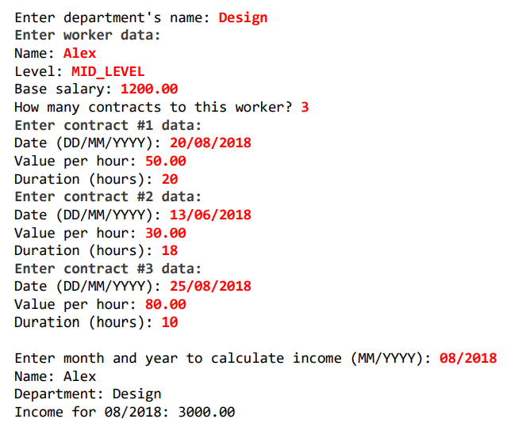<br><sub>Fig 39 - Compostion Exercise - (<a href='https://www.udemy.com/course/java-curso-completo/'>Work by  Nelio Alves</a>) </sub></div>

<br>

Resolution:

**WorkerLevel Class (enum)**

```java

package entities.enums;

public enum WorkerLevel {

	JUNIOR,
	MID_LEVEL,
	SENIOR;
}

```

**Department Class**

```java

package entities;

public class Department {

	private String name;
	
	public Department() {
	}

	public Department(String name) {
		this.name = name;
	}

	public String getName() {
		return name;
	}

	public void setName(String name) {
		this.name = name;
	}
}

```

**HourContract Class**

```java

package entities;

import java.util.Date;

public class HourContract {

	private Date date;
	private Double valuePerHour;
	private Integer hours;
	
	public HourContract() {
	}

	public HourContract(Date date, Double valuePerHour, Integer hours) {
		this.date = date;
		this.valuePerHour = valuePerHour;
		this.hours = hours;
	}

	public Date getDate() {
		return date;
	}

	public void setDate(Date date) {
		this.date = date;
	}

	public Double getValuePerHour() {
		return valuePerHour;
	}

	public void setValuePerHour(Double valuePerHour) {
		this.valuePerHour = valuePerHour;
	}

	public Integer getHours() {
		return hours;
	}

	public void setHours(Integer hours) {
		this.hours = hours;
	}
	
	public double totalValue() {
		return valuePerHour * hours;
	}
}

```

**Worker Class**

```java

package entities;

import java.util.ArrayList;
import java.util.Calendar;
import java.util.List;

import entities.enums.WorkerLevel;

public class Worker {

	private String name;
	private WorkerLevel level;
	private Double baseSalary;
	
	private Department department;
	private List<HourContract> contracts = new ArrayList<>();
	
	public Worker() {
	}

	public Worker(String name, WorkerLevel level, Double baseSalary, Department department) {
		this.name = name;
		this.level = level;
		this.baseSalary = baseSalary;
		this.department = department;
	}

	public String getName() {
		return name;
	}

	public void setName(String name) {
		this.name = name;
	}

	public WorkerLevel getLevel() {
		return level;
	}

	public void setLevel(WorkerLevel level) {
		this.level = level;
	}

	public Double getBaseSalary() {
		return baseSalary;
	}

	public void setBaseSalary(Double baseSalary) {
		this.baseSalary = baseSalary;
	}

	public Department getDepartment() {
		return department;
	}

	public void setDepartment(Department department) {
		this.department = department;
	}

	public List<HourContract> getContracts() {
		return contracts;
	}

	public void addContract(HourContract contract) {
		contracts.add(contract);
	}
	
	public void removeContract(HourContract contract) {
		contracts.remove(contract);
	}
	
	public double income(int year, int month) {
		double sum = baseSalary;
		Calendar cal = Calendar.getInstance();
		for (HourContract c : contracts) {
			cal.setTime(c.getDate());
			int c_year = cal.get(Calendar.YEAR);
			int c_month = 1 + cal.get(Calendar.MONTH);
			if (year == c_year && month == c_month) {
				sum += c.totalValue();
			}
		}
		return sum;
	}
}

```

**Program**

```java

package application;

import java.text.ParseException;
import java.text.SimpleDateFormat;
import java.util.Date;
import java.util.Locale;
import java.util.Scanner;

import entities.Department;
import entities.HourContract;
import entities.Worker;
import entities.enums.WorkerLevel;

public class Program {

	public static void main(String[] args) throws ParseException {

		Locale.setDefault(Locale.US);
		Scanner sc = new Scanner(System.in);
		SimpleDateFormat sdf = new SimpleDateFormat("dd/MM/yyyy");
		
		System.out.print("Enter department's name: ");
		String departmentName = sc.nextLine();
		System.out.println("Enter worker data:");
		System.out.print("Name: ");
		String workerName = sc.nextLine();
		System.out.print("Level: ");
		String workerLevel = sc.nextLine();
		System.out.print("Base salary: ");
		double baseSalary = sc.nextDouble();
		Worker worker = new Worker(workerName, WorkerLevel.valueOf(workerLevel), baseSalary, new Department(departmentName));
		
		System.out.print("How many contracts to this worker? ");
		int n = sc.nextInt();
		
		for (int i=1; i<=n; i++) {
			System.out.println("Enter contract #" + i + " data:");
			System.out.print("Date (DD/MM/YYYY): ");
			Date contractDate = sdf.parse(sc.next());
			System.out.print("Value per hour: ");
			double valuePerHour = sc.nextDouble();
			System.out.print("Duration (hours): ");
			int hours = sc.nextInt();
			HourContract contract = new HourContract(contractDate, valuePerHour, hours);
			worker.addContract(contract);
		}
		
		System.out.println();
		System.out.print("Enter month and year to calculate income (MM/YYYY): ");
		String monthAndYear = sc.next();
		int month = Integer.parseInt(monthAndYear.substring(0, 2));
		int year = Integer.parseInt(monthAndYear.substring(3));
		System.out.println("Name: " + worker.getName());
		System.out.println("Department: " + worker.getDepartment().getName());
		System.out.println("Income for " + monthAndYear + ": " + String.format("%.2f", worker.income(year, month)));
		
		sc.close();
	}
}

```

#### <a name="chapter9part13"></a>Chapter 9 - Part 13: Inheritance in Java

It is an association type that allows a class to inherit all data and behaviors of another

- Benefits
  - reuse
  - Polymorphism
  
In Java, it is possible to inherit attributes and methods from one class to another. We group the "inheritance concept" into two categories:

- **subclass** (child) - the class that inherits from another class
- **superclass** (parent) - the class being inherited from

To inherit from a class, use the ```extends``` keyword.

Example: In the example below, the ```Car``` class (subclass) inherits the attributes and methods from the ```Vehicle``` class (superclass):

```java

class Vehicle {
  protected String brand = "Ford";        // Vehicle attribute
  public void honk() {                    // Vehicle method
    System.out.println("Tuut, tuut!");
  }
}

class Car extends Vehicle {
  private String modelName = "Mustang";    // Car attribute
  public static void main(String[] args) {

    // Create a myCar object
    Car myCar = new Car();

    // Call the honk() method (from the Vehicle class) on the myCar object
    myCar.honk();

    // Display the value of the brand attribute (from the Vehicle class) and the value of the modelName from the Car class
    System.out.println(myCar.brand + " " + myCar.modelName);
  }
}

```

Another Example: Suppose a banking business that has a common account and an account for companies, and the company account has all account members common plus a borrowing limit and a borrowing operation.

<br>

<div align="center">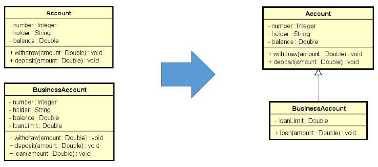<br><sub>Fig 40 - Inheritance - (<a href='https://www.udemy.com/course/java-curso-completo/'>Work by  Nelio Alves</a>) </sub></div>

<br>


Important Definitions:

- "is-a" relationship

- generalization/specialization

- Superclass (base class) / subclass (class derivative)

- inheritance / extension

- Inheritance is an association between classes (not between objects)

Class Account

```java

package entities;

public class Account {

	private Integer number;
	private String holder;
	protected Double balance;
		
	public Account() {
	}
	
	public Account(Integer number, String holder, Double balance) {
		this.number = number;
		this.holder = holder;
		this.balance = balance;
	}

	public Integer getNumber() {
		return number;
	}

	public void setNumber(Integer number) {
		this.number = number;
	}

	public String getHolder() {
		return holder;
	}

	public void setHolder(String holder) {
		this.holder = holder;
	}

	public Double getBalance() {
		return balance;
	}

	public void withdraw(double amount) {
		balance -= amount;
	}

	public void deposit(double amount) {
		balance += amount;
	}
}

```

Did you notice the ```protected``` modifier in ```Account```?

We set the ```balance``` attribute in ```Account``` to a ```protected``` access modifier. If it was set to ```private```, the ```BusinessAccount``` class would not be able to access it.

class BussinesAccount

```java

package entities;

public class BusinessAccount extends Account {

	private Double loanLimit;
	
	public BusinessAccount() {
		super();
	}

	public BusinessAccount(Integer number, String holder, Double balance, Double loanLimit) {
		super(number, holder, balance);
		this.loanLimit = loanLimit;
	}

	public Double getLoanLimit() {
		return loanLimit;
	}

	public void setLoanLimit(Double loanLimit) {
		this.loanLimit = loanLimit;
	}
	
	public void loan(double amount) {
		if (amount <= loanLimit) {
			balance += amount - 10.0;
		}
	}
}

```

Program

```java

package application;

import entities.BusinessAccount;

public class Program {

	public static void main(String[] args) {

		BusinessAccount account = new BusinessAccount(8010, "Bob Brown", 0.0, 500.0);

		System.out.println(account.getBalance());
	}
}

```

**Upcasting and downcasting**

- Upcasting
  - Casting from subclass to superclass
  - Common usage: polymorphism

- Downcasting
  - Casting from superclass to subclass
  - instanceof ```keyword```
  - Common usage: methods that take generic parameters (ex: Equals)
  
Example:

<br>

<div align="center">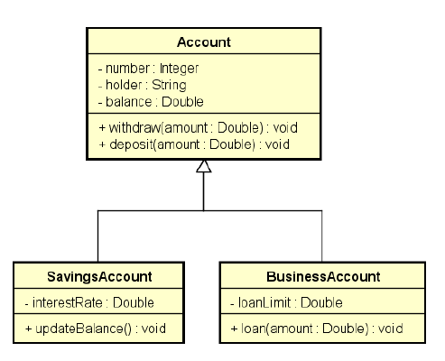<br><sub>Fig 41 - Upcasting and Downcasting - (<a href='https://www.udemy.com/course/java-curso-completo/'>Work by  Nelio Alves</a>) </sub></div>

<br>

Class SavingsAccount

```java

package entities;

public class SavingsAccount extends Account {
	
	private Double interestRate;
	
	public SavingsAccount() {
		super();
	}

	public SavingsAccount(Integer number, String holder, Double balance, Double interestRate) {
		super(number, holder, balance);
		this.interestRate = interestRate;
	}

	public Double getInterestRate() {
		return interestRate;
	}

	public void setInterestRate(Double interestRate) {
		this.interestRate = interestRate;
	}
	
	public void updateBalance() {
		balance += balance * interestRate;
	}
}

```

Program

```java

package application;

import entities.Account;
import entities.BusinessAccount;
import entities.SavingsAccount;

public class Program {

	public static void main(String[] args) {

		Account acc = new Account(1001, "Alex", 0.0);
		BusinessAccount bacc = new BusinessAccount(1002, "Maria", 0.0, 500.0);
		
		// UPCASTING
		
		Account acc1 = bacc;
		Account acc2 = new BusinessAccount(1003, "Bob", 0.0, 200.0);
		Account acc3 = new SavingsAccount(1004, "Anna", 0.0, 0.01);
		
		// DOWNCASTING
		
		BusinessAccount acc4 = (BusinessAccount)acc2;
		acc4.loan(100.0);
		
		// BusinessAccount acc5 = (BusinessAccount)acc3;
		if (acc3 instanceof BusinessAccount) {
			BusinessAccount acc5 = (BusinessAccount)acc3;
			acc5.loan(200.0);
			System.out.println("Loan!");
		}
		
		if (acc3 instanceof SavingsAccount) {
			SavingsAccount acc5 = (SavingsAccount)acc3;
			acc5.updateBalance();
			System.out.println("Update!");
		}
	}
}

```

**Override**

- It is the implementation of a method of a superclass in the subclass
- It is strongly recommended to use the @Override annotation in a method envelope
  - Facilitates reading and understanding of code
  - We notify the compiler (good practice)

class Account

```Java

public void withdraw(double amount) {
	balance -= amount + 5.0;
}

```

SavingsAccount

```java

@Override
public void withdraw(double amount) {
	balance -= amount;
}

```

**Keyword Super**

You can call the superclass implementation using the word super.

Example: suppose that, in the BusinessAccount class, the rule for withdrawal is to perform the draw normally from the superclass, and deduct another 2.0.

In this case, the withdraw method is the same, but with one moddification in the BissinesAccount class, because is tho only diference.

Class BissinesAccount

```java

@Override
public void withdraw(double amount) {
	super.withdraw(amount);
	balance -= 2.0;
}

```

**Keyword Final**

If you don't want other classes to inherit from a class, use the ```final``` keyword:

Example: If you try to access a ```final``` class, Java will generate an error:

```java

final class Vehicle {
  ...
}

class Car extends Vehicle {
  ...
}

// Main.java:9: error: cannot inherit from final Vehicle
//class Main extends Vehicle {
//                  ^
// 1 error)

```

You can use in method. In this case prevents the method under from being overridden

Example: Suppose you don't want the Withdraw method of SavingsAccount is overridden

```java

@Override
public final void withdraw(double amount) {
	balance -= amount;
}

```

why use final?

- Security: Depending on business rules, it is sometimes desirable ensure that a class is not inherited, or that a method is not be superimposed.
  - It is generally convenient to add final in overlapping methods, as Multiple overlays can be a gateway to inconsistencies

- Performance: type attributes of a final class are parsed accordingly. faster at runtime.
  - Classic example: String

#### <a name="chapter9part14"></a>Chapter 9 - Part 14: Polymorphism in Java

In Object Oriented Programming, polymorphism is a resource that allows variables of the same more generic type to be point to objects of different specific types, thus having different behaviors depending on each specific type.

```java

Account x = new Account(1020, "Alex", 1000.0);
Account y = new SavingsAccount(1023, "Maria", 1000.0, 0.01);

x.withdraw(50.0);
y.withdraw(50.0);

```

Another Example:

For example, think of a superclass called ```Animal``` that has a method called ```animalSound()```. Subclasses of Animals could be Pigs, Cats, Dogs, Birds - And they also have their own implementation of an animal sound (the pig oinks, and the cat meows, etc.):

```java

class Animal {
  public void animalSound() {
    System.out.println("The animal makes a sound");
  }
}

class Pig extends Animal {
  public void animalSound() {
    System.out.println("The pig says: wee wee");
  }
}

class Dog extends Animal {
  public void animalSound() {
    System.out.println("The dog says: bow wow");
  }
}

```
Now we can create ```Pig``` and ```Dog``` objects and call the ```animalSound()``` method on both of them:

```java

class Animal {
  public void animalSound() {
    System.out.println("The animal makes a sound");
  }
}

class Pig extends Animal {
  public void animalSound() {
    System.out.println("The pig says: wee wee");
  }
}

class Dog extends Animal {
  public void animalSound() {
    System.out.println("The dog says: bow wow");
  }
}

class Main {
  public static void main(String[] args) {
    Animal myAnimal = new Animal();  // Create a Animal object
    Animal myPig = new Pig();  // Create a Pig object
    Animal myDog = new Dog();  // Create a Dog object
    myAnimal.animalSound();
    myPig.animalSound();
    myDog.animalSound();
  }
}

```

Why And When To Use "Inheritance" and "Polymorphism"?

- It is useful for code reusability: reuse attributes and methods of an existing class when you create a new class.

Exercise:  A company has its own and outsourced employees. For each employee, you want to record name, hours worked and hourly rate. outsourced employees have an additional expense.

Employee pay corresponds to the hourly rate multiplied by the hours worked, with the outsourced employees still receive a bonus corresponding to 110% of your additional expense.

Write a program to read the data of N employees (N provided by the user) and store them in a list. Later to read all data, show name and payment of each employee in the same order they were entered.

Build the program according to the project on the side. Look example on the next page.

<br>

<div align="center">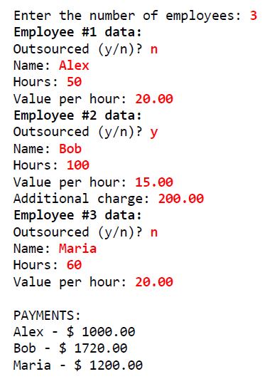<br><sub>Fig 42 - Exercise Polymorphism - (<a href='https://www.udemy.com/course/java-curso-completo/'>Work by  Nelio Alves</a>) </sub></div>

<br>

<div align="center">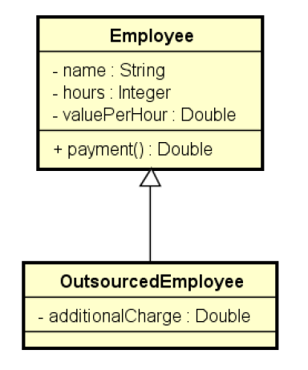<br><sub>Fig 43 - Exercise Polymorphism - (<a href='https://www.udemy.com/course/java-curso-completo/'>Work by  Nelio Alves</a>) </sub></div>

<br>

Class Employee

```java

package entities;

public class Employee {

	private String name;
	private Integer hours;
	private Double valuePerHour;
	
	public Employee() {
	}

	public Employee(String name, Integer hours, Double valuePerHour) {
		this.name = name;
		this.hours = hours;
		this.valuePerHour = valuePerHour;
	}

	public String getName() {
		return name;
	}

	public void setName(String name) {
		this.name = name;
	}

	public Integer getHours() {
		return hours;
	}

	public void setHours(Integer hours) {
		this.hours = hours;
	}

	public Double getValuePerHour() {
		return valuePerHour;
	}

	public void setValuePerHour(Double valuePerHour) {
		this.valuePerHour = valuePerHour;
	}
	
	public double payment() {
		return hours * valuePerHour;
	}
}

```

Class OutsourcedEmployee

```java

package entities;

public class OutsourcedEmployee extends Employee {

	private Double additionalCharge;

	public OutsourcedEmployee() {
		super();
	}
	
	public OutsourcedEmployee(String name, Integer hours, Double valuePerHour, Double additionalCharge) {
		super(name, hours, valuePerHour);
		this.additionalCharge = additionalCharge;
	}

	public Double getAdditionalCharge() {
		return additionalCharge;
	}

	public void setAdditionalCharge(Double additionalCharge) {
		this.additionalCharge = additionalCharge;
	}
	
	@Override
	public double payment() {
		return super.payment() + additionalCharge * 1.1;
	}
}

```

Program

```java

package application;

import java.util.ArrayList;
import java.util.List;
import java.util.Locale;
import java.util.Scanner;

import entities.Employee;
import entities.OutsourcedEmployee;

public class Program {

	public static void main(String[] args) {

		Locale.setDefault(Locale.US);
		Scanner sc = new Scanner(System.in);
		
		List<Employee> list = new ArrayList<>();
		
		System.out.print("Enter the number of employees: ");
		int n = sc.nextInt();
		
		for (int i=1; i<=n; i++) {
			System.out.println("Employee #" + i + " data:");
			System.out.print("Outsourced (y/n)? ");
			char ch = sc.next().charAt(0);
			System.out.print("Name: ");
			sc.nextLine();
			String name = sc.nextLine();
			System.out.print("Hours: ");
			int hours = sc.nextInt();
			System.out.print("Value per hour: ");
			double valuePerHour = sc.nextDouble();
			//OBS: A List of Employee can add Employe or OutsourcedEmploye (polymorphism)
			if (ch == 'y') {
				System.out.print("Additional charge: ");
				double additionalCharge = sc.nextDouble();
				list.add(new OutsourcedEmployee(name, hours, valuePerHour, additionalCharge));
			}
			else {
				list.add(new Employee(name, hours, valuePerHour));
			}
		}
		
		System.out.println();
		System.out.println("PAYMENTS:");
		for (Employee emp : list) {
			System.out.println(emp.getName() + " - $ " + String.format("%.2f", emp.payment()));
		}
		
		sc.close();
	}
}

```

#### <a name="chapter9part15"></a>Chapter 9 - Part 15: Abstraction Class and methods

Data **abstraction** is the process of hiding certain details and showing only essential information to the user.
Abstraction can be achieved with either **abstract classes** or **interfaces** (which you will learn more about in the next chapter).

The ```abstract``` keyword is a non-access modifier, used for classes and methods:
- **Abstract class**: is a restricted class that cannot be used to create objects (to access it, it must be inherited from another class).
- **Abstract method**: can only be used in an abstract class, and it does not have a body. The body is provided by the subclass (inherited from).

NOTE: In UML is Italic

An abstract class can have both abstract and regular methods:

```java

abstract class Animal {
  public abstract void animalSound();
  public void sleep() {
    System.out.println("Zzz");
  }
}

```

From the example above, it is not possible to create an object of the Animal class:

```java

Animal myObj = new Animal(); // will generate an error

```

To access the abstract class, it must be inherited from another class. Let's convert the Animal class we used in the Polymorphism chapter to an abstract class:

Remember from the Inheritance chapter that we use the extends keyword to inherit from a class.

```java

// Abstract class
abstract class Animal {
  // Abstract method (does not have a body)
  public abstract void animalSound();
  // Regular method
  public void sleep() {
    System.out.println("Zzz");
  }
}

// Subclass (inherit from Animal)
class Pig extends Animal {
  public void animalSound() {
    // The body of animalSound() is provided here
    System.out.println("The pig says: wee wee");
  }
}

class Main {
  public static void main(String[] args) {
    Pig myPig = new Pig(); // Create a Pig object
    myPig.animalSound();
    myPig.sleep();
  }
}

```

NOTE:  If a class has at least one method abstract, so this class is also abstract

Why And When To Use Abstract Classes and Methods?

To achieve security - hide certain details and only show the important details of an object.

Note: Abstraction can also be achieved with Interfaces, which you will learn more about in the next chapter.

Exercise: Write a program to read data from N figures (N provided by the user), and then show the areas of these figures in the same order in which they were entered.

<br>

<div align="center"><br><sub>Fig 44 - Exercise Abstraction - (<a href='https://www.udemy.com/course/java-curso-completo/'>Work by  Nelio Alves</a>) </sub></div>

<br>

Class Color

```java

package entities.enums;

public enum Color {
	BLACK,
	BLUE,
	RED;
}

```

Class Shape

```java

package entities;

import entities.enums.Color;

public abstract class Shape {

	private Color color;
	
	public Shape() {
	}
	
	public Shape(Color color) {
		this.color = color;
	}

	public Color getColor() {
		return color;
	}

	public void setColor(Color color) {
		this.color = color;
	}
	
	public abstract double area(); //OBS: when you put abstract in the method, you are obligated to put abstract in the class Shape
}

```

Class Circle

```java

package entities;

import entities.enums.Color;

public class Circle extends Shape {

	private Double radius;
	
	public Circle() {
		super();
	}
	
	public Circle(Color color, Double radius) {
		super(color);
		this.radius = radius;
	}

	public Double getRadius() {
		return radius;
	}

	public void setRadius(Double radius) {
		this.radius = radius;
	}

	@Override
	public double area() {
		return Math.PI * radius * radius;
	}
}

```

Class Retangle

```java

package entities;

import entities.enums.Color;

public class Rectangle extends Shape {

	private Double width;
	private Double height;
	
	public Rectangle() {
		super();
	}

	public Rectangle(Color color, Double width, Double height) {
		super(color);
		this.width = width;
		this.height = height;
	}

	public Double getWidth() {
		return width;
	}

	public void setWidth(Double width) {
		this.width = width;
	}

	public Double getHeight() {
		return height;
	}

	public void setHeight(Double height) {
		this.height = height;
	}

	@Override
	public double area() {
		return width * height;
	}
}

```

Program

```java

package application;

import java.util.ArrayList;
import java.util.List;
import java.util.Locale;
import java.util.Scanner;

import entities.Shape;
import entities.Rectangle;
import entities.Circle;
import entities.enums.Color;

public class Program {

	public static void main(String[] args) {

		Locale.setDefault(Locale.US);
		Scanner sc = new Scanner(System.in);
		
		List<Shape> list = new ArrayList<>();
		
		System.out.print("Enter the number of shapes: ");
		int n = sc.nextInt();
		
		for (int i=1; i<=n; i++) {
			System.out.println("Shape #" + i + " data:");
			System.out.print("Rectangle or Circle (r/c)? ");
			char ch = sc.next().charAt(0);
			System.out.print("Color (BLACK/BLUE/RED): ");
			Color color = Color.valueOf(sc.next());
			if (ch == 'r') {
				System.out.print("Width: ");
				double width = sc.nextDouble();
				System.out.print("Height: ");
				double height = sc.nextDouble();
				list.add(new Rectangle(color, width, height));
			}
			else {
				System.out.print("Radius: ");
				double radius = sc.nextDouble();
				list.add(new Circle(color, radius));
			}
		}
		
		System.out.println();
		System.out.println("SHAPE AREAS:");
		for (Shape shape : list) {
			System.out.println(String.format("%.2f", shape.area()));
		}
		
		sc.close();
	}
}

```

## <a name="chapter10"></a>Chapter 10: Reference Type vs. Value Types, Garbage Collector, Boxing, unboxing and wrapper classes

#### <a name="chapter10part1"></a>Chapter 10 - Part 1: Reference Type vs. Value Types

Java provides two types of data types **primitive** and **reference** data type. The **primitive data types (value type)** are predefined in Java that serves as a fundamental building block while the **reference** data type refers to where data is stored.

<br>

<div align="center"><br><sub>Fig 13 -Java Data Types - (<a href='https://getkt.com/blog/reintroduction-to-java-data-types/'>Work by neotam</a>) </sub></div>

<br>

**Reference types**

In Java, **non-primitive** data types are known as **reference types**. In other words, a variable of class type is called **reference data type**. It contains the address (or reference) of dynamically created objects. For example, if **Demo** is a class and we have created its object **d**, then the variable d is known as a reference type.

It refers to objects. It is not pre-defined. It is created by the programmer if required. The reference types hold the references of objects. All **reference types** are a subclass of type **java.lang.Object**. It provides access to the objects stored in the memory.

Example: In the example above the p2 variable refence the memory address where p1 was created.

```java

Product p1, p2;
p1 = new Product("TV", 900.00, 0);
p2 = p1;

```

<br>

<div align="center">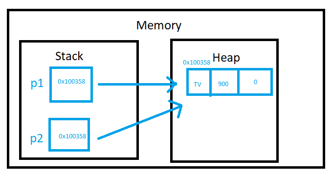<br><sub>Fig 34 -Referency Types - (<a href='https://www.udemy.com/course/java-curso-completo/'>Work by Nelio Alves</a>) </sub></div>

<br>

The default values when we use ```new``` in Class and Arrays is:

- Numbers: 0
- boolean: false
- char: 0 code
- object: null

Reference type alow "null" value. This means they not reference any body.

**Primitive types**

In Java, primitive types is value types.

Example: y receive a copy of x

```java

double x, y;
x = 10;
y = x;

```

The primitive types needs a value to initiate:

```java

int p;
System.out.println(p); // error: variable not initiated

p = 10;
System.out.println(p);

```

<br>

<div align="center">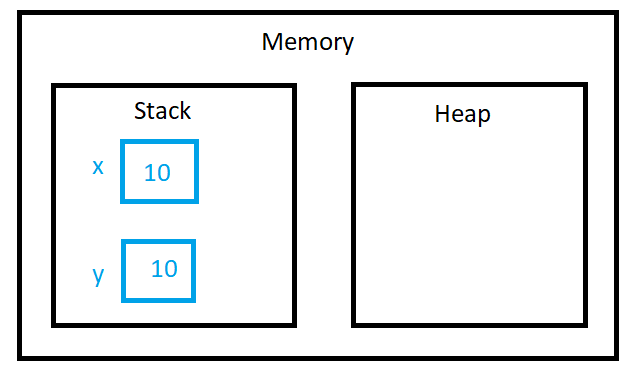<br><sub>Fig 35 -Primitive Types - (<a href='https://www.udemy.com/course/java-curso-completo/'>Work by Nelio Alves</a>) </sub></div>

<br>

<br>

<div align="center"><br><sub>Fig 14 -Java Data Primitive Types - (<a href='https://getkt.com/blog/reintroduction-to-java-data-types/'>Work by neotam</a>) </sub></div>

<br>

| Reference Type                                                                 | Primitive Type                                                         |
| :-----------------------------------------------------------------------------:| :---------------------------------------------------------------------:|
| It is not pre-defined except the String.                                       | It is pre-defined in Java.                                             |
| All reference type begins with Uppercase letter.                               | All primitive type begins with a lowercase letter.                     | 
| Non-primitive types have all the same size.                                    | The size of a primitive type depends on the data type.                 |
| It is used to invoke or call methods.                                          | We cannot invoke the method with a primitive type.                     |
| It can be null.                                                                | It cannot be null. It always has value.                                |
| Examples of reference data types are class, Arrays, String, Interface, etc.    | Examples of primitive data types are int, float, double, Boolean, long.|
| JVM allocates 8 bytes for each reference variable, by default.                 | Its size depends on the data type.                                     |
| **Example**: Demo d1;                                                          | **Example**: int num=78;                                               |
| Advantage: enjoys all OO features                                              | Advantage: it is simpler and more performant                           |
| Objects must be instantiated using new, or point to an existing object.        | Does not instantiate. Once declared, they are ready for use.           |
| Accepts null value                                                             | Does not accept null value                                             |
| Y = X; "Y starts pointing to where X points Y = X;                             | Y = X; "Y receives a copy of X"                                        |
| Objects instantiated on the heap                                               | "Objects" instantiated on the stack                                    |
| Unused objects are deallocated in a close moment by garbage collector          | "Objects" are deallocated immediately when your execution scope is terminated   |

#### <a name="chapter10part2"></a>Chapter 10 - Part 2: Garbage Collector

In Java, the ```new``` keyword is used to create an **instance** of the class. In other words, it instantiates a class by allocating **memory** for a new object and returning a reference to that memory. Objects occupy memory in the **Java heap space**. We can also use the ```new``` keyword to create the array object.

```java

ClassName objectName = new ClassName();  

```

If there are no references to an object, the memory used by that object can be reclaimed during the garbage collection process.

**Garbage Collector

It is a process that automates the memory management of a program running

Garbage collector monitors dynamically allocated objects by the program (on the heap), deallocating those that are no longer being used.

In java, garbage means unreferenced objects.

Garbage Collection is process of reclaiming the runtime unused memory automatically. In other words, it is a way to destroy the unused objects.

To do so, we were using free() function in C language and delete() in C++. But, in java it is performed automatically. So, java provides better memory management.

**Advantage of Garbage Collection**

- It makes java memory efficient because garbage collector removes the unreferenced objects from heap memory.

- It is automatically done by the garbage collector(a part of JVM) so we don't need to make extra efforts.

**How can an object be unreferenced?**

- By nulling the reference

```java

    Employee e=new Employee();  
    e=null;  

```

- By assigning a reference to another

```java

    Employee e1=new Employee();  
    Employee e2=new Employee();  
    e1=e2;//now the first object referred by e1 is available for garbage collection  

```

- By anonymous object etc.

```java

    new Employee();  

```

**finalize() method**

The finalize() method is invoked each time before the object is garbage collected. This method can be used to perform cleanup processing. This method is defined in Object class as:

```java

    protected void finalize(){}  

```

OBS: The Garbage collector of JVM collects only those objects that are created by new keyword. So if you have created any object without new, you can use finalize method to perform cleanup processing (destroying remaining objects).

**gc() method**

The gc() method is used to invoke the garbage collector to perform cleanup processing. The gc() is found in System and Runtime classes. 

```java

    public static void gc(){}  

```

OBS: Garbage collection is performed by a daemon thread called Garbage Collector(GC). This thread calls the finalize() method before object is garbage collected.

```java

    public class TestGarbage1{  
     public void finalize(){System.out.println("object is garbage collected");}  
     public static void main(String args[]){  
      TestGarbage1 s1=new TestGarbage1();  
      TestGarbage1 s2=new TestGarbage1();  
      s1=null;  
      s2=null;  
      System.gc();  
     }  
    }  
    
    //object is garbage collected
    //object is garbage collected

```

#### <a name="chapter10part3"></a>Chapter 10 - Part 3: Boxing, unboxing and wrapper classes

**Boxing**

It is the process of converting a value type object to an object compatible reference type

```java

int x = 20;

Object obj = x;

```

**Unboxing**

It is the process of converting a reference-type object to a object type compatible value

```java

int x = 20;

Object obj = x;

int y = (int) obj;

```

**Comparing Reference Type**

Reference types are comparable in Java. Equality operators and the equals method can be used to assist with comparisons.

- Using the Equality Operators ```(==)```

The ```!=``` and ```==``` equality operators are used to compare the memory locations of two objects. If the memory addresses of the objects being compared are the same, the objects are considered equal. These equality operators are not used to compare the contents of two objects.

```java

String guest1 = new String("name");
String guest2 = guest1;
if (guest1 == guest2)
  System.out.println("They are equal");

```

In the following example, the memory addresses are not equal, so the statement "They are not equal" is output:

```java

String guest1 = new String("name");
String guest2 = new String("name");
if (guest1 != guest2)
  System.out.println("They are not equal");


```

- Using the ```equals()``` Method

To compare the contents of two class objects, the ```equals()``` method from class ```Object``` can be used or overridden. When the ```equals()``` method is overridden, the ```hashCode()``` method should also be overridden. This is done for compatibility with hash-based collections such as ```HashMap()``` and ```HashSet()```.

By default, the ```equals()``` method uses only the ```==``` operator for comparisons. This method has to be overridden to really be useful.

For example, if you want to compare values contained in two instances of the same class, you should use a programmer-defined equals() method.

**Comparing Strings**

There are two ways to check whether strings are equal in Java, but the definition of “equal” for each of them is different:

- The ```equals()``` method compares two strings, character by character, to determine equality. This is not the default implementation of the ```equals()``` method provided by the Object class. This is the overridden implementation provided by String class.

- The ```==``` operator checks to see whether two object references refer to the same instance of an object.

Here is a program that shows how strings are evaluated using the ```equals()``` method and the ```==``` operator

```java

class MyComparisons {

  // Add string to pool
  String first = "chairs";
  // Use string from pool
  String second = "chairs";
  // Create a new string
  String third = new String ("chairs");

 void myMethod() {

  /*
   * Contrary to popular belief, this evaluates
   * to true. Try it!
   */
  if (first == second) {
    System.out.println("first == second");
  }

  // This evaluates to true
  if (first.equals(second)) {
    System.out.println("first equals second");
  }
  // This evaluates to false
  if (first == third) {
    System.out.println("first == third");
  }
  // This evaluates to true
  if (first.equals(third)) {
    System.out.println("first equals third");
  }
 } // End myMethod()
} //end class

```


**Wrapper Classes**

These are classes that are equivalent to primitive types.

Boxing and unboxing is done automaticaly

Common usage: Entity fields in information systems (IMPORTANT!)
Because reference types (classes) accept null value and take advantage of Object Oriented resources

<br>

<div align="center">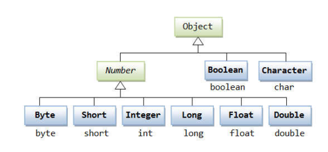<br><sub>Fig 37 - Wrapper Classes - (<a href='https://www.javatpoint.com/collections-in-java'>Work by  Java T Point</a>) </sub></div>

<br>

#### <a name="chapter10part4"></a>Chapter 10 - Part 4: hashCode and equals

**hashCode and equals**

- They are operations of the Object class used to compare if an object is the same as another
- equals: slow, 100% response
- hashCode: fast, but positive response is not 100%
- Common types (String, Date, Integer, Double, etc.) already have implementation for these operations. custom classes need to overlay them.

**Equals**

- Method that compares if the object is equal to another, returning true or false.

```java

String a = "Maria";
String b = "Alex";

System.out.println(a.equals(b)); //false

```

```java

String a = "Maria";
String b = "Naria";

System.out.println(a.equals(b)); //true

```

**HashCode**

- Method that returns an integer representing a generated code from object information

```java

String a = "Maria";
String b = "Alex";

System.out.println(a.hashCode()); //74113750
System.out.println(b.hashCode()); //2043454

```

```java

String a = "Maria";
String b = "Maria";

System.out.println(a.hashCode()); //74113750
System.out.println(b.hashCode()); //74113750

```

If the hashCode of two objects is different, then the two objects are many different

If the code of two objects is the same, most likely the objects they are the same

## <a name="chapter11"></a>Chapter 11: Collections

<br>

<div align="center"><br><sub>Fig 36 - Collections - (<a href='https://www.javatpoint.com/collections-in-java'>Work by  Java T Point</a>) </sub></div>

<br>

#### <a name="chapter11part1"></a>Chapter 11 - Part 1: ArrayList

ArrayList is a data Structure:
- Homogeneous (data of the same type)
- Ordered (elements accessed through positions)
- Starts empty, and its elements are allocated on demand
- Each element occupies a "node" (or node) of the list

Type (interface): List

Implementing classes: ArrayList, LinkedList, etc

Advantages:
- Variable Size
- Ease of insertion and deletion

Disadvantages:
- Fixed Size
- Sequential access to elements -> In the case of ArrayList, they are otimizaded

**Java ArrayList**

The ```ArrayList``` class is a resizable array, which can be found in the ```java.util``` package.

The difference between a built-in array and an ```ArrayList``` in Java, is that the size of an array cannot be modified (if you want to add or remove elements to/from an array, you have to create a new one). While elements can be added and removed from an ```ArrayList``` whenever you want. The syntax is also slightly different:

```java

import java.util.ArrayList; // import the ArrayList class

ArrayList<String> cars = new ArrayList<String>(); // Create an ArrayList object

```

- Add Items

The ```ArrayList``` class has many useful methods. For example, to add elements to the ```ArrayList```, use the ```add()``` method:

```java

import java.util.ArrayList;

public class Main {
  public static void main(String[] args) {
    ArrayList<String> cars = new ArrayList<String>();
    cars.add("Volvo");
    cars.add("BMW");
    cars.add("Ford");
    cars.add("Mazda");
    System.out.println(cars);
  }
}

```

- Access an Item

To access an element in the ```ArrayList```, use the ```get()``` method and refer to the index number:

```java

cars.get(0);

```

- Change an Item

To modify an element, use the ```set()``` method and refer to the index number:

```java

cars.set(0, "Opel");

```

- Remove an Item

To remove an element, use the ```remove()``` method and refer to the index number:

```java

cars.remove(0);

```

To remove all the elements in the ```ArrayList```, use the ```clear()``` method:

```java

cars.clear();

```

- ArrayList Size

To find out how many elements an ArrayList have, use the ```size``` method:

```java

cars.size();

```

- Loop Through an ArrayList

Loop through the elements of an ```ArrayList``` with a ```for``` loop, and use the ```size()``` method to specify how many times the loop should run:

```java

public class Main {
  public static void main(String[] args) {
    ArrayList<String> cars = new ArrayList<String>();
    cars.add("Volvo");
    cars.add("BMW");
    cars.add("Ford");
    cars.add("Mazda");
    for (int i = 0; i < cars.size(); i++) {
      System.out.println(cars.get(i));
    }
  }
}


```

You can also loop through an ArrayList with the for-each loop:

```java

public class Main {
  public static void main(String[] args) {
    ArrayList<String> cars = new ArrayList<String>();
    cars.add("Volvo");
    cars.add("BMW");
    cars.add("Ford");
    cars.add("Mazda");
    for (String i : cars) {
      System.out.println(i);
    }
  }
}


```

- Other Types

Elements in an ArrayList are actually objects. In the examples above, we created elements (objects) of type "String". Remember that a String in Java is an object (not a primitive type). To use other types, such as int, you must specify an equivalent wrapper class: ```Integer```. For other primitive types, use: ```Boolean``` for boolean, ```Character``` for char, ```Double``` for double, etc:

```java

import java.util.ArrayList;

public class Main {
  public static void main(String[] args) {
    ArrayList<Integer> myNumbers = new ArrayList<Integer>();
    myNumbers.add(10);
    myNumbers.add(15);
    myNumbers.add(20);
    myNumbers.add(25);
    for (int i : myNumbers) {
      System.out.println(i);
    }
  }
}


```

- Sort an ArrayList

Another useful class in the ```java.util``` package is the ```Collections``` class, which include the ```sort()``` method for sorting lists alphabetically or numerically:

Example: Sort an ArrayList of Strings:

```java

import java.util.ArrayList;
import java.util.Collections;  // Import the Collections class

public class Main {
  public static void main(String[] args) {
    ArrayList<String> cars = new ArrayList<String>();
    cars.add("Volvo");
    cars.add("BMW");
    cars.add("Ford");
    cars.add("Mazda");
    Collections.sort(cars);  // Sort cars
    for (String i : cars) {
      System.out.println(i);
    }
  }
}


```

Example: Sort an ArrayList of Integers:

```java

import java.util.ArrayList;
import java.util.Collections;  // Import the Collections class

public class Main {
  public static void main(String[] args) {
    ArrayList<Integer> myNumbers = new ArrayList<Integer>();
    myNumbers.add(33);
    myNumbers.add(15);
    myNumbers.add(20);
    myNumbers.add(34);
    myNumbers.add(8);
    myNumbers.add(12);

    Collections.sort(myNumbers);  // Sort myNumbers

    for (int i : myNumbers) {
      System.out.println(i);
    }
  }
}


```

```java

import java.util.ArrayList;
import java.util.List;
import java.util.stream.Collectors;

public class Program {

	public static void main(String[] args) {

		List<String> list = new ArrayList<>();

		list.add("Maria");
		list.add("Alex");
		list.add("Bob");
		list.add("Anna");
		list.add(2, "Marco");

		System.out.println(list.size()); // 5
		for (String x : list) {
			System.out.println(x); // Maria Alex Marco Bob Anna
		}
		System.out.println("---------------------");
		list.removeIf(x -> x.charAt(0) == 'M');
		for (String x : list) {
			System.out.println(x); // Alex Bob Anna
		}
		System.out.println("---------------------");
		System.out.println("Index of Bob: " + list.indexOf("Bob")); // -1
		System.out.println("Index of Marco: " + list.indexOf("Marco")); // -1
		System.out.println("---------------------");
		List<String> result = list.stream().filter(x -> x.charAt(0) == 'A').collect(Collectors.toList());
		for (String x : result) {
			System.out.println(x); //Alex Anna
		}
		System.out.println("---------------------");
		String name = list.stream().filter(x -> x.charAt(0) == 'J').findFirst().orElse(null);
		System.out.println(name); //null
	}
}

```

Exercise: Make a program to read an integer N and then the data (id, name and salary) of N employees. There should be no repetition of id

Then, increase the salary of a given employee by X percent. For this, the program must read an id and the value X. If the informed id does not exist, display a message and abort the operation. At the end, show the updated list of employees, according to examples.

Remember to apply the encapsulation technique to not allow the salary to be changed freely. A salary can only be increased on the basis of a increase by given percentage

<br>

<div align="center">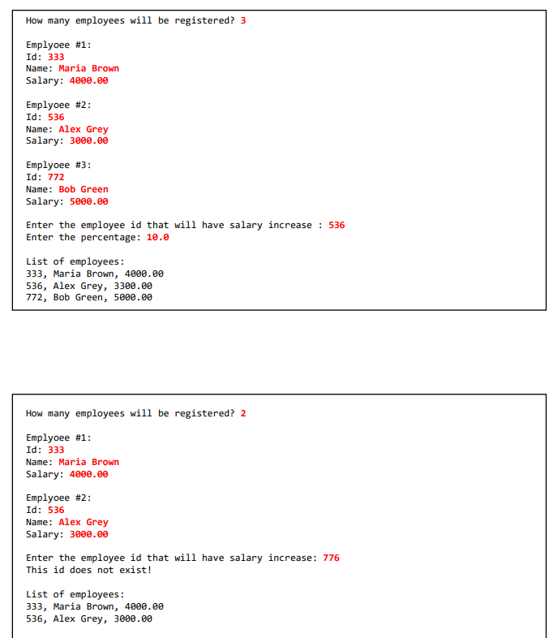<br><sub>Fig 37 - ArrayList Exercise - (<a href='https://www.udemy.com/course/java-curso-completo/'>Work by  Neilo Alves</a>) </sub></div>

<br>

<div align="center">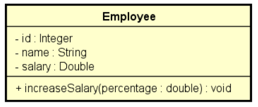<br><sub>Fig 38 - ArrayList Exercise - (<a href='https://www.udemy.com/course/java-curso-completo/'>Work by  Nelio Alves</a>) </sub></div>

<br>

Class Employe

```java

public class Employee {

	private Integer id;
	private String name;
	private Double salary;
	
	public Employee() {
	}
	
	public Employee(Integer id, String name, Double salary) {
		this.id = id;
		this.name = name;
		this.salary = salary;
	}

	public Integer getId() {
		return id;
	}

	public void setId(Integer id) {
		this.id = id;
	}

	public String getName() {
		return name;
	}

	public void setName(String name) {
		this.name = name;
	}

	public Double getSalary() {
		return salary;
	}

	public void setSalary(Double salary) {
		this.salary = salary;
	}
	
	public void increaseSalary(double percentage) {
		salary += salary * percentage / 100.0;
	}
	
	public String toString() {
		return id + ", " + name + ", " + String.format("%.2f", salary);
	}
}

```

Program

```java

package application;

import java.util.ArrayList;
import java.util.List;
import java.util.Locale;
import java.util.Scanner;

import entities.Employee;

public class Program {

	public static void main(String[] args) {

		Locale.setDefault(Locale.US);
		Scanner sc = new Scanner(System.in);

		List<Employee> list = new ArrayList<>();
		
		// PART 1 - READING DATA:
		
		System.out.print("How many employees will be registered? ");
		int n = sc.nextInt();
		
		for (int i=1; i<=n; i++) {
			System.out.println();
			System.out.println("Employee #" + i + ": ");

			System.out.print("Id: ");
			int id = sc.nextInt();
			while (hasId(list, id)) {
				System.out.print("Id already taken. Try again: ");
				id = sc.nextInt();
			}
			
			System.out.print("Name: ");
			sc.nextLine();
			String name = sc.nextLine();
			System.out.print("Salary: ");
			double salary = sc.nextDouble();
			list.add(new Employee(id, name, salary));
		}

		// PART 2 - UPDATING SALARY OF GIVEN EMPLOYEE:
		
		System.out.println();
		System.out.print("Enter the employee id that will have salary increase: ");
		int id = sc.nextInt();
		Employee emp = list.stream().filter(x -> x.getId() == id).findFirst().orElse(null);
		if (emp == null) {
			System.out.println("This id does not exist!");
		}
		else {
			System.out.print("Enter the percentage: ");
			double percentage = sc.nextDouble();
			emp.increaseSalary(percentage);
		}
		
		// PART 3 - LISTING EMPLOYEES:
		
		System.out.println();
		System.out.println("List of employees:");
		for (Employee obj : list) {
			System.out.println(obj);
		}
				
		sc.close(); 
	}
	
	public static boolean hasId(List<Employee> list, int id) {
		Employee emp = list.stream().filter(x -> x.getId() == id).findFirst().orElse(null);
		return emp != null;
	}
}

```

#### <a name="chapter11part2"></a>Chapter 12 - Part 2: HashMap

- It is a collection of key/value pairs
  - Does not support key object repetitions
  - Elements are indexed by the key object (have no position)
  - Accessing, inserting and removing elements is fast

- Common usage: cookies, local storage, any key-value model

- Main implementations:
  - HashMap: faster (O(1) operations on hash table) and unordered
  - TreeMap: slower (O(log(n)) operations in red-black tree) and sorted by object compareTo (or Comparator)
  - LinkedHashMap: intermediate speed and elements in the order they are added

**Some important methods**

- put(key, value), remove(key), containsKey(key), get(key)
  - Based on equals and hashCode
  - If equals and hashCode do not exist, pointer comparison is used

- clear()

- size()

- keySet(): return a Set<K>

- values(): return a Collection<V>

	
In the ```ArrayList``` chapter, you learned that Arrays store items as an ordered collection, and you have to access them with an index number (```int``` type). A ```HashMap``` however, store items in "**key/value**" pairs, and you can access them by an index of another type (e.g. a ```String```).
	
One object is used as a key (index) to another object (value). It can store different types: ```String``` keys and ```Integer``` values, or the same type, like: ```String``` keys and ```String``` values:
	
Example: Create a ```HashMap``` object called **capitalCities** that will store ```String``` keys and ```String``` values:
	
```java
	
import java.util.HashMap; // import the HashMap class

HashMap<String, String> capitalCities = new HashMap<String, String>();
	
```
	
**Add Items**
	
The HashMap class has many useful methods. For example, to add items to it, use the ```put()``` method:
	
```java

// Import the HashMap class
import java.util.HashMap;

public class Main {
  public static void main(String[] args) {
    // Create a HashMap object called capitalCities
    HashMap<String, String> capitalCities = new HashMap<String, String>();

    // Add keys and values (Country, City)
    capitalCities.put("England", "London");
    capitalCities.put("Germany", "Berlin");
    capitalCities.put("Norway", "Oslo");
    capitalCities.put("USA", "Washington DC");
    System.out.println(capitalCities);
  }
}
	
```
	
**Access an Item**
	
To access a value in the HashMap, use the ```get()``` method and refer to its key:
	
```Java
	
capitalCities.get("England");
	
```
	
**Remove an Item**
	
To remove an item, use the ```remove()``` method and refer to the key:
	
```java
	
capitalCities.remove("England");
	
```
	
To remove all items, use the ```clear()``` method:
	
```java
	
capitalCities.clear();
	
```
	
**HashMap Size**
	
To find out how many items there are, use the ```size()``` method:
	
```java
	
capitalCities.size();
	
```
	
**Loop Through a HashMap**
	
Loop through the items of a HashMap with a for-each loop.

Note: Use the keySet() method if you only want the keys, and use the values() method if you only want the values:
	
```java
	
// Print keys
for (String i : capitalCities.keySet()) {
  System.out.println(i);
}
	
```
	
```java
	
// Print values
for (String i : capitalCities.values()) {
  System.out.println(i);
}
	
```
	
```java
	
// Print keys and values
for (String i : capitalCities.keySet()) {
  System.out.println("key: " + i + " value: " + capitalCities.get(i));
}
	
```
	
**Other Types**
	
Keys and values in a HashMap are actually objects. In the examples above, we used objects of type "String". Remember that a String in Java is an object (not a primitive type). To use other types, such as int, you must specify an equivalent wrapper class: Integer. For other primitive types, use: Boolean for boolean, Character for char, Double for double, etc:
	
```java
	
// Import the HashMap class
import java.util.HashMap;

public class Main {
  public static void main(String[] args) {

    // Create a HashMap object called people
    HashMap<String, Integer> people = new HashMap<String, Integer>();


    // Add keys and values (Name, Age)
    people.put("John", 32);
    people.put("Steve", 30);
    people.put("Angie", 33);

    for (String i : people.keySet()) {
      System.out.println("key: " + i + " value: " + people.get(i));
    }
  }
}
	
```

#### <a name="chapter11part3"></a>Chapter 12 - Part 3: HashSet

- Represents a set of elements (similar to Algebra)
  - Does not allow repetitions
  - Elements have no position
  - Accessing, inserting and removing elements is fast
  - Offers efficient set operations: intersection, union, difference.
  
- Main implementations:
  - HashSet: faster (O(1) operations on hash table) and unordered
  - TreeSet: slower (O(log(n)) operations in red-black tree) and sorted by object compareTo (or Comparator)
  - LinkedHashSet: intermediate speed and elements in the order they are added

**Some important methods**

- add(obj), remove(obj), contains(obj)
  - Based on equals and hashCode
  - If equals and hashCode do not exist, pointer comparison is used

- clear()

- size()

- RemoveIf(predicate)

- addAll(other): union: adds the elements of the other set to the set, without repetition

- retainAll(other): intersection: removes elements not contained in other from the set

- removeAll(other): difference: removes elements contained in other from the set
	
A HashSet is a collection of items where every item is unique, and it is found in the ```java.util``` package:
	
Example: Create a HashSet object called cars that will store strings:
	
```java
	
import java.util.HashSet; // Import the HashSet class

HashSet<String> cars = new HashSet<String>();
	
```
	
**Add Items**
	
The HashSet class has many useful methods. For example, to add items to it, use the ```add()``` method:
	
```java
	
// Import the HashSet class
import java.util.HashSet;

public class Main {
  public static void main(String[] args) {
    HashSet<String> cars = new HashSet<String>();
    cars.add("Volvo");
    cars.add("BMW");
    cars.add("Ford");
    cars.add("BMW");
    cars.add("Mazda");
    System.out.println(cars);
  }
}
	
```
	
Note: In the example above, even though BMW is added twice it only appears once in the set because every item in a set has to be unique.
	
**Check If an Item Exists**
	
To check whether an item exists in a HashSet, use the ```contains()``` method:
	
```java
	
cars.contains("Mazda");
	
```
	
**Remove an Item**
	
To remove an item, use the ```remove()``` method:
	
```java
	
cars.remove("Volvo");
	
```
	
To remove all items, use the ```clear()``` method:
	
```java
	
cars.clear();
	
```
	
**HashSet Size**

To find out how many items there are, use the ```size``` method:
	
```java
	
cars.size();
	
```
	
**Loop Through a HashSet**
	
Loop through the items of an HashSet with a for-each loop:
	
```java
	
for (String i : cars) {
  System.out.println(i);
}
	
```
	
**Union**
	
```java
	
package application;
	
import java.util.Arrays;
import java.util.Set;
import java.util.TreeSet;
	
public class Program {
	
	public static void main(String[] args) {
	
		Set<Integer> a = new TreeSet<>(Arrays.asList(0,2,4,5,6,8,10));
		Set<Integer> b = new TreeSet<>(Arrays.asList(5,6,7,8,9,10));
	
		//union
		Set<Integer> c = new TreeSet<>(a);
		c.addAll(b);
		System.out.println(c); // [0, 2, 4, 5, 6, 7, 8, 9, 10]
	}
}
	
```
	
**intersection**
	
```java
	
import java.util.Arrays;
import java.util.Set;
import java.util.TreeSet;
	
public class Program {
	
	public static void main(String[] args) {
	
		Set<Integer> a = new TreeSet<>(Arrays.asList(0,2,4,5,6,8,10));
		Set<Integer> b = new TreeSet<>(Arrays.asList(5,6,7,8,9,10));
	
		//intersection
		Set<Integer> d = new TreeSet<>(a);
		d.retainAll(b);
		System.out.println(d); // [5, 6, 8, 10]
	}
}
	
```
	
**difference**
	
```java
	
import java.util.Arrays;
import java.util.Set;
import java.util.TreeSet;
	
public class Program {
	
	public static void main(String[] args) {
	
		Set<Integer> a = new TreeSet<>(Arrays.asList(0,2,4,5,6,8,10));
		Set<Integer> b = new TreeSet<>(Arrays.asList(5,6,7,8,9,10));
	
		//difference
		Set<Integer> e = new TreeSet<>(a);
		e.removeAll(b);
		System.out.println(e); //[0, 2, 4]
	}
}
	
```
	
**Other Types**
	
Items in an HashSet are actually objects. In the examples above, we created items (objects) of type "String". Remember that a String in Java is an object (not a primitive type). To use other types, such as int, you must specify an equivalent wrapper class: Integer. For other primitive types, use: Boolean for boolean, Character for char, Double for double, etc:
	
```java
	
import java.util.HashSet;

public class Main {
  public static void main(String[] args) {

    // Create a HashSet object called numbers
    HashSet<Integer> numbers = new HashSet<Integer>();

    // Add values to the set
    numbers.add(4);
    numbers.add(7);
    numbers.add(8);

    // Show which numbers between 1 and 10 are in the set
    for(int i = 1; i <= 10; i++) {
      if(numbers.contains(i)) {
        System.out.println(i + " was found in the set.");
      } else {
        System.out.println(i + " was not found in the set.");
      }
    }
  }
}
			  
```


## <a name="chapter12"></a>Chapter 12: Java Date and Time

#### <a name="chapter12part1"></a>Chapter 12 - Part 1: Java Date and Time

**Java Dates**

Java does not have a built-in Date class, but we can import the ```java.time``` package to work with the date and time API. The package includes many date and time classes. For example:

| Class             | Description                                                             |
| :----------------:| :----------------------------------------------------------------------:|
| LocalDate         | Represents a date (year, month, day (yyyy-MM-dd))                       |
| LocalTime         | Represents a time (hour, minute, second and nanoseconds (HH-mm-ss-ns))  |
| LocalDateTime     | Represents both a date and a time (yyyy-MM-dd-HH-mm-ss-ns)              | 
| DateTimeFormatter | Formatter for displaying and parsing date-time objects                  | 

**Display Current Date**

To display the current date, import the ```java.time.LocalDate``` class, and use its ```now()``` method:

```java

import java.time.LocalDate; // import the LocalDate class

public class Main {
  public static void main(String[] args) {
    LocalDate myObj = LocalDate.now(); // Create a date object
    System.out.println(myObj); // Display the current date //2022-11-04 
  }
}

**Display Current Time**

To display the current time (hour, minute, second, and nanoseconds), import the ```java.time.LocalTime``` class, and use its ```now()``` method:

```java

import java.time.LocalTime; // import the LocalTime class

public class Main {
  public static void main(String[] args) {
    LocalTime myObj = LocalTime.now();
    System.out.println(myObj); //14:30:40.994046 
  }
}

```

**Display Current Date and Time**

To display the current date and time, import the ```java.time.LocalDateTime class```, and use its ```now()``` method:

```java

import java.time.LocalDateTime; // import the LocalDateTime class

public class Main {
  public static void main(String[] args) {
    LocalDateTime myObj = LocalDateTime.now();
    System.out.println(myObj); //2022-11-04T14:30:40.994110 
  }
}

```

**Formatting Date and Time**

The "T" in the example above is used to separate the date from the time. You can use the ```DateTimeFormatter``` class with the ```ofPattern()``` method in the same package to format or parse date-time objects. The following example will remove both the "T" and nanoseconds from the date-time:

```java

import java.time.LocalDateTime; // Import the LocalDateTime class
import java.time.format.DateTimeFormatter; // Import the DateTimeFormatter class

public class Main {
  public static void main(String[] args) {
    LocalDateTime myDateObj = LocalDateTime.now();
    System.out.println("Before formatting: " + myDateObj); //Before Formatting: 2022-11-04T14:30:40.995494 
    DateTimeFormatter myFormatObj = DateTimeFormatter.ofPattern("dd-MM-yyyy HH:mm:ss");

    String formattedDate = myDateObj.format(myFormatObj);
    System.out.println("After formatting: " + formattedDate); //After Formatting: 04-11-2022 14:30:40 
  }
}

```

The ```ofPattern()``` method accepts all sorts of values, if you want to display the date and time in a different format. For example:

| Value          | Example            |
| :-------------:| :-----------------:|
| yyyy-MM-dd     | "1988-09-29"       |
| dd/MM/yyyy     | "29/09/1988"       |
| dd-MMM-yyyy    | "29-Sep-1988"      | 
| E, MMM dd yyyy | "Thu, Sep 29 1988" |

## <a name="chapter13"></a>Chapter 13: Java Enums

#### <a name="chapter13part1"></a>Chapter 12 - Part 1: Java Enums

It is a special type that serves to literally specify a set of related constants

Keyword in Java: ```enum```

Advantage: better semantics, more readable code and supported by compiler

Example: life cycle of a request.

```java

package entities.enums;

public enum OrderStatus {

	PENDING_PAYMENT,
	PROCESSING,
	SHIPPED,
	DELIVERED;
}

```

```java

package entities;

import java.util.Date;

import entities.enums.OrderStatus;

public class Order {

	private Integer id;
	private Date moment;
	private OrderStatus status;
	
	public Order() {
	}

	public Order(Integer id, Date moment, OrderStatus status) {
		this.id = id;
		this.moment = moment;
		this.status = status;
	}

	public Integer getId() {
		return id;
	}

	public void setId(Integer id) {
		this.id = id;
	}

	public Date getMoment() {
		return moment;
	}

	public void setMoment(Date moment) {
		this.moment = moment;
	}

	public OrderStatus getStatus() {
		return status;
	}

	public void setStatus(OrderStatus status) {
		this.status = status;
	}

	@Override
	public String toString() {
		return "Order [id=" + id + ", moment=" + moment + ", status=" + status + "]";
	}
}

```

```java

package application;

import java.util.Date;

import entities.Order;
import entities.enums.OrderStatus;

public class Program {

	public static void main(String[] args) {

		Order order = new Order(1080, new Date(), OrderStatus.PENDING_PAYMENT);
		
		System.out.println(order);
		
		OrderStatus os1 = OrderStatus.DELIVERED;
		
		OrderStatus os2 = OrderStatus.valueOf("DELIVERED");
		
		System.out.println(os1);
		System.out.println(os2);
	}
}

```

**Convertion String to enum**

```java

OrderStatus os1 = OrderStatus.DELIVERED;

OrderStatus os2 = OrderStatus.valueOf("DELIVERED");

```

UML Annotation

<br>

<div align="center">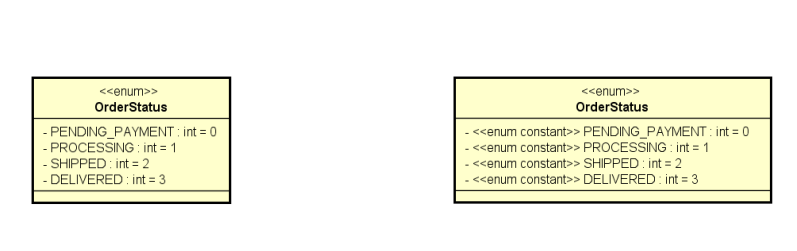<br><sub>Fig 39 - Enum UML representation - (<a href='https://www.udemy.com/course/java-curso-completo/'>Work by  Nelio Alves</a>) </sub></div>

<br>

## <a name="chapter14"></a>Chapter 14: Java Interfaces

#### <a name="chapter14part1"></a>Chapter 14 - Part 1: Java Interfaces

As of Java 8, interfaces can have "default methods" or "defend methods"

Interface is a type that defines a set of operations that a class must implement.

The interface establishes a contract that the class must comply with.

- For what interfaces?
  - To create loosely coupled and flexible systems.

```java

interface Shape {
	double area();
	double perimeter();
}

```

Another way to achieve **abstraction** in Java, is with interfaces.

An ```interface``` is a completely **"abstract class"** that is used to group related methods with empty bodies:

```java

// interface
interface Animal {
  public void animalSound(); // interface method (does not have a body)
  public void run(); // interface method (does not have a body)
}

```

To access the interface methods, the interface must be "implemented" (kinda like inherited) by another class with the ```implements``` keyword (instead of ```extends```). The body of the interface method is provided by the "implement" class:

```java

// Interface
interface Animal {
  public void animalSound(); // interface method (does not have a body)
  public void sleep(); // interface method (does not have a body)
}

// Pig "implements" the Animal interface
class Pig implements Animal {
  public void animalSound() {
    // The body of animalSound() is provided here
    System.out.println("The pig says: wee wee");
  }
  public void sleep() {
    // The body of sleep() is provided here
    System.out.println("Zzz");
  }
}

class Main {
  public static void main(String[] args) {
    Pig myPig = new Pig();  // Create a Pig object
    myPig.animalSound();
    myPig.sleep();
  }
}

```

Notes on Interfaces:

- Like abstract classes, interfaces cannot be used to create objects (in the example above, it is not possible to create an "Animal" object in the MyMainClass)
- Interface methods do not have a body - the body is provided by the "implement" class
- On implementation of an interface, you must override all of its methods
- Interface methods are by default ```abstract``` and ```public```
- Interface attributes are by default ```public```, ```static``` and ```final```
- An interface cannot contain a constructor (as it cannot be used to create objects)

Why And When To Use Interfaces?

1) To achieve security - hide certain details and only show the important details of an object (interface).

2) Java does not support "multiple inheritance" (a class can only inherit from one superclass). However, it can be achieved with interfaces, because the class can **implement** multiple interfaces. **Note**: To implement multiple interfaces, separate them with a comma (see example below).

**Multiple Interfaces**

To implement multiple interfaces, separate them with a comma:

```java

interface FirstInterface {
  public void myMethod(); // interface method
}

interface SecondInterface {
  public void myOtherMethod(); // interface method
}

class DemoClass implements FirstInterface, SecondInterface {
  public void myMethod() {
    System.out.println("Some text..");
  }
  public void myOtherMethod() {
    System.out.println("Some other text...");
  }
}

class Main {
  public static void main(String[] args) {
    DemoClass myObj = new DemoClass();
    myObj.myMethod();
    myObj.myOtherMethod();
  }
}

```

Exercise: A Brazilian car rental company charges an hourly rate for rentals of up to 12 hours. However, if the duration of the lease exceeds 12 hours, the lease will be charged based on a daily rate. In addition to the lease amount, it is added to the price the tax amount according to the country's rules which, in the case of Brazil, is 20% for values up to 100.00, or 15% for values above 100.00. Make one program that reads the lease data (car model, start and end time of lease), as well as the hourly rate and the daily rental rate. The program must then generate the payment note (containing lease amount, tax and total payment amount) and enter the data on the screen. see the examples.

<br>

<div align="center">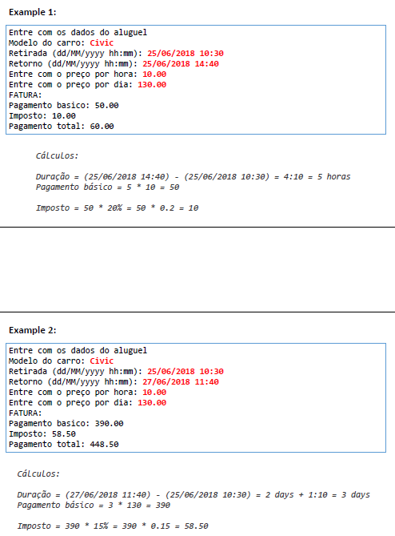<br><sub>Fig 40 - Exercise Interface - (<a href='https://www.udemy.com/course/java-curso-completo/'>Work by  Nelio Alves</a>) </sub></div>

<br>

Class CarRental

```java

package model.entities;

import java.time.LocalDateTime;

public class CarRental {

	private LocalDateTime start;
	private LocalDateTime finish;
	
	private Vehicle vehicle;
	private Invoice invoice;
	
	public CarRental() {
	}

	public CarRental(LocalDateTime start, LocalDateTime finish, Vehicle vehicle) {
		this.start = start;
		this.finish = finish;
		this.vehicle = vehicle;
	}

	public LocalDateTime getStart() {
		return start;
	}

	public void setStart(LocalDateTime start) {
		this.start = start;
	}

	public LocalDateTime getFinish() {
		return finish;
	}

	public void setFinish(LocalDateTime finish) {
		this.finish = finish;
	}

	public Vehicle getVehicle() {
		return vehicle;
	}

	public void setVehicle(Vehicle vehicle) {
		this.vehicle = vehicle;
	}

	public Invoice getInvoice() {
		return invoice;
	}

	public void setInvoice(Invoice invoice) {
		this.invoice = invoice;
	}
}

```

Class Invoice

```java

package model.entities;

public class Invoice {

	private Double basicPayment;
	private Double tax;
	
	public Invoice() {
	}

	public Invoice(Double basicPayment, Double tax) {
		this.basicPayment = basicPayment;
		this.tax = tax;
	}

	public Double getBasicPayment() {
		return basicPayment;
	}

	public void setBasicPayment(Double basicPayment) {
		this.basicPayment = basicPayment;
	}

	public Double getTax() {
		return tax;
	}

	public void setTax(Double tax) {
		this.tax = tax;
	}
	
	public Double getTotalPayment() {
		return getBasicPayment() + getTax();
	}
}

```

Class Vehicle

```java

package model.entities;

public class Vehicle {

	private String model;
	
	public Vehicle() {
	}

	public Vehicle(String model) {
		this.model = model;
	}

	public String getModel() {
		return model;
	}

	public void setModel(String model) {
		this.model = model;
	}
}

```

Class RentalService

```java

package model.services;

import java.time.Duration;

import model.entities.CarRental;
import model.entities.Invoice;

public class RentalService {

	private Double pricePerDay;
	private Double pricePerHour;
	
	private TaxService taxService;

	public RentalService(Double pricePerDay, Double pricePerHour, TaxService taxService) {
		this.pricePerDay = pricePerDay;
		this.pricePerHour = pricePerHour;
		this.taxService = taxService;
	}
	
	public void processInvoice(CarRental carRental) {
		
		double minutes = Duration.between(carRental.getStart(), carRental.getFinish()).toMinutes();		
		double hours = minutes / 60.0;
		
		double basicPayment;
		if (hours <= 12.0) {
			basicPayment = pricePerHour * Math.ceil(hours);
		}
		else {
			basicPayment = pricePerDay * Math.ceil(hours / 24);
		}

		double tax = taxService.tax(basicPayment);

		carRental.setInvoice(new Invoice(basicPayment, tax));
	}
}

```

Class TaxService

```java

package model.services;

public interface TaxService {

	double tax(double amount);
}

```

Class BrazilTaxService

```java

package model.services;

public class BrazilTaxService implements TaxService {

	public double tax(double amount) {
		if (amount <= 100.0) {
			return amount * 0.2;
		}
		else {
			return amount * 0.15;
		}
	}
}

```

<br>

<div align="center">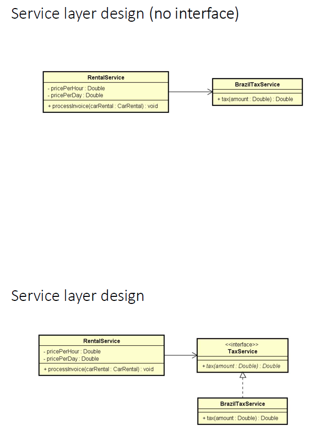<br><sub>Fig 40 - Exercise Interface - (<a href='https://www.udemy.com/course/java-curso-completo/'>Work by  Nelio Alves</a>) </sub></div>

<br>

Program

```java

package application;

import java.text.ParseException;
import java.time.LocalDateTime;
import java.time.format.DateTimeFormatter;
import java.util.Date;
import java.util.Locale;
import java.util.Scanner;

import model.entities.CarRental;
import model.entities.Vehicle;
import model.services.BrazilTaxService;
import model.services.RentalService;

public class Program {

	public static void main(String[] args) throws ParseException {

		Locale.setDefault(Locale.US);
		Scanner sc = new Scanner(System.in);
		
		DateTimeFormatter fmt =  DateTimeFormatter.ofPattern("dd/MM/yyyy HH:mm");
		
		System.out.println("Entre com os dados do aluguel");
		System.out.print("Modelo do carro: ");
		String carModel = sc.nextLine();
		System.out.print("Retirada (dd/MM/yyyy HH:mm): ");
		LocalDateTime start = LocalDateTime.parse(sc.nextLine(), fmt);
		System.out.print("Retorno (dd/MM/yyyy HH:mm): ");
		LocalDateTime finish = LocalDateTime.parse(sc.nextLine(), fmt);
		
		CarRental cr = new CarRental(start, finish, new Vehicle(carModel));

		System.out.print("Entre com o preço por hora: ");
		double pricePerHour = sc.nextDouble();
		System.out.print("Entre com o preço por dia: ");
		double pricePerDay = sc.nextDouble();
		
		RentalService rentalService = new RentalService(pricePerDay, pricePerHour, new BrazilTaxService());
		
		rentalService.processInvoice(cr);

		System.out.println("FATURA:");
		System.out.println("Pagamento basico: " + String.format("%.2f", cr.getInvoice().getBasicPayment()));
		System.out.println("Imposto: " + String.format("%.2f", cr.getInvoice().getTax()));
		System.out.println("Pagamento total: " + String.format("%.2f", cr.getInvoice().getTotalPayment()));
		
		sc.close();
	}
}

```

#### <a name="chapter14part2"></a>Chapter 14 - Part 2: Dependency Injection and Inversion of Control

When we have a direct association we have:
- Strong Coupling
- The RentalService class knows the concrete dependency
- If the concrete class changes, you need to change the RentalService class

<br>

<div align="center">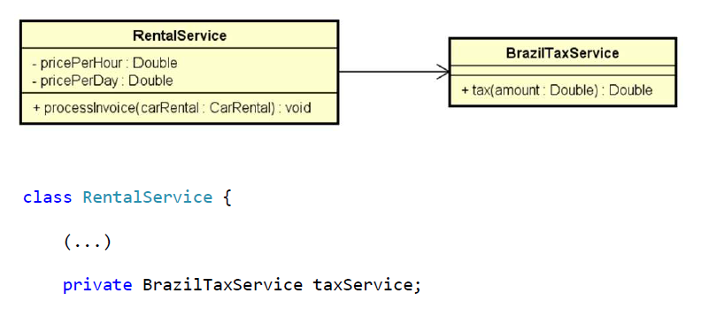<br><sub>Fig 40 - Interfaces - (<a href='https://www.udemy.com/course/java-curso-completo/'>Work by  Nelio Alves</a>) </sub></div>

<br>

When we implement a interface in our solution:
- weak coupling
- The RentalService class doesn't know the concrete dependency
- If the concrete class changes, the RentalService class doesn't change anything

<br>

<div align="center">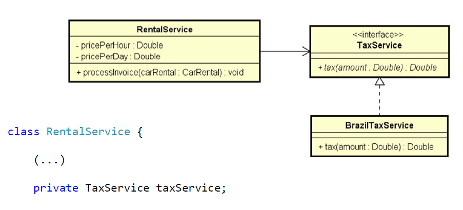<br><sub>Fig 40 - Interfaces - (<a href='https://www.udemy.com/course/java-curso-completo/'>Work by  Nelio Alves</a>) </sub></div>

<br>

**Dependency injection via constructor**

<br>

<div align="center">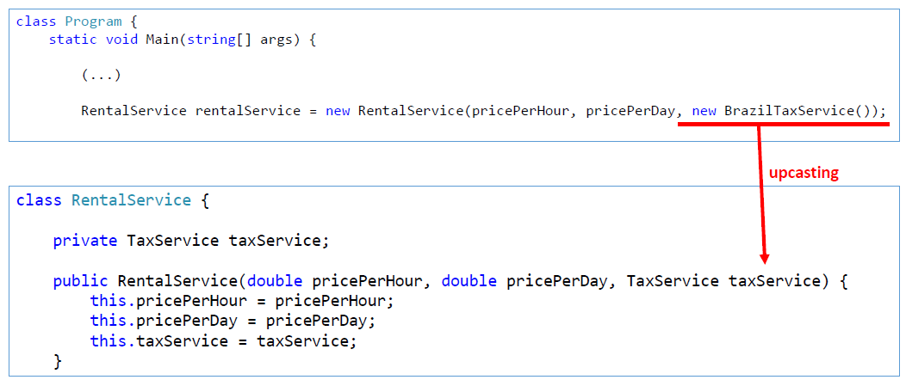<br><sub>Fig 40 - Interfaces - (<a href='https://www.udemy.com/course/java-curso-completo/'>Work by  Nelio Alves</a>) </sub></div>

<br>

**Inversion of control**
- Development pattern that consists of removing from class a responsibility to instantiate your dependencies. The Class RentalService don't have to instanciate the type of TaxService, just the abstraction, Tax Service

**dependency injection**
- It is a way of performing inversion of control: an external component instantiates the dependency (In the exercise, the main Program, which is then injected into the "parent" object (The Parent was the RentalService). It might be implemented in several ways:
  - Constructor
  - Instantiation class (builder/factory)
  - Container / framework

#### <a name="chapter14part3"></a>Chapter 14 - Part 3: Inheritance vs Interfaces

**Common aspects between inheritance and interfaces**

- relationship is-one
- generalization/specialization
- Polymorphism

**Main Differences**

- inheritance = reuse (attributes and methods)
- interfaces = contract to be fulfilled

<br>

<div align="center">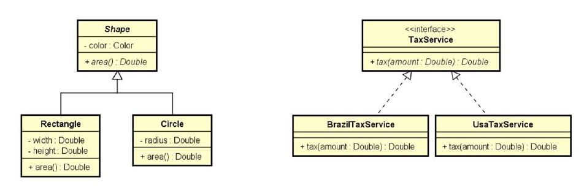<br><sub>Fig 40 - Interfaces - (<a href='https://www.udemy.com/course/java-curso-completo/'>Work by  Nelio Alves</a>) </sub></div>

<br>

You can implement inheritance with interfaces, folow this case

Exercise: What if I need to implement Shape as an interface, but I also want to define a common reusable structure for all figures?

<br>

<div align="center">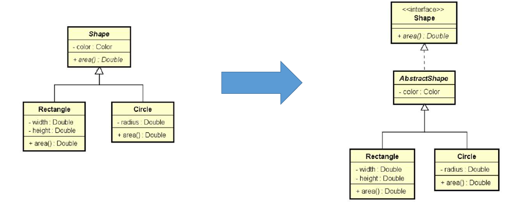<br><sub>Fig 40 - Interfaces - (<a href='https://www.udemy.com/course/java-curso-completo/'>Work by  Nelio Alves</a>) </sub></div>

<br>

Class Colour

```java

package model.enums;

public enum Color {
	BLACK,
	WHITE;
}

```

Class AbstractShape

```java

package model.entities;

import model.enums.Color;

public abstract class AbstractShape implements Shape {

	private Color color;

	public AbstractShape(Color color) {
		this.color = color;
	}

	public Color getColor() {
		return color;
	}

	public void setColor(Color color) {
		this.color = color;
	}
}

```

Class Shape

```java

package model.entities;

public interface Shape {

	double area();
}

```

Class Circle

```java

package model.entities;

import model.enums.Color;

public class Circle extends AbstractShape {

	private Double radius;

	public Circle(Color color, Double radius) {
		super(color);
		this.radius = radius;
	}

	public Double getRadius() {
		return radius;
	}

	public void setRadius(Double radius) {
		this.radius = radius;
	}

	@Override
	public double area() {
		return Math.PI * radius * radius;
	}
}

```

Class Rectangle

```java

package model.entities;

import model.enums.Color;

public class Rectangle extends AbstractShape {

	private Double width;
	private Double height;

	public Rectangle(Color color, Double width, Double height) {
		super(color);
		this.width = width;
		this.height = height;
	}

	public Double getWidth() {
		return width;
	}

	public void setWidth(Double width) {
		this.width = width;
	}

	public Double getHeight() {
		return height;
	}

	public void setHeight(Double height) {
		this.height = height;
	}

	@Override
	public double area() {
		return width * height;
	}
}

```

Program

```java

package application;

import model.entities.AbstractShape;
import model.entities.Circle;
import model.entities.Rectangle;
import model.enums.Color;

public class Program {

	public static void main(String[] args) {

		AbstractShape s1 = new Circle(Color.BLACK, 2.0);
		AbstractShape s2 = new Rectangle(Color.WHITE, 3.0, 4.0);
		
		System.out.println("Circle color: " + s1.getColor());
		System.out.println("Circle area: " + String.format("%.3f", s1.area()));
		System.out.println("Rectangle color: " + s2.getColor());
		System.out.println("Rectangle area: " + String.format("%.3f", s2.area()));
	}
}

```

#### <a name="chapter14part4"></a>Chapter 14 - Part 4: Multiple Inheritance and Interfaces

Multiple inheritance can generate the diamond problem: a ambiguity caused by existence of the same method in more than one superclass.

Multiple inheritance is not allowed in most languages!

<br>

<div align="center">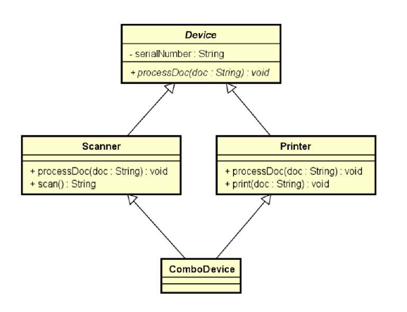<br><sub>Fig 40 - Interfaces - (<a href='https://www.udemy.com/course/java-curso-completo/'>Work by  Nelio Alves</a>) </sub></div>

<br>

**However, a class can implement more from an interface**

<br>

<div align="center">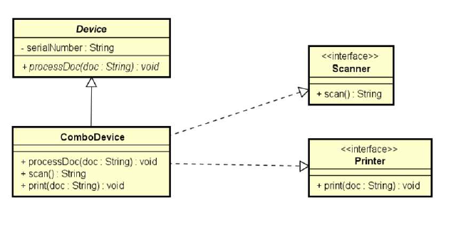<br><sub>Fig 40 - Interfaces - (<a href='https://www.udemy.com/course/java-curso-completo/'>Work by  Nelio Alves</a>) </sub></div>

<br>

OBS: This is NOT multiple inheritance, because THERE IS NO REUSE in the relationship between ComboDevice and the Scanner and Printer interfaces. ComboDevide does not inherit, but yes implements the interfaces (fulfills the contract).

Class Device

```java

package devices;

public abstract class Device {

	public String serialNumber;

	public Device(String serialNumber) {
		this.serialNumber = serialNumber;
	}
	
	public String getSerialNumber() {
		return serialNumber;
	}

	public void setSerialNumber(String serialNumber) {
		this.serialNumber = serialNumber;
	}

	public abstract void processDoc(String doc);
}

```

Class ComboDevice

```java

package devices;

public class ComboDevice extends Device implements Scanner, Printer {

	public ComboDevice(String serialNumber) {
		super(serialNumber);
	}

	@Override
	public void print(String doc) {
		System.out.println("Combo printing: " + doc);
	}

	@Override
	public String scan() {
		return "Combo scan result";
	}

	@Override
	public void processDoc(String doc) {
		System.out.println("Combo processing: " + doc);
	}
}

```

Class Printer

```java

package devices;

public interface Printer {

	void print(String doc);
}

```

Class Scanner

```java

package devices;

public interface Scanner {

	String scan();
}

```

Class ConcretePrinter

```Java

package devices;

public class ConcretePrinter extends Device implements Printer {

	public ConcretePrinter(String serialNumber) {
		super(serialNumber);
	}

	@Override
	public void processDoc(String doc) {
		System.out.println("Printer processing: " + doc);
	}

	@Override
	public void print(String doc) {
		System.out.println("Printing: " + doc);
	}
}

```

Class ConcreteScanner

```java

package devices;

public class ConcreteScanner extends Device implements Scanner {

	public ConcreteScanner(String serialNumber) {
		super(serialNumber);
	}

	@Override
	public void processDoc(String doc) {
		System.out.println("Scanner processing: " + doc);
	}

	@Override
	public String scan() {
		return "Scanned content";
	}
}

```

Program

```java

package application;

import devices.ComboDevice;
import devices.ConcretePrinter;
import devices.ConcreteScanner;

public class Program {

	public static void main(String[] args) {

		ConcretePrinter p = new ConcretePrinter("1080");
		p.processDoc("My Letter");
		p.print("My Letter");

		System.out.println();
		ConcreteScanner s = new ConcreteScanner("2003");
		s.processDoc("My Email");
		System.out.println("Scan result: " + s.scan());
		
		System.out.println();
		ComboDevice c = new ComboDevice("2081");
		c.processDoc("My dissertation");
		c.print("My dissertation");
		System.out.println("Scan result: " + c.scan());
	}
}

```

#### <a name="chapter14part5"></a>Chapter 14 - Part 5: Comparable Interface

The Comparable interface is used to compare an object of the same class with an instance of that class, it provides ordering of data for objects of the user-defined class. The class has to implement the java.lang.Comparable interface to compare its instance, it provides the compareTo method that takes a parameter of the object of that class.

Example: Write a program to read a file containing names of people (one name per line), storing them in a list. Then sort the data in this list and show them neatly on the screen. Note: the file path can be informed "hardcode".

Maria Brown
Alex Green
Bob Grey
Anna White
Alex Black
Eduardo Rose
Willian Red
Marta Blue
Alex Brown

```java

package hello;

import java.io.BufferedReader;
import java.io.FileReader;
import java.io.IOException;
import java.util.ArrayList;
import java.util.Collections;
import java.util.List;

public class Program {
	public static void main(String[] args) {
		List<String> list = new ArrayList<>();
		String path = "C:\\temp\\in.txt";
		try (BufferedReader br = new BufferedReader(new FileReader(path))) {
			String name = br.readLine();
			while (name != null) {
				list.add(name);
				name = br.readLine();
			}
			Collections.sort(list);
			for (String s : list) {
				System.out.println(s);
			}
		} catch (IOException e) {
			System.out.println("Error: " + e.getMessage());
		}
	}
}


/*

output

Alex Black
Alex Brown
Alex Green
Anna White
Bob Grey
Eduardo Rose
Maria Brown
Marta Blue
Willian Red

*/

```

Example:  Make a program to read a file containing employees (name and salary) in the .csv format, storing them in a list. Then sort the list by name and show the result on the screen. Note: the file path can be informed "hardcode".

Maria Brown,4300.00
Alex Green,3100.00
Bob Grey,3100.00
Anna White,3500.00
Alex Black,2450.00
Eduardo Rose,4390.00
Willian Red,2900.00
Marta Blue,6100.00
Alex Brown,5000.00


```java

package hello;

import java.io.BufferedReader;
import java.io.FileReader;
import java.io.IOException;
import java.util.ArrayList;
import java.util.Collections;
import java.util.List;
import entities.Employee;

public class Program {
	public static void main(String[] args) {
		List<Employee> list = new ArrayList<>();
		String path = "C:\\temp\\in.txt";
		try (BufferedReader br = new BufferedReader(new FileReader(path))) {
			String employeeCsv = br.readLine();
			while (employeeCsv != null) {
				String[] fields = employeeCsv.split(",");
				list.add(new Employee(fields[0], Double.parseDouble(fields[1])));
				employeeCsv = br.readLine();
			}
			Collections.sort(list);
			for (Employee emp : list) {
				System.out.println(emp.getName() + ", " + emp.getSalary());
			}
		} catch (IOException e) {
			System.out.println("Error: " + e.getMessage());
		}
	}
}

/*
 * 
 * output
 * 
Alex Black, 2450.0
Alex Brown, 5000.0
Alex Green, 3100.0
Anna White, 3500.0
Bob Grey, 3100.0
Eduardo Rose, 4390.0
Maria Brown, 4300.0
Marta Blue, 6100.0
Willian Red, 2900.0
 */

```

```java

package entities;

public class Employee implements Comparable<Employee> {
	private String name;
	private Double salary;

	public Employee(String name, Double salary) {
		this.name = name;
		this.salary = salary;
	}

	public String getName() {
		return name;
	}

	public void setName(String name) {
		this.name = name;
	}

	public Double getSalary() {
		return salary;
	}

	public void setSalary(Double salary) {
		this.salary = salary;
	}

	@Override
	public int compareTo(Employee other) {
		return name.compareTo(other.getName()); //you are comparing with name with .getName(). If was salary, use .getSalary()
	}
}

```

**Using Comparable Interface**

- In this method, we are going to implement the Comparable interface from java.lang Package in the Pair class.
- The Comparable interface contains the method compareTo to decide the order of the elements.
- Override the compareTo method in the Pair class.
- Create an array of Pairs and populate the array.
- Use the Arrays.sort() function to sort the array.

**Example 1**

Given an array of Pairs consisting of two fields of type string and integer. you have to sort the array in ascending Lexicographical order and if two strings are the same sort it based on their integer value.

**Sample I/O:**

```

Input:  { {"abc", 3}, {"a", 4}, {"bc", 5}, {"a", 2} }
Output:  { {"a", 2}, {"a", 4}, {"abc", 3}, {"bc", 5} }

Input:  { {"efg", 1}, {"gfg", 1}, {"cba", 1}, {"zaa", 1} }
Output:  { {"cba", 1}, {"efg", 1}, {"gfg", 1}, {"zaa", 1} }

```

```java

import java.io.*;
import java.util.*;

class Pair implements Comparable<Pair> {
	String x;
	int y;

	public Pair(String x, int y)
	{
		this.x = x;
		this.y = y;
	}

	public String toString()
	{
		return "(" + x + "," + y + ")";
	}

	@Override public int compareTo(Pair a)
	{
		// if the string are not equal
		if (this.x.compareTo(a.x) != 0) {
			return this.x.compareTo(a.x);
		}
		else {
			// we compare int values
			// if the strings are equal
			return this.y - a.y;
		}
	}
}

public class GFG {
	public static void main(String[] args)
	{

		int n = 4;
		Pair arr[] = new Pair[n];

		arr[0] = new Pair("abc", 3);
		arr[1] = new Pair("a", 4);
		arr[2] = new Pair("bc", 5);
		arr[3] = new Pair("a", 2);

		// Sorting the array
		Arrays.sort(arr);

		// printing the
		// Pair array
		print(arr);
	}

	public static void print(Pair[] arr)
	{
		for (int i = 0; i < arr.length; i++) {
			System.out.println(arr[i]);
		}
	}
}

```

```
Before Sorting:
(abc, 3);
(a, 4);
(bc, 5);
(a, 2);

After Sorting:
(a,2)
(a,4)
(abc,3)
(bc,5)
```

Note: if two strings are the same then the comparison is done based on the value.

**Example 2**

Given an array of Pairs consisting of two strings with first and last names. you have to sort the array in ascending Lexicographical order of the first name and if two strings are the same sort it based on their last name.

**Sample I/O:**

```
Input:  { {"raj", "kashup"}, {"rahul", "singh"}, {"reshmi", "dubey"}, {"rahul", "jetli"} }
Output:  { {"rahul", "jetli"}, {"rahul", "singh"}, {"raj", "kashup"}, {"reshmi", "dubey"} }

Input:  { {"abc", "last"}, {"pklz", "yelp"}, {"rpng", "note"}, {"ppza", "xyz"} }
Output:  { {"abc", "last"}, {"pklz", "yelp"}, {"ppza", "xyz"}, {"rpng", "note"} }
```

```java


import java.io.*;
import java.util.*;
 
class Pair implements Comparable<Pair> {
    String firstName;
    String lastName;
 
    public Pair(String x, String y)
    {
        this.firstName = x;
        this.lastName = y;
    }
 
    public String toString()
    {
        return "( " + firstName + " , " + lastName + " )";
    }
 
    @Override public int compareTo(Pair a)
    {
        // if the string are not equal
        if (this.firstName.compareTo(a.firstName) != 0) {
            return this.firstName.compareTo(a.firstName);
        }
        else {
            // we compare lastName if firstNames are equal
            return this.lastName.compareTo(a.lastName);
        }
    }
}
 
public class GFG {
    public static void main(String[] args)
    {
 
        int n = 4;
        Pair arr[] = new Pair[n];
        arr[0] = new Pair("raj", "kashup");
        arr[1] = new Pair("rahul", "singh");
        arr[2] = new Pair("reshmi", "dubey");
        arr[3] = new Pair("rahul", "jetli");
 
        // Sorting the array
        Arrays.sort(arr);
 
        // printing the
        // Pair array
        print(arr);
    }
 
    public static void print(Pair[] arr)
    {
        for (int i = 0; i < arr.length; i++) {
            System.out.println(arr[i]);
        }
    }
}

```

**output**

```
Before Sorting:
( raj , kashup )
( rahul , singh )
( reshmi , dubey )
( rahul , jetli )


After Sorting:
( rahul , jetli )
( rahul , singh )
( raj , kashup )
( reshmi , dubey )
```

#### <a name="chapter14part6"></a>Chapter 14 - Part 6: Default methods

-  As of Java 8, interfaces can contain concrete methods.

- The basic intent is to provide default implementation for methods, so to avoid:
  - repetition of implementation in every class that implements the interface
  - the need to create abstract classes to provide implementation reuse

- Other advantages:
  - Maintain backward compatibility with existing systems
  - Allow "functional interfaces" (which must contain only one method) can provide other reusable standard operations

Example: Make a program to read an amount and the duration in months of a loan. Inform the amount to be paid after the deadline for the loan, in accordance with Brazilian interest rate rules. The calculation rule for Brazilian interest is standard compound interest of 2% per month.

<br>

<div align="center">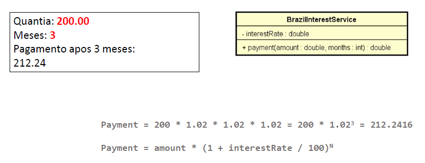<br><sub>Fig 40 - Interfaces - (<a href='https://www.udemy.com/course/java-curso-completo/'>Work by  Nelio Alves</a>) </sub></div>

<br>

class BrazilInterestService

```java

package services;

public class BrazilInterestService implements InterestService {

	private double interestRate;

	public BrazilInterestService(double interestRate) {
		this.interestRate = interestRate;
	}

	@Override
	public double getInterestRate() {
		return interestRate;
	}
}

```

class InterestService

```java

package services;

import java.security.InvalidParameterException;

public interface InterestService {

	double getInterestRate();

	default double payment(double amount, int months) {
		if (months < 1) {
			throw new InvalidParameterException("Months must be greater than zero");
		}
		return amount * Math.pow(1.0 + getInterestRate() / 100.0, months);
	}
}

```

class UsaInterestService

```java

package services;

public class UsaInterestService implements InterestService {

	private double interestRate;

	public UsaInterestService(double interestRate) {
		this.interestRate = interestRate;
	}

	@Override
	public double getInterestRate() {
		return interestRate;
	}
}

```

Program

```java

package application;

import java.util.Locale;
import java.util.Scanner;

import services.BrazilInterestService;
import services.InterestService;

public class Program {

	public static void main(String[] args) {

		Locale.setDefault(Locale.US);
		Scanner sc = new Scanner(System.in);
		
		System.out.print("Amount: ");
		double amount = sc.nextDouble();
		System.out.print("Months: ");
		int months = sc.nextInt();
		
		InterestService is = new BrazilInterestService(2.0);
		double payment = is.payment(amount, months);
		
		System.out.println("Payment after " + months + " months:");
		System.out.println(String.format("%.2f", payment));
		
		sc.close();
	}
}

```


In Java 8+: 
- interfaces can now provide reuse
- now we have a form of multiple inheritance
  - But the compiler complains if there is more than one method with the same signature, forcing you to overwrite it
- Interfaces are still quite different from abstract classes. interfaces they do not have features such as constructors and attributes.

## <a name="chapter15"></a>Chapter 15: Java Exceptions

#### <a name="chapter15part1"></a>Chapter 15 - Part 1: Java Exceptions

**Exceptions**

-  An exception is any error condition or behavior unexpected encountered by a running program

- In Java, an exception is an object inherited from the class:
  - java.lang.Exception - compiler forces to handle or propagate
  - java.lang.RuntimeException - compiler does not force to handle or propagate

- When thrown, an exception is propagated down the call stack of running methods, until it is captured (handled) or the program is terminated

<br>

<div align="center">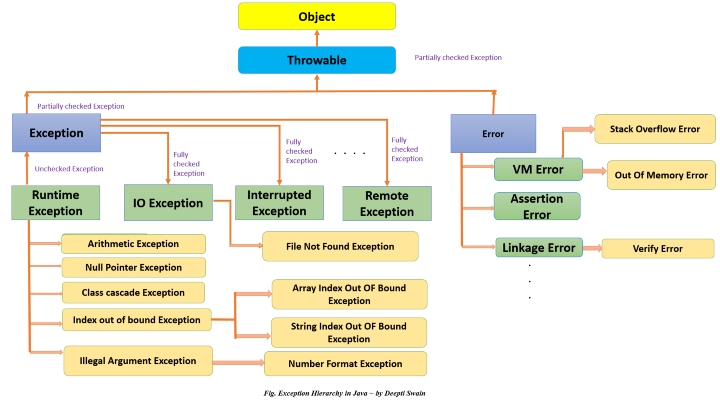<br><sub>Fig 50 - Exceptions in Java - (<a href='https://medium.com/interviewnoodle/exception-in-java-89a0b41e0c45'>Work by Deepti Swain</a>) </sub></div>

<br>

Error subclass is not handled, but Exception subclass need to be handled

**Why Exceptions?**

The exception handling model allows errors to be dealt with consistently and flexibly, using best practices

Benefits:
  - Delega a lógica do erro para a classe responsável por conhecer as regras que podem ocasionar o erro
  - Handles in an organized (including hierarchical) way exceptions of different types
  - The exception can load any data

#### <a name="chapter15part2"></a>Chapter 15 - Part 2: Try-Catch-Finally

The ```try``` statement allows you to define a block of code to be tested for errors while it is being executed.

The ```catch``` statement allows you to define a block of code to be executed, if an error occurs in the try block.

The ```try``` and ```catch``` keywords come in pairs:

```java

try {
  //  Block of code to try
}
catch(Exception e) {
  //  Block of code to handle errors
}

```

Consider the following example:

```java

public class Main {
  public static void main(String[ ] args) {
    int[] myNumbers = {1, 2, 3};
    System.out.println(myNumbers[10]); // error!
  }
}

```

The output will be something like this:

```
Exception in thread "main" java.lang.ArrayIndexOutOfBoundsException: 10
        at Main.main(Main.java:4)
```

If an error occurs, we can use ```try...catch``` to catch the error and execute some code to handle it:

```java

public class Main {
  public static void main(String[ ] args) {
    try {
      int[] myNumbers = {1, 2, 3};
      System.out.println(myNumbers[10]);
    } catch (Exception e) {
      System.out.println("Something went wrong.");
    }
  }
}

```

The output will be:

```
Something went wrong.
```

The ```finally``` statement lets you execute code, after ```try...catch```, regardless of the result:

```Java

public class Main {
  public static void main(String[] args) {
    try {
      int[] myNumbers = {1, 2, 3};
      System.out.println(myNumbers[10]);
    } catch (Exception e) {
      System.out.println("Something went wrong.");
    } finally {
      System.out.println("The 'try catch' is finished.");
    }
  }
}

```

```
Something went wrong.
The 'try catch' is finished.
```

Another Example:

```java

import java.util.InputMismatchException;
import java.util.Scanner;

public class Program {
	public static void main(String[] args) {
		Scanner sc = new Scanner(System.in);
		try {
			String[] vect = sc.nextLine().split(" ");
			int position = sc.nextInt();
			System.out.println(vect[position]);
		} catch (ArrayIndexOutOfBoundsException e) {
			System.out.println("Invalid position!");
		} catch (InputMismatchException e) {
			System.out.println("Input error");
		}
		System.out.println("End of program");
		sc.close();
	}
}

```

#### <a name="chapter15part3"></a>Chapter 15 - Part 3: Stack Trace

```java

import java.util.InputMismatchException;
import java.util.Scanner;

public class Program {
	public static void main(String[] args) {
		method1();
		System.out.println("End of program");
	}

	public static void method1() {
		System.out.println("***METHOD1 START***");
		method2();
		System.out.println("***METHOD1 END***");
	}

	public static void method2() {
		System.out.println("***METHOD2 START***");
		Scanner sc = new Scanner(System.in);
		try {
			String[] vect = sc.nextLine().split(" ");
			int position = sc.nextInt();
			System.out.println(vect[position]);
		} catch (ArrayIndexOutOfBoundsException e) {
			System.out.println("Invalid position!");
			e.printStackTrace();
			sc.next();
		} catch (InputMismatchException e) {
			System.out.println("Input error");
		}
		sc.close();
		System.out.println("***METHOD2 END***");
	}
}

```


with the ```printStackTrace```, we can print the sequence of methods

```
***METHOD1 START***
***METHOD2 START***
Alex Maria Bob
5
Invalid position!
java.lang.ArrayIndexOutOfBoundsException: Index 5 out of bounds for length 3
	at hello.Program.method2(Program.java:24)
	at hello.Program.method1(Program.java:14)
	at hello.Program.main(Program.java:8)
```

#### <a name="chapter15part4"></a>Chapter 15 - Part 4: Custom Exceptions


The ```throw``` statement allows you to create a custom error.

The ```throw``` statement is used together with an **exception type**. There are many exception types available in Java: ```ArithmeticException```, ```FileNotFoundException```, ```ArrayIndexOutOfBoundsException```, ```SecurityException```, etc:

Example: Throw an exception if age is below 18 (print "Access denied"). If age is 18 or older, print "Access granted":

```java

public class Main {
  static void checkAge(int age) {
    if (age < 18) {
      throw new ArithmeticException("Access denied - You must be at least 18 years old.");
    }
    else {
      System.out.println("Access granted - You are old enough!");
    }
  }

  public static void main(String[] args) {
    checkAge(15); // Set age to 15 (which is below 18...)
  }
}

```

The output will be:

```
Exception in thread "main" java.lang.ArithmeticException: Access denied - You must be at least 18 years old.
        at Main.checkAge(Main.java:4)
        at Main.main(Main.java:12)
```

If age was 20, you would not get an exception:

```
checkAge(20);
```

The output will be:

```
Access granted - You are old enough!
```

## <a name="chapter16"></a>Chapter 16: Java File Handling

#### <a name="chapter16part1"></a>Chapter 16 - Part 1: Java File Handling

**Java File Handling**

The ```File``` class from the ```java.io``` package, allows us to work with files.

To use the ```File``` class, create an object of the class, and specify the filename or directory name:

```java

import java.io.File;  // Import the File class

File myObj = new File("filename.txt"); // Specify the filename

```

The ```File``` class has many useful methods for creating and getting information about files. For example:

| Method            | Type      | Description                                    |
| :----------------:| :--------:|:---------------------------------------------: |
| canRead()         | Boolean   | Tests whether the file is readable or not      |
| canWrite()        | Boolean   | Tests whether the file is writable or not      |
| createNewFile()   | Boolean   | Creates an empty file                          |
| delete()          | Boolean   | Deletes a file                                 |
| exists()          | Boolean   | Tests whether the file exists                  |
| getName()         | String    | Returns the name of the file                   |
| getAbsolutePath() | String    | Returns the absolute pathname of the file      |
| length()          | Long      | Returns the size of the file in bytes          |
| list()            | String[]  | Returns an array of the files in the directory |
| mkdir()           | Boolean   | Creates a directory                            |

#### <a name="chapter16part2"></a>Chapter 16 - Part 2: Java Create and Write To Files

**Create a File**

To create a file in Java, you can use the ```createNewFile()``` method. This method returns a boolean value: ```true``` if the file was successfully created, and ```false``` if the file already exists. Note that the method is enclosed in a ```try...catch``` block. This is necessary because it throws an ```IOException``` if an error occurs (if the file cannot be created for some reason):

```java

import java.io.File;  // Import the File class
import java.io.IOException;  // Import the IOException class to handle errors

public class CreateFile {
  public static void main(String[] args) {
    try {
      File myObj = new File("filename.txt");
      if (myObj.createNewFile()) {
        System.out.println("File created: " + myObj.getName());
      } else {
        System.out.println("File already exists.");
      }
    } catch (IOException e) {
      System.out.println("An error occurred.");
      e.printStackTrace();
    }
  }
}

```

The output will be:

```
File created: filename.txt
```

To create a file in a specific directory (requires permission), specify the path of the file and use double backslashes to escape the "\" character (for Windows). On Mac and Linux you can just write the path, like: /Users/name/filename.txt

```java

File myObj = new File("C:\\Users\\MyName\\filename.txt");

```

**Write To a File**

In the following example, we use the ```FileWriter``` class together with its ```write()``` method to write some text to the file we created in the example above. Note that when you are done writing to the file, you should close it with the ```close()``` method:

```java

import java.io.FileWriter;   // Import the FileWriter class
import java.io.IOException;  // Import the IOException class to handle errors

public class WriteToFile {
  public static void main(String[] args) {
    try {
      FileWriter myWriter = new FileWriter("filename.txt");
      myWriter.write("Files in Java might be tricky, but it is fun enough!");
      myWriter.close();
      System.out.println("Successfully wrote to the file.");
    } catch (IOException e) {
      System.out.println("An error occurred.");
      e.printStackTrace();
    }
  }
}

```

The output will be:

```
Successfully wrote to the file.
```

#### <a name="chapter16part3"></a>Chapter 16 - Part 3: Java Read Files

**Read a File**

In the previous chapter, you learned how to create and write to a file.

In the following example, we use the ```Scanner``` class to read the contents of the text file we created in the previous chapter:

```java

import java.io.File;  // Import the File class
import java.io.FileNotFoundException;  // Import this class to handle errors
import java.util.Scanner; // Import the Scanner class to read text files

public class ReadFile {
  public static void main(String[] args) {
    try {
      File myObj = new File("filename.txt");
      Scanner myReader = new Scanner(myObj);
      while (myReader.hasNextLine()) {
        String data = myReader.nextLine();
        System.out.println(data);
      }
      myReader.close();
    } catch (FileNotFoundException e) {
      System.out.println("An error occurred.");
      e.printStackTrace();
    }
  }
}

```

The output will be:

```
Files in Java might be tricky, but it is fun enough!
```

**Get File Information**

To get more information about a ```file```, use any of the File methods:

```java

import java.io.File;  // Import the File class

public class GetFileInfo { 
  public static void main(String[] args) {
    File myObj = new File("filename.txt");
    if (myObj.exists()) {
      System.out.println("File name: " + myObj.getName());
      System.out.println("Absolute path: " + myObj.getAbsolutePath());
      System.out.println("Writeable: " + myObj.canWrite());
      System.out.println("Readable " + myObj.canRead());
      System.out.println("File size in bytes " + myObj.length());
    } else {
      System.out.println("The file does not exist.");
    }
  }
}

```

The output will be:

```
File name: filename.txt
Absolute path: C:\Users\MyName\filename.txt
Writeable: true
Readable: true
File size in bytes: 0
```

OBS: Note: There are many available classes in the Java API that can be used to read and write files in Java: ```FileReader, BufferedReader, Files, Scanner, FileInputStream, FileWriter, BufferedWriter, FileOutputStream```, etc. Which one to use depends on the Java version you're working with and whether you need to read bytes or characters, and the size of the file/lines etc.

#### <a name="chapter16part4"></a>Chapter 16 - Part 4: Java Delete Files

**Delete a File**

To delete a file in Java, use the ```delete()``` method:

```java

import java.io.File;  // Import the File class

public class DeleteFile {
  public static void main(String[] args) { 
    File myObj = new File("filename.txt"); 
    if (myObj.delete()) { 
      System.out.println("Deleted the file: " + myObj.getName());
    } else {
      System.out.println("Failed to delete the file.");
    } 
  } 
}

```

The output will be:

```
Deleted the file: filename.txt
```

**Delete a Folder**

You can also delete a folder. However, it must be empty:

```java

import java.io.File; 

public class DeleteFolder {
  public static void main(String[] args) { 
    File myObj = new File("C:\\Users\\MyName\\Test"); 
    if (myObj.delete()) { 
      System.out.println("Deleted the folder: " + myObj.getName());
    } else {
      System.out.println("Failed to delete the folder.");
    } 
  } 
}

```

The output will be:

```
Deleted the folder: Test
```

## <a name="chapter17"></a>Chapter 17: Java Lambda Expression

#### <a name="chapter17part1"></a>Chapter 17 - Part 1: Java Lambda Expression
	

	
<!-- URL's -->
