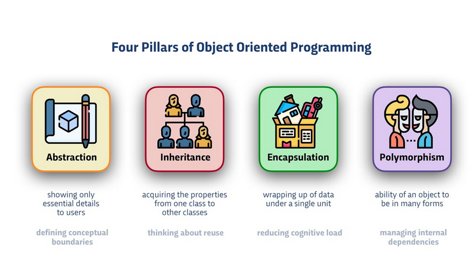
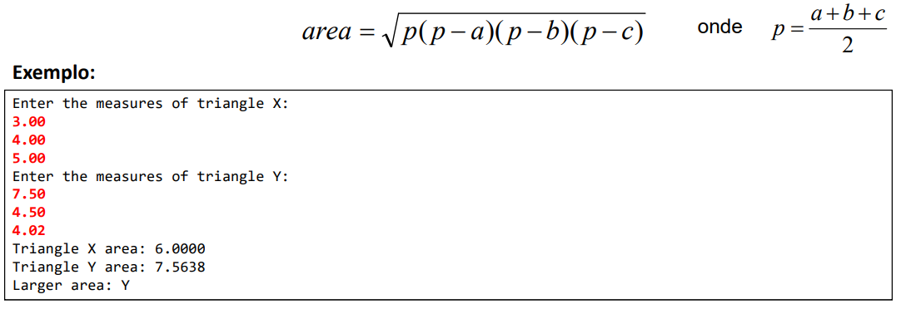

<h1 align="center"> Java </h1>

# Content

1. [Chapter 1: Programming Concepts](#chapter1)
    - [Chapter 1 - Part 1: Programmer's Career Starts](#chapter1part1)
    - [Chapter 1 - Part 2: Algorithm](#chapter1part2)
    - [Chapter 1 - Part 3: Automation](#chapter1part3)
    - [Chapter 1 - Part 4: Computer Program](#chapter1part4)
    - [Chapter 1 - Part 5: What Does it Take to Make a Computer Program?](#chapter1part5)
    - [Chapter 1 - Part 6: Programming Language](#chapter1part6)
    - [Chapter 1 - Part 7: IDE](#chapter1part7)
    - [Chapter 1 - Part 8: Compilation and Interpretation, Source Code and Object Code, Virtual machine](#chapter1part8)
2. [Chapter 2: Introduction to Java](#chapter2)
    - [Chapter 2 - Part 1: What is Java?](#chapter2part1)
    - [Chapter 2 - Part 2: Understanding Java Versions (LTS)](#chapter2part2)
    - [Chapter 2 - Part 3: JVM](#chapter2part3)
    - [Chapter 2 - Part 4: Compile-time Errors and Runtime Errors](#chapter2part4)
    - [Chapter 2 - Part 5: Structure of a Java Application](#chapter2part5)
    - [Chapter 2 - Part 6: Components of Oracle's Java Platform Products](#chapter2part6)
    - [Chapter 2 - Part 7: First Program in Java](#chapter2part7)
3. [Chapter 3: Sequential Structure](#chapter3)
    - [Chapter 3 - Part 1: Arithmetic Expressions](#chapter3part1)
    - [Chapter 3 - Part 2: Variables](#chapter3part2)
    - [Chapter 3 - Part 3: Data Types in Java](#chapter3part3)
    - [Chapter 3 - Part 4: The Three Basic Operations of a Computer](#chapter3part4)
    - [Chapter 3 - Part 5: Data Output](#chapter3part5)
    - [Chapter 3 - Part 6: Data Processing](#chapter3part6)
    - [Chapter 3 - Part 7: Casting](#chapter3part7)
    - [Chapter 3 - Part 8: Data Input](#chapter3part8)
    - [Chapter 3 - Part 9: Mathematic Functions](#chapter3part9)
4. [Chapter 4: Conditional Structure](#chapter4)
    - [Chapter 4 - Part 1: Comparison Operators in Java](#chapter4part1)
    - [Chapter 4 - Part 2: Logical Operators in Java](#chapter4part2)
    - [Chapter 4 - Part 3: Conditional Statement in Java(if-else)](#chapter4part3)
    - [Chapter 4 - Part 4: Conditional Statement in Java(Short Hand If...Else)](#chapter4part4)
    - [Chapter 4 - Part 5: Conditional Statement in Java(switch-case)](#chapter4part5)
    - [Chapter 4 - Part 6: Java Scope](#chapter4part6)
5. [Chapter 5: Repetition Structure](#chapter5)
    - [Chapter 5 - Part 1: Repetition Statement in Java(while)](#chapter5part1)
    - [Chapter 5 - Part 2: Repetition Statement in Java(for)](#chapter5part2)
    - [Chapter 5 - Part 3: Repetition Statement in Java(do-while)](#chapter5part3)
    - [Chapter 5 - Part 4: Repetition Statement in Java(For-Each)](#chapter5part4)
    - [Chapter 5 - Part 5: Break and Continue Statement in Java](#chapter5part5)
6. [Chapter 6: Arrays](#chapter6)
    - [Chapter 6 - Part 1: Array](#chapter6part1)
    - [Chapter 6 - Part 2: Loop Through an Array](#chapter6part2)
    - [Chapter 6 - Part 3: Multidimensional Arrays](#chapter6part3)
7. [Chapter 7: Conventions, Strings, bitwise operators and functions](#chapter7)
    - [Chapter 7 - Part 1: Name Convention](#chapter7part1)
    - [Chapter 7 - Part 2: Bitwise Operators in Java](#chapter7part2)
    - [Chapter 7 - Part 3: String Functions](#chapter7part3)
    - [Chapter 7 - Part 4: Comments](#chapter7part4)
    - [Chapter 7 - Part 5: Functions](#chapter7part5)
8. [Chapter 8: The Four Pillars of Object-Oriented Programming](#chapter8)
    - [Chapter 8 - Part 1: Abstraction](#chapter8part1)
    - [Chapter 8 - Part 2: Encapsulation](#chapter8part2)
    - [Chapter 8 - Part 3: Inheritance](#chapter8part3)
    - [Chapter 8 - Part 4: Polymorphism](#chapter8part4)
9. [Chapter 9: Object-Oriented Programming in Java](#chapter9)
    - [Chapter 9 - Part 1: Solving a Problem without Object Orientation](#chapter9part1)
    - [Chapter 9 - Part 2: Classes, Objects and Attributes in Java](#chapter9part2)
    - [Chapter 9 - Part 3: Solving the same Problem with object orientation](#chapter9part3)
    - [Chapter 9 - Part 4: Methods in Java](#chapter9part4)
    - [Chapter 9 - Part 5: Continuing to solve the Problem with object orientation](#chapter9part5)
    - [Chapter 9 - Part 6: Second problem with object orientation](#chapter9part6)
    - [Chapter 9 - Part 7: Object Class in Java](#chapter9part7)
    - [Chapter 9 - Part 8: Third problem with object orientation](#chapter9part8)
    - [Chapter 9 - Part 9: Constructors in Java](#chapter9part9)
    - [Chapter 9 - Part 10: Modifiers in Java](#chapter9part10)
    - [Chapter 9 - Part 11: Encapsulation in Java](#chapter9part11)
    - [Chapter 9 - Part 12: Classes Composition in Java](#chapter9part12)
    - [Chapter 9 - Part 13: Inheritance in Java](#chapter9part13)
    - [Chapter 9 - Part 14: Polymorphism in Java](#chapter9part14)
    - [Chapter 9 - Part 15: Abstraction Class and methods](#chapter9part15)
10. [Chapter 10: Reference Type vs. Value Types, Garbage Collector, Boxing, unboxing and wrapper classes](#chapter10)
    - [Chapter 10 - Part 1: Reference Type vs. Value Types](#chapter10part1)
    - [Chapter 10 - Part 2: Garbage Collector](#chapter10part2)
    - [Chapter 10 - Part 3:  Boxing, unboxing and wrapper classes](#chapter10part3)
11. [Chapter 11: Collections](#chapter11)
    - [Chapter 11 - Part 1: ArrayList](#chapter11part1)
12. [Chapter 12: Java Date and Time](#chapter12)
    - [Chapter 12 - Part 1: Java Date and Time](#chapter12part1)
13. [Chapter 13: Java Enums](#chapter13)
    - [Chapter 13 - Part 1: Java Enums](#chapter13part1)
14. [Chapter 14: Java Interfaces](#chapter14)
    - [Chapter 14 - Part 1: Java Interfaces](#chapter14part1)
    - [Chapter 14 - Part 2: Dependency Injection and Inversion of Control](#chapter14part2)
    - [Chapter 14 - Part 3: Inheritance vs Interfaces](#chapter14part3)
    - [Chapter 14 - Part 4: Multiple Inheritance and Interfaces](#chapter14part4)
    - [Chapter 14 - Part 5: Comparable Interface](#chapter14part5)
    - [Chapter 14 - Part 6: Default methods](#chapter14part6)
15. [Chapter 15: Java Exceptions](#chapter15)
    - [Chapter 15 - Part 1: Java Exceptions](#chapter15part1)
    - [Chapter 15 - Part 2: Try-Catch-Finally](#chapter15part2)
    - [Chapter 15 - Part 3: Stack Trace](#chapter15part3)
    - [Chapter 15 - Part 4: Custom Exceptions](#chapter15part3)
16. [Chapter 16: Java File Handling](#chapter16)
    - [Chapter 16 - Part 1: Java File Handling](#chapter16part1)
    - [Chapter 16 - Part 2: Java Create and Write To Files](#chapter16part2)
    - [Chapter 16 - Part 3: Java Read Files](#chapter16part3)
    - [Chapter 16 - Part 4: Java Delete Files](#chapter16part4)
17. [Chapter 17: Java Lambda Expression](#chapter17)
    - [Chapter 17 - Part 1: Java Lambda Expression](#chapter17part1)

## <a name="chapter1"></a>Chapter 1: Programming Concepts
  
#### <a name="chapter1part1"></a>Chapter 1 - Part 1: Programmer's Career Starts

The beginning of any programmer's career starts with solid fundamentals, such as:

1. Programming Logic
2. Algorithms
3. Data Structure (Arrays, Lists)
4. Object Oriented Programming
5. Relational Data Base
6. Systems Analysis and Design

#### <a name="chapter1part2"></a>Chapter 1 - Part 2: Algorithm

Algorithm is a process or set of rules to be followed as problem-solving operations.

Make a cake problem:

A Cake Recipe Algorithm

1. Preheat the oven.
2. Gather the ingredients.
3. Measure out the ingredients.
4. Mix the ingredients to make the batter.
5. Grease a pan.
6. Pour the batter into the pan.
7. Put the pan in the oven.
8. Set a timer.
9. When the timer goes off, take the pan out of the oven.
10. Enjoy!

#### <a name="chapter1part3"></a>Chapter 1 - Part 3: Automation

Consists of using machine (s) to perform the procedure automatically or semi-automatically.

In the cake recipe example, a food mixer can in the step four can be a example of automation.

#### <a name="chapter1part4"></a>Chapter 1 - Part 4: Computer Program

Computer have:

Hardware: Physical Parts (CPU, RAM, GPU, keyboard...)

Software: Logical Part (Program)
    - Operation System
    - Aplications (Spotify, Word, Web Browser)
    - Games
    - Utilities

Conclusion: Computer programs are algorithms executed by the computer. The computer is a machine that automates the execution of
algorithms.
Any algorithm? No. Only computational algorithms: Data processing and Calculation

#### <a name="chapter1part5"></a>Chapter 1 - Part 5: What Does it Take to Make a Computer Program?

To make a computer program, we need:

- A programming language: lexical and syntactic rules for write the program
- An IDE: software to edit and test the program
- A compiler: software for turning source code into code object
- A code generator or virtual machine: software that allows the program to run

#### <a name="chapter1part6"></a>Chapter 1 - Part 6: Programming Language

Programming languages have a lexical rules (orthography) and syntax rules (grammar) to write programs.

- Lexical

    Is about the correct words orthography.
    
    | Example English                                 | Example Programming Language  |
    |:------------------------------------------------|:------------------------------|
    | Dog (Correct)                                   | Main (Correct)                |
    | Dogo (Wrong)                                    | Maim (Wrong)                  |
    
- Syntax

   Is about the correct sentence’s grammar.
   
    | Example English                                 | Example Programming Language       |
    |:------------------------------------------------|:-----------------------------------|
    | He is a Daniel in judgment (Correct)            | x = 2 + y (Correct)                |
    | Daniel is a He in judgment (Wrong)              | x = + 2 y (Wrong)                  |
    

Example of program in Java:

```java
package application;

import java.util.Scanner;
import java.util.Locale;

public class Program {

	public static void main(String[] args) {
		
		Locale.setDefault(Locale.US);
		Scanner sc = new Scanner(System.in);
		
        	double x, y, media;
        
		System.out.print("Enter the First Number: ");
        	x = sc.nextDouble(); //input: 2
        	System.out.print("Enter the Second Number: ");
        	y = sc.nextDouble(); //input: 4
        
        	media = (x + y)/2.0;
        
       		System.out.println("Media = " + media);
        	sc.close();
	}
}

/*
Console

----input---
Enter the First Number: 2.0
Enter the First Number: 4.0

----output---
Media = 3.0
*/
```

#### <a name="chapter1part7"></a>Chapter 1 - Part 7: IDE

It is a set of software used to build programs.

Ex:

- C / C ++: Code Blocks
- Java: Eclipse, NetBeans
- C#: Microsoft Visual Studio

Functions of an IDE

- Editing of source code (indentation, autocompletion, highlighting of words, etc.)
- Debugging and testing
- Construction of the final product (build)
- Suggestion of templates
- Assist in various tasks of your project

#### <a name="chapter1part8"></a>Chapter 1 - Part 8: Compilation and Interpretation, Source Code and Object Code, Virtual Machine

**Source Code**: is the code written by the programmer in a programming language

Ex:

```java
package application;

import java.util.Scanner;
import java.util.Locale;

public class Program {

	public static void main(String[] args) {
		
		Locale.setDefault(Locale.US);
		Scanner sc = new Scanner(System.in);
		
        	double x, y, media;
        
		System.out.print("Enter the First Number: ");
        	x = sc.nextDouble(); //input: 2
        	System.out.print("Enter the Second Number: ");
        	y = sc.nextDouble(); //input: 4
        
        	media = (x + y)/2.0;
        
       		System.out.println("Media = " + media);
        	sc.close();
	}
}

/*
Console

----input---
Enter the First Number: 2.0
Enter the First Number: 4.0

----output---
Media = 3.0
*/
```
<br>

<div align="center"><br><sub>Fig 1 - Compilation and Interpretation Process</sub></div>

<br>

<div align="center"><br><sub>Fig 2 - Hybrid Process</sub></div>

<br>

- **Compilation**:
	- Program Speed
	- Compiler Assistance Before Execution
	- Disadvantage: Platform dependence of the generated binary code

- **Interpretation**:
	- Flexibility of Maintaining the Application in Production
	- Expressiveness of Language
	- Source Code does not need to be Recompiled to run on different platform
	- Disadvantage: Execution speed compared to compiled languages.

- **Hybrid**:
	- Compiler Assistance Before Execution
	- Source Code does not need to be Recompiled to run on different platform

## <a name="chapter2"></a>Chapter 2: Introduction to Java

#### <a name="chapter2part1"></a>Chapter 2 - Part 1: What is Java?

**Whats is Java?** 

Java is a program language and a developing platform, with libraries (API) and execution environment.

When you need to run a Java Program in a computer, you have to install the execution environment to run the program and the JDK (Java Development Kit) with the libraries and API.

**History of Java**

- Problems solved and reason for its success:
	- Pointers (C and C++) / memory management (garbage collector)
	- Failed portability: writing part of the code when changing of SO
	- Use on miscellaneous devices
	- Costs

- Created by Sun Microsystems in the mid-1990s

- Acquired by Oracle Corporation in 2010

- Java Advantages:
	- Compiled code for bytecode and run on virtual machine (JVM)
	- Portable, safe, robust
	- Runs on various types of devices
	- Dominates the corporate market since the end of the 20th century

**Java Editions**

 - Java ME - Java Micro Edition - embedded and mobile devices - IoT - http://www.oracle.com/technetwork/java/javame
 - Java SE - Java Standard Edition - core - desktop e servers - http://www.oracle.com/technetwork/java/javase
 - Java EE - Java Enterprise Edition - corporate applications - http://www.oracle.com/technetwork/java/javaee

**Java SE Documentation**

https://docs.oracle.com/en/java/javase/11/


#### <a name="chapter2part2"></a>Chapter 2 - Part 2: Understanding Java Versions (LTS)

The Standard Edition (SE) of Java, you can see in this link: https://www.oracle.com/java/technologies/javase-downloads.html

It is absolutely crazy to think about keeping several applications or several hundred (thousand?) servers up to date with the newest Java release, especially when 5 have come out in as many years by the end of 2019. That is why the concept of an LTS was established. A Java LTS (long-term support) release is a version of Java that will remain the industry standard for several years. To give you an example of this, Java 8 was released in 2014, it will continue to receive updates until 2020, and extended support will end by 2025. This is a span of almost 10 years for a stable Java release to be considered an industry standard. This gives plenty of OS vendors like Microsoft and Red Hat the time to repackage their releases with Java 8, time for application developers to update their applications to take full advantage of Java 8 features, and time for system administrators to update their data centers with Java 8 before a new version is released. At this time, the only other Java version that is also an LTS version is Java 11, which was released in 2018.

#### <a name="chapter2part3"></a>Chapter 2 - Part 3: JVM

JVM is the Java Virtual Machine to execute Java Programs in your system.

Java take the advantages of compilation and interpretation and create the hybrid interpretation with JVM.

Below, there some of compilation process examples in Java:

<br>

<div align="center"><br><sub>Fig 3 - Compilation Process in Java - (<a href='https://medium.com/@PrayagBhakar/lesson-2-behind-the-scenes-4df6a461f31f'>Work by Prayag Bhakar</a>) </sub></div>

<br>

<div align="center"><br><sub>Fig 4 - Compilation Process in Java - (<a href='https://www3.ntu.edu.sg/home/ehchua/programming/java/J1a_Introduction.html'>Work by Chua Hock-Chuan</a>) </sub></div>

<br>

<div align="center"><br><sub>Fig 5 - Compilation Process in Java - (<a href='https://www.w3schools.in/java-tutorial/compile-java-file-using-javac/'>Work by  w3schools</a>) </sub></div>

<br>

The process to execute the bytecode is called JIT (Just in Time) Compilation. Is more faster than interpretation because the compiler revise before the run time, if the bytecode is lexical and syntactical correct.

<br>

<div align="center"><br><sub>Fig 6 - Compilation Process in Java - (<a href='http://javaeesupportpatterns.blogspot.com/2013/07/java-just-in-time-compilation-more-than.html'>Work by javaeesupportpatterns</a>) </sub></div>

<br>

#### <a name="chapter2part4"></a>Chapter 2 - Part 4: Compile-time Errors and Runtime Errors

| Compile-time                                                                                                              | Runtime                                                                                                                              | 
| :------------------------------------------------------------------------------------------------------------------------ | :-----------------------------------------------------------------------------------------------------------------------------------:|
| The compile-time errors are the errors which are produced at the compile-time, and they are detected by the compiler.     | The runtime errors are the errors which are not generated by the compiler and produce an unpredictable result at the execution time. |
| In this case, the compiler prevents the code from execution if it detects an error in the program.]                       | In this case, the compiler does not detect the error, so it cannot prevent the code from the execution.                              |
| It contains the syntax and semantic errors such as missing semicolon at the end of the statement.                         | It contains the errors such as division by zero, determining the square root of a negative number.                                   |

#### <a name="chapter2part5"></a>Chapter 2 - Part 5: Structure of a Java Application

Java is an object-oriented language and your base unit is the class.  Every Code in Java have to be in a class.

The classes is organize in packages and the packages is organize in modules. A Java application is a set of modules with packages.

Bellow, there is a example of a Java application:

<br>

<div align="center"><br><sub>Fig 7 - Application Structure in Java Application </sub></div>

<br>

#### <a name="chapter2part6"></a>Chapter 2 - Part 6: Components of Oracle's Java Platform Products

The Java JDK come with some of most used packages to help the developer like awt, beans, io, lang, math, net, nio, sql, util and each package have a class or a interface.

<br>

<div align="center"><br><sub>Fig 8 -Java Packages - (<a href='http://www.wellnwill.com/tutorial/core-java/package/package'>Work by Well N Will</a>) </sub></div>

<br>

Oracle have a documentation about all his packages: https://docs.oracle.com/javase/8/docs/api/

<br>

<div align="center"><br><sub>Fig 9 -Java Packages - (<a href='https://docs.oracle.com/javase/8/docs/technotes/guides/desc_jdk_structure.html'>Work by Oracle</a>) </sub></div>

<br>

One of the most famous used packages is java.util.collections and java.util.map

<br>

<div align="center"><br><sub>Fig 10 -Java Packages - (<a href='https://ukode.es/colecciones-i-introduccion-y-conceptos-basicos/'>Work by Jose Antonio Simón</a>) </sub></div>

<br>

<div align="center"><br><sub>Fig 11 -Java Packages - (<a href='https://ukode.es/colecciones-i-introduccion-y-conceptos-basicos/'>Work by Jose Antonio Simón</a>) </sub></div>

<br>

<div align="center"><br><sub>Fig 12 -Java Packages - (<a href='https://www.javatpoint.com/collections-in-java'>Work by JavaPoint</a>) </sub></div>

<br>

#### <a name="chapter2part7"></a>Chapter 2 - Part 7: First Program in Java

To create your first program in Java, create a class in the srs folder.

Every programm in Java is a class.

Java programs have keywords. Each has a specific meaning and sometimes they need to be used in specific orders.

This keywords are case sensitive - in the code below, public, Public and PUBLIC are different things.

```java
package application;

public class Program {

	public static void main(String[] args) {
		
		System.out.println("Hello World!"); 

	}
}

/*
Console

----output---
Hello World!
*/
```

In the example above, public,class,void,main,Strings[],args,System.out.println are keywords.

**Defining a acess modifier**: the public is the acess modifier of the class. In this case, the class is public, or open to another class's.

**Defining a class**: The class keyword is used to define a class with the name following the keyword - Program - in this case. In the class, the left and right curly braces is to define the class block. To define a class requires a acess modifer, in this case, public.

**The main method**: Is the entry point for any Java program and is able to start and run the program when we use it.

**The static**: More later

**The void**: Indicate that the method will not return any information.

**The left and right parenthesis ()**: Method declaration mandatory and can optionally include one or more parameters - wich is a way to pass a information to a method

**String[] args**: String[] args means an array of sequence of characters (Strings) that are passed to the "main" function.

**System.out.println("Hello World!")**: Is a method to print in the console that recive a statement.

## <a name="chapter3"></a>Chapter 3: Sequential Structure

#### <a name="chapter3part1"></a>Chapter 3 - Part 1: Arithmetic Expressions

Arithmetic Expressions is when you have a expression and the result of this expression result in a numeric value.

Ex: 4 + 5 = 9

Below, there is the arithmetic expressions operators in Java

| Operator | Name             | Description                              |Example     |
| :-------:| :---------------:|:---------------------------------------: |:---------: |
| +        | Addition         | Adds together two values                 | x + y      |
| -        | Subtraction      | Subtracts one value from another         | x - y      |
| *        | Multiplication   | Multiplies two values                    | x * y      |
| /        | Division         | Divides one value by another             | x / y      |
| %        | Modulus          | Returns the division remainder           | x % y      |
| ++       | Modulus          |	Increases the value of a variable by 1   | ++x        |
| --       | Decrement        | Decreases the value of a variable by 1   | --x        |


#### <a name="chapter3part2"></a>Chapter 3 - Part 2: Variables

Variables are a way to store information in our computer. Variables that we define in a program can be accesed by a name we give them, and the computer does the hard work of figuring out where they get stored in the computers random access memory (RAM).

In programming, a variable is a portion of memory (RAM) used to store data during the execution of the programs.

Declaration of variables

(type) (name) = (initial value);

The initial value to declare a variable can be optional.
	
```java

int idade = 25;
double altura = 1.68;
char sexo = 'F';

```
A variable have:
- Name
- Type
- Value
- Memory RAM Adress

#### <a name="chapter3part3"></a>Chapter 3 - Part 3: Data Types in Java

In Java, we have the 8 primitive data types. Other types are Non-primitive like the diagram below:

<br>

<div align="center"><br><sub>Fig 13 -Java Data Types - (<a href='https://getkt.com/blog/reintroduction-to-java-data-types/'>Work by neotam</a>) </sub></div>

<br>

<div align="center"><br><sub>Fig 14 -Java Data Primitive Types - (<a href='https://getkt.com/blog/reintroduction-to-java-data-types/'>Work by neotam</a>) </sub></div>

<br>

The size of a data (bits) is the number of the values this variable can store: The byte type can store 8 bits. Each bit store 1 or 0.

So: 2x2x2x2x2x2x2x2x2 = 2^8 = 256 possible values (-128 to 127)


To see the range of max and min of a type of variable do:

```java
int myMinIntValue = Integer.MIN_VALUE;
int myMaxIntValue = Integer.MAX_VALUE;
System.out.println("Integer Minimum Value = " + myMinIntValue);
System.out.println("Integer Maximum Value = " + myMaxIntValue);

int myMaxIntTest = 2_147_483_647; // another form to express

byte myMinByteValue = Byte.MIN_VALUE;
byte myMaxByteValue = Byte.MAX_VALUE;
System.out.println("Byte Minimum Value = " + myMinByteValue);
System.out.println("Byte Maximum Value = " + myMaxByteValue);

short myMinShortValue = Short.MIN_VALUE;
short myMaxShortValue = Short.MAX_VALUE;
System.out.println("Short Minimum Value = " + myMinShortValue);
System.out.println("Short Maximum Value = " + myMaxShortValue);
        
long myLongValue = 100; // Wrong -> Use L
long myMinLongValue = Long.MIN_VALUE;
long myMaxLongValue = Long.MAX_VALUE;
System.out.println("Long Minimum Value = " + myMinLongValue);
System.out.println("Long Maximum Value = " + myMaxLongValue);
long bigLongLiteralValue = 2_147_483_647_234L;
System.out.println(bigLongLiteralValue);

short bigShortLiteralValue = 32767;

/*

Output

Integer Minimum Value = -2147483648
Integer Maximum Value = 2147483647
Byte Minimum Value = -128
Byte Maximum Value = 127
Short Minimum Value = -32768
Short Maximum Value = 32767
Long Minimum Value = -9223372036854775808
Long Maximum Value = 9223372036854775807
2147483647234
*/
```

If you try to add a value in a Maximun or Minimun Value, will occur a overflow in a Maximun and underflow in Minimun. The Computer will convert the maximun to minimun and vice-versa

```java
int myMinIntValue = Integer.MIN_VALUE;
int myMaxIntValue = Integer.MAX_VALUE;
System.out.println("Integer Minimum Value = " + myMinIntValue);
System.out.println("Integer Maximum Value = " + myMaxIntValue);
System.out.println("Busted MAX value = " + (myMaxIntValue + 1)); // overflow
System.out.println("Busted MIN value = " + (myMinIntValue - 1)); // underflow

/*
Output

Integer Minimum Value = -2147483648
Integer Maximum Value = 2147483647
Busted MAX value = -2147483648
Busted MIN value = 2147483647
*/
```


Wrapper types(Reference Types) provided by java for corresponding Primitive Types

| Primitive Types  | Wrapper types(Reference Types) |
| :--------------: | :-----------------------------:|
| boolean          | Boolean                        | 
| byte             | Byte                           |
| character        | Character                      |
| short            | Short                          |
| int              | Int                            | 
| long             | Long                           |
| float            | Float                          |
| double           | double                         |

**Variables Name -> Camel Case** Ex: myVariable

**Class Name -> Pascal Case** Ex: MyClass

#### <a name="chapter3part4"></a>Chapter 3 - Part 4: The Three Basic Operations of a Computer

The Basic operations of a computer is Input of Data, Processing of Data and the output of the result or data.

The processing is made by the CPU

<br>

<div align="center"><br><sub>Fig 15 -Basic Operations of a Computer - (<a href='http://cs.sru.edu/~mullins/cpsc100book/module02_introduction/module02-04_introduction.html'>Work by Paul Mullins</a>) </sub></div>

<br>

#### <a name="chapter3part5"></a>Chapter 3 - Part 5: Data Output

The basic comand to output data in java is:

```java
System.out.print(""); // without linebreake

System.out.println(); // witho linebreake
```

To output a float number:

```java
double x  = 10.35784;

System.out.println(x);

System.out.printf("%.2f%n", x); // With two decimals and linebreak -> OBS: use of system locale

System.out.printf("%.4f%n", x); // With four decimals and linebreak -> OBS: use of system locale
```

To consider the decimal separator as a point, BEFORE the Scanner declaration, import java.util.Locale; and use Locale.setDefault(Locale.US);:

```java
// import java.util.Locale;
```

```java
Locale.setDefault(Locale.US);
		
double x  = 10.35784;

System.out.println(x);
```

To concatenate multiple elements into one same write command

%f = float number

%d = int

%s = text

%n = linebreak

```java
double x  = 10.35784;

System.out.println("RESULTADO = " + x + " METROS");

System.out.printf("RESULTADO = %.2f metros%n", x);

String nome = "Maria";
int idade = 31;
double renda = 4000.0;
System.out.printf("%s tem %d anos e ganha R$ %.2f reais%n", nome, idade, renda);
```

```java
System.out.print("Olá Mundo!");
System.out.println("Bom Dia!");
		
int y = 32;
		
System.out.println(y);
		
double x = 10.35784;
		
System.out.println(x);
		
System.out.printf("%.2f%n", x);
		
System.out.printf("%.4f%n", x);
		
Locale.setDefault(Locale.US);
		
System.out.printf("%.2f%n", x);
		
System.out.printf("%.4f%n", x);
		
System.out.println("RESULTADO = " + x + " METROS");
		
System.out.printf("RESULTADO = %.2f metros%n", x);
		
String nome = "Maria";
		
int idade = 31;
		
double renda = 4000.0;
		
System.out.printf("%s tem %d anos e ganha R$ %.2f reais%n", nome, idade, renda);

/*
Console

----output---
Olá Mundo!Bom Dia!
32
10.35784
10,36
10,3578
10.36
10.3578
RESULTADO = 10.35784 METROS
RESULTADO = 10.36 metros
Maria tem 31 anos e ganha R$ 4000.00 reais

*/
```

#### <a name="chapter3part6"></a>Chapter 3 - Part 6: Data Processing

Assignment command

(variable) = (expression);

Good Practice - Always indicate the type of the number, if the expression is floating point (not entire).

For double use .0 or d

For float use f

Numbers (1, 2, 3...etc) are integers in Java.

```java
int x, y;
		
x = 5;
y = 2 * x;
		
System.out.println(x);
System.out.println(y);
		
int x2;
		
double y2;
		
x2 = 5;
y2 = 2 * x2;
		
System.out.println(x2);
System.out.println(y2);
		
double b, B, h, area;
		
b = 6.0;
B = 8.0;
h = 5.0;
		
area = (b + B) / 2.0 * h;
System.out.println(area);

/*
Console

----output---
5
10
5
10.0
35.0

*/
```

#### <a name="chapter3part7"></a>Chapter 3 - Part 7: Casting

It is the explicit conversion from one type to another.

It is necessary when the compiler is not able to “guess” that the result of an expression must be of another type.

```java
int x3, y3;
		
double resultado;
		
x3 = 5;
y3 = 2;
resultado = x3 / y3; // result a int -> 2.0 and not 2.5
		
System.out.println(resultado);
		
resultado = (double) x3 / y3; // casting
		
System.out.println(resultado);
		
double x4;
int y4;
		
x4 = 5.0;
y4 = (int) x4; // -> You can convert double to int - make a casting
		
System.out.println(y4);

int myIntValue = 100;
byte myByteValue = 100;
short myShortValue = 100;
		
int myIntTotal = (myIntValue)/2;
byte myByteTotal = (byte) ((myByteValue)/2);
short myShortTotal = (short) ((myShortValue)/2);


/*
Console

----output---
2.0
2.5
5

*/
```

#### <a name="chapter3part8"></a>Chapter 3 - Part 8: Data Input

To do data entry, we are going to create an object of type "Scanner" as follows:

```java
import java.util.Scanner;
```

```java
Scanner sc = new Scanner(System.in);

sc.close();
```

To read a word (text without spaces)

```java
Scanner sc = new Scanner(System.in);

String x;
x = sc.next(); // Input: Maria
System.out.println("Você digitou: "+ x); // Output: Você digitou: Maria

sc.close();
```

To read a word (text with spaces)

```java
Scanner sc = new Scanner(System.in);

String x;
x = sc.nextLine(); // Input: Maria Joao
System.out.println("Você digitou: "+ x); // Output: Você digitou: Maria Joao

sc.close();
```

To read a integer number

```java
Scanner sc = new Scanner(System.in);

int x;
x = sc.nextInt(); // Input: 10
System.out.println("Você digitou: "+ x); // Output: Você digitou: 10

sc.close();
```

To read a double number (text without spaces)

```java
Locale.setDefault(Locale.US); // -> Caution of the system Locale -> Use Locale.setDefault(Locale.US);

Scanner sc = new Scanner(System.in);

double x;
x = sc.nextDouble(); // 4.5
System.out.println("Você digitou: "+ x); // Output: Você digitou: 4.5

sc.close();
```

To read a char

```java
Scanner sc = new Scanner(System.in);

char x;
x = sc.next().charAt(0); // A -> if you put TRE he will pick just the first char
System.out.println("Você digitou: "+ x); // Output: Você digitou: A

sc.close();
```

To read multiple data on the same line

```java
Locale.setDefault(Locale.US); // -> Caution of the system Locale -> Use Locale.setDefault(Locale.US);

Scanner sc = new Scanner(System.in);

String x;
int y;
double z;
x = sc.next(); // Maria 30 4.5
y = sc.nextInt();
z = sc.nextDouble();
System.out.println("Você digitou: "+ x);
System.out.println("Você digitou: "+ y); 
System.out.println("Você digitou: "+ z); 

sc.close();
/*
// Output: 
// Você digitou: Maria 
// Você digitou: 30
// Você digitou: 4.5 
*/
```

To read a text UNTIL THE LINE BREAK

```java

Scanner sc = new Scanner(System.in);
String s1, s2, s3;
s1 = sc.nextLine();
s2 = sc.nextLine();
s3 = sc.nextLine();
System.out.println("DADOS DIGITADOS:");
System.out.println(s1);
System.out.println(s2);
System.out.println(s3);
sc.close();

/*
input:
Bom Dia
Boa Tarde
Boa Noite

output:
DADOS DIGITADOS:
Bom Dia
Boa Tarde
Boa Noite
*/
```

ATTENTION: pending line break

```java
Scanner sc = new Scanner(System.in);

int x;
String s1, s2, s3;
x = sc.nextInt();
sc.nextLine(); // Buffer Clean
s1 = sc.nextLine();
s2 = sc.nextLine();
s3 = sc.nextLine();
System.out.println("DADOS DIGITADOS:");
System.out.println(x);
System.out.println(s1);
System.out.println(s2);
System.out.println(s3);

/*
Console
Input
30
Bom Dia
Boa Tarde
Boa Noite

----output---
DADOS DIGITADOS:
30
Bom Dia
Boa tarde
Boa Noite
*/
```

```java
import java.util.Locale;
import java.util.Scanner;

public class Main {

	public static void main(String[] args) {
		
		Locale.setDefault(Locale.US);
		Scanner sc = new Scanner(System.in);

		String x;
		x = sc.next();
		
		System.out.println("Você digitou: "+ x);
		
		int y;
		y = sc.nextInt();
		
		System.out.println("Você digitou: "+ y);
		
		double z;
		
		z = sc.nextDouble();
		
		System.out.printf("Você digitou: %.2f%n", z);
		
		char a;
		
		a = sc.next().charAt(0);
		
		System.out.println("Você digitou: " + a);
		
		String x2;
		int y2;
		double z2;

		x2 = sc.next(); // Separador de espaço padrão
		y2 = sc.nextInt();
		z2 = sc.nextDouble();
		sc.nextLine(); // limpeza de buffer

		System.out.println("Dados Digitados");
		System.out.println(x2);
		System.out.println(y2);
		System.out.println(z2);
		
		String s1, s2, s3;

		s1 = sc.nextLine(); 
		s2 = sc.nextLine(); 
		s3 = sc.nextLine();
		System.out.println("DADOS DIGITADOS:");
		System.out.println(s1);
		System.out.println(s2);
		System.out.println(s3);
		
		int x3;
		String s4, s5, s6;

		x3 = sc.nextInt();
		sc.nextLine(); // limpeza de buffer
		s4 = sc.nextLine(); 
		s5 = sc.nextLine(); 
		s6 = sc.nextLine();
		System.out.println("DADOS DIGITADOS:"); 
		System.out.println(x3); 
		System.out.println(s4); 
		System.out.println(s5);
		System.out.println(s6);
		
		sc.close();
	}

}

/*
Console

----output---

*/
```

#### <a name="chapter3part9"></a>Chapter 3 - Part 9: Mathematic Functions

Librarie: java.lang.Math

| Example              | Meaning |
| :------------------: | :----------------------------------------------:|
| A = Math.sqrt(x);    | Variable A receives the square root of x        | 
| A = Math.pow(x, y);  | Variable A receives the result of x raised to y |
| A = Math.abs(x);     | Variable A receives the absolute value of x      


```java

public class Main {

	public static void main(String[] args) {
		
		double x = 3.0;
		double y = 4.0; 
		double z = -5.0; 
		double A, B, C;
		
		A = Math.sqrt(x); 
		B = Math.sqrt(y);
		C = Math.sqrt(25.0);
		System.out.println("Raiz quadrada de " + x + " = " + A); 
		System.out.println("Raiz quadrada de " + y + " = " + B); 
		System.out.println("Raiz quadrada de 25 = " + C);

		A = Math.pow(x, y);
		B = Math.pow(x, 2.0);
		C = Math.pow(5.0, 2.0);
		System.out.println(x + " elevado a " + y + " = " + A); 
		System.out.println(x + " elevado ao quadrado = " + B); 
		System.out.println("5 elevado ao quadrado = " + C);

		A = Math.abs(y); 
		B = Math.abs(z);
		System.out.println("Valor absoluto de " + y + " = " + A);
		System.out.println("Valor absoluto de " + z + " = " + B);
		
		
	}

}

/*

Console

----output---
Raiz quadrada de 3.0 = 1.7320508075688772
Raiz quadrada de 4.0 = 2.0
Raiz quadrada de 25 = 5.0
3.0 elevado a 4.0 = 81.0
3.0 elevado ao quadrado = 9.0
5 elevado ao quadrado = 25.0
Valor absoluto de 4.0 = 4.0
Valor absoluto de -5.0 = 5.0

*/

```

## <a name="chapter4"></a>Chapter 4: Conditional Structure

#### <a name="chapter4part1"></a>Chapter 4 - Part 1: Comparison Operators in Java

Comparison operators are used to compare two values. This is important in programming, because it helps us to find answers and make decisions.

The return value of a comparison is either ```true``` or ```false```.

```java
int x = 5;
int y = 3;
System.out.println(x > y);

/*

Console

----output---
// returns true, because 5 is higher than 3

*/

```

| Operator | Name                     |Example     |
| :-------:| :-----------------------:|:---------: |
| ==       | Equal to                 | x == y     |
| !=       | Not equal                | x != y     |
| >        | Greater than             | x > y      |
| <        | Less than                | x < y      |
| >=       | Greater than or equal to | x >= y     |
| <=       | Less than or equal to    | x <= y     |

#### <a name="chapter4part2"></a>Chapter 4 - Part 2: Logical Operators in Java

You can also test for true or false values with logical operators.

Logical operators are used to determine the logic between variables or values:

| Operator     | Name         | Description                                             |Example                       |
| :-----------:| :-----------:|:------------------------------------------------------: |:---------------------------: |
| &&           | Logical and  | Returns true if both statements are true                | x < 5 &&  x < 10             |
| &#124;&#124; | Logical or   | Returns true if one of the statements is true           | x < 5 &#124;&#124; x < 4     |
| !            | Logical not  | Reverse the result, returns false if the result is true | !(x < 5 && x < 10)           |

<br>

<div align="center"><br><sub>Fig 16 -Truth Table in Java - (<a href='http://ntci.on.ca/compsci/java/ch3/3_4.html'>Work by ntci</a>) </sub></div>

<br>

#### <a name="chapter4part3"></a>Chapter 4 - Part 3: Conditional Statement in Java (if-else)

It's a control structure which allows you to define that a certain command block will only run production of a condition:

<br>

<div align="center"><br><sub>Fig 17 - If and Else Control Flow - (<a href='https://web.ics.purdue.edu/~jricha14/Control_Statements/control_statements.htm'>Work by ics</a>) </sub></div>

<br>

**The if Statement**

Use the ```if``` statement to specify a block of Java code to be executed if a condition is ```true```.

```java

if (condition) {
  // block of code to be executed if the condition is true
}

```

OBS: Note that if is in lowercase letters. Uppercase letters (If or IF) will generate an error.

Example

```java

int x = 20;
int y = 18;
if (x > y) {
  System.out.println("x is greater than y");
}

/*

Console

----output---
// x is greater than y

*/

```

**The else Statement**

Use the ```else``` statement to specify a block of code to be executed if the condition is ```false```.

```java

if (condition) {
  // block of code to be executed if the condition is true
} else {
  // block of code to be executed if the condition is false
}

```

Example

```java

int time = 20;
if (time < 18) {
  System.out.println("Good day.");
} else {
  System.out.println("Good evening.");
}

/*

Console

----output---
// Outputs "Good evening."

*/

```

**The else if Statement**

Use the ```else if``` statement to specify a new condition if the first condition is ```false```.

```java

if (condition1) {
  // block of code to be executed if condition1 is true
} else if (condition2) {
  // block of code to be executed if the condition1 is false and condition2 is true
} else {
  // block of code to be executed if the condition1 is false and condition2 is false
}

```

Example

```java

int time = 22;
if (time < 10) {
  System.out.println("Good morning.");
} else if (time < 20) {
  System.out.println("Good day.");
} else {
  System.out.println("Good evening.");
}
// Outputs "Good evening."

/*

Console

----output---
// Outputs "Good evening."

*/

```

Write a program to wish you good morning if the time is from 6 am to 12 pm, good afternoon from 12 pm to 6 pm and good night for other times.

```java

import java.util.Scanner;

public class Main {

	public static void main(String[] args) {
		
		Scanner sc = new Scanner(System.in);
		
		int time;
		System.out.print("Enter a time of day: ");
		time = sc.nextInt();
		
		if (6 <= time && time < 12) {
		System.out.println("Good Morning!");
		}
		else if (12 <= time && time < 18) {
			System.out.println("Good Afternoon!");
			}
		else {
		System.out.println("Good Night!");
		}
		
		sc.close();

	}

}

```
#### <a name="chapter4part4"></a>Chapter 4 - Part 4: Conditional Statement in Java(Short Hand If...Else)

Optional structure to ```if-else``` when you want to decide a **VALUE** based on a condition.

**The Short Hand If...Else Statement**

```java

variable = (condition) ? expressionTrue :  expressionFalse;

```

Instead of writing:

```java

int time = 20;
if (time < 18) {
  System.out.println("Good day.");
} else {
  System.out.println("Good evening.");
}

```

You can simply write:

```java

int time = 20;
String result = (time < 18) ? "Good day." : "Good evening.";
System.out.println(result);

```

#### <a name="chapter4part5"></a>Chapter 4 - Part 5: Conditional Statement in Java(switch-case)

When you have multiple flow options to handle based on the value of a variable, rather than multiple chained if-else structures, some prefer to use the switch-case structure.

Instead of writing many ```if..else``` statements, you can use the ```switch``` statement.

<br>

<div align="center"><br><sub>Fig 18 - Switch-Case Control Flow - (<a href='https://web.ics.purdue.edu/~jricha14/Control_Statements/control_statements.htm'>Work by ics</a>) </sub></div>

<br>

**The switch Statement**

```java

switch(expression) {
  case x:
    // code block
    break;
  case y:
    // code block
    break;
  default:
    // code block
}

```

This is how it works:

- The switch expression is evaluated once.
- The value of the expression is compared with the values of each case.
- If there is a match, the associated block of code is executed.
- The break and default keywords are optional, and will be described later in this chapter

The example below uses the weekday number to calculate the weekday name:

```java

int day = 4;
switch (day) {
  case 1:
    System.out.println("Monday");
    break;
  case 2:
    System.out.println("Tuesday");
    break;
  case 3:
    System.out.println("Wednesday");
    break;
  case 4:
    System.out.println("Thursday");
    break;
  case 5:
    System.out.println("Friday");
    break;
  case 6:
    System.out.println("Saturday");
    break;
  case 7:
    System.out.println("Sunday");
    break;
}
// Outputs "Thursday" (day 4)

```

**The break Keyword**

When Java reaches a ```break``` keyword, it breaks out of the switch block.

This will stop the execution of more code and case testing inside the block.

When a match is found, and the job is done, it's time for a break. There is no need for more testing.

OBS: A break can save a lot of execution time because it "ignores" the execution of all the rest of the code in the switch block.

**The default Keyword**

The ```default``` keyword specifies some code to run if there is no case match:

```java

int day = 4;
switch (day) {
  case 6:
    System.out.println("Today is Saturday");
    break;
  case 7:
    System.out.println("Today is Sunday");
    break;
  default:
    System.out.println("Looking forward to the Weekend");
}
// Outputs "Looking forward to the Weekend"

```

OBS: Note that if the default statement is used as the last statement in a switch block, it does not need a break.

#### <a name="chapter4part6"></a>Chapter 4 - Part 6: Java Scope

In Java, variables are only accessible inside the region they are created. This is called **scope**.

Scope of a variable: is the region of the program where the variable is valid, that is, where it can be referenced.

Variables declared directly inside a method are available anywhere in the method following the line of code in which they were declared:

**Method Scope**

Variables declared directly inside a method are available anywhere in the method following the line of code in which they were declared:

```java

public class Main {
  public static void main(String[] args) {

    // Code here CANNOT use x

    int x = 100;

    // Code here can use x
    System.out.println(x);
  }
}

```

**Block Scope**

A block of code refers to all of the code between curly braces ```{}```.

Variables declared inside blocks of code are only accessible by the code between the curly braces, which follows the line in which the variable was declared:

```java

public class Main {
  public static void main(String[] args) {

    // Code here CANNOT use x

    { // This is a block

      // Code here CANNOT use x

      int x = 100;

      // Code here CAN use x
      System.out.println(x);

   } // The block ends here

  // Code here CANNOT use x

  }
}

```

OBS: A block of code may exist on its own or it can belong to an ```if```, ```while``` or ```for``` statement. In the case of ```for``` statements, variables declared in the statement itself are also available inside the block's scope.

```java

double price = sc.nextDouble();

if (price > 100.0) {

double discount = price * 0.1;

// Code here CAN use variable discount

}

// Code here CANNOT use variable discount

```

## <a name="chapter5"></a>Chapter 5: Repetition Structure

#### <a name="chapter5part1"></a>Chapter 5 - Part 1: Repetition Statement in Java(while)

Loops can execute a block of code as long as a specified condition is reached.

Loops are handy because they save time, reduce errors, and they make code more readable.

It is a **control structure** that **repeat** a block of commands **as long as** a condition is true.

The ```while``` loop loops through a block of code as long as a specified condition is ```true```

**When to use**: when **not** know in advance the amount of repetitions to be performed.

<br>

<div align="center"><br><sub>Fig 19 - While Control Flow - (<a href='https://web.ics.purdue.edu/~jricha14/Control_Statements/control_statements.htm'>Work by ics</a>) </sub></div>

<br>

**The while Statement**

```java

while (condition) {
  // code block to be executed
}

```

In the example below, the code in the loop will run, over and over again, as long as a variable (i) is less than 5:

```java

int i = 0;
while (i < 5) {
  System.out.println(i);
  i++;
}

```

OBS: Do not forget to increase the variable used in the condition, otherwise the loop will never end!

Exercise: Make a program that reads numbers integers until a zero is read. To final shows the sum of the numbers read.

```java

import java.util.Scanner;

public class Main {

	public static void main(String[] args) {

		Scanner sc = new Scanner(System.in);
		
		int x, sum;
		
		sum = 0;
		System.out.print("Enter the first number: ");
		x = sc.nextInt();
		
		while (x != 0) {
			sum = sum + x;
			System.out.print("Enter another number: ");
			x = sc.nextInt();
		}
		
		System.out.println("SUM = " + sum);
		
		sc.close();
	}

}

```

#### <a name="chapter5part2"></a>Chapter 5 - Part 2: Repetition Statement in Java(for)

It is a **control structure** that **repeat** a block of commands **for a certain range ofvalues.** a condition is true.

When you know exactly how many times you want to loop through a block of code, use the ```for``` loop instead of a ```while``` loop

When to use: when you know previously the amount of repetitions, or the interval of values.

<br>

<div align="center"><br><sub>Fig 20 - For Control Flow - (<a href='https://web.ics.purdue.edu/~jricha14/Control_Statements/control_statements.htm'>Work by ics</a>) </sub></div>

<br>

**The while Statement**

```java

for (statement 1; statement 2; statement 3) {
  // code block to be executed
}

```

**Statement 1** is executed (one time) before the execution of the code block.

**Statement 2** defines the condition for executing the code block.

**Statement 3** is executed (every time) after the code block has been executed.

The example below will print the numbers 0 to 4:

```java

for (int i = 0; i < 5; i++) {
  System.out.println(i);
}

```

Example explained

Statement 1 sets a variable before the loop starts (int i = 0).

Statement 2 defines the condition for the loop to run (i must be less than 5). If the condition is true, the loop will start over again, if it is false, the loop will end.

Statement 3 increases a value (i++) each time the code block in the loop has been executed.

Example: Make a program that reads a value integer N and then N integers. At the end, it shows the sum of the N numbers read

```java

import java.util.Scanner;

public class Main {

	public static void main(String[] args) {

		Scanner sc = new Scanner(System.in);

		int N, i, x, sum;

		System.out.print("How many numbers will be enter? ");
		N = sc.nextInt();

		sum = 0;
		for (i = 1; i <= N; i++) {
			System.out.print("Enter a number: ");
			x = sc.nextInt();
			sum = sum + x;
		}
		
		System.out.println("SUM = " + sum);
		
		sc.close();

	}

}

```

#### <a name="chapter5part3"></a>Chapter 5 - Part 3: Repetition Statement in Java(do-while)

Loops can execute a block of code as long as a specified condition is reached.

Loops are handy because they save time, reduce errors, and they make code more readable.

The command block executes at least once, as the condition is checked at the end.

The ```do/while``` loop is a variant of the ```while``` loop. This loop will execute the code block once, before checking if the condition is true, then it will repeat the loop as long as the condition is true.

<br>

<div align="center"><br><sub>Fig 21 - Do/While Control Flow - (<a href='https://web.ics.purdue.edu/~jricha14/Control_Statements/control_statements.htm'>Work by ics</a>) </sub></div>

<br>

**The do/while Statement**

```java

do {
  // code block to be executed
}
while (condition);

```

#### <a name="chapter5part4"></a>Chapter 5 - Part 4: Repetition Statement in Java(For-Each)

There is also a ```for-each``` loop, which is used exclusively to loop through elements in an ```array``` or Collections class (eg, ArrayList):

**The for-each Statement**

```java

for (type variableName : arrayName) {
  // code block to be executed
}

```

The following example outputs all elements in the **cars** array, using a **for-each** loop:

```java

String[] cars = {"Volvo", "BMW", "Ford", "Mazda"};
for (String i : cars) {
  System.out.println(i);
}

```

#### <a name="chapter5part5"></a>Chapter 5 - Part 5: Break and Continue Statement in Java

**Java Break**

You have already seen the ```break``` statement used in an earlier chapter of this tutorial. It was used to "jump out" of a ```switch``` statement.

The ```break``` statement can also be used to jump out of a loop.

This example stops the loop when i is equal to 4:

```java

for (int i = 0; i < 10; i++) {
  if (i == 4) {
    break;
  }
  System.out.println(i);
}

```

**Java Continue**

The continue statement breaks one iteration (in the loop), if a specified condition occurs, and continues with the next iteration in the loop.

This example skips the value of 4:

```java

for (int i = 0; i < 10; i++) {
  if (i == 4) {
    continue;
  }
  System.out.println(i);
}

```

**Break and Continue in While Loop**

You can also use **break** and **continue** in while loops:

```java

int i = 0;
while (i < 10) {
  System.out.println(i);
  i++;
  if (i == 4) {
    break;
  }
}

```

```java

int i = 0;
while (i < 10) {
  if (i == 4) {
    i++;
    continue;
  }
  System.out.println(i);
  i++;
}

```

## <a name="chapter6"></a>Chapter 6: Arrays

#### <a name="chapter6part1"></a>Chapter 6 - Part 1: Array

In programming, "vector" is the name given to one-dimensional arrays.

Array is a data Structure:
- Homogeneous (data of the same type)
- Ordered (elements accessed through positions)
- Allocated at once, in a contiguous block of memory

Advantages:
- Immediate access to elements by their position

Disadvantages:
- Fixed Size
- Difficulty performing insertions and deletions

<br>

<div align="center"><br><sub>Fig 22 - Array - (<a href='https://www.geeksforgeeks.org/arrays-in-java/'>Work by geeksforgeeks</a>) </sub></div>

<br>

Arrays are used to store multiple values in a single variable, instead of declaring separate variables for each value.

To declare an array, define the variable type with **square brackets** ```[]```:

```java

String[] cars;

```

We have now declared a variable that holds an array of strings. To insert values to it, you can place the values in a comma-separated list, inside curly braces:

```java

String[] cars = {"Volvo", "BMW", "Ford", "Mazda"};

```

To create an array of integers, you could write:

```java

int[] myNum = {10, 20, 30, 40};

```

**Access the Elements of an Array**

You can access an array element by referring to the index number.

This statement accesses the value of the first element in cars:

```java

String[] cars = {"Volvo", "BMW", "Ford", "Mazda"};
System.out.println(cars[0]);
// Outputs Volvo

```

OBS: Array indexes start with 0: [0] is the first element. [1] is the second element, etc.

**Change an Array Element**

To change the value of a specific element, refer to the index number:

```java

cars[0] = "Opel";

```

```java

String[] cars = {"Volvo", "BMW", "Ford", "Mazda"};
cars[0] = "Opel";
System.out.println(cars[0]);
// Now outputs Opel instead of Volvo

```

**Array Length**

To find out how many elements an array has, use the ```length``` property:

```java

String[] cars = {"Volvo", "BMW", "Ford", "Mazda"};
System.out.println(cars.length);
// Outputs 4

```

Example: Create a program that reads a certain amount of given double numbers and that in the end they are displayed on the screen

```java

import java.util.Locale;
import java.util.Scanner;

public class Main {

	public static void main(String[] args) {
		
		Locale.setDefault(Locale.US);
		Scanner sc = new Scanner(System.in);
		
		int N, i;
		
		System.out.print("How many numbers will be enter? ");
		N = sc.nextInt();
		
		double[] vet = new double[N];
		
		for (i = 0; i < N; i++) {
			System.out.print("Enter a number: ");
			vet[i] = sc.nextDouble();
		}
		
		System.out.println("\nTyped Numbers:");
		for (i = 0; i < N; i++) {
			System.out.println(String.format("%.1f", vet[i]));
		}
		
		sc.close();

	}

}

```

#### <a name="chapter6part2"></a>Chapter 6 - Part 2: Loop Through an Array

You can loop through the array elements with the ```for``` loop, and use the ```length``` property to specify how many times the loop should run.

The following example outputs all elements in the cars array:

```java

String[] cars = {"Volvo", "BMW", "Ford", "Mazda"};
for (int i = 0; i < cars.length; i++) {
  System.out.println(cars[i]);
}

```

There is also a ```for-each``` loop, which is used exclusively to loop through elements in an ```array``` or Collections class (eg, ArrayList):

**The for-each Statement**

```java

for (type variableName : arrayName) {
  // code block to be executed
}

```

The following example outputs all elements in the **cars** array, using a **for-each** loop:

```java

String[] cars = {"Volvo", "BMW", "Ford", "Mazda"};
for (String i : cars) {
  System.out.println(i);
}

```

The example above can be read like this: **for each** ```String``` element (called **i** - as in **i**ndex) in **cars**, print out the value of **i**.

If you compare the ```for``` loop and **for-each** loop, you will see that the **for-each** method is easier to write, it does not require a counter (using the length property), and it is more readable.

#### <a name="chapter6part3"></a>Chapter 6 - Part 3: Multidimensional Arrays

A multidimensional array is an array of arrays.

In programming, "Matriz" is the name given to two-dimensional arrays.
obs: array is an array of arrays.

Array is a data Structure:
- Homogeneous (data of the same type)
- Ordered (elements accessed through positions)
- Allocated at once, in a contiguous block of memory

Advantages:
- Immediate access to elements by their position

Disadvantages:
- Fixed Size
- Difficulty performing insertions and deletions

To create a two-dimensional array, add each array within its own set of **curly braces** ```[][]```:

<br>

<div align="center"><br><sub>Fig 23 - Multidimensional Array - (<a href='https://www.geeksforgeeks.org/multidimensional-arrays-in-java/?ref=lbp'>Work by geeksforgeeks</a>) </sub></div>

<br>

```java

int[][] myNumbers = { {1, 2, 3, 4}, {5, 6, 7} };

```

**myNumbers** is now an array with two arrays as its elements.

To access the elements of the **myNumbers** array, specify two indexes: one for the array, and one for the element inside that array. This example accesses the third element (2) in the second array (1) of myNumbers:

```java

int[][] myNumbers = { {1, 2, 3, 4}, {5, 6, 7} };
int x = myNumbers[1][2];
System.out.println(x); // Outputs 7

```

We can also use a ```for loop``` inside another ```for loop``` to get the elements of a two-dimensional array (we still have to point to the two indexes):

```java

public class Main {
  public static void main(String[] args) {
    int[][] myNumbers = { {1, 2, 3, 4}, {5, 6, 7} };
    for (int i = 0; i < myNumbers.length; ++i) {
      for(int j = 0; j < myNumbers[i].length; ++j) {
        System.out.println(myNumbers[i][j]);
      }
    }
  }
}

```

Example: Create a Matrix

```java

import java.util.Scanner;

public class Main {

	public static void main(String[] args) {
		
		Scanner sc = new Scanner(System.in);
		
		int M, N, i, j;
		
		System.out.print("How many rows the matrix will be? ");
		M = sc.nextInt();
		System.out.print("How many columns the matrix will be? ");
		N = sc.nextInt();
		
		int[][] mat = new int[M][N];
		
		for (i = 0; i < M; i++) {
			for (j = 0; j < N; j++) {
				System.out.print("Element [" + i + "," + j + "]: ");
				mat[i][j] = sc.nextInt();
			}
		}
		
		System.out.println("\nTyped Matrix:");
		for (i = 0; i < M; i++) {
			for (j = 0; j < N; j++) {
				System.out.print(mat[i][j] + " ");	
			}
			System.out.println();
		}
		
		sc.close();
	}

}

```

## <a name="chapter7"></a>Chapter 7: Conventions, Strings, bitwise operators and functions

#### <a name="chapter7part1"></a>Chapter 7 - Part 1: Name Convention

Restrictions for variable names:

- Cannot start with a digit: use a letter or _
- Do not use accents or tildes
- Cannot have white space
- Tip: Use names that have meaning

**wrong**:
int 5minutes;
int salário;
int salario do funcionario;

**Correct**:
int _5minutes;
int salario;
int salarioDoFuncionario;

Conventions

Camel Case: lastName
- packages
- attributes
- methods
- variables and parameters

Pascal Case: ProductService
- classes

```java

package entities;

public class Account {

	private String holder;
	private Double balance;
	
	public Account(String holder, Double balance) {
		this.holder = holder;
		this.balance = balance;
	}
	
	public String getHolder() {
		return holder;
	}
	
	public void deposit(double amount) {
		balance += amount;
	}
	
	public void withdraw(double amount) {
		balance -= amount;
	}
	
}

```

#### <a name="chapter7part2"></a>Chapter 7 - Part 2: Bitwise Operators in Java

The Bitwise operators are used to perform a bit manipulation on numbers. This Operator can be used with any integral type(char, int, short, etc) but it cannot be applied to double and float.

<br>

<div align="center"><br><sub>Fig 24 - Bitwise Operators used in Java - (<a href='https://www.javastudypoint.com/2019/12/bitwise-operators-in-java.html'>Work by javastudypoint</a>) </sub></div>

<br>

**Types of Bitwise Operators in Java**

1. **Bitwise AND (&) Operator:** This operator returns 1 if both the operands are also 1 else it returns 0.

2. **Bitwise OR (|) Operator:** This operator returns 1 if either of the bits in the operand is 1, else it returns 0.

3. **Bitwise Complement (~) Operator:** This operator inverts all of the bits of its operands.

4. **Bitwise Exclusive OR (^) Operator:** This operator returns 1 if the corresponding bits are different, else it returns 0.

5. **Bitwise Shift Left (<<) Operator:** This operator shifts the bits of the number to the left and fills 0 in the void spaces that are left as a result.

6. **Bitwise Shift Right (>>) Operator:** This operator shifts the bits of the number to the right and fills 0 in the void spaces that are left as a result.

7. **Shift Right Zero Fill (>>>), Operator:** This operator shifts the bits of the number to the right and fills 0 in the void spaces that are left as a result. The leftmost bit is set to be 0.

<br>

<div align="center"><br><sub>Fig 25 - Bitwise Operators Truth Table - (<a href='https://www.javastudypoint.com/2019/12/bitwise-operators-in-java.html'>Work by  freeCodeCamp</a>) </sub></div>

<br>

```java

public class BitwiseOperator {
    public static void main(String[] args)
    {
        //Initial values
        int a = 6;
        int b = 7;

        // bitwise and
        // 0110 & 0111=0110 = 6
        System.out.println("a&b = " + (a & b));

        // bitwise or
        // 0110 | 0111=0111 = 7
        System.out.println("a|b = " + (a | b));

        // bitwise xor
        // 0110 ^ 0111=0001 = 1
        System.out.println("a^b = " + (a ^ b));

        // bitwise and
        // ~0110=1001
        // will give 2's complement of 1001 = -7
        System.out.println("~a = " + ~a);

		// bitwise left shift
		System.out.println("a << 2 = " +(a << 2));

		// bitwise right shift
		System.out.println("a >> 2 = " +(a >> 2));

		// bitwise shift right zero fill
		System.out.println("b >>> 2 = " +(b >>> 2));
	}

}

```

```java


    int a = 60;	      /* 60 = 0011 1100 represents 60 in binary*/
    int b = 13;	      /* 13 = 0000 1101 */
    int c = 0;
    
    c = a & b;        /* 12 = 0000 1100 */
    c = a | b;        /* 61 = 0011 1101 */
    c = a ^ b;        /* 49 = 0011 0001 */
    c = ~a;           /*-61 = 1100 0011  :Invert all bits */
    
    // shift operators : zeros are shifted in to replace the discarded bits
    c = a << 2;       /* 240 = 1111 0000 : Shift left 2 bits*/
    c = a >> 2;       /* 15 = 1111 */
    c = a >>> 2;      /* 15 = 0000 1111 : Zero fill right shift*/

```

```java

import java.util.Scanner;

public class Program {
	
	public static void main(String[] args) {
		
		Scanner sc = new Scanner(System.in);
		
		int mask = 0b100000; //binary number declared in Java, in this case, 32
		System.out.println(mask);
		int n = sc.nextInt();
		
		if ((n & mask) != 0) {
			System.out.println("6th bit is true!");
		} else {
			System.out.println("6th bit is false");
		}
		sc.close();
	}
}

```

#### <a name="chapter7part3"></a>Chapter 7 - Part 3: String Functions

[For more Strings Methods](https://www.w3schools.com/java/java_ref_string.asp)

- Format: toLowerCase(), toUpperCase(), trim()

- Cut: substring(start), substring(start, end)

- Replace: Replace(char, char), Replace(string, string)

- Search: IndexOf, LastIndexOf

-  str.Split(" ")

```java

public class Program {

	public static void main(String[] args) {
	
		String txt = "ABCDEFGHIJKLMNOPQRSTUVWXYZ";
		
		System.out.println("The length of the txt string is: " + txt.length()); //The length of the txt string is: 26

		String original = "abcde FGHIJ ABC abc DEFG ";

		String s01 = original.toLowerCase();

		String s02 = original.toUpperCase();

		String s03 = original.trim();

		String s04 = original.substring(2);

		String s05 = original.substring(2, 9);

		String s06 = original.replace('a', 'x');

		String s07 = original.replace("abc", "xy");

		int i = original.indexOf("bc");

		int j = original.lastIndexOf("bc");

		System.out.println("Original: -" + original + "-"); // Original: -abcde FGHIJ ABC abc DEFG -

		System.out.println("toLowerCase: -" + s01 + "-"); // toLowerCase: -abcde fghij abc abc defg -

		System.out.println("toUpperCase: -" + s02 + "-"); // toUpperCase: -ABCDE FGHIJ ABC ABC DEFG -

		System.out.println("trim: -" + s03 + "-"); // trim: -abcde FGHIJ ABC abc DEFG-

		System.out.println("substring(2): -" + s04 + "-"); // substring(2): -cde FGHIJ ABC abc DEFG -
		
		System.out.println("substring(2, 9): -" + s05 + "-"); // substring(2, 9): -cde FGH-

		System.out.println("replace('a', 'x'): -" + s06 + "-"); // replace('a', 'x'): -xbcde FGHIJ ABC xbc DEFG -

		System.out.println("replace('abc', 'xy'): -" + s07 + "-"); // replace('abc', 'xy'): -xyde FGHIJ ABC xy DEFG -

		System.out.println("Index of 'bc': " + i); // Index of 'bc': 1

		System.out.println("Last index of 'bc': " + j); // Last index of 'bc': 17
	}
}

```

```java

public class Program {

	public static void main(String[] args) {
	
		String s = "potato apple lemon";
		String[] vect = s.split(" ");
		String word1 = vect[0];
		String word2 = vect[1];
		String word3 = vect[2];
		
		System.out.println(word1); // potato
		System.out.println(word2); // apple
		System.out.println(word3); // lemon
		
	}
}

```

**String Concatenation**

The ```+``` operator can be used between strings to combine them. This is called concatenation:

```java

String firstName = "John";
String lastName = "Doe";
System.out.println(firstName + " " + lastName); //John Doe 

```

OBS: Note that we have added an empty text (" ") to create a space between firstName and lastName on print.

You can also use the ```concat()``` method to concatenate two strings:

```java

String firstName = "John ";
String lastName = "Doe";
System.out.println(firstName.concat(lastName)); //John Doe 


```

**Adding Numbers and Strings**


WARNING!

Java uses the ```+``` operator for both addition and concatenation.

Numbers are added. Strings are concatenated.

If you add two numbers, the result will be a number:

```java

int x = 10;
int y = 20;
int z = x + y;  // z will be 30 (an integer/number)

```

If you add two strings, the result will be a string concatenation:

```java

String x = "10";
String y = "20";
String z = x + y;  // z will be 1020 (a String)

```

If you add a number and a string, the result will be a string concatenation:

```java

String x = "10";
int y = 20;
String z = x + y;  // z will be 1020 (a String)

```

**Strings - Special Characters**

Because strings must be written within quotes, Java will misunderstand this string, and generate an error:

```java

Because strings must be written within quotes, Java will misunderstand this string, and generate an error:

```

The solution to avoid this problem, is to use the **backslash escape character**.

The backslash (```\```) escape character turns special characters into string characters:

| Escape character | Result   |Description   |
| :---------------:| :-------:|:-----------: |
| \'               | '        | Single quote |
| \"               | "        | Double quote |
| \\               | \        | Backslash    |


The sequence ```\"```  inserts a double quote in a string:

```java

String txt = "We are the so-called \"Vikings\" from the north.";

```

The sequence ```\'```  inserts a single quote in a string:

```java

String txt = "It\'s alright.";

```

The sequence ```\\```  inserts a single backslash in a string:

```java

String txt = "The character \\ is called backslash.";

```

| Code | Result          |
| :---:| :--------------:|
| \n   | New Line        |
| \r   | Carriage Return | 
| \t   | Tab             |
| \b   | Backspace       |
| \f   | Form Feed       |

#### <a name="chapter7part4"></a>Chapter 7 - Part 4: Comments

Block Comment: 

```java

/*

Your comment her

*/

```

Line Comment: 

```java

// Your comment her

```

```java

import java.util.Locale;
import java.util.Scanner;

/*
Este programa calcula as raízes de uma equação do segundo grau

Os valores dos coeficientes devem ser digitados um por linha
*/

public class Program {
	public static void main(String[] args) {
		
		Locale.setDefault(Locale.US);
		Scanner sc = new Scanner(System.in);
		
		double a, b, c, delta;
		
		System.out.println("Digite os valores dos coeficientes:");
		a = sc.nextDouble();
		b = sc.nextDouble();
		c = sc.nextDouble();
		
		delta = b * b - 4 * a * c; // cálculo do valor de delta
		
		System.out.println(delta);
		
		sc.close();

	}
}

```

#### <a name="chapter7part5"></a>Chapter 7 - Part 5: Functions

They represent a processing that has a meaning:

- Math.sqrt(double)
-  System.out.println(string)

Main advantages:

- modularization, delegation and reuse

Functions can Input and output data:

- Functions can receive input data (parameters or arguments)
- Functions may or may not return an output

 In object orientation, functions in classes are called "methods"
 
 Example: Write a program to read three integers and display the largest one on the screen
 
 **Without Function Implementation**
 
 ```java
 
 import java.util.Scanner;

public class Program {
	public static void main(String[] args) {
		
		Scanner sc = new Scanner(System.in);
		
		System.out.println("Enter three numbers:");
		int a = sc.nextInt();
		int b = sc.nextInt();
		int c = sc.nextInt();
		
		if (a > b && a > c) {
			System.out.println("Higher = " + a);
		} else if (b > c) {
			System.out.println("Higher = " + b);
		} else {
			System.out.println("Higher = " + c);
		}
		
		sc.close();

	}
}
 
 ```
 
 **With Function Implementation**
 
  ```java
  
  import java.util.Scanner;

public class Program {
	public static void main(String[] args) {

		Scanner sc = new Scanner(System.in);
		
		System.out.println("Enter three numbers:");
		int a = sc.nextInt();
		int b = sc.nextInt();
		int c = sc.nextInt();
		
		int higher = max(a, b, c);
		
		showResult(higher);
		
		sc.close();
	}

	public static int max(int x, int y, int z) { //max function creation
		int aux;
		if (x > y && x > z) {
			aux = x;
		} else if (y > z) {
			aux = y;
		} else {
			aux = z;
		}
		return aux;
	}

	public static void showResult(int value) {
		System.out.println("Higher = " + value);
	}

}
  
   ```

## <a name="chapter8"></a>Chapter 8: The Four Pillars of Object-Oriented Programming

<br>

<div align="center"><br><sub>Fig 26 - The Four Pillars of Object-Oriented Programming - (<a href='https://www.javastudypoint.com/2019/12/bitwise-operators-in-java.html'>Work by  Lemi Orhan Ergin</a>) </sub></div>

<br>

#### <a name="chapter8part1"></a>Chapter 8 - Part 1: Abstraction

How it represents a real object in our system. It must have identity (Class) given by properties (attributes) and methods (functions).

 - **Class**: Structured type that can contain members - Representation of an entity (Product, Customer), service (ProductService, CustomerService), drivers (ProductController), utilities (calculator) and others (views, repositories).

- **Attributes** (Data or Fields - Ex: Customer has attribute name, email, cpf and etc.)

- **Methods** (Class functions and operations - Ex: Consult email, consult cpf, change cpf)

A class can also have:

- **Constructors** (Special class operation, performed at instantiation of the class. Used to start attribute values or to force the object to receive data or dependency on its instantiation (Dependency injection))

- **Overload of constructors or methods** (Esoecify more than one constructor or method in the class)

- **Encapsulation** (Getters and Setters)

- **Inheritance** (from whom this class inherits)

- **Polymorphism** (A class has several forms or functions)

- **Object**: They are the instance of the class or instance of the type - Ex: Product p1, Client customer1

- **Class**: It is the definition of the type (Customer Class, Product Class)

- **Instantiation**: When we instantiate primitive variables (double, int, String ...) it is instantiated in the memory stack. When the command New in Objects, Arrays and Lists is communicated, the dynamic location of memory occurs, where the object is allocated in another area of memory, called Heap and the object will point to the memory address.

Advantages of object orientation:

- Reuse of the code and delegation of responsibilities

#### <a name="chapter8part2"></a>Chapter 8 - Part 2: Encapsulation

Adds security to an object-oriented application, as it hides class properties.

- An object must not expose any attributes (use of access modifiers - private, protected ...)

- Class attributes are usually accessed by special methods (Getters and Setters), avoiding direct access to the object's property.

- Analogy with a television: When you click on the call button, we do not know what happens internally on the TV. We can say that the methods that connect the TV are encapsulated.

#### <a name="chapter8part3"></a>Chapter 8 - Part 3: Inheritance

Type of association between classes that allows a class to inherit all data and behavior from another

- Can be used for code reuse

- Used for polymorphism - A class has several uses

The whole class java me, inherits from Object (Warper Classes)

#### <a name="chapter8part4"></a>Chapter 8 - Part 4: Polymorphism

A feature that allows variables of the same more generic type to be able to point to objects of different specific types, thus having different behaviors according to each specific type. In some cases, we must perform the upcasting or dowcasting of the object.

## <a name="chapter9"></a>Chapter 9: Object-Oriented Programming in Java

#### <a name="chapter9part1"></a>Chapter 9 - Part 1: Solving a Problem without Object Orientation

Write a program to read the measurements of the sides of two triangles X and Y (assume measurements valid). Then show the value of the areas of the two triangles and say which of the two triangles has the largest area.

The formula for calculating the area of a triangle from the measures of its sides a, b and c is following (Heron's formula):

<br>

<div align="center"><br><sub>Fig 27 - Problem - (<a href='https://www.udemy.com/course/java-curso-completo/'>Work by  Nelio Alves</a>) </sub></div>

<br>

```java

import java.util.Locale;
import java.util.Scanner;

public class Program {
	
	public static void main(String[] args) {
		
		Locale.setDefault(Locale.US);
		Scanner sc = new Scanner(System.in);
		
		double xA, xB, xC, yA, yB, yC;
		
		System.out.println("Enter the measures of triangle X: ");
		xA = sc.nextDouble();
		xB = sc.nextDouble();
		xC = sc.nextDouble();
		System.out.println("Enter the measures of triangle Y: ");
		yA = sc.nextDouble();
		yB = sc.nextDouble();
		yC = sc.nextDouble();
		
		double p = (xA + xB + xC) / 2.0;
		double areaX = Math.sqrt(p * (p - xA) * (p - xB) * (p - xC));
		
		p = (yA + yB + yC) / 2.0;
		double areaY = Math.sqrt(p * (p - yA) * (p - yB) * (p - yC));
		
		System.out.printf("Triangle X area: %.4f%n", areaX);
		System.out.printf("Triangle Y area: %.4f%n", areaY);
		
		if (areaX > areaY) {
			System.out.println("Larger area: X");
		} else {
			System.out.println("Larger area: Y");
		}
		
		sc.close();
	}
}

```

#### <a name="chapter9part2"></a>Chapter 9 - Part 2: Classes, Objects and Attributes in Java

Classes and objects are the two main aspects of object-oriented programming.

**Class**

- Class: is the definition of the type

- It is a structured type that can contain (members):
  - Attributes (data / fields)
  - Methods (functions / operations)

- The class can also provide many other features, such as:
  - Constructors
  - Overloading
  - Encapsulation
  - Inheritance
  - Polymorphism

- Examples:
  - Entities: Product, Customer, Triangle
  - Services: ProductService, ClienteService, EmailService, StorageService
  - Controllers: ProductController, ClienteController
  - Utilities: Calculator, Compactor
  - Others (views, repositories, managers, etc.)

Everything in Java is associated with classes and objects, along with its attributes and methods. For example: in real life, a car is an object. The car has attributes, such as weight and color, and methods, such as drive and brake. 

A Class is like an object constructor, or a "blueprint" for creating objects.

**Create a Class**

To create a class, use the keyword ```class```:

```java

public class Triangle { //class Triangle
	public double a; // attribute of a triangle
	public double b; // attribute of a triangle
	public double c; // attribute of a triangle
}

```

**Object**

- Objects: are instances of the class

**Create a Object**

In Java, an object is created from a class. We have already created the class named ```Triangle```, so now we can use this to create objects.

To create an object of ```Triangle```, specify the class name, followed by the object name, and use the keyword ```new```:

```java

public class Program {
	
	public static void main(String[] args) {
	
		Triangle x, y;
		x = new Triangle();
		y = new Triangle();
	}
}

```

Now we created two objects of Class type Triagle, x and y.

Look at the following illustration to see the difference between class and objects:

<br>

<div align="center"><br><sub>Fig 28 - Class and objects - (<a href='https://www.w3schools.com/java/java_oop.asp'>Work by  w3schools</a>) </sub></div>

<br>

So, a class is a template for objects, and an object is an instance of a class.

When the individual objects are created, they inherit all the variables and methods from the class.

**Attributes**

In the class ```Triangle``` we used the term "variable" for ```a```, ```b``` and ```c```. It is actually an attribute of the class. Or you could say that class attributes are variables within a class.


```java

public class Triangle { //class Triangle
	public double a; // attribute of a triangle
	public double b; // attribute of a triangle
	public double c; // attribute of a triangle
}

```

**Accessing Attributes**

You can access attributes by creating an object of the class, and by using the dot syntax (```.```):

```java

import java.util.Locale;

public class Program {
	
	public static void main(String[] args) {
		
		Locale.setDefault(Locale.US);
		

		Triangle x, y;
		x = new Triangle();
		y = new Triangle();
		
		x.a = 3.00;
		x.b = 4.00;
		x.c = 5.00;
		
		y.a = 7.50;
		y.b = 4.50;
		y.c = 4.02;
		
	}
}

```

**Modify Attributes**

You can also modify attribute values:

```java

public class Main {
  int x;

  public static void main(String[] args) {
    Main myObj = new Main();
    myObj.x = 40;
    System.out.println(myObj.x);
  }
}


```

Or override existing values:

```java

public class Main {
  int x = 10;

  public static void main(String[] args) {
    Main myObj = new Main();
    myObj.x = 25; // x is now 25
    System.out.println(myObj.x);
  }
}

```

If you don't want the ability to override existing values, declare the attribute as ```final```:

```java

public class Main {
  final int x = 10;

  public static void main(String[] args) {
    Main myObj = new Main();
    myObj.x = 25; // will generate an error: cannot assign a value to a final variable
    System.out.println(myObj.x);
  }
}

```

OBS1: The ```final``` keyword is useful when you want a variable to always store the same value, like PI (3.14159...).

OBS2: The ```final``` keyword is called a "modifier".

#### <a name="chapter9part3"></a>Chapter 9 - Part 3: Solving the same Problem with object orientation

Create the class ```Triangle``` with the attributes

```java

public class Triangle { //class Triangle
	public double a; // attribute of a triangle
	public double b; // attribute of a triangle
	public double c; // attribute of a triangle
}

```

Now, create the Program, calling the class ```Triangle```

```java

import java.util.Locale;
import java.util.Scanner;

public class Program {
	
	public static void main(String[] args) {
		
		Locale.setDefault(Locale.US);
		Scanner sc = new Scanner(System.in);
		

		Triangle x, y;
		x = new Triangle();
		y = new Triangle();
		
		System.out.println("Enter the measures of triangle X: ");
		x.a = sc.nextDouble();
		x.b = sc.nextDouble();
		x.c = sc.nextDouble();
		System.out.println("Enter the measures of triangle Y: ");
		y.a = sc.nextDouble();
		y.b = sc.nextDouble();
		y.c = sc.nextDouble();
		
		double p = (x.a + x.b + x.c) / 2.0;
		double areaX = Math.sqrt(p * (p - x.a) * (p - x.b) * (p - x.c));
		
		p = (y.a + y.b + y.c) / 2.0;
		double areaY = Math.sqrt(p * (p - y.a) * (p - y.b) * (p - y.c));
		
		System.out.printf("Triangle X area: %.4f%n", areaX);
		System.out.printf("Triangle Y area: %.4f%n", areaY);
		
		if (areaX > areaY) {
			System.out.println("Larger area: X");
		} else {
			System.out.println("Larger area: Y");
		}
		
		sc.close();
	}
}

```

#### <a name="chapter9part4"></a>Chapter 9 - Part 4: Methods in Java

A method is a block of code which only runs when it is called.

You can pass data, known as parameters, into a method.

Methods are used to perform certain actions, and they are also known as functions.

Why use methods? To reuse code: define the code once, and use it many times.

**Create a Method**

A method must be declared within a class. It is defined with the name of the method, followed by parentheses ```()```. Java provides some pre-defined methods, such as ```System.out.println()```, but you can also create your own methods to perform certain actions:

Create a method inside Main:

```java

public class Main {
  static void myMethod() {
    // code to be executed
  }
}

```

Example Explained: 

- ```myMethod()``` is the name of the method
- ```static``` means that the method belongs to the Main class and not an object of the Main class. You will learn more about objects and how to access methods through objects later in this tutorial.

- ```void``` means that this method does not have a return value. You will learn more about return values later in this chapter

**Call a Method**

To call a method in Java, write the method's name followed by two parentheses ```()``` and a semicolon```;```

In the following example, ```myMethod()``` is used to print a text (the action), when it is called:

Inside ```main```, call the ```myMethod()``` method:

```java

public class Main {
  static void myMethod() {
    System.out.println("I just got executed!");
  }

  public static void main(String[] args) {
    myMethod();
  }
}

// Outputs "I just got executed!"

```

A method can also be called multiple times:

```java

public class Main {
  static void myMethod() {
    System.out.println("I just got executed!");
  }

  public static void main(String[] args) {
    myMethod();
    myMethod();
    myMethod();
  }
}

// I just got executed!
// I just got executed!
// I just got executed!

```

**Parameters and Arguments**

Information can be passed to methods as parameter. Parameters act as variables inside the method.

Parameters are specified after the method name, inside the parentheses. You can add as many parameters as you want, just separate them with a comma.

The following example has a method that takes a ```String``` called fname as parameter. When the method is called, we pass along a first name, which is used inside the method to print the full name: 

```java

public class Main {
  static void myMethod(String fname) {
    System.out.println(fname + " Refsnes");
  }

  public static void main(String[] args) {
    myMethod("Liam");
    myMethod("Jenny");
    myMethod("Anja");
  }
}
// Liam Refsnes
// Jenny Refsnes
// Anja Refsnes

```

OBS: When a **parameter** is passed to the method, it is called an **argument**. So, from the example above: ```fname``` is a **parameter**, while ```Liam```, ```Jenny``` and ```Anja``` are **arguments**.

**Multiple Parameters**

You can have as many parameters as you like:

```java

public class Main {
  static void myMethod(String fname, int age) {
    System.out.println(fname + " is " + age);
  }

  public static void main(String[] args) {
    myMethod("Liam", 5);
    myMethod("Jenny", 8);
    myMethod("Anja", 31);
  }
}

// Liam is 5
// Jenny is 8
// Anja is 31

```

OBS:Note that when you are working with multiple parameters, the method call must have the same number of arguments as there are parameters, and the arguments must be passed in the same order.

**Return Values**

The ```void``` keyword, used in the examples above, indicates that the method should not return a value. If you want the method to return a value, you can use a primitive data type (such as ```int```, ```char```, etc.) instead of ```void```, and use the ```return``` keyword inside the method:

```java

public class Main {
  static int myMethod(int x) {
    return 5 + x;
  }

  public static void main(String[] args) {
    System.out.println(myMethod(3));
  }
}
// Outputs 8 (5 + 3)

```

This example returns the sum of a method's two parameters:

```java

public class Main {
  static int myMethod(int x, int y) {
    return x + y;
  }

  public static void main(String[] args) {
    System.out.println(myMethod(5, 3));
  }
}
// Outputs 8 (5 + 3)

```

You can also store the result in a variable (recommended, as it is easier to read and maintain):

```java

public class Main {
  static int myMethod(int x, int y) {
    return x + y;
  }

  public static void main(String[] args) {
    int z = myMethod(5, 3);
    System.out.println(z);
  }
}
// Outputs 8 (5 + 3)

```

**A Method with If...Else**

It is common to use ```if...else``` statements inside methods:

```java

public class Main {

  // Create a checkAge() method with an integer variable called age
  static void checkAge(int age) {

    // If age is less than 18, print "access denied"
    if (age < 18) {
      System.out.println("Access denied - You are not old enough!");

    // If age is greater than, or equal to, 18, print "access granted"
    } else {
      System.out.println("Access granted - You are old enough!");
    }

  }

  public static void main(String[] args) {
    checkAge(20); // Call the checkAge method and pass along an age of 20
  }
}

// Outputs "Access granted - You are old enough!"

```

**Method Overloading**

With method overloading, multiple methods can have the same name with different parameters:

```java

int myMethod(int x)
float myMethod(float x)
double myMethod(double x, double y)

```

Consider the following example, which has two methods that add numbers of different type:

```java

static int plusMethodInt(int x, int y) {
  return x + y;
}

static double plusMethodDouble(double x, double y) {
  return x + y;
}

public static void main(String[] args) {
  int myNum1 = plusMethodInt(8, 5);
  double myNum2 = plusMethodDouble(4.3, 6.26);
  System.out.println("int: " + myNum1);
  System.out.println("double: " + myNum2);
}

```

Instead of defining two methods that should do the same thing, it is better to overload one.

In the example below, we overload the ```plusMethod``` method to work for both ```int``` and ```double```:

```java

static int plusMethod(int x, int y) {
  return x + y;
}

static double plusMethod(double x, double y) {
  return x + y;
}

public static void main(String[] args) {
  int myNum1 = plusMethod(8, 5);
  double myNum2 = plusMethod(4.3, 6.26);
  System.out.println("int: " + myNum1);
  System.out.println("double: " + myNum2);
}

```

OBS: Note: Multiple methods can have the same name as long as the number and/or type of parameters are different.

**Method Scope**

Variables declared directly inside a method are available anywhere in the method following the line of code in which they were declared:

```java

public class Main {
  public static void main(String[] args) {

    // Code here CANNOT use x

    int x = 100;

    // Code here can use x
    System.out.println(x);
  }
}

```

**Block Scope**

A block of code refers to all of the code between curly braces ```{}```.

Variables declared inside blocks of code are only accessible by the code between the curly braces, which follows the line in which the variable was declared:

```java

public class Main {
  public static void main(String[] args) {

    // Code here CANNOT use x

    { // This is a block

      // Code here CANNOT use x

      int x = 100;

      // Code here CAN use x
      System.out.println(x);

   } // The block ends here

  // Code here CANNOT use x

  }
}

```

OBS: A block of code may exist on its own or it can belong to an ```if```, ```while``` or ```for``` statement. In the case of ```for``` statements, variables declared in the statement itself are also available inside the block's scope.

**Static vs. Public**

You will often see Java programs that have either ```static``` or ```public``` attributes and methods.

In the example above, we created a ```static``` method, which means that it can be accessed without creating an object of the class, unlike ```public```, which can only be accessed by objects:

An example to demonstrate the differences between ```static``` and ```public``` methods:

```java

public class Main {
  // Static method
  static void myStaticMethod() {
    System.out.println("Static methods can be called without creating objects");
  }

  // Public method
  public void myPublicMethod() {
    System.out.println("Public methods must be called by creating objects");
  }

  // Main method
  public static void main(String[] args) {
    myStaticMethod(); // Call the static method
    // myPublicMethod(); This would compile an error

    Main myObj = new Main(); // Create an object of Main
    myObj.myPublicMethod(); // Call the public method on the object
  }
}

```

**Access Methods With an Object**

Create a Car object named ```myCar```. Call the ```fullThrottle()``` and ```speed()``` methods on the ```myCar``` object, and run the program:

```java

// Create a Main class
public class Main {
 
  // Create a fullThrottle() method
  public void fullThrottle() {
    System.out.println("The car is going as fast as it can!");
  }

  // Create a speed() method and add a parameter
  public void speed(int maxSpeed) {
    System.out.println("Max speed is: " + maxSpeed);
  }

  // Inside main, call the methods on the myCar object
  public static void main(String[] args) {
    Main myCar = new Main();   // Create a myCar object
    myCar.fullThrottle();      // Call the fullThrottle() method
    myCar.speed(200);          // Call the speed() method
  }
}

// The car is going as fast as it can!
// Max speed is: 200


```

**Example explained**

- 1) We created a custom ```Main``` class with the ```class``` keyword.

- 2) We created the ```fullThrottle()``` and ```speed()``` methods in the ```Main``` class.

- 3) The ```fullThrottle()``` method and the ```speed()``` method will print out some text, when they are called.

- 4) The ```speed()``` method accepts an ```int``` parameter called ```maxSpeed``` - we will use this in VIII).

- 5) In order to use the ```Main``` class and its methods, we need to create an **object** of the ```Main``` Class.

- 6) Then, go to the ```main()``` method, which you know by now is a built-in Java method that runs your program (any code inside main is executed).

- 7) By using the ```new``` keyword we created an object with the name ```myCar```.

- 8) Then, we call the ```fullThrottle()``` and ```speed()``` methods on the ```myCar``` object, and run the program using the name of the object (```myCar```), followed by a dot (```.```), followed by the name of the method (```fullThrottle();``` and ```speed(200);```). Notice that we add an ```int``` parameter of **200** inside the ```speed()``` method.

#### <a name="chapter9part5"></a>Chapter 9 - Part 5: Continuing to solve the Problem with object orientation

Create the class ```Triangle``` with the attributes

```java

public class Triangle { //class Triangle
	public double a; // attribute of a triangle
	public double b; // attribute of a triangle
	public double c; // attribute of a triangle
	
	public double area() { // method of triangle
		double p = (a + b + c) / 2.0;
		return Math.sqrt(p * (p - a) * (p - b) * (p - c));
	}
}

```

Now, create the Program, calling the class ```Triangle```

```java

import java.util.Locale;
import java.util.Scanner;

public class Program {
	
	public static void main(String[] args) {
		
		Locale.setDefault(Locale.US);
		Scanner sc = new Scanner(System.in);
		

		Triangle x, y;
		x = new Triangle();
		y = new Triangle();
		
		System.out.println("Enter the measures of triangle X: ");
		x.a = sc.nextDouble();
		x.b = sc.nextDouble();
		x.c = sc.nextDouble();
		System.out.println("Enter the measures of triangle Y: ");
		y.a = sc.nextDouble();
		y.b = sc.nextDouble();
		y.c = sc.nextDouble();
		
		double areaX = x.area();
		double areaY = y.area();
		
		System.out.printf("Triangle X area: %.4f%n", areaX);
		System.out.printf("Triangle Y area: %.4f%n", areaY);
		
		if (areaX > areaY) {
			System.out.println("Larger area: X");
		} else {
			System.out.println("Larger area: Y");
		}
		
		sc.close();
	}
}

```

#### <a name="chapter9part6"></a>Chapter 9 - Part 6: Second problem with object orientation

Write a program to read the data of a product in stock (name, price and quantity in stock).

Then:

- Show product data (name, price, quantity in stock, total value on inventory)

- Make a stock entry and show the product data again

- Carry out an issue in the stock and show the product data again

To solve this problem, you must create a CLASS according to the project on the side:

<br>

<div align="center"><br><sub>Fig 29 - Problem with OOP - (<a href='https://www.udemy.com/course/java-curso-completo/'>Work by  Nelio Alves</a>) </sub></div>

<br>

<div align="center"><br><sub>Fig 29 - Problem with OOP - (<a href='https://www.udemy.com/course/java-curso-completo/'>Work by  Nelio Alves</a>) </sub></div>

<br>

To solve this problem, we need to understand the Object Class in Java

#### <a name="chapter9part7"></a>Chapter 9 - Part 7: Object Class in Java

**Object Class in Java**

The **Object class** is the parent class of all the classes in java by default. In other words, it is the topmost class of java.

The Object class is beneficial if you want to refer any object whose type you don't know. Notice that parent class reference variable can refer the child class object, know as upcasting.

<br>

<div align="center"><br><sub>Fig 30 - Class Object Inheritance in Java - (<a href='https://www.javatpoint.com/object-class'>Work by  java T Point</a>) </sub></div>

<br>

Let's take an example, there is getObject() method that returns an object but it can be of any type like Employee,Student etc, we can use Object class reference to refer that object. For example:

```java

Object obj=getObject();//we don't know what object will be returned from this method  

```

The Object class provides some common behaviors to all the objects such as object can be compared, object can be cloned, object can be notified etc. 


<br>

<div align="center"><br><sub>Fig 31 - Class Object Methods in Java - (<a href='https://www.javatpoint.com/object-class'>Work by  java T Point</a>) </sub></div>

<br>

**Methods of Object class**

| Method                                                                      | Description     |
| :--------------------------------------------------------------------------:| :--------------:|
| public final Class getClass()                                               | returns the Class class object of this object. The Class class can further be used to get the metadata of this class.       |
| public int hashCode()                                                       | returns the hashcode number for this object. | 
| public boolean equals(Object obj)                                           | compares the given object to this object.             |
| protected Object clone() throws CloneNotSupportedException                  | creates and returns the exact copy (clone) of this object.       |
| public String toString()                                                    |returns the string representation of this object.       |
| public final void notify()                                                  | wakes up single thread, waiting on this object's monitor.       |
| public final void notifyAll()                                               | wakes up all the threads, waiting on this object's monitor.       |
| public final void wait(long timeout)throws InterruptedException             | causes the current thread to wait for the specified milliseconds, until another thread notifies (invokes notify() or notifyAll() method).       |
| public final void wait(long timeout,int nanos)throws InterruptedException   | causes the current thread to wait for the specified milliseconds and nanoseconds, until another thread notifies (invokes notify() or notifyAll() method).       |
| public final void wait()throws InterruptedException                         | causes the current thread to wait, until another thread notifies (invokes notify() or notifyAll() method).       |
| protected void finalize()throws Throwable                                   | is invoked by the garbage collector before object is being garbage collected.       |


Now, we will use the method ```toString()``` that will be able to display the name and attributes of the Product.

**Class Product**

```java

public class Product {

	public String name;
	public double price;
	public int quantity;

	public double totalValueInStock() {
		return price * quantity;
	}

	public void addProducts(int quantity) {
		this.quantity += quantity;
	}

	public void removeProducts(int quantity) {
		this.quantity -= quantity;
	}
	
	public String toString() {
		return name
		+ ", $ "
		+ String.format("%.2f", price)
		+ ", "
		+ quantity
		+ " units, Total: $ "
		+ String.format("%.2f", totalValueInStock());
	}

}

```

**Program**

```java

import java.util.Locale;
import java.util.Scanner;

public class Program {
	
	public static void main(String[] args) {
		
		Locale.setDefault(Locale.US);
		Scanner sc = new Scanner(System.in);
		
		Product product = new Product();
		System.out.println("Enter product data: ");
		System.out.print("Name: ");
		product.name = sc.nextLine();
		System.out.print("Price: ");
		product.price = sc.nextDouble();
		System.out.print("Quantity in stock: ");
		product.quantity = sc.nextInt();
		
		System.out.println();
		System.out.println("Product data: " + product);
		
		System.out.println();
		System.out.print("Enter the number of products to be added in stock: ");
		int quantity = sc.nextInt();
		product.addProducts(quantity);
		
		System.out.println();
		System.out.println("Updated data: " + product);
		
		System.out.println();
		System.out.print("Enter the number of products to be removed from stock: ");
		quantity = sc.nextInt();
		product.removeProducts(quantity);
		
		System.out.println();
		System.out.println("Updated data: " + product);
		
		sc.close();
	}
}

```

#### <a name="chapter9part8"></a>Chapter 9 - Part 8: Third problem with object orientation

Make a program to read any numerical value, and then display what would be the value of a circle and the volume of a sphere for a radius of that value. Also inform the value of PI with two decimal places.

Ex:

Enter radius: 3.0
Circumference: 18.85
Volume: 113.10
PI value: 3.14

**Version 1**: methods in the program's own class. OBS: inside a static method you cannot call members of instance of the same class.

```java

import java.util.Locale;
import java.util.Scanner;

public class Program {
	
	public static final double PI = 3.14159;
	
	public static void main(String[] args) {
		
		Locale.setDefault(Locale.US);
		Scanner sc = new Scanner(System.in);
		
		System.out.print("Enter radius: ");
		double radius = sc.nextDouble();
		
		double c = circumference(radius);
		
		double v = volume(radius);
		
		sc.close();
	}
	
	public static double circumference(double radius) {
		return 2.0 * PI * radius;
	}
	
	public static double volume(double radius) {
		return 4.0 * PI * radius * radius * radius / 3.0;
	}
}

```

**Version 2**: Calculator class with instance members

Class Calculator

```java

public class Calculator {
	
	public final double PI = 3.14159;
	
	public double circumference(double radius) {
		return 2.0 * PI * radius;
	}
	
	public double volume(double radius) {
		return 4.0 * PI * radius * radius * radius / 3.0;
	}

}

```

Program

```java

public class Program {

	public static void main(String[] args) {

		Locale.setDefault(Locale.US);
		Scanner sc = new Scanner(System.in);

		Calculator calc = new Calculator();
		
		System.out.print("Enter radius: ");
		double radius = sc.nextDouble();
		
		double c = calc.circumference(radius);
		
		double v = calc.volume(radius);
		
		System.out.printf("Circumference: %.2f%n", c);
		System.out.printf("Volume: %.2f%n", v);
		System.out.printf("PI value: %.2f%n", calc.PI);
		
		sc.close();
	}
}

```

**Version 3**: Calculator class with static method

Class Calculator

```java

public class Calculator {
	
	public static final double PI = 3.14159;
	
	public static double circumference(double radius) {
		return 2.0 * PI * radius;
	}
	
	public static double volume(double radius) {
		return 4.0 * PI * radius * radius * radius / 3.0;
	}

}

```

```java

public class Program {

	public static void main(String[] args) {

		Locale.setDefault(Locale.US);
		Scanner sc = new Scanner(System.in);

		System.out.print("Enter radius: ");
		double radius = sc.nextDouble();
		
		double c = Calculator.circumference(radius);
		
		double v = Calculator.volume(radius);
		
		System.out.printf("Circumference: %.2f%n", c);
		System.out.printf("Volume: %.2f%n", v);
		System.out.printf("PI value: %.2f%n", Calculator.PI);
		
		sc.close();
	}
}

```

#### <a name="chapter9part9"></a>Chapter 9 - Part 9: Constructors in Java

**Java Constructors**

A constructor in Java is a **special method** that is used to initialize objects.

Common uses:
- Start attribute values
- Allow or oblige the object to receive data / dependencies at the time of its instantiation (dependency injection)

If a custom constructor is not specified, the class provides the default constructor:
- ```Product p = new Product();```

It is possible to specify more than one constructor in the same class (overload):

The constructor is called when an object of a class is created. It can be used to set initial values for object attributes:

Create a constructor:

```java

// Create a Main class
public class Main {
  int x;  // Create a class attribute

  // Create a class constructor for the Main class
  public Main() {
    x = 5;  // Set the initial value for the class attribute x
  }

  public static void main(String[] args) {
    Main myObj = new Main(); // Create an object of class Main (This will call the constructor)
    System.out.println(myObj.x); // Print the value of x
  }
}

// Outputs 5

```

OBS1: Note that the constructor name must match the class name, and it cannot have a return type (like void).

OBS2: Also note that the constructor is called when the object is created.

OBS3: All classes have constructors by default: if you do not create a class constructor yourself, Java creates one for you. However, then you are not able to set initial values for object attributes.

**Constructor Parameters**

Constructors can also take parameters, which is used to initialize attributes.

The following example adds an ```int y``` parameter to the constructor. Inside the constructor we set x to y (x=y). When we call the constructor, we pass a parameter to the constructor (5), which will set the value of x to 5:

```java

public class Main {
  int x;

  public Main(int y) {
    x = y;
  }

  public static void main(String[] args) {
    Main myObj = new Main(5);
    System.out.println(myObj.x);
  }
}

// Outputs 5

```

You can have as many parameters as you want:

```java

public class Main {
  int modelYear;
  String modelName;

  public Main(int year, String name) {
    modelYear = year;
    modelName = name;
  }

  public static void main(String[] args) {
    Main myCar = new Main(1969, "Mustang");
    System.out.println(myCar.modelYear + " " + myCar.modelName);
  }
}

// Outputs 1969 Mustang

```

**Definition and Usage of ```this``` keyword**

The this keyword refers to the current object in a method or constructor.

The most common use of the ```this``` keyword is to eliminate the confusion between class attributes and parameters with the same name (because a class attribute is shadowed by a method or constructor parameter). If you omit the keyword in the example above, the output would be "0" instead of "5".

```this``` can also be used to:

- Invoke current class constructor
- Invoke current class method
- Return the current class object
- Pass an argument in the method call
- Pass an argument in the constructor call

Using ```this``` with a class attribute (x):

```java

public class Main {
  int x;

  // Constructor with a parameter
  public Main(int x) {
    this.x = x;
  }

  // Call the constructor
  public static void main(String[] args) {
    Main myObj = new Main(5);
    System.out.println("Value of x = " + myObj.x);
  }
}


```

```java

public class Product {

	public String name;
	public double price;
	public int quantity;
	
	public Product(String name, double price, int quantity) {
		this.name = name;
		this.price = price;
		this.quantity = quantity;
	}

	public double totalValueInStock() {
		return price * quantity;
	}

	public void addProducts(int quantity) {
		this.quantity += quantity;
	}

	public void removeProducts(int quantity) {
		this.quantity -= quantity;
	}
	
	public String toString() {
		return name
		+ ", $ "
		+ String.format("%.2f", price)
		+ ", "
		+ quantity
		+ " units, Total: $ "
		+ String.format("%.2f", totalValueInStock());
	}

}

```

**Overloading**

It is a feature that a class has to offer more than one operation with the same name, but with different lists of parameters.

```java

public class Product {

	public String name;
	public double price;
	public int quantity;
	
	public Product() {
	}
	
	public Product(String name, double price, int quantity) {
		this.name = name;
		this.price = price;
		this.quantity = quantity;
	}
	
	public Product(String name, double price) {
		this.name = name;
		this.price = price;
	}

	public double totalValueInStock() {
		return price * quantity;
	}

	public void addProducts(int quantity) {
		this.quantity += quantity;
	}

	public void removeProducts(int quantity) {
		this.quantity -= quantity;
	}
	
	public String toString() {
		return name
		+ ", $ "
		+ String.format("%.2f", price)
		+ ", "
		+ quantity
		+ " units, Total: $ "
		+ String.format("%.2f", totalValueInStock());
	}

}

```

#### <a name="chapter9part10"></a>Chapter 9 - Part 10: Modifiers in Java

By now, you are quite familiar with the ```public``` keyword that appears in almost all of our examples:

```java

public class Main

```

The ```public``` keyword is an **access modifier**, meaning that it is used to set the access level for classes, attributes, methods and constructors.

We divide modifiers into two groups:

- Access Modifiers - controls the access level
- Non-Access Modifiers - do not control access level, but provides other functionality

**Access Modifiers**

For **classes**, you can use either ```public``` or default:

| Modifier | Description                                                                                                   |
| :-------:| :------------------------------------------------------------------------------------------------------------:|
| public   | The class is accessible by any other class                                                                    |
| default  | The class is only accessible by classes in the same package. This is used when you don't specify a modifier.  | 

For **attributes, methods and constructors**, you can use the one of the following:

| Modifier   | Description                                                                                       |
| :---------:| :------------------------------------------------------------------------------------------------:|
| public     | The code is accessible for all classes                                                            |
| private    | The code is only accessible within the declared class                                             |
| default    | The code is only accessible in the same package. This is used when you don't specify a modifier.  | 
| protected  | The code is accessible in the same package and subclasses.                                        | 

<br>

<div align="center"><br><sub>Fig 32 - Modifiers in Java - (<a href='https://stackoverflow.com/questions/215497/what-is-the-difference-between-public-protected-package-private-and-private-in'>Work by  aioobe</a>) </sub></div>

<br>

**Non-Access Modifiers**

For **classes**, you can use either ```final``` or ```abstract```:

| Modifier  | Description                                                                                                       |
| :--------:| :----------------------------------------------------------------------------------------------------------------:|
| final     | The class cannot be inherited by other classes                                                                    |
| abstract  | The class cannot be used to create objects (To access an abstract class, it must be inherited from another class. | 

For **attributes and methods**, you can use the one of the following:

| Modifier      | Description                                                                                                       |
| :------------:| :----------------------------------------------------------------------------------------------------------------:|
| final         | Attributes and methods cannot be overridden/modified                                                                    |
| static        | Attributes and methods belongs to the class, rather than an object |
| abstract      | Can only be used in an abstract class, and can only be used on methods. The method does not have a body, for example **abstract void run();**. The body is provided by the subclass (inherited from).  | 
| transient     | Attributes and methods are skipped when serializing the object containing them | 
| synchronized  | Methods can only be accessed by one thread at a time | 
| volatile      | The value of an attribute is not cached thread-locally, and is always read from the "main memory" |

**Final**

If you don't want the ability to override existing attribute values, declare attributes as ```final```:

```java

public class Main {
  final int x = 10;
  final double PI = 3.14;

  public static void main(String[] args) {
    Main myObj = new Main();
    myObj.x = 50; // will generate an error: cannot assign a value to a final variable
    myObj.PI = 25; // will generate an error: cannot assign a value to a final variable
    System.out.println(myObj.x);
  }
}

```

**Static**

A ```static``` method means that it can be accessed without creating an object of the class, unlike ```public```:

An example to demonstrate the differences between ```static``` and ```public``` methods:

```java

public class Main {
  // Static method
  static void myStaticMethod() {
    System.out.println("Static methods can be called without creating objects");
  }

  // Public method
  public void myPublicMethod() {
    System.out.println("Public methods must be called by creating objects");
  }

  // Main method
  public static void main(String[ ] args) {
    myStaticMethod(); // Call the static method
    // myPublicMethod(); This would output an error

    Main myObj = new Main(); // Create an object of Main
    myObj.myPublicMethod(); // Call the public method
  }
}

```

**Abstract**

An ```abstract``` method belongs to an ```abstract``` class, and it does not have a body. The body is provided by the subclass:

```java

// Code from filename: Main.java
// abstract class
abstract class Main {
  public String fname = "John";
  public int age = 24;
  public abstract void study(); // abstract method
}

// Subclass (inherit from Main)
class Student extends Main {
  public int graduationYear = 2018;
  public void study() { // the body of the abstract method is provided here
    System.out.println("Studying all day long");
  }
}
// End code from filename: Main.java

// Code from filename: Second.java
class Second {
  public static void main(String[] args) {
    // create an object of the Student class (which inherits attributes and methods from Main)
    Student myObj = new Student();

    System.out.println("Name: " + myObj.fname);
    System.out.println("Age: " + myObj.age);
    System.out.println("Graduation Year: " + myObj.graduationYear);
    myObj.study(); // call abstract method
  }
}

```

#### <a name="chapter9part11"></a>Chapter 9 - Part 11: Encapsulation in Java

It is a principle consisting of hide implementation details of a class, exposing only safe operations and maintain objects in a consistent state.

Golden rule: the object must always be in a consistent state, and the class itself must guarantee this.

**An object must NOT expose any attributes (access modifier private)**

**Attributes must be accessed via get and set methods. [JavaBeans](https://en.wikipedia.org/wiki/JavaBeans)**

The meaning of Encapsulation, is to make sure that "sensitive" data is hidden from users. To achieve this, you must:

- declare class variables/attributes as ```private```.
- provide public get and set methods to access and update the value of a ```private``` variable

**Get and Set**

You learned from the previous chapter that ```private``` variables can only be accessed within the same class (an outside class has no access to it). However, it is possible to access them if we provide public get and set methods.

The ```get``` method returns the variable value, and the ```set``` method sets the value.

Syntax for both is that they start with either ```get``` or ```set```, followed by the name of the variable, with the first letter in upper case:

```java

public class Person {
  private String name; // private = restricted access

  // Getter
  public String getName() {
    return name;
  }

  // Setter
  public void setName(String newName) {
    this.name = newName;
  }
}

```

The ```get``` method returns the value of the variable ```name```.

The ```set``` method takes a parameter (```newName```) and assigns it to the ```name``` variable. The ```this``` keyword is used to refer to the current object.

However, as the ```name``` variable is declared as ```private```, we cannot access it from outside this class:

```java

public class Main {
  public static void main(String[] args) {
    Person myObj = new Person();
    myObj.name = "John";  // error
    System.out.println(myObj.name); // error 
  }
}


```

If the variable was declared as ```public```, we would expect the following output:

```John```

However, as we try to access a ```private``` variable, we get an error:

Instead, we use the ```getName()``` and ```setName()``` methods to access and update the variable:

```java

public class Main {
  public static void main(String[] args) {
    Person myObj = new Person();
    myObj.setName("John"); // Set the value of the name variable to "John"
    System.out.println(myObj.getName());
  }
}

// Outputs "John"

```

**Why Encapsulation?**

- Better control of class attributes and methods
- Class attributes can be made read-only (if you only use the ```get``` method), or write-only (if you only use the set method)
- Flexible: the programmer can change one part of the code without affecting other parts
- Increased security of data


```java

public class Product {

	private String name;
	private double price;
	private int quantity;
	
	public Product() {
	}
	
	public Product(String name, double price, int quantity) {
		this.name = name;
		this.price = price;
		this.quantity = quantity;
	}
	
	public Product(String name, double price) {
		this.name = name;
		this.price = price;
	}
	
	public String getName() {
		return name;
	}
	
	public void setName(String name) {
		this.name = name;
	}
	
	public double getPrice() {
		return price;
	}
	
	public void setPrice(double price) {
		this.price = price;
	}
	
	public int getQuantity() {
		return quantity;
	}

```

#### <a name="chapter9part12"></a>Chapter 9 - Part 12: Classes Composition in Java

It is a type of association that allows one object to contain another

"has-one" or "has-many" relationship

Advantages
- Organization: division of responsibilities
- Cohesion
- Flexibility
- Reuse

<br>

<div align="center"><br><sub>Fig 39 - Composition - (<a href='https://www.udemy.com/course/java-curso-completo/'>Work by  Nelio Alves</a>) </sub></div>

<br>

Exercise: Read data from a worker with N contracts (N provided by the user). then request a month and show the employee's salary in that month, as shown in the example

<br>

<div align="center"><br><sub>Fig 39 - Compostion Exercise - (<a href='https://www.udemy.com/course/java-curso-completo/'>Work by  Nelio Alves</a>) </sub></div>

<br>

<div align="center"><br><sub>Fig 39 - Compostion Exercise - (<a href='https://www.udemy.com/course/java-curso-completo/'>Work by  Nelio Alves</a>) </sub></div>

<br>

Resolution:

**WorkerLevel Class (enum)**

```java

package entities.enums;

public enum WorkerLevel {

	JUNIOR,
	MID_LEVEL,
	SENIOR;
}

```

**Department Class**

```java

package entities;

public class Department {

	private String name;
	
	public Department() {
	}

	public Department(String name) {
		this.name = name;
	}

	public String getName() {
		return name;
	}

	public void setName(String name) {
		this.name = name;
	}
}

```

**HourContract Class**

```java

package entities;

import java.util.Date;

public class HourContract {

	private Date date;
	private Double valuePerHour;
	private Integer hours;
	
	public HourContract() {
	}

	public HourContract(Date date, Double valuePerHour, Integer hours) {
		this.date = date;
		this.valuePerHour = valuePerHour;
		this.hours = hours;
	}

	public Date getDate() {
		return date;
	}

	public void setDate(Date date) {
		this.date = date;
	}

	public Double getValuePerHour() {
		return valuePerHour;
	}

	public void setValuePerHour(Double valuePerHour) {
		this.valuePerHour = valuePerHour;
	}

	public Integer getHours() {
		return hours;
	}

	public void setHours(Integer hours) {
		this.hours = hours;
	}
	
	public double totalValue() {
		return valuePerHour * hours;
	}
}

```

**Worker Class**

```java

package entities;

import java.util.ArrayList;
import java.util.Calendar;
import java.util.List;

import entities.enums.WorkerLevel;

public class Worker {

	private String name;
	private WorkerLevel level;
	private Double baseSalary;
	
	private Department department;
	private List<HourContract> contracts = new ArrayList<>();
	
	public Worker() {
	}

	public Worker(String name, WorkerLevel level, Double baseSalary, Department department) {
		this.name = name;
		this.level = level;
		this.baseSalary = baseSalary;
		this.department = department;
	}

	public String getName() {
		return name;
	}

	public void setName(String name) {
		this.name = name;
	}

	public WorkerLevel getLevel() {
		return level;
	}

	public void setLevel(WorkerLevel level) {
		this.level = level;
	}

	public Double getBaseSalary() {
		return baseSalary;
	}

	public void setBaseSalary(Double baseSalary) {
		this.baseSalary = baseSalary;
	}

	public Department getDepartment() {
		return department;
	}

	public void setDepartment(Department department) {
		this.department = department;
	}

	public List<HourContract> getContracts() {
		return contracts;
	}

	public void addContract(HourContract contract) {
		contracts.add(contract);
	}
	
	public void removeContract(HourContract contract) {
		contracts.remove(contract);
	}
	
	public double income(int year, int month) {
		double sum = baseSalary;
		Calendar cal = Calendar.getInstance();
		for (HourContract c : contracts) {
			cal.setTime(c.getDate());
			int c_year = cal.get(Calendar.YEAR);
			int c_month = 1 + cal.get(Calendar.MONTH);
			if (year == c_year && month == c_month) {
				sum += c.totalValue();
			}
		}
		return sum;
	}
}

```

**Program**

```java

package application;

import java.text.ParseException;
import java.text.SimpleDateFormat;
import java.util.Date;
import java.util.Locale;
import java.util.Scanner;

import entities.Department;
import entities.HourContract;
import entities.Worker;
import entities.enums.WorkerLevel;

public class Program {

	public static void main(String[] args) throws ParseException {

		Locale.setDefault(Locale.US);
		Scanner sc = new Scanner(System.in);
		SimpleDateFormat sdf = new SimpleDateFormat("dd/MM/yyyy");
		
		System.out.print("Enter department's name: ");
		String departmentName = sc.nextLine();
		System.out.println("Enter worker data:");
		System.out.print("Name: ");
		String workerName = sc.nextLine();
		System.out.print("Level: ");
		String workerLevel = sc.nextLine();
		System.out.print("Base salary: ");
		double baseSalary = sc.nextDouble();
		Worker worker = new Worker(workerName, WorkerLevel.valueOf(workerLevel), baseSalary, new Department(departmentName));
		
		System.out.print("How many contracts to this worker? ");
		int n = sc.nextInt();
		
		for (int i=1; i<=n; i++) {
			System.out.println("Enter contract #" + i + " data:");
			System.out.print("Date (DD/MM/YYYY): ");
			Date contractDate = sdf.parse(sc.next());
			System.out.print("Value per hour: ");
			double valuePerHour = sc.nextDouble();
			System.out.print("Duration (hours): ");
			int hours = sc.nextInt();
			HourContract contract = new HourContract(contractDate, valuePerHour, hours);
			worker.addContract(contract);
		}
		
		System.out.println();
		System.out.print("Enter month and year to calculate income (MM/YYYY): ");
		String monthAndYear = sc.next();
		int month = Integer.parseInt(monthAndYear.substring(0, 2));
		int year = Integer.parseInt(monthAndYear.substring(3));
		System.out.println("Name: " + worker.getName());
		System.out.println("Department: " + worker.getDepartment().getName());
		System.out.println("Income for " + monthAndYear + ": " + String.format("%.2f", worker.income(year, month)));
		
		sc.close();
	}
}

```

#### <a name="chapter9part13"></a>Chapter 9 - Part 13: Inheritance in Java

It is an association type that allows a class to inherit all data and behaviors of another

- Benefits
  - reuse
  - Polymorphism
  
In Java, it is possible to inherit attributes and methods from one class to another. We group the "inheritance concept" into two categories:

- **subclass** (child) - the class that inherits from another class
- **superclass** (parent) - the class being inherited from

To inherit from a class, use the ```extends``` keyword.

Example: In the example below, the ```Car``` class (subclass) inherits the attributes and methods from the ```Vehicle``` class (superclass):

```java

class Vehicle {
  protected String brand = "Ford";        // Vehicle attribute
  public void honk() {                    // Vehicle method
    System.out.println("Tuut, tuut!");
  }
}

class Car extends Vehicle {
  private String modelName = "Mustang";    // Car attribute
  public static void main(String[] args) {

    // Create a myCar object
    Car myCar = new Car();

    // Call the honk() method (from the Vehicle class) on the myCar object
    myCar.honk();

    // Display the value of the brand attribute (from the Vehicle class) and the value of the modelName from the Car class
    System.out.println(myCar.brand + " " + myCar.modelName);
  }
}

```

Another Example: Suppose a banking business that has a common account and an account for companies, and the company account has all account members common plus a borrowing limit and a borrowing operation.

<br>

<div align="center"><br><sub>Fig 40 - Inheritance - (<a href='https://www.udemy.com/course/java-curso-completo/'>Work by  Nelio Alves</a>) </sub></div>

<br>


Important Definitions:

- "is-a" relationship

- generalization/specialization

- Superclass (base class) / subclass (class derivative)

- inheritance / extension

- Inheritance is an association between classes (not between objects)

Class Account

```java

package entities;

public class Account {

	private Integer number;
	private String holder;
	protected Double balance;
		
	public Account() {
	}
	
	public Account(Integer number, String holder, Double balance) {
		this.number = number;
		this.holder = holder;
		this.balance = balance;
	}

	public Integer getNumber() {
		return number;
	}

	public void setNumber(Integer number) {
		this.number = number;
	}

	public String getHolder() {
		return holder;
	}

	public void setHolder(String holder) {
		this.holder = holder;
	}

	public Double getBalance() {
		return balance;
	}

	public void withdraw(double amount) {
		balance -= amount;
	}

	public void deposit(double amount) {
		balance += amount;
	}
}

```

Did you notice the ```protected``` modifier in ```Account```?

We set the ```balance``` attribute in ```Account``` to a ```protected``` access modifier. If it was set to ```private```, the ```BusinessAccount``` class would not be able to access it.

class BussinesAccount

```java

package entities;

public class BusinessAccount extends Account {

	private Double loanLimit;
	
	public BusinessAccount() {
		super();
	}

	public BusinessAccount(Integer number, String holder, Double balance, Double loanLimit) {
		super(number, holder, balance);
		this.loanLimit = loanLimit;
	}

	public Double getLoanLimit() {
		return loanLimit;
	}

	public void setLoanLimit(Double loanLimit) {
		this.loanLimit = loanLimit;
	}
	
	public void loan(double amount) {
		if (amount <= loanLimit) {
			balance += amount - 10.0;
		}
	}
}

```

Program

```java

package application;

import entities.BusinessAccount;

public class Program {

	public static void main(String[] args) {

		BusinessAccount account = new BusinessAccount(8010, "Bob Brown", 0.0, 500.0);

		System.out.println(account.getBalance());
	}
}

```

**Upcasting and downcasting**

- Upcasting
  - Casting from subclass to superclass
  - Common usage: polymorphism

- Downcasting
  - Casting from superclass to subclass
  - instanceof ```keyword```
  - Common usage: methods that take generic parameters (ex: Equals)
  
Example:

<br>

<div align="center"><br><sub>Fig 41 - Upcasting and Downcasting - (<a href='https://www.udemy.com/course/java-curso-completo/'>Work by  Nelio Alves</a>) </sub></div>

<br>

Class SavingsAccount

```java

package entities;

public class SavingsAccount extends Account {
	
	private Double interestRate;
	
	public SavingsAccount() {
		super();
	}

	public SavingsAccount(Integer number, String holder, Double balance, Double interestRate) {
		super(number, holder, balance);
		this.interestRate = interestRate;
	}

	public Double getInterestRate() {
		return interestRate;
	}

	public void setInterestRate(Double interestRate) {
		this.interestRate = interestRate;
	}
	
	public void updateBalance() {
		balance += balance * interestRate;
	}
}

```

Program

```java

package application;

import entities.Account;
import entities.BusinessAccount;
import entities.SavingsAccount;

public class Program {

	public static void main(String[] args) {

		Account acc = new Account(1001, "Alex", 0.0);
		BusinessAccount bacc = new BusinessAccount(1002, "Maria", 0.0, 500.0);
		
		// UPCASTING
		
		Account acc1 = bacc;
		Account acc2 = new BusinessAccount(1003, "Bob", 0.0, 200.0);
		Account acc3 = new SavingsAccount(1004, "Anna", 0.0, 0.01);
		
		// DOWNCASTING
		
		BusinessAccount acc4 = (BusinessAccount)acc2;
		acc4.loan(100.0);
		
		// BusinessAccount acc5 = (BusinessAccount)acc3;
		if (acc3 instanceof BusinessAccount) {
			BusinessAccount acc5 = (BusinessAccount)acc3;
			acc5.loan(200.0);
			System.out.println("Loan!");
		}
		
		if (acc3 instanceof SavingsAccount) {
			SavingsAccount acc5 = (SavingsAccount)acc3;
			acc5.updateBalance();
			System.out.println("Update!");
		}
	}
}

```

**Override**

- It is the implementation of a method of a superclass in the subclass
- It is strongly recommended to use the @Override annotation in a method envelope
  - Facilitates reading and understanding of code
  - We notify the compiler (good practice)

class Account

```Java

public void withdraw(double amount) {
	balance -= amount + 5.0;
}

```

SavingsAccount

```java

@Override
public void withdraw(double amount) {
	balance -= amount;
}

```

**Keyword Super**

You can call the superclass implementation using the word super.

Example: suppose that, in the BusinessAccount class, the rule for withdrawal is to perform the draw normally from the superclass, and deduct another 2.0.

In this case, the withdraw method is the same, but with one moddification in the BissinesAccount class, because is tho only diference.

Class BissinesAccount

```java

@Override
public void withdraw(double amount) {
	super.withdraw(amount);
	balance -= 2.0;
}

```

**Keyword Final**

If you don't want other classes to inherit from a class, use the ```final``` keyword:

Example: If you try to access a ```final``` class, Java will generate an error:

```java

final class Vehicle {
  ...
}

class Car extends Vehicle {
  ...
}

// Main.java:9: error: cannot inherit from final Vehicle
//class Main extends Vehicle {
//                  ^
// 1 error)

```

You can use in method. In this case prevents the method under from being overridden

Example: Suppose you don't want the Withdraw method of SavingsAccount is overridden

```java

@Override
public final void withdraw(double amount) {
	balance -= amount;
}

```

why use final?

- Security: Depending on business rules, it is sometimes desirable ensure that a class is not inherited, or that a method is not be superimposed.
  - It is generally convenient to add final in overlapping methods, as Multiple overlays can be a gateway to inconsistencies

- Performance: type attributes of a final class are parsed accordingly. faster at runtime.
  - Classic example: String

#### <a name="chapter9part14"></a>Chapter 9 - Part 14: Polymorphism in Java

In Object Oriented Programming, polymorphism is a resource that allows variables of the same more generic type to be point to objects of different specific types, thus having different behaviors depending on each specific type.

```java

Account x = new Account(1020, "Alex", 1000.0);
Account y = new SavingsAccount(1023, "Maria", 1000.0, 0.01);

x.withdraw(50.0);
y.withdraw(50.0);

```

Another Example:

For example, think of a superclass called ```Animal``` that has a method called ```animalSound()```. Subclasses of Animals could be Pigs, Cats, Dogs, Birds - And they also have their own implementation of an animal sound (the pig oinks, and the cat meows, etc.):

```java

class Animal {
  public void animalSound() {
    System.out.println("The animal makes a sound");
  }
}

class Pig extends Animal {
  public void animalSound() {
    System.out.println("The pig says: wee wee");
  }
}

class Dog extends Animal {
  public void animalSound() {
    System.out.println("The dog says: bow wow");
  }
}

```
Now we can create ```Pig``` and ```Dog``` objects and call the ```animalSound()``` method on both of them:

```java

class Animal {
  public void animalSound() {
    System.out.println("The animal makes a sound");
  }
}

class Pig extends Animal {
  public void animalSound() {
    System.out.println("The pig says: wee wee");
  }
}

class Dog extends Animal {
  public void animalSound() {
    System.out.println("The dog says: bow wow");
  }
}

class Main {
  public static void main(String[] args) {
    Animal myAnimal = new Animal();  // Create a Animal object
    Animal myPig = new Pig();  // Create a Pig object
    Animal myDog = new Dog();  // Create a Dog object
    myAnimal.animalSound();
    myPig.animalSound();
    myDog.animalSound();
  }
}

```

Why And When To Use "Inheritance" and "Polymorphism"?

- It is useful for code reusability: reuse attributes and methods of an existing class when you create a new class.

Exercise:  A company has its own and outsourced employees. For each employee, you want to record name, hours worked and hourly rate. outsourced employees have an additional expense.

Employee pay corresponds to the hourly rate multiplied by the hours worked, with the outsourced employees still receive a bonus corresponding to 110% of your additional expense.

Write a program to read the data of N employees (N provided by the user) and store them in a list. Later to read all data, show name and payment of each employee in the same order they were entered.

Build the program according to the project on the side. Look example on the next page.

<br>

<div align="center"><br><sub>Fig 42 - Exercise Polymorphism - (<a href='https://www.udemy.com/course/java-curso-completo/'>Work by  Nelio Alves</a>) </sub></div>

<br>

<div align="center"><br><sub>Fig 43 - Exercise Polymorphism - (<a href='https://www.udemy.com/course/java-curso-completo/'>Work by  Nelio Alves</a>) </sub></div>

<br>

Class Employee

```java

package entities;

public class Employee {

	private String name;
	private Integer hours;
	private Double valuePerHour;
	
	public Employee() {
	}

	public Employee(String name, Integer hours, Double valuePerHour) {
		this.name = name;
		this.hours = hours;
		this.valuePerHour = valuePerHour;
	}

	public String getName() {
		return name;
	}

	public void setName(String name) {
		this.name = name;
	}

	public Integer getHours() {
		return hours;
	}

	public void setHours(Integer hours) {
		this.hours = hours;
	}

	public Double getValuePerHour() {
		return valuePerHour;
	}

	public void setValuePerHour(Double valuePerHour) {
		this.valuePerHour = valuePerHour;
	}
	
	public double payment() {
		return hours * valuePerHour;
	}
}

```

Class OutsourcedEmployee

```java

package entities;

public class OutsourcedEmployee extends Employee {

	private Double additionalCharge;

	public OutsourcedEmployee() {
		super();
	}
	
	public OutsourcedEmployee(String name, Integer hours, Double valuePerHour, Double additionalCharge) {
		super(name, hours, valuePerHour);
		this.additionalCharge = additionalCharge;
	}

	public Double getAdditionalCharge() {
		return additionalCharge;
	}

	public void setAdditionalCharge(Double additionalCharge) {
		this.additionalCharge = additionalCharge;
	}
	
	@Override
	public double payment() {
		return super.payment() + additionalCharge * 1.1;
	}
}

```

Program

```java

package application;

import java.util.ArrayList;
import java.util.List;
import java.util.Locale;
import java.util.Scanner;

import entities.Employee;
import entities.OutsourcedEmployee;

public class Program {

	public static void main(String[] args) {

		Locale.setDefault(Locale.US);
		Scanner sc = new Scanner(System.in);
		
		List<Employee> list = new ArrayList<>();
		
		System.out.print("Enter the number of employees: ");
		int n = sc.nextInt();
		
		for (int i=1; i<=n; i++) {
			System.out.println("Employee #" + i + " data:");
			System.out.print("Outsourced (y/n)? ");
			char ch = sc.next().charAt(0);
			System.out.print("Name: ");
			sc.nextLine();
			String name = sc.nextLine();
			System.out.print("Hours: ");
			int hours = sc.nextInt();
			System.out.print("Value per hour: ");
			double valuePerHour = sc.nextDouble();
			//OBS: A List of Employee can add Employe or OutsourcedEmploye (polymorphism)
			if (ch == 'y') {
				System.out.print("Additional charge: ");
				double additionalCharge = sc.nextDouble();
				list.add(new OutsourcedEmployee(name, hours, valuePerHour, additionalCharge));
			}
			else {
				list.add(new Employee(name, hours, valuePerHour));
			}
		}
		
		System.out.println();
		System.out.println("PAYMENTS:");
		for (Employee emp : list) {
			System.out.println(emp.getName() + " - $ " + String.format("%.2f", emp.payment()));
		}
		
		sc.close();
	}
}

```

#### <a name="chapter9part15"></a>Chapter 9 - Part 15: Abstraction Class and methods

Data **abstraction** is the process of hiding certain details and showing only essential information to the user.
Abstraction can be achieved with either **abstract classes** or **interfaces** (which you will learn more about in the next chapter).

The ```abstract``` keyword is a non-access modifier, used for classes and methods:
- **Abstract class**: is a restricted class that cannot be used to create objects (to access it, it must be inherited from another class).
- **Abstract method**: can only be used in an abstract class, and it does not have a body. The body is provided by the subclass (inherited from).

NOTE: In UML is Italic

An abstract class can have both abstract and regular methods:

```java

abstract class Animal {
  public abstract void animalSound();
  public void sleep() {
    System.out.println("Zzz");
  }
}

```

From the example above, it is not possible to create an object of the Animal class:

```java

Animal myObj = new Animal(); // will generate an error

```

To access the abstract class, it must be inherited from another class. Let's convert the Animal class we used in the Polymorphism chapter to an abstract class:

Remember from the Inheritance chapter that we use the extends keyword to inherit from a class.

```java

// Abstract class
abstract class Animal {
  // Abstract method (does not have a body)
  public abstract void animalSound();
  // Regular method
  public void sleep() {
    System.out.println("Zzz");
  }
}

// Subclass (inherit from Animal)
class Pig extends Animal {
  public void animalSound() {
    // The body of animalSound() is provided here
    System.out.println("The pig says: wee wee");
  }
}

class Main {
  public static void main(String[] args) {
    Pig myPig = new Pig(); // Create a Pig object
    myPig.animalSound();
    myPig.sleep();
  }
}

```

NOTE:  If a class has at least one method abstract, so this class is also abstract

Why And When To Use Abstract Classes and Methods?

To achieve security - hide certain details and only show the important details of an object.

Note: Abstraction can also be achieved with Interfaces, which you will learn more about in the next chapter.

Exercise: Write a program to read data from N figures (N provided by the user), and then show the areas of these figures in the same order in which they were entered.

<br>

<div align="center"><br><sub>Fig 44 - Exercise Abstraction - (<a href='https://www.udemy.com/course/java-curso-completo/'>Work by  Nelio Alves</a>) </sub></div>

<br>

Class Color

```java

package entities.enums;

public enum Color {
	BLACK,
	BLUE,
	RED;
}

```

Class Shape

```java

package entities;

import entities.enums.Color;

public abstract class Shape {

	private Color color;
	
	public Shape() {
	}
	
	public Shape(Color color) {
		this.color = color;
	}

	public Color getColor() {
		return color;
	}

	public void setColor(Color color) {
		this.color = color;
	}
	
	public abstract double area(); //OBS: when you put abstract in the method, you are obligated to put abstract in the class Shape
}

```

Class Circle

```java

package entities;

import entities.enums.Color;

public class Circle extends Shape {

	private Double radius;
	
	public Circle() {
		super();
	}
	
	public Circle(Color color, Double radius) {
		super(color);
		this.radius = radius;
	}

	public Double getRadius() {
		return radius;
	}

	public void setRadius(Double radius) {
		this.radius = radius;
	}

	@Override
	public double area() {
		return Math.PI * radius * radius;
	}
}

```

Class Retangle

```java

package entities;

import entities.enums.Color;

public class Rectangle extends Shape {

	private Double width;
	private Double height;
	
	public Rectangle() {
		super();
	}

	public Rectangle(Color color, Double width, Double height) {
		super(color);
		this.width = width;
		this.height = height;
	}

	public Double getWidth() {
		return width;
	}

	public void setWidth(Double width) {
		this.width = width;
	}

	public Double getHeight() {
		return height;
	}

	public void setHeight(Double height) {
		this.height = height;
	}

	@Override
	public double area() {
		return width * height;
	}
}

```

Program

```java

package application;

import java.util.ArrayList;
import java.util.List;
import java.util.Locale;
import java.util.Scanner;

import entities.Shape;
import entities.Rectangle;
import entities.Circle;
import entities.enums.Color;

public class Program {

	public static void main(String[] args) {

		Locale.setDefault(Locale.US);
		Scanner sc = new Scanner(System.in);
		
		List<Shape> list = new ArrayList<>();
		
		System.out.print("Enter the number of shapes: ");
		int n = sc.nextInt();
		
		for (int i=1; i<=n; i++) {
			System.out.println("Shape #" + i + " data:");
			System.out.print("Rectangle or Circle (r/c)? ");
			char ch = sc.next().charAt(0);
			System.out.print("Color (BLACK/BLUE/RED): ");
			Color color = Color.valueOf(sc.next());
			if (ch == 'r') {
				System.out.print("Width: ");
				double width = sc.nextDouble();
				System.out.print("Height: ");
				double height = sc.nextDouble();
				list.add(new Rectangle(color, width, height));
			}
			else {
				System.out.print("Radius: ");
				double radius = sc.nextDouble();
				list.add(new Circle(color, radius));
			}
		}
		
		System.out.println();
		System.out.println("SHAPE AREAS:");
		for (Shape shape : list) {
			System.out.println(String.format("%.2f", shape.area()));
		}
		
		sc.close();
	}
}

```

## <a name="chapter10"></a>Chapter 10: Reference Type vs. Value Types, Garbage Collector, Boxing, unboxing and wrapper classes

#### <a name="chapter10part1"></a>Chapter 10 - Part 1: Reference Type vs. Value Types

Java provides two types of data types **primitive** and **reference** data type. The **primitive data types (value type)** are predefined in Java that serves as a fundamental building block while the **reference** data type refers to where data is stored.

<br>

<div align="center"><br><sub>Fig 13 -Java Data Types - (<a href='https://getkt.com/blog/reintroduction-to-java-data-types/'>Work by neotam</a>) </sub></div>

<br>

**Reference types**

In Java, **non-primitive** data types are known as **reference types**. In other words, a variable of class type is called **reference data type**. It contains the address (or reference) of dynamically created objects. For example, if **Demo** is a class and we have created its object **d**, then the variable d is known as a reference type.

It refers to objects. It is not pre-defined. It is created by the programmer if required. The reference types hold the references of objects. All **reference types** are a subclass of type **java.lang.Object**. It provides access to the objects stored in the memory.

Example: In the example above the p2 variable refence the memory address where p1 was created.

```java

Product p1, p2;
p1 = new Product("TV", 900.00, 0);
p2 = p1;

```

<br>

<div align="center"><br><sub>Fig 34 -Referency Types - (<a href='https://www.udemy.com/course/java-curso-completo/'>Work by Nelio Alves</a>) </sub></div>

<br>

The default values when we use ```new``` in Class and Arrays is:

- Numbers: 0
- boolean: false
- char: 0 code
- object: null

Reference type alow "null" value. This means they not reference any body.

**Primitive types**

In Java, primitive types is value types.

Example: y receive a copy of x

```java

double x, y;
x = 10;
y = x;

```

The primitive types needs a value to initiate:

```java

int p;
System.out.println(p); // error: variable not initiated

p = 10;
System.out.println(p);

```

<br>

<div align="center"><br><sub>Fig 35 -Primitive Types - (<a href='https://www.udemy.com/course/java-curso-completo/'>Work by Nelio Alves</a>) </sub></div>

<br>

<br>

<div align="center"><br><sub>Fig 14 -Java Data Primitive Types - (<a href='https://getkt.com/blog/reintroduction-to-java-data-types/'>Work by neotam</a>) </sub></div>

<br>

| Reference Type                                                                 | Primitive Type                                                         |
| :-----------------------------------------------------------------------------:| :---------------------------------------------------------------------:|
| It is not pre-defined except the String.                                       | It is pre-defined in Java.                                             |
| All reference type begins with Uppercase letter.                               | All primitive type begins with a lowercase letter.                     | 
| Non-primitive types have all the same size.                                    | The size of a primitive type depends on the data type.                 |
| It is used to invoke or call methods.                                          | We cannot invoke the method with a primitive type.                     |
| It can be null.                                                                | It cannot be null. It always has value.                                |
| Examples of reference data types are class, Arrays, String, Interface, etc.    | Examples of primitive data types are int, float, double, Boolean, long.|
| JVM allocates 8 bytes for each reference variable, by default.                 | Its size depends on the data type.                                     |
| **Example**: Demo d1;                                                          | **Example**: int num=78;                                               |
| Advantage: enjoys all OO features                                              | Advantage: it is simpler and more performant                           |
| Objects must be instantiated using new, or point to an existing object.        | Does not instantiate. Once declared, they are ready for use.           |
| Accepts null value                                                             | Does not accept null value                                             |
| Y = X; "Y starts pointing to where X points Y = X;                             | Y = X; "Y receives a copy of X"                                        |
| Objects instantiated on the heap                                               | "Objects" instantiated on the stack                                    |
| Unused objects are deallocated in a close moment by garbage collector          | "Objects" are deallocated immediately when your execution scope is terminated   |

#### <a name="chapter10part2"></a>Chapter 10 - Part 2: Garbage Collector

In Java, the ```new``` keyword is used to create an **instance** of the class. In other words, it instantiates a class by allocating **memory** for a new object and returning a reference to that memory. Objects occupy memory in the **Java heap space**. We can also use the ```new``` keyword to create the array object.

```java

ClassName objectName = new ClassName();  

```

If there are no references to an object, the memory used by that object can be reclaimed during the garbage collection process.

**Garbage Collector

It is a process that automates the memory management of a program running

Garbage collector monitors dynamically allocated objects by the program (on the heap), deallocating those that are no longer being used.

In java, garbage means unreferenced objects.

Garbage Collection is process of reclaiming the runtime unused memory automatically. In other words, it is a way to destroy the unused objects.

To do so, we were using free() function in C language and delete() in C++. But, in java it is performed automatically. So, java provides better memory management.

**Advantage of Garbage Collection**

- It makes java memory efficient because garbage collector removes the unreferenced objects from heap memory.

- It is automatically done by the garbage collector(a part of JVM) so we don't need to make extra efforts.

**How can an object be unreferenced?**

- By nulling the reference

```java

    Employee e=new Employee();  
    e=null;  

```

- By assigning a reference to another

```java

    Employee e1=new Employee();  
    Employee e2=new Employee();  
    e1=e2;//now the first object referred by e1 is available for garbage collection  

```

- By anonymous object etc.

```java

    new Employee();  

```

**finalize() method**

The finalize() method is invoked each time before the object is garbage collected. This method can be used to perform cleanup processing. This method is defined in Object class as:

```java

    protected void finalize(){}  

```

OBS: The Garbage collector of JVM collects only those objects that are created by new keyword. So if you have created any object without new, you can use finalize method to perform cleanup processing (destroying remaining objects).

**gc() method**

The gc() method is used to invoke the garbage collector to perform cleanup processing. The gc() is found in System and Runtime classes. 

```java

    public static void gc(){}  

```

OBS: Garbage collection is performed by a daemon thread called Garbage Collector(GC). This thread calls the finalize() method before object is garbage collected.

```java

    public class TestGarbage1{  
     public void finalize(){System.out.println("object is garbage collected");}  
     public static void main(String args[]){  
      TestGarbage1 s1=new TestGarbage1();  
      TestGarbage1 s2=new TestGarbage1();  
      s1=null;  
      s2=null;  
      System.gc();  
     }  
    }  
    
    //object is garbage collected
    //object is garbage collected

```

#### <a name="chapter10part3"></a>Chapter 10 - Part 3: Boxing, unboxing and wrapper classes

**Boxing**

It is the process of converting a value type object to an object compatible reference type

```java

int x = 20;

Object obj = x;

```

**Unboxing**

It is the process of converting a reference-type object to a object type compatible value

```java

int x = 20;

Object obj = x;

int y = (int) obj;

```

**Comparing Reference Type**

Reference types are comparable in Java. Equality operators and the equals method can be used to assist with comparisons.

- Using the Equality Operators ```(==)```

The ```!=``` and ```==``` equality operators are used to compare the memory locations of two objects. If the memory addresses of the objects being compared are the same, the objects are considered equal. These equality operators are not used to compare the contents of two objects.

```java

String guest1 = new String("name");
String guest2 = guest1;
if (guest1 == guest2)
  System.out.println("They are equal");

```

In the following example, the memory addresses are not equal, so the statement "They are not equal" is output:

```java

String guest1 = new String("name");
String guest2 = new String("name");
if (guest1 != guest2)
  System.out.println("They are not equal");


```

- Using the ```equals()``` Method

To compare the contents of two class objects, the ```equals()``` method from class ```Object``` can be used or overridden. When the ```equals()``` method is overridden, the ```hashCode()``` method should also be overridden. This is done for compatibility with hash-based collections such as ```HashMap()``` and ```HashSet()```.

By default, the ```equals()``` method uses only the ```==``` operator for comparisons. This method has to be overridden to really be useful.

For example, if you want to compare values contained in two instances of the same class, you should use a programmer-defined equals() method.

**Comparing Strings**

There are two ways to check whether strings are equal in Java, but the definition of “equal” for each of them is different:

- The ```equals()``` method compares two strings, character by character, to determine equality. This is not the default implementation of the ```equals()``` method provided by the Object class. This is the overridden implementation provided by String class.

- The ```==``` operator checks to see whether two object references refer to the same instance of an object.

Here is a program that shows how strings are evaluated using the ```equals()``` method and the ```==``` operator

```java

class MyComparisons {

  // Add string to pool
  String first = "chairs";
  // Use string from pool
  String second = "chairs";
  // Create a new string
  String third = new String ("chairs");

 void myMethod() {

  /*
   * Contrary to popular belief, this evaluates
   * to true. Try it!
   */
  if (first == second) {
    System.out.println("first == second");
  }

  // This evaluates to true
  if (first.equals(second)) {
    System.out.println("first equals second");
  }
  // This evaluates to false
  if (first == third) {
    System.out.println("first == third");
  }
  // This evaluates to true
  if (first.equals(third)) {
    System.out.println("first equals third");
  }
 } // End myMethod()
} //end class

```


**Wrapper Classes**

These are classes that are equivalent to primitive types.

Boxing and unboxing is done automaticaly

Common usage: Entity fields in information systems (IMPORTANT!)
Because reference types (classes) accept null value and take advantage of Object Oriented resources

<br>

<div align="center"><br><sub>Fig 37 - Wrapper Classes - (<a href='https://www.javatpoint.com/collections-in-java'>Work by  Java T Point</a>) </sub></div>

<br>


## <a name="chapter11"></a>Chapter 11: Collections

<br>

<div align="center"><br><sub>Fig 36 - Collections - (<a href='https://www.javatpoint.com/collections-in-java'>Work by  Java T Point</a>) </sub></div>

<br>

#### <a name="chapter11part1"></a>Chapter 11 - Part 1: ArrayList

ArrayList is a data Structure:
- Homogeneous (data of the same type)
- Ordered (elements accessed through positions)
- Starts empty, and its elements are allocated on demand
- Each element occupies a "node" (or node) of the list

Type (interface): List

Implementing classes: ArrayList, LinkedList, etc

Advantages:
- Variable Size
- Ease of insertion and deletion

Disadvantages:
- Fixed Size
- Sequential access to elements -> In the case of ArrayList, they are otimizaded

**Java ArrayList**

The ```ArrayList``` class is a resizable array, which can be found in the ```java.util``` package.

The difference between a built-in array and an ```ArrayList``` in Java, is that the size of an array cannot be modified (if you want to add or remove elements to/from an array, you have to create a new one). While elements can be added and removed from an ```ArrayList``` whenever you want. The syntax is also slightly different:

```java

import java.util.ArrayList; // import the ArrayList class

ArrayList<String> cars = new ArrayList<String>(); // Create an ArrayList object

```

- Add Items

The ```ArrayList``` class has many useful methods. For example, to add elements to the ```ArrayList```, use the ```add()``` method:

```java

import java.util.ArrayList;

public class Main {
  public static void main(String[] args) {
    ArrayList<String> cars = new ArrayList<String>();
    cars.add("Volvo");
    cars.add("BMW");
    cars.add("Ford");
    cars.add("Mazda");
    System.out.println(cars);
  }
}

```

- Access an Item

To access an element in the ```ArrayList```, use the ```get()``` method and refer to the index number:

```java

cars.get(0);

```

- Change an Item

To modify an element, use the ```set()``` method and refer to the index number:

```java

cars.set(0, "Opel");

```

- Remove an Item

To remove an element, use the ```remove()``` method and refer to the index number:

```java

cars.remove(0);

```

To remove all the elements in the ```ArrayList```, use the ```clear()``` method:

```java

cars.clear();

```

- ArrayList Size

To find out how many elements an ArrayList have, use the ```size``` method:

```java

cars.size();

```

- Loop Through an ArrayList

Loop through the elements of an ```ArrayList``` with a ```for``` loop, and use the ```size()``` method to specify how many times the loop should run:

```java

public class Main {
  public static void main(String[] args) {
    ArrayList<String> cars = new ArrayList<String>();
    cars.add("Volvo");
    cars.add("BMW");
    cars.add("Ford");
    cars.add("Mazda");
    for (int i = 0; i < cars.size(); i++) {
      System.out.println(cars.get(i));
    }
  }
}


```

You can also loop through an ArrayList with the for-each loop:

```java

public class Main {
  public static void main(String[] args) {
    ArrayList<String> cars = new ArrayList<String>();
    cars.add("Volvo");
    cars.add("BMW");
    cars.add("Ford");
    cars.add("Mazda");
    for (String i : cars) {
      System.out.println(i);
    }
  }
}


```

- Other Types

Elements in an ArrayList are actually objects. In the examples above, we created elements (objects) of type "String". Remember that a String in Java is an object (not a primitive type). To use other types, such as int, you must specify an equivalent wrapper class: ```Integer```. For other primitive types, use: ```Boolean``` for boolean, ```Character``` for char, ```Double``` for double, etc:

```java

import java.util.ArrayList;

public class Main {
  public static void main(String[] args) {
    ArrayList<Integer> myNumbers = new ArrayList<Integer>();
    myNumbers.add(10);
    myNumbers.add(15);
    myNumbers.add(20);
    myNumbers.add(25);
    for (int i : myNumbers) {
      System.out.println(i);
    }
  }
}


```

- Sort an ArrayList

Another useful class in the ```java.util``` package is the ```Collections``` class, which include the ```sort()``` method for sorting lists alphabetically or numerically:

Example: Sort an ArrayList of Strings:

```java

import java.util.ArrayList;
import java.util.Collections;  // Import the Collections class

public class Main {
  public static void main(String[] args) {
    ArrayList<String> cars = new ArrayList<String>();
    cars.add("Volvo");
    cars.add("BMW");
    cars.add("Ford");
    cars.add("Mazda");
    Collections.sort(cars);  // Sort cars
    for (String i : cars) {
      System.out.println(i);
    }
  }
}


```

Example: Sort an ArrayList of Integers:

```java

import java.util.ArrayList;
import java.util.Collections;  // Import the Collections class

public class Main {
  public static void main(String[] args) {
    ArrayList<Integer> myNumbers = new ArrayList<Integer>();
    myNumbers.add(33);
    myNumbers.add(15);
    myNumbers.add(20);
    myNumbers.add(34);
    myNumbers.add(8);
    myNumbers.add(12);

    Collections.sort(myNumbers);  // Sort myNumbers

    for (int i : myNumbers) {
      System.out.println(i);
    }
  }
}


```

```java

import java.util.ArrayList;
import java.util.List;
import java.util.stream.Collectors;

public class Program {

	public static void main(String[] args) {

		List<String> list = new ArrayList<>();

		list.add("Maria");
		list.add("Alex");
		list.add("Bob");
		list.add("Anna");
		list.add(2, "Marco");

		System.out.println(list.size()); // 5
		for (String x : list) {
			System.out.println(x); // Maria Alex Marco Bob Anna
		}
		System.out.println("---------------------");
		list.removeIf(x -> x.charAt(0) == 'M');
		for (String x : list) {
			System.out.println(x); // Alex Bob Anna
		}
		System.out.println("---------------------");
		System.out.println("Index of Bob: " + list.indexOf("Bob")); // -1
		System.out.println("Index of Marco: " + list.indexOf("Marco")); // -1
		System.out.println("---------------------");
		List<String> result = list.stream().filter(x -> x.charAt(0) == 'A').collect(Collectors.toList());
		for (String x : result) {
			System.out.println(x); //Alex Anna
		}
		System.out.println("---------------------");
		String name = list.stream().filter(x -> x.charAt(0) == 'J').findFirst().orElse(null);
		System.out.println(name); //null
	}
}

```

Exercise: Make a program to read an integer N and then the data (id, name and salary) of N employees. There should be no repetition of id

Then, increase the salary of a given employee by X percent. For this, the program must read an id and the value X. If the informed id does not exist, display a message and abort the operation. At the end, show the updated list of employees, according to examples.

Remember to apply the encapsulation technique to not allow the salary to be changed freely. A salary can only be increased on the basis of a increase by given percentage

<br>

<div align="center"><br><sub>Fig 37 - ArrayList Exercise - (<a href='https://www.udemy.com/course/java-curso-completo/'>Work by  Neilo Alves</a>) </sub></div>

<br>

<div align="center"><br><sub>Fig 38 - ArrayList Exercise - (<a href='https://www.udemy.com/course/java-curso-completo/'>Work by  Nelio Alves</a>) </sub></div>

<br>

Class Employe

```java

public class Employee {

	private Integer id;
	private String name;
	private Double salary;
	
	public Employee() {
	}
	
	public Employee(Integer id, String name, Double salary) {
		this.id = id;
		this.name = name;
		this.salary = salary;
	}

	public Integer getId() {
		return id;
	}

	public void setId(Integer id) {
		this.id = id;
	}

	public String getName() {
		return name;
	}

	public void setName(String name) {
		this.name = name;
	}

	public Double getSalary() {
		return salary;
	}

	public void setSalary(Double salary) {
		this.salary = salary;
	}
	
	public void increaseSalary(double percentage) {
		salary += salary * percentage / 100.0;
	}
	
	public String toString() {
		return id + ", " + name + ", " + String.format("%.2f", salary);
	}
}

```

Program

```java

package application;

import java.util.ArrayList;
import java.util.List;
import java.util.Locale;
import java.util.Scanner;

import entities.Employee;

public class Program {

	public static void main(String[] args) {

		Locale.setDefault(Locale.US);
		Scanner sc = new Scanner(System.in);

		List<Employee> list = new ArrayList<>();
		
		// PART 1 - READING DATA:
		
		System.out.print("How many employees will be registered? ");
		int n = sc.nextInt();
		
		for (int i=1; i<=n; i++) {
			System.out.println();
			System.out.println("Employee #" + i + ": ");

			System.out.print("Id: ");
			int id = sc.nextInt();
			while (hasId(list, id)) {
				System.out.print("Id already taken. Try again: ");
				id = sc.nextInt();
			}
			
			System.out.print("Name: ");
			sc.nextLine();
			String name = sc.nextLine();
			System.out.print("Salary: ");
			double salary = sc.nextDouble();
			list.add(new Employee(id, name, salary));
		}

		// PART 2 - UPDATING SALARY OF GIVEN EMPLOYEE:
		
		System.out.println();
		System.out.print("Enter the employee id that will have salary increase: ");
		int id = sc.nextInt();
		Employee emp = list.stream().filter(x -> x.getId() == id).findFirst().orElse(null);
		if (emp == null) {
			System.out.println("This id does not exist!");
		}
		else {
			System.out.print("Enter the percentage: ");
			double percentage = sc.nextDouble();
			emp.increaseSalary(percentage);
		}
		
		// PART 3 - LISTING EMPLOYEES:
		
		System.out.println();
		System.out.println("List of employees:");
		for (Employee obj : list) {
			System.out.println(obj);
		}
				
		sc.close(); 
	}
	
	public static boolean hasId(List<Employee> list, int id) {
		Employee emp = list.stream().filter(x -> x.getId() == id).findFirst().orElse(null);
		return emp != null;
	}
}

```

## <a name="chapter12"></a>Chapter 12: Java Date and Time

#### <a name="chapter12part1"></a>Chapter 12 - Part 1: Java Date and Time

**Java Dates**

Java does not have a built-in Date class, but we can import the ```java.time``` package to work with the date and time API. The package includes many date and time classes. For example:

| Class             | Description                                                             |
| :----------------:| :----------------------------------------------------------------------:|
| LocalDate         | Represents a date (year, month, day (yyyy-MM-dd))                       |
| LocalTime         | Represents a time (hour, minute, second and nanoseconds (HH-mm-ss-ns))  |
| LocalDateTime     | Represents both a date and a time (yyyy-MM-dd-HH-mm-ss-ns)              | 
| DateTimeFormatter | Formatter for displaying and parsing date-time objects                  | 

**Display Current Date**

To display the current date, import the ```java.time.LocalDate``` class, and use its ```now()``` method:

```java

import java.time.LocalDate; // import the LocalDate class

public class Main {
  public static void main(String[] args) {
    LocalDate myObj = LocalDate.now(); // Create a date object
    System.out.println(myObj); // Display the current date //2022-11-04 
  }
}

**Display Current Time**

To display the current time (hour, minute, second, and nanoseconds), import the ```java.time.LocalTime``` class, and use its ```now()``` method:

```java

import java.time.LocalTime; // import the LocalTime class

public class Main {
  public static void main(String[] args) {
    LocalTime myObj = LocalTime.now();
    System.out.println(myObj); //14:30:40.994046 
  }
}

```

**Display Current Date and Time**

To display the current date and time, import the ```java.time.LocalDateTime class```, and use its ```now()``` method:

```java

import java.time.LocalDateTime; // import the LocalDateTime class

public class Main {
  public static void main(String[] args) {
    LocalDateTime myObj = LocalDateTime.now();
    System.out.println(myObj); //2022-11-04T14:30:40.994110 
  }
}

```

**Formatting Date and Time**

The "T" in the example above is used to separate the date from the time. You can use the ```DateTimeFormatter``` class with the ```ofPattern()``` method in the same package to format or parse date-time objects. The following example will remove both the "T" and nanoseconds from the date-time:

```java

import java.time.LocalDateTime; // Import the LocalDateTime class
import java.time.format.DateTimeFormatter; // Import the DateTimeFormatter class

public class Main {
  public static void main(String[] args) {
    LocalDateTime myDateObj = LocalDateTime.now();
    System.out.println("Before formatting: " + myDateObj); //Before Formatting: 2022-11-04T14:30:40.995494 
    DateTimeFormatter myFormatObj = DateTimeFormatter.ofPattern("dd-MM-yyyy HH:mm:ss");

    String formattedDate = myDateObj.format(myFormatObj);
    System.out.println("After formatting: " + formattedDate); //After Formatting: 04-11-2022 14:30:40 
  }
}

```

The ```ofPattern()``` method accepts all sorts of values, if you want to display the date and time in a different format. For example:

| Value          | Example            |
| :-------------:| :-----------------:|
| yyyy-MM-dd     | "1988-09-29"       |
| dd/MM/yyyy     | "29/09/1988"       |
| dd-MMM-yyyy    | "29-Sep-1988"      | 
| E, MMM dd yyyy | "Thu, Sep 29 1988" |

## <a name="chapter13"></a>Chapter 13: Java Enums

#### <a name="chapter13part1"></a>Chapter 12 - Part 1: Java Enums

It is a special type that serves to literally specify a set of related constants

Keyword in Java: ```enum```

Advantage: better semantics, more readable code and supported by compiler

Example: life cycle of a request.

```java

package entities.enums;

public enum OrderStatus {

	PENDING_PAYMENT,
	PROCESSING,
	SHIPPED,
	DELIVERED;
}

```

```java

package entities;

import java.util.Date;

import entities.enums.OrderStatus;

public class Order {

	private Integer id;
	private Date moment;
	private OrderStatus status;
	
	public Order() {
	}

	public Order(Integer id, Date moment, OrderStatus status) {
		this.id = id;
		this.moment = moment;
		this.status = status;
	}

	public Integer getId() {
		return id;
	}

	public void setId(Integer id) {
		this.id = id;
	}

	public Date getMoment() {
		return moment;
	}

	public void setMoment(Date moment) {
		this.moment = moment;
	}

	public OrderStatus getStatus() {
		return status;
	}

	public void setStatus(OrderStatus status) {
		this.status = status;
	}

	@Override
	public String toString() {
		return "Order [id=" + id + ", moment=" + moment + ", status=" + status + "]";
	}
}

```

```java

package application;

import java.util.Date;

import entities.Order;
import entities.enums.OrderStatus;

public class Program {

	public static void main(String[] args) {

		Order order = new Order(1080, new Date(), OrderStatus.PENDING_PAYMENT);
		
		System.out.println(order);
		
		OrderStatus os1 = OrderStatus.DELIVERED;
		
		OrderStatus os2 = OrderStatus.valueOf("DELIVERED");
		
		System.out.println(os1);
		System.out.println(os2);
	}
}

```

**Convertion String to enum**

```java

OrderStatus os1 = OrderStatus.DELIVERED;

OrderStatus os2 = OrderStatus.valueOf("DELIVERED");

```

UML Annotation

<br>

<div align="center"><br><sub>Fig 39 - Enum UML representation - (<a href='https://www.udemy.com/course/java-curso-completo/'>Work by  Nelio Alves</a>) </sub></div>

<br>

## <a name="chapter14"></a>Chapter 14: Java Interfaces

#### <a name="chapter14part1"></a>Chapter 14 - Part 1: Java Interfaces

As of Java 8, interfaces can have "default methods" or "defend methods"

Interface is a type that defines a set of operations that a class must implement.

The interface establishes a contract that the class must comply with.

- For what interfaces?
  - To create loosely coupled and flexible systems.

```java

interface Shape {
	double area();
	double perimeter();
}

```

Another way to achieve **abstraction** in Java, is with interfaces.

An ```interface``` is a completely **"abstract class"** that is used to group related methods with empty bodies:

```java

// interface
interface Animal {
  public void animalSound(); // interface method (does not have a body)
  public void run(); // interface method (does not have a body)
}

```

To access the interface methods, the interface must be "implemented" (kinda like inherited) by another class with the ```implements``` keyword (instead of ```extends```). The body of the interface method is provided by the "implement" class:

```java

// Interface
interface Animal {
  public void animalSound(); // interface method (does not have a body)
  public void sleep(); // interface method (does not have a body)
}

// Pig "implements" the Animal interface
class Pig implements Animal {
  public void animalSound() {
    // The body of animalSound() is provided here
    System.out.println("The pig says: wee wee");
  }
  public void sleep() {
    // The body of sleep() is provided here
    System.out.println("Zzz");
  }
}

class Main {
  public static void main(String[] args) {
    Pig myPig = new Pig();  // Create a Pig object
    myPig.animalSound();
    myPig.sleep();
  }
}

```

Notes on Interfaces:

- Like abstract classes, interfaces cannot be used to create objects (in the example above, it is not possible to create an "Animal" object in the MyMainClass)
- Interface methods do not have a body - the body is provided by the "implement" class
- On implementation of an interface, you must override all of its methods
- Interface methods are by default ```abstract``` and ```public```
- Interface attributes are by default ```public```, ```static``` and ```final```
- An interface cannot contain a constructor (as it cannot be used to create objects)

Why And When To Use Interfaces?

1) To achieve security - hide certain details and only show the important details of an object (interface).

2) Java does not support "multiple inheritance" (a class can only inherit from one superclass). However, it can be achieved with interfaces, because the class can **implement** multiple interfaces. **Note**: To implement multiple interfaces, separate them with a comma (see example below).

**Multiple Interfaces**

To implement multiple interfaces, separate them with a comma:

```java

interface FirstInterface {
  public void myMethod(); // interface method
}

interface SecondInterface {
  public void myOtherMethod(); // interface method
}

class DemoClass implements FirstInterface, SecondInterface {
  public void myMethod() {
    System.out.println("Some text..");
  }
  public void myOtherMethod() {
    System.out.println("Some other text...");
  }
}

class Main {
  public static void main(String[] args) {
    DemoClass myObj = new DemoClass();
    myObj.myMethod();
    myObj.myOtherMethod();
  }
}

```

Exercise: A Brazilian car rental company charges an hourly rate for rentals of up to 12 hours. However, if the duration of the lease exceeds 12 hours, the lease will be charged based on a daily rate. In addition to the lease amount, it is added to the price the tax amount according to the country's rules which, in the case of Brazil, is 20% for values up to 100.00, or 15% for values above 100.00. Make one program that reads the lease data (car model, start and end time of lease), as well as the hourly rate and the daily rental rate. The program must then generate the payment note (containing lease amount, tax and total payment amount) and enter the data on the screen. see the examples.

<br>

<div align="center"><br><sub>Fig 40 - Exercise Interface - (<a href='https://www.udemy.com/course/java-curso-completo/'>Work by  Nelio Alves</a>) </sub></div>

<br>

Class CarRental

```java

package model.entities;

import java.time.LocalDateTime;

public class CarRental {

	private LocalDateTime start;
	private LocalDateTime finish;
	
	private Vehicle vehicle;
	private Invoice invoice;
	
	public CarRental() {
	}

	public CarRental(LocalDateTime start, LocalDateTime finish, Vehicle vehicle) {
		this.start = start;
		this.finish = finish;
		this.vehicle = vehicle;
	}

	public LocalDateTime getStart() {
		return start;
	}

	public void setStart(LocalDateTime start) {
		this.start = start;
	}

	public LocalDateTime getFinish() {
		return finish;
	}

	public void setFinish(LocalDateTime finish) {
		this.finish = finish;
	}

	public Vehicle getVehicle() {
		return vehicle;
	}

	public void setVehicle(Vehicle vehicle) {
		this.vehicle = vehicle;
	}

	public Invoice getInvoice() {
		return invoice;
	}

	public void setInvoice(Invoice invoice) {
		this.invoice = invoice;
	}
}

```

Class Invoice

```java

package model.entities;

public class Invoice {

	private Double basicPayment;
	private Double tax;
	
	public Invoice() {
	}

	public Invoice(Double basicPayment, Double tax) {
		this.basicPayment = basicPayment;
		this.tax = tax;
	}

	public Double getBasicPayment() {
		return basicPayment;
	}

	public void setBasicPayment(Double basicPayment) {
		this.basicPayment = basicPayment;
	}

	public Double getTax() {
		return tax;
	}

	public void setTax(Double tax) {
		this.tax = tax;
	}
	
	public Double getTotalPayment() {
		return getBasicPayment() + getTax();
	}
}

```

Class Vehicle

```java

package model.entities;

public class Vehicle {

	private String model;
	
	public Vehicle() {
	}

	public Vehicle(String model) {
		this.model = model;
	}

	public String getModel() {
		return model;
	}

	public void setModel(String model) {
		this.model = model;
	}
}

```

Class RentalService

```java

package model.services;

import java.time.Duration;

import model.entities.CarRental;
import model.entities.Invoice;

public class RentalService {

	private Double pricePerDay;
	private Double pricePerHour;
	
	private TaxService taxService;

	public RentalService(Double pricePerDay, Double pricePerHour, TaxService taxService) {
		this.pricePerDay = pricePerDay;
		this.pricePerHour = pricePerHour;
		this.taxService = taxService;
	}
	
	public void processInvoice(CarRental carRental) {
		
		double minutes = Duration.between(carRental.getStart(), carRental.getFinish()).toMinutes();		
		double hours = minutes / 60.0;
		
		double basicPayment;
		if (hours <= 12.0) {
			basicPayment = pricePerHour * Math.ceil(hours);
		}
		else {
			basicPayment = pricePerDay * Math.ceil(hours / 24);
		}

		double tax = taxService.tax(basicPayment);

		carRental.setInvoice(new Invoice(basicPayment, tax));
	}
}

```

Class TaxService

```java

package model.services;

public interface TaxService {

	double tax(double amount);
}

```

Class BrazilTaxService

```java

package model.services;

public class BrazilTaxService implements TaxService {

	public double tax(double amount) {
		if (amount <= 100.0) {
			return amount * 0.2;
		}
		else {
			return amount * 0.15;
		}
	}
}

```

<br>

<div align="center"><br><sub>Fig 40 - Exercise Interface - (<a href='https://www.udemy.com/course/java-curso-completo/'>Work by  Nelio Alves</a>) </sub></div>

<br>

Program

```java

package application;

import java.text.ParseException;
import java.time.LocalDateTime;
import java.time.format.DateTimeFormatter;
import java.util.Date;
import java.util.Locale;
import java.util.Scanner;

import model.entities.CarRental;
import model.entities.Vehicle;
import model.services.BrazilTaxService;
import model.services.RentalService;

public class Program {

	public static void main(String[] args) throws ParseException {

		Locale.setDefault(Locale.US);
		Scanner sc = new Scanner(System.in);
		
		DateTimeFormatter fmt =  DateTimeFormatter.ofPattern("dd/MM/yyyy HH:mm");
		
		System.out.println("Entre com os dados do aluguel");
		System.out.print("Modelo do carro: ");
		String carModel = sc.nextLine();
		System.out.print("Retirada (dd/MM/yyyy HH:mm): ");
		LocalDateTime start = LocalDateTime.parse(sc.nextLine(), fmt);
		System.out.print("Retorno (dd/MM/yyyy HH:mm): ");
		LocalDateTime finish = LocalDateTime.parse(sc.nextLine(), fmt);
		
		CarRental cr = new CarRental(start, finish, new Vehicle(carModel));

		System.out.print("Entre com o preço por hora: ");
		double pricePerHour = sc.nextDouble();
		System.out.print("Entre com o preço por dia: ");
		double pricePerDay = sc.nextDouble();
		
		RentalService rentalService = new RentalService(pricePerDay, pricePerHour, new BrazilTaxService());
		
		rentalService.processInvoice(cr);

		System.out.println("FATURA:");
		System.out.println("Pagamento basico: " + String.format("%.2f", cr.getInvoice().getBasicPayment()));
		System.out.println("Imposto: " + String.format("%.2f", cr.getInvoice().getTax()));
		System.out.println("Pagamento total: " + String.format("%.2f", cr.getInvoice().getTotalPayment()));
		
		sc.close();
	}
}

```

#### <a name="chapter14part2"></a>Chapter 14 - Part 2: Dependency Injection and Inversion of Control

When we have a direct association we have:
- Strong Coupling
- The RentalService class knows the concrete dependency
- If the concrete class changes, you need to change the RentalService class

<br>

<div align="center"><br><sub>Fig 40 - Interfaces - (<a href='https://www.udemy.com/course/java-curso-completo/'>Work by  Nelio Alves</a>) </sub></div>

<br>

When we implement a interface in our solution:
- weak coupling
- The RentalService class doesn't know the concrete dependency
- If the concrete class changes, the RentalService class doesn't change anything

<br>

<div align="center"><br><sub>Fig 40 - Interfaces - (<a href='https://www.udemy.com/course/java-curso-completo/'>Work by  Nelio Alves</a>) </sub></div>

<br>

**Dependency injection via constructor**

<br>

<div align="center"><br><sub>Fig 40 - Interfaces - (<a href='https://www.udemy.com/course/java-curso-completo/'>Work by  Nelio Alves</a>) </sub></div>

<br>

**Inversion of control**
- Development pattern that consists of removing from class a responsibility to instantiate your dependencies. The Class RentalService don't have to instanciate the type of TaxService, just the abstraction, Tax Service

**dependency injection**
- It is a way of performing inversion of control: an external component instantiates the dependency (In the exercise, the main Program, which is then injected into the "parent" object (The Parent was the RentalService). It might be implemented in several ways:
  - Constructor
  - Instantiation class (builder/factory)
  - Container / framework

#### <a name="chapter14part3"></a>Chapter 14 - Part 3: Inheritance vs Interfaces

**Common aspects between inheritance and interfaces**

- relationship is-one
- generalization/specialization
- Polymorphism

**Main Differences**

- inheritance = reuse (attributes and methods)
- interfaces = contract to be fulfilled

<br>

<div align="center"><br><sub>Fig 40 - Interfaces - (<a href='https://www.udemy.com/course/java-curso-completo/'>Work by  Nelio Alves</a>) </sub></div>

<br>

You can implement inheritance with interfaces, folow this case

Exercise: What if I need to implement Shape as an interface, but I also want to define a common reusable structure for all figures?

<br>

<div align="center"><br><sub>Fig 40 - Interfaces - (<a href='https://www.udemy.com/course/java-curso-completo/'>Work by  Nelio Alves</a>) </sub></div>

<br>

Class Colour

```java

package model.enums;

public enum Color {
	BLACK,
	WHITE;
}

```

Class AbstractShape

```java

package model.entities;

import model.enums.Color;

public abstract class AbstractShape implements Shape {

	private Color color;

	public AbstractShape(Color color) {
		this.color = color;
	}

	public Color getColor() {
		return color;
	}

	public void setColor(Color color) {
		this.color = color;
	}
}

```

Class Shape

```java

package model.entities;

public interface Shape {

	double area();
}

```

Class Circle

```java

package model.entities;

import model.enums.Color;

public class Circle extends AbstractShape {

	private Double radius;

	public Circle(Color color, Double radius) {
		super(color);
		this.radius = radius;
	}

	public Double getRadius() {
		return radius;
	}

	public void setRadius(Double radius) {
		this.radius = radius;
	}

	@Override
	public double area() {
		return Math.PI * radius * radius;
	}
}

```

Class Rectangle

```java

package model.entities;

import model.enums.Color;

public class Rectangle extends AbstractShape {

	private Double width;
	private Double height;

	public Rectangle(Color color, Double width, Double height) {
		super(color);
		this.width = width;
		this.height = height;
	}

	public Double getWidth() {
		return width;
	}

	public void setWidth(Double width) {
		this.width = width;
	}

	public Double getHeight() {
		return height;
	}

	public void setHeight(Double height) {
		this.height = height;
	}

	@Override
	public double area() {
		return width * height;
	}
}

```

Program

```java

package application;

import model.entities.AbstractShape;
import model.entities.Circle;
import model.entities.Rectangle;
import model.enums.Color;

public class Program {

	public static void main(String[] args) {

		AbstractShape s1 = new Circle(Color.BLACK, 2.0);
		AbstractShape s2 = new Rectangle(Color.WHITE, 3.0, 4.0);
		
		System.out.println("Circle color: " + s1.getColor());
		System.out.println("Circle area: " + String.format("%.3f", s1.area()));
		System.out.println("Rectangle color: " + s2.getColor());
		System.out.println("Rectangle area: " + String.format("%.3f", s2.area()));
	}
}

```

#### <a name="chapter14part4"></a>Chapter 14 - Part 4: Multiple Inheritance and Interfaces

Multiple inheritance can generate the diamond problem: a ambiguity caused by existence of the same method in more than one superclass.

Multiple inheritance is not allowed in most languages!

<br>

<div align="center"><br><sub>Fig 40 - Interfaces - (<a href='https://www.udemy.com/course/java-curso-completo/'>Work by  Nelio Alves</a>) </sub></div>

<br>

**However, a class can implement more from an interface**

<br>

<div align="center"><br><sub>Fig 40 - Interfaces - (<a href='https://www.udemy.com/course/java-curso-completo/'>Work by  Nelio Alves</a>) </sub></div>

<br>

OBS: This is NOT multiple inheritance, because THERE IS NO REUSE in the relationship between ComboDevice and the Scanner and Printer interfaces. ComboDevide does not inherit, but yes implements the interfaces (fulfills the contract).

Class Device

```java

package devices;

public abstract class Device {

	public String serialNumber;

	public Device(String serialNumber) {
		this.serialNumber = serialNumber;
	}
	
	public String getSerialNumber() {
		return serialNumber;
	}

	public void setSerialNumber(String serialNumber) {
		this.serialNumber = serialNumber;
	}

	public abstract void processDoc(String doc);
}

```

Class ComboDevice

```java

package devices;

public class ComboDevice extends Device implements Scanner, Printer {

	public ComboDevice(String serialNumber) {
		super(serialNumber);
	}

	@Override
	public void print(String doc) {
		System.out.println("Combo printing: " + doc);
	}

	@Override
	public String scan() {
		return "Combo scan result";
	}

	@Override
	public void processDoc(String doc) {
		System.out.println("Combo processing: " + doc);
	}
}

```

Class Printer

```java

package devices;

public interface Printer {

	void print(String doc);
}

```

Class Scanner

```java

package devices;

public interface Scanner {

	String scan();
}

```

Class ConcretePrinter

```Java

package devices;

public class ConcretePrinter extends Device implements Printer {

	public ConcretePrinter(String serialNumber) {
		super(serialNumber);
	}

	@Override
	public void processDoc(String doc) {
		System.out.println("Printer processing: " + doc);
	}

	@Override
	public void print(String doc) {
		System.out.println("Printing: " + doc);
	}
}

```

Class ConcreteScanner

```java

package devices;

public class ConcreteScanner extends Device implements Scanner {

	public ConcreteScanner(String serialNumber) {
		super(serialNumber);
	}

	@Override
	public void processDoc(String doc) {
		System.out.println("Scanner processing: " + doc);
	}

	@Override
	public String scan() {
		return "Scanned content";
	}
}

```

Program

```java

package application;

import devices.ComboDevice;
import devices.ConcretePrinter;
import devices.ConcreteScanner;

public class Program {

	public static void main(String[] args) {

		ConcretePrinter p = new ConcretePrinter("1080");
		p.processDoc("My Letter");
		p.print("My Letter");

		System.out.println();
		ConcreteScanner s = new ConcreteScanner("2003");
		s.processDoc("My Email");
		System.out.println("Scan result: " + s.scan());
		
		System.out.println();
		ComboDevice c = new ComboDevice("2081");
		c.processDoc("My dissertation");
		c.print("My dissertation");
		System.out.println("Scan result: " + c.scan());
	}
}

```

#### <a name="chapter14part5"></a>Chapter 14 - Part 5: Comparable Interface

The Comparable interface is used to compare an object of the same class with an instance of that class, it provides ordering of data for objects of the user-defined class. The class has to implement the java.lang.Comparable interface to compare its instance, it provides the compareTo method that takes a parameter of the object of that class.

Example: Write a program to read a file containing names of people (one name per line), storing them in a list. Then sort the data in this list and show them neatly on the screen. Note: the file path can be informed "hardcode".

Maria Brown
Alex Green
Bob Grey
Anna White
Alex Black
Eduardo Rose
Willian Red
Marta Blue
Alex Brown

```java

package hello;

import java.io.BufferedReader;
import java.io.FileReader;
import java.io.IOException;
import java.util.ArrayList;
import java.util.Collections;
import java.util.List;

public class Program {
	public static void main(String[] args) {
		List<String> list = new ArrayList<>();
		String path = "C:\\temp\\in.txt";
		try (BufferedReader br = new BufferedReader(new FileReader(path))) {
			String name = br.readLine();
			while (name != null) {
				list.add(name);
				name = br.readLine();
			}
			Collections.sort(list);
			for (String s : list) {
				System.out.println(s);
			}
		} catch (IOException e) {
			System.out.println("Error: " + e.getMessage());
		}
	}
}


/*

output

Alex Black
Alex Brown
Alex Green
Anna White
Bob Grey
Eduardo Rose
Maria Brown
Marta Blue
Willian Red

*/

```

Example:  Make a program to read a file containing employees (name and salary) in the .csv format, storing them in a list. Then sort the list by name and show the result on the screen. Note: the file path can be informed "hardcode".

Maria Brown,4300.00
Alex Green,3100.00
Bob Grey,3100.00
Anna White,3500.00
Alex Black,2450.00
Eduardo Rose,4390.00
Willian Red,2900.00
Marta Blue,6100.00
Alex Brown,5000.00


```java

package hello;

import java.io.BufferedReader;
import java.io.FileReader;
import java.io.IOException;
import java.util.ArrayList;
import java.util.Collections;
import java.util.List;
import entities.Employee;

public class Program {
	public static void main(String[] args) {
		List<Employee> list = new ArrayList<>();
		String path = "C:\\temp\\in.txt";
		try (BufferedReader br = new BufferedReader(new FileReader(path))) {
			String employeeCsv = br.readLine();
			while (employeeCsv != null) {
				String[] fields = employeeCsv.split(",");
				list.add(new Employee(fields[0], Double.parseDouble(fields[1])));
				employeeCsv = br.readLine();
			}
			Collections.sort(list);
			for (Employee emp : list) {
				System.out.println(emp.getName() + ", " + emp.getSalary());
			}
		} catch (IOException e) {
			System.out.println("Error: " + e.getMessage());
		}
	}
}

/*
 * 
 * output
 * 
Alex Black, 2450.0
Alex Brown, 5000.0
Alex Green, 3100.0
Anna White, 3500.0
Bob Grey, 3100.0
Eduardo Rose, 4390.0
Maria Brown, 4300.0
Marta Blue, 6100.0
Willian Red, 2900.0
 */

```

```java

package entities;

public class Employee implements Comparable<Employee> {
	private String name;
	private Double salary;

	public Employee(String name, Double salary) {
		this.name = name;
		this.salary = salary;
	}

	public String getName() {
		return name;
	}

	public void setName(String name) {
		this.name = name;
	}

	public Double getSalary() {
		return salary;
	}

	public void setSalary(Double salary) {
		this.salary = salary;
	}

	@Override
	public int compareTo(Employee other) {
		return name.compareTo(other.getName()); //you are comparing with name with .getName(). If was salary, use .getSalary()
	}
}

```

**Using Comparable Interface**

- In this method, we are going to implement the Comparable interface from java.lang Package in the Pair class.
- The Comparable interface contains the method compareTo to decide the order of the elements.
- Override the compareTo method in the Pair class.
- Create an array of Pairs and populate the array.
- Use the Arrays.sort() function to sort the array.

**Example 1**

Given an array of Pairs consisting of two fields of type string and integer. you have to sort the array in ascending Lexicographical order and if two strings are the same sort it based on their integer value.

**Sample I/O:**

```

Input:  { {"abc", 3}, {"a", 4}, {"bc", 5}, {"a", 2} }
Output:  { {"a", 2}, {"a", 4}, {"abc", 3}, {"bc", 5} }

Input:  { {"efg", 1}, {"gfg", 1}, {"cba", 1}, {"zaa", 1} }
Output:  { {"cba", 1}, {"efg", 1}, {"gfg", 1}, {"zaa", 1} }

```

```java

import java.io.*;
import java.util.*;

class Pair implements Comparable<Pair> {
	String x;
	int y;

	public Pair(String x, int y)
	{
		this.x = x;
		this.y = y;
	}

	public String toString()
	{
		return "(" + x + "," + y + ")";
	}

	@Override public int compareTo(Pair a)
	{
		// if the string are not equal
		if (this.x.compareTo(a.x) != 0) {
			return this.x.compareTo(a.x);
		}
		else {
			// we compare int values
			// if the strings are equal
			return this.y - a.y;
		}
	}
}

public class GFG {
	public static void main(String[] args)
	{

		int n = 4;
		Pair arr[] = new Pair[n];

		arr[0] = new Pair("abc", 3);
		arr[1] = new Pair("a", 4);
		arr[2] = new Pair("bc", 5);
		arr[3] = new Pair("a", 2);

		// Sorting the array
		Arrays.sort(arr);

		// printing the
		// Pair array
		print(arr);
	}

	public static void print(Pair[] arr)
	{
		for (int i = 0; i < arr.length; i++) {
			System.out.println(arr[i]);
		}
	}
}

```

```
Before Sorting:
(abc, 3);
(a, 4);
(bc, 5);
(a, 2);

After Sorting:
(a,2)
(a,4)
(abc,3)
(bc,5)
```

Note: if two strings are the same then the comparison is done based on the value.

**Example 2**

Given an array of Pairs consisting of two strings with first and last names. you have to sort the array in ascending Lexicographical order of the first name and if two strings are the same sort it based on their last name.

**Sample I/O:**

```
Input:  { {"raj", "kashup"}, {"rahul", "singh"}, {"reshmi", "dubey"}, {"rahul", "jetli"} }
Output:  { {"rahul", "jetli"}, {"rahul", "singh"}, {"raj", "kashup"}, {"reshmi", "dubey"} }

Input:  { {"abc", "last"}, {"pklz", "yelp"}, {"rpng", "note"}, {"ppza", "xyz"} }
Output:  { {"abc", "last"}, {"pklz", "yelp"}, {"ppza", "xyz"}, {"rpng", "note"} }
```

```java


import java.io.*;
import java.util.*;
 
class Pair implements Comparable<Pair> {
    String firstName;
    String lastName;
 
    public Pair(String x, String y)
    {
        this.firstName = x;
        this.lastName = y;
    }
 
    public String toString()
    {
        return "( " + firstName + " , " + lastName + " )";
    }
 
    @Override public int compareTo(Pair a)
    {
        // if the string are not equal
        if (this.firstName.compareTo(a.firstName) != 0) {
            return this.firstName.compareTo(a.firstName);
        }
        else {
            // we compare lastName if firstNames are equal
            return this.lastName.compareTo(a.lastName);
        }
    }
}
 
public class GFG {
    public static void main(String[] args)
    {
 
        int n = 4;
        Pair arr[] = new Pair[n];
        arr[0] = new Pair("raj", "kashup");
        arr[1] = new Pair("rahul", "singh");
        arr[2] = new Pair("reshmi", "dubey");
        arr[3] = new Pair("rahul", "jetli");
 
        // Sorting the array
        Arrays.sort(arr);
 
        // printing the
        // Pair array
        print(arr);
    }
 
    public static void print(Pair[] arr)
    {
        for (int i = 0; i < arr.length; i++) {
            System.out.println(arr[i]);
        }
    }
}

```

**output**

```
Before Sorting:
( raj , kashup )
( rahul , singh )
( reshmi , dubey )
( rahul , jetli )


After Sorting:
( rahul , jetli )
( rahul , singh )
( raj , kashup )
( reshmi , dubey )
```

#### <a name="chapter14part6"></a>Chapter 14 - Part 6: Default methods

-  As of Java 8, interfaces can contain concrete methods.

- The basic intent is to provide default implementation for methods, so to avoid:
  - repetition of implementation in every class that implements the interface
  - the need to create abstract classes to provide implementation reuse

- Other advantages:
  - Maintain backward compatibility with existing systems
  - Allow "functional interfaces" (which must contain only one method) can provide other reusable standard operations

Example: Make a program to read an amount and the duration in months of a loan. Inform the amount to be paid after the deadline for the loan, in accordance with Brazilian interest rate rules. The calculation rule for Brazilian interest is standard compound interest of 2% per month.

<br>

<div align="center"><br><sub>Fig 40 - Interfaces - (<a href='https://www.udemy.com/course/java-curso-completo/'>Work by  Nelio Alves</a>) </sub></div>

<br>

class BrazilInterestService

```java

package services;

public class BrazilInterestService implements InterestService {

	private double interestRate;

	public BrazilInterestService(double interestRate) {
		this.interestRate = interestRate;
	}

	@Override
	public double getInterestRate() {
		return interestRate;
	}
}

```

class InterestService

```java

package services;

import java.security.InvalidParameterException;

public interface InterestService {

	double getInterestRate();

	default double payment(double amount, int months) {
		if (months < 1) {
			throw new InvalidParameterException("Months must be greater than zero");
		}
		return amount * Math.pow(1.0 + getInterestRate() / 100.0, months);
	}
}

```

class UsaInterestService

```java

package services;

public class UsaInterestService implements InterestService {

	private double interestRate;

	public UsaInterestService(double interestRate) {
		this.interestRate = interestRate;
	}

	@Override
	public double getInterestRate() {
		return interestRate;
	}
}

```

Program

```java

package application;

import java.util.Locale;
import java.util.Scanner;

import services.BrazilInterestService;
import services.InterestService;

public class Program {

	public static void main(String[] args) {

		Locale.setDefault(Locale.US);
		Scanner sc = new Scanner(System.in);
		
		System.out.print("Amount: ");
		double amount = sc.nextDouble();
		System.out.print("Months: ");
		int months = sc.nextInt();
		
		InterestService is = new BrazilInterestService(2.0);
		double payment = is.payment(amount, months);
		
		System.out.println("Payment after " + months + " months:");
		System.out.println(String.format("%.2f", payment));
		
		sc.close();
	}
}

```


In Java 8+: 
- interfaces can now provide reuse
- now we have a form of multiple inheritance
  - But the compiler complains if there is more than one method with the same signature, forcing you to overwrite it
- Interfaces are still quite different from abstract classes. interfaces they do not have features such as constructors and attributes.

## <a name="chapter15"></a>Chapter 15: Java Exceptions

#### <a name="chapter15part1"></a>Chapter 15 - Part 1: Java Exceptions

**Exceptions**

-  An exception is any error condition or behavior unexpected encountered by a running program

- In Java, an exception is an object inherited from the class:
  - java.lang.Exception - compiler forces to handle or propagate
  - java.lang.RuntimeException - compiler does not force to handle or propagate

- When thrown, an exception is propagated down the call stack of running methods, until it is captured (handled) or the program is terminated

<br>

<div align="center"><br><sub>Fig 50 - Exceptions in Java - (<a href='https://medium.com/interviewnoodle/exception-in-java-89a0b41e0c45'>Work by Deepti Swain</a>) </sub></div>

<br>

Error subclass is not handled, but Exception subclass need to be handled

**Why Exceptions?**

The exception handling model allows errors to be dealt with consistently and flexibly, using best practices

Benefits:
  - Delega a lógica do erro para a classe responsável por conhecer as regras que podem ocasionar o erro
  - Handles in an organized (including hierarchical) way exceptions of different types
  - The exception can load any data

#### <a name="chapter15part2"></a>Chapter 15 - Part 2: Try-Catch-Finally

The ```try``` statement allows you to define a block of code to be tested for errors while it is being executed.

The ```catch``` statement allows you to define a block of code to be executed, if an error occurs in the try block.

The ```try``` and ```catch``` keywords come in pairs:

```java

try {
  //  Block of code to try
}
catch(Exception e) {
  //  Block of code to handle errors
}

```

Consider the following example:

```java

public class Main {
  public static void main(String[ ] args) {
    int[] myNumbers = {1, 2, 3};
    System.out.println(myNumbers[10]); // error!
  }
}

```

The output will be something like this:

```
Exception in thread "main" java.lang.ArrayIndexOutOfBoundsException: 10
        at Main.main(Main.java:4)
```

If an error occurs, we can use ```try...catch``` to catch the error and execute some code to handle it:

```java

public class Main {
  public static void main(String[ ] args) {
    try {
      int[] myNumbers = {1, 2, 3};
      System.out.println(myNumbers[10]);
    } catch (Exception e) {
      System.out.println("Something went wrong.");
    }
  }
}

```

The output will be:

```
Something went wrong.
```

The ```finally``` statement lets you execute code, after ```try...catch```, regardless of the result:

```Java

public class Main {
  public static void main(String[] args) {
    try {
      int[] myNumbers = {1, 2, 3};
      System.out.println(myNumbers[10]);
    } catch (Exception e) {
      System.out.println("Something went wrong.");
    } finally {
      System.out.println("The 'try catch' is finished.");
    }
  }
}

```

```
Something went wrong.
The 'try catch' is finished.
```

Another Example:

```java

import java.util.InputMismatchException;
import java.util.Scanner;

public class Program {
	public static void main(String[] args) {
		Scanner sc = new Scanner(System.in);
		try {
			String[] vect = sc.nextLine().split(" ");
			int position = sc.nextInt();
			System.out.println(vect[position]);
		} catch (ArrayIndexOutOfBoundsException e) {
			System.out.println("Invalid position!");
		} catch (InputMismatchException e) {
			System.out.println("Input error");
		}
		System.out.println("End of program");
		sc.close();
	}
}

```

#### <a name="chapter15part3"></a>Chapter 15 - Part 3: Stack Trace

```java

import java.util.InputMismatchException;
import java.util.Scanner;

public class Program {
	public static void main(String[] args) {
		method1();
		System.out.println("End of program");
	}

	public static void method1() {
		System.out.println("***METHOD1 START***");
		method2();
		System.out.println("***METHOD1 END***");
	}

	public static void method2() {
		System.out.println("***METHOD2 START***");
		Scanner sc = new Scanner(System.in);
		try {
			String[] vect = sc.nextLine().split(" ");
			int position = sc.nextInt();
			System.out.println(vect[position]);
		} catch (ArrayIndexOutOfBoundsException e) {
			System.out.println("Invalid position!");
			e.printStackTrace();
			sc.next();
		} catch (InputMismatchException e) {
			System.out.println("Input error");
		}
		sc.close();
		System.out.println("***METHOD2 END***");
	}
}

```


with the ```printStackTrace```, we can print the sequence of methods

```
***METHOD1 START***
***METHOD2 START***
Alex Maria Bob
5
Invalid position!
java.lang.ArrayIndexOutOfBoundsException: Index 5 out of bounds for length 3
	at hello.Program.method2(Program.java:24)
	at hello.Program.method1(Program.java:14)
	at hello.Program.main(Program.java:8)
```

#### <a name="chapter15part4"></a>Chapter 15 - Part 4: Custom Exceptions


The ```throw``` statement allows you to create a custom error.

The ```throw``` statement is used together with an **exception type**. There are many exception types available in Java: ```ArithmeticException```, ```FileNotFoundException```, ```ArrayIndexOutOfBoundsException```, ```SecurityException```, etc:

Example: Throw an exception if age is below 18 (print "Access denied"). If age is 18 or older, print "Access granted":

```java

public class Main {
  static void checkAge(int age) {
    if (age < 18) {
      throw new ArithmeticException("Access denied - You must be at least 18 years old.");
    }
    else {
      System.out.println("Access granted - You are old enough!");
    }
  }

  public static void main(String[] args) {
    checkAge(15); // Set age to 15 (which is below 18...)
  }
}

```

The output will be:

```
Exception in thread "main" java.lang.ArithmeticException: Access denied - You must be at least 18 years old.
        at Main.checkAge(Main.java:4)
        at Main.main(Main.java:12)
```

If age was 20, you would not get an exception:

```
checkAge(20);
```

The output will be:

```
Access granted - You are old enough!
```

## <a name="chapter16"></a>Chapter 16: Java File Handling

#### <a name="chapter16part1"></a>Chapter 16 - Part 1: Java File Handling

**Java File Handling**

The ```File``` class from the ```java.io``` package, allows us to work with files.

To use the ```File``` class, create an object of the class, and specify the filename or directory name:

```java

import java.io.File;  // Import the File class

File myObj = new File("filename.txt"); // Specify the filename

```

The ```File``` class has many useful methods for creating and getting information about files. For example:

| Method            | Type      | Description                                    |
| :----------------:| :--------:|:---------------------------------------------: |
| canRead()         | Boolean   | Tests whether the file is readable or not      |
| canWrite()        | Boolean   | Tests whether the file is writable or not      |
| createNewFile()   | Boolean   | Creates an empty file                          |
| delete()          | Boolean   | Deletes a file                                 |
| exists()          | Boolean   | Tests whether the file exists                  |
| getName()         | String    | Returns the name of the file                   |
| getAbsolutePath() | String    | Returns the absolute pathname of the file      |
| length()          | Long      | Returns the size of the file in bytes          |
| list()            | String[]  | Returns an array of the files in the directory |
| mkdir()           | Boolean   | Creates a directory                            |

#### <a name="chapter16part2"></a>Chapter 16 - Part 2: Java Create and Write To Files

**Create a File**

To create a file in Java, you can use the ```createNewFile()``` method. This method returns a boolean value: ```true``` if the file was successfully created, and ```false``` if the file already exists. Note that the method is enclosed in a ```try...catch``` block. This is necessary because it throws an ```IOException``` if an error occurs (if the file cannot be created for some reason):

```java

import java.io.File;  // Import the File class
import java.io.IOException;  // Import the IOException class to handle errors

public class CreateFile {
  public static void main(String[] args) {
    try {
      File myObj = new File("filename.txt");
      if (myObj.createNewFile()) {
        System.out.println("File created: " + myObj.getName());
      } else {
        System.out.println("File already exists.");
      }
    } catch (IOException e) {
      System.out.println("An error occurred.");
      e.printStackTrace();
    }
  }
}

```

The output will be:

```
File created: filename.txt
```

To create a file in a specific directory (requires permission), specify the path of the file and use double backslashes to escape the "\" character (for Windows). On Mac and Linux you can just write the path, like: /Users/name/filename.txt

```java

File myObj = new File("C:\\Users\\MyName\\filename.txt");

```

**Write To a File**

In the following example, we use the ```FileWriter``` class together with its ```write()``` method to write some text to the file we created in the example above. Note that when you are done writing to the file, you should close it with the ```close()``` method:

```java

import java.io.FileWriter;   // Import the FileWriter class
import java.io.IOException;  // Import the IOException class to handle errors

public class WriteToFile {
  public static void main(String[] args) {
    try {
      FileWriter myWriter = new FileWriter("filename.txt");
      myWriter.write("Files in Java might be tricky, but it is fun enough!");
      myWriter.close();
      System.out.println("Successfully wrote to the file.");
    } catch (IOException e) {
      System.out.println("An error occurred.");
      e.printStackTrace();
    }
  }
}

```

The output will be:

```
Successfully wrote to the file.
```

#### <a name="chapter16part3"></a>Chapter 16 - Part 3: Java Read Files

**Read a File**

In the previous chapter, you learned how to create and write to a file.

In the following example, we use the ```Scanner``` class to read the contents of the text file we created in the previous chapter:

```java

import java.io.File;  // Import the File class
import java.io.FileNotFoundException;  // Import this class to handle errors
import java.util.Scanner; // Import the Scanner class to read text files

public class ReadFile {
  public static void main(String[] args) {
    try {
      File myObj = new File("filename.txt");
      Scanner myReader = new Scanner(myObj);
      while (myReader.hasNextLine()) {
        String data = myReader.nextLine();
        System.out.println(data);
      }
      myReader.close();
    } catch (FileNotFoundException e) {
      System.out.println("An error occurred.");
      e.printStackTrace();
    }
  }
}

```

The output will be:

```
Files in Java might be tricky, but it is fun enough!
```

**Get File Information**

To get more information about a ```file```, use any of the File methods:

```java

import java.io.File;  // Import the File class

public class GetFileInfo { 
  public static void main(String[] args) {
    File myObj = new File("filename.txt");
    if (myObj.exists()) {
      System.out.println("File name: " + myObj.getName());
      System.out.println("Absolute path: " + myObj.getAbsolutePath());
      System.out.println("Writeable: " + myObj.canWrite());
      System.out.println("Readable " + myObj.canRead());
      System.out.println("File size in bytes " + myObj.length());
    } else {
      System.out.println("The file does not exist.");
    }
  }
}

```

The output will be:

```
File name: filename.txt
Absolute path: C:\Users\MyName\filename.txt
Writeable: true
Readable: true
File size in bytes: 0
```

OBS: Note: There are many available classes in the Java API that can be used to read and write files in Java: ```FileReader, BufferedReader, Files, Scanner, FileInputStream, FileWriter, BufferedWriter, FileOutputStream```, etc. Which one to use depends on the Java version you're working with and whether you need to read bytes or characters, and the size of the file/lines etc.

#### <a name="chapter16part4"></a>Chapter 16 - Part 4: Java Delete Files

**Delete a File**

To delete a file in Java, use the ```delete()``` method:

```java

import java.io.File;  // Import the File class

public class DeleteFile {
  public static void main(String[] args) { 
    File myObj = new File("filename.txt"); 
    if (myObj.delete()) { 
      System.out.println("Deleted the file: " + myObj.getName());
    } else {
      System.out.println("Failed to delete the file.");
    } 
  } 
}

```

The output will be:

```
Deleted the file: filename.txt
```

**Delete a Folder**

You can also delete a folder. However, it must be empty:

```java

import java.io.File; 

public class DeleteFolder {
  public static void main(String[] args) { 
    File myObj = new File("C:\\Users\\MyName\\Test"); 
    if (myObj.delete()) { 
      System.out.println("Deleted the folder: " + myObj.getName());
    } else {
      System.out.println("Failed to delete the folder.");
    } 
  } 
}

```

The output will be:

```
Deleted the folder: Test
```

## <a name="chapter17"></a>Chapter 17: Java Lambda Expression

#### <a name="chapter17part1"></a>Chapter 17 - Part 1: Java Lambda Expression


<!-- URL's -->
