<h1 align="center"> Java </h1>

# Content

1. [Chapter 1: Introduction to Java and Setting Up Your Environment](#chapter1)
    - [Chapter 1 - Part 1: What is Java and Why Learn It?](#chapter1part1)
      - [Chapter 1 - Part 1.1: What is Java?](#chapter1part1.1)
      - [Chapter 1 - Part 1.2: Why Learn Java?](#chapter1part1.2)
    - [Chapter 1 - Part 2: Understanding the Java Ecosystem: JVM, JRE, JDK](#chapter1part2)
      - [Chapter 1 - Part 2.1: Compilation and Interpretation, Source Code and Object Code, Virtual Machine](#chapter1part2.1)
      - [Chapter 1 - Part 2.2: The Java Virtual Machine (JVM)](#chapter1part2.2)
      - [Chapter 1 - Part 2.3: The Java Runtime Environment (JRE)](#chapter1part2.3)
      - [Chapter 1 - Part 2.4: The Java Development Kit (JDK)](#chapter1part2.4)
      - [Chapter 1 - Part 2.5: Relationship Between JVM, JRE, and JDK](#chapter1part2.5)
      - [Chapter 1 - Part 2.6: Choosing the Right Version](#chapter1part2.6)
    - [Chapter 1 - Part 3: Installing the Java Development Kit (JDK)](#chapter1part3)
      - [Chapter 1 - Part 3.1: Understanding the JDK and its Components](#chapter1part3.1)
      - [Chapter 1 - Part 3.2: Downloading the JDK](#chapter1part3.2)
      - [Chapter 1 - Part 3.3: Installing the JDK](#chapter1part3.3)
      - [Chapter 1 - Part 3.4: Setting Environment Variables](#chapter1part3.4)
      - [Chapter 1 - Part 3.5: Verifying the Installation](#chapter1part3.5)
      - [Chapter 1 - Part 3.6: Troubleshooting Common Installation Issues](#chapter1part3.6)
    - [Chapter 1 - Part 4: Setting Up a Java Development Environment (IDE): IntelliJ IDEA or Eclipse](#chapter1part4)
      - [Chapter 1 - Part 4.1: Understanding Integrated Development Environments (IDEs)](#chapter1part4.1)
      - [Chapter 1 - Part 4.2: IntelliJ IDEA](#chapter1part4.2)
      - [Chapter 1 - Part 4.3: Eclipse](#chapter1part4.3)
    - [Chapter 1 - Part 5: Writing and Running Your First Java Program: "Hello, World!"](#chapter1part5)
      - [Chapter 1 - Part 5.1: Creating Your First Java Program: "Hello, World!"](#chapter1part5.1)
      - [Chapter 1 - Part 5.2: Understanding the Compilation Process](#chapter1part5.2)
      - [Chapter 1 - Part 5.3: Common Errors and Troubleshooting](#chapter1part5.3)
    - [Chapter 1 - Part 6: Understanding Basic Java Program Structure](#chapter1part6)
      - [Chapter 1 - Part 6.1: Anatomy of a Java Program](#chapter1part6.1)
      - [Chapter 1 - Part 6.2: Putting It All Together: A Complete Java Program](#chapter1part6.2)
      - [Chapter 1 - Part 6.3: Common Errors and How to Avoid Them](#chapter1part6.3)
2. [Chapter 2: Java Fundamentals: Data Types, Variables, and Operators](#chapter2)
    - [Chapter 2 - Part 1: Understanding Primitive Data Types: int, double, boolean, char](#chapter2part1)
      - [Chapter 2 - Part 1.1: Data Types in Java](#chapter2part1.1)
      - [Chapter 2 - Part 1.2: Integer Data Type: int](#chapter2part1.2)
      - [Chapter 2 - Part 1.3: Floating-Point Data Type: double](#chapter2part1.3)
      - [Chapter 2 - Part 1.4: Boolean Data Type: boolean](#chapter2part1.4)
      - [Chapter 2 - Part 1.5: Character Data Type: char](#chapter2part1.5)
    - [Chapter 2 - Part 2: Declaring and Initializing Variables](#chapter2part2)
      - [Chapter 2 - Part 2.1: Understanding Variable Declaration](#chapter2part2.1)
      - [Chapter 2 - Part 2.2: Understanding Variable Initialization](#chapter2part2.2)
      - [Chapter 2 - Part 2.3: Best Practices for Declaring and Initializing Variables](#chapter2part2.3)
      - [Chapter 2 - Part 2.4: Casting](#chapter2part2.4)
      - [Chapter 2 - Part 2.5: Variable Scope (Java Scope)](#chapter2part2.5)
      - [Chapter 2 - Part 2.6: Examples and Demonstrations](#chapter2part2.6)
    - [Chapter 2 - Part 3: Working with Strings](#chapter2part3)
      - [Chapter 2 - Part 3.1: Creating Strings](#chapter2part3.1)
      - [Chapter 2 - Part 3.2: String Immutability](#chapter2part3.2)
      - [Chapter 2 - Part 3.3: String Manipulation](#chapter2part3.3)
      - [Chapter 2 - Part 3.4: String Comparison](#chapter2part3.4)
      - [Chapter 2 - Part 3.5: String Methods](#chapter2part3.5)
    - [Chapter 2 - Part 4: Arithmetic Operators: +, -, *, /, %](#chapter2part4)
      - [Chapter 2 - Part 4.1: Basic Arithmetic Operators](#chapter2part4.1)
      - [Chapter 2 - Part 4.2: Operator Precedence](#chapter2part4.2)
      - [Chapter 2 - Part 4.3: Practical Examples and Demonstrations](#chapter2part4.3)
    - [Chapter 2 - Part 5: Assignment Operators: =, +=, -=, *=, /=](#chapter2part5)
      - [Chapter 2 - Part 5.1: Understanding the Basic Assignment Operator (=)](#chapter2part5.1)
      - [Chapter 2 - Part 5.2: Compound Assignment Operators (+=, -=, *=, /=)](#chapter2part5.2)
      - [Chapter 2 - Part 5.3: Practical Examples and Demonstrations](#chapter2part5.3)
    - [Chapter 2 - Part 6: Comparison Operators: ==, !=, >, <, >=, <=](#chapter2part6)
      - [Chapter 2 - Part 6.1: Understanding Comparison Operators](#chapter2part6.1)
      - [Chapter 2 - Part 6.2: Practical Examples and Demonstrations](#chapter2part6.2)
    - [Chapter 2 - Part 7: Logical Operators: &&, ||, !](#chapter2part7)
      - [Chapter 2 - Part 7.1: Understanding Logical Operators](#chapter2part7.1)
      - [Chapter 2 - Part 7.2: Combining Logical Operators](#chapter2part7.2)
      - [Chapter 2 - Part 7.3: Practical Examples](#chapter2part7.3)
    - [Chapter 2 - Part 8: Bitwise Operators](#chapter2part8)
    - [Chapter 2 - Part 9: Operator Precedence](#chapter2part9)
      - [Chapter 2 - Part 9.1: Understanding Operator Precedence in Java](#chapter2part9.1)
      - [Chapter 2 - Part 9.2: Using Parentheses to Control Precedence](#chapter2part9.2)
      - [Chapter 2 - Part 9.3: Practical Examples and Demonstrations](#chapter2part9.3)
3. [Chapter 3: Control Flow: Making Decisions and Repeating Actions](#chapter3)
    - [Chapter 3 - Part 1: Introduction to Control Flow Statements](#chapter3part1)
      - [Chapter 3 - Part 1.1: Understanding Control Flow](#chapter3part1.1)
      - [Chapter 3 - Part 1.2: Decision-Making Statements: An Overview](#chapter3part1.2)
      - [Chapter 3 - Part 1.3: Looping Statements: An Introduction](#chapter3part1.3)
      - [Chapter 3 - Part 1.4: Using break and continue Statements](#chapter3part1.4)
    - [Chapter 3 - Part 2: The `if` Statement: Conditional Execution](#chapter3part2)
      - [Chapter 3 - Part 2.1: Understanding the if Statement](#chapter3part2.1)
      - [Chapter 3 - Part 2.2: Practical Examples of the if Statement](#chapter3part2.2)
    - [Chapter 3 - Part 3: The `if-else` Statement: Choosing Between Two Options](#chapter3part3)
      - [Chapter 3 - Part 3.1: Understanding the if-else Statement](#chapter3part3.1)
      - [Chapter 3 - Part 3.2: Omitting Curly Braces](#chapter3part3.2)
      - [Chapter 3 - Part 3.3: Nested if-else Statements](#chapter3part3.3)
      - [Chapter 3 - Part 3.4: Short-Hand if-else](#chapter3part3.4)
      - [Chapter 3 - Part 3.5: Common Errors and Pitfalls](#chapter3part3.5)
    - [Chapter 3 - Part 4: The `if-else if-else` Statement: Handling Multiple Conditions](#chapter3part4)
      - [Chapter 3 - Part 4.1: Understanding the if-else if-else Statement](#chapter3part4.1)
    - [Chapter 3 - Part 5: The `switch` Statement: Selecting from Multiple Cases](#chapter3part5)
      - [Chapter 3 - Part 5.1: Understanding the switch Statement](#chapter3part5.1)
      - [Chapter 3 - Part 5.2: Practical Examples and Demonstrations](#chapter3part5.2)
    - [Chapter 3 - Part 6: The `while` Loop: Repeating Code While a Condition is True](#chapter3part6)
      - [Chapter 3 - Part 6.1: Understanding the while Loop](#chapter3part6.1)
      - [Chapter 3 - Part 6.2: Using while Loops with User Input](#chapter3part6.2)
      - [Chapter 3 - Part 6.3: Using while Loops with Boolean Flags](#chapter3part6.3)
      - [Chapter 3 - Part 6.4: Nested while Loops](#chapter3part6.4)
    - [Chapter 3 - Part 7: The `do-while` Loop: Ensuring Code Executes at Least Once](#chapter3part7)
      - [Chapter 3 - Part 7.1: Understanding the do-while Loop](#chapter3part7.1)
      - [Chapter 3 - Part 7.2: Practical Examples of do-while Loops](#chapter3part7.2)
    - [Chapter 3 - Part 8: The `for` Loop: Repeating Code a Specific Number of Times](#chapter3part8)
      - [Chapter 3 - Part 8.1: Understanding the for Loop Syntax](#chapter3part8.1)
      - [Chapter 3 - Part 8.2: How the for Loop Works](#chapter3part8.2)
      - [Chapter 3 - Part 8.3: Practical Examples of for Loops](#chapter3part8.3)
      - [Chapter 3 - Part 8.4: Variations of the for Loop](#chapter3part8.4)
      - [Chapter 3 - Part 8.5: Common Mistakes and How to Avoid Them](#chapter3part8.5)
    - [Chapter 3 - Part 9: Using `break` and `continue` Statements](#chapter3part9)
      - [Chapter 3 - Part 9.1: Understanding the break Statement](#chapter3part9.1)
      - [Chapter 3 - Part 9.2: Understanding the continue Statement](#chapter3part9.2)
      - [Chapter 3 - Part 9.3: Practical Examples and Demonstrations](#chapter3part9.3)
4. [Chapter 4: Working with Arrays and Strings](#chapter4)
    - [Chapter 4 - Part 1: Introduction to Arrays: Storing Collections of Data](#chapter4part1)
      - [Chapter 4 - Part 1.1: Declaring and Initializing Arrays](#chapter4part1.1)
      - [Chapter 4 - Part 1.2: Accessing Array Elements](#chapter4part1.2)
      - [Chapter 4 - Part 1.3: Looping Through Arrays](#chapter4part1.3)
    - [Chapter 4 - Part 2: Declaring and Initializing Arrays](#chapter4part2)
      - [Chapter 4 - Part 2.1: Declaring Arrays](#chapter4part2.1)
      - [Chapter 4 - Part 2.2: Initializing Arrays](#chapter4part2.2)
      - [Chapter 4 - Part 2.3: Accessing Array Elements](#chapter4part2.3)
      - [Chapter 4 - Part 2.4: Looping Through Arrays](#chapter4part2.4)
    - [Chapter 4 - Part 3: Accessing Array Elements](#chapter4part3)
      - [Chapter 4 - Part 3.1: Accessing Array Elements Using Indices](#chapter4part3.1)
      - [Chapter 4 - Part 3.2: ArrayIndexOutOfBoundsException](#chapter4part3.2)
      - [Chapter 4 - Part 3.3: Practical Examples and Demonstrations](#chapter4part3.3)
    - [Chapter 4 - Part 4: Looping Through Arrays](#chapter4part4)
      - [Chapter 4 - Part 4.1: Understanding the Need for Loops](#chapter4part4.1)
      - [Chapter 4 - Part 4.2: Types of Loops in Java](#chapter4part4.2)
      - [Chapter 4 - Part 4.3: The for Loop](#chapter4part4.3)
      - [Chapter 4 - Part 4.4: The Enhanced for Loop (For-Each Loop)](#chapter4part4.4)
      - [Chapter 4 - Part 4.5: The while Loop](#chapter4part4.5)
      - [Chapter 4 - Part 4.6: The do-while Loop](#chapter4part4.6)
      - [Chapter 4 - Part 4.7: Using Streams and Lambda Expressions to Loop Through Arrays](#chapter4part4.7)
    - [Chapter 4 - Part 5: Multidimensional Arrays](#chapter4part5)
      - [Chapter 4 - Part 5.1: Understanding Multidimensional Arrays](#chapter4part5.1)
      - [Chapter 4 - Part 5.2: Practical Examples and Demonstrations](#chapter4part5.2)
    - [Chapter 4 - Part 6: Introduction to Strings: Working with Text](#chapter4part6)
      - [Chapter 4 - Part 6.1: Creating Strings](#chapter4part6.1)
      - [Chapter 4 - Part 6.2: String Manipulation](#chapter4part6.2)
      - [Chapter 4 - Part 6.3: String Comparison: equals() vs. ==](#chapter4part6.3)
      - [Chapter 4 - Part 6.4: String Methods: toUpperCase(), toLowerCase(), trim()](#chapter4part6.4)
    - [Chapter 4 - Part 7: String Manipulation: Concatenation, Substrings, Length](#chapter4part7)
      - [Chapter 4 - Part 7.1: String Concatenation](#chapter4part7.1)
      - [Chapter 4 - Part 7.2: Extracting Substrings](#chapter4part7.2)
      - [Chapter 4 - Part 7.3: Determining String Length](#chapter4part7.3)
    - [Chapter 4 - Part 8: String Comparison: equals() vs. ==](#chapter4part8)
      - [Chapter 4 - Part 8.1: Understanding String Immutability and the String Pool](#chapter4part8.1)
      - [Chapter 4 - Part 8.2: The equals() Method: Comparing String Content](#chapter4part8.2)
      - [Chapter 4 - Part 8.3: The == Operator: Comparing Object References](#chapter4part8.3)
      - [Chapter 4 - Part 8.4: When to Use equals() vs. ==](#chapter4part8.4)
    - [Chapter 4 - Part 9: String Methods: toUpperCase(), toLowerCase(), trim()](#chapter4part9)
      - [Chapter 4 - Part 9.1: Understanding toUpperCase() and toLowerCase()](#chapter4part9.1)
      - [Chapter 4 - Part 9.2: Understanding trim()](#chapter4part9.2)
      - [Chapter 4 - Part 9.3: Combining String Methods](#chapter4part9.3)
5. [Chapter 5: Object-Oriented Programming (OOP) Fundamentals](#chapter5)
    - [Chapter 5 - Part 1: Introduction to Object-Oriented Programming (OOP)](#chapter5part1)
      - [Chapter 5 - Part 1.1: Understanding Classes and Objects](#chapter5part1.1)
      - [Chapter 5 - Part 1.2: Defining Classes: Attributes (Fields) and Behaviors (Methods)](#chapter5part1.2)
      - [Chapter 5 - Part 1.3: Creating Objects: Instantiating Classes](#chapter5part1.3)
      - [Chapter 5 - Part 1.4: Accessing Object Attributes and Calling Methods](#chapter5part1.4)
      - [Chapter 5 - Part 1.5: Constructors: Initializing Objects](#chapter5part1.5)
      - [Chapter 5 - Part 1.6: The this Keyword: Referring to the Current Object](#chapter5part1.6)
      - [Chapter 5 - Part 1.7: Introduction to Encapsulation: Hiding Data](#chapter5part1.7)
    - [Chapter 5 - Part 2: Understanding Classes and Objects](#chapter5part2)
      - [Chapter 5 - Part 2.1: Understanding Classes](#chapter5part2.1)
      - [Chapter 5 - Part 2.2: Creating Objects: Instantiating Classes](#chapter5part2.2)
      - [Chapter 5 - Part 2.3: Accessing Object Attributes and Calling Methods](#chapter5part2.3)
      - [Chapter 5 - Part 2.4: Constructors: Initializing Objects](#chapter5part2.4)
      - [Chapter 5 - Part 2.5: The this Keyword: Referring to the Current Object](#chapter5part2.5)
      - [Chapter 5 - Part 2.6: Introduction to Encapsulation: Hiding Data](#chapter5part2.6)
    - [Chapter 5 - Part 3: Defining Classes: Attributes (Fields) and Behaviors (Methods)](#chapter5part3)
      - [Chapter 5 - Part 3.1: Understanding Classes and Objects](#chapter5part3.1)
      - [Chapter 5 - Part 3.2: Defining Classes: Attributes (Fields)](#chapter5part3.2)
      - [Chapter 5 - Part 3.3: Defining Classes: Behaviors (Methods)](#chapter5part3.3)
      - [Chapter 5 - Part 3.4: Practical Examples and Demonstrations](#chapter5part3.4)
    - [Chapter 5 - Part 4: Creating Objects: Instantiating Classes](#chapter5part4)
      - [Chapter 5 - Part 4.1: Understanding Object Instantiation](#chapter5part4.1)
      - [Chapter 5 - Part 4.2: Practical Examples and Demonstrations](#chapter5part4.2)
    - [Chapter 5 - Part 5: Accessing Object Attributes and Calling Methods](#chapter5part5)
      - [Chapter 5 - Part 5.1: Accessing Object Attributes](#chapter5part5.1)
      - [Chapter 5 - Part 5.2: Calling Methods](#chapter5part5.2)
    - [Chapter 5 - Part 6: Constructors: Initializing Objects](#chapter5part6)
      - [Chapter 5 - Part 6.1: Understanding Constructors](#chapter5part6.1)
      - [Chapter 5 - Part 6.2: Default Constructor (No-Argument Constructor)](#chapter5part6.2)
      - [Chapter 5 - Part 6.3: Parameterized Constructor](#chapter5part6.3)
      - [Chapter 5 - Part 6.4: The this Keyword](#chapter5part6.4)
      - [Chapter 5 - Part 6.5: Practical Examples and Demonstrations](#chapter5part6.5)
      - [Chapter 5 - Part 6.8: Next Steps and Future Learning Directions](#chapter5part6.8)
    - [Chapter 5 - Part 7: The `this` Keyword: Referring to the Current Object](#chapter5part7)
      - [Chapter 5 - Part 7.1: Understanding the this Keyword](#chapter5part7.1)
      - [Chapter 5 - Part 7.2: Practical Examples and Demonstrations](#chapter5part7.2)
    - [Chapter 5 - Part 8: Introduction to Encapsulation: Hiding Data](#chapter5part8)
      - [Chapter 5 - Part 8.1: Understanding Encapsulation](#chapter5part8.1)
      - [Chapter 5 - Part 8.2: Implementing Encapsulation in Java](#chapter5part8.2)
      - [Chapter 5 - Part 8.3: Advanced Encapsulation Techniques](#chapter5part8.3)
6. [Chapter 6: Methods and Classes in Depth](#chapter6)
    - [Chapter 6 - Part 1: Method Overloading: Creating Methods with the Same Name](#chapter6part1)
      - [Chapter 6 - Part 1.1: Understanding Method Overloading](#chapter6part1.1)
      - [Chapter 6 - Part 1.2: Practical Examples and Demonstrations](#chapter6part1.2)
    - [Chapter 6 - Part 2: Method Parameters and Return Types](#chapter6part2)
      - [Chapter 6 - Part 2.1: Understanding Method Parameters](#chapter6part2.1)
      - [Chapter 6 - Part 2.2: Understanding Return Types](#chapter6part2.2)
      - [Chapter 6 - Part 2.3: Practical Examples and Demonstrations](#chapter6part2.3)
    - [Chapter 6 - Part 3: Static Variables and Methods: Class-Level Members](#chapter6part3)
      - [Chapter 6 - Part 3.1: Understanding Static Variables](#chapter6part3.1)
      - [Chapter 6 - Part 3.2: Understanding Static Methods](#chapter6part3.2)
      - [Chapter 6 - Part 3.3: Static Blocks](#chapter6part3.3)
      - [Chapter 6 - Part 3.4: Real-World Applications](#chapter6part3.4)
    - [Chapter 6 - Part 4: Understanding Access Modifiers: public, private, protected, default](#chapter6part4)
      - [Chapter 6 - Part 4.1: Understanding Access Modifiers](#chapter6part4.1)
      - [Chapter 6 - Part 4.2: Access Levels: A Summary](#chapter6part4.2)
      - [Chapter 6 - Part 4.3: Practical Examples and Demonstrations](#chapter6part4.3)
    - [Chapter 6 - Part 5: Introduction to Inheritance: Creating Hierarchies of Classes](#chapter6part5)
      - [Chapter 6 - Part 5.1: Object Class](#chapter6part5.1)
      - [Chapter 6 - Part 5.2: Understanding Inheritance](#chapter6part5.2)
      - [Chapter 6 - Part 5.3: The extends Keyword](#chapter6part5.3)
      - [Chapter 6 - Part 5.4: Method Overriding](#chapter6part5.4)
      - [Chapter 6 - Part 5.5: The super Keyword](#chapter6part5.5)
    - [Chapter 6 - Part 6: The `extends` Keyword: Inheriting from a Parent Class](#chapter6part6)
      - [Chapter 6 - Part 6.1: Understanding the extends Keyword](#chapter6part6.1)
      - [Chapter 6 - Part 6.2: Practical Examples and Demonstrations](#chapter6part6.2)
    - [Chapter 6 - Part 7: Method Overriding: Changing Inherited Behavior](#chapter6part7)
      - [Chapter 6 - Part 7.1: Understanding Method Overriding](#chapter6part7.1)
      - [Chapter 6 - Part 7.2: The super Keyword and Method Overriding](#chapter6part7.2)
      - [Chapter 6 - Part 7.3: Method Overriding vs. Method Overloading](#chapter6part7.3)
      - [Chapter 6 - Part 7.4: Practical Examples and Demonstrations](#chapter6part7.4)
    - [Chapter 6 - Part 8: The `super` Keyword: Accessing Parent Class Members](#chapter6part8)
      - [Chapter 6 - Part 8.1: Understanding the super Keyword](#chapter6part8.1)
    - [Chapter 6 - Part 9: Class Composition and Polymorphism](#chapter6part9)
      - [Chapter 6 - Part 9.1: Modifiers in Java](#chapter6part9.1)
      - [Chapter 6 - Part 9.2: Encapsulation in Java](#chapter6part9.2)
      - [Chapter 6 - Part 9.3: Classes Composition in Java](#chapter6part9.3)
      - [Chapter 6 - Part 9.4: Inheritance in Java](#chapter6part9.4)
      - [Chapter 6 - Part 9.5: Polymorphism in Java](#chapter6part9.5)
      - [Chapter 6 - Part 9.6: Abstraction Class and methods](#chapter6part9.6)
7. [Chapter 7: Exception Handling and Basic Input/Output](#chapter7)
    - [Chapter 7 - Part 1: Introduction to Exception Handling: Dealing with Errors](#chapter7part1)
      - [Chapter 7 - Part 1.1: Understanding Exceptions](#chapter7part1.1)
      - [Chapter 7 - Part 1.2: The try-catch Block: Handling Exceptions](#chapter7part1.2)
      - [Chapter 7 - Part 1.3: Common Exception Types](#chapter7part1.3)
      - [Chapter 7 - Part 1.4: Best Practices for Exception Handling](#chapter7part1.4)
    - [Chapter 7 - Part 2: The `try-catch` Block: Handling Exceptions](#chapter7part2)
      - [Chapter 7 - Part 2.1: Understanding Exceptions](#chapter7part2.1)
      - [Chapter 7 - Part 2.2: The try-catch Block: A Detailed Explanation](#chapter7part2.2)
      - [Chapter 7 - Part 2.3: Best Practices for Using try-catch Blocks](#chapter7part2.3)
    - [Chapter 7 - Part 3: The `finally` Block: Ensuring Code Executes](#chapter7part3)
      - [Chapter 7 - Part 3.1: Understanding the finally Block](#chapter7part3.1)
      - [Chapter 7 - Part 3.2: Practical Examples of Using finally](#chapter7part3.2)
      - [Chapter 7 - Part 3.3: Best Practices and Considerations](#chapter7part3.3)
    - [Chapter 7 - Part 4: Common Exception Types: NullPointerException, ArrayIndexOutOfBoundsException](#chapter7part4)
      - [Chapter 7 - Part 4.1: Understanding Exceptions](#chapter7part4.1)
      - [Chapter 7 - Part 4.2: The NullPointerException](#chapter7part4.2)
      - [Chapter 7 - Part 4.3: The ArrayIndexOutOfBoundsException](#chapter7part4.3)
    - [Chapter 7 - Part 5: Custom Exceptions](#chapter7part5)
      - [Chapter 7 - Part 5.1: What is Custom Exception](#chapter7part5.1)
      - [Chapter 7 - Part 5.2: Creating Custom Exceptions](#chapter7part5.2)
    - [Chapter 7 - Part 6: Reading Input from the Console: Using the `Scanner` Class](#chapter7part6)
      - [Chapter 7 - Part 6.1: Introduction to the Scanner Class](#chapter7part6.1)
      - [Chapter 7 - Part 6.2: Reading Different Data Types](#chapter7part6.2)
      - [Chapter 7 - Part 6.3: Handling Input Mismatch Exceptions](#chapter7part6.3)
      - [Chapter 7 - Part 6.4: Practical Examples and Demonstrations](#chapter7part6.4)
    - [Chapter 7 - Part 7: Writing Output to the Console: Using `System.out.println()`](#chapter7part7)
      - [Chapter 7 - Part 7.1: Understanding System.out.println()](#chapter7part7.1)
      - [Chapter 7 - Part 7.2: Practical Examples and Demonstrations](#chapter7part7.2)
    - [Chapter 7 - Part 8: Introduction to File Input/Output: Reading and Writing Text Files](#chapter7part8)
      - [Chapter 7 - Part 8.1: Understanding File Input/Output (I/O)](#chapter7part8.1)
      - [Chapter 7 - Part 8.2: Reading Text Files](#chapter7part8.2)
      - [Chapter 7 - Part 8.3: Writing Text Files](#chapter7part8.3)
8. [Chapter 8: Java Date and Time](#chapter8)
    - [Chapter 8 - Part 1: Java Date and Time](#chapter8part1)
9. [Chapter 9: Java Enums](#chapter9)
    - [Chapter 9 - Part 1: Java Enums](#chapter9part1)
10. [Chapter 10: Reference Type vs. Value Types, Garbage Collector, Boxing, unboxing and wrapper classes](#chapter10)
    - [Chapter 10 - Part 1: Reference Type vs. Value Types](#chapter10part1)
    - [Chapter 10 - Part 2: Garbage Collector](#chapter10part2)
    - [Chapter 10 - Part 3:  Boxing, unboxing and wrapper classes](#chapter10part3)
    - [Chapter 10 - Part 4:  hashCode and equals](#chapter10part4)
11. [Chapter 11: Advanced Object-Oriented Programming](#chapter11)
    - [Chapter 11 - Part 1: Understanding and Implementing Abstract Classes](#chapter11part1)
      - [Chapter 11 - Part 1.1: Understanding Abstract Classes](#chapter11part1.1)
      - [Chapter 11 - Part 1.2: Implementing Abstract Classes](#chapter11part1.2)
      - [Chapter 11 - Part 1.3: Abstract Classes vs. Interfaces](#chapter11part1.3)
    - [Chapter 11 - Part 2: Mastering Interfaces and Multiple Inheritance](#chapter11part2)
      - [Chapter 11 - Part 2.1: Understanding Interfaces](#chapter11part2.1)
      - [Chapter 11 - Part 2.2: Default Methods in Interfaces (Java 8+)](#chapter11part2.2)
      - [Chapter 11 - Part 2.3: Static Methods in Interfaces (Java 8+)](#chapter11part2.3)
      - [Chapter 11 - Part 2.4: Functional Interfaces (Java 8+)](#chapter11part2.4)
      - [Chapter 11 - Part 2.5: Comparable Interfaces](#chapter11part2.5)
      - [Chapter 11 - Part 2.6: Resolving Conflicts in Multiple Inheritance](#chapter11part2.6)
      - [Chapter 11 - Part 2.7: Practical Examples and Demonstrations](#chapter11part2.7)
    - [Chapter 11 - Part 3: Deep Dive into Polymorphism and Dynamic Binding](#chapter11part3)
      - [Chapter 11 - Part 3.1: Understanding Polymorphism](#chapter11part3.1)
      - [Chapter 11 - Part 3.2: Dynamic Binding (Late Binding)](#chapter11part3.2)
      - [Chapter 11 - Part 3.3: Dependency Injection and How to Implement](#chapter11part3.3)
      - [Chapter 11 - Part 3.4: Practical Examples and Demonstrations](#chapter11part3.4)
    - [Chapter 11 - Part 4: Exploring Design Patterns: Singleton and Factory](#chapter11part4)
      - [Chapter 11 - Part 4.1: Singleton Design Pattern](#chapter11part4.1)
      - [Chapter 11 - Part 4.2: Factory Design Pattern](#chapter11part4.2)
    - [Chapter 11 - Part 5: Implementing the Strategy Design Pattern](#chapter11part5)
      - [Chapter 11 - Part 5.1: Core Concepts of the Strategy Pattern](#chapter11part5.1)
      - [Chapter 11 - Part 5.2: Implementing the Strategy Pattern in Java](#chapter11part5.2)
    - [Chapter 11 - Part 6: Case Study: Designing a Flexible Payment Processing System](#chapter11part6)
      - [Chapter 11 - Part 6.1: Core Components of a Payment Processing System](#chapter11part6.1)
      - [Chapter 11 - Part 6.2: Applying Abstraction and Interfaces](#chapter11part6.2)
      - [Chapter 11 - Part 6.3: Polymorphism and Dynamic Binding](#chapter11part6.3)
      - [Chapter 11 - Part 6.4: Design Patterns: Strategy Pattern](#chapter11part6.4)
      - [Chapter 11 - Part 6.5: Handling Different Currencies](#chapter11part6.5)
      - [Chapter 11 - Part 6.6: Handling Regional Regulations](#chapter11part6.6)
12. [Chapter 12: Collections Framework and Data Structures](#chapter12)
    - [Chapter 12 - Part 1: Working with Lists: ArrayList vs. LinkedList Performance](#chapter12part1)
      - [Chapter 12 - Part 1.1: ArrayList Internals and Performance](#chapter12part1.1)
      - [Chapter 12 - Part 1.2: LinkedList Internals and Performance](#chapter12part1.2)
      - [Chapter 12 - Part 1.3: Performance Comparison: ArrayList vs. LinkedList](#chapter12part1.3)
    - [Chapter 12 - Part 2: Understanding Sets: HashSet, TreeSet, and LinkedHashSet](#chapter12part2)
      - [Chapter 12 - Part 2.1: Understanding the Set Interface](#chapter12part2.1)
      - [Chapter 12 - Part 2.2: HashSet: The Unordered Champion](#chapter12part2.2)
      - [Chapter 12 - Part 2.3: TreeSet: The Sorted Set](#chapter12part2.3)
      - [Chapter 12 - Part 2.4: LinkedHashSet: The Ordered Set](#chapter12part2.4)
      - [Chapter 12 - Part 2.5: Performance Comparison](#chapter12part2.5)
      - [Chapter 12 - Part 2.6: Choosing the Right Set Implementation](#chapter12part2.6)
    - [Chapter 12 - Part 3: Mastering Maps: HashMap, TreeMap, and LinkedHashMap](#chapter12part3)
      - [Chapter 12 - Part 3.1: Understanding the Map Interface](#chapter12part3.1)
      - [Chapter 12 - Part 3.2: HashMap: The Unordered Champion](#chapter12part3.2)
      - [Chapter 12 - Part 3.3: TreeMap: The Sorted Map](#chapter12part3.3)
      - [Chapter 12 - Part 3.4: LinkedHashMap: The Ordered HashMap](#chapter12part3.4)
      - [Chapter 12 - Part 3.5: Choosing the Right Map Implementation](#chapter12part3.5)
    - [Chapter 12 - Part 4: Implementing Custom Data Structures: Linked List](#chapter12part4)
      - [Chapter 12 - Part 4.1: Understanding Linked Lists](#chapter12part4.1)
      - [Chapter 12 - Part 4.2: Implementing a Singly Linked List in Java](#chapter12part4.2)
      - [Chapter 12 - Part 4.3: Implementing a Doubly Linked List in Java](#chapter12part4.3)
      - [Chapter 12 - Part 4.4: Time Complexity Analysis](#chapter12part4.4)
      - [Chapter 12 - Part 4.5: Advantages and Disadvantages of Linked Lists](#chapter12part4.5)
    - [Chapter 12 - Part 5: Implementing Custom Data Structures: Binary Search Tree](#chapter12part5)
      - [Chapter 12 - Part 5.1: Understanding Binary Search Tree Properties](#chapter12part5.1)
      - [Chapter 12 - Part 5.2: Implementing Core BST Operations](#chapter12part5.2)
      - [Chapter 12 - Part 5.3: Balancing BSTs](#chapter12part5.3)
    - [Chapter 12 - Part 6: Practical Exercise: Building a Cache using HashMap](#chapter12part6)
      - [Chapter 12 - Part 6.1: Understanding Caching and its Importance](#chapter12part6.1)
      - [Chapter 12 - Part 6.2: Implementing a Simple Cache using HashMap](#chapter12part6.2)
      - [Chapter 12 - Part 6.3: Implementing Cache Eviction Policies](#chapter12part6.3)
      - [Chapter 12 - Part 6.4: Addressing Thread Safety](#chapter12part6.4)
13. [Chapter 13: Lambda Expressions and Functional Interfaces](#chapter13)
    - [Chapter 13 - Part 1: Introduction to Lambda Expressions and Functional Programming](#chapter13part1)
      - [Chapter 13 - Part 1.1: Understanding Lambda Expressions](#chapter13part1.1)
      - [Chapter 13 - Part 1.2: Functional Interfaces](#chapter13part1.2)
      - [Chapter 13 - Part 1.3: Common Functional Interfaces in Java](#chapter13part1.3)
      - [Chapter 13 - Part 1.4: Practical Examples and Demonstrations](#chapter13part1.4)
    - [Chapter 13 - Part 2: Understanding Functional Interfaces: Predicate, Function, Consumer, Supplier](#chapter13part2)
      - [Chapter 13 - Part 2.1: Understanding Functional Interfaces](#chapter13part2.1)
      - [Chapter 13 - Part 2.2: Predicate](#chapter13part2.2)
      - [Chapter 13 - Part 2.3: Function](#chapter13part2.3)
      - [Chapter 13 - Part 2.4: Consumer](#chapter13part2.4)
      - [Chapter 13 - Part 2.5: Supplier](#chapter13part2.5)
    - [Chapter 13 - Part 3: Using Lambda Expressions with Collections: Stream API](#chapter13part3)
      - [Chapter 13 - Part 3.1: Understanding the Stream API](#chapter13part3.1)
      - [Chapter 13 - Part 3.2: Using Lambda Expressions with Stream API](#chapter13part3.2)
      - [Chapter 13 - Part 3.3: Practical Examples and Demonstrations](#chapter13part3.3)
    - [Chapter 13 - Part 4: Performing Aggregate Operations with Streams: Map, Filter, Reduce](#chapter13part4)
      - [Chapter 13 - Part 4.1: Understanding Aggregate Operations: Map, Filter, Reduce](#chapter13part4.1)
      - [Chapter 13 - Part 4.2: Combining Map, Filter, and Reduce](#chapter13part4.2)
    - [Chapter 13 - Part 5: Exploring Method References](#chapter13part5)
      - [Chapter 13 - Part 5.1: Types of Method References](#chapter13part5.1)
      - [Chapter 13 - Part 5.2: Practical Examples and Demonstrations](#chapter13part5.2)
    - [Chapter 13 - Part 6: Case Study: Refactoring Code with Lambda Expressions and Streams](#chapter13part6)
      - [Chapter 13 - Part 6.1: Identifying Refactoring Opportunities](#chapter13part6.1)
      - [Chapter 13 - Part 6.2: Refactoring Anonymous Inner Classes](#chapter13part6.2)
      - [Chapter 13 - Part 6.3: Refactoring Iterative Loops with Streams](#chapter13part6.3)
      - [Chapter 13 - Part 6.4: Refactoring Verbose Conditional Logic](#chapter13part6.4)
      - [Chapter 13 - Part 6.5: Refactoring Repetitive Code](#chapter13part6.5)
14. [Chapter 14: Generics and Reflection](#chapter14)
    - [Chapter 14 - Part 1: Understanding Generic Classes and Methods](#chapter14part1)
      - [Chapter 14 - Part 1.1: Understanding Generic Classes](#chapter14part1.1)
      - [Chapter 14 - Part 1.2: Understanding Generic Methods](#chapter14part1.2)
    - [Chapter 14 - Part 2: Implementing Bounded Type Parameters](#chapter14part2)
      - [Chapter 14 - Part 2.1: Understanding Bounded Type Parameters](#chapter14part2.1)
      - [Chapter 14 - Part 2.2: Practical Examples and Demonstrations](#chapter14part2.2)
    - [Chapter 14 - Part 3: Exploring Wildcards in Generics](#chapter14part3)
      - [Chapter 14 - Part 3.1: Understanding Wildcards: The Need for Flexibility](#chapter14part3.1)
      - [Chapter 14 - Part 3.2: PECS: Producer Extends, Consumer Super](#chapter14part3.2)
      - [Chapter 14 - Part 3.3: Practical Examples and Demonstrations](#chapter14part3.3)
    - [Chapter 14 - Part 4: Introduction to Reflection and its Uses](#chapter14part4)
      - [Chapter 14 - Part 4.1: Core Concepts of Reflection](#chapter14part4.1)
      - [Chapter 14 - Part 4.2: Practical Examples and Demonstrations](#chapter14part4.2)
      - [Chapter 14 - Part 4.3: Uses of Reflection](#chapter14part4.3)
      - [Chapter 14 - Part 4.4: Potential Drawbacks](#chapter14part4.4)
    - [Chapter 14 - Part 5: Accessing and Modifying Class Members using Reflection](#chapter14part5)
      - [Chapter 14 - Part 5.1: Accessing Fields Using Reflection](#chapter14part5.1)
      - [Chapter 14 - Part 5.2: Accessing Methods Using Reflection](#chapter14part5.2)
      - [Chapter 14 - Part 5.3: Modifying Final Fields](#chapter14part5.3)
      - [Chapter 14 - Part 5.4: Practical Exercises](#chapter14part5.4)
    - [Chapter 14 - Part 6: Practical Exercise: Building a Generic Data Validator](#chapter14part6)
      - [Chapter 14 - Part 6.1: Understanding the Need for a Generic Data Validator](#chapter14part6.1)
      - [Chapter 14 - Part 6.2: Implementing a Generic Data Validator](#chapter14part6.2)
      - [Chapter 14 - Part 6.3: Advanced Validation Techniques](#chapter14part6.3)
15. [Chapter 15: Input/Output (I/O) and Serialization](#chapter15)
    - [Chapter 15 - Part 1: Working with Character Streams: Reader and Writer](#chapter15part1)
      - [Chapter 15 - Part 1.1: Understanding Reader and Writer Classes](#chapter15part1.1)
      - [Chapter 15 - Part 1.2: Common Reader and Writer Implementations](#chapter15part1.2)
      - [Chapter 15 - Part 1.3: Best Practices for Character Stream Usage](#chapter15part1.3)
    - [Chapter 15 - Part 2: Working with Byte Streams: InputStream and OutputStream](#chapter15part2)
      - [Chapter 15 - Part 2.1: Understanding InputStream](#chapter15part2.1)
      - [Chapter 15 - Part 2.2: Understanding OutputStream](#chapter15part2.2)
      - [Chapter 15 - Part 2.3: Best Practices for Working with Byte Streams](#chapter15part2.3)
    - [Chapter 15 - Part 3: Understanding File I/O and Directory Operations](#chapter15part3)
      - [Chapter 15 - Part 3.1: Understanding java.io.File](#chapter15part3.1)
      - [Chapter 15 - Part 3.2: Working with File Streams](#chapter15part3.2)
    - [Chapter 15 - Part 4: Implementing Object Serialization and Deserialization](#chapter15part4)
      - [Chapter 15 - Part 4.1: Understanding Object Serialization](#chapter15part4.1)
      - [Chapter 15 - Part 4.2: Practical Examples and Demonstrations](#chapter15part4.2)
    - [Chapter 15 - Part 5: Exploring Java NIO for Non-Blocking I/O](#chapter15part5)
      - [Chapter 15 - Part 5.1: Core Components of Java NIO](#chapter15part5.1)
      - [Chapter 15 - Part 5.2: Non-Blocking I/O](#chapter15part5.2)
      - [Chapter 15 - Part 5.3: Practical Examples and Demonstrations](#chapter15part5.3)
    - [Chapter 15 - Part 6: Practical Exercise: Building a File Compression Utility](#chapter15part6)
      - [Chapter 15 - Part 6.1: Understanding File Compression](#chapter15part6.1)
      - [Chapter 15 - Part 6.2: Implementing File Compression with GZIP](#chapter15part6.2)
      - [Chapter 15 - Part 6.3: Implementing File Compression with Deflate](#chapter15part6.3)
16. [Chapter 16: Multithreading and Concurrency](#chapter16)
    - [Chapter 16 - Part 1: Introduction to Threads and Processes](#chapter16part1)
      - [Chapter 16 - Part 1.1: Understanding Processes](#chapter16part1.1)
      - [Chapter 16 - Part 1.2: Understanding Threads](#chapter16part1.2)
      - [Chapter 16 - Part 1.3: Threads vs. Processes: A Detailed Comparison](#chapter16part1.3)
      - [Chapter 16 - Part 1.4: Concurrency vs. Parallelism](#chapter16part1.4)
      - [Chapter 16 - Part 1.5: Threads in Java](#chapter16part1.5)
    - [Chapter 16 - Part 2: Creating and Managing Threads in Java](#chapter16part2)
      - [Chapter 16 - Part 2.1: Ways to Create Threads](#chapter16part2.1)
      - [Chapter 16 - Part 2.2: Thread Lifecycle](#chapter16part2.2)
      - [Chapter 16 - Part 2.3: Thread Naming and Prioritization](#chapter16part2.3)
    - [Chapter 16 - Part 3: Understanding Thread Synchronization and Locks](#chapter16part3)
      - [Chapter 16 - Part 3.1: Understanding the Need for Thread Synchronization](#chapter16part3.1)
      - [Chapter 16 - Part 3.2: Synchronization Techniques in Java](#chapter16part3.2)
    - [Chapter 16 - Part 4: Exploring Concurrent Collections: ConcurrentHashMap and BlockingQueue](#chapter16part4)
      - [Chapter 16 - Part 4.1: ConcurrentHashMap: Thread-Safe Hash Map](#chapter16part4.1)
      - [Chapter 16 - Part 4.2: BlockingQueue: Thread-Safe Queue for Data Transfer](#chapter16part4.2)
    - [Chapter 16 - Part 5: Implementing Thread Pools for Efficient Task Execution](#chapter16part5)
      - [Chapter 16 - Part 5.1: Understanding Thread Pools](#chapter16part5.1)
      - [Chapter 16 - Part 5.2: Implementing Thread Pools in Java](#chapter16part5.2)
      - [Chapter 16 - Part 5.3: Thread Pool Configuration](#chapter16part5.3)
      - [Chapter 16 - Part 5.4: Handling Rejected Tasks](#chapter16part5.4)
      - [Chapter 16 - Part 5.5: Monitoring Thread Pools](#chapter16part5.5)
    - [Chapter 16 - Part 6: Case Study: Building a Concurrent Web Server](#chapter16part6)
      - [Chapter 16 - Part 6.1: Core Components of a Web Server](#chapter16part6.1)
      - [Chapter 16 - Part 6.2: Threading Model for Concurrency](#chapter16part6.2)
      - [Chapter 16 - Part 6.3: Implementing the Concurrent Web Server](#chapter16part6.3)
      - [Chapter 16 - Part 6.4: Handling HTTP Requests](#chapter16part6.4)
      - [Chapter 16 - Part 6.5: Resource Management and Synchronization](#chapter16part6.5)
      - [Chapter 16 - Part 6.6: Error Handling and Logging](#chapter16part6.6)
17. [Chapter 17: Working with Databases using JDBC](#chapter17)
    - [Chapter 17 - Part 1: Introduction to JDBC and Database Connectivity](#chapter17part1)
      - [Chapter 17 - Part 1.1: Understanding JDBC Architecture](#chapter17part1.1)
      - [Chapter 17 - Part 1.2: Establishing a Database Connection](#chapter17part1.2)
      - [Chapter 17 - Part 1.3: Practical Examples and Demonstrations](#chapter17part1.3)
    - [Chapter 17 - Part 2: Performing CRUD Operations with JDBC](#chapter17part2)
      - [Chapter 17 - Part 2.1: Creating Data (INSERT)](#chapter17part2.1)
      - [Chapter 17 - Part 2.2: Reading Data (SELECT)](#chapter17part2.2)
      - [Chapter 17 - Part 2.3: Updating Data (UPDATE)](#chapter17part2.3)
      - [Chapter 17 - Part 2.4: Deleting Data (DELETE)](#chapter17part2.4)
    - [Chapter 17 - Part 3: Understanding Prepared Statements and Preventing SQL Injection](#chapter17part3)
      - [Chapter 17 - Part 3.1: Understanding Prepared Statements](#chapter17part3.1)
      - [Chapter 17 - Part 3.2: Preventing SQL Injection](#chapter17part3.2)
    - [Chapter 17 - Part 4: Managing Transactions in JDBC](#chapter17part4)
      - [Chapter 17 - Part 4.1: Understanding ACID Properties](#chapter17part4.1)
      - [Chapter 17 - Part 4.2: JDBC Transaction Management](#chapter17part4.2)
      - [Chapter 17 - Part 4.3: Best Practices for Transaction Management](#chapter17part4.3)
    - [Chapter 17 - Part 5: Exploring Connection Pooling for Performance Optimization](#chapter17part5)
      - [Chapter 17 - Part 5.1: Understanding Connection Pooling](#chapter17part5.1)
      - [Chapter 17 - Part 5.2: Implementing Connection Pooling in Java](#chapter17part5.2)
    - [Chapter 17 - Part 6: Case Study: Building a Simple Inventory Management System](#chapter17part6)
      - [Chapter 17 - Part 6.1: System Requirements and Design](#chapter17part6.1)
      - [Chapter 17 - Part 6.2: Implementing the Inventory Management System](#chapter17part6.2)
      - [Chapter 17 - Part 6.3: Complete InventoryManager Class](#chapter17part6.3)
        
   
|               |                 |                 |                 |                 |                 |                 |                 |                 | 
| :-----------: | :-------------: | :-------------: | :-------------: | :-------------: | :-------------: | :-------------: | :-------------: | :-------------: |
|               |                 |                 |                 |                 |                 |                 |                 |                 |
|               |                 |                 |                 |                 |                 |                 |                 |                 |
|               |                 |                 |                 |                 |                 |                 |                 |                 |
|               |                 |                 |                 |                 |                 |                 |                 |                 |

## <a name="chapter1"></a>Chapter 1: Introduction to Java and Setting Up Your Environment

#### <a name="chapter1part1"></a>Chapter 1 - Part 1: What is Java and Why Learn It?

Java's enduring presence in the software development landscape makes it a crucial language to learn, especially for aspiring programmers. Its versatility, platform independence, and vast ecosystem contribute to its widespread use in enterprise applications, mobile development (Android), web applications, and more. Understanding the core principles of Java and its advantages will provide a solid foundation for building robust and scalable software solutions. This lesson will explore what Java is, its key features, and the reasons why it remains a relevant and valuable skill in today's technology-driven world.

#### <a name="chapter1part1.1"></a>Chapter 1 - Part 1.1: What is Java?

Java is a high-level, class-based, object-oriented programming language that is designed to have as few implementation dependencies as possible. It is a general-purpose programming language intended to let application developers write once, run anywhere (WORA), meaning that compiled Java code can run on all platforms that support Java without the need for recompilation. Java applications are typically compiled to bytecode that can run on any Java Virtual Machine (JVM) regardless of the underlying computer architecture.

**Key Features of Java**

- **Object-Oriented**: Java is built around the concepts of objects, classes, inheritance, and polymorphism. This allows for modular, reusable, and maintainable code.
- **Platform Independent**: The "write once, run anywhere" principle is a cornerstone of Java. Java achieves this through the JVM, which acts as an intermediary between the Java code and the underlying operating system.
- **Robust**: Java has strong memory management and automatic garbage collection, preventing memory leaks and improving application stability. It also incorporates exception handling to manage runtime errors gracefully.
- **Secure**: Java provides built-in security features, such as bytecode verification and security managers, to protect against malicious code.
- **Multithreaded**: Java supports multithreading, allowing multiple threads of execution to run concurrently within a single program. This enables the development of responsive and scalable applications.
- **High Performance**: Java's performance has improved significantly over the years with advancements in JVM technology and just-in-time (JIT) compilers.
- **Dynamic**: Java is a dynamic language that supports dynamic class loading and reflection, allowing programs to load and inspect classes at runtime.

**Java Editions**

Java is available in different editions to cater to various development needs:

- **Java Standard Edition (Java SE)**: The foundation of the Java platform, providing the core libraries and APIs for developing general-purpose applications. This is what we will be focusing on in this course.
- **Java Enterprise Edition (Java EE)**: Built on top of Java SE, providing additional APIs and runtime environments for developing enterprise-level applications, such as web applications and distributed systems.
- **Java Micro Edition (Java ME)**: Designed for developing applications for embedded systems and mobile devices.

#### <a name="chapter1part1.2"></a>Chapter 1 - Part 1.2: Why Learn Java?

Java's widespread adoption and rich ecosystem make it a valuable skill for software developers. Here are some compelling reasons to learn Java:

**High Demand in the Job Market**

Java developers are in high demand across various industries. Many companies rely on Java for building and maintaining their enterprise applications, web applications, and Android mobile apps. Learning Java can open doors to numerous job opportunities with competitive salaries.

**Versatility and Portability**

Java's platform independence allows developers to write code once and run it on any platform that supports the JVM. This versatility makes Java suitable for developing a wide range of applications, from desktop applications to web applications to mobile apps.

**Large and Active Community**

Java has a large and active community of developers who contribute to its growth and provide support to fellow developers. This community offers a wealth of resources, including online forums, tutorials, and open-source libraries, making it easier to learn and use Java.

**Extensive Libraries and Frameworks**

Java boasts a rich collection of libraries and frameworks that simplify the development process and provide pre-built components for common tasks. Some popular Java frameworks include Spring, Hibernate, and Struts.

**Android App Development**

Java is the primary language for developing Android mobile apps. Learning Java is essential for anyone who wants to build apps for the Android platform, which has a massive user base worldwide.

**Enterprise Application Development**

Java is widely used in enterprise application development due to its scalability, reliability, and security features. Many large organizations rely on Java for building their mission-critical systems.

**Real-World Examples**

- **Enterprise Applications**: Large financial institutions and e-commerce companies use Java to build their backend systems, handle transactions, and manage customer data.
- **Android Mobile Apps**: Popular apps like Spotify, Twitter, and many games are built using Java (or Kotlin, which is fully interoperable with Java) for the Android platform.
- **Web Applications**: Many web applications, including those used for online banking, e-learning platforms, and social media, are built using Java frameworks like Spring.

#### <a name="chapter1part2"></a>Chapter 1 - Part 2: Understanding the Java Ecosystem: JVM, JRE, JDK

The Java ecosystem is a crucial foundation for understanding how Java code runs and interacts with your computer. It's comprised of three core components: the Java Virtual Machine (JVM), the Java Runtime Environment (JRE), and the Java Development Kit (JDK). Each plays a distinct role in the development and execution of Java applications. Understanding these components is essential for any Java developer, as it allows you to troubleshoot issues, optimize performance, and choose the right tools for your projects. This lesson will provide a comprehensive overview of each component, their relationships, and their significance in the Java development process.

#### <a name="chapter1part2.1"></a>Chapter 1 - Part 2.1: Compilation and Interpretation, Source Code and Object Code, Virtual Machine

The Basic operations of a computer is Input of Data, Processing of Data and the output of the result or data.

The processing is made by the CPU

<br>

<div align="center">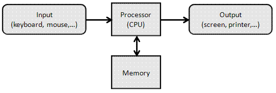<br><sub>Fig 15 -Basic Operations of a Computer - (<a href='http://cs.sru.edu/~mullins/cpsc100book/module02_introduction/module02-04_introduction.html'>Work by Paul Mullins</a>) </sub></div>

<br>

**Source Code**: is the code written by the programmer in a programming language

Ex:

```java
package application;

import java.util.Scanner;
import java.util.Locale;

public class Program {

	public static void main(String[] args) {
		
		Locale.setDefault(Locale.US);
		Scanner sc = new Scanner(System.in);
		
        	double x, y, media;
        
		System.out.print("Enter the First Number: ");
        	x = sc.nextDouble(); //input: 2
        	System.out.print("Enter the Second Number: ");
        	y = sc.nextDouble(); //input: 4
        
        	media = (x + y)/2.0;
        
       		System.out.println("Media = " + media);
        	sc.close();
	}
}

/*
Console

----input---
Enter the First Number: 2.0
Enter the First Number: 4.0

----output---
Media = 3.0
*/
```
<br>

<div align="center">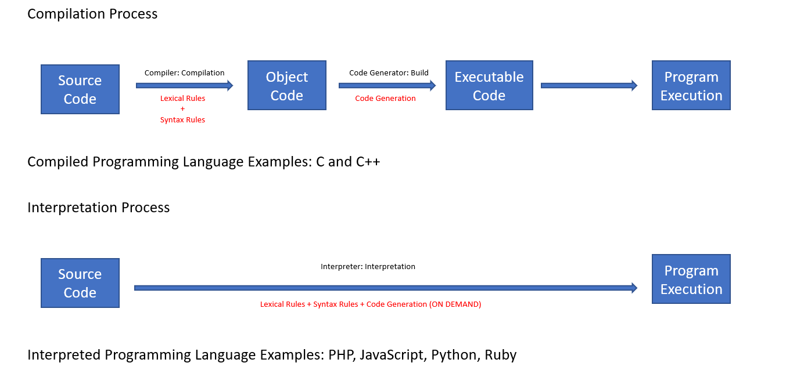<br><sub>Fig 1 - Compilation and Interpretation Process</sub></div>

<br>

<div align="center">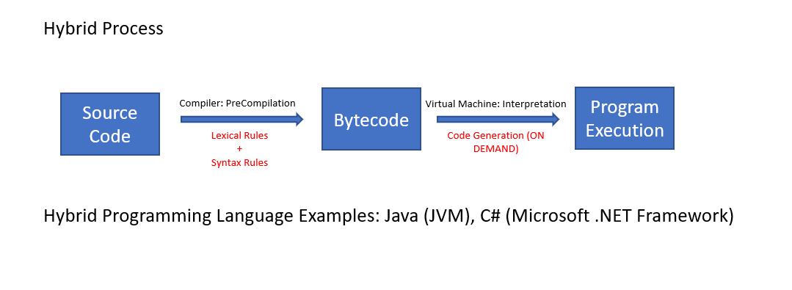<br><sub>Fig 2 - Hybrid Process</sub></div>

<br>

- **Compilation**:
	- Program Speed
	- Compiler Assistance Before Execution
	- Disadvantage: Platform dependence of the generated binary code

- **Interpretation**:
	- Flexibility of Maintaining the Application in Production
	- Expressiveness of Language
	- Source Code does not need to be Recompiled to run on different platform
	- Disadvantage: Execution speed compared to compiled languages.

- **Hybrid**:
	- Compiler Assistance Before Execution
	- Source Code does not need to be Recompiled to run on different platform

#### <a name="chapter1part2.2"></a>Chapter 1 - Part 2.2: The Java Virtual Machine (JVM)

JVM is the Java Virtual Machine to execute Java Programs in your system.

Java take the advantages of compilation and interpretation and create the hybrid interpretation with JVM.

Below, there some of compilation process examples in Java:

<br>

<div align="center">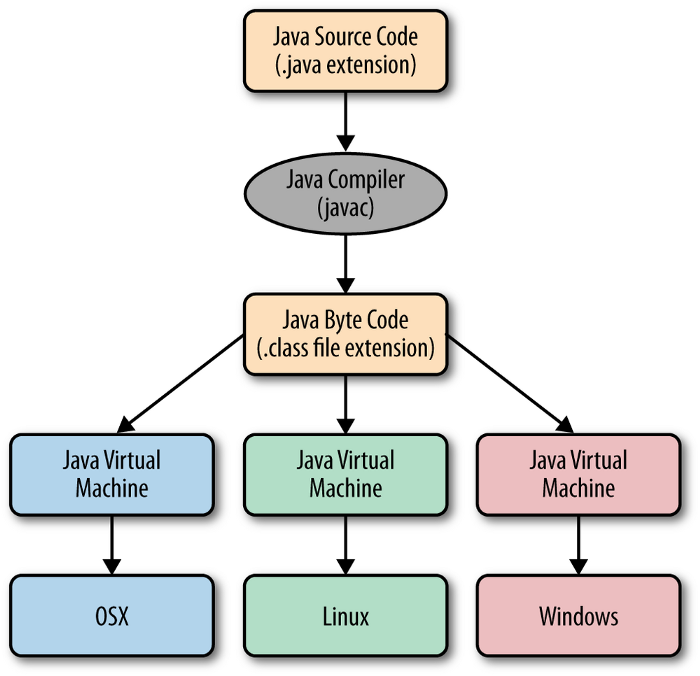<br><sub>Fig 3 - Compilation Process in Java - (<a href='https://medium.com/@PrayagBhakar/lesson-2-behind-the-scenes-4df6a461f31f'>Work by Prayag Bhakar</a>) </sub></div>

<br>

<div align="center">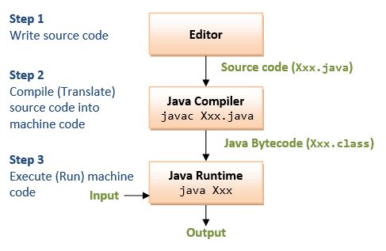<br><sub>Fig 4 - Compilation Process in Java - (<a href='https://www3.ntu.edu.sg/home/ehchua/programming/java/J1a_Introduction.html'>Work by Chua Hock-Chuan</a>) </sub></div>

<br>

<div align="center">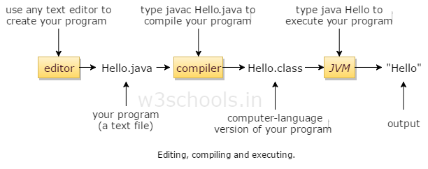<br><sub>Fig 5 - Compilation Process in Java - (<a href='https://www.w3schools.in/java-tutorial/compile-java-file-using-javac/'>Work by  w3schools</a>) </sub></div>

<br>

The process to execute the bytecode is called JIT (Just in Time) Compilation. Is more faster than interpretation because the compiler revise before the run time, if the bytecode is lexical and syntactical correct.

<br>

<div align="center">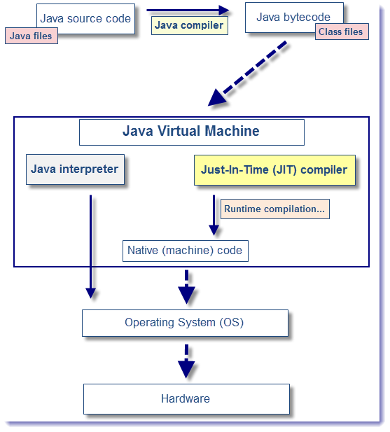<br><sub>Fig 6 - Compilation Process in Java - (<a href='http://javaeesupportpatterns.blogspot.com/2013/07/java-just-in-time-compilation-more-than.html'>Work by javaeesupportpatterns</a>) </sub></div>

<br>

The Java Virtual Machine (JVM) is the heart of the Java platform. It's an abstract computing machine, meaning it's a specification that can be implemented in different ways by different vendors. The JVM's primary role is to execute Java bytecode.

**What is Bytecode?**

When you write Java code, it's saved in .java files. These files are then compiled by the Java compiler (javac) into .class files. These .class files contain bytecode, which is a platform-independent set of instructions that the JVM can understand and execute.

Example:

Let's say you have a simple Java program:

```java
public class Example {
    public static void main(String[] args) {
        int x = 10;
        int y = 5;
        int sum = x + y;
        System.out.println("Sum: " + sum);
    }
}
```

After compiling this code, the Example.class file will contain bytecode instructions that tell the JVM how to perform the addition and print the result. You can inspect the bytecode using the javap command-line tool (part of the JDK): javap -c Example. The output will be assembly-like instructions.

**Key Functions of the JVM**

- **Loading Bytecode**: The JVM loads .class files containing bytecode into memory.
- **Bytecode Verification**: Before executing bytecode, the JVM verifies that it's valid and doesn't violate any security constraints. This helps prevent malicious code from harming the system.
- **Execution**: The JVM executes the bytecode instructions. This can be done through interpretation or just-in-time (JIT) compilation.
- **Just-in-Time (JIT) Compilation**: The JIT compiler is a part of the JVM that translates bytecode into native machine code during runtime. This significantly improves performance because native code executes much faster than interpreted bytecode. The JIT compiler analyzes the bytecode and identifies frequently executed sections (hotspots) to optimize.
- **Memory Management**: The JVM automatically manages memory through garbage collection. It allocates memory for objects and reclaims memory that is no longer in use, preventing memory leaks.

**JVM Implementations**

Different vendors provide their own implementations of the JVM specification. Some popular JVM implementations include:

- **HotSpot**: Developed by Oracle, HotSpot is the most widely used JVM. It's known for its advanced JIT compilation and garbage collection capabilities.
- **OpenJ9**: Developed by Eclipse, OpenJ9 is another high-performance JVM that's designed for cloud environments.
- **GraalVM**: A polyglot VM that supports multiple languages, including Java. GraalVM can also compile Java code ahead-of-time (AOT) for faster startup times.

**Platform Independence**

The JVM is what makes Java platform-independent. Because the bytecode is executed by the JVM, the same Java code can run on any operating system that has a JVM implementation. This "write once, run anywhere" (WORA) capability is a key advantage of Java.

Example:

You can compile your Java code on a Windows machine and then run the resulting .class files on a Linux server, as long as both machines have a compatible JVM installed.

**Hypothetical Scenario**

Imagine a company developing a cross-platform application that needs to run on Windows, macOS, and Linux. By using Java, they can write the application once and deploy it to all three platforms without having to rewrite the code for each operating system. The JVM handles the platform-specific details, allowing the developers to focus on the application logic.

#### <a name="chapter1part2.3"></a>Chapter 1 - Part 2.3: The Java Runtime Environment (JRE)

The Java Runtime Environment (JRE) provides the necessary resources to run Java applications. It includes the JVM, along with libraries and other components needed to execute Java bytecode.

**Components of the JRE**

- **JVM**: As mentioned earlier, the JVM is the core component of the JRE.
- **Java Class Libraries**: The JRE includes a set of standard Java class libraries that provide pre-built functionality for common tasks, such as input/output, networking, and data structures. These libraries are essential for developing Java applications.
- **Other Supporting Files**: The JRE also includes other supporting files, such as configuration files and security policies.

**JRE vs. JVM**

It's important to understand the difference between the JRE and the JVM. The JVM is the abstract specification for executing bytecode, while the JRE is a concrete implementation of that specification, along with the necessary libraries and supporting files. You can think of the JRE as a package that contains the JVM and everything else needed to run Java applications.

Analogy:

Think of the JVM as an engine and the JRE as the entire car. The engine (JVM) is responsible for running the car, but the car (JRE) also includes the wheels, seats, and other components needed to make it functional.

**Using the JRE**

When you want to run a Java application, you need to have the JRE installed on your system. The JRE provides the java command, which you use to launch Java applications.

Example:

To run a Java application named MyApp.class, you would use the following command:

```
java MyApp
```

This command tells the JRE to load the MyApp.class file, start the JVM, and execute the bytecode in the file.

**Real-World Example**

Consider a web server that hosts Java-based web applications. The server needs to have the JRE installed to run these applications. When a user accesses a web page that requires Java code to be executed, the JRE on the server handles the execution of that code.

**Hypothetical Scenario**

A small business uses a Java-based accounting application. Each employee who needs to use the application must have the JRE installed on their computer. The JRE allows them to run the application and access the company's financial data.

#### <a name="chapter1part2.4"></a>Chapter 1 - Part 2.4: The Java Development Kit (JDK)

The Java Development Kit (JDK) is a superset of the JRE. It includes everything in the JRE, plus additional tools and utilities needed for developing Java applications.

**Components of the JDK**

- **JRE**: The JDK includes the complete JRE.
- **Java Compiler (javac)**: The javac compiler translates Java source code (.java files) into bytecode (.class files).
- **Java Debugger (jdb)**: The jdb debugger allows you to debug Java code by stepping through the code, inspecting variables, and setting breakpoints.
- **Java Archive (jar)**: The jar tool allows you to package Java class files and resources into a single archive file (.jar file).
- **Java Documentation Generator (javadoc)**: The javadoc tool generates HTML documentation from Java source code comments.
- **Other Development Tools**: The JDK also includes other development tools, such as jconsole (for monitoring JVM performance) and jprofiler (for profiling Java applications).

**JDK vs. JRE**

The key difference between the JDK and the JRE is that the JDK is for developers, while the JRE is for users who just want to run Java applications. If you want to write, compile, and debug Java code, you need the JDK. If you just want to run Java applications, you only need the JRE.

Analogy:

Think of the JDK as a mechanic's toolkit and the JRE as the car itself. The mechanic (developer) needs the toolkit (JDK) to build and repair cars, while the driver (user) only needs the car (JRE) to drive.

**Using the JDK**

When you install the JDK, you get access to the javac compiler, which you use to compile your Java code.

Example:

To compile the Example.java file, you would use the following command:

```
javac Example.java
```

This command creates the Example.class file containing the bytecode.

**Real-World Example**

A software development company uses the JDK to develop and maintain its Java-based applications. The developers use the javac compiler to compile the code, the jdb debugger to debug the code, and the jar tool to package the applications for deployment.

**Hypothetical Scenario**

A student learning Java needs to install the JDK on their computer to write and run Java programs. The JDK provides the necessary tools for compiling, debugging, and testing their code.

#### <a name="chapter1part2.5"></a>Chapter 1 - Part 2.5: Relationship Between JVM, JRE, and JDK

The JVM, JRE, and JDK are closely related. The JDK includes the JRE, and the JRE includes the JVM.

```
JDK (Java Development Kit)
  |
  +-- JRE (Java Runtime Environment)
      |
      +-- JVM (Java Virtual Machine)
```

- The JDK is the complete development environment for Java applications.
- The JRE is the runtime environment for executing Java applications.
- The JVM is the virtual machine that executes Java bytecode.

#### <a name="chapter1part2.6"></a>Chapter 1 - Part 2.6: Choosing the Right Version

When installing the JDK or JRE, you'll need to choose a version. Oracle releases new versions of Java regularly, and each version may include new features, performance improvements, and security updates. It's generally recommended to use the latest stable version of the JDK or JRE, unless you have a specific reason to use an older version.

**Long-Term Support (LTS) Versions**

Oracle designates certain Java versions as Long-Term Support (LTS) versions. LTS versions receive extended support and security updates, making them a good choice for production environments. As of this writing, Java 11 and Java 17 are LTS versions.

**Considerations**

- **Compatibility**: Make sure that the version of the JDK or JRE you choose is compatible with your applications and libraries.
- **New Features**: Consider whether you need the new features and improvements offered by the latest version.
- **Support**: Choose an LTS version for long-term stability and support.

#### <a name="chapter1part3"></a>Chapter 1 - Part 3: Installing the Java Development Kit (JDK)

Installing the Java Development Kit (JDK) is the first crucial step in your journey to becoming a Java programmer. The JDK provides the necessary tools to compile, run, and debug Java code. Without it, you won't be able to execute the programs you write. This lesson will guide you through the process of downloading and installing the JDK on your system, ensuring you have a solid foundation for the rest of the course.

#### <a name="chapter1part3.1"></a>Chapter 1 - Part 3.1: Understanding the JDK and its Components

The Java JDK come with some of most used packages to help the developer like awt, beans, io, lang, math, net, nio, sql, util and each package have a class or a interface.

<br>

<div align="center">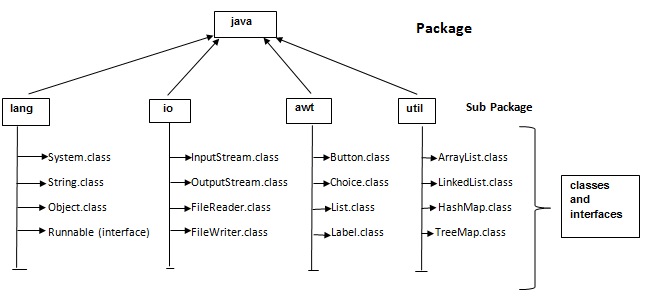<br><sub>Fig 8 -Java Packages - (<a href='http://www.wellnwill.com/tutorial/core-java/package/package'>Work by Well N Will</a>) </sub></div>

<br>

Oracle have a documentation about all his packages: https://docs.oracle.com/javase/8/docs/api/

<br>

<div align="center">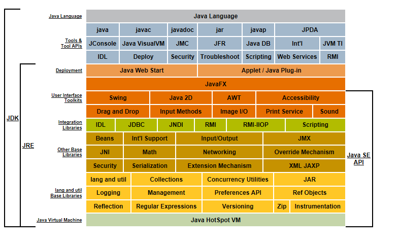<br><sub>Fig 9 -Java Packages - (<a href='https://docs.oracle.com/javase/8/docs/technotes/guides/desc_jdk_structure.html'>Work by Oracle</a>) </sub></div>

<br>

One of the most famous used packages is java.util.collections and java.util.map

<br>

<div align="center">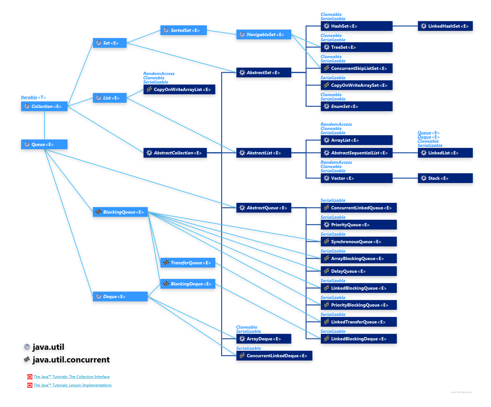<br><sub>Fig 10 -Java Packages - (<a href='https://ukode.es/colecciones-i-introduccion-y-conceptos-basicos/'>Work by Jose Antonio Simón</a>) </sub></div>

<br>

<div align="center">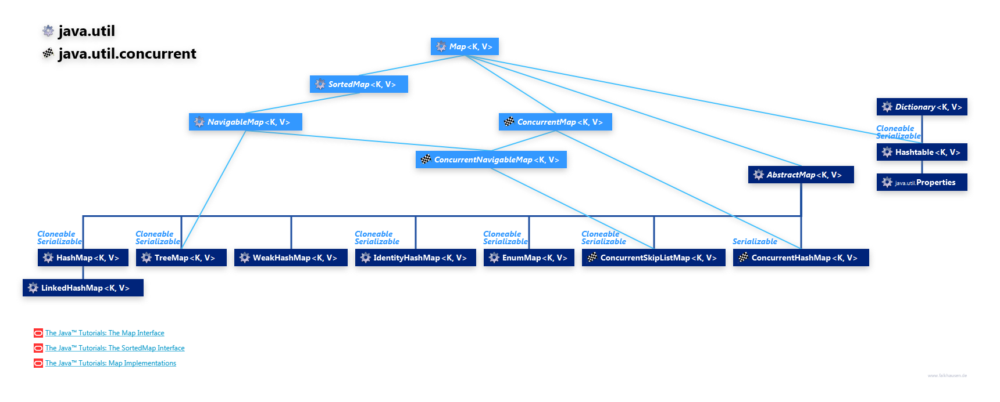<br><sub>Fig 11 -Java Packages - (<a href='https://ukode.es/colecciones-i-introduccion-y-conceptos-basicos/'>Work by Jose Antonio Simón</a>) </sub></div>

<br>

<div align="center">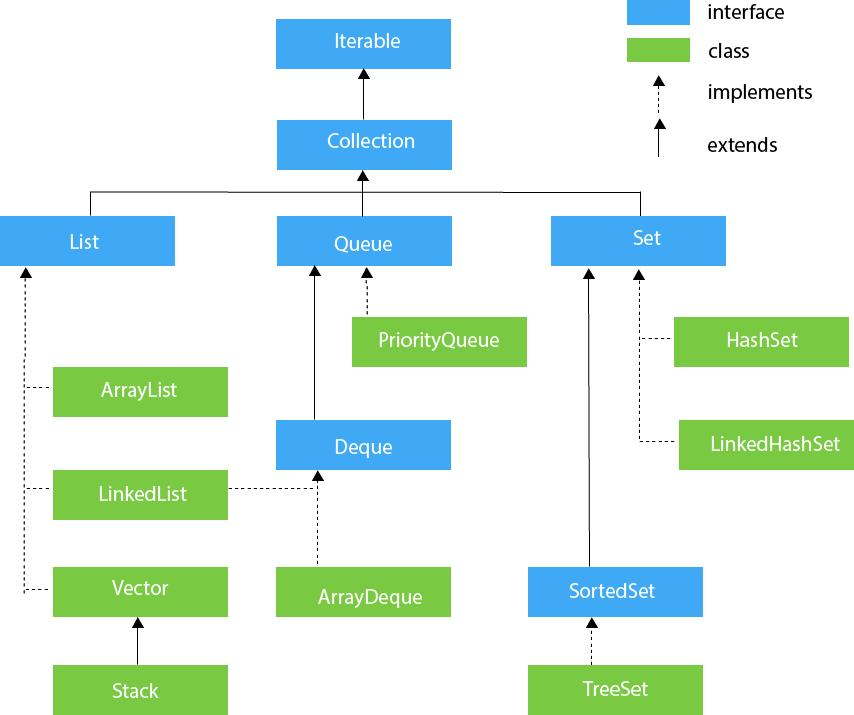<br><sub>Fig 12 -Java Packages - (<a href='https://www.javatpoint.com/collections-in-java'>Work by JavaPoint</a>) </sub></div>

<br>

The Java Development Kit (JDK) is a software development environment used for developing Java applications. It includes the Java Runtime Environment (JRE), compilers, debuggers, and other tools necessary for developing, testing, and running Java programs.

**Key Components of the JDK**

- **Java Runtime Environment (JRE)**: The JRE provides the runtime environment in which Java programs can execute. It includes the Java Virtual Machine (JVM), core classes, and supporting files. You encountered the JRE in the previous lesson when learning about the Java ecosystem.
- **Java Compiler (javac)**: This tool compiles Java source code (.java files) into bytecode (.class files) that can be executed by the JVM.
- **Java Debugger (jdb)**: This tool helps you find and fix errors in your Java code.
- **Java Archive (jar)**: This tool packages Java class files and related resources into a single archive file.
- **Other Tools**: The JDK also includes other useful tools such as javadoc (for generating API documentation) and jps (for listing running Java processes).

**Why is the JDK Necessary?**

The JDK is essential because it provides the tools needed to translate human-readable Java code into machine-executable bytecode. Without the JDK, you can't compile your code, and therefore, you can't run it. The JRE alone is sufficient for running pre-compiled Java applications, but the JDK is required for developing them.

#### <a name="chapter1part3.2"></a>Chapter 1 - Part 3.2: Downloading the JDK

The JDK can be downloaded from several sources, but the most common and recommended source is Oracle. Alternatively, you can use OpenJDK builds from vendors like Adoptium (Eclipse Temurin).

**Downloading from Oracle**

- **Visit the Oracle Website**: Go to the Oracle Java SE Downloads page.
- **Choose the Appropriate Version**: Select the latest Long-Term Support (LTS) version of Java. LTS versions are supported for a longer period, making them a stable choice for development.
- **Select Your Operating System**: Choose the appropriate installer for your operating system (Windows, macOS, or Linux).
- **Download the Installer**: Download the installer file. You may need to create an Oracle account to proceed with the download.

**Downloading from Adoptium (Eclipse Temurin)**

- **Visit the Adoptium Website**: Go to the Adoptium website.
- **Choose the Appropriate Version**: Select the latest LTS version of Java.
- **Select Your Operating System**: Choose the appropriate installer for your operating system (Windows, macOS, or Linux).
- **Download the Installer**: Download the installer file.

#### <a name="chapter1part3.3"></a>Chapter 1 - Part 3.3: Installing the JDK

The installation process varies slightly depending on your operating system.

**Installing on Windows**

- **Run the Installer**: Double-click the downloaded installer file to start the installation process.

- **Follow the Prompts**: Follow the on-screen instructions. You'll typically be prompted to choose an installation directory. The default location is usually fine.

- **Set the JAVA_HOME Environment Variable**:
  - Open the System Properties window (search for "environment variables" in the Start menu).
  - Click "Environment Variables".
  - Under "System variables", click "New".
  - Enter JAVA_HOME as the variable name.
  - Enter the installation directory of the JDK as the variable value (e.g., C:\Program Files\Java\jdk-17).
  - Click "OK" to close all windows.
 
- **Update the Path Environment Variable**:
  - In the System Variables section, find the Path variable and select it, then click "Edit".
  - Click "New" and add %JAVA_HOME%\bin to the list.
  - Click "OK" to close all windows.
 
- **Verify the Installation**: Open a new command prompt window and type java -version. You should see the version information for the installed JDK.

**Installing on macOS**

- **Run the Installer**: Double-click the downloaded .dmg file to mount it.

- **Open the Package**: Double-click the .pkg file to start the installation process.

- **Follow the Prompts**: Follow the on-screen instructions. The JDK will typically be installed in /Library/Java/JavaVirtualMachines/.

- **Set the JAVA_HOME Environment Variable (Optional)**: While macOS doesn't strictly require setting JAVA_HOME, some tools might rely on it. You can set it in your .bash_profile or .zshrc file:
  - Open Terminal.
  - Type nano ~/.zshrc (or nano ~/.bash_profile if you're using Bash).
  - Add the following lines:

```
export JAVA_HOME=$(/usr/libexec/java_home)
export PATH=$JAVA_HOME/bin:$PATH
```

  - Press Ctrl+X, then Y, then Enter to save and exit.
  - Type source ~/.zshrc (or source ~/.bash_profile) to apply the changes.

- **Verify the Installation**: Open a new Terminal window and type java -version. You should see the version information for the installed JDK.

**Installing on Linux**

The installation process on Linux varies depending on the distribution. Here are instructions for Debian/Ubuntu and Fedora/CentOS.

**Debian/Ubuntu**

- **Download the .deb Package**: Download the .deb package for your architecture.

- **Install the Package**: Open a terminal and navigate to the directory where you downloaded the package. Then, run the following command:

```
sudo apt install ./<package_name>.deb
```

Replace <package_name>.deb with the actual name of the downloaded file.

- **Set the JAVA_HOME Environment Variable**:
  - Open the /etc/environment file with root privileges:
 
```
sudo nano /etc/environment
```

  - Add the following line, replacing /usr/lib/jvm/java-17-openjdk-amd64 with the actual path to your JDK installation:

```
JAVA_HOME="/usr/lib/jvm/java-17-openjdk-amd64"
```

  - Save the file and exit.
  - Apply the changes by running:

```
source /etc/environment
```

- **Update the Path Environment Variable**:

  - Edit the ~/.bashrc or ~/.zshrc file:
 
```
nano ~/.bashrc
```

  - Add the following lines:

```
export PATH="$JAVA_HOME/bin:$PATH"
```

- Save the file and exit.
- Apply the changes by running:

```
source ~/.bashrc
```

- **Verify the Installation**: Open a new terminal window and type java -version. You should see the version information for the installed JDK.

**Fedora/CentOS**

- **Download the .rpm Package**: Download the .rpm package for your architecture.

- **Install the Package**: Open a terminal and navigate to the directory where you downloaded the package. Then, run the following command:

```
sudo rpm -i <package_name>.rpm
```

Replace <package_name>.rpm with the actual name of the downloaded file.

- **Set the JAVA_HOME Environment Variable**:
  
  - Open the /etc/environment file with root privileges:
 
```
sudo nano /etc/environment
```

  - Add the following line, replacing /usr/lib/jvm/java-17-openjdk-amd64 with the actual path to your JDK installation:

```
JAVA_HOME="/usr/lib/jvm/java-17-openjdk-amd64"
```

- Save the file and exit.
- Apply the changes by running:

```
source /etc/environment
```

- **Update the Path Environment Variable**:
  - Edit the ~/.bashrc or ~/.zshrc file:
 
```
nano ~/.bashrc
```

  - Add the following lines:

```
export PATH="$JAVA_HOME/bin:$PATH"
```

- Save the file and exit.
- Apply the changes by running:

```
source ~/.bashrc
```

- **Verify the Installation**: Open a new terminal window and type java -version. You should see the version information for the installed JDK.

#### <a name="chapter1part3.4"></a>Chapter 1 - Part 3.4: Setting Environment Variables

Setting environment variables is a crucial step in the installation process. These variables tell your operating system where to find the Java executables.

**Why are Environment Variables Important?**

Environment variables allow you to run Java commands from any directory in your terminal or command prompt. Without them, you would have to navigate to the JDK's bin directory every time you want to compile or run a Java program.

```**JAVA_HOME**```

The JAVA_HOME variable points to the installation directory of the JDK. This variable is used by many Java-based tools and applications to locate the JDK.

```**Path**```

The Path variable is a list of directories that the operating system searches when you execute a command. By adding the JDK's bin directory to the Path, you can run Java commands like java and javac from any directory.

#### <a name="chapter1part3.5"></a>Chapter 1 - Part 3.5: Verifying the Installation

After installing the JDK and setting the environment variables, it's important to verify that the installation was successful.

**Using the Command Line**

Open a new command prompt or terminal window and type the following command:

```
java -version
```

If the JDK is installed correctly, you should see output similar to the following:

```
java 17.0.2 2022-01-18 LTS
Java(TM) SE Runtime Environment (build 17.0.2+8-LTS-86)
Java HotSpot(TM) 64-Bit Server VM (build 17.0.2+8-LTS-86, mixed mode, sharing)
```

This output confirms that the Java runtime environment is installed and accessible.

Next, type the following command:

```
javac -version
```

If the JDK is installed correctly, you should see output similar to the following:

```
javac 17.0.2
```

This output confirms that the Java compiler is installed and accessible.

If you don't see this output, double-check that you have set the JAVA_HOME and Path environment variables correctly and that you have opened a new command prompt or terminal window after setting them.

#### <a name="chapter1part3.6"></a>Chapter 1 - Part 3.6: Troubleshooting Common Installation Issues

Even with careful instructions, installation issues can arise. Here are some common problems and their solutions:

**```java``` or ```javac``` Command Not Found**

This usually indicates that the Path environment variable is not set correctly. Double-check that you have added the JDK's bin directory to the Path and that you have opened a new command prompt or terminal window.

**Incorrect Java Version**

If you have multiple versions of Java installed on your system, the java -version command might show the wrong version. Ensure that the JAVA_HOME variable points to the correct JDK installation directory.

**Installation Errors**

If you encounter errors during the installation process, consult the JDK documentation or search online for solutions specific to your operating system and the error message you received.

#### <a name="chapter1part4"></a>Chapter 1 - Part 4: Setting Up a Java Development Environment (IDE): IntelliJ IDEA or Eclipse

Setting up a Java Development Environment (IDE) is a crucial step for any aspiring Java programmer. An IDE provides a comprehensive suite of tools that streamline the coding process, making it easier to write, debug, and run Java applications. This lesson will guide you through the process of setting up two popular IDEs: IntelliJ IDEA and Eclipse. We'll explore their key features, installation procedures, and basic configurations to get you ready to write your first Java programs.

#### <a name="chapter1part4.1"></a>Chapter 1 - Part 4.1: Understanding Integrated Development Environments (IDEs)

An Integrated Development Environment (IDE) is a software application that provides comprehensive facilities to computer programmers for software development. An IDE normally consists of at least a source code editor, build automation tools, and a debugger.

**Key Features of an IDE**

- **Source Code Editor**: A text editor designed specifically for writing and editing code, with features like syntax highlighting, code completion, and code formatting.
- **Build Automation Tools**: Tools that automate the process of compiling, linking, and packaging code into executable programs.
- **Debugger**: A tool that allows developers to step through code, inspect variables, and identify and fix errors.
- **Compiler**: Translates human-readable code into machine-executable code.
- **Interpreter**: Executes code line by line.
- **Version Control Integration**: Integration with version control systems like Git, allowing developers to track changes to their code and collaborate with others.
- **Testing Tools**: Tools for writing and running unit tests and integration tests.
- **Refactoring Tools**: Tools for restructuring code without changing its behavior, making it easier to maintain and improve.

**Why Use an IDE?**

Using an IDE offers several advantages over using a simple text editor and command-line tools:

- **Increased Productivity**: IDEs automate many common tasks, such as compiling code, running tests, and debugging, which can save developers a significant amount of time.
- **Improved Code Quality**: IDEs provide features like syntax highlighting, code completion, and code formatting, which can help developers write cleaner, more readable code.
- **Easier Debugging**: IDEs provide powerful debugging tools that allow developers to step through code, inspect variables, and identify and fix errors more easily.
- **Better Collaboration**: IDEs integrate with version control systems, making it easier for developers to collaborate on projects.

#### <a name="chapter1part4.2"></a>Chapter 1 - Part 4.2: IntelliJ IDEA

IntelliJ IDEA is a popular Java IDE known for its intelligent code assistance, comprehensive feature set, and user-friendly interface. It is developed by JetBrains and is available in two editions: Community (free and open-source) and Ultimate (commercial). For beginners, the Community Edition is sufficient.

**Installing IntelliJ IDEA**

- **Download IntelliJ IDEA**: Go to the JetBrains website (https://www.jetbrains.com/idea/download/) and download the Community Edition for your operating system (Windows, macOS, or Linux).

- **Run the Installer**: Once the download is complete, run the installer and follow the on-screen instructions.

- **Installation Options**: During the installation process, you may be prompted to configure some options, such as:
  - **Installation Location**: Choose the directory where you want to install IntelliJ IDEA.
  - **Create Desktop Shortcut**: Create a shortcut on your desktop for easy access to IntelliJ IDEA.
  - **Update PATH variable (restart needed)**: Add IntelliJ IDEA's bin folder to your system's PATH variable, allowing you to run IntelliJ IDEA from the command line.
  - **Associate .java**: Associate .java files with IntelliJ IDEA, so that double-clicking a .java file will open it in IntelliJ IDEA.
 
- **Complete the Installation**: Once you have configured the options, click "Install" to begin the installation process.

- **Run IntelliJ IDEA**: After the installation is complete, you can run IntelliJ IDEA from the Start menu (Windows) or the Applications folder (macOS).

**Configuring IntelliJ IDEA**

- **Import Settings (Optional)**: If you have used IntelliJ IDEA before, you can import your settings from a previous installation. Otherwise, choose "Do not import settings."
- **UI Theme**: Choose a UI theme (e.g., Light or Dark).
- **Featured Plugins**: IntelliJ IDEA suggests installing some featured plugins. You can install them now or later.
- **Start Using IntelliJ IDEA**: Click "Start using IntelliJ IDEA" to open the IDE.

**Creating a New Java Project in IntelliJ IDEA**

- **Open IntelliJ IDEA**: Launch IntelliJ IDEA.
- **Create New Project**: On the Welcome screen, click "New Project."
- **Choose Project Type**: In the "New Project" dialog, select "Java" from the left-hand menu.
- **Project SDK**: Ensure that the Project SDK is set to the JDK you installed in the previous lesson. If it's not, click "Install JDK" or select the correct JDK from the dropdown menu.
- **Project Template**: You can choose a template or create an empty project. For a simple project, select "Create project from template" and choose "Command Line App".
- **Project Name and Location**: Enter a name for your project (e.g., "HelloWorld") and choose a location to save the project files.
- **Finish**: Click "Finish" to create the project.

**IntelliJ IDEA Interface Overview**

- **Project Tool Window**: Displays the project structure, including source files, libraries, and other resources.
- **Editor Window**: Where you write and edit your code.
- **Navigation Bar**: Located at the top of the editor window, it shows the current file path and allows you to navigate to other files.
- **Run/Debug Tool Window**: Displays the output of your program and allows you to debug your code.
- **Terminal Tool Window**: Provides a command-line interface for running commands and scripts.

#### <a name="chapter1part4.3"></a>Chapter 1 - Part 4.3: Eclipse

Eclipse is another popular open-source IDE widely used for Java development. It's known for its flexibility, extensive plugin ecosystem, and strong community support.

**Installing Eclipse**

- **Download Eclipse**: Go to the Eclipse website (https://www.eclipse.org/downloads/) and download the Eclipse IDE for Java Developers for your operating system.
- **Run the Installer**: Run the installer and follow the on-screen instructions.
- **Choose Installation Folder**: Select the directory where you want to install Eclipse.
- **Launch Eclipse**: Once the installation is complete, you can launch Eclipse from the Start menu (Windows) or the Applications folder (macOS).

**Configuring Eclipse**

- **Workspace**: When you first launch Eclipse, you will be prompted to choose a workspace. A workspace is a directory where Eclipse stores your project files and settings. Choose a location for your workspace and click "Launch."
- **Welcome Screen**: The Eclipse Welcome screen provides links to tutorials, documentation, and other resources. You can close the Welcome screen to start using Eclipse.

**Creating a New Java Project in Eclipse**

- **Open Eclipse**: Launch Eclipse.
- **Create New Project**: Go to File > New > Java Project.
- **Project Name**: Enter a name for your project (e.g., "HelloWorld").
- **Use default location**: You can either use the default location or specify a custom location for your project.
- **JRE**: Ensure that the JRE is set to the JDK you installed in the previous lesson. If it's not, click "Configure JREs" and add the correct JDK.
- **Layout**: Keep the default project layout.
- **Finish**: Click "Finish" to create the project.

**Eclipse Interface Overview**

- **Package Explorer**: Displays the project structure, including source files, libraries, and other resources.
- **Editor Area**: Where you write and edit your code.
- **Outline View**: Displays the structure of the current file, including classes, methods, and fields.
- **Console View**: Displays the output of your program.
- **Problems View**: Displays errors and warnings in your code.

#### <a name="chapter1part5"></a>Chapter 1 - Part 5: Writing and Running Your First Java Program: "Hello, World!"

Let's embark on the journey of writing and running your very first Java program. This is a pivotal step in becoming a Java programmer. We'll create the classic "Hello, World!" program, which serves as a fundamental introduction to the structure and execution of Java code. This exercise will solidify your understanding of the Java Development Kit (JDK) and the Integrated Development Environment (IDE) you set up in the previous lessons. By the end of this lesson, you'll have a tangible result – a working Java program – and a foundational understanding of how to build upon it.

#### <a name="chapter1part5.1"></a>Chapter 1 - Part 5.1: Creating Your First Java Program: "Hello, World!"

The "Hello, World!" program is a time-honored tradition in programming. It's a simple program that displays the text "Hello, World!" on the console. Creating this program in Java involves a few key steps: writing the code, saving the file, compiling the code, and running the compiled code.

**Step 1: Writing the Code**

Open your chosen IDE (IntelliJ IDEA or Eclipse). Create a new Java file. The name of the file should match the name of the class you'll define within it, and it should end with the .java extension. For this example, let's name the file HelloWorld.java.

Now, enter the following code into the HelloWorld.java file:

```java
public class HelloWorld { // Declares a class named HelloWorld
    public static void main(String[] args) { // Declares the main method
        System.out.println("Hello, World!"); // Prints "Hello, World!" to the console
    }
}
```

Let's break down this code:

- ```**public class HelloWorld { ... }**```: This line declares a class named HelloWorld. In Java, everything resides within a class. The public keyword means that this class can be accessed from anywhere in your program. Classes are the fundamental building blocks of Java programs, and we'll delve deeper into them in Module 5.

- ```**public static void main(String[] args) { ... }**```: This is the main method. It's the entry point of your program – the code that the Java Virtual Machine (JVM) executes first.
  - ```**public**```: Similar to the class, public means this method can be accessed from anywhere.
  - ```**static**```: This keyword means that the method belongs to the HelloWorld class itself, rather than to an instance of the HelloWorld class. We'll explore static methods in more detail in Module 6.
  - ```**void**```: This indicates that the method doesn't return any value. Methods can perform actions and optionally return a result.
  - ```**main(String[] args)**```: This is the name of the method (main) and its parameters. String[] args is an array of strings that can be used to pass arguments to the program from the command line. We won't use command-line arguments in this simple program, but they can be useful for more complex applications.
 
- ```**System.out.println("Hello, World!");**```: This line is the heart of the program. It prints the text "Hello, World!" to the console.
  - ```**System.out**```: This is a standard output stream in Java. It represents the console (your terminal or command prompt).
  - ```**println()**```: This is a method of the System.out object that prints a line of text to the console. The text to be printed is enclosed in double quotes " ".
 
**Step 2: Saving the File**

Save the file as HelloWorld.java in a directory of your choice. Make sure the file name matches the class name exactly (including capitalization).

**Step 3: Compiling the Code**

Before you can run the program, you need to compile it. Compilation is the process of translating the human-readable Java code into bytecode, which the JVM can understand and execute.

- **Using IntelliJ IDEA**: IntelliJ IDEA usually compiles your code automatically as you type. However, you can also manually compile the code by going to Build > Build Project.
- **Using Eclipse**: Eclipse also typically compiles your code automatically. If not, you can compile it by going to Project > Build Project.

If the compilation is successful, you won't see any error messages. If there are errors, the IDE will highlight them and provide descriptions to help you fix them. Common errors include typos, missing semicolons, and incorrect syntax.

**Step 4: Running the Code**

Once the code is compiled successfully, you can run it.

- **Using IntelliJ IDEA**: Right-click in the code editor and select Run 'HelloWorld.main()'. Alternatively, you can click the green "play" button in the gutter next to the main method declaration.
- **Using Eclipse**: Right-click in the code editor and select Run As > Java Application.

If everything is set up correctly, you should see the text "Hello, World!" printed on the console in your IDE.

#### <a name="chapter1part5.2"></a>Chapter 1 - Part 5.2: Understanding the Compilation Process

The compilation process is a crucial step in Java development. When you compile a Java program, the Java compiler (javac) takes your .java file as input and produces a .class file. This .class file contains the bytecode representation of your program. Bytecode is a platform-independent intermediate language that the JVM can execute.

The JVM then interprets or compiles this bytecode into machine code that is specific to the underlying operating system and hardware. This is what makes Java platform-independent – the same bytecode can run on any system that has a JVM.

#### <a name="chapter1part5.3"></a>Chapter 1 - Part 5.3: Common Errors and Troubleshooting

| Compile-time                                                                                                              | Runtime                                                                                                                              | 
| :------------------------------------------------------------------------------------------------------------------------ | :-----------------------------------------------------------------------------------------------------------------------------------:|
| The compile-time errors are the errors which are produced at the compile-time, and they are detected by the compiler.     | The runtime errors are the errors which are not generated by the compiler and produce an unpredictable result at the execution time. |
| In this case, the compiler prevents the code from execution if it detects an error in the program.]                       | In this case, the compiler does not detect the error, so it cannot prevent the code from the execution.                              |
| It contains the syntax and semantic errors such as missing semicolon at the end of the statement.                         | It contains the errors such as division by zero, determining the square root of a negative number.                                   |

Even with a simple program like "Hello, World!", you might encounter errors. Here are some common errors and how to fix them:

- ```**ClassNotFoundException**```: This error usually means that the JVM can't find the .class file for your program. Make sure that the file is in the correct directory and that the class name matches the file name. Also, ensure that the code has been compiled.
- ```**NoSuchMethodError**```: main: This error indicates that the JVM can't find the main method in your class. Double-check that the main method is declared exactly as public static void main(String[] args).
- ```**Syntax errors**```: These errors are usually caused by typos, missing semicolons, or incorrect syntax. The IDE will typically highlight these errors and provide descriptions to help you fix them. Pay close attention to the error messages and carefully review your code.

#### <a name="chapter1part6"></a>Chapter 1 - Part 6: Understanding Basic Java Program Structure

Understanding the basic structure of a Java program is crucial for writing any Java code. It's like learning the alphabet before writing sentences. This lesson will break down the essential components of a Java program, explaining each part in detail and providing examples to illustrate how they work together. By the end of this lesson, you'll be able to read, understand, and write simple Java programs with confidence, setting a solid foundation for more advanced topics.

Java is an object-oriented language and your base unit is the class.  Every Code in Java have to be in a class.

The classes is organize in packages and the packages is organize in modules. A Java application is a set of modules with packages.

Bellow, there is a example of a Java application:

<br>

<div align="center">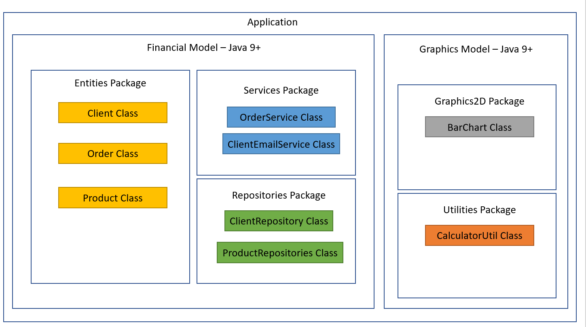<br><sub>Fig 7 - Application Structure in Java Application </sub></div>

<br>

#### <a name="chapter1part6.1"></a>Chapter 1 - Part 6.1: Anatomy of a Java Program

Every Java program has a specific structure that the Java compiler expects. Understanding this structure is essential for writing code that compiles and runs correctly. The basic structure consists of the following key elements:

- **Class Declaration**: This is the foundation of any Java program. Everything in Java resides inside a class.
- **main Method**: This is the entry point of your program. When you run a Java program, the Java Virtual Machine (JVM) starts executing code from the main method.
- **Statements**: These are the instructions that the program executes. They perform actions such as calculations, printing output, or making decisions.
- **Comments**: These are explanatory notes that you can add to your code to make it more readable. They are ignored by the compiler.

Let's examine each of these elements in detail.

**Class Declaration**

In Java, everything is an object, and every piece of code must reside inside a class. A class is a blueprint for creating objects. The basic syntax for declaring a class is:

```java
public class ClassName {
    // Class body (fields and methods)
}
```

- ```**public**```: This is an access modifier that determines the visibility of the class. public means that the class can be accessed from anywhere. We'll delve deeper into access modifiers in a later module.
- ```**class**```: This keyword is used to declare a class.
- ```**ClassName**```: This is the name of the class. Class names should start with an uppercase letter and follow the camel case naming convention (e.g., MyFirstClass, StudentDetails).
- ```**{}**```: The curly braces enclose the body of the class, which contains fields (variables) and methods (functions).

**Example**

```java
public class MyFirstProgram {
    // Class body will go here
}
```

In this example, we've declared a class named MyFirstProgram. Currently, the class body is empty, but we'll add more to it in the following sections.

**The main Method**

The main method is the entry point of any Java program. It's where the execution begins. Every standalone Java program must have a main method. The syntax for the main method is:

```java
public static void main(String[] args) {
    // Statements to be executed
}
```

Let's break down each part of this declaration:

- ```**public**```: As with the class declaration, public means that the main method can be accessed from anywhere.
- ```**static**```: This keyword means that the main method belongs to the class itself, rather than to an instance of the class. This allows the JVM to call the main method without creating an object of the class. We'll discuss static in more detail in Module 6.
- ```**void**```: This indicates that the main method does not return any value.
- ```**main**```: This is the name of the method. It's a special name that the JVM recognizes as the entry point of the program.
- ```**String[] args**```: This is the parameter list of the main method. It's an array of strings that can be used to pass command-line arguments to the program. We'll cover arrays in Module 4. For now, you can think of it as a way to provide input to your program when you run it from the command line.

**Example:**

```java
public class MyFirstProgram {
    public static void main(String[] args) {
        // Statements to be executed
    }
}
```

In this example, we've added the main method to our MyFirstProgram class. Now, we can add statements inside the main method to make our program do something.

**Statements**

Statements are the instructions that the program executes. They can be simple assignments, calculations, method calls, or control flow statements (which we'll cover in Module 3). Every statement in Java must end with a semicolon (;).

**Example:**

```java
public class MyFirstProgram {
    public static void main(String[] args) {
        System.out.println("Hello, World!"); // This is a statement
    }
}
```

In this example, we've added a statement that prints the text "Hello, World!" to the console.

- ```**System.out.println()**```: This is a method call that prints a line of text to the console. System.out is an object that represents the standard output stream (usually the console), and println() is a method of that object. We'll discuss methods in detail in Module 6.
- ```**"Hello, World!"**```: This is a string literal, which is a sequence of characters enclosed in double quotes.

**Comments**

Comments are explanatory notes that you can add to your code to make it more readable. They are ignored by the compiler. Java supports two types of comments:

- **Single-line comments**: These start with // and continue until the end of the line.
- **Multi-line comments**: These start with /* and end with */. They can span multiple lines.

**Example**:

```java
public class MyFirstProgram {
    public static void main(String[] args) {
        // This is a single-line comment
        /*
         * This is a multi-line comment.
         * It can span multiple lines.
         */
        System.out.println("Hello, World!"); // This statement prints "Hello, World!" to the console
    }
}
```

Comments are extremely useful for explaining what your code does, especially when it's complex. They can also be used to temporarily disable code by "commenting it out."

#### <a name="chapter1part6.2"></a>Chapter 1 - Part 6.2: Putting It All Together: A Complete Java Program

Let's combine all the elements we've discussed to create a complete Java program that calculates the sum of two numbers and prints the result to the console.

```java
public class SumCalculator { // Class declaration
    public static void main(String[] args) { // Main method
        int num1 = 10; // Declare and initialize the first number
        int num2 = 20; // Declare and initialize the second number
        int sum = num1 + num2; // Calculate the sum
        System.out.println("The sum of " + num1 + " and " + num2 + " is: " + sum); // Print the result
    }
}
```

In this program:

- We declare a class named SumCalculator.
- We define the main method, which is the entry point of the program.
- Inside the main method, we declare two integer variables, num1 and num2, and initialize them with the values 10 and 20, respectively. We'll learn more about variables and data types in Module 2.
- We calculate the sum of num1 and num2 and store the result in a variable named sum.
- We print the result to the console using System.out.println(). The + operator is used to concatenate strings and variables.

#### <a name="chapter1part6.3"></a>Chapter 1 - Part 6.3: Common Errors and How to Avoid Them

When you're starting out with Java, it's common to make mistakes. Here are some common errors related to program structure and how to avoid them:

- **Missing semicolon**: Every statement in Java must end with a semicolon. Forgetting the semicolon is a very common error.
  - **Example**: int x = 10 (missing semicolon)
  - **Solution**: int x = 10;
 
- **Incorrect class name**: The class name must match the name of the file (with the .java extension). For example, if your class is named MyClass, the file must be named MyClass.java.
  - **Example**: Class name is MyClass, but the file is named Myclass.java.
  - **Solution**: Ensure the class name and file name match exactly, including capitalization.
 
- **Missing main method**: If your program doesn't have a main method with the correct signature (public static void main(String[] args)), the JVM won't be able to find the entry point of your program.

  - **Example**: public void main(String[] args) (missing static)
  - **Solution**: Double-check the signature of the main method to make sure it's exactly public static void main(String[] args).
 
- **Mismatched curly braces**: Every opening curly brace ({) must have a corresponding closing curly brace (}). Mismatched curly braces can lead to syntax errors that are difficult to debug.

**Example:**

```java
public class MyClass {
    public static void main(String[] args) {
        System.out.println("Hello");
    // Missing closing curly brace for the main method
} // Closing curly brace for the class
```

- **Solution**: Use an IDE like IntelliJ IDEA or Eclipse, which can automatically match curly braces and highlight errors.

## <a name="chapter2"></a>Chapter 2: Java Fundamentals: Data Types, Variables, and Operators

#### <a name="chapter2part1"></a>Chapter 2 - Part 1: Understanding Primitive Data Types: int, double, boolean, char

Primitive data types are the fundamental building blocks for representing data in Java. Understanding them is crucial because they dictate the kind of values a variable can hold and the operations that can be performed on it. This lesson will provide a comprehensive overview of four essential primitive data types: int, double, boolean, and char. We'll explore their characteristics, how to declare and use them, and their significance in Java programming.

#### <a name="chapter2part1.1"></a>Chapter 2 - Part 1.1: Data Types in Java

In Java, we have the 8 primitive data types. Other types are Non-primitive like the diagram below:

<br>

<div align="center">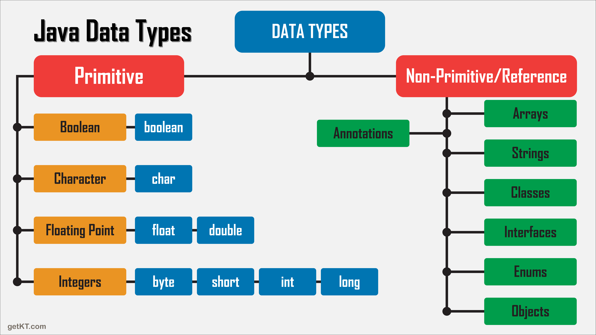<br><sub>Fig 13 -Java Data Types - (<a href='https://getkt.com/blog/reintroduction-to-java-data-types/'>Work by neotam</a>) </sub></div>

<br>

<div align="center">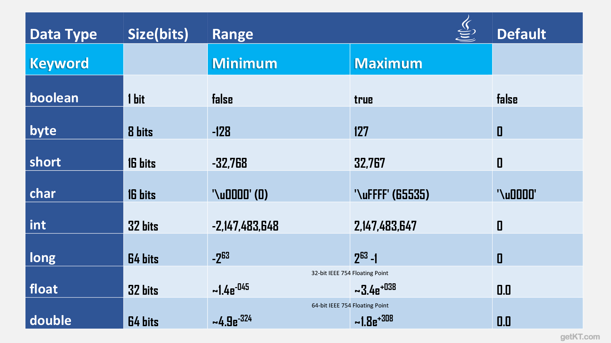<br><sub>Fig 14 -Java Data Primitive Types - (<a href='https://getkt.com/blog/reintroduction-to-java-data-types/'>Work by neotam</a>) </sub></div>

<br>

The size of a data (bits) is the number of the values this variable can store: The byte type can store 8 bits. Each bit store 1 or 0.

So: 2x2x2x2x2x2x2x2x2 = 2^8 = 256 possible values (-128 to 127)


To see the range of max and min of a type of variable do:

```java
int myMinIntValue = Integer.MIN_VALUE;
int myMaxIntValue = Integer.MAX_VALUE;
System.out.println("Integer Minimum Value = " + myMinIntValue);
System.out.println("Integer Maximum Value = " + myMaxIntValue);

int myMaxIntTest = 2_147_483_647; // another form to express

byte myMinByteValue = Byte.MIN_VALUE;
byte myMaxByteValue = Byte.MAX_VALUE;
System.out.println("Byte Minimum Value = " + myMinByteValue);
System.out.println("Byte Maximum Value = " + myMaxByteValue);

short myMinShortValue = Short.MIN_VALUE;
short myMaxShortValue = Short.MAX_VALUE;
System.out.println("Short Minimum Value = " + myMinShortValue);
System.out.println("Short Maximum Value = " + myMaxShortValue);
        
long myLongValue = 100; // Wrong -> Use L
long myMinLongValue = Long.MIN_VALUE;
long myMaxLongValue = Long.MAX_VALUE;
System.out.println("Long Minimum Value = " + myMinLongValue);
System.out.println("Long Maximum Value = " + myMaxLongValue);
long bigLongLiteralValue = 2_147_483_647_234L;
System.out.println(bigLongLiteralValue);

short bigShortLiteralValue = 32767;

/*

Output

Integer Minimum Value = -2147483648
Integer Maximum Value = 2147483647
Byte Minimum Value = -128
Byte Maximum Value = 127
Short Minimum Value = -32768
Short Maximum Value = 32767
Long Minimum Value = -9223372036854775808
Long Maximum Value = 9223372036854775807
2147483647234
*/
```

If you try to add a value in a Maximun or Minimun Value, will occur a overflow in a Maximun and underflow in Minimun. The Computer will convert the maximun to minimun and vice-versa

```java
int myMinIntValue = Integer.MIN_VALUE;
int myMaxIntValue = Integer.MAX_VALUE;
System.out.println("Integer Minimum Value = " + myMinIntValue);
System.out.println("Integer Maximum Value = " + myMaxIntValue);
System.out.println("Busted MAX value = " + (myMaxIntValue + 1)); // overflow
System.out.println("Busted MIN value = " + (myMinIntValue - 1)); // underflow

/*
Output

Integer Minimum Value = -2147483648
Integer Maximum Value = 2147483647
Busted MAX value = -2147483648
Busted MIN value = 2147483647
*/
```


Wrapper types(Reference Types) provided by java for corresponding Primitive Types

| Primitive Types  | Wrapper types(Reference Types) |
| :--------------: | :-----------------------------:|
| boolean          | Boolean                        | 
| byte             | Byte                           |
| character        | Character                      |
| short            | Short                          |
| int              | Int                            | 
| long             | Long                           |
| float            | Float                          |
| double           | double                         |

**Variables Name -> Camel Case** Ex: myVariable

**Class Name -> Pascal Case** Ex: MyClass


#### <a name="chapter2part1.2"></a>Chapter 2 - Part 1.2: Integer Data Type: int

The int data type is used to store whole numbers (integers) without any fractional part. It's one of the most commonly used data types in Java.

**Characteristics of int**

- **Size**: int occupies 4 bytes (32 bits) of memory.
- **Range**: The range of values that an int can hold is from -2,147,483,648 (-231) to 2,147,483,647 (231 - 1).
- **Usage**: Suitable for representing counts, indices, quantities, and other whole number values.

**Declaring and Initializing int Variables**

To declare an int variable, you use the int keyword followed by the variable name. To initialize it, you assign a value to it using the assignment operator =.

```java
int age; // Declaration
age = 30; // Initialization

int count = 100; // Declaration and initialization in one line
```

**Examples of int Usage**

```java
int numberOfStudents = 25;
int temperature = 72;
int score = 1000;
int negativeNumber = -5;
```

**int Operations**

You can perform various arithmetic operations on int variables, such as addition, subtraction, multiplication, and division.

```java
int x = 10;
int y = 5;

int sum = x + y; // sum is 15
int difference = x - y; // difference is 5
int product = x * y; // product is 50
int quotient = x / y; // quotient is 2
int remainder = x % y; // remainder is 0
```

**When to Use int**

Use int when you need to represent whole numbers within the specified range and when you don't need to store fractional parts. For example, representing the number of items in a shopping cart, the age of a person, or the score in a game.

#### <a name="chapter2part1.3"></a>Chapter 2 - Part 1.3: Floating-Point Data Type: double

The double data type is used to store floating-point numbers, which are numbers with a fractional part (decimal numbers).

**Characteristics of double**

**Size**: double occupies 8 bytes (64 bits) of memory.
**Range**: double can represent a wide range of values, both positive and negative, including very large and very small numbers. It uses the IEEE 754 standard for representing floating-point numbers.
**Precision**: double provides approximately 15-17 decimal digits of precision.
**Usage**: Suitable for representing measurements, scientific calculations, financial values, and other values that require fractional precision.

**Declaring and Initializing double Variables**

To declare a double variable, you use the double keyword followed by the variable name. To initialize it, you assign a floating-point value to it.

```java
double price; // Declaration
price = 19.99; // Initialization

double temperature = 98.6; // Declaration and initialization in one line
```

**Examples of double Usage**

```java
double pi = 3.14159;
double gravity = 9.81;
double bankBalance = 1234.56;
double percentage = 0.75;
```

**double Operations**

You can perform arithmetic operations on double variables, similar to int.

```java
double x = 10.5;
double y = 3.2;

double sum = x + y; // sum is 13.7
double difference = x - y; // difference is 7.3
double product = x * y; // product is 33.6
double quotient = x / y; // quotient is 3.28125
```

**When to Use double**

Use double when you need to represent numbers with fractional parts or when you require a wider range and higher precision than int can provide. For example, representing the price of an item, the temperature of a room, or the result of a scientific calculation.

#### <a name="chapter2part1.4"></a>Chapter 2 - Part 1.4: Boolean Data Type: boolean

The boolean data type represents a logical value that can be either true or false. It's used to represent conditions and make decisions in your code.

**Characteristics of boolean**

- **Size**: The size of a boolean is not precisely defined in the Java specification, but it's typically considered to be 1 bit, although it might occupy more memory depending on the JVM implementation.
- **Values**: boolean can only hold two values: true or false.
- **Usage**: Used to represent conditions, flags, and logical states.

**Declaring and Initializing boolean Variables**

To declare a boolean variable, you use the boolean keyword followed by the variable name. To initialize it, you assign either true or false to it.

```java
boolean isRaining; // Declaration
isRaining = true; // Initialization

boolean isLoggedIn = false; // Declaration and initialization in one line
```

**Examples of boolean Usage**

```java
boolean hasPermission = true;
boolean isFinished = false;
boolean isValidInput = true;
```

**boolean Operations**

boolean variables are primarily used with logical operators to create complex conditions. These operators will be covered in detail in a later lesson, but here's a brief overview:

- ```&&``` (AND): Returns true if both operands are true.
- ```||``` (OR): Returns true if at least one operand is true.
- ```!``` (NOT): Inverts the value of the operand.

```java
boolean x = true;
boolean y = false;

boolean andResult = x && y; // andResult is false
boolean orResult = x || y; // orResult is true
boolean notX = !x; // notX is false
```

**When to Use boolean**

Use boolean when you need to represent a binary state or a condition that can be either true or false. For example, representing whether a user is logged in, whether a file exists, or whether a certain condition is met.

#### <a name="chapter2part1.5"></a>Chapter 2 - Part 1.5: Character Data Type: char

The char data type is used to store a single character. It represents characters using the Unicode character set.

**Characteristics of char**

- **Size**: char occupies 2 bytes (16 bits) of memory.
- **Range**: char can represent characters from the Unicode character set, which includes letters, digits, symbols, and special characters from various languages.
- **Usage**: Used to represent individual characters, such as letters, digits, or symbols.

**Declaring and Initializing char Variables**

To declare a char variable, you use the char keyword followed by the variable name. To initialize it, you assign a character literal to it, enclosed in single quotes.

```java
char initial; // Declaration
initial = 'J'; // Initialization

char grade = 'A'; // Declaration and initialization in one line
```

**Examples of char Usage**

```java
char letter = 'a';
char digit = '5';
char symbol = '$';
char unicodeChar = '\u0041'; // Unicode for 'A'
```

**char Operations**

You can perform some arithmetic operations on char variables, as they are represented by numerical Unicode values. However, it's more common to use them for character manipulation and comparison.

```java
char letterA = 'A';
char letterB = 'B';

int difference = letterB - letterA; // difference is 1 (Unicode value of 'B' - Unicode value of 'A')
```

**Escape Sequences**

char also supports escape sequences, which are special character combinations that represent characters that are difficult or impossible to type directly.

- ```\n```: Newline
- ```\t```: Tab
- ```\'```: Single quote
- ```\"```: Double quote
- ```\\```: Backslash

```java
char newline = '\n';
char tab = '\t';
char singleQuote = '\'';
char doubleQuote = '\"';
char backslash = '\\';

System.out.println("This is a line" + newline + "This is a new line");
System.out.println("Column 1" + tab + "Column 2");
System.out.println("He said, " + singleQuote + "Hello" + singleQuote);
```

**When to Use char**

Use char when you need to represent a single character. For example, representing a letter in a name, a digit in a code, or a symbol in a password.

#### <a name="chapter2part2"></a>Chapter 2 - Part 2: Declaring and Initializing Variables

Declaring and initializing variables are fundamental concepts in Java programming. They are the building blocks for storing and manipulating data within your programs. Understanding how to properly declare and initialize variables is crucial for writing correct and efficient code. This lesson will cover the different ways to declare and initialize variables, best practices, and common pitfalls to avoid.

#### <a name="chapter2part2.1"></a>Chapter 2 - Part 2.1: Understanding Variable Declaration

In Java, before you can use a variable, you must declare it. Declaring a variable means specifying its data type and giving it a name. The syntax for declaring a variable is:

```java
dataType variableName;
```

- **dataType**: This specifies the type of data the variable will hold (e.g., int, double, boolean, char, String). We covered primitive data types in the previous lesson.
- **variableName**: This is the name you choose for the variable. Variable names must follow certain rules:
  - They must start with a letter, underscore (_), or dollar sign ($).
  - They can contain letters, digits, underscores, and dollar signs.
  - They cannot be a Java keyword (e.g., class, public, static, void, int).
  - They are case-sensitive (e.g., myVariable and myvariable are different variables).
  - By convention, variable names should start with a lowercase letter and use camelCase for multi-word names (e.g., numberOfStudents).
 
Here are some examples of variable declarations:

```java
int age;          // Declares an integer variable named 'age'
double salary;     // Declares a double variable named 'salary'
boolean isEmployed; // Declares a boolean variable named 'isEmployed'
char initial;       // Declares a character variable named 'initial'
String name;       // Declares a String variable named 'name'
```

**Multiple Declarations**

You can declare multiple variables of the same data type in a single line, separated by commas:

```java
int x, y, z; // Declares three integer variables: x, y, and z
```

However, it's generally recommended to declare each variable on a separate line for better readability, especially when initializing them.

#### <a name="chapter2part2.2"></a>Chapter 2 - Part 2.2: Understanding Variable Initialization

Initialization is the process of assigning an initial value to a variable. In Java, you can initialize a variable at the time of declaration or later in your code.

**Initialization at Declaration**

The most common and recommended way to initialize a variable is at the time of declaration:

```java
dataType variableName = value;
```

Here are some examples:

```java
int age = 25;             // Declares an integer variable 'age' and initializes it to 25
double salary = 50000.0;    // Declares a double variable 'salary' and initializes it to 50000.0
boolean isEmployed = true;  // Declares a boolean variable 'isEmployed' and initializes it to true
char initial = 'J';          // Declares a character variable 'initial' and initializes it to 'J'
String name = "John Doe";   // Declares a String variable 'name' and initializes it to "John Doe"
```

**Initialization After Declaration**

You can also declare a variable first and then initialize it later:

```java
int age;     // Declares an integer variable 'age'
age = 25;    // Initializes the variable 'age' to 25
```

However, it's generally better to initialize variables at the time of declaration whenever possible. This makes your code more readable and reduces the risk of using a variable before it has been assigned a value.

**Default Values**

If you declare a variable without initializing it, Java assigns a default value to it. These default values depend on the data type:

- ```int```: 0
- ```double```: 0.0
- ```boolean```: false
- ```char```: \u0000 (null character)
- ```String```: null

However, it's important to note that local variables (variables declared inside a method) must be initialized before they are used. The compiler will generate an error if you try to use an uninitialized local variable. Instance variables (variables declared within a class but outside any method) are automatically initialized with default values. We will cover classes and methods in later modules.

```java
public class Example {
    int instanceVariable; // Automatically initialized to 0

    public void myMethod() {
        int localVariable; // Not automatically initialized
        // System.out.println(localVariable); // Error: variable 'localVariable' might not have been initialized
    }
}
```

#### <a name="chapter2part2.3"></a>Chapter 2 - Part 2.3: Best Practices for Declaring and Initializing Variables

Initialize variables at the time of declaration: This makes your code more readable and prevents errors caused by using uninitialized variables.

- **Choose meaningful variable names**: Use names that clearly indicate the purpose of the variable.

- **Use appropriate data types**: Select the data type that best represents the type of data the variable will hold.

- **Follow naming conventions**: Use camelCase for variable names (e.g., numberOfStudents, firstName).

- **Avoid using uninitialized local variables**: Always initialize local variables before using them.

- **Consider using final for constants**: If a variable's value should not change after initialization, declare it as final. This makes your code more robust and easier to understand.

```java
final double PI = 3.14159;
// PI = 3.14; // Error: cannot assign a value to final variable PI
```

#### <a name="chapter2part2.4"></a>Chapter 2 - Part 2.4: Casting

It is the explicit conversion from one type to another.

It is necessary when the compiler is not able to “guess” that the result of an expression must be of another type.

```java
int x3, y3;
		
double resultado;
		
x3 = 5;
y3 = 2;
resultado = x3 / y3; // result a int -> 2.0 and not 2.5
		
System.out.println(resultado);
		
resultado = (double) x3 / y3; // casting
		
System.out.println(resultado);
		
double x4;
int y4;
		
x4 = 5.0;
y4 = (int) x4; // -> You can convert double to int - make a casting
		
System.out.println(y4);

int myIntValue = 100;
byte myByteValue = 100;
short myShortValue = 100;
		
int myIntTotal = (myIntValue)/2;
byte myByteTotal = (byte) ((myByteValue)/2);
short myShortTotal = (short) ((myShortValue)/2);


/*
Console

----output---
2.0
2.5
5

*/
```

#### <a name="chapter2part2.5"></a>Chapter 2 - Part 2.5: Variable Scope (Java Scope)

In Java, variables are only accessible inside the region they are created. This is called **scope**.

Scope of a variable: is the region of the program where the variable is valid, that is, where it can be referenced.

Variables declared directly inside a method are available anywhere in the method following the line of code in which they were declared:

**Method Scope**

Variables declared directly inside a method are available anywhere in the method following the line of code in which they were declared:

```java

public class Main {
  public static void main(String[] args) {

    // Code here CANNOT use x

    int x = 100;

    // Code here can use x
    System.out.println(x);
  }
}

```

**Block Scope**

A block of code refers to all of the code between curly braces ```{}```.

Variables declared inside blocks of code are only accessible by the code between the curly braces, which follows the line in which the variable was declared:

```java

public class Main {
  public static void main(String[] args) {

    // Code here CANNOT use x

    { // This is a block

      // Code here CANNOT use x

      int x = 100;

      // Code here CAN use x
      System.out.println(x);

   } // The block ends here

  // Code here CANNOT use x

  }
}

```

OBS: A block of code may exist on its own or it can belong to an ```if```, ```while``` or ```for``` statement. In the case of ```for``` statements, variables declared in the statement itself are also available inside the block's scope.

```java

double price = sc.nextDouble();

if (price > 100.0) {

double discount = price * 0.1;

// Code here CAN use variable discount

}

// Code here CANNOT use variable discount

```

#### <a name="chapter2part2.6"></a>Chapter 2 - Part 2.6: Examples and Demonstrations

Let's look at some more detailed examples of declaring and initializing variables in Java.

**Example 1: Calculating the Area of a Rectangle**

```java
public class RectangleArea {
    public static void main(String[] args) {
        // Declare and initialize the length and width of the rectangle
        double length = 10.5;
        double width = 5.0;

        // Calculate the area
        double area = length * width;

        // Print the area to the console
        System.out.println("The area of the rectangle is: " + area);
    }
}
```

In this example, we declare and initialize the length and width variables with double values. We then calculate the area and store it in the area variable, also a double. Finally, we print the result to the console.

**Example 2: Determining if a Number is Even**

```java
public class EvenNumber {
    public static void main(String[] args) {
        // Declare and initialize an integer variable
        int number = 20;

        // Check if the number is even
        boolean isEven = (number % 2 == 0);

        // Print whether the number is even or not
        System.out.println("Is the number even? " + isEven);
    }
}
```

Here, we declare an int variable number and initialize it. We then use the modulo operator (%) to check if the number is even. The result is stored in a boolean variable isEven, which is then printed to the console.

**Example 3: Storing a User's Name**

```java
import java.util.Scanner;

public class UserGreeting {
    public static void main(String[] args) {
        // Create a Scanner object to read input from the console
        Scanner scanner = new Scanner(System.in);

        // Prompt the user to enter their name
        System.out.print("Enter your name: ");

        // Declare and initialize a String variable to store the user's name
        String name = scanner.nextLine();

        // Print a greeting to the user
        System.out.println("Hello, " + name + "!");

        // Close the scanner
        scanner.close();
    }
}
```

In this example, we use the Scanner class (which we will cover in more detail in a later module) to read input from the console. We declare a String variable name and initialize it with the user's input. Then, we print a personalized greeting to the user.

#### <a name="chapter2part3"></a>Chapter 2 - Part 3: Working with Strings

Strings are fundamental to programming, representing text and enabling interaction with users and data. In Java, strings are objects, not primitive data types, which means they have associated methods that allow for powerful manipulation and analysis. Understanding how to work with strings is crucial for tasks ranging from simple text output to complex data processing. This lesson will cover the essentials of working with strings in Java, including their creation, manipulation, and comparison.

#### <a name="chapter2part3.1"></a>Chapter 2 - Part 3.1: Creating Strings

In Java, strings are objects of the String class. There are several ways to create string objects.

**String Literals**

The most common way to create a string is by using a string literal, which is a sequence of characters enclosed in double quotes.

```java
String message = "Hello, world!"; // Creating a string literal
System.out.println(message); // Output: Hello, world!
```

When you use a string literal, Java checks if a string with the same content already exists in the string pool. If it does, the new variable will refer to the existing string in the pool. If not, a new string object is created in the string pool. The string pool is a special memory area in the Java heap that stores string literals to optimize memory usage.

**Using the new Keyword**

You can also create a string using the new keyword, which explicitly creates a new String object in the heap, regardless of whether an identical string already exists in the string pool.

```java
String anotherMessage = new String("Hello, world!"); // Creating a string object using 'new'
System.out.println(anotherMessage); // Output: Hello, world!
```

While both methods achieve the same result, using string literals is generally preferred for efficiency because it leverages the string pool. Using new creates a new object even if an identical string exists, which can be less memory-efficient.

**Creating Strings from Character Arrays**

You can create a string from an array of characters using the String constructor.

```java
char[] charArray = {'J', 'a', 'v', 'a'};
String fromCharArray = new String(charArray);
System.out.println(fromCharArray); // Output: Java
```

This method is useful when you need to convert character data into a string format.

#### <a name="chapter2part3.2"></a>Chapter 2 - Part 3.2: String Immutability

A crucial concept to understand about strings in Java is that they are immutable. This means that once a String object is created, its value cannot be changed. Any operation that appears to modify a string actually creates a new String object.

```java
String text = "Hello";
text = text + " world!"; // A new String object is created
System.out.println(text); // Output: Hello world!
```

In the example above, the original "Hello" string is not modified. Instead, a new string "Hello world!" is created, and the text variable is updated to refer to this new string. The old "Hello" string might eventually be garbage collected if it's no longer referenced.

**Implications of Immutability**

Immutability has several important implications:

- **Thread Safety**: Immutable objects are inherently thread-safe, as their state cannot be modified after creation. This makes them safe to use in concurrent environments without the need for synchronization.
- **Caching**: Immutable strings can be safely cached and reused, as their value will never change. This is the basis for the string pool optimization.
- **Predictability**: Immutability makes code more predictable and easier to reason about, as you can be confident that a string's value will not change unexpectedly.

#### <a name="chapter2part3.3"></a>Chapter 2 - Part 3.3: String Manipulation

While strings are immutable, Java provides a rich set of methods for manipulating strings and creating new strings based on existing ones.

**Concatenation**

String concatenation is the process of combining two or more strings into a single string. In Java, you can use the + operator or the concat() method to concatenate strings.

**Using the + Operator**

The + operator is the most common and convenient way to concatenate strings.

```java
String firstName = "John";
String lastName = "Doe";
String fullName = firstName + " " + lastName;
System.out.println(fullName); // Output: John Doe
```

When you use the + operator with a string and another data type (e.g., an integer), Java automatically converts the other data type to a string and concatenates them.

```java
String age = "Age: ";
int personAge = 30;
String ageString = age + personAge;
System.out.println(ageString); // Output: Age: 30
```

**Using the concat() Method**

The concat() method is another way to concatenate strings. It takes a string as an argument and returns a new string that is the concatenation of the original string and the argument.

```java
String greeting = "Hello";
String name = " Alice";
String fullGreeting = greeting.concat(name);
System.out.println(fullGreeting); // Output: Hello Alice
```

While both methods achieve the same result, the + operator is generally preferred for its simplicity and readability.

**Substrings**

A substring is a contiguous sequence of characters within a string. Java provides the substring() method to extract substrings from a string.

```java
String message = "This is a test message";
String sub = message.substring(5, 12); // Extracts characters from index 5 (inclusive) to 12 (exclusive)
System.out.println(sub); // Output: is a te
```

The substring() method takes two arguments: the starting index (inclusive) and the ending index (exclusive). You can also use a single argument, which specifies the starting index, and the substring will extend to the end of the string.

```java
String message = "This is a test message";
String sub2 = message.substring(8); // Extracts characters from index 8 to the end of the string
System.out.println(sub2); // Output: a test message
```

**Length**

The length() method returns the number of characters in a string.

```java
String text = "Java";
int len = text.length();
System.out.println(len); // Output: 4
```

The length of a string includes all characters, including spaces and special characters.

**Adding Numbers and Strings**


WARNING!

Java uses the ```+``` operator for both addition and concatenation.

Numbers are added. Strings are concatenated.

If you add two numbers, the result will be a number:

```java

int x = 10;
int y = 20;
int z = x + y;  // z will be 30 (an integer/number)

```

If you add two strings, the result will be a string concatenation:

```java

String x = "10";
String y = "20";
String z = x + y;  // z will be 1020 (a String)

```

If you add a number and a string, the result will be a string concatenation:

```java

String x = "10";
int y = 20;
String z = x + y;  // z will be 1020 (a String)

```

**Strings - Special Characters**

Because strings must be written within quotes, Java will misunderstand this string, and generate an error:

```java

Because strings must be written within quotes, Java will misunderstand this string, and generate an error:

```

The solution to avoid this problem, is to use the **backslash escape character**.

The backslash (```\```) escape character turns special characters into string characters:

| Escape character | Result   |Description   |
| :---------------:| :-------:|:-----------: |
| \'               | '        | Single quote |
| \"               | "        | Double quote |
| \\               | \        | Backslash    |


The sequence ```\"```  inserts a double quote in a string:

```java

String txt = "We are the so-called \"Vikings\" from the north.";

```

The sequence ```\'```  inserts a single quote in a string:

```java

String txt = "It\'s alright.";

```

The sequence ```\\```  inserts a single backslash in a string:

```java

String txt = "The character \\ is called backslash.";

```

| Code | Result          |
| :---:| :--------------:|
| \n   | New Line        |
| \r   | Carriage Return | 
| \t   | Tab             |
| \b   | Backspace       |
| \f   | Form Feed       |

#### <a name="chapter2part3.4"></a>Chapter 2 - Part 3.4: String Comparison

Comparing strings is a common task in programming. Java provides several ways to compare strings, each with its own nuances.

**```equals()``` vs. ```==```**

It's crucial to understand the difference between the equals() method and the == operator when comparing strings.

- The equals() method compares the content of two strings. It returns true if the strings have the same sequence of characters, and false otherwise.

- The == operator compares the references of two strings. It returns true if the two variables refer to the same String object in memory, and false otherwise.

```java
String str1 = "Hello";
String str2 = "Hello";
String str3 = new String("Hello");

System.out.println(str1.equals(str2)); // Output: true (same content)
System.out.println(str1 == str2);    // Output: true (same object from string pool)
System.out.println(str1.equals(str3)); // Output: true (same content)
System.out.println(str1 == str3);    // Output: false (different objects)
```

In the example above, str1 and str2 refer to the same string in the string pool, so == returns true. However, str3 is a new String object created using new, so == returns false even though the content is the same.

**Always use the equals() method to compare the content of strings**. Using == can lead to unexpected results, especially when dealing with strings created using new or strings obtained from external sources.

**```equalsIgnoreCase()```**

The equalsIgnoreCase() method compares the content of two strings, ignoring case differences.

```java
String str1 = "Hello";
String str2 = "hello";

System.out.println(str1.equals(str2));          // Output: false (case-sensitive comparison)
System.out.println(str1.equalsIgnoreCase(str2)); // Output: true (case-insensitive comparison)
```

This method is useful when you want to compare strings without regard to case.

**```compareTo()```**

The compareTo() method compares two strings lexicographically (based on the Unicode values of their characters). It returns:

- A negative value if the first string is lexicographically less than the second string.
- A positive value if the first string is lexicographically greater than the second string.
- Zero if the strings are equal.

```java
String str1 = "apple";
String str2 = "banana";
String str3 = "apple";

System.out.println(str1.compareTo(str2)); // Output: Negative value (apple comes before banana)
System.out.println(str2.compareTo(str1)); // Output: Positive value (banana comes after apple)
System.out.println(str1.compareTo(str3)); // Output: 0 (strings are equal)
```

The compareTo() method is useful for sorting strings or determining their relative order.

#### <a name="chapter2part3.5"></a>Chapter 2 - Part 3.5: String Methods

Java's String class provides a wide range of methods for manipulating and analyzing strings. Here are some commonly used methods:

**```toUpperCase()``` and ```toLowerCase()```**

These methods convert a string to uppercase or lowercase, respectively.

```java
String text = "Java is Fun";
String upper = text.toUpperCase();
String lower = text.toLowerCase();

System.out.println(upper); // Output: JAVA IS FUN
System.out.println(lower); // Output: java is fun
```

These methods are useful for normalizing strings or performing case-insensitive comparisons.

**```trim()```**

The trim() method removes leading and trailing whitespace from a string.

```java
String text = "   Hello World   ";
String trimmed = text.trim();

System.out.println(text);    // Output:    Hello World
System.out.println(trimmed); // Output: Hello World
```

Whitespace includes spaces, tabs, and newline characters. The trim() method is useful for cleaning up user input or data from external sources.

**```replace()```**

The replace() method replaces all occurrences of a specified character or substring with another character or substring.

```java
String text = "This is a test";
String replaced = text.replace("test", "sample");
System.out.println(replaced); // Output: This is a sample

String replacedChar = text.replace('i', 'a');
System.out.println(replacedChar); // Output: Thas as a tast
```

**```indexOf()``` and ```lastIndexOf()```**

The indexOf() method returns the index of the first occurrence of a specified character or substring within a string. The lastIndexOf() method returns the index of the last occurrence. If the character or substring is not found, both methods return -1.

```java
String text = "This is a test";
int firstIndex = text.indexOf("is");
int lastIndex = text.lastIndexOf("is");

System.out.println(firstIndex); // Output: 2
System.out.println(lastIndex);  // Output: 5

int notFound = text.indexOf("xyz");
System.out.println(notFound);   // Output: -1
```

**```startsWith()``` and ```endsWith()```**

The startsWith() method checks if a string starts with a specified prefix. The endsWith() method checks if a string ends with a specified suffix. Both methods return a boolean value.

```java
String text = "Hello World";
boolean startsWithHello = text.startsWith("Hello");
boolean endsWithWorld = text.endsWith("World");

System.out.println(startsWithHello); // Output: true
System.out.println(endsWithWorld);   // Output: true
```

#### <a name="chapter2part4"></a>Chapter 2 - Part 4: Arithmetic Operators: +, -, *, /, %

Arithmetic operators are fundamental building blocks in Java, allowing you to perform mathematical calculations within your programs. Understanding how these operators work is crucial for manipulating numerical data and creating dynamic applications. This lesson will cover the five basic arithmetic operators in Java: addition, subtraction, multiplication, division, and modulus. We'll explore their syntax, usage, and potential pitfalls, equipping you with the knowledge to confidently perform arithmetic operations in your Java code.

#### <a name="chapter2part4.1"></a>Chapter 2 - Part 4.1: Basic Arithmetic Operators

Java provides five primary arithmetic operators:

- **Addition (+)**: Adds two operands.
- **Subtraction (-)**: Subtracts the second operand from the first.
- **Multiplication (*)**: Multiplies two operands.
- **Division (/)**: Divides the first operand by the second.
- **Modulus (%)**: Returns the remainder of a division operation.

**Addition (+)**

The addition operator (+) is used to sum two numerical values.

```java
int a = 10;
int b = 5;
int sum = a + b; // sum will be 15
System.out.println("Sum: " + sum);
```

In this example, the + operator adds the values of a and b, storing the result in the sum variable. The System.out.println() statement then prints the value of sum to the console.

String Concatenation: The + operator also performs string concatenation. If one of the operands is a string, Java treats the + operator as a string concatenation operator, converting the other operand to a string and joining them together.

```java
String firstName = "John";
String lastName = "Doe";
String fullName = firstName + " " + lastName; // fullName will be "John Doe"
System.out.println("Full Name: " + fullName);
```

Here, the + operator concatenates the firstName, a space (" "), and the lastName strings to create the fullName string.

**Subtraction (-)**

The subtraction operator (-) is used to find the difference between two numerical values.

```java
int a = 10;
int b = 5;
int difference = a - b; // difference will be 5
System.out.println("Difference: " + difference);
```

In this example, the - operator subtracts the value of b from a, storing the result in the difference variable.

Unary Minus: The - operator can also be used as a unary operator to negate a single operand.

```java
int a = 10;
int negativeA = -a; // negativeA will be -10
System.out.println("Negative A: " + negativeA);
```

**Multiplication (*)**

The multiplication operator (*) is used to find the product of two numerical values.

```java
int a = 10;
int b = 5;
int product = a * b; // product will be 50
System.out.println("Product: " + product);
```

In this example, the * operator multiplies the values of a and b, storing the result in the product variable.

**Division (/)**

The division operator (/) is used to divide the first operand by the second.

```java
int a = 10;
int b = 5;
int quotient = a / b; // quotient will be 2
System.out.println("Quotient: " + quotient);
```

In this example, the / operator divides the value of a by b, storing the result in the quotient variable.

Integer Division: When both operands are integers, the / operator performs integer division, which truncates the decimal part of the result.

```java
int a = 11;
int b = 5;
int quotient = a / b; // quotient will be 2 (not 2.2)
System.out.println("Quotient: " + quotient);
```

To obtain a floating-point result, at least one of the operands must be a floating-point number (e.g., double or float).

```java
double a = 11.0;
int b = 5;
double quotient = a / b; // quotient will be 2.2
System.out.println("Quotient: " + quotient);
```

Division by Zero: Dividing by zero results in an ArithmeticException at runtime. It's crucial to avoid division by zero in your code.

```java
int a = 10;
int b = 0;
// int quotient = a / b; // This will throw an ArithmeticException
```

**Modulus (%)**

The modulus operator (%) returns the remainder of a division operation.

```java
int a = 10;
int b = 3;
int remainder = a % b; // remainder will be 1
System.out.println("Remainder: " + remainder);
```

In this example, the % operator divides a by b and returns the remainder, which is 1.

Use Cases: The modulus operator is useful for various tasks, such as:

- Determining if a number is even or odd: number % 2 == 0 indicates an even number.
- Wrapping around a range: index = (index + 1) % arrayLength ensures that the index stays within the bounds of the array.
- Extracting digits from a number: lastDigit = number % 10 extracts the last digit of the number.

#### <a name="chapter2part4.2"></a>Chapter 2 - Part 4.2: Operator Precedence

Arithmetic operators have a specific order of precedence, which determines the order in which they are evaluated in an expression. The precedence of arithmetic operators in Java is as follows (from highest to lowest):

- **1**: Multiplication (*), Division (/), Modulus (%)
- **2**: Addition (+), Subtraction (-)

Operators with higher precedence are evaluated before operators with lower precedence. When operators have the same precedence, they are evaluated from left to right.

```java
int result = 10 + 5 * 2; // Multiplication is performed before addition
System.out.println("Result: " + result); // Output: 20
```

In this example, the multiplication 5 * 2 is performed first, resulting in 10. Then, the addition 10 + 10 is performed, resulting in 20.

Using Parentheses: You can use parentheses () to override the default operator precedence and explicitly specify the order of evaluation.

```java
int result = (10 + 5) * 2; // Addition is performed before multiplication due to parentheses
System.out.println("Result: " + result); // Output: 30
```

In this example, the addition 10 + 5 is performed first because it is enclosed in parentheses, resulting in 15. Then, the multiplication 15 * 2 is performed, resulting in 30.

#### <a name="chapter2part4.3"></a>Chapter 2 - Part 4.3: Practical Examples and Demonstrations

Let's explore some practical examples of using arithmetic operators in Java.

**Calculating the Area of a Rectangle**

```java
double length = 10.5;
double width = 5.0;
double area = length * width; // Calculate the area
System.out.println("Area of the rectangle: " + area);
```

This example calculates the area of a rectangle by multiplying its length and width.

**Calculating the Average of Three Numbers**

```java
double num1 = 85.0;
double num2 = 90.0;
double num3 = 78.0;
double average = (num1 + num2 + num3) / 3; // Calculate the average
System.out.println("Average: " + average);
```

This example calculates the average of three numbers by summing them and dividing by 3.

**Converting Celsius to Fahrenheit**

```java
double celsius = 25.0;
double fahrenheit = (celsius * 9 / 5) + 32; // Convert Celsius to Fahrenheit
System.out.println("Fahrenheit: " + fahrenheit);
```

This example converts a temperature from Celsius to Fahrenheit using the standard conversion formula.

**Calculating the Remaining Seats**

Imagine a scenario where you are managing seats for an event. You have a total number of seats and a certain number of seats have been booked. You can use subtraction to calculate the remaining seats.

```java
int totalSeats = 200;
int bookedSeats = 120;
int remainingSeats = totalSeats - bookedSeats;
System.out.println("Remaining seats: " + remainingSeats);
```

#### <a name="chapter2part5"></a>Chapter 2 - Part 5: Assignment Operators: =, +=, -=, *=, /=

Assignment operators are fundamental to programming in Java. They provide a concise way to assign values to variables and perform arithmetic operations simultaneously. Understanding these operators is crucial for writing efficient and readable code. This lesson will cover the basic assignment operator (=) and the compound assignment operators (+=, -=, *=, /=), explaining their functionality and demonstrating their usage with examples.

#### <a name="chapter2part5.1"></a>Chapter 2 - Part 5.1: Understanding the Basic Assignment Operator (=)

The most basic assignment operator in Java is the equals sign (=). It assigns the value on the right-hand side of the operator to the variable on the left-hand side.

**Syntax**

```java
variable = expression;
```

**Explanation**

- ```variable```: This is the name of the variable that will store the value.
- ```=```: The assignment operator.
- ```expression```: This is any valid Java expression that evaluates to a value. The value must be compatible with the data type of the variable.

**Examples**

```java
int age = 25; // Assigns the integer value 25 to the variable 'age'
double price = 19.99; // Assigns the double value 19.99 to the variable 'price'
String name = "Alice"; // Assigns the String value "Alice" to the variable 'name'
boolean isValid = true; // Assigns the boolean value true to the variable 'isValid'
```

**Important Notes**

- The assignment operator assigns the value of the expression to the variable. If the expression involves other variables, their current values are used.
- Assignment is right-associative, meaning that in an expression like a = b = c;, the value of c is first assigned to b, and then the value of b is assigned to a. It's generally better to avoid chaining assignments like this for readability.
- The variable on the left-hand side must be declared before it can be used in an assignment.

#### <a name="chapter2part5.2"></a>Chapter 2 - Part 5.2: Compound Assignment Operators (+=, -=, *=, /=)

Compound assignment operators combine an arithmetic operation with assignment. They provide a shorthand way to update the value of a variable.

**The += Operator (Addition Assignment)**

The += operator adds the value of the right-hand operand to the value of the left-hand operand and assigns the result to the left-hand operand.

**Syntax**

```java
variable += expression; // Equivalent to: variable = variable + expression;
```

**Example**

```java
int x = 10;
x += 5; // Equivalent to x = x + 5;
System.out.println(x); // Output: 15
```

**The -= Operator (Subtraction Assignment)**

The -= operator subtracts the value of the right-hand operand from the value of the left-hand operand and assigns the result to the left-hand operand.

**Syntax**

```java
variable -= expression; // Equivalent to: variable = variable - expression;
```

**Example**

```java
int y = 20;
y -= 7; // Equivalent to y = y - 7;
System.out.println(y); // Output: 13
```

**The ```*=``` Operator (Multiplication Assignment)**

The *= operator multiplies the value of the left-hand operand by the value of the right-hand operand and assigns the result to the left-hand operand.

**Syntax**

```java
variable *= expression; // Equivalent to: variable = variable * expression;
```

**Example**

```java
int z = 5;
z *= 4; // Equivalent to z = z * 4;
System.out.println(z); // Output: 20
```

**The /= Operator (Division Assignment)**

The /= operator divides the value of the left-hand operand by the value of the right-hand operand and assigns the result to the left-hand operand.

**Syntax**

```java
variable /= expression; // Equivalent to: variable = variable / expression;
```

**Example**

```java
double a = 100.0;
a /= 2.5; // Equivalent to a = a / 2.5;
System.out.println(a); // Output: 40.0
```

**Implicit Casting with Compound Assignment Operators**

Compound assignment operators perform an implicit cast if necessary. This means that if the result of the operation is of a different type than the variable, Java will automatically convert the result to the variable's type. This can be useful, but it's important to be aware of potential loss of precision.

**Example**

```java
int num = 5;
num += 2.5; // Equivalent to num = (int)(num + 2.5);
System.out.println(num); // Output: 7 (2.5 is truncated to 2)
```

In this example, num + 2.5 would normally result in a double. However, because we're using the += operator, the result is implicitly cast back to an int, truncating the decimal part. If we had used num = num + 2.5; directly, it would have resulted in a compile-time error because you can't directly assign a double to an int without explicit casting.

#### <a name="chapter2part5.3"></a>Chapter 2 - Part 5.3: Practical Examples and Demonstrations

Let's look at some more practical examples of how assignment operators can be used in Java programs.

**Example 1: Calculating the Sum of Numbers**

```java
public class SumCalculator {
    public static void main(String[] args) {
        int sum = 0; // Initialize the sum to 0
        sum += 10; // Add 10 to the sum
        sum += 25; // Add 25 to the sum
        sum += 5; // Add 5 to the sum

        System.out.println("The sum is: " + sum); // Output: The sum is: 40
    }
}
```

**Example 2: Updating a Product Price**

```java
public class PriceUpdater {
    public static void main(String[] args) {
        double price = 99.99; // Initial price
        double discount = 0.20; // 20% discount

        price -= price * discount; // Apply the discount
        System.out.println("The discounted price is: " + price); // Output: The discounted price is: 79.992
    }
}
```

**Example 3: Incrementing a Counter**

```java
public class Counter {
    public static void main(String[] args) {
        int count = 0; // Initialize the counter
        count++; // Increment the counter (covered in the next lesson, but shown here for context)
        count += 1; // Increment the counter using +=

        System.out.println("The count is: " + count); // Output: The count is: 2
    }
}
```

**Example 4: Accumulating Values in a Loop**

```java
public class LoopAccumulator {
    public static void main(String[] args) {
        int total = 0;
        for (int i = 1; i <= 5; i++) {
            total += i; // Add the current value of i to the total
        }
        System.out.println("The total is: " + total); // Output: The total is: 15
    }
}
```

#### <a name="chapter2part6"></a>Chapter 2 - Part 6: Comparison Operators: ==, !=, >, <, >=, <=

Comparison operators are fundamental building blocks in Java, allowing you to create logic that makes decisions based on the relationship between values. They are essential for controlling the flow of your program and performing different actions based on specific conditions. Understanding how to use comparison operators correctly is crucial for writing effective and bug-free Java code. This lesson will provide a comprehensive overview of each comparison operator, along with practical examples and exercises to solidify your understanding.

#### <a name="chapter2part6.1"></a>Chapter 2 - Part 6.1: Understanding Comparison Operators

Comparison operators are used to compare two values. The result of a comparison operation is always a boolean value: true or false. Java provides six comparison operators:

- ```==``` (equal to)
- ```!=``` (not equal to)
- ```>``` (greater than)
- ```<``` (less than)
- ```>=``` (greater than or equal to)
- ```<=``` (less than or equal to)

These operators can be used to compare primitive data types (like int, double, char, boolean) and, with some caveats, objects (specifically using == and !=).

**The == (Equal To) Operator**

The == operator checks if two values are equal. If they are, it returns true; otherwise, it returns false.

**Example with Integers**:

```java
int x = 5;
int y = 5;
int z = 10;

System.out.println(x == y); // Output: true
System.out.println(x == z); // Output: false
```

**Example with Doubles:**

```java
double a = 3.14;
double b = 3.14;
double c = 2.71;

System.out.println(a == b); // Output: true
System.out.println(a == c); // Output: false
```

**Example with Characters:**

```java
char p = 'A';
char q = 'A';
char r = 'B';

System.out.println(p == q); // Output: true
System.out.println(p == r); // Output: false
```

**Important Note Regarding Objects**:

When using == with objects (like Strings, or custom objects you'll learn to create later), it checks if the two variables refer to the same object in memory, not whether the objects have the same value. This is a crucial distinction.

```java
String str1 = new String("Hello");
String str2 = new String("Hello");
String str3 = str1;

System.out.println(str1 == str2); // Output: false (different objects)
System.out.println(str1 == str3); // Output: true (same object)
```

To compare the content of objects (like Strings), you should use the .equals() method, which will be covered in a later module.

**The != (Not Equal To) Operator**

The != operator checks if two values are not equal. It returns true if they are different, and false if they are the same.

**Example with Integers**:

```java
int x = 5;
int y = 5;
int z = 10;

System.out.println(x != y); // Output: false
System.out.println(x != z); // Output: true
```

**Example with Doubles**:

```java
double a = 3.14;
double b = 3.14;
double c = 2.71;

System.out.println(a != b); // Output: false
System.out.println(a != c); // Output: true
```

**Example with Characters**:

```java
char p = 'A';
char q = 'A';
char r = 'B';

System.out.println(p != q); // Output: false
System.out.println(p != r); // Output: true
```

**Important Note Regarding Objects**:

Similar to ==, when using != with objects, it checks if the two variables refer to different objects in memory.

```java
String str1 = new String("Hello");
String str2 = new String("Hello");

System.out.println(str1 != str2); // Output: true (different objects)
```

**The ```>``` (Greater Than) Operator**:

The > operator checks if the value on the left is greater than the value on the right. It returns true if it is, and false otherwise. This operator is typically used with numerical data types.

**Example with Integers**:

```java
int x = 10;
int y = 5;
int z = 10;

System.out.println(x > y); // Output: true
System.out.println(y > x); // Output: false
System.out.println(x > z); // Output: false
```

**Example with Doubles**:

```java
double a = 3.14;
double b = 2.71;
double c = 3.14;

System.out.println(a > b); // Output: true
System.out.println(b > a); // Output: false
System.out.println(a > c); // Output: false
```

**Example with Characters**:

Characters can also be compared using >, as they have underlying numerical (Unicode) values.

```java
char p = 'C'; // Unicode value 67
char q = 'A'; // Unicode value 65

System.out.println(p > q); // Output: true (67 > 65)
```

**The ```<``` (Less Than) Operator**:

The < operator checks if the value on the left is less than the value on the right. It returns true if it is, and false otherwise. This operator is also typically used with numerical data types.

**Example with Integers**:

```java
int x = 5;
int y = 10;
int z = 5;

System.out.println(x < y); // Output: true
System.out.println(y < x); // Output: false
System.out.println(x < z); // Output: false
```

**Example with Doubles**:

```java
double a = 2.71;
double b = 3.14;
double c = 2.71;

System.out.println(a < b); // Output: true
System.out.println(b < a); // Output: false
System.out.println(a < c); // Output: false
```

**Example with Characters**:

```java
char p = 'A'; // Unicode value 65
char q = 'C'; // Unicode value 67

System.out.println(p < q); // Output: true (65 < 67)
```

**The ```>=``` (Greater Than or Equal To) Operator**:

The >= operator checks if the value on the left is greater than or equal to the value on the right. It returns true if it is, and false otherwise.

**Example with Integers**:

```java
int x = 10;
int y = 5;
int z = 10;

System.out.println(x >= y); // Output: true
System.out.println(x >= z); // Output: true
System.out.println(y >= x); // Output: false
```

**Example with Doubles**:

```java
double a = 3.14;
double b = 2.71;
double c = 3.14;

System.out.println(a >= b); // Output: true
System.out.println(a >= c); // Output: true
System.out.println(b >= a); // Output: false
```

**Example with Characters**:

```java
char p = 'C'; // Unicode value 67
char q = 'A'; // Unicode value 65
char r = 'C'; // Unicode value 67

System.out.println(p >= q); // Output: true (67 >= 65)
System.out.println(p >= r); // Output: true (67 >= 67)
```

**The ```<=``` (Less Than or Equal To) Operator**:

The <= operator checks if the value on the left is less than or equal to the value on the right. It returns true if it is, and false otherwise.

**Example with Integers**:

```java
int x = 5;
int y = 10;
int z = 5;

System.out.println(x <= y); // Output: true
System.out.println(x <= z); // Output: true
System.out.println(y <= x); // Output: false
```

**Example with Doubles**:

```java
double a = 2.71;
double b = 3.14;
double c = 2.71;

System.out.println(a <= b); // Output: true
System.out.println(a <= c); // Output: true
System.out.println(b <= a); // Output: false
```

**Example with Characters**:

```java
char p = 'A'; // Unicode value 65
char q = 'C'; // Unicode value 67
char r = 'A'; // Unicode value 65

System.out.println(p <= q); // Output: true (65 <= 67)
System.out.println(p <= r); // Output: true (65 <= 65)
```

#### <a name="chapter2part6.2"></a>Chapter 2 - Part 6.2: Practical Examples and Demonstrations

Let's look at some more practical examples of how comparison operators can be used in Java programs.

**Example 1: Checking if a number is within a range**

```java
int age = 25;
int votingAge = 18;

boolean isEligibleToVote = age >= votingAge;

System.out.println("Is eligible to vote: " + isEligibleToVote); // Output: true
```

**Example 2: Comparing two double values with a tolerance**

Due to the way floating-point numbers are represented in computers, direct comparison using == can sometimes be unreliable. It's often better to check if the difference between two doubles is within a small tolerance.

```java
double value1 = 0.1 + 0.2;
double value2 = 0.3;
double tolerance = 0.00001;

boolean areEqual = Math.abs(value1 - value2) < tolerance;

System.out.println("Are equal: " + areEqual); // Output: true
```

**Example 3: Comparing characters to determine alphabetical order**

```java
char char1 = 'M';
char char2 = 'P';

if (char1 < char2) {
    System.out.println(char1 + " comes before " + char2 + " in the alphabet.");
} else {
    System.out.println(char2 + " comes before " + char1 + " in the alphabet.");
}
// Output: M comes before P in the alphabet.
```

#### <a name="chapter2part7"></a>Chapter 2 - Part 7: Logical Operators: &&, ||, !

Logical operators are fundamental building blocks in Java, allowing you to create more complex and nuanced conditions in your code. They enable you to combine multiple boolean expressions, creating powerful decision-making capabilities within your programs. Understanding and effectively using logical operators is crucial for controlling the flow of execution and implementing sophisticated logic.

#### <a name="chapter2part7.1"></a>Chapter 2 - Part 7.1: Understanding Logical Operators

Logical operators are used to combine two or more boolean expressions into a single boolean result. Java provides three main logical operators:

- **```&&```  (Logical AND)**: Returns true if both operands are true. Otherwise, it returns false.

- **```||``` (Logical OR)**: Returns true if at least one of the operands is true. It returns false only if both operands are false.

- **```!``` (Logical NOT)**: This is a unary operator that inverts the boolean value of its operand. If the operand is true, ! returns false, and vice versa.

**Logical AND ```(&&)```**:

The logical AND operator (&&) evaluates to true only when both operands are true. Think of it as requiring both conditions to be met.

|Operand 1	|Operand 2	|Result|
| :-----------: | :-------------: | :-------------: |
|true	|true	|true|
|true	|false	|false|
|false	|true	|false|
|false	|false	|false|

**Example**

```java
int age = 25;
boolean isStudent = true;

// Check if the person is both older than 18 AND a student
boolean isEligibleForDiscount = age > 18 && isStudent;
System.out.println("Eligible for discount: " + isEligibleForDiscount); // Output: true

age = 16;
isEligibleForDiscount = age > 18 && isStudent;
System.out.println("Eligible for discount: " + isEligibleForDiscount); // Output: false
```

In the first case, both conditions (age > 18 and isStudent) are true, so the result is true. In the second case, age > 18 is false, so the entire expression becomes false.

**Short-circuiting**: The && operator exhibits short-circuiting behavior. This means that if the left-hand operand evaluates to false, the right-hand operand is not evaluated. This is because the result of the entire expression will be false regardless of the value of the right-hand operand. This can improve performance and prevent potential errors.

```java
int x = 5;
int y = 0;

// The second condition (y != 0 && x / y > 2) will not be evaluated because x > 10 is false.
if (x > 10 && x / y > 2) {
    System.out.println("This will not be printed.");
} else {
    System.out.println("Short-circuiting occurred."); // Output: Short-circuiting occurred.
}
```

In this example, if the right-hand operand was evaluated, it would result in a division by zero error. However, because of short-circuiting, this error is avoided.

**Logical OR ```(||)```**:

The logical OR operator (||) evaluates to true if at least one of the operands is true. It only evaluates to false if both operands are false.

|Operand 1|	Operand 2|	Result|
| :-----------: | :-------------: | :-------------: |
|true	|true	|true|
|true	|false	|true|
|false|	true	|true|
|false	|false	|false|

**Example**:

```java
int temperature = 28;
boolean isRaining = false;

// Check if it's either hot OR raining
boolean shouldWearJacket = temperature < 15 || isRaining;
System.out.println("Should wear a jacket: " + shouldWearJacket); // Output: false

temperature = 10;
shouldWearJacket = temperature < 15 || isRaining;
System.out.println("Should wear a jacket: " + shouldWearJacket); // Output: true
```

In the first case, both conditions (temperature < 15 and isRaining) are false, so the result is false. In the second case, temperature < 15 is true, so the entire expression becomes true.

**Short-circuiting**: Similar to &&, the || operator also exhibits short-circuiting. If the left-hand operand evaluates to true, the right-hand operand is not evaluated. This is because the result of the entire expression will be true regardless of the value of the right-hand operand.

```java
String name = null;

// The second condition (name.length() > 5) will not be evaluated because name == null is true.
if (name == null || name.length() > 5) {
    System.out.println("Name is null or longer than 5 characters."); // Output: Name is null or longer than 5 characters.
}
```

In this example, if the right-hand operand was evaluated, it would result in a NullPointerException. However, because of short-circuiting, this exception is avoided.

**Logical NOT ```(!)```**:

The logical NOT operator (!) is a unary operator that inverts the boolean value of its operand. If the operand is true, ! returns false, and if the operand is false, ! returns true.

|Operand	|Result|
| :-----------: | :-------------: |
|true	|false|
|false	|true|

**Example**:

```java
boolean isLoggedIn = false;

// Check if the user is NOT logged in
boolean isLoggedOut = !isLoggedIn;
System.out.println("Is logged out: " + isLoggedOut); // Output: true

isLoggedIn = true;
isLoggedOut = !isLoggedIn;
System.out.println("Is logged out: " + isLoggedOut); // Output: false
```

In the first case, isLoggedIn is false, so !isLoggedIn is true. In the second case, isLoggedIn is true, so !isLoggedIn is false.

**Using NOT to simplify conditions**: The NOT operator can sometimes be used to make conditions more readable or to express them in a different way.

```java
int score = 75;
boolean isPassing = score >= 60;
boolean isFailing = !isPassing; // Equivalent to score < 60

System.out.println("Is passing: " + isPassing); // Output: true
System.out.println("Is failing: " + isFailing); // Output: false
```

#### <a name="chapter2part7.2"></a>Chapter 2 - Part 7.2: Combining Logical Operators

You can combine multiple logical operators to create more complex conditions. When combining operators, it's important to understand operator precedence (which will be covered in the next lesson) and to use parentheses to ensure that the expression is evaluated in the order you intend.

**Example**:

```java
int age = 20;
boolean hasLicense = true;
boolean isInsured = false;

// Check if the person is of legal age AND has a license AND is insured
boolean canDrive = age >= 18 && hasLicense && isInsured;
System.out.println("Can drive: " + canDrive); // Output: false

// Check if the person is of legal age AND (has a license OR is insured)
canDrive = age >= 18 && (hasLicense || isInsured);
System.out.println("Can drive: " + canDrive); // Output: true
```

In the first case, all three conditions must be true for canDrive to be true. In the second case, the person must be of legal age, and they must have either a license or insurance (or both). The parentheses ensure that the || operation is performed before the && operation.

#### <a name="chapter2part7.3"></a>Chapter 2 - Part 7.3: Practical Examples

Let's consider a scenario where you're building a simple e-commerce application. You might use logical operators to determine whether a user is eligible for a discount based on their membership status and purchase amount.

```java
boolean isMember = true;
double purchaseAmount = 120.0;

// Check if the user is a member OR if their purchase amount is greater than $100
boolean isEligibleForDiscount = isMember || purchaseAmount > 100.0;

if (isEligibleForDiscount) {
    System.out.println("User is eligible for a discount."); // Output: User is eligible for a discount.
} else {
    System.out.println("User is not eligible for a discount.");
}

// Check if the user is a member AND their purchase amount is greater than $50
boolean isEligibleForFreeShipping = isMember && purchaseAmount > 50.0;

if (isEligibleForFreeShipping) {
    System.out.println("User is eligible for free shipping."); // Output: User is eligible for free shipping.
} else {
    System.out.println("User is not eligible for free shipping.");
}
```

In this example, the || operator is used to check if the user is either a member or has a purchase amount greater than $100. The && operator is used to check if the user is both a member and has a purchase amount greater than $50.

#### <a name="chapter7part8"></a>Chapter 7 - Part 8: Bitwise Operators

The Bitwise operators are used to perform a bit manipulation on numbers. This Operator can be used with any integral type(char, int, short, etc) but it cannot be applied to double and float.

<br>

<div align="center">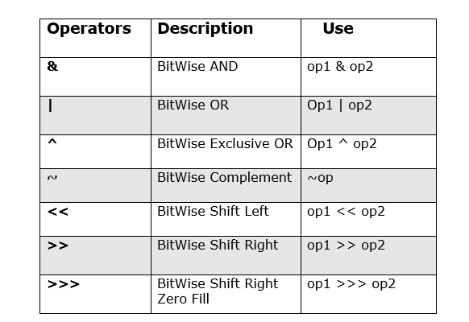<br><sub>Fig 24 - Bitwise Operators used in Java - (<a href='https://www.javastudypoint.com/2019/12/bitwise-operators-in-java.html'>Work by javastudypoint</a>) </sub></div>

<br>

**Types of Bitwise Operators in Java**

1. **Bitwise AND (&) Operator:** This operator returns 1 if both the operands are also 1 else it returns 0.

2. **Bitwise OR (|) Operator:** This operator returns 1 if either of the bits in the operand is 1, else it returns 0.

3. **Bitwise Complement (~) Operator:** This operator inverts all of the bits of its operands.

4. **Bitwise Exclusive OR (^) Operator:** This operator returns 1 if the corresponding bits are different, else it returns 0.

5. **Bitwise Shift Left (<<) Operator:** This operator shifts the bits of the number to the left and fills 0 in the void spaces that are left as a result.

6. **Bitwise Shift Right (>>) Operator:** This operator shifts the bits of the number to the right and fills 0 in the void spaces that are left as a result.

7. **Shift Right Zero Fill (>>>), Operator:** This operator shifts the bits of the number to the right and fills 0 in the void spaces that are left as a result. The leftmost bit is set to be 0.

<br>

<div align="center">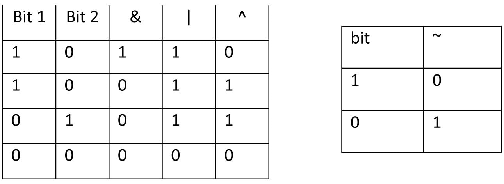<br><sub>Fig 25 - Bitwise Operators Truth Table - (<a href='https://www.javastudypoint.com/2019/12/bitwise-operators-in-java.html'>Work by  freeCodeCamp</a>) </sub></div>

<br>

```java

public class BitwiseOperator {
    public static void main(String[] args)
    {
        //Initial values
        int a = 6;
        int b = 7;

        // bitwise and
        // 0110 & 0111=0110 = 6
        System.out.println("a&b = " + (a & b));

        // bitwise or
        // 0110 | 0111=0111 = 7
        System.out.println("a|b = " + (a | b));

        // bitwise xor
        // 0110 ^ 0111=0001 = 1
        System.out.println("a^b = " + (a ^ b));

        // bitwise and
        // ~0110=1001
        // will give 2's complement of 1001 = -7
        System.out.println("~a = " + ~a);

		// bitwise left shift
		System.out.println("a << 2 = " +(a << 2));

		// bitwise right shift
		System.out.println("a >> 2 = " +(a >> 2));

		// bitwise shift right zero fill
		System.out.println("b >>> 2 = " +(b >>> 2));
	}

}

```

```java


    int a = 60;	      /* 60 = 0011 1100 represents 60 in binary*/
    int b = 13;	      /* 13 = 0000 1101 */
    int c = 0;
    
    c = a & b;        /* 12 = 0000 1100 */
    c = a | b;        /* 61 = 0011 1101 */
    c = a ^ b;        /* 49 = 0011 0001 */
    c = ~a;           /*-61 = 1100 0011  :Invert all bits */
    
    // shift operators : zeros are shifted in to replace the discarded bits
    c = a << 2;       /* 240 = 1111 0000 : Shift left 2 bits*/
    c = a >> 2;       /* 15 = 1111 */
    c = a >>> 2;      /* 15 = 0000 1111 : Zero fill right shift*/

```

```java

import java.util.Scanner;

public class Program {
	
	public static void main(String[] args) {
		
		Scanner sc = new Scanner(System.in);
		
		int mask = 0b100000; //binary number declared in Java, in this case, 32
		System.out.println(mask);
		int n = sc.nextInt();
		
		if ((n & mask) != 0) {
			System.out.println("6th bit is true!");
		} else {
			System.out.println("6th bit is false");
		}
		sc.close();
	}
}

```


#### <a name="chapter2part9"></a>Chapter 2 - Part 9: Operator Precedence

Operator precedence dictates the order in which operators are evaluated in a Java expression. Understanding operator precedence is crucial for writing correct and predictable code. Without this knowledge, the results of calculations might be unexpected, leading to bugs that are difficult to find. This lesson will cover the rules of operator precedence in Java, providing examples and exercises to solidify your understanding.

#### <a name="chapter2part9.1"></a>Chapter 2 - Part 9.1: Understanding Operator Precedence in Java

Operator precedence determines which operations are performed first in an expression. Operators with higher precedence are evaluated before operators with lower precedence. When operators have the same precedence, their associativity determines the order of evaluation (left-to-right or right-to-left).

Here's a table summarizing the precedence of common Java operators, from highest to lowest:

|Precedence	|Operator(s)	|Associativity|
| :-----------: | :-------------: | :-------------: |
|1	|```[]```, ```.```, ```()``` (method call)|	Left-to-right|
|2	|```++```, ```--``` (postfix)|	Left-to-right|
|3	|```++```, ```--``` (prefix), ```+```, ```-```, ```!```, ```~```|	Right-to-left|
|4	|```*```, ```/```, ```%```|	Left-to-right|
|5	|```+```, ```-```|	Left-to-right|
|6	|```<<```, ```>>```, ```>>>```|	Left-to-right|
|7	|```<```, ```<=```, ```>```, ```>=```, instanceof|	Left-to-right|
|8	|```==```, ```!=```|	Left-to-right|
|9	|```&```|	Left-to-right|
|10	|```^```|	Left-to-right|
|11	|&&|	Left-to-right|
|12	|```? :```|	Right-to-left|
|13	|```=```, ```+=```, ```-=```, ```*=```, ```/=```, ```%=```, ```&=```, ```^=```|	```=```, ```<<=```, ```>>=```, ```>>>=```|

**Arithmetic Operators**

Arithmetic operators (```*```, ```/```, ```%```, ```+```, ```-```) follow the standard mathematical order of operations. Multiplication, division, and modulus have higher precedence than addition and subtraction.

**Example 1**:

```java
int result = 5 + 3 * 2; // Multiplication is performed before addition
System.out.println(result); // Output: 11
```

In this example, 3 * 2 is evaluated first, resulting in 6. Then, 5 + 6 is evaluated, resulting in 11.

**Example 2**:

```java
int result = (5 + 3) * 2; // Parentheses change the order of operations
System.out.println(result); // Output: 16
```

Here, the parentheses force 5 + 3 to be evaluated first, resulting in 8. Then, 8 * 2 is evaluated, resulting in 16.

**Increment and Decrement Operators**

Increment (```++```) and decrement (```--```) operators can be used in prefix or postfix form. The precedence differs depending on the form.

Postfix: The value is used before it is incremented/decremented. Prefix: The value is incremented/decremented before it is used.

Example 1 (Postfix):

```java
int x = 5;
int y = x++; // y = 5, then x = 6
System.out.println("x = " + x + ", y = " + y); // Output: x = 6, y = 5
```

**Example 2 (Prefix)**:

```java
int x = 5;
int y = ++x; // x = 6, then y = 6
System.out.println("x = " + x + ", y = " + y); // Output: x = 6, y = 6
```

**Example 3 (Precedence with other operators)**:

```java
int x = 5;
int y = 10;
int result = ++x + y--; // x becomes 6, then 6 + 10 is evaluated, then y becomes 9
System.out.println("x = " + x + ", y = " + y + ", result = " + result); // Output: x = 6, y = 9, result = 16
```

In this example, the prefix increment ++x has higher precedence than the addition + and the postfix decrement y--. Therefore, x is incremented to 6 first. Then, 6 + y is evaluated (using the original value of y, which is 10), resulting in 16. Finally, y is decremented to 9.

**Comparison Operators**

Comparison operators (```==```, ```!=```, ```>```, ```<```, ```>=```, ```<=```) are used to compare values. They have lower precedence than arithmetic operators.

Example:

```java
int x = 5;
int y = 10;
boolean result = x + 5 > y - 2; // Arithmetic operations are performed before comparison
System.out.println(result); // Output: false (10 > 8 is false)
```

Here, x + 5 is evaluated to 10, and y - 2 is evaluated to 8. Then, 10 > 8 is evaluated, resulting in false.

**Logical Operators**

Logical operators (&&, ||, !) are used to combine boolean expressions. ! (logical NOT) has the highest precedence among logical operators, followed by && (logical AND), and then || (logical OR).

**Example 1**:

```java
boolean a = true;
boolean b = false;
boolean result = a || b && false; // AND is performed before OR
System.out.println(result); // Output: true (true || (false && false) -> true || false -> true)
```

In this example, b && false is evaluated first, resulting in false. Then, a || false is evaluated, resulting in true.

**Example 2**:

```java
boolean a = true;
boolean b = false;
boolean result = (a || b) && false; // Parentheses change the order of operations
System.out.println(result); // Output: false ((true || false) && false -> true && false -> false)
```

Here, the parentheses force a || b to be evaluated first, resulting in true. Then, true && false is evaluated, resulting in false.

**Example 3**:

```java
boolean a = true;
boolean b = false;
boolean result = !b && a; // NOT is performed before AND
System.out.println(result); // Output: true ((!false) && true -> true && true -> true)
```

In this example, !b is evaluated first, resulting in true. Then, true && a is evaluated, resulting in true.

**Assignment Operators**

Assignment operators (=, +=, -=, *=, /=, %=) have the lowest precedence. They are evaluated after all other operations in the expression.

**Example**:

```java
int x = 5;
int y = 10;
x += y * 2; // Multiplication is performed before addition and assignment
System.out.println(x); // Output: 25 (x = x + (y * 2) -> x = 5 + (10 * 2) -> x = 5 + 20 -> x = 25)
```

Here, y * 2 is evaluated to 20. Then, x + 20 is evaluated to 25. Finally, x is assigned the value 25.

#### <a name="chapter2part9.2"></a>Chapter 2 - Part 9.2: Using Parentheses to Control Precedence

Parentheses () can be used to override the default operator precedence. Expressions within parentheses are always evaluated first. This can improve code readability and prevent unexpected results.

**Example 1**:

```java
int result = 10 - 2 * 3; // Multiplication is performed before subtraction
System.out.println(result); // Output: 4
```

**Example 2**:

```java
int result = (10 - 2) * 3; // Parentheses change the order of operations
System.out.println(result); // Output: 24
```

In the first example, 2 * 3 is evaluated first, resulting in 6. Then, 10 - 6 is evaluated, resulting in 4. In the second example, 10 - 2 is evaluated first due to the parentheses, resulting in 8. Then, 8 * 3 is evaluated, resulting in 24.

#### <a name="chapter2part9.3"></a>Chapter 2 - Part 9.3: Practical Examples and Demonstrations

Let's consider a more complex example that combines multiple operators:

```java
int a = 5;
int b = 3;
int c = 10;
int result = a++ + b * 2 - c / 3;
System.out.println("Initial values: a = 5, b = 3, c = 10");
// a++ (postfix increment): a is used as 5, then incremented to 6
// b * 2: 3 * 2 = 6
// c / 3: 10 / 3 = 3 (integer division)
// 5 + 6 - 3 = 8
System.out.println("a = " + a + ", b = " + b + ", c = " + c + ", result = " + result); // Output: a = 6, b = 3, c = 10, result = 8
```

Here's a breakdown of the evaluation:

- a++ is evaluated. The current value of a (which is 5) is used in the expression, and then a is incremented to 6.
- b * 2 is evaluated, resulting in 6.
- c / 3 is evaluated, resulting in 3 (integer division).
- 5 + 6 - 3 is evaluated from left to right, resulting in 8.
- The value 8 is assigned to result.

## <a name="chapter3"></a>Chapter 3: Control Flow: Making Decisions and Repeating Actions

Control flow statements are the fundamental building blocks that allow programs to make decisions and repeat actions. Without control flow, a program would execute sequentially, line by line, offering no flexibility or adaptability. This lesson introduces the core concepts of control flow and sets the stage for understanding how to write more complex and dynamic Java programs. We'll explore the different types of control flow statements available in Java and how they alter the execution path of your code.

#### <a name="chapter3part1"></a>Chapter 3 - Part 1: Introduction to Control Flow Statements

Control flow refers to the order in which individual statements, instructions or function calls of an imperative program are executed or evaluated. In simple terms, it's the path your code takes as it runs. By default, Java executes code sequentially, from top to bottom, within a method. Control flow statements allow you to deviate from this linear execution, enabling your program to respond to different conditions and perform repetitive tasks.

#### <a name="chapter3part1.1"></a>Chapter 3 - Part 1.1: Understanding Control Flow

Control flow refers to the order in which individual statements, instructions or function calls of an imperative program are executed or evaluated. In simple terms, it's the path your code takes as it runs. By default, Java executes code sequentially, from top to bottom, within a method. Control flow statements allow you to deviate from this linear execution, enabling your program to respond to different conditions and perform repetitive tasks.

**Types of Control Flow Statements**

- **Decision-Making Statements**: These statements allow your program to choose between different paths of execution based on certain conditions. The primary decision-making statements in Java are:
  - ```if``` statement
  - ```if-else``` statement
  - ```if-else if-else``` statement
  - ```switch``` statement
 
- **Looping Statements**: These statements allow you to repeat a block of code multiple times. The looping statements in Java are:
  - ```while``` loop
  - ```do-while``` loop
  - ```for``` loop
  - ```for-each``` loop
 
**Importance of Control Flow**

Control flow statements are essential for creating programs that can:

- **React to User Input**: A program can take different actions based on what the user enters.
- **Process Data Conditionally**: A program can perform different calculations or operations depending on the data it receives.
- **Automate Repetitive Tasks**: A program can repeat a set of instructions multiple times, saving time and effort.
- **Implement Complex Algorithms**: Many algorithms rely on conditional execution and repetition to solve problems.

#### <a name="chapter3part1.2"></a>Chapter 3 - Part 1.2: Decision-Making Statements: An Overview

Decision-making statements allow a program to execute specific blocks of code only when certain conditions are met. These conditions are evaluated as boolean expressions (i.e., they result in either true or false).

**The ```if``` Statement**

The if statement is the simplest form of decision-making. It executes a block of code only if a specified condition is true.

```java
if (condition) {
    // Code to be executed if the condition is true
}
```

**Example**:

```java
int age = 20;

if (age >= 18) {
    System.out.println("You are eligible to vote.");
}
```

In this example, the message "You are eligible to vote." will be printed to the console only if the value of the age variable is greater than or equal to 18.

**The ```if-else``` Statement**

The if-else statement provides an alternative block of code to execute when the condition in the if statement is false.

**Syntax**:

```java
if (condition) {
    // Code to be executed if the condition is true
} else {
    // Code to be executed if the condition is false
}
```

**Example**:

```java
int age = 16;

if (age >= 18) {
    System.out.println("You are eligible to vote.");
} else {
    System.out.println("You are not eligible to vote yet.");
}
```

In this example, since age is 16 (less than 18), the message "You are not eligible to vote yet." will be printed.

**The ```if-else if-else``` Statement**

The if-else if-else statement allows you to check multiple conditions in sequence. It provides a way to handle more complex decision-making scenarios where you have several possible outcomes.

**Syntax**:

```java
if (condition1) {
    // Code to be executed if condition1 is true
} else if (condition2) {
    // Code to be executed if condition1 is false AND condition2 is true
} else if (condition3) {
    // Code to be executed if condition1 and condition2 are false AND condition3 is true
} else {
    // Code to be executed if all conditions are false
}
```

**Example**:

```java
int score = 75;

if (score >= 90) {
    System.out.println("Grade: A");
} else if (score >= 80) {
    System.out.println("Grade: B");
} else if (score >= 70) {
    System.out.println("Grade: C");
} else if (score >= 60) {
    System.out.println("Grade: D");
} else {
    System.out.println("Grade: F");
}
```

In this example, the program checks the value of the score variable against a series of conditions. Since score is 75, the message "Grade: C" will be printed.

**The ```switch``` Statement**

The switch statement provides a more efficient way to select one block of code to execute from a set of possible cases, based on the value of a single variable or expression. It's particularly useful when you have multiple possible values to check against.

**Syntax**:

```java
switch (expression) {
    case value1:
        // Code to be executed if expression equals value1
        break;
    case value2:
        // Code to be executed if expression equals value2
        break;
    case value3:
        // Code to be executed if expression equals value3
        break;
    default:
        // Code to be executed if expression doesn't match any of the cases
}
```

**Explanation**:

- The switch statement evaluates the expression.
- The case labels specify the different possible values of the expression.
- If the value of the expression matches a case label, the code within that case block is executed.
- The break statement is crucial. It terminates the switch statement and prevents the execution of subsequent case blocks. If you omit the break statement, the program will "fall through" to the next case block, even if the value of the expression doesn't match that case.
- The default case is optional. It provides a block of code to execute if the value of the expression doesn't match any of the case labels.

**Example**:

```java
int dayOfWeek = 3;

switch (dayOfWeek) {
    case 1:
        System.out.println("Monday");
        break;
    case 2:
        System.out.println("Tuesday");
        break;
    case 3:
        System.out.println("Wednesday");
        break;
    case 4:
        System.out.println("Thursday");
        break;
    case 5:
        System.out.println("Friday");
        break;
    case 6:
        System.out.println("Saturday");
        break;
    case 7:
        System.out.println("Sunday");
        break;
    default:
        System.out.println("Invalid day");
}
```

In this example, since dayOfWeek is 3, the message "Wednesday" will be printed.

#### <a name="chapter3part1.3"></a>Chapter 3 - Part 1.3: Looping Statements: An Introduction

Looping statements allow you to execute a block of code repeatedly, as long as a certain condition remains true. This is incredibly useful for automating tasks that need to be performed multiple times.

**The ```while``` Loop**

The while loop executes a block of code repeatedly as long as a specified condition is true. The condition is checked before each iteration of the loop.

**Syntax**:

```java
while (condition) {
    // Code to be executed repeatedly as long as the condition is true
}
```

**Example**:

```java
int count = 1;

while (count <= 5) {
    System.out.println("Count: " + count);
    count++; // Increment the counter
}
```

In this example, the loop will execute as long as the value of count is less than or equal to 5. The message "Count: " followed by the current value of count will be printed in each iteration. The count++ statement increments the value of count by 1 after each iteration. Without this increment, the loop would run indefinitely (an infinite loop).

**The ```do-while``` Loop**

The do-while loop is similar to the while loop, but with one key difference: the condition is checked after each iteration of the loop. This means that the code block inside the do-while loop will always be executed at least once, even if the condition is initially false.

**Syntax**:

```java
do {
    // Code to be executed repeatedly as long as the condition is true
} while (condition);
```

**Example**:

```java
int count = 6;

do {
    System.out.println("Count: " + count);
    count++;
} while (count <= 5);
```

In this example, even though count is initially 6 (which is greater than 5), the code inside the do block will be executed once. The message "Count: 6" will be printed. Then, the condition count <= 5 will be checked. Since it's false, the loop will terminate.

**The ```for``` Loop**

The for loop provides a more concise way to write loops that iterate a specific number of times. It combines the initialization, condition checking, and increment/decrement steps into a single statement.

**Syntax**:

```java
for (initialization; condition; increment/decrement) {
    // Code to be executed repeatedly as long as the condition is true
}
```

**Explanation**:

- **Initialization**: This part is executed only once, at the beginning of the loop. It's typically used to declare and initialize a loop counter variable.
- **Condition**: This condition is checked before each iteration of the loop. If it's true, the loop body is executed. If it's false, the loop terminates.
- **Increment/Decrement**: This part is executed after each iteration of the loop. It's typically used to update the loop counter variable.

**Example**:

```java
for (int i = 1; i <= 5; i++) {
    System.out.println("Iteration: " + i);
}
```

In this example, the loop will execute 5 times. The variable i is initialized to 1. The loop continues as long as i is less than or equal to 5. After each iteration, i is incremented by 1.

**The ```for-each``` Loop**

The for-each loop automatically handles the iteration process, so you don't need to worry about index variables or incrementing counters. It iterates through each element in the array or collection, one at a time, and makes the element available to you within the loop's body.

```java
for (dataType element : arrayOrCollection) {
    // Code to be executed for each element
    // You can use the 'element' variable to access the current element
}
```

**Explanation**:

- **dataType**: The data type of the elements in the array or collection.
- **element**: A variable that will hold the current element during each iteration.
- **arrayOrCollection**: The array or collection you want to iterate through.

**Example with Arrays**:

```java
public class ForEachArrayExample {
    public static void main(String[] args) {
        int[] numbers = {1, 2, 3, 4, 5};

        // Using a for-each loop to print each element in the array
        for (int number : numbers) {
            System.out.println(number);
        }
    }
}
```

```
1
2
3
4
5
```

#### <a name="chapter3part1.4"></a>Chapter 3 - Part 1.4: Using break and continue Statements

The break and continue statements provide additional control over the execution of loops.

**The ```break``` Statement**

The break statement is used to terminate a loop prematurely. When a break statement is encountered inside a loop, the loop is immediately exited, and the program continues with the next statement after the loop.

**Example**:

```java
for (int i = 1; i <= 10; i++) {
    if (i == 5) {
        break; // Exit the loop when i is 5
    }
    System.out.println("Iteration: " + i);
}
```

In this example, the loop is intended to iterate from 1 to 10. However, when i becomes 5, the break statement is executed, and the loop terminates. The output will be:

```
Iteration: 1
Iteration: 2
Iteration: 3
Iteration: 4
```

**The ```continue``` Statement**

The continue statement is used to skip the current iteration of a loop and proceed to the next iteration. When a continue statement is encountered inside a loop, the remaining code in the current iteration is skipped, and the loop proceeds to the next iteration.

**Example**:

```java
for (int i = 1; i <= 10; i++) {
    if (i % 2 == 0) {
        continue; // Skip even numbers
    }
    System.out.println("Iteration: " + i);
}
```

In this example, the loop iterates from 1 to 10. However, when i is an even number (i.e., i % 2 == 0 is true), the continue statement is executed, and the remaining code in the current iteration (the System.out.println() statement) is skipped. The output will be:

```
Iteration: 1
Iteration: 3
Iteration: 5
Iteration: 7
Iteration: 9
```

#### <a name="chapter3part2"></a>Chapter 3 - Part 2: The `if` Statement: Conditional Execution

The if statement is a fundamental building block of control flow in Java, allowing programs to make decisions and execute different code paths based on whether a condition is true or false. It enables programs to respond dynamically to different inputs and situations, making them more versatile and intelligent. Understanding the if statement is crucial for writing programs that can solve real-world problems.

#### <a name="chapter3part2.1"></a>Chapter 3 - Part 2.1: Understanding the if Statement

The if statement in Java allows you to execute a block of code only if a specified condition is true. The basic syntax is as follows:

```java
if (condition) {
    // Code to be executed if the condition is true
}
```

The condition is a boolean expression that evaluates to either true or false. If the condition is true, the code within the curly braces {} is executed. If the condition is false, the code block is skipped, and the program continues with the next statement after the if block.

**Anatomy of an if Statement**

Let's break down the components of an if statement:

- **```if``` Keyword**: This keyword signals the start of the conditional statement.
- **Condition**: This is a boolean expression enclosed in parentheses (). It can be a simple comparison (e.g., x > 5) or a more complex logical expression (e.g., (x > 5) && (y < 10)).
- **Code Block**: This is a block of code enclosed in curly braces {}. This code is executed only if the condition evaluates to true. If the code block contains only one statement, the curly braces can be omitted, but it's generally recommended to always use them for clarity and to avoid potential errors when adding more statements later.

**Boolean Expressions**

The condition within the if statement must be a boolean expression. This means it must evaluate to either true or false. Boolean expressions are typically constructed using:

- **Comparison Operators**: == (equal to), != (not equal to), > (greater than), < (less than), >= (greater than or equal to), <= (less than or equal to).
- **Logical Operators**: && (logical AND), || (logical OR), ! (logical NOT).

For example:

```java
int age = 20;
boolean isAdult = age >= 18; // isAdult will be true

if (isAdult) {
    System.out.println("You are an adult.");
}
```

#### <a name="chapter3part2.2"></a>Chapter 3 - Part 2.2: Practical Examples of the if Statement

Let's explore some practical examples to illustrate how the if statement can be used in Java programs.

**Example 1: Checking if a Number is Positive**

This example demonstrates how to use an if statement to check if a number is positive.

```java
int number = 10;

if (number > 0) {
    System.out.println("The number is positive.");
}
```

In this case, the condition number > 0 evaluates to true because number is 10, which is greater than 0. Therefore, the message "The number is positive." is printed to the console.

**Example 2: Determining if a User is Eligible to Vote**

This example builds upon the previous one and incorporates user input.

```java
import java.util.Scanner;

public class VotingEligibility {
    public static void main(String[] args) {
        Scanner input = new Scanner(System.in);

        System.out.print("Enter your age: ");
        int age = input.nextInt();

        if (age >= 18) {
            System.out.println("You are eligible to vote.");
        }
    }
}
```

This program prompts the user to enter their age. It then uses an if statement to check if the age is greater than or equal to 18. If it is, the program prints "You are eligible to vote."

**Example 3: Checking for Even or Odd Numbers**

This example demonstrates the use of the modulo operator (%) to determine if a number is even or odd.

```java
int number = 7;

if (number % 2 == 0) {
    System.out.println("The number is even.");
}
```

In this case, the condition number % 2 == 0 evaluates to false because 7 divided by 2 has a remainder of 1, which is not equal to 0. Therefore, nothing is printed to the console. To handle the case where the number is odd, you would typically use an if-else statement, which will be covered in the next lesson.

**Example 4: Validating User Input**

This example shows how to use an if statement to validate user input and ensure it falls within a specific range.

```java
import java.util.Scanner;

public class InputValidation {
    public static void main(String[] args) {
        Scanner input = new Scanner(System.in);

        System.out.print("Enter a number between 1 and 100: ");
        int number = input.nextInt();

        if (number >= 1 && number <= 100) {
            System.out.println("You entered a valid number: " + number);
        }
    }
}
```

This program prompts the user to enter a number between 1 and 100. It then uses an if statement with a compound condition (number >= 1 && number <= 100) to check if the number is within the valid range. If it is, the program prints a confirmation message.

**Example 5: Simulating a Simple Login**

This example demonstrates how to use an if statement to simulate a simple login process by comparing a user-entered password with a stored password.

```java
import java.util.Scanner;

public class SimpleLogin {
    public static void main(String[] args) {
        Scanner input = new Scanner(System.in);

        String storedPassword = "password123"; // In real applications, passwords should be stored securely
        System.out.print("Enter your password: ");
        String enteredPassword = input.nextLine();

        if (enteredPassword.equals(storedPassword)) {
            System.out.println("Login successful!");
        }
    }
}
```

This program prompts the user to enter their password. It then uses the equals() method to compare the entered password with the stored password. If they match, the program prints "Login successful!". Note that in real-world applications, passwords should be stored securely using hashing and salting techniques.

#### <a name="chapter3part3"></a>Chapter 3 - Part 3: The `if-else` Statement: Choosing Between Two Options

The if-else statement is a fundamental control flow structure in Java (and many other programming languages). It allows your program to execute different blocks of code based on whether a specified condition is true or false. This ability to make decisions is crucial for creating programs that can handle different inputs and situations, making them more versatile and useful. Without conditional statements like if-else, programs would simply execute the same sequence of instructions every time, regardless of the data they are processing.

#### <a name="chapter3part3.1"></a>Chapter 3 - Part 3.1: Understanding the if-else Statement

The if-else statement provides a way to execute one block of code if a condition is true and another block of code if the condition is false. The basic syntax is as follows:

```java
if (condition) {
    // Code to execute if the condition is true
} else {
    // Code to execute if the condition is false
}
```

- **```if``` keyword**: This signals the start of the conditional statement.
- **```condition```**: This is a boolean expression (an expression that evaluates to either true or false). The condition is enclosed in parentheses ().
- **```{}``` (curly braces)**: These define the blocks of code that will be executed based on the condition. The code within the first set of curly braces is executed if the condition is true. The code within the second set of curly braces (following the else keyword) is executed if the condition is false.
- **```else``` keyword**: This keyword introduces the block of code that will be executed when the if condition is false.

**How it Works**

- The program evaluates the condition inside the parentheses of the if statement.
- If the condition evaluates to true, the code block immediately following the if statement (the code within the first set of curly braces) is executed. The code block following the else statement is skipped.
- If the condition evaluates to false, the code block immediately following the if statement is skipped. The code block following the else statement (the code within the second set of curly braces) is executed.
- After either the if block or the else block is executed, the program continues with the next statement after the if-else statement.

**Example 1: Checking if a Number is Positive or Negative**

```java
public class IfElseExample {
    public static void main(String[] args) {
        int number = -10;

        if (number > 0) {
            System.out.println("The number is positive.");
        } else {
            System.out.println("The number is not positive.");
        }
    }
}
```

In this example:

- We declare an integer variable number and initialize it to -10.
- The if statement checks if number > 0. Since -10 is not greater than 0, the condition is false.
- Therefore, the code inside the else block is executed, and the output is "The number is not positive."

**Example 2: Determining Even or Odd**

```java
public class EvenOdd {
    public static void main(String[] args) {
        int number = 7;

        if (number % 2 == 0) {
            System.out.println("The number is even.");
        } else {
            System.out.println("The number is odd.");
        }
    }
}
```

In this example:

- We declare an integer variable number and initialize it to 7.
- The if statement checks if number % 2 == 0. The % operator gives the remainder of a division. If the remainder when number is divided by 2 is 0, then the number is even.
- Since 7 % 2 equals 1 (not 0), the condition is false.
- Therefore, the code inside the else block is executed, and the output is "The number is odd."

**Example 3: Comparing Two Numbers**

```java
public class CompareNumbers {
    public static void main(String[] args) {
        int num1 = 25;
        int num2 = 15;

        if (num1 > num2) {
            System.out.println("num1 is greater than num2");
        } else {
            System.out.println("num1 is not greater than num2");
        }
    }
}
```

In this example:

- We declare two integer variables, num1 and num2.
- The if statement checks if num1 > num2. Since 25 is greater than 15, the condition is true.
- Therefore, the code inside the if block is executed, and the output is "num1 is greater than num2".

#### <a name="chapter3part3.2"></a>Chapter 3 - Part 3.2: Omitting Curly Braces

If the code block within the if or else statement consists of only a single statement, you can omit the curly braces. However, it is generally considered good practice to always include the curly braces, even for single-line blocks, as it improves code readability and reduces the risk of errors when modifying the code later.

**Example (Not Recommended)**:

```java
public class NoBraces {
    public static void main(String[] args) {
        int age = 15;

        if (age >= 18)
            System.out.println("You are an adult.");
        else
            System.out.println("You are a minor.");
    }
}
```

While this code is syntactically correct, it's better to write it as:

```java
public class WithBraces {
    public static void main(String[] args) {
        int age = 15;

        if (age >= 18) {
            System.out.println("You are an adult.");
        } else {
            System.out.println("You are a minor.");
        }
    }
}
```

#### <a name="chapter3part3.3"></a>Chapter 3 - Part 3.3: Nested ```if-else``` Statements

You can nest if-else statements inside other if-else statements to create more complex decision-making logic. This means placing an if-else statement within the code block of another if or else statement.

```java
public class NestedIfElse {
    public static void main(String[] args) {
        int num = 10;

        if (num > 0) {
            System.out.println("The number is positive.");
            if (num % 2 == 0) {
                System.out.println("The number is also even.");
            } else {
                System.out.println("The number is odd.");
            }
        } else {
            System.out.println("The number is not positive.");
        }
    }
}
```

In this example:

- The outer if statement checks if num > 0. Since 10 is greater than 0, the condition is true.
- The code inside the outer if block is executed.
- Inside the outer if block, there is another if-else statement (nested if-else). This inner if statement checks if num % 2 == 0. Since 10 % 2 equals 0, the condition is true.
- Therefore, the code inside the inner if block is executed, and the output is "The number is also even."
- If num was not greater than 0, the else block of the outer if-else statement would have been executed.

#### <a name="chapter3part3.4"></a>Chapter 3 - Part 3.4: Short-Hand if-else

Optional structure to ```if-else``` when you want to decide a **VALUE** based on a condition.

**The Short Hand If...Else Statement**

```java

variable = (condition) ? expressionTrue :  expressionFalse;

```

Instead of writing:

```java

int time = 20;
if (time < 18) {
  System.out.println("Good day.");
} else {
  System.out.println("Good evening.");
}

```

You can simply write:

```java

int time = 20;
String result = (time < 18) ? "Good day." : "Good evening.";
System.out.println(result);

```

#### <a name="chapter3part3.5"></a>Chapter 3 - Part 3.5: Common Errors and Pitfalls

- **Using = instead of ==**: A common mistake is to use the assignment operator = instead of the equality operator == in the condition. This will lead to unexpected behavior and potentially a compilation error.

```java
int x = 5;
if (x = 10) { // Incorrect: assignment operator
    System.out.println("x is 10");
}
```

The correct way to write this is:

```java
int x = 5;
if (x == 10) { // Correct: equality operator
    System.out.println("x is 10");
}
```

- **Missing curly braces**: Forgetting to include curly braces for multi-line code blocks can lead to logical errors. Only the first statement after the if or else will be conditionally executed.

- **Incorrectly nested if-else statements**: Ensure that nested if-else statements are properly aligned and that each if has a corresponding else (if needed) to avoid confusion and logical errors.

#### <a name="chapter3part4"></a>Chapter 3 - Part 4: The `if-else if-else` Statement: Handling Multiple Conditions

The if-else if-else statement is a powerful tool in Java for handling multiple conditions. It allows your program to execute different blocks of code based on which condition evaluates to true. This is essential for creating flexible and responsive applications that can adapt to various inputs and scenarios. Understanding how to use this statement effectively is crucial for building more complex and logical programs.

#### <a name="chapter3part4.1"></a>Chapter 3 - Part 4.1: Understanding the if-else if-else Statement

The if-else if-else statement is an extension of the if and if-else statements. It provides a way to check multiple conditions sequentially. The basic structure is as follows:

```java
if (condition1) {
    // Code to execute if condition1 is true
} else if (condition2) {
    // Code to execute if condition1 is false AND condition2 is true
} else if (condition3) {
    // Code to execute if condition1 and condition2 are false AND condition3 is true
} else {
    // Code to execute if all conditions are false
}
```

**Explanation**:

- The if statement evaluates condition1. If it's true, the code block within the first set of curly braces {} is executed, and the rest of the if-else if-else statement is skipped.
- If condition1 is false, the program moves to the first else if statement and evaluates condition2. If condition2 is true, its corresponding code block is executed, and the rest of the statement is skipped.
- This process continues for each else if statement. The program evaluates each condition in order until it finds one that is true.
- If none of the conditions are true, the code block within the else statement is executed. The else block is optional, but it's good practice to include it to handle cases where none of the specified conditions are met.

**Key Principles**:

- **Order Matters**: The order of the conditions is important. The conditions are evaluated from top to bottom, and the first condition that evaluates to true will have its corresponding code block executed.
- **Mutual Exclusivity**: The if-else if-else statement ensures that only one code block is executed. Once a condition is met, the remaining conditions are not evaluated.
- **Optional else Block**: The else block is optional, but it provides a default action to take when none of the if or else if conditions are met.

**Example 1: Grading System**

Let's create a simple grading system based on a student's score:

```java
public class GradingSystem {
    public static void main(String[] args) {
        int score = 85; // Example score
        char grade;

        if (score >= 90) {
            grade = 'A';
        } else if (score >= 80) {
            grade = 'B';
        } else if (score >= 70) {
            grade = 'C';
        } else if (score >= 60) {
            grade = 'D';
        } else {
            grade = 'F';
        }

        System.out.println("Score: " + score);
        System.out.println("Grade: " + grade);
    }
}
```

**Explanation**:

- The code checks the score against different ranges.
- If the score is 90 or above, the grade is set to 'A'.
- If the score is not 90 or above, but it is 80 or above, the grade is set to 'B'.
- This continues until a condition is met, or the else block is reached, setting the grade to 'F' if the score is below 60.

**Example 2: Determining the Sign of a Number**

This example demonstrates how to use if-else if-else to determine if a number is positive, negative, or zero:

```java
public class SignChecker {
    public static void main(String[] args) {
        int number = -5; // Example number

        if (number > 0) {
            System.out.println("The number is positive.");
        } else if (number < 0) {
            System.out.println("The number is negative.");
        } else {
            System.out.println("The number is zero.");
        }
    }
}
```

**Explanation**:

- The code first checks if the number is greater than 0. If it is, it prints "The number is positive."
- If the number is not greater than 0, it checks if it's less than 0. If it is, it prints "The number is negative."
- If neither of the above conditions is true (i.e., the number is not greater than 0 and not less than 0), the else block is executed, and it prints "The number is zero."

**Example 3: Multiple Discount Levels**

Imagine an e-commerce application where different discount levels are applied based on the total purchase amount.

```java
public class DiscountCalculator {
    public static void main(String[] args) {
        double purchaseAmount = 120.0; // Example purchase amount
        double discountRate = 0.0;

        if (purchaseAmount >= 200) {
            discountRate = 0.20; // 20% discount
        } else if (purchaseAmount >= 100) {
            discountRate = 0.10; // 10% discount
        } else if (purchaseAmount >= 50) {
            discountRate = 0.05; // 5% discount
        } else {
            discountRate = 0.0; // No discount
        }

        double discountAmount = purchaseAmount * discountRate;
        double finalAmount = purchaseAmount - discountAmount;

        System.out.println("Purchase Amount: $" + purchaseAmount);
        System.out.println("Discount Rate: " + (discountRate * 100) + "%");
        System.out.println("Discount Amount: $" + discountAmount);
        System.out.println("Final Amount: $" + finalAmount);
    }
}
```

**Explanation**:

- The code checks the purchaseAmount against different thresholds.
- If the amount is $200 or more, a 20% discount is applied.
- If the amount is between $100 and $200, a 10% discount is applied.
- If the amount is between $50 and $100, a 5% discount is applied.
- Otherwise, no discount is applied.

**Example 4: Hypothetical Scenario - Traffic Light Control**

Consider a hypothetical traffic light control system. The system needs to determine the appropriate action based on the current state of the traffic light.

```java
public class TrafficLight {
    public static void main(String[] args) {
        String lightColor = "yellow"; // Example light color

        if (lightColor.equals("green")) {
            System.out.println("Go!");
        } else if (lightColor.equals("yellow")) {
            System.out.println("Caution! Prepare to stop.");
        } else if (lightColor.equals("red")) {
            System.out.println("Stop!");
        } else {
            System.out.println("Invalid light color.");
        }
    }
}
```

**Explanation**:

- The code checks the lightColor against different possible values.
- If the color is "green", it prints "Go!".
- If the color is "yellow", it prints "Caution! Prepare to stop."
- If the color is "red", it prints "Stop!".
- If the color is none of the above, it prints "Invalid light color." This demonstrates the importance of the else block for handling unexpected or invalid inputs.

#### <a name="chapter3part5"></a>Chapter 3 - Part 5: The `switch` Statement: Selecting from Multiple Cases

The switch statement provides a way to execute different blocks of code based on the value of a single variable or expression. It offers a more structured and often more readable alternative to using multiple if-else if-else statements, especially when dealing with a fixed set of possible values. Understanding how to effectively use switch statements is crucial for writing clean, efficient, and maintainable Java code.

#### <a name="chapter3part5.1"></a>Chapter 3 - Part 5.1: Understanding the switch Statement

The switch statement allows you to select one of several code blocks to execute based on the value of an expression. This expression, often a variable, is evaluated once, and its value is compared against a series of case labels. If a case label matches the value of the expression, the code block associated with that case is executed.

**Syntax of the switch Statement**

The basic syntax of the switch statement in Java is as follows:

```java
switch (expression) {
    case value1:
        // Code to be executed if expression == value1;
        break;
    case value2:
        // Code to be executed if expression == value2;
        break;
    case valueN:
        // Code to be executed if expression == valueN;
        break;
    default:
        // Code to be executed if expression does not match any of the cases;
}
```

- **```switch (expression)```**: The expression is evaluated. It must result in a value of type byte, short, char, int, String, or an enum.
- **```case value1:```**: Each case label specifies a value to compare against the expression. The value must be a constant expression of the same type as the expression.
- **```// Code to be executed```**: This is the block of code that will be executed if the expression matches the case's value.
- **```break;```**: The break statement is crucial. It terminates the switch statement and prevents "fall-through" to the next case. If you omit the break statement, execution will continue to the next case, regardless of whether its value matches the expression.
- **```default:```**: The default label is optional. It specifies a block of code to be executed if the expression does not match any of the case labels.

**The Importance of the break Statement**

The break statement is essential for controlling the flow of execution within a switch statement. Without a break statement at the end of each case block, the program will "fall through" and execute the code in the subsequent case blocks, even if their values do not match the expression. This behavior can be useful in certain situations, but it's more commonly a source of errors if not handled intentionally.

**Example without break (Fall-Through)**:

```java
int day = 2;
String dayType;
switch (day) {
    case 1:
    case 2:
    case 3:
    case 4:
    case 5:
        dayType = "Weekday";
        System.out.println("It's a Weekday");
    case 6:
    case 7:
        dayType = "Weekend";
        System.out.println("It's a Weekend");
    default:
        System.out.println("Invalid day");
}
```

In this example, because there are no break statements, if day is 2, the output will be:

```
It's a Weekday
It's a Weekend
Invalid day
```

**Example with ```break```**:

```java
int day = 2;
String dayType;
switch (day) {
    case 1:
    case 2:
    case 3:
    case 4:
    case 5:
        dayType = "Weekday";
        System.out.println("It's a Weekday");
        break;
    case 6:
    case 7:
        dayType = "Weekend";
        System.out.println("It's a Weekend");
        break;
    default:
        System.out.println("Invalid day");
}
```

Now, the output will be:

```
It's a Weekday
```

**Using switch with Different Data Types**

The switch statement in Java can be used with several data types:

- ```int```: Integer values.
- ```char```: Character values.
- ```String```: String values (introduced in Java 7).
- ```enum```: Enumerated types.

**Example with String**:

```java
String fruit = "apple";
switch (fruit) {
    case "apple":
        System.out.println("It's an apple.");
        break;
    case "banana":
        System.out.println("It's a banana.");
        break;
    default:
        System.out.println("Unknown fruit.");
}
```

**Example with enum**:

First, define an enum:

```java
enum Day {
    MONDAY, TUESDAY, WEDNESDAY, THURSDAY, FRIDAY, SATURDAY, SUNDAY
}
```

Then, use it in a switch statement:

```java
Day today = Day.WEDNESDAY;
switch (today) {
    case MONDAY:
        System.out.println("It's Monday.");
        break;
    case WEDNESDAY:
        System.out.println("It's Wednesday.");
        break;
    default:
        System.out.println("It's some other day.");
}
```

**The default Case**

The default case is an optional part of the switch statement. It provides a block of code to execute when none of the case values match the expression. It's good practice to include a default case, even if you think all possible values are covered by the case labels. This can help catch unexpected or invalid input.

**Example with default**:

```java
int month = 13; // Invalid month
switch (month) {
    case 1:
        System.out.println("January");
        break;
    case 2:
        System.out.println("February");
        break;
    default:
        System.out.println("Invalid month");
}
```

In this example, since month is 13, which doesn't match any of the case values, the default case will be executed, and "Invalid month" will be printed.

#### <a name="chapter3part5.2"></a>Chapter 3 - Part 5.2: Practical Examples and Demonstrations

Let's explore some practical examples to solidify your understanding of the switch statement.

**Example 1: Simple Calculator**

This example demonstrates a simple calculator that performs addition, subtraction, multiplication, or division based on user input.

```java
import java.util.Scanner;

public class Calculator {
    public static void main(String[] args) {
        Scanner scanner = new Scanner(System.in);

        System.out.print("Enter first number: ");
        double num1 = scanner.nextDouble();

        System.out.print("Enter an operator (+, -, *, /): ");
        char operator = scanner.next().charAt(0);

        System.out.print("Enter second number: ");
        double num2 = scanner.nextDouble();

        double result;

        switch (operator) {
            case '+':
                result = num1 + num2;
                break;
            case '-':
                result = num1 - num2;
                break;
            case '*':
                result = num1 * num2;
                break;
            case '/':
                if (num2 == 0) {
                    System.out.println("Cannot divide by zero.");
                    return;
                }
                result = num1 / num2;
                break;
            default:
                System.out.println("Invalid operator.");
                return;
        }

        System.out.println(num1 + " " + operator + " " + num2 + " = " + result);
        scanner.close();
    }
}
```

This code takes two numbers and an operator as input and performs the corresponding calculation using a switch statement. The default case handles invalid operators.

**Example 2: Determining the Number of Days in a Month**

This example uses a switch statement to determine the number of days in a given month.

```java
public class DaysInMonth {
    public static void main(String[] args) {
        int month = 2; // February
        int year = 2024; // Leap year

        int numDays = 0;

        switch (month) {
            case 1: case 3: case 5:
            case 7: case 8: case 10:
            case 12:
                numDays = 31;
                break;
            case 4: case 6:
            case 9: case 11:
                numDays = 30;
                break;
            case 2:
                if ((year % 4 == 0 && year % 100 != 0) || (year % 400 == 0)) {
                    numDays = 29;
                } else {
                    numDays = 28;
                }
                break;
            default:
                System.out.println("Invalid month.");
        }

        if (numDays > 0) {
            System.out.println("Number of days in " + month + " is " + numDays);
        }
    }
}
```

This example demonstrates how to handle multiple case labels that execute the same code block (e.g., months with 31 days). It also includes a check for leap years when determining the number of days in February.

**Example 3: Traffic Light Simulation**

This example simulates a traffic light using an enum and a switch statement.

```java
enum TrafficLightColor {
    RED, YELLOW, GREEN
}

public class TrafficLight {
    public static void main(String[] args) {
        TrafficLightColor color = TrafficLightColor.GREEN;

        switch (color) {
            case RED:
                System.out.println("Stop!");
                break;
            case YELLOW:
                System.out.println("Caution!");
                break;
            case GREEN:
                System.out.println("Go!");
                break;
            default:
                System.out.println("Invalid traffic light color.");
        }
    }
}
```

This example showcases the use of enum types in a switch statement, making the code more readable and maintainable.

#### <a name="chapter3part6"></a>Chapter 3 - Part 6: The `while` Loop: Repeating Code While a Condition is True

The while loop is a fundamental control flow statement in Java that allows you to repeatedly execute a block of code as long as a specified condition remains true. It's a powerful tool for automating repetitive tasks and creating dynamic programs that respond to changing conditions. Understanding how to use while loops effectively is crucial for writing efficient and maintainable Java code.

#### <a name="chapter3part6.1"></a>Chapter 3 - Part 6.1: Understanding the while Loop

The while loop in Java is used to execute a block of code repeatedly as long as a given condition is true. The condition is evaluated before each iteration of the loop. If the condition is initially false, the loop body will not execute at all.

**Syntax of the while Loop**

The basic syntax of a while loop is as follows:

```java
while (condition) {
    // Code to be executed repeatedly
}
```

- ```while``` keyword: This keyword signifies the start of the while loop.
- ```condition```: This is a boolean expression that is evaluated before each iteration of the loop. If the condition is true, the loop body is executed. If the condition is false, the loop terminates, and the program continues with the next statement after the loop.
- ```{}``` (curly braces): These enclose the block of code that will be executed repeatedly. This block is often referred to as the "loop body." If the loop body consists of only one statement, the curly braces are technically optional, but it's considered good practice to always include them for clarity and to avoid potential errors when adding more statements later.

**How the while Loop Works: Step-by-Step**

- **Evaluate the Condition**: The while loop begins by evaluating the boolean expression specified as the condition.
- **Execute the Loop Body (if true)**: If the condition evaluates to true, the code inside the loop's curly braces (the loop body) is executed.
- **Re-evaluate the Condition**: After the loop body has been executed, the condition is evaluated again.
- **Repeat or Terminate**: If the condition is still true, the loop body is executed again. Steps 3 and 4 are repeated until the condition becomes false. When the condition evaluates to false, the loop terminates, and the program continues executing the code that follows the loop.

**Basic Example: Printing Numbers 1 to 5**

```java
public class WhileLoopExample {
    public static void main(String[] args) {
        int i = 1; // Initialize a counter variable

        while (i <= 5) { // Condition: loop as long as i is less than or equal to 5
            System.out.println(i); // Print the value of i
            i++; // Increment i (very important to avoid infinite loops!)
        }

        System.out.println("Loop finished!"); // This will be printed after the loop terminates
    }
}
```

**Explanation**:

- We initialize an integer variable i to 1. This variable acts as our loop counter.
- The while loop's condition is i <= 5. This means the loop will continue to execute as long as the value of i is less than or equal to 5.
- Inside the loop body, we first print the current value of i using System.out.println(i).
- Then, we increment i by 1 using i++. This is crucial because it ensures that the value of i eventually becomes greater than 5, causing the loop to terminate. Without this increment, the loop would run forever (an infinite loop).
- After the loop finishes, the line System.out.println("Loop finished!"); is executed, demonstrating that the program continues after the loop has terminated.

**Avoiding Infinite Loops**

A common mistake when working with while loops is creating an infinite loop. This occurs when the loop's condition never becomes false, causing the loop to execute indefinitely.

**Example of an Infinite Loop**:

```java
public class InfiniteLoopExample {
    public static void main(String[] args) {
        int i = 1;

        while (i <= 5) {
            System.out.println(i);
            // Missing i++ statement!
        }

        System.out.println("This will never be printed!");
    }
}
```

In this example, the i++ statement is missing. As a result, the value of i remains at 1, and the condition i <= 5 is always true. The loop will print the number 1 repeatedly, forever.

**How to Prevent Infinite Loops**:

- **Ensure the loop's condition will eventually become false**: Make sure that the variables involved in the condition are modified within the loop body in a way that will eventually lead to the condition being false.
- **Double-check your logic**: Carefully review your code to ensure that the condition and the loop body are behaving as you intend.
- **Use a debugger**: A debugger can help you step through your code line by line and observe the values of variables, making it easier to identify the cause of an infinite loop.

#### <a name="chapter3part6.2"></a>Chapter 3 - Part 6.2: Using while Loops with User Input

while loops are often used in conjunction with user input to create interactive programs. The loop can continue to execute until the user enters a specific value or performs a certain action.

**Example: Reading Input Until a Specific Value is Entered**

```java
import java.util.Scanner;

public class InputWhileLoop {
    public static void main(String[] args) {
        Scanner scanner = new Scanner(System.in); // Create a Scanner object to read input

        int number = 0;

        while (number != -1) { // Loop until the user enters -1
            System.out.print("Enter a number (-1 to quit): ");
            number = scanner.nextInt(); // Read the next integer entered by the user

            if (number != -1) {
                System.out.println("You entered: " + number);
            }
        }

        System.out.println("Goodbye!");
        scanner.close(); // Close the scanner to prevent resource leaks
    }
}
```

**Explanation**:

- We import the java.util.Scanner class, which allows us to read input from the console.
- We create a Scanner object named scanner.
- We initialize an integer variable number to 0.
- The while loop's condition is number != -1. This means the loop will continue to execute as long as the value of number is not equal to -1.
- Inside the loop, we prompt the user to enter a number using System.out.print().
- We read the integer entered by the user using scanner.nextInt() and store it in the number variable.
- We use an if statement to check if the entered number is not -1. If it's not, we print the number back to the user.
- When the user enters -1, the loop terminates, and the program prints "Goodbye!".
- Finally, we close the Scanner object using scanner.close() to release system resources. It's good practice to close the scanner when you're finished with it.

**Example: Validating User Input**

```java
import java.util.Scanner;

public class InputValidation {
    public static void main(String[] args) {
        Scanner scanner = new Scanner(System.in);
        int age;

        while (true) { // Infinite loop that breaks when valid input is received
            System.out.print("Enter your age (0-120): ");
            age = scanner.nextInt();

            if (age >= 0 && age <= 120) {
                System.out.println("Your age is: " + age);
                break; // Exit the loop if the input is valid
            } else {
                System.out.println("Invalid age. Please enter a value between 0 and 120.");
            }
        }
        scanner.close();
    }
}
```

**Explanation**:

- This example demonstrates how to use a while loop for input validation.
- The while (true) creates an infinite loop.
- Inside the loop, the program prompts the user to enter their age.
- An if statement checks if the entered age is within the valid range (0-120).
- If the age is valid, the program prints the age and uses the break statement to exit the loop.
- If the age is invalid, the program prints an error message and the loop continues, prompting the user to enter their age again.
- The break statement is crucial here. Without it, the loop would continue indefinitely, even after the user enters a valid age.

#### <a name="chapter3part6.3"></a>Chapter 3 - Part 6.3: Using while Loops with Boolean Flags

A boolean flag is a variable of type boolean that is used to control the execution of a loop. The flag is typically initialized to true and then set to false within the loop when a certain condition is met, causing the loop to terminate.

**Example: Searching for a Value in a Range**

```java
public class BooleanFlagExample {
    public static void main(String[] args) {
        int target = 7;
        int start = 1;
        int end = 10;
        boolean found = false; // Initialize the flag to false

        int current = start;
        while (current <= end) {
            System.out.println("Checking: " + current);
            if (current == target) {
                found = true; // Set the flag to true when the target is found
                break; // Exit the loop
            }
            current++;
        }

        if (found) {
            System.out.println("Target " + target + " found!");
        } else {
            System.out.println("Target " + target + " not found in the range.");
        }
    }
}
```

**Explanation**:

- We initialize a boolean variable found to false. This flag will indicate whether or not the target value has been found within the range.
- The while loop continues as long as current is less than or equal to end.
- Inside the loop, we check if the current value is equal to the target value.
- If the current value is equal to the target value, we set the found flag to true and use the break statement to exit the loop.
- After the loop, we check the value of the found flag. If it's true, we print a message indicating that the target was found. Otherwise, we print a message indicating that the target was not found.

#### <a name="chapter3part6.4"></a>Chapter 3 - Part 6.4: Nested while Loops

Just like if statements, while loops can be nested inside other while loops. This allows you to create more complex control flow structures. Nested loops are often used to process two-dimensional data structures, such as arrays (which we will cover in a later module).

**Example: Printing a Multiplication Table**

```java
public class NestedWhileLoop {
    public static void main(String[] args) {
        int i = 1;

        while (i <= 5) { // Outer loop
            int j = 1;
            while (j <= 5) { // Inner loop
                System.out.print(i * j + "\t"); // Print the product of i and j
                j++;
            }
            System.out.println(); // Move to the next line after each row
            i++;
        }
    }
}
```

**Explanation**:

- The outer while loop iterates from 1 to 5 (controlled by the variable i).
- The inner while loop also iterates from 1 to 5 (controlled by the variable j).
- For each iteration of the outer loop, the inner loop executes completely.
- Inside the inner loop, we print the product of i and j, followed by a tab character (\t) to create spacing between the numbers.
- After the inner loop completes, we print a newline character (\n) to move to the next line, creating the rows of the multiplication table.

#### <a name="chapter3part7"></a>Chapter 3 - Part 7: The `do-while` Loop: Ensuring Code Executes at Least Once

The do-while loop is a fundamental control flow statement in Java, offering a crucial variation on the standard while loop. Its key characteristic is that it guarantees the code block within the loop will execute at least once, regardless of whether the condition is initially true or false. This makes it ideal for scenarios where you need to perform an action before evaluating whether to repeat it. Understanding the do-while loop is essential for creating robust and flexible Java programs.

#### <a name="chapter3part7.1"></a>Chapter 3 - Part 7.1: Understanding the do-while Loop

The do-while loop is a post-test loop, meaning the condition is checked after the loop body executes. This contrasts with the while loop, which is a pre-test loop. The general structure of a do-while loop in Java is as follows:

```java
do {
    // Code to be executed
} while (condition);
```

The code within the do block is executed first. After the execution of the code block, the condition is evaluated. If the condition is true, the loop repeats; otherwise, the loop terminates. It's crucial to remember the semicolon (;) at the end of the while (condition) statement; this is a syntax requirement for the do-while loop.

**Key Differences from the while Loop**

The primary difference between the while and do-while loops lies in when the condition is checked.

|Feature|	while Loop|	do-while Loop|
| :-------------: |  :-------------: |  :-------------: |
|Condition Check|	Before executing the loop body	|After executing the loop body|
|Execution|	May not execute if condition is initially false	|Executes at least once|
|Use Case|	When you might not need to execute the loop body at all	|When you need to execute the loop body at least once|

**Anatomy of a do-while Loop**

Let's break down the components of a do-while loop:

- **```do``` Keyword**: This keyword marks the beginning of the loop's code block.
- **Code Block**: This is the set of statements that will be executed repeatedly as long as the condition is true. It's enclosed in curly braces {}.
- **```while``` Keyword**: This keyword, along with the condition in parentheses, determines whether the loop will continue to iterate.
- **Condition**: This is a boolean expression that is evaluated after each execution of the code block. If it evaluates to true, the loop continues. If it evaluates to false, the loop terminates.
- **Semicolon**: The do-while loop requires a semicolon after the closing parenthesis of the while condition. Forgetting this semicolon is a common syntax error.

#### <a name="chapter3part7.2"></a>Chapter 3 - Part 7.2: Practical Examples of do-while Loops

Let's explore some practical examples to illustrate the use of do-while loops.

**Example 1: Simple Counter**

This example demonstrates a basic counter that prints numbers from 1 to 5 using a do-while loop.

```java
public class DoWhileCounter {
    public static void main(String[] args) {
        int i = 1; // Initialize the counter variable

        do {
            System.out.println("Count: " + i); // Print the current count
            i++; // Increment the counter
        } while (i <= 5); // Continue looping as long as i is less than or equal to 5
    }
}
```

In this example, the code inside the do block will execute at least once, printing "Count: 1". Then, the condition i <= 5 is checked. Since i is 1, the condition is true, and the loop continues until i becomes 6.

**Example 2: User Input Validation**

A common use case for do-while loops is validating user input. This example prompts the user to enter a number between 1 and 10 and continues to prompt them until they enter a valid number.

```java
import java.util.Scanner;

public class InputValidation {
    public static void main(String[] args) {
        Scanner scanner = new Scanner(System.in);
        int number;

        do {
            System.out.print("Enter a number between 1 and 10: ");
            number = scanner.nextInt();

            if (number < 1 || number > 10) {
                System.out.println("Invalid input. Please enter a number between 1 and 10.");
            }
        } while (number < 1 || number > 10); // Continue looping if the number is outside the valid range

        System.out.println("You entered: " + number);
        scanner.close();
    }
}
```

Here, the loop always prompts the user for input at least once. The condition number < 1 || number > 10 checks if the input is invalid. If it is, the loop repeats, prompting the user again. This ensures that the program receives valid input before proceeding.

**Example 3: A Simple Game**

Let's create a simple number guessing game using a do-while loop. The program will generate a random number, and the user has to guess it. The loop continues until the user guesses the correct number.

```java
import java.util.Random;
import java.util.Scanner;

public class GuessingGame {
    public static void main(String[] args) {
        Random random = new Random();
        int randomNumber = random.nextInt(100) + 1; // Generate a random number between 1 and 100
        Scanner scanner = new Scanner(System.in);
        int guess;
        int attempts = 0;

        System.out.println("Welcome to the Guessing Game!");

        do {
            System.out.print("Enter your guess (1-100): ");
            guess = scanner.nextInt();
            attempts++;

            if (guess < randomNumber) {
                System.out.println("Too low! Try again.");
            } else if (guess > randomNumber) {
                System.out.println("Too high! Try again.");
            } else {
                System.out.println("Congratulations! You guessed the number in " + attempts + " attempts.");
            }
        } while (guess != randomNumber); // Continue looping until the guess matches the random number

        scanner.close();
    }
}
```

In this game, the user is always prompted to make a guess at least once. The loop continues until the user's guess matches the randomNumber. This demonstrates how do-while loops are useful when you need to execute a block of code before checking a condition.

**Example 4: Menu-Driven Program**

do-while loops are frequently used in menu-driven programs where you want to display a menu and process user choices until the user decides to exit.

```java
import java.util.Scanner;

public class MenuProgram {
    public static void main(String[] args) {
        Scanner scanner = new Scanner(System.in);
        int choice;

        do {
            System.out.println("Menu:");
            System.out.println("1. Option 1");
            System.out.println("2. Option 2");
            System.out.println("3. Exit");
            System.out.print("Enter your choice: ");
            choice = scanner.nextInt();

            switch (choice) {
                case 1:
                    System.out.println("You selected Option 1.");
                    break;
                case 2:
                    System.out.println("You selected Option 2.");
                    break;
                case 3:
                    System.out.println("Exiting program.");
                    break;
                default:
                    System.out.println("Invalid choice. Please try again.");
            }
        } while (choice != 3); // Continue looping until the user chooses to exit (option 3)

        scanner.close();
    }
}
```

The menu is always displayed at least once. The loop continues until the user enters 3 to exit the program. This pattern is common in interactive command-line applications.

#### <a name="chapter3part8"></a>Chapter 3 - Part 8: The `for` Loop: Repeating Code a Specific Number of Times

The for loop is a fundamental control flow statement in Java, allowing you to execute a block of code repeatedly for a specific number of times. It's a powerful tool for automating repetitive tasks and is widely used in various programming scenarios. Understanding the for loop is crucial for writing efficient and concise Java code. This lesson will delve into the syntax, functionality, and practical applications of the for loop, equipping you with the knowledge to effectively utilize it in your programs.

#### <a name="chapter3part8.1"></a>Chapter 3 - Part 8.1: Understanding the for Loop Syntax

The for loop in Java has a specific syntax that you need to understand to use it correctly. The general structure of a for loop is as follows:

```java
for (initialization; condition; increment/decrement) {
    // Code to be executed repeatedly
}
```

Let's break down each part of the for loop:

- **Initialization**: This is the first part of the for loop, and it's executed only once at the beginning of the loop. It's typically used to declare and initialize a counter variable. For example: int i = 0;
- **Condition**: This is a boolean expression that's evaluated before each iteration of the loop. If the condition is true, the code inside the loop's body is executed. If the condition is false, the loop terminates. For example: i < 10;
- **Increment/Decrement**: This part is executed after each iteration of the loop. It's typically used to update the counter variable. For example: i++; or i--;
- **Loop Body**: This is the block of code that's executed repeatedly as long as the condition is true. It's enclosed in curly braces {}.

#### <a name="chapter3part8.2"></a>Chapter 3 - Part 8.2: How the for Loop Works

The for loop works in the following sequence:

- **Initialization**: The initialization statement is executed only once at the beginning of the loop.
- **Condition Check**: The condition is evaluated.
- **Execution**: If the condition is true, the code inside the loop's body is executed.
- **Increment/Decrement**: After the loop body is executed, the increment/decrement statement is executed.
- **Repeat**: Steps 2-4 are repeated until the condition becomes false.
- **Termination**: When the condition becomes false, the loop terminates, and the program continues with the next statement after the loop.

#### <a name="chapter3part8.3"></a>Chapter 3 - Part 8.3: Practical Examples of for Loops

Let's look at some practical examples of how to use for loops in Java.

**Example 1: Printing Numbers from 1 to 10**

This example demonstrates a basic for loop that prints numbers from 1 to 10.

```java
public class ForLoopExample1 {
    public static void main(String[] args) {
        // Initialize i to 1, loop as long as i is less than or equal to 10, increment i by 1 after each iteration
        for (int i = 1; i <= 10; i++) {
            // Print the value of i
            System.out.println(i);
        }
    }
}
```

In this example:

- ```int i = 1;``` initializes the counter variable i to 1.
- ```i <= 10;``` is the condition that checks if i is less than or equal to 10.
- ```i++;``` increments i by 1 after each iteration.
- ```System.out.println(i);``` prints the value of i in each iteration.

**Example 2: Calculating the Sum of Numbers from 1 to 100**

This example demonstrates how to use a for loop to calculate the sum of numbers from 1 to 100.

```java
public class ForLoopExample2 {
    public static void main(String[] args) {
        int sum = 0; // Initialize the sum to 0

        // Initialize i to 1, loop as long as i is less than or equal to 100, increment i by 1 after each iteration
        for (int i = 1; i <= 100; i++) {
            sum += i; // Add the value of i to the sum
        }

        // Print the final sum
        System.out.println("The sum of numbers from 1 to 100 is: " + sum);
    }
}
```

In this example:

- ```int sum = 0;``` initializes a variable sum to 0 to store the sum of the numbers.
- ```for (int i = 1; i <= 100; i++) is the for loop that iterates from 1 to 100.
- ```sum += i; adds the value of i to the sum in each iteration.
- ```System.out.println("The sum of numbers from 1 to 100 is: " + sum);``` prints the final sum after the loop completes.

**Example 3: Iterating Through an Array**

This example demonstrates how to use a for loop to iterate through an array and print its elements. This builds upon the array concepts introduced in Module 4.

```java
public class ForLoopExample3 {
    public static void main(String[] args) {
        int[] numbers = {10, 20, 30, 40, 50}; // Declare and initialize an array of integers

        // Loop through the array using the array's length as the loop's condition
        for (int i = 0; i < numbers.length; i++) {
            // Print the element at index i
            System.out.println("Element at index " + i + ": " + numbers[i]);
        }
    }
}
```

In this example:

- ```int[] numbers = {10, 20, 30, 40, 50};``` declares and initializes an array of integers.
- ```for (int i = 0; i < numbers.length; i++)``` is the for loop that iterates through the array. numbers.length gives the number of elements in the array.
- ```System.out.println("Element at index " + i + ": " + numbers[i]);``` prints the element at index i in each iteration.

**Example 4: Nested for Loops**

This example demonstrates how to use nested for loops to create a multiplication table.

```java
public class ForLoopExample4 {
    public static void main(String[] args) {
        // Outer loop iterates from 1 to 5
        for (int i = 1; i <= 5; i++) {
            // Inner loop iterates from 1 to 5
            for (int j = 1; j <= 5; j++) {
                // Print the product of i and j, followed by a tab
                System.out.print(i * j + "\t");
            }
            // Move to the next line after each row
            System.out.println();
        }
    }
}
```

In this example:

- ```The outer for loop iterates from 1 to 5, representing the rows of the multiplication table.
- ```The inner for loop iterates from 1 to 5, representing the columns of the multiplication table.
- ```System.out.print(i * j + "\t");``` prints the product of i and j, followed by a tab to create spacing.
- ```System.out.println();``` moves to the next line after each row is printed.

#### <a name="chapter3part8.4"></a>Chapter 3 - Part 8.4: Variations of the for Loop

While the standard for loop is commonly used, there are some variations that can be useful in specific situations.

**The Enhanced for Loop (for-each loop)**

The enhanced for loop, also known as the "for-each" loop, is a simplified way to iterate through arrays and collections. It was introduced in Java 5 and provides a more concise syntax for iterating through elements without explicitly managing an index.

```java
public class EnhancedForLoopExample {
    public static void main(String[] args) {
        int[] numbers = {10, 20, 30, 40, 50};

        // Enhanced for loop to iterate through the array
        for (int number : numbers) {
            System.out.println(number);
        }
    }
}
```

In this example:

- ```for (int number : numbers)``` iterates through each element in the numbers array.
- ```int number``` declares a variable number that represents the current element in the array.
- ```System.out.println(number);``` prints the value of the current element.

The enhanced for loop is simpler and easier to read than the traditional for loop when you only need to access the elements of an array or collection sequentially. However, it doesn't provide access to the index of the elements, so it's not suitable for situations where you need to know the index.

**Infinite for Loop**

An infinite for loop is a loop that never terminates because the condition is always true. It can be created by omitting the condition in the for loop's syntax.

```java
public class InfiniteForLoopExample {
    public static void main(String[] args) {
        // Infinite for loop (condition is always true)
        for (;;) {
            System.out.println("This will print forever!");
        }
    }
}
```

In this example, the for loop has no initialization, condition, or increment/decrement statements. This means that the condition is always considered true, and the loop will continue to execute indefinitely.

Infinite loops are generally not desirable in most programs, as they can cause the program to freeze or crash. However, they can be useful in specific situations, such as in server applications that need to run continuously. You can use break statement (covered in the next lesson) to exit an infinite loop based on a certain condition.

#### <a name="chapter3part8.5"></a>Chapter 3 - Part 8.5: Common Mistakes and How to Avoid Them

When working with for loops, there are some common mistakes that beginners often make. Here are some of them and how to avoid them:

- **Off-by-one errors**: These occur when the loop iterates one too many or one too few times. To avoid this, carefully check the loop's condition and make sure it's correct. For example, if you want to iterate through an array of length n, the loop should iterate from 0 to n - 1, not 0 to n.
- **Incorrect initialization**: Initializing the counter variable to the wrong value can lead to unexpected results. Make sure to initialize the counter variable to the correct starting value.
- **Missing increment/decrement**: Forgetting to increment or decrement the counter variable can cause the loop to run indefinitely or not run at all. Make sure to include the increment/decrement statement in the loop's syntax.
- **Incorrect condition**: Using the wrong condition can cause the loop to terminate prematurely or run indefinitely. Carefully check the condition and make sure it accurately reflects the desired behavior.
- **Modifying the counter variable inside the loop**: Modifying the counter variable inside the loop's body can lead to unpredictable behavior and make the loop difficult to understand. Avoid modifying the counter variable inside the loop unless it's absolutely necessary.

#### <a name="chapter3part9"></a>Chapter 3 - Part 9: Using `break` and `continue` Statements

The break and continue statements are powerful tools in Java for controlling the flow of loops. They allow you to alter the normal execution of a loop based on specific conditions, providing flexibility and efficiency in your code. Understanding how to use these statements effectively is crucial for writing clean and optimized loops.

#### <a name="chapter3part9.1"></a>Chapter 3 - Part 9.1: Understanding the break Statement

The break statement is used to terminate a loop prematurely. When a break statement is encountered inside a loop (either a for, while, or do-while loop), the loop's execution is immediately stopped, and the program control transfers to the next statement after the loop.

**Basic Usage of break**

The most straightforward use of break is to exit a loop when a specific condition is met.

```java
public class BreakExample {
    public static void main(String[] args) {
        for (int i = 1; i <= 10; i++) {
            if (i == 5) {
                break; // Exit the loop when i is 5
            }
            System.out.println("i = " + i);
        }
        System.out.println("Loop finished.");
    }
}
```

In this example, the loop is designed to iterate from 1 to 10. However, when i becomes 5, the break statement is executed, causing the loop to terminate immediately. The output will be:

```
i = 1
i = 2
i = 3
i = 4
Loop finished.
```

**break in Nested Loops**

When dealing with nested loops (a loop inside another loop), the break statement only exits the innermost loop in which it is placed.

```java
public class NestedBreakExample {
    public static void main(String[] args) {
        for (int i = 1; i <= 3; i++) {
            System.out.println("Outer loop: i = " + i);
            for (int j = 1; j <= 3; j++) {
                if (j == 2) {
                    break; // Exit the inner loop when j is 2
                }
                System.out.println("  Inner loop: j = " + j);
            }
        }
    }
}
```

In this case, the break statement is inside the inner loop. When j is 2, only the inner loop terminates, and the outer loop continues its execution. The output will be:

```
Outer loop: i = 1
  Inner loop: j = 1
Outer loop: i = 2
  Inner loop: j = 1
Outer loop: i = 3
  Inner loop: j = 1
```

**Labeled break (Advanced)**

Java allows you to use labeled break statements to exit specific outer loops in nested loop scenarios. This is achieved by placing a label before the loop you want to exit and then using break labelName;.

```java
public class LabeledBreakExample {
    public static void main(String[] args) {
        outerLoop: // Label for the outer loop
        for (int i = 1; i <= 3; i++) {
            System.out.println("Outer loop: i = " + i);
            innerLoop:
            for (int j = 1; j <= 3; j++) {
                if (i == 2 && j == 2) {
                    break outerLoop; // Exit the outer loop when i is 2 and j is 2
                }
                System.out.println("  Inner loop: j = " + j);
            }
        }
        System.out.println("Loop finished.");
    }
}
```

Here, outerLoop is a label assigned to the outer loop. When i is 2 and j is 2, the break outerLoop; statement is executed, causing the outer loop to terminate. The output will be:

```
Outer loop: i = 1
  Inner loop: j = 1
  Inner loop: j = 2
  Inner loop: j = 3
Outer loop: i = 2
  Inner loop: j = 1
Loop finished.
```

#### <a name="chapter3part9.2"></a>Chapter 3 - Part 9.2: Understanding the continue Statement

The continue statement is used to skip the rest of the current iteration of a loop and proceed to the next iteration. When a continue statement is encountered, the remaining code within the loop for that iteration is skipped, and the loop proceeds to evaluate the loop's condition for the next iteration.

**Basic Usage of continue**

The primary use of continue is to bypass certain parts of a loop's body based on a condition.

```java
public class ContinueExample {
    public static void main(String[] args) {
        for (int i = 1; i <= 5; i++) {
            if (i == 3) {
                continue; // Skip the rest of the iteration when i is 3
            }
            System.out.println("i = " + i);
        }
        System.out.println("Loop finished.");
    }
}
```

In this example, when i is 3, the continue statement is executed, causing the System.out.println("i = " + i); line to be skipped for that iteration. The output will be:

```
i = 1
i = 2
i = 4
i = 5
Loop finished.
```

**continue in Nested Loops**

Similar to break, when used in nested loops, continue only affects the innermost loop.

```java
public class NestedContinueExample {
    public static void main(String[] args) {
        for (int i = 1; i <= 3; i++) {
            System.out.println("Outer loop: i = " + i);
            for (int j = 1; j <= 3; j++) {
                if (j == 2) {
                    continue; // Skip the rest of the inner loop iteration when j is 2
                }
                System.out.println("  Inner loop: j = " + j);
            }
        }
    }
}
```

In this case, when j is 2, the continue statement skips the rest of the inner loop's iteration, but the outer loop continues its execution. The output will be:

```
Outer loop: i = 1
  Inner loop: j = 1
  Inner loop: j = 3
Outer loop: i = 2
  Inner loop: j = 1
  Inner loop: j = 3
Outer loop: i = 3
  Inner loop: j = 1
  Inner loop: j = 3
```

**Labeled continue (Advanced)**

Like break, continue can also be used with labels to skip to the next iteration of a specific outer loop.

```java
public class LabeledContinueExample {
    public static void main(String[] args) {
        outerLoop: // Label for the outer loop
        for (int i = 1; i <= 3; i++) {
            System.out.println("Outer loop: i = " + i);
            innerLoop:
            for (int j = 1; j <= 3; j++) {
                if (i == 2 && j == 2) {
                    continue outerLoop; // Skip to the next iteration of the outer loop
                }
                System.out.println("  Inner loop: j = " + j);
            }
        }
    }
}
```

Here, when i is 2 and j is 2, the continue outerLoop; statement is executed, causing the program to skip to the next iteration of the outer loop. The output will be:

```
Outer loop: i = 1
  Inner loop: j = 1
  Inner loop: j = 2
  Inner loop: j = 3
Outer loop: i = 2
  Inner loop: j = 1
Outer loop: i = 3
  Inner loop: j = 1
  Inner loop: j = 2
  Inner loop: j = 3
```

#### <a name="chapter3part9.3"></a>Chapter 3 - Part 9.3: Practical Examples and Demonstrations

**Example 1: Finding the First Even Number**

This example demonstrates how to use break to find the first even number in a range.

```java
public class FindFirstEven {
    public static void main(String[] args) {
        for (int i = 1; i <= 10; i++) {
            if (i % 2 == 0) {
                System.out.println("First even number found: " + i);
                break; // Exit the loop after finding the first even number
            }
        }
    }
}
```

**Example 2: Skipping Multiples of 3**

This example demonstrates how to use continue to skip multiples of 3 when printing numbers from 1 to 10.

```java
public class SkipMultiplesOfThree {
    public static void main(String[] args) {
        for (int i = 1; i <= 10; i++) {
            if (i % 3 == 0) {
                continue; // Skip this iteration if i is a multiple of 3
            }
            System.out.println("i = " + i);
        }
    }
}
```

**Example 3: Searching for an Element in an Array**

This example shows how to use break to efficiently search for a specific element in an array.

```java
public class ArraySearch {
    public static void main(String[] args) {
        int[] numbers = {1, 2, 3, 4, 5, 6, 7, 8, 9, 10};
        int target = 7;
        boolean found = false;

        for (int number : numbers) {
            if (number == target) {
                System.out.println("Target " + target + " found!");
                found = true;
                break; // Exit the loop once the target is found
            }
        }

        if (!found) {
            System.out.println("Target " + target + " not found in the array.");
        }
    }
}
```

## <a name="chapter4"></a>Chapter 4: Working with Arrays and Strings

#### <a name="chapter4part1"></a>Chapter 4 - Part 1: Introduction to Arrays: Storing Collections of Data

Arrays are fundamental data structures in Java, allowing you to store and manage collections of elements of the same type. They provide a way to organize data efficiently and perform operations on multiple values using a single variable name. Understanding arrays is crucial for various programming tasks, from simple data storage to complex algorithms. This lesson will cover the basics of declaring, initializing, accessing, and looping through arrays in Java, laying the groundwork for more advanced data manipulation techniques.

In programming, "vector" is the name given to one-dimensional arrays.

Array is a data Structure:
- Homogeneous (data of the same type)
- Ordered (elements accessed through positions)
- Allocated at once, in a contiguous block of memory

Advantages:
- Immediate access to elements by their position

Disadvantages:
- Fixed Size
- Difficulty performing insertions and deletions

<br>

<div align="center">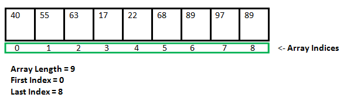<br><sub>Fig 22 - Array - (<a href='https://www.geeksforgeeks.org/arrays-in-java/'>Work by geeksforgeeks</a>) </sub></div>

<br>

Arrays are used to store multiple values in a single variable, instead of declaring separate variables for each value.

To declare an array, define the variable type with **square brackets** ```[]```:

```java

String[] cars;

```

We have now declared a variable that holds an array of strings. To insert values to it, you can place the values in a comma-separated list, inside curly braces:

```java

String[] cars = {"Volvo", "BMW", "Ford", "Mazda"};

```

To create an array of integers, you could write:

```java

int[] myNum = {10, 20, 30, 40};

```

**Access the Elements of an Array**

You can access an array element by referring to the index number.

This statement accesses the value of the first element in cars:

```java

String[] cars = {"Volvo", "BMW", "Ford", "Mazda"};
System.out.println(cars[0]);
// Outputs Volvo

```

OBS: Array indexes start with 0: [0] is the first element. [1] is the second element, etc.

**Change an Array Element**

To change the value of a specific element, refer to the index number:

```java

cars[0] = "Opel";

```

```java

String[] cars = {"Volvo", "BMW", "Ford", "Mazda"};
cars[0] = "Opel";
System.out.println(cars[0]);
// Now outputs Opel instead of Volvo

```

**Array Length**

To find out how many elements an array has, use the ```length``` property:

```java

String[] cars = {"Volvo", "BMW", "Ford", "Mazda"};
System.out.println(cars.length);
// Outputs 4

```

Example: Create a program that reads a certain amount of given double numbers and that in the end they are displayed on the screen

```java

import java.util.Locale;
import java.util.Scanner;

public class Main {

	public static void main(String[] args) {
		
		Locale.setDefault(Locale.US);
		Scanner sc = new Scanner(System.in);
		
		int N, i;
		
		System.out.print("How many numbers will be enter? ");
		N = sc.nextInt();
		
		double[] vet = new double[N];
		
		for (i = 0; i < N; i++) {
			System.out.print("Enter a number: ");
			vet[i] = sc.nextDouble();
		}
		
		System.out.println("\nTyped Numbers:");
		for (i = 0; i < N; i++) {
			System.out.println(String.format("%.1f", vet[i]));
		}
		
		sc.close();

	}

}

```


#### <a name="chapter4part1.1"></a>Chapter 4 - Part 1.1: Declaring and Initializing Arrays

In Java, arrays are declared with a specific data type and a fixed size. The declaration specifies the type of elements the array will hold, and the size determines the number of elements the array can store.

**Declaring Arrays**

To declare an array, you use the following syntax:

```java
dataType[] arrayName;
```

- ```dataType```: Specifies the type of elements the array will store (e.g., int, double, String).
- ```[]```: Indicates that you are declaring an array.
- ```arrayName```: The name you choose for the array variable.

For example, to declare an array of integers named numbers, you would write:

```java
int[] numbers;
```

This declaration only creates a reference to an array. It does not allocate any memory to store the array elements.

**Initializing Arrays**

After declaring an array, you need to initialize it to allocate memory and assign initial values to its elements. There are several ways to initialize an array in Java.

**Using the ```new``` Keyword

You can initialize an array using the new keyword, specifying the size of the array:

```java
arrayName = new dataType[arraySize];
```

- ```new```: Allocates memory for the array.
- ```dataType```: The type of elements the array will store.
- ```arraySize```: The number of elements the array can hold. This must be a non-negative integer.

For example, to initialize the numbers array to hold 5 integers, you would write:

```java
numbers = new int[5];
```

This creates an array of 5 integers, with each element initialized to the default value for the int type, which is 0.

**Initializing with Values**

You can also initialize an array with specific values during declaration using an array literal:

```java
dataType[] arrayName = {value1, value2, value3, ...};
```

- ```dataType```: The type of elements the array will store.
- ```arrayName```: The name you choose for the array variable.
- ```{value1, value2, value3, ...}```: An array literal containing the initial values for the array elements. The size of the array is determined by the number of values in the literal.

For example, to initialize an array of strings named names with three names, you would write:

```java
String[] names = {"Alice", "Bob", "Charlie"};
```

This creates an array of 3 strings, with the first element initialized to "Alice", the second to "Bob", and the third to "Charlie".

**Combining Declaration and Initialization**

You can combine the declaration and initialization steps into a single statement:

```java
dataType[] arrayName = new dataType[arraySize]; // Declaration and initialization with size
dataType[] arrayName = {value1, value2, value3, ...}; // Declaration and initialization with values
```

For example:

```java
int[] scores = new int[10]; // Declares an integer array named scores with a size of 10
double[] prices = {19.99, 29.99, 39.99}; // Declares a double array named prices with initial values
```

**Examples**

**Example 1: Initializing an array of integers with a specific size**:

```java
int[] ages = new int[4]; // Creates an integer array named ages with a size of 4
System.out.println(ages[0]); // Output: 0 (default value for int)
```

**Example 2: Initializing an array of strings with values**:

```java
String[] colors = {"red", "green", "blue"}; // Creates a string array named colors with initial values
System.out.println(colors[1]); // Output: green
```

**Example 3: Combining declaration and initialization**:

```java
boolean[] flags = {true, false, true, true}; // Creates a boolean array named flags with initial values
System.out.println(flags[2]); // Output: true
```

#### <a name="chapter4part1.2"></a>Chapter 4 - Part 1.2: Accessing Array Elements

Array elements are accessed using their index, which is an integer value that represents the position of the element in the array. Array indices start at 0 and go up to arraySize - 1.

**Using Indices**

To access an array element, you use the following syntax:

```java
arrayName[index]
```

- ```arrayName```: The name of the array.

- ```index```: The index of the element you want to access. This must be a non-negative integer less than the array size.

For example, to access the first element of the numbers array, you would write:

```java
numbers[0]
```

To access the third element, you would write:

```java
numbers[2]
```

**Assigning Values to Array Elements**

You can also assign values to array elements using their index:

```java
arrayName[index] = value;
```

- ```arrayName```: The name of the array.
- ```index```: The index of the element you want to assign a value to.
- ```value```: The value you want to assign to the element. This must be of the same type as the array's data type.

For example, to assign the value 10 to the first element of the numbers array, you would write:

```java
numbers[0] = 10;
```

**ArrayIndexOutOfBoundsException**

It's important to note that accessing an array element with an invalid index (i.e., an index that is less than 0 or greater than or equal to the array size) will result in an ArrayIndexOutOfBoundsException. This is a common error when working with arrays, so it's crucial to ensure that your indices are within the valid range.

**Examples**

**Example 1: Accessing and assigning values to an integer array**:

```java
int[] scores = new int[5]; // Creates an integer array named scores with a size of 5
scores[0] = 85; // Assigns the value 85 to the first element (index 0)
scores[1] = 90; // Assigns the value 90 to the second element (index 1)
System.out.println(scores[0]); // Output: 85
System.out.println(scores[1]); // Output: 90
```

**Example 2: Accessing and assigning values to a string array**:

```java
String[] names = new String[3]; // Creates a string array named names with a size of 3
names[0] = "Alice"; // Assigns the value "Alice" to the first element (index 0)
names[1] = "Bob"; // Assigns the value "Bob" to the second element (index 1)
System.out.println(names[0]); // Output: Alice
System.out.println(names[1]); // Output: Bob
```

**Example 3: Demonstrating ArrayIndexOutOfBoundsException**:

```java
int[] values = new int[3]; // Creates an integer array named values with a size of 3
// values[3] = 10; // This will cause an ArrayIndexOutOfBoundsException because the valid indices are 0, 1, and 2
```

#### <a name="chapter4part1.3"></a>Chapter 4 - Part 1.3: Looping Through Arrays

Looping through arrays is a common task that allows you to process each element in the array. Java provides several ways to loop through arrays, including the for loop and the enhanced for loop (also known as the "for-each" loop).

**Using the for Loop**

The for loop is a traditional way to iterate through an array using an index.

```java
for (int i = 0; i < arrayName.length; i++) {
    // Access array elements using arrayName[i]
}
```

- ```int i = 0```: Initializes a loop counter i to 0.
- ```i < arrayName.length```: Specifies the loop condition. The loop continues as long as i is less than the length of the array. arrayName.length returns the number of elements in the array.
- ```i++```: Increments the loop counter i after each iteration.
- ```arrayName[i]```: Accesses the element at index i in the array.

For example, to print all the elements of the numbers array, you would write:

```java
int[] numbers = {1, 2, 3, 4, 5};
for (int i = 0; i < numbers.length; i++) {
    System.out.println(numbers[i]);
}
```

This code will print each element of the numbers array to the console.

**Using the Enhanced for Loop (For-Each Loop)**

The enhanced for loop provides a more concise way to iterate through an array without using an index.

```java
for (dataType element : arrayName) {
    // Access each element directly using the element variable
}
```

- ```dataType```: The type of elements in the array.
- ```element```: A variable that represents the current element being processed in the loop.
- ```arrayName```: The name of the array.

For example, to print all the elements of the numbers array using the enhanced for loop, you would write:

```java
int[] numbers = {1, 2, 3, 4, 5};
for (int number : numbers) {
    System.out.println(number);
}
```

This code will also print each element of the numbers array to the console. The enhanced for loop is simpler to use when you only need to access the elements of the array and don't need to know their indices.

**Examples**

**Example 1: Using a for loop to calculate the sum of elements in an integer array**:

```java
int[] values = {10, 20, 30, 40, 50};
int sum = 0;
for (int i = 0; i < values.length; i++) {
    sum += values[i];
}
System.out.println("Sum: " + sum); // Output: Sum: 150
```

**Example 2: Using an enhanced for loop to print the elements of a string array**:

```java
String[] fruits = {"apple", "banana", "orange"};
for (String fruit : fruits) {
    System.out.println(fruit);
}
// Output:
// apple
// banana
// orange
```

**Example 3: Using a for loop to modify elements in an array**:

```java
int[] numbers = {1, 2, 3, 4, 5};
for (int i = 0; i < numbers.length; i++) {
    numbers[i] *= 2; // Multiply each element by 2
}
for (int number : numbers) {
    System.out.println(number);
}
// Output:
// 2
// 4
// 6
// 8
// 10
```

#### <a name="chapter4part2"></a>Chapter 4 - Part 2: Declaring and Initializing Arrays

Arrays are fundamental data structures in Java, allowing you to store and manage collections of elements of the same data type. Understanding how to declare and initialize arrays is crucial for efficiently handling data in your programs. This lesson will provide a comprehensive guide to declaring and initializing arrays in Java, covering various methods and best practices.

#### <a name="chapter4part2.1"></a>Chapter 4 - Part 2.1: Declaring Arrays

Declaring an array in Java involves specifying the data type of the elements it will hold and the name of the array variable. This declaration informs the compiler about the type of data the array will store, but it doesn't allocate any memory space for the array elements.

**Syntax for Array Declaration**

The general syntax for declaring an array is:

```java
dataType[] arrayName; // Preferred way
// or
dataType arrayName[]; // Also valid, but less common
```

- ```dataType```: Specifies the type of elements the array will store (e.g., int, String, double, or a custom class).
- ```[]```: Indicates that the variable is an array.
- ```arrayName```: The identifier (name) you choose for the array variable.

**Examples of Array Declarations**

Here are a few examples of declaring arrays of different data types:

```java
int[] numbers;         // Declares an array of integers
double[] prices;       // Declares an array of doubles
String[] names;         // Declares an array of Strings
boolean[] flags;       // Declares an array of booleans
```

In these examples, we've declared array variables named numbers, prices, names, and flags that can hold collections of integers, doubles, Strings, and booleans, respectively. At this point, these arrays do not yet exist in memory. We've only told the compiler that these names will refer to arrays of the specified types.

#### <a name="chapter4part2.2"></a>Chapter 4 - Part 2.2: Initializing Arrays

Initialization is the process of allocating memory space for the array and assigning initial values to its elements. In Java, arrays are objects, and they must be created using the new keyword.

**Initializing Arrays with a Fixed Size**

You can initialize an array by specifying its size, which determines the number of elements it can hold. All elements will be initialized with default values based on their data type (0 for numeric types, false for booleans, and null for object references).

**Syntax for Fixed-Size Initialization**

```java
dataType[] arrayName = new dataType[arraySize];
```

- ```dataType```: The data type of the array elements.
- ```arrayName```: The name of the array variable.
- ```new```: The keyword used to create a new array object.
- ```arraySize```: An integer specifying the number of elements the array can hold.

**Examples of Fixed-Size Initialization**

```java
int[] numbers = new int[5];       // Creates an array of 5 integers, initialized to 0
double[] prices = new double[10];    // Creates an array of 10 doubles, initialized to 0.0
String[] names = new String[3];      // Creates an array of 3 Strings, initialized to null
boolean[] flags = new boolean[8];     // Creates an array of 8 booleans, initialized to false
```

In these examples, we've created arrays of specific sizes. For instance, numbers can hold 5 integers, and each element is initially set to 0. Similarly, names can hold 3 Strings, and each element is initially null because String is an object.

**Initializing Arrays with Initial Values**

You can also initialize an array by directly providing the initial values for its elements. In this case, the size of the array is automatically determined based on the number of values provided.

**Syntax for Initialization with Values**

```java
dataType[] arrayName = {value1, value2, value3, ...};
```

- ```dataType```: The data type of the array elements.
- ```arrayName```: The name of the array variable.
- ```{}```: Curly braces enclose the initial values.
- ```value1, value2, value3, ...```: The initial values for the array elements, separated by commas.

**Examples of Initialization with Values**

```java
int[] numbers = {1, 2, 3, 4, 5};             // Creates an array of 5 integers with the specified values
double[] prices = {9.99, 19.99, 29.99};       // Creates an array of 3 doubles with the specified values
String[] names = {"Alice", "Bob", "Charlie"};  // Creates an array of 3 Strings with the specified values
boolean[] flags = {true, false, true};        // Creates an array of 3 booleans with the specified values
```

In these examples, the arrays are initialized with specific values. The size of each array is determined by the number of values provided within the curly braces. For example, numbers is an array of size 5, with elements initialized to 1, 2, 3, 4, and 5, respectively.

**Combining Declaration and Initialization**

You can combine the declaration and initialization steps into a single statement:

```java
int[] numbers = new int[5]; // Declaration and fixed-size initialization
int[] values = {10, 20, 30}; // Declaration and initialization with values
```

This approach is concise and often preferred for its readability.

#### <a name="chapter4part2.3"></a>Chapter 4 - Part 2.3: Accessing Array Elements

Array elements are accessed using their index, which is an integer representing the element's position in the array. Array indices start at 0 and go up to arraySize - 1.

**Syntax for Accessing Elements**

```java
arrayName[index]
```

- ```arrayName```: The name of the array.
- ```index```: An integer representing the position of the element you want to access.

**Examples of Accessing Elements**

```java
int[] numbers = {10, 20, 30, 40, 50};

System.out.println(numbers[0]); // Accesses the first element (10)
System.out.println(numbers[2]); // Accesses the third element (30)

numbers[1] = 25; // Modifies the second element to 25
System.out.println(numbers[1]); // Accesses the modified second element (25)
```

In this example, we access and modify elements of the numbers array using their indices. It's important to note that attempting to access an element with an index outside the valid range (0 to arraySize - 1) will result in an ArrayIndexOutOfBoundsException.

#### <a name="chapter4part2.4"></a>Chapter 4 - Part 2.4: Looping Through Arrays

Looping through arrays is a common operation used to process each element in the array. The for loop is particularly well-suited for this purpose. We will cover looping in more detail in the next lesson.

**Example of Looping Through an Array**

```java
int[] numbers = {1, 2, 3, 4, 5};

for (int i = 0; i < numbers.length; i++) {
    System.out.println("Element at index " + i + ": " + numbers[i]);
}
```

In this example, the for loop iterates through each element of the numbers array, printing the index and value of each element. The numbers.length property provides the size of the array, ensuring that the loop iterates through all valid indices.

#### <a name="chapter4part3"></a>Chapter 4 - Part 3: Accessing Array Elements

Arrays are fundamental data structures in Java, allowing you to store and manage collections of elements of the same data type. Accessing these elements is a core operation, enabling you to retrieve, modify, and manipulate the data stored within the array. Understanding how to correctly access array elements is crucial for effectively utilizing arrays in your Java programs. This lesson will cover the different ways to access array elements, potential pitfalls like ArrayIndexOutOfBoundsException, and best practices for working with array indices.

#### <a name="chapter4part3.1"></a>Chapter 4 - Part 3.1: Accessing Array Elements Using Indices

Arrays in Java are zero-indexed, meaning the first element in the array is located at index 0, the second element at index 1, and so on. To access a specific element, you use the array's name followed by the index of the element enclosed in square brackets [].

**Basic Access**

Let's consider an array of integers:

```java
int[] numbers = {10, 20, 30, 40, 50};

// Accessing the first element (index 0)
int firstElement = numbers[0];
System.out.println("First element: " + firstElement); // Output: First element: 10

// Accessing the third element (index 2)
int thirdElement = numbers[2];
System.out.println("Third element: " + thirdElement); // Output: Third element: 30

// Accessing the last element (index 4)
int lastElement = numbers[4];
System.out.println("Last element: " + lastElement); // Output: Last element: 50
```

In this example, numbers[0] accesses the element at index 0, which is 10. Similarly, numbers[2] accesses the element at index 2, which is 30, and numbers[4] accesses the element at index 4, which is 50.

**Modifying Array Elements**

You can also modify the value of an array element using its index:

```java
int[] numbers = {10, 20, 30, 40, 50};

// Modifying the second element (index 1)
numbers[1] = 25;
System.out.println("Second element after modification: " + numbers[1]); // Output: Second element after modification: 25

// Modifying the last element (index 4)
numbers[4] = 55;
System.out.println("Last element after modification: " + numbers[4]); // Output: Last element after modification: 55
```

Here, numbers[1] = 25 changes the value of the element at index 1 from 20 to 25. Likewise, numbers[4] = 55 changes the value of the element at index 4 from 50 to 55.

**Accessing Array Elements in a Loop**

A common task is to iterate through an array and access each element. This is typically done using a for loop. This prepares us for the next lesson on looping through arrays.

```java
int[] numbers = {10, 20, 30, 40, 50};

// Accessing each element using a for loop
for (int i = 0; i < numbers.length; i++) {
    System.out.println("Element at index " + i + ": " + numbers[i]);
}
```

In this code, numbers.length returns the number of elements in the array. The loop iterates from i = 0 to i < numbers.length, accessing each element numbers[i] in turn.

**Example with Strings**

Arrays aren't limited to just numbers. Here's an example using an array of strings:

```java
String[] names = {"Alice", "Bob", "Charlie"};

// Accessing the first name
String firstName = names[0];
System.out.println("First name: " + firstName); // Output: First name: Alice

// Accessing the last name
String lastName = names[2];
System.out.println("Last name: " + lastName); // Output: Last name: Charlie

// Modifying the second name
names[1] = "Robert";
System.out.println("Second name after modification: " + names[1]); // Output: Second name after modification: Robert
```

This example demonstrates accessing and modifying elements within a string array.

#### <a name="chapter4part3.2"></a>Chapter 4 - Part 3.2: ArrayIndexOutOfBoundsException

A common error when working with arrays is the ArrayIndexOutOfBoundsException. This exception occurs when you try to access an array element using an index that is outside the valid range of indices (i.e., less than 0 or greater than or equal to the array's length).

**Understanding the Exception**

Consider the following code:

```java
int[] numbers = {10, 20, 30};

// Attempting to access an element at an invalid index
try {
    int element = numbers[3]; // This will cause an ArrayIndexOutOfBoundsException
    System.out.println("Element: " + element); // This line will not be executed
} catch (ArrayIndexOutOfBoundsException e) {
    System.out.println("Error: ArrayIndexOutOfBoundsException caught!");
}
```

**Avoiding the Exception**

To avoid ArrayIndexOutOfBoundsException, always ensure that the index you are using to access an array element is within the valid range. Before accessing an element, you can check if the index is valid:

```java
int[] numbers = {10, 20, 30};
int index = 3;

if (index >= 0 && index < numbers.length) {
    int element = numbers[index];
    System.out.println("Element at index " + index + ": " + element);
} else {
    System.out.println("Error: Index is out of bounds!");
}
```

In this example, the code checks if the index is within the valid range (0 to numbers.length - 1) before attempting to access the array element. If the index is out of bounds, an error message is printed.

#### <a name="chapter4part3.3"></a>Chapter 4 - Part 3.3: Practical Examples and Demonstrations

**Example 1: Calculating the Sum of Array Elements**

```java
int[] scores = {85, 90, 78, 92, 88};
int sum = 0;

// Calculating the sum of all elements in the array
for (int i = 0; i < scores.length; i++) {
    sum += scores[i];
}

System.out.println("Sum of scores: " + sum); // Output: Sum of scores: 433
```

This example demonstrates how to use a loop to access each element in an array and calculate the sum of all elements.

**Example 2: Finding the Maximum Value in an Array**

```java
int[] values = {45, 23, 89, 12, 56};
int max = values[0]; // Assume the first element is the maximum

// Finding the maximum value in the array
for (int i = 1; i < values.length; i++) {
    if (values[i] > max) {
        max = values[i];
    }
}

System.out.println("Maximum value: " + max); // Output: Maximum value: 89
```

This example shows how to iterate through an array and find the maximum value. It initializes max with the first element and then compares each subsequent element to max, updating max if a larger value is found.

**Example 3: Reversing an Array**

```java
int[] original = {1, 2, 3, 4, 5};
int[] reversed = new int[original.length];

// Reversing the array
for (int i = 0; i < original.length; i++) {
    reversed[original.length - 1 - i] = original[i];
}

// Printing the reversed array
System.out.print("Reversed array: ");
for (int i = 0; i < reversed.length; i++) {
    System.out.print(reversed[i] + " ");
}
// Output: Reversed array: 5 4 3 2 1
```

This example demonstrates how to reverse an array by creating a new array and copying the elements from the original array in reverse order.

#### <a name="chapter4part4"></a>Chapter 4 - Part 4: Looping Through Arrays

Looping through arrays is a fundamental skill in Java programming. It allows you to access and manipulate each element within an array efficiently. This lesson will cover the different types of loops available in Java and how to use them effectively with arrays. Understanding how to iterate through arrays is crucial for performing various operations, such as searching, sorting, and modifying array elements.

#### <a name="chapter4part4.1"></a>Chapter 4 - Part 4.1: Understanding the Need for Loops

Arrays store collections of data of the same type. To work with the data stored in an array, you often need to access each element individually. Loops provide a way to automate this process, allowing you to execute a block of code repeatedly for each element in the array. Without loops, you would have to write separate lines of code to access each element, which is inefficient and impractical for large arrays.

Consider these scenarios:

- **Scenario 1**: Calculating the sum of elements in an array. You need to add up all the numbers stored in an array. A loop allows you to iterate through each element, adding it to a running total.
- **Scenario 2**: Searching for a specific value in an array. You want to find out if a particular value exists in an array. A loop allows you to check each element until you find the value or reach the end of the array.
- **Scenario 3**: Modifying elements in an array. You want to update the values of certain elements in an array based on a specific condition. A loop allows you to apply the condition to each element and modify it accordingly.

#### <a name="chapter4part4.2"></a>Chapter 4 - Part 4.2: Types of Loops in Java

Java provides several types of loops that can be used to iterate through arrays:

- ```for``` loop
- ```while``` loop
- ```do-while``` loop
- Enhanced ```for``` loop (also known as the "for-each" loop)
- Using Streams and Lambda Expressions to Loop Through Arrays

Each loop type has its own syntax and use cases. The for loop and enhanced for loop are the most commonly used for iterating through arrays because they provide a concise and readable way to access each element.

#### <a name="chapter4part4.3"></a>Chapter 4 - Part 4.3: The for Loop

The for loop is a powerful and versatile loop that is often used to iterate through arrays when you know the number of iterations in advance.

**Syntax of the for Loop**

```java
for (initialization; condition; increment/decrement) {
    // Code to be executed
}
```

- **Initialization**: This part is executed only once at the beginning of the loop. It typically involves declaring and initializing a counter variable.
- **Condition**: This is a boolean expression that is evaluated before each iteration of the loop. If the condition is true, the loop continues to execute. If the condition is false, the loop terminates.
- **Increment/Decrement**: This part is executed after each iteration of the loop. It typically involves incrementing or decrementing the counter variable.

**Using the for Loop with Arrays**

To use the for loop with arrays, you typically use the counter variable as an index to access each element of the array.

```java
public class ForLoopArray {
    public static void main(String[] args) {
        int[] numbers = {10, 20, 30, 40, 50};

        // Iterate through the array using a for loop
        for (int i = 0; i < numbers.length; i++) {
            System.out.println("Element at index " + i + ": " + numbers[i]);
        }
    }
}
```

In this example:

- ```int i = 0;``` initializes the counter variable i to 0. This is the index of the first element in the array.
- ```i < numbers.length;``` is the condition that checks if the counter variable i is less than the length of the array. The length property of an array returns the number of elements in the array.
- ```i++;``` increments the counter variable i by 1 after each iteration. This moves to the next element in the array.
- ```System.out.println("Element at index " + i + ": " + numbers[i]);``` prints the value of the element at the current index i.

**Example: Calculating the Sum of Array Elements**

```java
public class SumArray {
    public static void main(String[] args) {
        int[] numbers = {1, 2, 3, 4, 5};
        int sum = 0;

        // Calculate the sum of the elements in the array
        for (int i = 0; i < numbers.length; i++) {
            sum += numbers[i]; // sum = sum + numbers[i];
        }

        System.out.println("Sum of array elements: " + sum);
    }
}
```

In this example, the for loop iterates through each element of the numbers array, adding it to the sum variable. After the loop finishes, the sum variable contains the total sum of all the elements in the array.

**Example: Modifying Array Elements**

```java
public class ModifyArray {
    public static void main(String[] args) {
        int[] numbers = {1, 2, 3, 4, 5};

        // Multiply each element in the array by 2
        for (int i = 0; i < numbers.length; i++) {
            numbers[i] = numbers[i] * 2;
        }

        // Print the modified array
        System.out.println("Modified array:");
        for (int i = 0; i < numbers.length; i++) {
            System.out.println(numbers[i]);
        }
    }
}
```

In this example, the for loop iterates through each element of the numbers array, multiplying it by 2 and updating the element's value. After the loop finishes, all the elements in the array have been modified.

#### <a name="chapter4part4.4"></a>Chapter 4 - Part 4.4: The Enhanced for Loop (For-Each Loop)

The enhanced for loop, also known as the "for-each" loop, provides a simpler and more concise way to iterate through arrays. It automatically iterates through each element of the array without requiring you to manage the index.

**Syntax of the Enhanced for Loop**

```java
for (dataType element : arrayName) {
    // Code to be executed
}
```

- **dataType**: The data type of the elements in the array.
- **element**: A variable that represents the current element being processed in the loop.
- **arrayName**: The name of the array you want to iterate through.

**Using the Enhanced for Loop with Arrays**

```java
public class EnhancedForLoopArray {
    public static void main(String[] args) {
        int[] numbers = {10, 20, 30, 40, 50};

        // Iterate through the array using an enhanced for loop
        for (int number : numbers) {
            System.out.println("Element: " + number);
        }
    }
}
```

In this example:

- ```int number : numbers``` declares a variable number of type int that will hold the value of each element in the numbers array during each iteration of the loop.
- The loop automatically iterates through each element of the numbers array, assigning the value of the current element to the number variable.
- ```System.out.println("Element: " + number);``` prints the value of the current element.

**Example: Calculating the Sum of Array Elements (Enhanced for Loop)**

```java
public class SumArrayEnhanced {
    public static void main(String[] args) {
        int[] numbers = {1, 2, 3, 4, 5};
        int sum = 0;

        // Calculate the sum of the elements in the array using an enhanced for loop
        for (int number : numbers) {
            sum += number;
        }

        System.out.println("Sum of array elements: " + sum);
    }
}
```

This example demonstrates how to calculate the sum of array elements using the enhanced for loop. The code is more concise and easier to read compared to using a traditional for loop.

**When to Use the Enhanced for Loop**

The enhanced for loop is ideal when you need to access each element of an array sequentially and you don't need to know the index of the element. It simplifies the code and makes it more readable.

However, the enhanced for loop has some limitations:

- You cannot modify the array elements directly within the loop. Any changes made to the element variable will not affect the original array.
- You cannot access the index of the current element.
- You cannot iterate through the array in reverse order.

If you need to perform any of these operations, you should use a traditional for loop instead.

#### <a name="chapter4part4.5"></a>Chapter 4 - Part 4.5: The while Loop

The while loop is another type of loop that can be used to iterate through arrays. It continues to execute a block of code as long as a specified condition is true.

**Syntax of the while Loop**

```java
while (condition) {
    // Code to be executed
}
```

- **Condition**: This is a boolean expression that is evaluated before each iteration of the loop. If the condition is true, the loop continues to execute. If the condition is false, the loop terminates.

**Using the while Loop with Arrays**

To use the while loop with arrays, you need to manually manage the index of the array.

```java
public class WhileLoopArray {
    public static void main(String[] args) {
        int[] numbers = {10, 20, 30, 40, 50};
        int i = 0; // Initialize the index

        // Iterate through the array using a while loop
        while (i < numbers.length) {
            System.out.println("Element at index " + i + ": " + numbers[i]);
            i++; // Increment the index
        }
    }
}
```

In this example:

- ```int i = 0;``` initializes the index variable i to 0.
- ```while (i < numbers.length)``` is the condition that checks if the index i is less than the length of the array.
- ```System.out.println("Element at index " + i + ": " + numbers[i]);``` prints the value of the element at the current index i.
- ```i++;``` increments the index i by 1 after each iteration.

**Example: Searching for a Specific Value in an Array (While Loop)**

```java
public class SearchArrayWhile {
    public static void main(String[] args) {
        int[] numbers = {10, 20, 30, 40, 50};
        int target = 30;
        int i = 0;
        boolean found = false;

        // Search for the target value in the array using a while loop
        while (i < numbers.length) {
            if (numbers[i] == target) {
                found = true;
                break; // Exit the loop if the target is found
            }
            i++;
        }

        if (found) {
            System.out.println("Target " + target + " found in the array.");
        } else {
            System.out.println("Target " + target + " not found in the array.");
        }
    }
}
```

In this example, the while loop iterates through the numbers array until the target value is found or the end of the array is reached. The break statement is used to exit the loop when the target is found.

**When to Use the while Loop**

The while loop is useful when you don't know the number of iterations in advance, and the loop should continue as long as a certain condition is true. In the context of arrays, it's less commonly used than the for loop or enhanced for loop, especially when you need to iterate through all elements sequentially. However, it can be useful for scenarios like searching or processing elements until a specific condition is met.

#### <a name="chapter4part4.6"></a>Chapter 4 - Part 4.6: The do-while Loop

The do-while loop is similar to the while loop, but it guarantees that the code block is executed at least once, even if the condition is initially false.

**Syntax of the do-while Loop**

```java
do {
    // Code to be executed
} while (condition);
```

- **Condition**: This is a boolean expression that is evaluated after each iteration of the loop. If the condition is true, the loop continues to execute. If the condition is false, the loop terminates.

**Using the do-while Loop with Arrays**

```java
public class DoWhileLoopArray {
    public static void main(String[] args) {
        int[] numbers = {10, 20, 30, 40, 50};
        int i = 0;

        // Iterate through the array using a do-while loop
        do {
            System.out.println("Element at index " + i + ": " + numbers[i]);
            i++;
        } while (i < numbers.length);
    }
}
```

In this example, the code block inside the do block is executed at least once, even if the condition i < numbers.length is initially false (which it isn't in this case).

**When to Use the do-while Loop**

The do-while loop is useful when you want to ensure that a block of code is executed at least once, regardless of the initial condition. In the context of arrays, this is less common than using a for or while loop. A potential use case might be when you need to process the first element of an array before deciding whether to continue iterating through the rest of the array. However, in most array processing scenarios, a for or while loop is more appropriate.

#### <a name="chapter4part4.7"></a>Chapter 4 - Part 4.7: Using Streams and Lambda Expressions to Loop Through Arrays

This is a feature that became more prominent with the introduction of Streams in Java 8.

- **1**: Convert Array to Stream
  - First, you need to convert your array into a Stream. Java provides convenient ways to do this using the java.util.Arrays class.
 
- **2**: Use forEach with a Lambda
  - The Stream interface has a forEach method that accepts a Consumer functional interface. A lambda expression can be used to implement the Consumer, allowing you to define the action to perform on each element of the stream (and thus, each element of the array).
 
Here's a breakdown with an example:

```java
import java.util.Arrays;

public class ArrayLooping {

    public static void main(String[] args) {
        String[] names = {"Alice", "Bob", "Charlie", "David"};

        // Using streams and lambda to print each name
        Arrays.stream(names).forEach(name -> System.out.println("Hello, " + name + "!"));

        //Another example with integers
        int[] numbers = {1, 2, 3, 4, 5};
        Arrays.stream(numbers).forEach(number -> System.out.println("Number: " + number));

        // Using a method reference (a shorthand for a lambda in some cases)
        Arrays.stream(names).forEach(System.out::println);
    }
}
```

- ```Arrays.stream(names)```: This converts the names array into a Stream<String>. For primitive type arrays (like int[]), there are specialized streams like IntStream, LongStream, and DoubleStream that you should use (e.g., Arrays.stream(numbers) returns an IntStream).
- ```.forEach(name -> System.out.println("Hello, " + name + "!"))```: This is the core of the lambda expression.
  - ```forEach``` is a terminal operation on the stream, meaning it triggers the processing of the stream.
  - ```name -> System.out.println("Hello, " + name + "!")``` is a lambda expression. It takes each element from the stream (which represents an element from the array) and assigns it to the variable name. Then, it executes the code on the right side of the ->, which in this case prints a greeting to the console.
- ```System.out::println```: This is a method reference. It's equivalent to the lambda name -> System.out.println(name). It's a more concise way to write the lambda when you're simply calling a method on the element.

**Advantages of Using Streams and Lambdas for Looping:**

- **Conciseness**: The code is often more compact and readable than traditional for loops, especially for simple operations.

- **Functional Style**: It encourages a more functional programming style, which can lead to more maintainable and testable code.

- **Parallelism (Potential)**: Streams can be easily processed in parallel, which can significantly improve performance for large arrays and computationally intensive operations (though you need to be careful about thread safety).

**Important Considerations:**

- **Not a Replacement for All Loops**: While streams and lambdas are powerful, they are not always the best choice. For very simple loops where you just need to iterate through the array once, a traditional for loop might be more straightforward. Also, if you need to modify the original array in place during the loop, streams are generally not the right tool. Streams are designed for creating new collections or performing actions on elements, not for directly mutating the source array.

- **Primitive Type Streams**: Remember to use IntStream, LongStream, and DoubleStream when working with arrays of primitive types (int, long, double) to avoid boxing/unboxing overhead.

- **Terminal Operations**: forEach is a terminal operation. Once you call a terminal operation on a stream, you can't reuse that stream. If you need to perform multiple operations on the same data, you'll need to create a new stream.

#### <a name="chapter4part5"></a>Chapter 4 - Part 5: Multidimensional Arrays

Multidimensional arrays extend the concept of single-dimensional arrays by allowing you to store data in a grid-like structure, similar to a table with rows and columns. This is incredibly useful for representing data that has inherent two-dimensional or higher-dimensional relationships, such as game boards, image pixels, or spreadsheet data. Understanding how to declare, initialize, access, and manipulate multidimensional arrays is a fundamental skill for any Java programmer.

A multidimensional array is an array of arrays.

In programming, "Matriz" is the name given to two-dimensional arrays.
obs: array is an array of arrays.

Array is a data Structure:
- Homogeneous (data of the same type)
- Ordered (elements accessed through positions)
- Allocated at once, in a contiguous block of memory

Advantages:
- Immediate access to elements by their position

Disadvantages:
- Fixed Size
- Difficulty performing insertions and deletions

To create a two-dimensional array, add each array within its own set of **curly braces** ```[][]```:

<br>

<div align="center">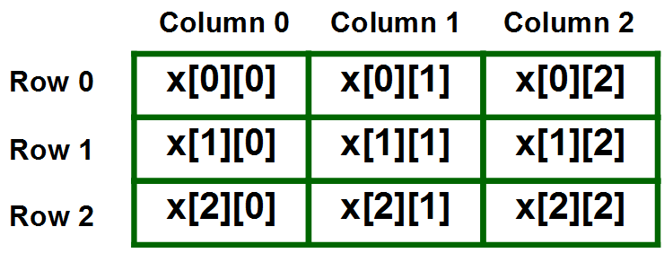<br><sub>Fig 23 - Multidimensional Array - (<a href='https://www.geeksforgeeks.org/multidimensional-arrays-in-java/?ref=lbp'>Work by geeksforgeeks</a>) </sub></div>

<br>

```java

int[][] myNumbers = { {1, 2, 3, 4}, {5, 6, 7} };

```

**myNumbers** is now an array with two arrays as its elements.

To access the elements of the **myNumbers** array, specify two indexes: one for the array, and one for the element inside that array. This example accesses the third element (2) in the second array (1) of myNumbers:

```java

int[][] myNumbers = { {1, 2, 3, 4}, {5, 6, 7} };
int x = myNumbers[1][2];
System.out.println(x); // Outputs 7

```

We can also use a ```for loop``` inside another ```for loop``` to get the elements of a two-dimensional array (we still have to point to the two indexes):

```java

public class Main {
  public static void main(String[] args) {
    int[][] myNumbers = { {1, 2, 3, 4}, {5, 6, 7} };
    for (int i = 0; i < myNumbers.length; ++i) {
      for(int j = 0; j < myNumbers[i].length; ++j) {
        System.out.println(myNumbers[i][j]);
      }
    }
  }
}

```

Example: Create a Matrix

```java

import java.util.Scanner;

public class Main {

	public static void main(String[] args) {
		
		Scanner sc = new Scanner(System.in);
		
		int M, N, i, j;
		
		System.out.print("How many rows the matrix will be? ");
		M = sc.nextInt();
		System.out.print("How many columns the matrix will be? ");
		N = sc.nextInt();
		
		int[][] mat = new int[M][N];
		
		for (i = 0; i < M; i++) {
			for (j = 0; j < N; j++) {
				System.out.print("Element [" + i + "," + j + "]: ");
				mat[i][j] = sc.nextInt();
			}
		}
		
		System.out.println("\nTyped Matrix:");
		for (i = 0; i < M; i++) {
			for (j = 0; j < N; j++) {
				System.out.print(mat[i][j] + " ");	
			}
			System.out.println();
		}
		
		sc.close();
	}

}

```

#### <a name="chapter4part5.1"></a>Chapter 4 - Part 5.1: Understanding Multidimensional Arrays

A multidimensional array is essentially an array of arrays. The most common type is a two-dimensional array, which can be visualized as a table with rows and columns. You can also have arrays with three or more dimensions, although they are less frequently used.

**Declaring Multidimensional Arrays**

To declare a two-dimensional array, you use the following syntax:

```
dataType[][] arrayName;
```

For example, to declare a two-dimensional array of integers named matrix, you would write:

```java
int[][] matrix;
```

This declaration only creates a reference to an array. To actually create the array, you need to allocate memory for it.

**Initializing Multidimensional Arrays**

There are several ways to initialize a multidimensional array:

- **Using new keyword**: You can specify the number of rows and columns when creating the array:

```java
int[][] matrix = new int[3][4]; // Creates a 3x4 matrix (3 rows, 4 columns)
```

This creates a matrix where all elements are initialized to the default value for the int data type, which is 0.

- **Using an initializer list**: You can directly provide the values for the array elements:

```java
int[][] matrix = {
    {1, 2, 3, 4},
    {5, 6, 7, 8},
    {9, 10, 11, 12}
};
```

This creates a 3x4 matrix with the specified values. Each inner set of curly braces represents a row in the matrix.

- **Combining declaration and initialization**:

```java
int[][] matrix;
matrix = new int[][] {
    {1, 2, 3, 4},
    {5, 6, 7, 8},
    {9, 10, 11, 12}
};
```

This is equivalent to the previous method but separates the declaration and initialization steps.

**Accessing Array Elements**

To access an element in a two-dimensional array, you use two indices: the row index and the column index. Array indices start at 0.

```java
int[][] matrix = {
    {1, 2, 3, 4},
    {5, 6, 7, 8},
    {9, 10, 11, 12}
};

int element = matrix[1][2]; // Accesses the element at row 1, column 2 (value is 7)
System.out.println(element); // Output: 7

matrix[0][0] = 100; // Modifies the element at row 0, column 0
System.out.println(matrix[0][0]); // Output: 100
```

**Looping Through Multidimensional Arrays**

You typically use nested loops to iterate through all the elements of a multidimensional array. The outer loop iterates through the rows, and the inner loop iterates through the columns.

```java
int[][] matrix = {
    {1, 2, 3, 4},
    {5, 6, 7, 8},
    {9, 10, 11, 12}
};

for (int i = 0; i < matrix.length; i++) { // Iterate through rows
    for (int j = 0; j < matrix[i].length; j++) { // Iterate through columns in the current row
        System.out.print(matrix[i][j] + " ");
    }
    System.out.println(); // Move to the next line after printing each row
}
```

This code will print the following output:

```
1 2 3 4
5 6 7 8
9 10 11 12
```

**Example: Game Board**

Consider a simple game board represented by a 2D array:

```java
char[][] board = new char[3][3]; // Creates a 3x3 board

// Initialize the board with empty spaces
for (int i = 0; i < board.length; i++) {
    for (int j = 0; j < board[i].length; j++) {
        board[i][j] = ' ';
    }
}

// Place an 'X' on the board
board[1][1] = 'X';

// Print the board
for (int i = 0; i < board.length; i++) {
    for (int j = 0; j < board[i].length; j++) {
        System.out.print(board[i][j] + " | ");
    }
    System.out.println();
    if (i < board.length - 1) {
        System.out.println("---------");
    }
}
```

This code will output:

```
  |   |   |
---------
  | X |   |
---------
  |   |   |
```

**Ragged Arrays**

In Java, you can create "ragged" or "jagged" arrays, where each row can have a different number of columns. This is achieved by creating an array of arrays where the inner arrays have different lengths.

```java
int[][] raggedArray = new int[3][]; // Creates an array with 3 rows, but no columns are defined yet

raggedArray[0] = new int[4]; // Row 0 has 4 columns
raggedArray[1] = new int[2]; // Row 1 has 2 columns
raggedArray[2] = new int[5]; // Row 2 has 5 columns

// Initialize the ragged array
for (int i = 0; i < raggedArray.length; i++) {
    for (int j = 0; j < raggedArray[i].length; j++) {
        raggedArray[i][j] = i * 10 + j;
    }
}

// Print the ragged array
for (int i = 0; i < raggedArray.length; i++) {
    for (int j = 0; j < raggedArray[i].length; j++) {
        System.out.print(raggedArray[i][j] + " ");
    }
    System.out.println();
}
```

This code will output:

```
0 1 2 3
10 11
20 21 22 23 24
```

**Three-Dimensional Arrays (and Beyond)**

While less common, Java supports arrays with three or more dimensions. A three-dimensional array can be thought of as a cube of data.

```java
int[][][] cube = new int[3][3][3];

// Initialize the cube
for (int i = 0; i < cube.length; i++) {
    for (int j = 0; j < cube[i].length; j++) {
        for (int k = 0; k < cube[i][j].length; k++) {
            cube[i][j][k] = i * 100 + j * 10 + k;
        }
    }
}

// Access an element
System.out.println(cube[1][2][0]); // Output: 120
```

The same principles apply to arrays with higher dimensions: you declare them with additional square brackets, initialize them using nested loops or initializer lists, and access elements using multiple indices.

#### <a name="chapter4part5.2"></a>Chapter 4 - Part 5.2: Practical Examples and Demonstrations

**Example 1: Calculating the Sum of Elements in a Matrix**

```java
public class MatrixSum {
    public static void main(String[] args) {
        int[][] matrix = {
            {1, 2, 3},
            {4, 5, 6},
            {7, 8, 9}
        };

        int sum = 0;
        for (int i = 0; i < matrix.length; i++) {
            for (int j = 0; j < matrix[i].length; j++) {
                sum += matrix[i][j];
            }
        }

        System.out.println("Sum of all elements: " + sum); // Output: Sum of all elements: 45
    }
}
```

This example demonstrates how to calculate the sum of all elements in a two-dimensional array using nested loops.

**Example 2: Finding the Maximum Element in a Matrix**

```java
public class MatrixMax {
    public static void main(String[] args) {
        int[][] matrix = {
            {1, 20, 3},
            {4, 5, 60},
            {70, 8, 9}
        };

        int max = matrix[0][0]; // Initialize max with the first element
        for (int i = 0; i < matrix.length; i++) {
            for (int j = 0; j < matrix[i].length; j++) {
                if (matrix[i][j] > max) {
                    max = matrix[i][j];
                }
            }
        }

        System.out.println("Maximum element: " + max); // Output: Maximum element: 70
    }
}
```

This example shows how to find the maximum element in a two-dimensional array by iterating through all elements and comparing them to the current maximum.

**Example 3: Matrix Multiplication**

```java
public class MatrixMultiplication {
    public static void main(String[] args) {
        int[][] matrixA = {
            {1, 2},
            {3, 4}
        };

        int[][] matrixB = {
            {5, 6},
            {7, 8}
        };

        int rowsA = matrixA.length;
        int colsA = matrixA[0].length;
        int rowsB = matrixB.length;
        int colsB = matrixB[0].length;

        if (colsA != rowsB) {
            System.out.println("Matrices cannot be multiplied.");
            return;
        }

        int[][] result = new int[rowsA][colsB];

        for (int i = 0; i < rowsA; i++) {
            for (int j = 0; j < colsB; j++) {
                for (int k = 0; k < colsA; k++) {
                    result[i][j] += matrixA[i][k] * matrixB[k][j];
                }
            }
        }

        // Print the result matrix
        System.out.println("Resultant Matrix:");
        for (int i = 0; i < rowsA; i++) {
            for (int j = 0; j < colsB; j++) {
                System.out.print(result[i][j] + " ");
            }
            System.out.println();
        }
    }
}
```

This example demonstrates matrix multiplication, a common operation in linear algebra and computer graphics. It highlights the use of nested loops to perform the necessary calculations.

#### <a name="chapter4part6"></a>Chapter 4 - Part 6: Introduction to Strings: Working with Text

Strings are fundamental to programming, as they allow us to represent and manipulate text, which is a crucial part of almost any application. From displaying messages to users to processing data from files, strings are everywhere. This lesson will introduce you to the concept of strings in Java, how to create them, and some of the basic operations you can perform on them. Understanding strings is essential for building more complex and interactive programs.

#### <a name="chapter4part6.1"></a>Chapter 4 - Part 6.1: Creating Strings

In Java, a string is an object that represents a sequence of characters. Unlike primitive data types like int or boolean, strings are objects of the String class. There are two primary ways to create strings in Java: using string literals and using the new keyword.

**String Literals**

The most common way to create a string is by using a string literal. A string literal is a sequence of characters enclosed in double quotes.

```java
String message = "Hello, world!";
String name = "Alice";
String emptyString = ""; // An empty string
```

When you create a string literal, Java checks if a string with the same content already exists in the string pool. The string pool is a special memory area in the Java Virtual Machine (JVM) that stores string literals. If the string already exists, Java will simply return a reference to the existing string in the pool. If it doesn't exist, Java will create a new string object in the pool and return a reference to it. This mechanism is called string interning and it helps to save memory and improve performance.

**Using the new Keyword**

You can also create a string using the new keyword, just like creating any other object in Java.

```java
String message = new String("Hello, world!");
String name = new String("Alice");
```

When you use the new keyword, Java always creates a new string object in the heap memory, regardless of whether a string with the same content already exists in the string pool. This means that using new to create strings is generally less efficient than using string literals.

**Example**:

```java
String str1 = "Hello";
String str2 = "Hello";
String str3 = new String("Hello");
String str4 = new String("Hello");

System.out.println(str1 == str2); // Output: true (both refer to the same string in the string pool)
System.out.println(str1 == str3); // Output: false (str1 is in the string pool, str3 is in the heap)
System.out.println(str3 == str4); // Output: false (both are different objects in the heap)
```

In the above example, str1 and str2 both refer to the same string object in the string pool. However, str3 and str4 are different string objects in the heap memory, even though they have the same content. This distinction is important when comparing strings, as we'll see later.

#### <a name="chapter4part6.2"></a>Chapter 4 - Part 6.2: String Manipulation

Strings in Java are immutable, which means that once a string object is created, its value cannot be changed. Any operation that appears to modify a string actually creates a new string object. This immutability has several advantages, such as thread safety and the ability to cache string hash codes.

**Concatenation**

String concatenation is the process of joining two or more strings together to create a new string. In Java, you can concatenate strings using the + operator or the concat() method.

**Using the + Operator**

The + operator is the most common and convenient way to concatenate strings in Java.

```java
String firstName = "John";
String lastName = "Doe";
String fullName = firstName + " " + lastName; // Concatenating with a space in between
System.out.println(fullName); // Output: John Doe
```

When you use the + operator to concatenate a string with a value of another data type (e.g., an integer or a boolean), Java automatically converts the other value to a string before performing the concatenation.

```java
String age = "30";
String message = "He is " + age + " years old.";
System.out.println(message); // Output: He is 30 years old.
```

**Using the concat() Method**

The String class also provides a concat() method that you can use to concatenate strings.

```java
String str1 = "Hello";
String str2 = " World";
String result = str1.concat(str2);
System.out.println(result); // Output: Hello World
```

The concat() method takes a single string argument and returns a new string that is the result of concatenating the original string with the argument.

**Performance Considerations**:

While both the + operator and the concat() method can be used for string concatenation, the + operator is generally more efficient, especially when concatenating multiple strings. This is because the Java compiler optimizes the + operator to use a StringBuilder object internally, which is more efficient for performing multiple concatenations. For simple concatenations, the performance difference is negligible. However, when performing a large number of concatenations in a loop, using a StringBuilder directly can significantly improve performance. We will cover StringBuilder in a later lesson.

**Substrings**

A substring is a contiguous sequence of characters within a string. The String class provides the substring() method to extract substrings from a string.

The substring() method has two overloaded versions:

- ```substring(int beginIndex)```: Returns a substring starting from the specified beginIndex to the end of the string.
- ```substring(int beginIndex, int endIndex)```: Returns a substring starting from the specified beginIndex up to (but not including) the specified endIndex.

```java
String message = "Hello, world!";

String sub1 = message.substring(7); // Substring from index 7 to the end
System.out.println(sub1); // Output: world!

String sub2 = message.substring(0, 5); // Substring from index 0 up to (but not including) index 5
System.out.println(sub2); // Output: Hello
```

**Important Notes**:

- The beginIndex is inclusive, meaning the character at that index is included in the substring.
- The endIndex is exclusive, meaning the character at that index is not included in the substring.
- The beginIndex must be between 0 and the length of the string (inclusive).
- The endIndex must be between 0 and the length of the string (inclusive).
- The beginIndex must be less than or equal to the endIndex.
- If any of these conditions are not met, the substring() method will throw a StringIndexOutOfBoundsException.

**Length**

The length() method returns the number of characters in a string.

```java
String message = "Hello, world!";
int length = message.length();
System.out.println(length); // Output: 13
```

The length of a string includes all characters, including spaces and punctuation marks.

#### <a name="chapter4part6.3"></a>Chapter 4 - Part 6.3: String Comparison: equals() vs. ==

Comparing strings in Java can be tricky because strings are objects. You need to understand the difference between comparing the content of strings and comparing the references to string objects.

**The equals() Method**

The equals() method compares the content of two strings. It returns true if the strings have the same sequence of characters, and false otherwise.

```java
String str1 = "Hello";
String str2 = "Hello";
String str3 = new String("Hello");

System.out.println(str1.equals(str2)); // Output: true (same content)
System.out.println(str1.equals(str3)); // Output: true (same content)
```

The equals() method is case-sensitive, meaning that "Hello" is not equal to "hello". If you want to perform a case-insensitive comparison, you can use the equalsIgnoreCase() method.

```java
String str1 = "Hello";
String str2 = "hello";

System.out.println(str1.equals(str2)); // Output: false (different case)
System.out.println(str1.equalsIgnoreCase(str2)); // Output: true (same content, ignoring case)
```

**The == Operator**

The == operator compares the references of two string objects. It returns true if the two variables refer to the same object in memory, and false otherwise.

```java
String str1 = "Hello";
String str2 = "Hello";
String str3 = new String("Hello");

System.out.println(str1 == str2); // Output: true (both refer to the same string in the string pool)
System.out.println(str1 == str3); // Output: false (str1 is in the string pool, str3 is in the heap)
```

As we saw earlier, string literals are interned in the string pool, so if you create two string literals with the same content, they will both refer to the same object in memory. However, if you create a string using the new keyword, it will always create a new object in the heap memory, even if a string with the same content already exists in the string pool.

**Best Practice**:

Always use the equals() method to compare the content of strings. Avoid using the == operator unless you specifically need to check if two variables refer to the same object in memory.


#### <a name="chapter4part6.4"></a>Chapter 4 - Part 6.4: String Methods: ```toUpperCase()```, ```toLowerCase()```, ```trim()```

The String class provides a variety of methods for manipulating strings. Here are three commonly used methods:

**```toUpperCase()```**

The toUpperCase() method converts all characters in a string to uppercase.

```java
String message = "Hello, world!";
String upperCaseMessage = message.toUpperCase();
System.out.println(upperCaseMessage); // Output: HELLO, WORLD!
```

**```toLowerCase()```**

The toLowerCase() method converts all characters in a string to lowercase.

```java
String message = "Hello, world!";
String lowerCaseMessage = message.toLowerCase();
System.out.println(lowerCaseMessage); // Output: hello, world!
```

**```trim()```**

The trim() method removes any leading and trailing whitespace from a string. Whitespace includes spaces, tabs, and newline characters.

```java
String message = "   Hello, world!   ";
String trimmedMessage = message.trim();
System.out.println(trimmedMessage); // Output: Hello, world!
```

**Example demonstrating all three methods**:

```java
String input = "  Java Programming  ";
String trimmedInput = input.trim(); // Remove leading/trailing spaces
String lowerCaseInput = trimmedInput.toLowerCase(); // Convert to lowercase
String upperCaseInput = trimmedInput.toUpperCase(); // Convert to uppercase

System.out.println("Original: " + input);
System.out.println("Trimmed: " + trimmedInput);
System.out.println("Lowercase: " + lowerCaseInput);
System.out.println("Uppercase: " + upperCaseInput);
```

#### <a name="chapter4part7"></a>Chapter 4 - Part 7: String Manipulation: Concatenation, Substrings, Length

Strings are fundamental to programming, representing and manipulating text. In Java, strings are objects, and the String class provides numerous methods for working with them. This lesson focuses on three essential string manipulation techniques: concatenation, extracting substrings, and determining string length. Mastering these techniques is crucial for tasks such as building dynamic messages, parsing data, and validating user input.

#### <a name="chapter4part7.1"></a>Chapter 4 - Part 7.1: String Concatenation

String concatenation is the process of combining two or more strings into a single, longer string. Java provides two primary ways to concatenate strings: the + operator and the concat() method.

**Using the + Operator**

The + operator is the most common and straightforward way to concatenate strings in Java. When used with strings, the + operator creates a new string that is the result of joining the operands.

```java
public class StringConcatenation {
    public static void main(String[] args) {
        String firstName = "John";
        String lastName = "Doe";
        String fullName = firstName + " " + lastName; // Concatenating with a space in between
        System.out.println(fullName); // Output: John Doe

        String greeting = "Hello, " + fullName + "!";
        System.out.println(greeting); // Output: Hello, John Doe!

        int age = 30;
        String ageMessage = "Age: " + age; // Concatenating a string with an integer
        System.out.println(ageMessage); // Output: Age: 30
    }
}
```

In the example above, the + operator is used to combine string literals, string variables, and even an integer with a string. Java automatically converts the integer to its string representation before concatenation.

**Important Note**: When using the + operator for concatenation within loops, especially with a large number of iterations, it can lead to performance issues because strings are immutable in Java. Each concatenation creates a new String object, which can be inefficient. In such cases, using StringBuilder or StringBuffer (discussed later in the course) is recommended.

**Using the concat() Method**

The String class provides a concat() method that performs string concatenation. This method takes a single string argument and returns a new string that is the result of appending the argument to the original string.

```java
public class StringConcatMethod {
    public static void main(String[] args) {
        String str1 = "Hello";
        String str2 = " World";
        String result = str1.concat(str2);
        System.out.println(result); // Output: Hello World

        String str3 = "Java";
        String str4 = str3.concat(" Programming");
        System.out.println(str4); // Output: Java Programming
    }
}
```

The concat() method is functionally equivalent to the + operator for simple string concatenation. However, the + operator is generally preferred for its readability and ease of use.

**Example**:

Let's say you're building a system that generates personalized email greetings. You can use string concatenation to combine a generic greeting with a user's name:

```java
public class EmailGreeting {
    public static void main(String[] args) {
        String baseGreeting = "Dear ";
        String userName = "Alice";
        String salutation = ",";
        String closing = "\nThank you,\nThe Team";

        String fullGreeting = baseGreeting + userName + salutation + closing;
        System.out.println(fullGreeting);
    }
}
```

This example demonstrates how concatenation can be used to dynamically create personalized messages.

#### <a name="chapter4part7.2"></a>Chapter 4 - Part 7.2: Extracting Substrings

A substring is a contiguous sequence of characters within a string. The String class provides methods to extract substrings based on starting and ending indices.

**The ```substring()``` Method**

The substring() method has two overloaded forms:

- ```substring(int beginIndex)```: Returns a substring starting from the specified beginIndex to the end of the string.
- ```substring(int beginIndex, int endIndex)```: Returns a substring starting from the specified beginIndex up to (but not including) the specified endIndex.

**Important Notes**:

- String indices are zero-based, meaning the first character is at index 0.
- The beginIndex is inclusive, while the endIndex is exclusive.
- If beginIndex is negative or greater than the string length, an IndexOutOfBoundsException is thrown.
- If endIndex is less than beginIndex or greater than the string length, an IndexOutOfBoundsException is thrown.

```java
public class SubstringExample {
    public static void main(String[] args) {
        String message = "Hello, World!";

        // Extracting a substring from index 7 to the end
        String sub1 = message.substring(7);
        System.out.println(sub1); // Output: World!

        // Extracting a substring from index 0 to index 5 (exclusive)
        String sub2 = message.substring(0, 5);
        System.out.println(sub2); // Output: Hello

        // Extracting "World" from the string
        String sub3 = message.substring(7, 12);
        System.out.println(sub3); // Output: World
    }
}
```

**Example**:

Suppose you have a string containing a file path, and you want to extract the file name. You can use the substring() method in conjunction with the lastIndexOf() method (which will be covered in a later lesson) to achieve this.

```java
public class FilePathExample {
    public static void main(String[] args) {
        String filePath = "/path/to/my/document.txt";
        int lastSlashIndex = filePath.lastIndexOf('/'); // Find the last occurrence of '/'
        String fileName = filePath.substring(lastSlashIndex + 1); // Extract the file name
        System.out.println(fileName); // Output: document.txt
    }
}
```

This example demonstrates how substrings can be used to parse and extract specific parts of a string.

#### <a name="chapter4part7.3"></a>Chapter 4 - Part 7.3: Determining String Length

The length of a string is the number of characters it contains. The String class provides the length() method to determine the length of a string.

**The ```length()``` Method**

The length() method returns the number of characters in the string.

```java
public class StringLengthExample {
    public static void main(String[] args) {
        String str1 = "Hello";
        int len1 = str1.length();
        System.out.println(len1); // Output: 5

        String str2 = "This is a sentence.";
        int len2 = str2.length();
        System.out.println(len2); // Output: 19

        String str3 = ""; // Empty string
        int len3 = str3.length();
        System.out.println(len3); // Output: 0
    }
}
```

Important Note: The length() method returns the number of characters, not the number of bytes. In Java, strings are represented using Unicode, where each character can be represented by one or more bytes.

**Example**:

You might want to validate user input to ensure it meets certain length requirements. For example, you might require a password to be at least 8 characters long.

```java
import java.util.Scanner;

public class PasswordValidation {
    public static void main(String[] args) {
        Scanner scanner = new Scanner(System.in);
        System.out.print("Enter your password: ");
        String password = scanner.nextLine();

        int minLength = 8;
        if (password.length() >= minLength) {
            System.out.println("Password is valid.");
        } else {
            System.out.println("Password must be at least " + minLength + " characters long.");
        }
        scanner.close();
    }
}
```

This example demonstrates how the length() method can be used for input validation.

#### <a name="chapter4part8"></a>Chapter 4 - Part 8: String Comparison: equals() vs. ==

String comparison is a fundamental operation in Java programming. It allows you to determine if two strings are the same or different, which is crucial for various tasks such as data validation, searching, and sorting. However, comparing strings in Java can be tricky because of the way strings are handled as objects. This lesson will delve into the nuances of string comparison in Java, focusing on the equals() method and the == operator, highlighting their differences and proper usage.

#### <a name="chapter4part8.1"></a>Chapter 4 - Part 8.1: Understanding String Immutability and the String Pool

Before diving into the comparison methods, it's essential to understand that strings in Java are immutable. This means that once a string object is created, its value cannot be changed. Any operation that appears to modify a string actually creates a new string object.

Java also uses a "string pool" (also known as the string intern pool) to optimize memory usage. When a string literal is created (e.g., "hello"), the JVM first checks if a string with the same value already exists in the string pool. If it does, the new string variable will point to the existing string object in the pool. If not, a new string object is created in the pool.

#### <a name="chapter4part8.2"></a>Chapter 4 - Part 8.2: The equals() Method: Comparing String Content

The equals() method is the correct way to compare the content of two strings in Java. It checks if the two strings have the exact same sequence of characters, regardless of whether they are stored in the same memory location.

**Syntax and Usage**

The equals() method is called on a string object and takes another string object as an argument:

```java
String str1 = "hello";
String str2 = "hello";

boolean isEqual = str1.equals(str2); // Returns true
```

**Case Sensitivity**

The equals() method is case-sensitive. This means that "Hello" and "hello" are considered different strings.

```java
String str1 = "Hello";
String str2 = "hello";

boolean isEqual = str1.equals(str2); // Returns false
```

**The equalsIgnoreCase() Method**

If you need to compare strings without regard to case, you can use the equalsIgnoreCase() method.

```java
String str1 = "Hello";
String str2 = "hello";

boolean isEqual = str1.equalsIgnoreCase(str2); // Returns true
```

**Comparing with Null**

It's important to be careful when using equals() with potentially null strings. Calling equals() on a null reference will result in a NullPointerException. To avoid this, you can either check for null explicitly or use the Objects.equals() method (introduced in Java 7), which handles null checks for you.

```java
String str1 = null;
String str2 = "hello";

// Avoid NullPointerException
boolean isEqual1 = (str1 != null) && str1.equals(str2); // Returns false

// Using Objects.equals()
boolean isEqual2 = java.util.Objects.equals(str1, str2); // Returns false
```

**Examples**

```java
public class StringEqualsExample {
    public static void main(String[] args) {
        String str1 = "Java";
        String str2 = "Java";
        String str3 = new String("Java");
        String str4 = "Python";

        System.out.println("str1 equals str2: " + str1.equals(str2)); // true
        System.out.println("str1 equals str3: " + str1.equals(str3)); // true
        System.out.println("str1 equals str4: " + str1.equals(str4)); // false

        String nullStr = null;
        String str5 = "test";

        //System.out.println("nullStr equals str5: " + nullStr.equals(str5)); // NullPointerException
        System.out.println("Objects.equals(nullStr, str5): " + java.util.Objects.equals(nullStr, str5)); // false
    }
}
```

#### <a name="chapter4part8.3"></a>Chapter 4 - Part 8.3: The == Operator: Comparing Object References

The == operator compares the references of two objects. In the context of strings, it checks if two string variables point to the same memory location (i.e., the same object). It does not compare the content of the strings.

**Behavior with String Literals**

When you create string literals, Java often uses the string pool. If two string literals have the same value, they will usually point to the same object in the string pool, and == will return true.

```java
String str1 = "hello";
String str2 = "hello";

boolean areSame = (str1 == str2); // Returns true because both point to the same object in the string pool
```

**Behavior with ```new String()```**

However, when you create a string object using the new String() constructor, a new string object is created in memory, even if a string with the same value already exists in the string pool. In this case, == will return false because the two variables point to different objects.

```java
String str1 = "hello";
String str2 = new String("hello");

boolean areSame = (str1 == str2); // Returns false because str2 is a new object
```

**Examples**

```java
public class StringEqualsOperatorExample {
    public static void main(String[] args) {
        String str1 = "Java";
        String str2 = "Java";
        String str3 = new String("Java");

        System.out.println("str1 == str2: " + (str1 == str2)); // true (both point to the same string in the pool)
        System.out.println("str1 == str3: " + (str1 == str3)); // false (str3 is a new object)
    }
}
```

#### <a name="chapter4part8.4"></a>Chapter 4 - Part 8.4: When to Use ```equals()``` vs. ```==```

- **```Use equals() (or equalsIgnoreCase())``` to compare the content of strings**. This is almost always what you want to do.

- **Avoid using == to compare strings unless you specifically need to check if two variables point to the exact same object in memory**. This is rarely the case in typical string manipulation scenarios.

#### <a name="chapter4part9"></a>Chapter 4 - Part 9: String Methods: toUpperCase(), toLowerCase(), trim()

Strings in Java are immutable sequences of characters, and the String class provides a rich set of methods for manipulating them. This lesson focuses on three fundamental string methods: toUpperCase(), toLowerCase(), and trim(). These methods are essential for standardizing and cleaning string data, which is a common task in many applications. Understanding how to use these methods effectively will enable you to write more robust and maintainable code.

#### <a name="chapter4part9.1"></a>Chapter 4 - Part 9.1: Understanding toUpperCase() and toLowerCase()

**Understanding toUpperCase() and toLowerCase()**

The toUpperCase() and toLowerCase() methods are used to convert a string to uppercase and lowercase, respectively. These methods are particularly useful when you need to perform case-insensitive comparisons or when you need to format strings for display purposes.

**```toUpperCase()```**

The toUpperCase() method converts all characters in a string to uppercase. It returns a new string with all characters converted to their uppercase equivalents. If a character does not have an uppercase equivalent, it remains unchanged.

```java
public class ToUpperCaseExample {
    public static void main(String[] args) {
        String str = "Hello World";
        String upperCaseStr = str.toUpperCase();
        System.out.println("Original String: " + str);
        System.out.println("Uppercase String: " + upperCaseStr);
    }
}
```

In this example, the toUpperCase() method converts the string "Hello World" to "HELLO WORLD".

**```toLowerCase()```**

The toLowerCase() method converts all characters in a string to lowercase. It returns a new string with all characters converted to their lowercase equivalents. If a character does not have a lowercase equivalent, it remains unchanged.

```java
public class ToLowerCaseExample {
    public static void main(String[] args) {
        String str = "Hello World";
        String lowerCaseStr = str.toLowerCase();
        System.out.println("Original String: " + str);
        System.out.println("Lowercase String: " + lowerCaseStr);
    }
}
```

In this example, the toLowerCase() method converts the string "Hello World" to "hello world".

**Locale-Specific Case Conversion**

Both toUpperCase() and toLowerCase() have overloaded versions that accept a Locale object as an argument. The Locale object specifies the cultural context for the conversion. This is important because the rules for case conversion can vary depending on the language and region.

```java
import java.util.Locale;

public class LocaleCaseConversionExample {
    public static void main(String[] args) {
        String str = "turkey";
        String upperCaseStrDefault = str.toUpperCase();
        String upperCaseStrTurkish = str.toUpperCase(new Locale("tr", "TR"));

        System.out.println("Original String: " + str);
        System.out.println("Uppercase String (Default Locale): " + upperCaseStrDefault);
        System.out.println("Uppercase String (Turkish Locale): " + upperCaseStrTurkish);
    }
}
```

In this example, the toUpperCase() method is called with and without a Locale object. The default locale conversion might not correctly handle characters specific to the Turkish language. Using the Turkish locale ensures that the conversion is performed according to Turkish language rules. The output of this code demonstrates the difference: the default locale might not convert the "i" correctly, while the Turkish locale will.

**Practical Examples**

- **User Input Normalization**: When accepting user input, you might want to convert the input to a consistent case before processing it. For example, if you are checking if a user has entered "yes" to confirm an action, you can convert the input to lowercase before comparing it to "yes".

```java
import java.util.Scanner;

public class UserInputNormalization {
    public static void main(String[] args) {
        Scanner scanner = new Scanner(System.in);
        System.out.println("Do you want to continue? (yes/no)");
        String answer = scanner.nextLine();
        String normalizedAnswer = answer.toLowerCase();

        if (normalizedAnswer.equals("yes")) {
            System.out.println("Continuing...");
        } else {
            System.out.println("Stopping...");
        }
        scanner.close();
    }
}
```

- **Data Standardization**: When processing data from different sources, you might encounter inconsistencies in the case of strings. Converting all strings to a consistent case can help to standardize the data and make it easier to process.

```java
public class DataStandardization {
    public static void main(String[] args) {
        String[] data = {"Apple", "banana", "ORANGE"};
        for (int i = 0; i < data.length; i++) {
            data[i] = data[i].toLowerCase();
        }

        for (String item : data) {
            System.out.println(item);
        }
    }
}
```

#### <a name="chapter4part9.2"></a>Chapter 4 - Part 9.2: Understanding trim()

The trim() method removes leading and trailing whitespace from a string. Whitespace includes spaces, tabs, and newline characters. This method is useful for cleaning up strings that may have unwanted whitespace, such as user input or data read from a file.

**Basic Usage**

The trim() method returns a new string with all leading and trailing whitespace removed. If the string has no leading or trailing whitespace, it returns the original string.

```java
public class TrimExample {
    public static void main(String[] args) {
        String str = "   Hello World   ";
        String trimmedStr = str.trim();
        System.out.println("Original String: \"" + str + "\"");
        System.out.println("Trimmed String: \"" + trimmedStr + "\"");
    }
}
```

In this example, the trim() method removes the leading and trailing spaces from the string " Hello World ".

**Practical Examples**

- **User Input Validation**: When accepting user input, you might want to trim the input to remove any leading or trailing whitespace that the user may have accidentally entered.

```java
import java.util.Scanner;

public class UserInputValidation {
    public static void main(String[] args) {
        Scanner scanner = new Scanner(System.in);
        System.out.println("Enter your username:");
        String username = scanner.nextLine();
        String trimmedUsername = username.trim();

        if (trimmedUsername.isEmpty()) {
            System.out.println("Username cannot be empty.");
        } else {
            System.out.println("Username: " + trimmedUsername);
        }
        scanner.close();
    }
}
```

- **Data Cleaning**: When processing data from different sources, you might encounter strings with leading or trailing whitespace. Trimming these strings can help to ensure that the data is consistent and accurate.

```java
public class DataCleaning {
    public static void main(String[] args) {
        String[] data = {"  Apple", "banana  ", "  Orange  "};
        for (int i = 0; i < data.length; i++) {
            data[i] = data[i].trim();
        }

        for (String item : data) {
            System.out.println("\"" + item + "\"");
        }
    }
}
```

#### <a name="chapter4part9.3"></a>Chapter 4 - Part 9.3: Combining String Methods

You can combine these string methods to perform more complex string manipulations. For example, you can convert a string to lowercase and then trim it to remove any leading or trailing whitespace.

```java
public class CombinedStringMethods {
    public static void main(String[] args) {
        String str = "   Hello World   ";
        String processedStr = str.toLowerCase().trim();
        System.out.println("Original String: \"" + str + "\"");
        System.out.println("Processed String: \"" + processedStr + "\"");
    }
}
```

In this example, the toLowerCase() method is called first to convert the string to lowercase, and then the trim() method is called to remove any leading or trailing whitespace.

## <a name="chapter5"></a>Chapter 5: Object-Oriented Programming (OOP) Fundamentals

#### <a name="chapter5part1"></a>Chapter 5 - Part 1: Introduction to Object-Oriented Programming (OOP)

Object-oriented programming (OOP) is a programming paradigm centered around "objects" that contain both data (attributes) and code (methods) to manipulate that data. It's a fundamental concept in modern software development, enabling developers to create modular, reusable, and maintainable code. Understanding OOP principles is crucial for building complex applications and working effectively in team environments. This lesson introduces the core concepts of OOP, laying the groundwork for more advanced topics in subsequent lessons.

#### <a name="chapter5part1.1"></a>Chapter 5 - Part 1.1: Understanding Classes and Objects

Look at the following illustration to see the difference between class and objects:

<br>

<div align="center">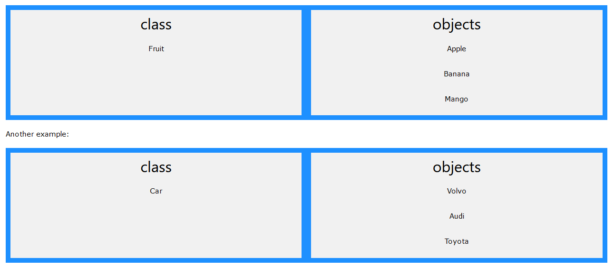<br><sub>Fig 28 - Class and objects - (<a href='https://www.w3schools.com/java/java_oop.asp'>Work by  w3schools</a>) </sub></div>

<br>

So, a class is a template for objects, and an object is an instance of a class.

When the individual objects are created, they inherit all the variables and methods from the class.

At the heart of OOP are classes and objects. A class is a blueprint or a template that defines the characteristics and behaviors of a particular type of object. Think of it as a cookie cutter. An object is an instance of a class. It's a concrete realization of the blueprint. Think of it as the cookie created using the cookie cutter.

**Classes: Blueprints for Objects**

A class defines the attributes (data) and methods (behavior) that its objects will possess.

- **Attributes (Fields)**: These are variables that hold data about the object. They represent the object's state.
- **Methods**: These are functions that define the actions an object can perform. They represent the object's behavior.

Let's consider a simple example: a Dog class.

```java
class Dog {
    // Attributes (Fields)
    String breed;
    String name;
    int age;

    // Methods (Behaviors)
    void bark() {
        System.out.println("Woof!");
    }

    void displayInfo() {
        System.out.println("Name: " + name + ", Breed: " + breed + ", Age: " + age);
    }
}
```

In this example:

- breed, name, and age are attributes (fields) that describe a dog.

- bark() and displayInfo() are methods that define what a dog can do.

**Objects: Instances of Classes**

An object is a specific instance of a class. You create objects from classes using the new keyword.

```java
public class Main {
    public static void main(String[] args) {
        // Creating objects of the Dog class
        Dog dog1 = new Dog();
        dog1.breed = "Golden Retriever";
        dog1.name = "Buddy";
        dog1.age = 3;

        Dog dog2 = new Dog();
        dog2.breed = "Poodle";
        dog2.name = "Coco";
        dog2.age = 5;

        // Calling methods on the objects
        dog1.bark(); // Output: Woof!
        dog1.displayInfo(); // Output: Name: Buddy, Breed: Golden Retriever, Age: 3
        dog2.displayInfo(); // Output: Name: Coco, Breed: Poodle, Age: 5
    }
}
```

In this example:

- dog1 and dog2 are objects of the Dog class.
- We assign values to the attributes of each object.
- We call the bark() and displayInfo() methods on each object.

Each object has its own unique set of attribute values. dog1 has a different name, breed, and age than dog2.

#### <a name="chapter5part1.2"></a>Chapter 5 - Part 1.2: Defining Classes: Attributes (Fields) and Behaviors (Methods)

Let's delve deeper into defining classes, focusing on attributes (fields) and behaviors (methods).

**Attributes (Fields)**

Attributes represent the data associated with an object. They are declared as variables within the class. Each object has its own copy of these variables.

- **Data Types**: Attributes can be of any valid Java data type (e.g., int, double, String, boolean, or even other classes).
- **Naming Conventions**: Attribute names typically follow the camelCase convention (e.g., firstName, accountBalance).

Consider a Car class:

```java
class Car {
    String make;
    String model;
    int year;
    String color;
    double currentSpeed;
}
```

Here, make, model, year, color, and currentSpeed are attributes that describe a car.

**Methods (Behaviors)**

Methods define the actions an object can perform. They are declared as functions within the class.

- **Method Signature**: A method signature consists of the method name, parameters (if any), and return type.
- **Return Type**: A method can return a value (e.g., int, String, void if it doesn't return anything).
- **Parameters**: Methods can accept input values through parameters.

Extending the Car class:

```java
class Car {
    String make;
    String model;
    int year;
    String color;
    double currentSpeed;

    void accelerate(double increment) {
        currentSpeed += increment;
        System.out.println("Accelerating. Current speed: " + currentSpeed);
    }

    void brake(double decrement) {
        currentSpeed -= decrement;
        if (currentSpeed < 0) {
            currentSpeed = 0;
        }
        System.out.println("Braking. Current speed: " + currentSpeed);
    }

    void displayCarInfo() {
        System.out.println("Make: " + make + ", Model: " + model + ", Year: " + year + ", Color: " + color);
    }
}
```

In this example:

- accelerate() and brake() are methods that modify the currentSpeed attribute.
- displayCarInfo() is a method that displays the car's information.

#### <a name="chapter5part1.3"></a>Chapter 5 - Part 1.3: Creating Objects: Instantiating Classes

Creating an object from a class is called instantiation. You use the new keyword followed by the class name and parentheses () to create an object.

```java
Car myCar = new Car(); // Creates a new Car object
```

This line of code does the following:

- Declares a variable named myCar of type Car.
- Uses the new keyword to allocate memory for a new Car object.
- Calls the class's constructor (we'll discuss constructors shortly) to initialize the object.
- Assigns the reference to the newly created object to the myCar variable.

You can then access the object's attributes and methods using the dot operator (.).

```java
myCar.make = "Toyota";
myCar.model = "Camry";
myCar.year = 2023;
myCar.color = "Silver";
myCar.currentSpeed = 0;

myCar.displayCarInfo(); // Output: Make: Toyota, Model: Camry, Year: 2023, Color: Silver
myCar.accelerate(30); // Output: Accelerating. Current speed: 30.0
```

#### <a name="chapter5part1.4"></a>Chapter 5 - Part 1.4: Accessing Object Attributes and Calling Methods

As shown in the previous section, you use the dot operator (.) to access an object's attributes and call its methods.

- Accessing Attributes: objectName.attributeName
- Calling Methods: objectName.methodName(arguments)

Let's illustrate this with a Rectangle class:

```java
class Rectangle {
    double length;
    double width;

    double calculateArea() {
        return length * width;
    }

    double calculatePerimeter() {
        return 2 * (length + width);
    }
}

public class Main {
    public static void main(String[] args) {
        Rectangle myRectangle = new Rectangle();
        myRectangle.length = 10;
        myRectangle.width = 5;

        double area = myRectangle.calculateArea();
        double perimeter = myRectangle.calculatePerimeter();

        System.out.println("Area: " + area); // Output: Area: 50.0
        System.out.println("Perimeter: " + perimeter); // Output: Perimeter: 30.0
    }
}
```

In this example:

- We access the length and width attributes of the myRectangle object.
- We call the calculateArea() and calculatePerimeter() methods on the myRectangle object.

#### <a name="chapter5part1.5"></a>Chapter 5 - Part 1.5: Constructors: Initializing Objects

A constructor is a special method that is automatically called when an object is created. Its primary purpose is to initialize the object's attributes.

- **Name**: A constructor has the same name as the class.
- **No Return Type**: A constructor does not have a return type (not even void).
- **Default Constructor**: If you don't define a constructor in your class, Java provides a default constructor (with no parameters).
- **Parameterized Constructors**: You can define constructors with parameters to initialize the object with specific values.

Let's add a constructor to the Car class:

```java
class Car {
    String make;
    String model;
    int year;
    String color;
    double currentSpeed;

    // Constructor
    Car(String make, String model, int year, String color) {
        this.make = make;
        this.model = model;
        this.year = year;
        this.color = color;
        this.currentSpeed = 0; // Initialize currentSpeed to 0
    }

    void accelerate(double increment) {
        currentSpeed += increment;
        System.out.println("Accelerating. Current speed: " + currentSpeed);
    }

    void brake(double decrement) {
        currentSpeed -= decrement;
        if (currentSpeed < 0) {
            currentSpeed = 0;
        }
        System.out.println("Braking. Current speed: " + currentSpeed);
    }

    void displayCarInfo() {
        System.out.println("Make: " + make + ", Model: " + model + ", Year: " + year + ", Color: " + color);
    }
}

public class Main {
    public static void main(String[] args) {
        // Creating a Car object using the constructor
        Car myCar = new Car("Toyota", "Camry", 2023, "Silver");

        myCar.displayCarInfo(); // Output: Make: Toyota, Model: Camry, Year: 2023, Color: Silver
        myCar.accelerate(50); // Output: Accelerating. Current speed: 50.0
    }
}
```

In this example:

- We define a constructor that takes make, model, year, and color as parameters.
- Inside the constructor, we initialize the object's attributes with the provided values.
- When creating the myCar object, we pass the initial values to the constructor.

#### <a name="chapter5part1.6"></a>Chapter 5 - Part 1.6: The this Keyword: Referring to the Current Object

The this keyword is a reference to the current object. It's used to:

- **Differentiate between instance variables and local variables**: When a method parameter has the same name as an instance variable, you can use this to refer to the instance variable.
- **Call one constructor from another**: Within a constructor, you can use this() to call another constructor of the same class.
- **Return the current object**: A method can return this to allow for method chaining.

Let's illustrate the first use case (differentiating between instance variables and local variables) with the Car class constructor:

```java
class Car {
    String make;
    String model;
    int year;
    String color;
    double currentSpeed;

    // Constructor
    Car(String make, String model, int year, String color) {
        // Using 'this' to differentiate between instance variables and parameters
        this.make = make;
        this.model = model;
        this.year = year;
        this.color = color;
        this.currentSpeed = 0; // Initialize currentSpeed to 0
    }

    // ... (other methods)
}
```

In this example, this.make refers to the instance variable make, while make refers to the parameter make passed to the constructor. Without this, the assignment make = make; would have no effect, as it would simply be assigning the parameter to itself.

#### <a name="chapter5part1.7"></a>Chapter 5 - Part 1.7: Introduction to Encapsulation: Hiding Data

Encapsulation is one of the four fundamental principles of OOP (along with abstraction, inheritance, and polymorphism). It refers to the bundling of data (attributes) and methods that operate on that data into a single unit (a class), and restricting direct access to some of the object's components. This is often achieved through access modifiers.

The main benefits of encapsulation are:

- **Data Hiding**: Prevents direct access to the internal state of an object, protecting it from accidental or malicious modification.
- **Code Maintainability**: Makes it easier to modify the internal implementation of a class without affecting other parts of the code that use it.
- **Code Reusability**: Encapsulated classes can be easily reused in different parts of the application or in other applications.
- **Increased Flexibility**: Allows you to change the internal representation of an object without affecting the external code that uses it.

We will explore encapsulation in more detail in the next lesson, including access modifiers (public, private, protected, and default).

#### <a name="chapter5part2"></a>Chapter 5 - Part 2: Understanding Classes and Objects

Object-oriented programming (OOP) is a programming paradigm centered around "objects" that contain both data (attributes) and code (methods) to manipulate that data. Understanding classes and objects is fundamental to grasping OOP principles in Java. This lesson will provide a comprehensive introduction to these concepts, laying the groundwork for more advanced OOP topics.

#### <a name="chapter5part2.1"></a>Chapter 5 - Part 2.1: Understanding Classes

A class is a blueprint or a template for creating objects. It defines the attributes (data) and behaviors (methods) that objects of that class will possess. Think of a class as a cookie cutter and the objects as the cookies. The cookie cutter defines the shape, and each cookie is an instance of that shape.

**Defining Classes: Attributes (Fields) and Behaviors (Methods)**

A class definition consists of two main parts:

- **Attributes (Fields)**: These are variables that hold the data associated with an object. They represent the state of an object.
- **Behaviors (Methods)**: These are functions that define what an object can do. They represent the behavior of an object.

Let's consider a simple example of a Dog class:

```java
public class Dog {
    // Attributes (Fields)
    String breed;
    String name;
    int age;

    // Behaviors (Methods)
    public void bark() {
        System.out.println("Woof!");
    }

    public void displayInfo() {
        System.out.println("Name: " + name + ", Breed: " + breed + ", Age: " + age);
    }
}
```

In this example:

- breed, name, and age are attributes (fields) that describe a Dog object.
- bark() and displayInfo() are behaviors (methods) that define what a Dog object can do.

**Class Naming Conventions**

Class names in Java should follow these conventions:

- Start with an uppercase letter.
- Use camel case for multi-word names (e.g., ShoppingCart, EmployeeRecord).
- Choose descriptive and meaningful names.

**Declaring Attributes**

Attributes are declared within the class using the following syntax:

```java
accessModifier dataType attributeName;
```

- **```accessModifier```**: Controls the visibility of the attribute (e.g., public, private). We'll cover access modifiers in detail in a later lesson. For now, we'll use public for simplicity.
- **```dataType```**: Specifies the type of data the attribute will hold (e.g., String, int, boolean).
- **```attributeName```**: The name of the attribute.

**Defining Methods**

Methods are declared within the class using the following syntax:

```java
accessModifier returnType methodName(parameterList) {
    // Method body
}
```

- **```accessModifier```**: Controls the visibility of the method (e.g., public, private).
- **```returnType```**: Specifies the type of data the method will return (e.g., void, String, int). If the method doesn't return any value, use void.
- **```methodName```**: The name of the method.
- **```parameterList```**: A comma-separated list of parameters that the method accepts (e.g., int age, String name).
- **```method body```**: The code that the method executes.

#### <a name="chapter5part2.2"></a>Chapter 5 - Part 2.2: Creating Objects: Instantiating Classes

An object is an instance of a class. Creating an object is also known as instantiation. You create an object using the new keyword.

**The new Keyword**

The new keyword is used to create a new instance of a class. The syntax is as follows:

```java
ClassName objectName = new ClassName();
```

- **```ClassName```**: The name of the class you want to create an object of.
- **```objectName```**: The name of the object.
- **```new ClassName()```**: This creates a new object of the specified class.

Let's create a Dog object:

```java
Dog myDog = new Dog();
```

Now, myDog is an object of the Dog class. It has its own set of attributes and can perform the actions defined by the methods in the Dog class.

**Multiple Objects from the Same Class**

You can create multiple objects from the same class. Each object will have its own unique set of attribute values.

```java
Dog myDog = new Dog();
Dog yourDog = new Dog();
Dog anotherDog = new Dog();
```

myDog, yourDog, and anotherDog are all separate Dog objects. Changes to one object will not affect the others.

#### <a name="chapter5part2.3"></a>Chapter 5 - Part 2.3: Accessing Object Attributes and Calling Methods

Once you have created an object, you can access its attributes and call its methods using the dot operator (.).

**Accessing Attributes**

To access an attribute of an object, use the following syntax:

```java
objectName.attributeName
```

For example, to set the name attribute of myDog:

```java
myDog.name = "Buddy";
```

And to access the name attribute:

```java
System.out.println(myDog.name); // Output: Buddy
```

**Calling Methods**

To call a method of an object, use the following syntax:

```java
objectName.methodName(arguments);
```

For example, to call the bark() method of myDog:

```java
myDog.bark(); // Output: Woof!
```

And to call the displayInfo() method after setting the attributes:

```java
myDog.name = "Buddy";
myDog.breed = "Golden Retriever";
myDog.age = 3;
myDog.displayInfo(); // Output: Name: Buddy, Breed: Golden Retriever, Age: 3
```

#### <a name="chapter5part2.4"></a>Chapter 5 - Part 2.4: Constructors: Initializing Objects

A constructor is a special method that is called when an object is created. It is used to initialize the object's attributes.

**Defining Constructors**

A constructor has the same name as the class and does not have a return type (not even void).

```java
public class Dog {
    String breed;
    String name;
    int age;

    // Constructor
    public Dog(String breed, String name, int age) {
        this.breed = breed;
        this.name = name;
        this.age = age;
    }

    public void bark() {
        System.out.println("Woof!");
    }

    public void displayInfo() {
        System.out.println("Name: " + name + ", Breed: " + breed + ", Age: " + age);
    }
}
```

In this example, the Dog class has a constructor that takes three parameters: breed, name, and age. These parameters are used to initialize the corresponding attributes of the Dog object.

**Using Constructors**

When you create an object using the new keyword, you can pass arguments to the constructor to initialize the object's attributes.

```java
Dog myDog = new Dog("Golden Retriever", "Buddy", 3);
myDog.displayInfo(); // Output: Name: Buddy, Breed: Golden Retriever, Age: 3
```

**Default Constructor**

If you don't define a constructor in your class, Java provides a default constructor. The default constructor takes no arguments and initializes all attributes to their default values (e.g., 0 for int, null for String).

However, if you define any constructor, Java will not provide the default constructor. If you need a no-argument constructor in addition to other constructors, you must define it explicitly:

```java
public class Dog {
    String breed;
    String name;
    int age;

    // No-argument constructor
    public Dog() {
        this.breed = "Unknown";
        this.name = "Unknown";
        this.age = 0;
    }

    // Constructor with arguments
    public Dog(String breed, String name, int age) {
        this.breed = breed;
        this.name = name;
        this.age = age;
    }

    public void bark() {
        System.out.println("Woof!");
    }

    public void displayInfo() {
        System.out.println("Name: " + name + ", Breed: " + breed + ", Age: " + age);
    }
}

Dog myDog = new Dog(); // Uses the no-argument constructor
myDog.displayInfo(); // Output: Name: Unknown, Breed: Unknown, Age: 0

Dog yourDog = new Dog("Labrador", "Lucy", 5); // Uses the constructor with arguments
yourDog.displayInfo(); // Output: Name: Lucy, Breed: Labrador, Age: 5
```

#### <a name="chapter5part2.5"></a>Chapter 5 - Part 2.5: The this Keyword: Referring to the Current Object

The this keyword is a reference to the current object. It is used to access the object's attributes and methods from within the object itself.

**Using this to Differentiate Attributes from Parameters**

The most common use of this is to differentiate between an object's attributes and method parameters that have the same name.

```java
public class Dog {
    String breed;
    String name;
    int age;

    public Dog(String breed, String name, int age) {
        this.breed = breed; // this.breed refers to the attribute, breed refers to the parameter
        this.name = name;   // this.name refers to the attribute, name refers to the parameter
        this.age = age;     // this.age refers to the attribute, age refers to the parameter
    }

    public void displayInfo() {
        System.out.println("Name: " + name + ", Breed: " + breed + ", Age: " + age);
    }
}
```

Without this, the compiler would not know which breed, name, and age you are referring to within the constructor.

**Using this to Call Other Methods**

You can also use this to call other methods of the same object.

```java
public class Dog {
    String breed;
    String name;
    int age;

    public Dog(String breed, String name, int age) {
        this.breed = breed;
        this.name = name;
        this.age = age;
    }

    public void bark() {
        System.out.println("Woof!");
    }

    public void displayInfo() {
        System.out.println("Name: " + name + ", Breed: " + breed + ", Age: " + age);
        this.bark(); // Calling the bark() method of the current object
    }
}

Dog myDog = new Dog("Poodle", "Max", 2);
myDog.displayInfo();
// Output:
// Name: Max, Breed: Poodle, Age: 2
// Woof!
```

#### <a name="chapter5part2.6"></a>Chapter 5 - Part 2.6: Introduction to Encapsulation: Hiding Data

Encapsulation is one of the four fundamental principles of OOP (the others being inheritance, polymorphism, and abstraction). It refers to the bundling of data (attributes) and methods that operate on that data into a single unit (a class), and restricting direct access to some of the object's components. This is often achieved by declaring attributes as private.

**Why Encapsulation?**

- **Data Hiding**: Prevents direct access to the internal state of an object, protecting it from accidental or malicious modification.
- **Code Maintainability**: Makes it easier to modify the internal implementation of a class without affecting other parts of the code.
- **Code Reusability**: Promotes code reusability by creating self-contained units that can be easily used in other programs.

**Example of Encapsulation**

```java
public class Dog {
    private String breed; // Private attribute
    private String name;  // Private attribute
    private int age;      // Private attribute

    public Dog(String breed, String name, int age) {
        this.breed = breed;
        this.name = name;
        this.age = age;
    }

    // Getter methods (accessors)
    public String getBreed() {
        return breed;
    }

    public String getName() {
        return name;
    }

    public int getAge() {
        return age;
    }

    // Setter methods (mutators)
    public void setBreed(String breed) {
        this.breed = breed;
    }

    public void setName(String name) {
        this.name = name;
    }

    public void setAge(int age) {
        if (age >= 0) { // Add validation
            this.age = age;
        } else {
            System.out.println("Age cannot be negative.");
        }
    }

    public void bark() {
        System.out.println("Woof!");
    }

    public void displayInfo() {
        System.out.println("Name: " + name + ", Breed: " + breed + ", Age: " + age);
    }
}

public class Main {
    public static void main(String[] args) {
        Dog myDog = new Dog("German Shepherd", "Rocky", 4);

        // Cannot access attributes directly because they are private
        // System.out.println(myDog.name); // This will cause an error

        // Access attributes using getter methods
        System.out.println("Name: " + myDog.getName()); // Output: Name: Rocky

        // Modify attributes using setter methods
        myDog.setAge(5);
        System.out.println("Age: " + myDog.getAge()); // Output: Age: 5

        myDog.setAge(-2); // Output: Age cannot be negative.
        System.out.println("Age: " + myDog.getAge()); // Output: Age: 5 (value remains unchanged)
    }
}
```

In this example:

- The breed, name, and age attributes are declared as private. This means they can only be accessed from within the Dog class.
- Getter methods (getBreed(), getName(), getAge()) are provided to allow access to the attributes from outside the class.
- Setter methods (setBreed(), setName(), setAge()) are provided to allow modification of the attributes from outside the class. The setAge() method includes validation to ensure that the age is not negative.

By using encapsulation, you can control how the attributes of an object are accessed and modified, which helps to protect the integrity of the object's data. We will delve deeper into access modifiers in a later lesson.

#### <a name="chapter5part3"></a>Chapter 5 - Part 3: Defining Classes: Attributes (Fields) and Behaviors (Methods)

Object-oriented programming (OOP) revolves around the concept of "objects," which are self-contained entities that combine data and behavior. Understanding how to define these objects through classes is fundamental to mastering OOP. This lesson delves into the core components of a class: attributes (fields) that represent the object's data and behaviors (methods) that define what the object can do. By learning how to define classes effectively, you'll be able to create modular, reusable, and maintainable code.

#### <a name="chapter5part3.1"></a>Chapter 5 - Part 3.1: Understanding Classes and Objects

A class serves as a blueprint or template for creating objects. It defines the type of object, specifying what attributes it will have and what actions it can perform. An object, on the other hand, is a specific instance of a class. Think of a class as a cookie cutter and an object as the cookie itself. You can create many cookies (objects) from the same cutter (class).

For example, consider a Car class. The class defines the general characteristics of a car, such as its color, model, and number of doors. An object of the Car class would be a specific car, like a red Toyota Corolla with four doors.

#### <a name="chapter5part3.2"></a>Chapter 5 - Part 3.2: Defining Classes: Attributes (Fields)

Attributes, also known as fields or instance variables, are the data that an object holds. They represent the state of the object. Each object of a class has its own set of values for its attributes.

**Declaring Attributes**

In Java, you declare attributes within a class using the following syntax:

```java
class ClassName {
    dataType attributeName;
}
```

- **```dataType```**: Specifies the type of data the attribute will hold (e.g., int, String, boolean).
- **```attributeName```**: The name you give to the attribute. Choose descriptive names that clearly indicate the attribute's purpose.

**Example: Dog Class with Attributes**

Let's create a Dog class with some attributes:

```java
class Dog {
    String breed;
    String name;
    int age;
    double weight;
}
```

In this example, the Dog class has four attributes:

- **```breed```**: Stores the breed of the dog (e.g., "Golden Retriever").
- **```name```**: Stores the name of the dog (e.g., "Buddy").
- **```age```**: Stores the age of the dog in years.
- **```weight```**: Stores the weight of the dog in kilograms.

**Accessing Attributes**

To access an object's attributes, you first need to create an instance of the class (an object). Then, you can use the dot operator (.) to access the attribute:

```java
Dog myDog = new Dog(); // Creating an object of the Dog class
myDog.breed = "Labrador";
myDog.name = "Max";
myDog.age = 3;
myDog.weight = 25.5;

System.out.println("My dog's name is " + myDog.name); // Output: My dog's name is Max
```

**Data Encapsulation and Access Modifiers (Brief Introduction)**

While we're directly accessing attributes here, it's important to note that in good OOP practice, you'll often use access modifiers (like private, public, and protected) to control how attributes are accessed and modified. This is related to the concept of encapsulation, which we'll explore in more detail in a later lesson. For now, just be aware that directly accessing attributes like this is often discouraged in favor of using methods (getters and setters) to interact with the object's data.

#### <a name="chapter5part3.3"></a>Chapter 5 - Part 3.3: Defining Classes: Behaviors (Methods)

Behaviors, also known as methods, define what an object can do. They are functions that operate on the object's data (attributes) or perform other actions.

**Declaring Methods**

In Java, you declare methods within a class using the following syntax:

```java
class ClassName {
    returnType methodName(parameterList) {
        // Method body (code to be executed)
    }
}
```

- **```returnType```**: Specifies the type of data the method will return (e.g., int, String, void if the method doesn't return anything).
- **```methodName```**: The name you give to the method. Choose descriptive names that indicate what the method does.
- **```parameterList```**: A list of parameters (input values) the method accepts. Each parameter consists of a data type and a parameter name (e.g., int age, String name).
- **```method body```**: The code that will be executed when the method is called.

**Example: Dog Class with Methods**

Let's add some methods to our Dog class:

```java
class Dog {
    String breed;
    String name;
    int age;
    double weight;

    void bark() {
        System.out.println("Woof!");
    }

    void eat(double amountOfFood) {
        weight += amountOfFood;
        System.out.println(name + " ate " + amountOfFood + " kg of food. New weight: " + weight + " kg");
    }

    int getAgeInHumanYears() {
        return age * 7;
    }
}
```

In this example, the Dog class has three methods:

- **```bark()```**: Makes the dog bark. It doesn't take any parameters and doesn't return any value (void).
- **```eat(double amountOfFood)```**: Simulates the dog eating food. It takes the amount of food as a parameter (a double) and increases the dog's weight accordingly. It also prints a message to the console.
- **```getAgeInHumanYears()```**: Calculates the dog's age in human years (assuming 1 dog year = 7 human years). It doesn't take any parameters and returns the age in human years as an int.

**Calling Methods**

To call a method on an object, you use the dot operator (.):

```java
Dog myDog = new Dog();
myDog.breed = "Labrador";
myDog.name = "Max";
myDog.age = 3;
myDog.weight = 25.5;

myDog.bark(); // Output: Woof!
myDog.eat(0.5); // Output: Max ate 0.5 kg of food. New weight: 26.0 kg
int humanAge = myDog.getAgeInHumanYears();
System.out.println(myDog.name + " is " + humanAge + " years old in human years."); // Output: Max is 21 years old in human years.
```

#### <a name="chapter5part3.4"></a>Chapter 5 - Part 3.4: Practical Examples and Demonstrations

Let's consider another example: a Rectangle class.

```java
class Rectangle {
    double length;
    double width;

    // Constructor (explained in the next lesson)
    public Rectangle(double length, double width) {
        this.length = length;
        this.width = width;
    }

    double calculateArea() {
        return length * width;
    }

    double calculatePerimeter() {
        return 2 * (length + width);
    }

    void resize(double newLength, double newWidth) {
        length = newLength;
        width = newWidth;
        System.out.println("Rectangle resized to length: " + length + ", width: " + width);
    }
}

public class Main {
    public static void main(String[] args) {
        Rectangle myRectangle = new Rectangle(5.0, 3.0); // Creating a Rectangle object

        System.out.println("Area: " + myRectangle.calculateArea()); // Output: Area: 15.0
        System.out.println("Perimeter: " + myRectangle.calculatePerimeter()); // Output: Perimeter: 16.0

        myRectangle.resize(7.0, 4.0); // Output: Rectangle resized to length: 7.0, width: 4.0
        System.out.println("New Area: " + myRectangle.calculateArea()); // Output: New Area: 28.0
    }
}
```

In this example:

- The Rectangle class has two attributes: length and width.
- It has three methods: calculateArea(), calculatePerimeter(), and resize().
- The calculateArea() method calculates and returns the area of the rectangle.
- The calculatePerimeter() method calculates and returns the perimeter of the rectangle.
- The resize() method changes the length and width of the rectangle and prints a message to the console.
- The Main class demonstrates how to create a Rectangle object, call its methods, and access its attributes.

#### <a name="chapter5part4"></a>Chapter 5 - Part 4: Creating Objects: Instantiating Classes

Creating objects is a fundamental concept in object-oriented programming. It's the process of bringing your class definitions to life, allowing you to work with concrete instances of those classes. Without object instantiation, classes would merely be blueprints, never actually used to store data or perform actions. This lesson will delve into the mechanics of creating objects, exploring the syntax, the underlying processes, and the implications for your Java programs.

#### <a name="chapter5part4.1"></a>Chapter 5 - Part 4.1: Understanding Object Instantiation

Object instantiation, also known as object creation, is the process of creating a new instance of a class. In simpler terms, it's like using a blueprint (the class) to build a house (the object). Each house built from the same blueprint will have the same basic structure, but each can have different paint colors, furniture, and occupants. Similarly, each object created from the same class will have the same attributes (fields) and behaviors (methods), but each object can have different values for its attributes.

**The new Keyword**

The new keyword is the cornerstone of object instantiation in Java. It's the operator that allocates memory for a new object in the heap and returns a reference to that memory location. The basic syntax for creating an object is:

```java
ClassName objectName = new ClassName();
```

Let's break this down:

- **```ClassName```**: This is the name of the class you want to create an object from.
- **```objectName```**: This is the name you give to the new object. It's a variable that will hold a reference to the object in memory.
- **```new```**: This keyword tells Java to create a new object.
- **```ClassName()```**: This is the constructor of the class. It's a special method that initializes the new object. The parentheses () indicate that you're calling a method (in this case, the constructor).

**Constructors: The Object's Initializer**

Constructors are special methods within a class that are automatically called when a new object is created. Their primary purpose is to initialize the object's attributes with appropriate values. Constructors have the same name as the class and do not have a return type (not even void).

**Default Constructor**

If you don't explicitly define a constructor in your class, Java provides a default constructor. The default constructor is a no-argument constructor (it takes no parameters) and initializes all the object's attributes to their default values (e.g., 0 for int, 0.0 for double, false for boolean, and null for object references).

**Parameterized Constructors**

You can also define constructors that take parameters. These are called parameterized constructors. Parameterized constructors allow you to initialize the object's attributes with specific values when the object is created.

```java
class Dog {
    String name;
    int age;

    // Parameterized constructor
    public Dog(String name, int age) {
        this.name = name;
        this.age = age;
    }

    public void bark() {
        System.out.println("Woof!");
    }

    public static void main(String[] args) {
        // Creating a Dog object using the parameterized constructor
        Dog myDog = new Dog("Buddy", 3);
        System.out.println("Dog's name: " + myDog.name); // Output: Dog's name: Buddy
        System.out.println("Dog's age: " + myDog.age);   // Output: Dog's age: 3
        myDog.bark(); // Output: Woof!
    }
}
```

In this example, the Dog class has a parameterized constructor that takes the dog's name and age as parameters. When we create a Dog object using new Dog("Buddy", 3), the constructor is called, and the name and age attributes are initialized with the provided values.

**Multiple Objects from the Same Class**

You can create multiple objects from the same class. Each object will be a separate instance of the class, with its own set of attribute values.

```java
class Car {
    String model;
    String color;

    public Car(String model, String color) {
        this.model = model;
        this.color = color;
    }

    public void displayCarDetails() {
        System.out.println("Model: " + this.model + ", Color: " + this.color);
    }

    public static void main(String[] args) {
        Car car1 = new Car("Toyota Camry", "Silver");
        Car car2 = new Car("Honda Civic", "Blue");

        car1.displayCarDetails(); // Output: Model: Toyota Camry, Color: Silver
        car2.displayCarDetails(); // Output: Model: Honda Civic, Color: Blue
    }
}
```

In this example, we create two Car objects, car1 and car2. Each object has its own model and color attributes, which are initialized with different values.

**Object References**

When you create an object using the new keyword, Java allocates memory for the object in the heap and returns a reference to that memory location. This reference is then stored in the variable you used to declare the object.

It's important to understand that the variable doesn't actually contain the object itself; it only contains a reference to the object's location in memory. This has important implications for how objects are handled in Java, particularly when it comes to assignment and comparison.

```java
class Point {
    int x;
    int y;

    public Point(int x, int y) {
        this.x = x;
        this.y = y;
    }

    public static void main(String[] args) {
        Point p1 = new Point(10, 20);
        Point p2 = p1; // p2 now references the same object as p1

        p2.x = 30; // Modifying p2 also modifies p1 because they point to the same object

        System.out.println("p1.x: " + p1.x); // Output: p1.x: 30
        System.out.println("p2.x: " + p2.x); // Output: p2.x: 30
    }
}
```

In this example, p1 and p2 both reference the same Point object in memory. Therefore, modifying p2.x also modifies p1.x because they are both accessing the same object.

**Null References**

A variable that is declared but not yet assigned a reference to an object has a value of null. null represents the absence of an object reference. Attempting to access an attribute or call a method on a null reference will result in a NullPointerException at runtime.

```java
class Book {
    String title;

    public Book(String title) {
        this.title = title;
    }

    public void displayTitle() {
        System.out.println("Title: " + this.title);
    }

    public static void main(String[] args) {
        Book myBook = null;

        try {
            myBook.displayTitle(); // This will cause a NullPointerException
        } catch (NullPointerException e) {
            System.out.println("Error: myBook is null.  Cannot call displayTitle().");
        }
    }
}
```

It's crucial to check for null references before attempting to use them to prevent NullPointerException errors.

#### <a name="chapter5part4.2"></a>Chapter 5 - Part 4.2: Practical Examples and Demonstrations

Let's solidify our understanding with some practical examples. We'll revisit the Rectangle class from the previous lesson and demonstrate how to create and use Rectangle objects.

```java
class Rectangle {
    double length;
    double width;

    public Rectangle(double length, double width) {
        this.length = length;
        this.width = width;
    }

    public double calculateArea() {
        return length * width;
    }

    public double calculatePerimeter() {
        return 2 * (length + width);
    }

    public static void main(String[] args) {
        // Creating Rectangle objects
        Rectangle rectangle1 = new Rectangle(5.0, 10.0);
        Rectangle rectangle2 = new Rectangle(7.5, 3.2);

        // Accessing attributes and calling methods
        System.out.println("Rectangle 1 Area: " + rectangle1.calculateArea());       // Output: Rectangle 1 Area: 50.0
        System.out.println("Rectangle 1 Perimeter: " + rectangle1.calculatePerimeter()); // Output: Rectangle 1 Perimeter: 30.0
        System.out.println("Rectangle 2 Area: " + rectangle2.calculateArea());       // Output: Rectangle 2 Area: 24.0
        System.out.println("Rectangle 2 Perimeter: " + rectangle2.calculatePerimeter()); // Output: Rectangle 2 Perimeter: 21.4
    }
}
```

In this example, we create two Rectangle objects, rectangle1 and rectangle2, each with different length and width values. We then call the calculateArea() and calculatePerimeter() methods on each object to demonstrate that each object maintains its own state and behavior.

Let's consider another example, a BankAccount class:

```java
class BankAccount {
    String accountNumber;
    String accountHolderName;
    double balance;

    public BankAccount(String accountNumber, String accountHolderName, double initialBalance) {
        this.accountNumber = accountNumber;
        this.accountHolderName = accountHolderName;
        this.balance = initialBalance;
    }

    public void deposit(double amount) {
        this.balance += amount;
        System.out.println("Deposited: " + amount + ". New balance: " + this.balance);
    }

    public void withdraw(double amount) {
        if (amount <= this.balance) {
            this.balance -= amount;
            System.out.println("Withdrawn: " + amount + ". New balance: " + this.balance);
        } else {
            System.out.println("Insufficient funds.");
        }
    }

    public void displayAccountDetails() {
        System.out.println("Account Number: " + this.accountNumber);
        System.out.println("Account Holder: " + this.accountHolderName);
        System.out.println("Balance: " + this.balance);
    }

    public static void main(String[] args) {
        BankAccount account1 = new BankAccount("1234567890", "John Doe", 1000.0);
        BankAccount account2 = new BankAccount("0987654321", "Jane Smith", 500.0);

        account1.displayAccountDetails();
        account1.deposit(500.0);
        account1.withdraw(200.0);

        account2.displayAccountDetails();
        account2.withdraw(600.0); // Insufficient funds
    }
}
```

This example demonstrates how multiple BankAccount objects can be created, each representing a different bank account with its own account number, account holder name, and balance. The deposit() and withdraw() methods operate on the individual object's balance, demonstrating that each object maintains its own state.

#### <a name="chapter5part5"></a>Chapter 5 - Part 5: Accessing Object Attributes and Calling Methods

Object-oriented programming revolves around the concept of objects, which are instances of classes. These objects have attributes (data) and behaviors (methods). This lesson focuses on how to interact with these objects once they've been created – specifically, how to access their attributes to read or modify their data, and how to call their methods to execute their behaviors. Understanding these mechanisms is fundamental to working with objects in Java and building complex, modular applications.

#### <a name="chapter5part5.1"></a>Chapter 5 - Part 5.1: Accessing Object Attributes

Attributes, also known as fields or instance variables, store the data associated with an object. To access an attribute, you use the dot operator (.) followed by the attribute's name. The syntax is objectName.attributeName.

**Reading Attributes**

Reading an attribute's value allows you to retrieve the data stored within an object.

```java
class Dog {
    String name;
    String breed;
    int age;

    public Dog(String name, String breed, int age) {
        this.name = name;
        this.breed = breed;
        this.age = age;
    }
}

public class Main {
    public static void main(String[] args) {
        Dog myDog = new Dog("Buddy", "Golden Retriever", 3);

        // Accessing attributes
        String dogName = myDog.name;
        String dogBreed = myDog.breed;
        int dogAge = myDog.age;

        System.out.println("Dog's name: " + dogName); // Output: Dog's name: Buddy
        System.out.println("Dog's breed: " + dogBreed); // Output: Dog's breed: Golden Retriever
        System.out.println("Dog's age: " + dogAge); // Output: Dog's age: 3
    }
}
```

In this example, we create a Dog object named myDog. We then use the dot operator to access the name, breed, and age attributes and store their values in separate variables. Finally, we print these values to the console.

**Modifying Attributes**

Modifying an attribute's value allows you to change the data stored within an object.

```java
class Dog {
    String name;
    String breed;
    int age;

    public Dog(String name, String breed, int age) {
        this.name = name;
        this.breed = breed;
        this.age = age;
    }
}

public class Main {
    public static void main(String[] args) {
        Dog myDog = new Dog("Buddy", "Golden Retriever", 3);

        System.out.println("Original age: " + myDog.age); // Output: Original age: 3

        // Modifying the age attribute
        myDog.age = 4;

        System.out.println("New age: " + myDog.age); // Output: New age: 4
    }
}
```

Here, we first create a Dog object and print its initial age. Then, we use the dot operator to assign a new value (4) to the age attribute. Finally, we print the updated age to confirm the modification.

**Considerations for Attribute Access**

- **Access Modifiers**: The ability to access and modify attributes is controlled by access modifiers (public, private, protected, and default). We will cover access modifiers in detail in a later lesson, but it's important to note that private attributes can only be accessed within the class itself, while public attributes can be accessed from anywhere.
- **Data Encapsulation**: Direct access to attributes can sometimes violate the principle of encapsulation, which aims to protect an object's internal state. It's often better to use getter and setter methods (covered in the next section) to control how attributes are accessed and modified.

#### <a name="chapter5part5.2"></a>Chapter 5 - Part 5.2: Calling Methods

Methods define the behaviors or actions that an object can perform. To call a method, you use the dot operator (.) followed by the method's name and parentheses (). If the method requires arguments, you pass them within the parentheses. The syntax is objectName.methodName(arguments).

**Basic Method Call**

```java
class Dog {
    String name;
    String breed;
    int age;

    public Dog(String name, String breed, int age) {
        this.name = name;
        this.breed = breed;
        this.age = age;
    }

    public void bark() {
        System.out.println("Woof!");
    }
}

public class Main {
    public static void main(String[] args) {
        Dog myDog = new Dog("Buddy", "Golden Retriever", 3);

        // Calling the bark method
        myDog.bark(); // Output: Woof!
    }
}
```

In this example, the Dog class has a bark() method that prints "Woof!" to the console. We create a Dog object and then call the bark() method using the dot operator.

**Methods with Arguments**

Methods can accept arguments, which are values passed to the method when it's called.

```java
class Dog {
    String name;
    String breed;
    int age;

    public Dog(String name, String breed, int age) {
        this.name = name;
        this.breed = breed;
        this.age = age;
    }

    public void bark(int numberOfTimes) {
        for (int i = 0; i < numberOfTimes; i++) {
            System.out.println("Woof!");
        }
    }
}

public class Main {
    public static void main(String[] args) {
        Dog myDog = new Dog("Buddy", "Golden Retriever", 3);

        // Calling the bark method with an argument
        myDog.bark(3); // Output: Woof! Woof! Woof!
    }
}
```

Here, the bark() method now accepts an integer argument numberOfTimes. When we call the method, we pass the value 3, which causes the method to print "Woof!" three times.

**Methods with Return Values**

Methods can also return values, which are the results of the method's execution. The return type is specified in the method declaration.

```java
class Dog {
    String name;
    String breed;
    int age;

    public Dog(String name, String breed, int age) {
        this.name = name;
        this.breed = breed;
        this.age = age;
    }

    public int getAgeInDogYears() {
        return age * 7;
    }
}

public class Main {
    public static void main(String[] args) {
        Dog myDog = new Dog("Buddy", "Golden Retriever", 3);

        // Calling the getAgeInDogYears method and storing the return value
        int dogYears = myDog.getAgeInDogYears();

        System.out.println("Age in dog years: " + dogYears); // Output: Age in dog years: 21
    }
}
```

In this example, the getAgeInDogYears() method calculates the dog's age in dog years and returns the result as an integer. We call the method and store the returned value in the dogYears variable.

**Chaining Method Calls**

In some cases, you can chain method calls together if a method returns an object that has other methods you want to call.

```java
class StringModifier {
    private String text;

    public StringModifier(String text) {
        this.text = text;
    }

    public StringModifier toUpperCase() {
        this.text = this.text.toUpperCase();
        return this;
    }

    public StringModifier trim() {
        this.text = this.text.trim();
        return this;
    }

    public String getText() {
        return this.text;
    }
}

public class Main {
    public static void main(String[] args) {
        StringModifier modifier = new StringModifier("  hello world  ");
        String result = modifier.trim().toUpperCase().getText();
        System.out.println(result); // Output: HELLO WORLD
    }
}
```

In this example, the trim() and toUpperCase() methods return the StringModifier object itself, allowing you to chain the calls. The getText() method then returns the modified string.

**Considerations for Method Calls**

- **Method Signature**: The method signature consists of the method's name and the number, type, and order of its parameters. When calling a method, you must provide arguments that match the method's signature.
- **Return Type**: If a method has a return type (other than void), you must handle the returned value. This typically involves assigning it to a variable or using it in an expression.
- **Access Modifiers**: Similar to attributes, the ability to call a method is controlled by access modifiers. private methods can only be called from within the class itself, while public methods can be called from anywhere.

#### <a name="chapter5part6"></a>Chapter 5 - Part 6: Constructors: Initializing Objects

Constructors are special methods in Java that play a crucial role in object-oriented programming. They are responsible for initializing the state of an object when it is created. Understanding constructors is fundamental to creating well-behaved and predictable objects. Without constructors, objects might be created in an inconsistent or unusable state, leading to unexpected behavior in your programs. This lesson will delve into the details of constructors, their types, and how to use them effectively.

#### <a name="chapter5part6.1"></a>Chapter 5 - Part 6.1: Understanding Constructors

A constructor is a special method that is called when an object of a class is created. Its primary purpose is to initialize the object's attributes (fields) with appropriate values. Constructors have the same name as the class and do not have a return type (not even void).

**Purpose of Constructors**

The main purposes of constructors are:

- **Initialization**: To set the initial values of the object's attributes.
- **Resource Allocation**: To allocate any necessary resources for the object, such as memory or file handles.
- **Ensuring Validity**: To ensure that the object is in a valid state when it is created.

**Types of Constructors**

There are two main types of constructors in Java:

- **Default Constructor (No-Argument Constructor)**: A constructor that takes no arguments. If you don't define any constructors in your class, Java automatically provides a default constructor.
- **Parameterized Constructor**: A constructor that takes one or more arguments. You can define parameterized constructors to initialize the object's attributes with specific values.

#### <a name="chapter5part6.2"></a>Chapter 5 - Part 6.2: Default Constructor (No-Argument Constructor)

The default constructor is a constructor that takes no arguments. If you don't explicitly define any constructors in your class, Java provides a default constructor implicitly. This default constructor initializes all instance variables to their default values (e.g., 0 for int, 0.0 for double, false for boolean, and null for object references).

**Implicit Default Constructor**

If you don't define any constructors in your class, Java automatically provides a default constructor.

```java
class Dog {
    String breed;
    int age;

    // No constructor defined, so Java provides a default constructor
}

public class Main {
    public static void main(String[] args) {
        Dog myDog = new Dog(); // Calls the default constructor
        System.out.println("Breed: " + myDog.breed); // Output: Breed: null
        System.out.println("Age: " + myDog.age);     // Output: Age: 0
    }
}
```

In this example, since we didn't define a constructor for the Dog class, Java provides a default constructor. The breed attribute is initialized to null (the default value for String), and the age attribute is initialized to 0 (the default value for int).

**Explicit Default Constructor**

You can also define a default constructor explicitly. This is useful if you want to perform some additional initialization logic when an object is created.

```java
class Cat {
    String name;
    int age;

    // Explicit default constructor
    public Cat() {
        name = "Unknown";
        age = 0;
        System.out.println("Cat object created with default values.");
    }
}

public class Main {
    public static void main(String[] args) {
        Cat myCat = new Cat(); // Calls the explicit default constructor
        System.out.println("Name: " + myCat.name); // Output: Name: Unknown
        System.out.println("Age: " + myCat.age);   // Output: Age: 0
    }
}
```

In this example, we explicitly defined a default constructor for the Cat class. When a Cat object is created, the constructor sets the name attribute to "Unknown" and the age attribute to 0. It also prints a message to the console.

#### <a name="chapter5part6.3"></a>Chapter 5 - Part 6.3: Parameterized Constructor

A parameterized constructor is a constructor that takes one or more arguments. It allows you to initialize the object's attributes with specific values when the object is created.

**Defining Parameterized Constructors**

To define a parameterized constructor, you specify the parameters in the constructor's parentheses.

```java
class Person {
    String name;
    int age;

    // Parameterized constructor
    public Person(String name, int age) {
        this.name = name;
        this.age = age;
    }
}

public class Main {
    public static void main(String[] args) {
        Person person1 = new Person("Alice", 30); // Calls the parameterized constructor
        System.out.println("Name: " + person1.name); // Output: Name: Alice
        System.out.println("Age: " + person1.age);   // Output: Age: 30
    }
}
```

In this example, we defined a parameterized constructor for the Person class that takes two arguments: name (a String) and age (an int). When a Person object is created, the constructor sets the name and age attributes to the values passed as arguments. The this keyword is used to refer to the instance variables of the class.

**Multiple Constructors (Constructor Overloading)**

You can define multiple constructors in a class, as long as they have different parameter lists (i.e., different numbers or types of parameters). This is known as constructor overloading.

```java
class Book {
    String title;
    String author;
    int publicationYear;

    // Constructor 1: Takes title and author
    public Book(String title, String author) {
        this.title = title;
        this.author = author;
        this.publicationYear = 0; // Default value
    }

    // Constructor 2: Takes title, author, and publicationYear
    public Book(String title, String author, int publicationYear) {
        this.title = title;
        this.author = author;
        this.publicationYear = publicationYear;
    }
}

public class Main {
    public static void main(String[] args) {
        Book book1 = new Book("The Lord of the Rings", "J.R.R. Tolkien");
        System.out.println("Title: " + book1.title + ", Author: " + book1.author + ", Year: " + book1.publicationYear);
        // Output: Title: The Lord of the Rings, Author: J.R.R. Tolkien, Year: 0

        Book book2 = new Book("1984", "George Orwell", 1949);
        System.out.println("Title: " + book2.title + ", Author: " + book2.author + ", Year: " + book2.publicationYear);
        // Output: Title: 1984, Author: George Orwell, Year: 1949
    }
}
```

In this example, we defined two constructors for the Book class. The first constructor takes the title and author as arguments and sets the publicationYear to a default value of 0. The second constructor takes the title, author, and publicationYear as arguments.

**Calling One Constructor from Another**

Within a constructor, you can call another constructor of the same class using the this() keyword. This is useful for avoiding code duplication and ensuring that common initialization logic is performed in a single place.

```java
class Rectangle {
    int width;
    int height;

    // Constructor 1: Takes width and height
    public Rectangle(int width, int height) {
        this.width = width;
        this.height = height;
    }

    // Constructor 2: Takes side (for a square)
    public Rectangle(int side) {
        this(side, side); // Calls the first constructor
    }
}

public class Main {
    public static void main(String[] args) {
        Rectangle rectangle1 = new Rectangle(5, 10);
        System.out.println("Width: " + rectangle1.width + ", Height: " + rectangle1.height);
        // Output: Width: 5, Height: 10

        Rectangle rectangle2 = new Rectangle(7);
        System.out.println("Width: " + rectangle2.width + ", Height: " + rectangle2.height);
        // Output: Width: 7, Height: 7
    }
}
```

In this example, the second constructor Rectangle(int side) calls the first constructor Rectangle(int width, int height) using this(side, side). This ensures that the width and height attributes are initialized correctly when a Rectangle object is created with a single side length (for a square).

#### <a name="chapter5part6.4"></a>Chapter 5 - Part 6.4: The this Keyword

The this keyword is a reference to the current object. It is used to access the object's attributes and methods from within the object itself.

**Using this to Differentiate Instance Variables from Local Variables**

When a constructor or method has a parameter with the same name as an instance variable, you can use the this keyword to differentiate between them.

```java
class Car {
    String model;

    // Constructor
    public Car(String model) {
        this.model = model; // 'this.model' refers to the instance variable, 'model' refers to the parameter
    }

    public void printModel() {
        System.out.println("Model: " + this.model);
    }
}

public class Main {
    public static void main(String[] args) {
        Car myCar = new Car("Tesla Model 3");
        myCar.printModel(); // Output: Model: Tesla Model 3
    }
}
```

In this example, the constructor has a parameter named model, which has the same name as the instance variable model. The this.model = model; statement assigns the value of the parameter model to the instance variable model.

**Using this to Call Another Constructor**

As shown in the previous section, you can use the this() keyword to call another constructor of the same class. This is useful for avoiding code duplication and ensuring that common initialization logic is performed in a single place.

#### <a name="chapter5part6.5"></a>Chapter 5 - Part 6.5: Practical Examples and Demonstrations

Let's consider a more complex example with a BankAccount class.

```java
class BankAccount {
    String accountNumber;
    String accountHolderName;
    double balance;

    // Default constructor
    public BankAccount() {
        this.accountNumber = "Unknown";
        this.accountHolderName = "Unknown";
        this.balance = 0.0;
    }

    // Parameterized constructor
    public BankAccount(String accountNumber, String accountHolderName, double initialBalance) {
        this.accountNumber = accountNumber;
        this.accountHolderName = accountHolderName;
        this.balance = initialBalance;
    }

    public void deposit(double amount) {
        this.balance += amount;
    }

    public void withdraw(double amount) {
        if (amount <= this.balance) {
            this.balance -= amount;
        } else {
            System.out.println("Insufficient funds.");
        }
    }

    public void printAccountDetails() {
        System.out.println("Account Number: " + this.accountNumber);
        System.out.println("Account Holder Name: " + this.accountHolderName);
        System.out.println("Balance: " + this.balance);
    }
}

public class Main {
    public static void main(String[] args) {
        BankAccount account1 = new BankAccount();
        account1.printAccountDetails();
        // Output:
        // Account Number: Unknown
        // Account Holder Name: Unknown
        // Balance: 0.0

        BankAccount account2 = new BankAccount("1234567890", "John Doe", 1000.0);
        account2.deposit(500.0);
        account2.withdraw(200.0);
        account2.printAccountDetails();
        // Output:
        // Account Number: 1234567890
        // Account Holder Name: John Doe
        // Balance: 1300.0
    }
}
```

In this example, the BankAccount class has a default constructor and a parameterized constructor. The default constructor initializes the account number and account holder name to "Unknown" and the balance to 0.0. The parameterized constructor initializes the account number, account holder name, and balance to the values passed as arguments. The deposit and withdraw methods update the balance, and the printAccountDetails method prints the account details.

#### <a name="chapter5part7"></a>Chapter 5 - Part 7: The `this` Keyword: Referring to the Current Object

The this keyword is a fundamental concept in object-oriented programming (OOP) in Java. It acts as a reference to the current object within a class. Understanding this is crucial for writing clear, maintainable, and bug-free code, especially when dealing with instance variables, constructors, and method chaining. It allows you to disambiguate between instance variables and local variables, and to pass the current object as an argument to other methods.

#### <a name="chapter5part7.1"></a>Chapter 5 - Part 7.1: Understanding the this Keyword

The this keyword in Java is a reference variable that refers to the current object. It's used to access the object's members (fields and methods) from within the object itself. The this keyword is implicitly available inside every non-static method and constructor.

**Purpose of this**

The primary purposes of the this keyword are:

- **To differentiate between instance variables and local variables**: When a method or constructor has a local variable with the same name as an instance variable, this is used to refer to the instance variable.
- **To call one constructor from another**: Within a class, one constructor can call another constructor using this(). This is useful for code reuse and ensuring that objects are properly initialized.
- **To return the current object**: A method can return this, allowing for method chaining.
- **To pass the current object as an argument to another method**: The this keyword can be used to pass the current object as an argument to another method within the same class or in another class.

**Differentiating Instance Variables from Local Variables**

When a method or constructor has a local variable with the same name as an instance variable, the local variable takes precedence within the scope of that method or constructor. To access the instance variable, you must use the this keyword.

```java
public class Dog {
    private String name;
    private int age;

    public Dog(String name, int age) {
        // 'name' and 'age' are local variables (parameters)
        // 'this.name' and 'this.age' refer to the instance variables
        this.name = name;
        this.age = age;
    }

    public void bark() {
        System.out.println("Woof! My name is " + this.name + " and I am " + this.age + " years old.");
    }

    public static void main(String[] args) {
        Dog myDog = new Dog("Buddy", 3);
        myDog.bark(); // Output: Woof! My name is Buddy and I am 3 years old.
    }
}
```

In this example, the constructor parameters name and age have the same names as the instance variables name and age. Without this, the constructor would not be able to correctly assign the values of the parameters to the instance variables.

**Example without this (Incorrect):**

```java
public class Dog {
    private String name;
    private int age;

    public Dog(String name, int age) {
        name = name; // No effect: assigns the local variable to itself
        age = age;   // No effect: assigns the local variable to itself
    }

    public void bark() {
        System.out.println("Woof! My name is " + name + " and I am " + age + " years old.");
    }

    public static void main(String[] args) {
        Dog myDog = new Dog("Buddy", 3);
        myDog.bark(); // Output: Woof! My name is null and I am 0 years old.
    }
}
```

In this incorrect example, the instance variables name and age are never initialized because the constructor is assigning the local variables to themselves.

**Calling One Constructor from Another**

Within a class, one constructor can call another constructor using this(). This is useful for avoiding code duplication and ensuring that common initialization logic is executed regardless of which constructor is used to create the object. The call to this() must be the first statement in the constructor.

```java
public class Rectangle {
    private int width;
    private int height;

    public Rectangle() {
        this(1, 1); // Call the constructor with width = 1 and height = 1
        System.out.println("Default constructor called");
    }

    public Rectangle(int size) {
        this(size, size); // Call the constructor with width = size and height = size
        System.out.println("Square constructor called");
    }

    public Rectangle(int width, int height) {
        this.width = width;
        this.height = height;
        System.out.println("Rectangle constructor called");
    }

    public int getArea() {
        return width * height;
    }

    public static void main(String[] args) {
        Rectangle rect1 = new Rectangle();        // Output: Rectangle constructor called, Default constructor called
        Rectangle rect2 = new Rectangle(5);       // Output: Rectangle constructor called, Square constructor called
        Rectangle rect3 = new Rectangle(4, 6);    // Output: Rectangle constructor called

        System.out.println("Area of rect1: " + rect1.getArea()); // Output: Area of rect1: 1
        System.out.println("Area of rect2: " + rect2.getArea()); // Output: Area of rect2: 25
        System.out.println("Area of rect3: " + rect3.getArea()); // Output: Area of rect3: 24
    }
}
```

In this example, the default constructor Rectangle() calls the Rectangle(int width, int height) constructor with default values of 1 for both width and height. The Rectangle(int size) constructor calls the Rectangle(int width, int height) constructor with the same value for both width and height, creating a square. This avoids duplicating the initialization logic in each constructor.

**Returning the Current Object (Method Chaining)**

A method can return this, which allows for method chaining. Method chaining is a technique where multiple method calls are chained together in a single statement. This can make code more concise and readable.

```java
public class Car {
    private String color;
    private String model;

    public Car setColor(String color) {
        this.color = color;
        return this; // Return the current object
    }

    public Car setModel(String model) {
        this.model = model;
        return this; // Return the current object
    }

    public void display() {
        System.out.println("Color: " + color + ", Model: " + model);
    }

    public static void main(String[] args) {
        Car myCar = new Car()
                .setColor("Red")
                .setModel("Sedan");
        myCar.display(); // Output: Color: Red, Model: Sedan
    }
}
```

In this example, the setColor() and setModel() methods both return this, allowing you to chain the method calls together. This makes the code more readable and concise.

**Passing the Current Object as an Argument**

The this keyword can be used to pass the current object as an argument to another method, either within the same class or in another class. This is useful when you need to perform operations on the current object in another method or class.

```java
class Engine {
    public void start(Car car) {
        System.out.println("Starting the " + car.getModel() + " engine.");
    }
}

public class Car {
    private String color;
    private String model;
    private Engine engine;

    public Car(String model) {
        this.model = model;
        this.engine = new Engine();
    }

    public String getColor() {
        return color;
    }

    public String getModel() {
        return model;
    }

    public void startEngine() {
        engine.start(this); // Pass the current Car object to the start method of the Engine class
    }

    public static void main(String[] args) {
        Car myCar = new Car("SUV");
        myCar.startEngine(); // Output: Starting the SUV engine.
    }
}
```

In this example, the startEngine() method passes the current Car object to the start() method of the Engine class. This allows the Engine class to access the Car object's properties, such as the model.

#### <a name="chapter5part7.2"></a>Chapter 5 - Part 7.2: Practical Examples and Demonstrations

Let's consider a more complex example involving a Person class and an Address class to further illustrate the use of this.

```java
class Address {
    private String street;
    private String city;
    private String zipCode;

    public Address(String street, String city, String zipCode) {
        this.street = street;
        this.city = city;
        this.zipCode = zipCode;
    }

    public String getStreet() {
        return street;
    }

    public String getCity() {
        return city;
    }

    public String getZipCode() {
        return zipCode;
    }

    public void displayAddress() {
        System.out.println("Street: " + street + ", City: " + city + ", Zip Code: " + zipCode);
    }
}

public class Person {
    private String name;
    private int age;
    private Address address;

    public Person(String name, int age, Address address) {
        this.name = name;
        this.age = age;
        this.address = address;
    }

    public String getName() {
        return name;
    }

    public int getAge() {
        return age;
    }

    public Address getAddress() {
        return address;
    }

    public void displayPersonInfo() {
        System.out.println("Name: " + this.name + ", Age: " + this.age);
        this.address.displayAddress(); // Calling a method on another object using 'this' context
    }

    public boolean isOlderThan(Person otherPerson) {
        return this.age > otherPerson.getAge(); // Comparing the age of the current object with another object
    }

    public static void main(String[] args) {
        Address address1 = new Address("123 Main St", "Anytown", "12345");
        Person person1 = new Person("Alice", 30, address1);

        Address address2 = new Address("456 Oak Ave", "Springfield", "67890");
        Person person2 = new Person("Bob", 25, address2);

        person1.displayPersonInfo();
        // Output:
        // Name: Alice, Age: 30
        // Street: 123 Main St, City: Anytown, Zip Code: 12345

        person2.displayPersonInfo();
        // Output:
        // Name: Bob, Age: 25
        // Street: 456 Oak Ave, City: Springfield, Zip Code: 67890

        System.out.println("Is Alice older than Bob? " + person1.isOlderThan(person2)); // Output: Is Alice older than Bob? true
    }
}
```

In this example:

- The Person class has instance variables name, age, and address.
- The constructor uses this to differentiate between the constructor parameters and the instance variables.
- The displayPersonInfo() method uses this to access the instance variables and calls the displayAddress() method on the address object.
- The isOlderThan() method uses this to compare the age of the current Person object with the age of another Person object.

#### <a name="chapter5part8"></a>Chapter 5 - Part 8: Introduction to Encapsulation: Hiding Data

Encapsulation is a fundamental concept in object-oriented programming (OOP) that focuses on bundling data (attributes) and the methods that operate on that data into a single unit, known as a class. More importantly, it involves controlling access to this data, preventing direct manipulation from outside the class. This "hiding" of data is a crucial aspect of encapsulation, promoting data integrity and reducing the risk of unintended side effects. This lesson will delve into the principles of encapsulation, exploring how it enhances code maintainability, flexibility, and security.

#### <a name="chapter5part8.1"></a>Chapter 5 - Part 8.1: Understanding Encapsulation

Encapsulation is often described as "data hiding." It's a mechanism that restricts direct access to some of an object's components and can only be accessed through methods of that class. This protects the data from accidental corruption or misuse. Think of it like a capsule that contains medicine; the medicine (data) is protected within the capsule, and you can only access it in a controlled manner (through methods).

**Key Principles of Encapsulation**

- **Data Hiding**: Protecting the internal state of an object by making attributes private.
- **Controlled Access**: Providing access to the data through public methods (getters and setters).
- **Bundling**: Combining data and methods that operate on that data within a class.

**Benefits of Encapsulation**

- **Data Integrity**: By controlling access to data, encapsulation prevents direct modification, ensuring that data remains in a consistent and valid state.
- **Modularity**: Encapsulation promotes modularity by creating self-contained units (classes) that can be developed, tested, and maintained independently.
- **Flexibility**: Encapsulation allows you to change the internal implementation of a class without affecting other parts of the code that use it, as long as the public interface (methods) remains the same.
- **Code Reusability**: Encapsulated classes can be easily reused in different parts of the application or in other projects.

#### <a name="chapter5part8.2"></a>Chapter 5 - Part 8.2: Implementing Encapsulation in Java

In Java, encapsulation is achieved using access modifiers: private, protected, and public. For data hiding, we primarily use the private access modifier.

**Access Modifiers**

- **```private```**: Members (attributes and methods) declared as private are only accessible within the same class.
- **```public```**: Members declared as public are accessible from anywhere.
- **```protected```**: Members declared as protected are accessible within the same package and by subclasses in other packages. We will cover this in more detail when we discuss inheritance.
- **Default (no modifier)**: If no access modifier is specified, the member has default (package-private) access, meaning it's accessible within the same package.

**Getters and Setters**

To provide controlled access to private attributes, we use getter and setter methods (also known as accessor and mutator methods).

- **Getter (Accessor)**: A public method that returns the value of a private attribute. It typically follows the naming convention getVariableName().
- **Setter (Mutator)**: A public method that allows you to modify the value of a private attribute. It typically follows the naming convention setVariableName(newValue). Setters often include validation logic to ensure that the new value is valid.

**Example: Encapsulating a BankAccount Class**

Let's consider a BankAccount class. We want to encapsulate the accountNumber and balance attributes to protect them from direct modification.

```java
public class BankAccount {
    private String accountNumber;
    private double balance;

    public BankAccount(String accountNumber, double balance) {
        this.accountNumber = accountNumber;
        this.balance = balance;
    }

    // Getter for accountNumber
    public String getAccountNumber() {
        return accountNumber;
    }

    // Setter for accountNumber (Consider if you really need to change the account number)
    public void setAccountNumber(String accountNumber) {
        // You might want to add validation here, e.g., check if the new account number is valid
        this.accountNumber = accountNumber;
    }

    // Getter for balance
    public double getBalance() {
        return balance;
    }

    // Setter for balance (More complex logic is usually needed for balance)
    public void setBalance(double balance) {
        if (balance >= 0) {
            this.balance = balance;
        } else {
            System.out.println("Invalid balance. Balance cannot be negative.");
        }
    }

    public void deposit(double amount) {
        if (amount > 0) {
            balance += amount;
            System.out.println("Deposit of " + amount + " successful. New balance: " + balance);
        } else {
            System.out.println("Invalid deposit amount. Amount must be positive.");
        }
    }

    public void withdraw(double amount) {
        if (amount > 0 && balance >= amount) {
            balance -= amount;
            System.out.println("Withdrawal of " + amount + " successful. New balance: " + balance);
        } else {
            System.out.println("Insufficient funds or invalid withdrawal amount.");
        }
    }
}
```

In this example:

- accountNumber and balance are declared as private, making them inaccessible directly from outside the BankAccount class.
- getAccountNumber() and getBalance() are getter methods that allow you to retrieve the values of these attributes.
- setAccountNumber() and setBalance() are setter methods that allow you to modify the values, but they can include validation logic to ensure data integrity.
- deposit() and withdraw() methods encapsulate the logic for modifying the balance, ensuring that the balance is updated correctly and that withdrawals don't result in a negative balance.

**Example Usage**

```java
public class Main {
    public static void main(String[] args) {
        BankAccount myAccount = new BankAccount("1234567890", 1000.0);

        // Accessing balance using the getter method
        System.out.println("Account balance: " + myAccount.getBalance());

        // Depositing money
        myAccount.deposit(500.0);

        // Withdrawing money
        myAccount.withdraw(200.0);

        // Trying to withdraw more than the balance
        myAccount.withdraw(2000.0);

        //Trying to set an invalid balance
        myAccount.setBalance(-100);

        // Accessing account number using the getter method
        System.out.println("Account number: " + myAccount.getAccountNumber());
    }
}
```

This example demonstrates how to interact with the BankAccount class through its public methods, ensuring that the internal state of the object is protected.

#### <a name="chapter5part8.3"></a>Chapter 5 - Part 8.3: Advanced Encapsulation Techniques

While basic getters and setters are common, encapsulation can involve more sophisticated techniques.

**Read-Only Attributes**

Sometimes, you might want an attribute to be readable but not modifiable from outside the class. You can achieve this by providing a getter method but omitting the setter method.

```java
public class Circle {
    private final double radius; // Radius is set once during object creation

    public Circle(double radius) {
        this.radius = radius;
    }

    public double getRadius() {
        return radius;
    }

    // No setter method for radius, making it read-only
}
```

In this example, the radius attribute is initialized in the constructor and can be accessed using the getRadius() method, but it cannot be modified after the object is created. The final keyword ensures that the value of radius cannot be changed after initialization.

**Validation in Setters**

Setters are the ideal place to implement validation logic to ensure that the data being assigned to an attribute is valid.

```java
public class Employee {
    private String name;
    private int age;

    public String getName() {
        return name;
    }

    public void setName(String name) {
        if (name != null && !name.isEmpty()) {
            this.name = name;
        } else {
            System.out.println("Invalid name. Name cannot be null or empty.");
        }
    }

    public int getAge() {
        return age;
    }

    public void setAge(int age) {
        if (age >= 18 && age <= 65) {
            this.age = age;
        } else {
            System.out.println("Invalid age. Age must be between 18 and 65.");
        }
    }
}
```

In this example, the setAge() method validates that the age is within a reasonable range (18-65) before assigning it to the age attribute.

**Data Transformation in Getters and Setters**

Getters and setters can also be used to transform data before it's returned or assigned.

```java
public class Product {
    private double price;

    public double getPrice() {
        // Apply a discount before returning the price
        return price * 0.9; // 10% discount
    }

    public void setPrice(double price) {
        // Ensure the price is not negative
        if (price >= 0) {
            this.price = price;
        } else {
            System.out.println("Invalid price. Price cannot be negative.");
        }
    }
}
```

In this example, the getPrice() method applies a 10% discount before returning the price, and the setPrice() method ensures that the price is not negative.

## <a name="chapter6"></a>Chapter 6: Methods and Classes in Depth

#### <a name="chapter6part1"></a>Chapter 6 - Part 1: Method Overloading: Creating Methods with the Same Name

Method overloading is a powerful feature in Java that allows you to define multiple methods within the same class that share the same name but have different parameter lists. This capability enhances code readability and flexibility by allowing you to use a single method name to perform similar actions on different types of data or with a different number of arguments. It's a cornerstone of polymorphism, one of the key principles of object-oriented programming.

#### <a name="chapter6part1.1"></a>Chapter 6 - Part 1.1: Understanding Method Overloading

Method overloading occurs when a class contains two or more methods with the same name but different signatures. The signature of a method consists of the method's name and the number, types, and order of its parameters. The return type of a method is not part of its signature, meaning you cannot overload methods based solely on their return type.

**Key Principles of Method Overloading**

- **Same Name, Different Parameters**: Methods must have the same name but differ in the number, type, or order of their parameters.
- **Return Type is Irrelevant**: The return type of the method does not play a role in method overloading. Methods with the same name and parameters but different return types will result in a compilation error.
- **Compiler Resolution**: The Java compiler determines which overloaded method to call based on the arguments passed to the method during the method call. This is known as compile-time polymorphism or static polymorphism.

**Examples of Method Overloading**

Let's consider a simple Calculator class to illustrate method overloading:

```java
public class Calculator {

    // Method to add two integers
    public int add(int a, int b) {
        System.out.println("Adding two integers");
        return a + b;
    }

    // Method to add three integers
    public int add(int a, int b, int c) {
        System.out.println("Adding three integers");
        return a + b + c;
    }

    // Method to add two doubles
    public double add(double a, double b) {
        System.out.println("Adding two doubles");
        return a + b;
    }

    // Method to add an integer and a double
    public double add(int a, double b) {
        System.out.println("Adding an integer and a double");
        return a + b;
    }

    // Method to add a double and an integer
    public double add(double a, int b) {
        System.out.println("Adding a double and an integer");
        return a + b;
    }

    public static void main(String[] args) {
        Calculator calc = new Calculator();

        System.out.println(calc.add(2, 3));       // Calls add(int, int)
        System.out.println(calc.add(2, 3, 4));    // Calls add(int, int, int)
        System.out.println(calc.add(2.5, 3.5));   // Calls add(double, double)
        System.out.println(calc.add(2, 3.5));     // Calls add(int, double)
        System.out.println(calc.add(2.5, 3));     // Calls add(double, int)
    }
}
```

In this example, the Calculator class has multiple add methods, each accepting different parameters. When you call the add method, the compiler determines which version to execute based on the arguments you provide.

**Detailed Explanation of the Code Example**

- ```add(int a, int b)```: This method takes two integer arguments and returns their sum as an integer.
- ```add(int a, int b, int c)```: This method takes three integer arguments and returns their sum as an integer.
- ```add(double a, double b)```: This method takes two double arguments and returns their sum as a double.
- ```add(int a, double b)```: This method takes an integer and a double as arguments and returns their sum as a double.
- ```add(double a, int b)```: This method takes a double and an integer as arguments and returns their sum as a double.

The main method demonstrates how each overloaded method is called based on the arguments passed. The output of the program will be:

```
Adding two integers
5
Adding three integers
9
Adding two doubles
6.0
Adding an integer and a double
5.5
Adding a double and an integer
5.5
```

**Another Example: Overloading with Different Data Types**

```java
public class StringConverter {

    public String convert(int num) {
        return String.valueOf(num);
    }

    public String convert(double num) {
        return String.valueOf(num);
    }

    public String convert(boolean bool) {
        return String.valueOf(bool);
    }

    public static void main(String[] args) {
        StringConverter converter = new StringConverter();

        System.out.println(converter.convert(10));       // Calls convert(int)
        System.out.println(converter.convert(3.14));     // Calls convert(double)
        System.out.println(converter.convert(true));     // Calls convert(boolean)
    }
}
```

This example shows how the convert method is overloaded to handle different data types (int, double, boolean) and convert them into strings.

**Overloading vs. Overriding**

It's crucial to distinguish between method overloading and method overriding.

- **Overloading**: Occurs within the same class. Methods have the same name but different parameter lists. Resolved at compile time (static polymorphism).
- **Overriding**: Occurs in different classes (inheritance). A subclass provides a specific implementation of a method that is already defined in its superclass. Methods have the same name and parameter list. Resolved at runtime (dynamic polymorphism), which will be covered in a later lesson.

#### <a name="chapter6part1.2"></a>Chapter 6 - Part 1.2: Practical Examples and Demonstrations

**Example 1: A Printer Class**

Consider a Printer class that can print different types of data:

```java
public class Printer {

    public void print(String text) {
        System.out.println("Printing String: " + text);
    }

    public void print(int number) {
        System.out.println("Printing Integer: " + number);
    }

    public void print(String text, int number) {
        System.out.println("Printing String: " + text + ", Printing Integer: " + number);
    }

    public static void main(String[] args) {
        Printer printer = new Printer();
        printer.print("Hello");          // Calls print(String)
        printer.print(123);             // Calls print(int)
        printer.print("World", 456);    // Calls print(String, int)
    }
}
```

This example demonstrates how the print method can be overloaded to handle different types of input, providing flexibility in how data is printed.

**Example 2: A Shape Class (Illustrating Area Calculation)**

```java
public class Shape {

    public double calculateArea(double radius) {
        System.out.println("Calculating area of a circle");
        return Math.PI * radius * radius;
    }

    public double calculateArea(double length, double width) {
        System.out.println("Calculating area of a rectangle");
        return length * width;
    }

    public double calculateArea(int side) {
        System.out.println("Calculating area of a square");
        return side * side;
    }

    public static void main(String[] args) {
        Shape shape = new Shape();
        System.out.println("Area of circle: " + shape.calculateArea(5.0));
        System.out.println("Area of rectangle: " + shape.calculateArea(4.0, 6.0));
        System.out.println("Area of square: " + shape.calculateArea(5));
    }
}
```

This Shape class overloads the calculateArea method to compute the area of different shapes (circle, rectangle, square) based on the input parameters.

**Example 3: Overloading Constructors**

Constructors can also be overloaded, allowing you to create objects with different initializations.

```java
public class Rectangle {
    private double length;
    private double width;

    public Rectangle() {
        this.length = 1.0;
        this.width = 1.0;
        System.out.println("Default rectangle created");
    }

    public Rectangle(double side) {
        this.length = side;
        this.width = side;
        System.out.println("Square rectangle created");
    }

    public Rectangle(double length, double width) {
        this.length = length;
        this.width = width;
        System.out.println("Rectangle created with length and width");
    }

    public double getLength() {
        return length;
    }

    public double getWidth() {
        return width;
    }

    public static void main(String[] args) {
        Rectangle rect1 = new Rectangle();          // Calls Rectangle()
        Rectangle rect2 = new Rectangle(5.0);       // Calls Rectangle(double)
        Rectangle rect3 = new Rectangle(4.0, 6.0);    // Calls Rectangle(double, double)

        System.out.println("Rectangle 1: Length = " + rect1.getLength() + ", Width = " + rect1.getWidth());
        System.out.println("Rectangle 2: Length = " + rect2.getLength() + ", Width = " + rect2.getWidth());
        System.out.println("Rectangle 3: Length = " + rect3.getLength() + ", Width = " + rect3.getWidth());
    }
}
```

In this example, the Rectangle class has three constructors: a default constructor, a constructor that takes one argument (for creating a square), and a constructor that takes two arguments (for creating a general rectangle).

#### <a name="chapter6part2"></a>Chapter 6 - Part 2: Method Parameters and Return Types

Method parameters and return types are fundamental concepts in Java programming. They define how methods receive data and how they provide results back to the calling code. Understanding these concepts is crucial for writing modular, reusable, and well-structured programs. This lesson will delve into the details of method parameters and return types, providing a comprehensive understanding of their usage and importance.

#### <a name="chapter6part2.1"></a>Chapter 6 - Part 2.1: Understanding Method Parameters

Method parameters are variables that receive values when a method is called. They allow you to pass data into a method, enabling the method to operate on different inputs and produce different results.

**Formal vs. Actual Parameters**

It's important to distinguish between formal and actual parameters:

- **Formal Parameters**: These are the parameters declared in the method signature. They define the type and name of the data that the method expects to receive.
- **Actual Parameters (Arguments)**: These are the values passed to the method when it is called. They must match the type and order of the formal parameters.

Consider the following example:

```java
public class Calculator {
    // Formal parameters: int a, int b
    public int add(int a, int b) {
        return a + b;
    }

    public static void main(String[] args) {
        Calculator calc = new Calculator();
        // Actual parameters: 5, 3
        int sum = calc.add(5, 3);
        System.out.println("Sum: " + sum); // Output: Sum: 8
    }
}
```

In this example, a and b are the formal parameters of the add method. When the add method is called in main, the values 5 and 3 are the actual parameters (or arguments) passed to the method.

**Parameter Passing Mechanisms: Pass by Value**

Java uses a "pass by value" mechanism for passing parameters. This means that when a method is called, a copy of the actual parameter's value is passed to the formal parameter. Any changes made to the formal parameter inside the method do not affect the original actual parameter.

- **Primitive Types**: For primitive types (e.g., int, double, boolean), the value of the variable is copied.
- **Reference Types**: For reference types (e.g., objects, arrays), the reference to the object is copied, not the object itself. This means that if the method modifies the object that the reference points to, the changes will be visible outside the method. However, if the method reassigns the reference to a new object, the original reference outside the method will not be affected.

Let's illustrate this with an example:

```java
public class ParameterPassing {

    public static void modifyPrimitive(int x) {
        x = x + 10;
        System.out.println("Inside modifyPrimitive: x = " + x); // Output: Inside modifyPrimitive: x = 20
    }

    public static void modifyObject(StringBuilder sb) {
        sb.append(" World");
        System.out.println("Inside modifyObject: sb = " + sb); // Output: Inside modifyObject: sb = Hello World
    }

    public static void reassignObject(StringBuilder sb) {
        sb = new StringBuilder("Goodbye");
        System.out.println("Inside reassignObject: sb = " + sb); // Output: Inside reassignObject: sb = Goodbye
    }

    public static void main(String[] args) {
        int num = 10;
        System.out.println("Before modifyPrimitive: num = " + num); // Output: Before modifyPrimitive: num = 10
        modifyPrimitive(num);
        System.out.println("After modifyPrimitive: num = " + num);  // Output: After modifyPrimitive: num = 10

        StringBuilder message = new StringBuilder("Hello");
        System.out.println("Before modifyObject: message = " + message); // Output: Before modifyObject: message = Hello
        modifyObject(message);
        System.out.println("After modifyObject: message = " + message);  // Output: After modifyObject: message = Hello World

        System.out.println("Before reassignObject: message = " + message); // Output: Before reassignObject: message = Hello World
        reassignObject(message);
        System.out.println("After reassignObject: message = " + message);  // Output: After reassignObject: message = Hello World
    }
}
```

In this example:

- modifyPrimitive does not change the value of num in the main method because it receives a copy of the value.
- modifyObject modifies the StringBuilder object because it receives a copy of the reference to the object.
- reassignObject does not change the message object in the main method because it reassigns the copy of the reference to a new StringBuilder object. The original message reference still points to the original "Hello World" object.

**Number of Parameters**

A method can have zero or more parameters. If a method has no parameters, the parentheses in the method declaration are empty.

```java
public class Greeter {
    public void greet() {
        System.out.println("Hello!");
    }

    public void greet(String name) {
        System.out.println("Hello, " + name + "!");
    }

    public static void main(String[] args) {
        Greeter greeter = new Greeter();
        greeter.greet();        // Output: Hello!
        greeter.greet("Alice"); // Output: Hello, Alice!
    }
}
```

In this example, the greet() method has no parameters, while the greet(String name) method has one parameter.

**Parameter Order**

The order of parameters in a method declaration is crucial. When calling the method, the actual parameters must be provided in the same order as the formal parameters.

```java
public class Point {
    private int x;
    private int y;

    public Point(int x, int y) {
        this.x = x;
        this.y = y;
    }

    public void display() {
        System.out.println("Point: (" + x + ", " + y + ")");
    }

    public static void main(String[] args) {
        Point p = new Point(10, 20); // x = 10, y = 20
        p.display(); // Output: Point: (10, 20)
    }
}
```

In this example, the Point constructor expects the x coordinate as the first parameter and the y coordinate as the second parameter. Passing the values in the wrong order would result in incorrect initialization of the Point object.

#### <a name="chapter6part2.2"></a>Chapter 6 - Part 2.2: Understanding Return Types

A return type specifies the type of data that a method returns after it has finished executing. The return type is declared in the method signature before the method name.

**Void Return Type**

If a method does not return any value, its return type is void. A void method performs some action but does not produce a result that needs to be passed back to the calling code.

```java
public class Printer {
    public void printMessage(String message) {
        System.out.println(message);
        // No return statement needed for void methods
    }

    public static void main(String[] args) {
        Printer printer = new Printer();
        printer.printMessage("This is a message."); // Output: This is a message.
    }
}
```

In this example, the printMessage method has a void return type because it simply prints a message to the console and does not return any value.

**Non-Void Return Types**

If a method returns a value, its return type must be a valid Java data type (e.g., int, double, String, boolean, or a class type). The method must include a return statement that returns a value of the specified type.

```java
public class NumberUtils {
    public int square(int num) {
        return num * num; // Returns an integer value
    }

    public boolean isEven(int num) {
        return num % 2 == 0; // Returns a boolean value
    }

    public static void main(String[] args) {
        NumberUtils utils = new NumberUtils();
        int squaredValue = utils.square(5);
        System.out.println("Square of 5: " + squaredValue); // Output: Square of 5: 25

        boolean isEven = utils.isEven(10);
        System.out.println("Is 10 even? " + isEven); // Output: Is 10 even? true
    }
}
```

In this example:

- The square method returns an int value, which is the square of the input number.
- The isEven method returns a boolean value, indicating whether the input number is even.

**Return Statement**

The return statement is used to return a value from a method. When a return statement is executed, the method terminates immediately, and the value specified in the return statement is passed back to the calling code.

- **Void Methods**: void methods can have a return statement without a value, which simply terminates the method's execution. This is often used to exit the method early based on some condition.
- **Non-Void Methods**: Non-void methods must have a return statement that returns a value of the specified type. If a non-void method does not have a return statement, or if the return statement does not return a value of the correct type, the compiler will generate an error.

```java
public class Validator {
    public boolean isValidAge(int age) {
        if (age < 0 || age > 120) {
            System.out.println("Invalid age!");
            return false; // Early exit if age is invalid
        }
        return true; // Returns true if age is valid
    }

    public static void main(String[] args) {
        Validator validator = new Validator();
        boolean isValid = validator.isValidAge(25);
        System.out.println("Is age valid? " + isValid); // Output: Is age valid? true

        isValid = validator.isValidAge(-5);
        System.out.println("Is age valid? " + isValid); // Output: Invalid age! \n Is age valid? false
    }
}
```

In this example, the isValidAge method uses a return statement to exit the method early if the age is invalid.

**Returning Objects**

Methods can also return objects. The return type in this case is the class of the object being returned.

```java
public class Rectangle {
    private int width;
    private int height;

    public Rectangle(int width, int height) {
        this.width = width;
        this.height = height;
    }

    public int getWidth() {
        return width;
    }

    public int getHeight() {
        return height;
    }

    public Rectangle createSquare(int side) {
        return new Rectangle(side, side);
    }

    public static void main(String[] args) {
        Rectangle rect = new Rectangle(5, 10);
        Rectangle square = rect.createSquare(7);

        System.out.println("Rectangle width: " + rect.getWidth() + ", height: " + rect.getHeight()); // Output: Rectangle width: 5, height: 10
        System.out.println("Square width: " + square.getWidth() + ", height: " + square.getHeight());   // Output: Square width: 7, height: 7
    }
}
```

In this example, the createSquare method returns a new Rectangle object representing a square with the given side length.

#### <a name="chapter6part2.3"></a>Chapter 6 - Part 2.3: Practical Examples and Demonstrations

Let's consider a more complex example involving a Student class and methods that operate on student data.

```java
public class Student {
    private String name;
    private int age;
    private double gpa;

    public Student(String name, int age, double gpa) {
        this.name = name;
        this.age = age;
        this.gpa = gpa;
    }

    public String getName() {
        return name;
    }

    public int getAge() {
        return age;
    }

    public double getGpa() {
        return gpa;
    }

    public boolean isHonorStudent(double honorGpaThreshold) {
        return gpa >= honorGpaThreshold;
    }

    public static void main(String[] args) {
        Student student1 = new Student("Alice", 20, 3.8);
        Student student2 = new Student("Bob", 22, 3.5);

        System.out.println(student1.getName() + " is " + student1.getAge() + " years old and has a GPA of " + student1.getGpa()); // Output: Alice is 20 years old and has a GPA of 3.8
        System.out.println(student2.getName() + " is " + student2.getAge() + " years old and has a GPA of " + student2.getGpa()); // Output: Bob is 22 years old and has a GPA of 3.5

        double honorGpaThreshold = 3.7;
        boolean isAliceHonor = student1.isHonorStudent(honorGpaThreshold);
        boolean isBobHonor = student2.isHonorStudent(honorGpaThreshold);

        System.out.println("Is " + student1.getName() + " an honor student? " + isAliceHonor); // Output: Is Alice an honor student? true
        System.out.println("Is " + student2.getName() + " an honor student? " + isBobHonor);   // Output: Is Bob an honor student? false
    }
}
```

In this example:

- The Student class has methods like getName(), getAge(), and getGpa() that return the student's name, age, and GPA, respectively.
- The isHonorStudent(double honorGpaThreshold) method takes a double parameter representing the GPA threshold for honor students and returns a boolean value indicating whether the student's GPA meets the threshold.

#### <a name="chapter6part3"></a>Chapter 6 - Part 3: Static Variables and Methods: Class-Level Members

Static variables and methods are powerful tools in Java that allow you to associate data and behavior with a class itself, rather than with individual instances of that class. This lesson will explore the concept of class-level members, their characteristics, and how they differ from instance-level members. Understanding static members is crucial for designing efficient and well-organized Java applications.

#### <a name="chapter6part3.1"></a>Chapter 6 - Part 3.1: Understanding Static Variables

Static variables, also known as class variables, are variables that belong to the class itself rather than to any specific instance of the class. This means that there is only one copy of a static variable, regardless of how many objects of the class are created. All instances of the class share the same static variable.

**Declaring Static Variables**

To declare a static variable, you use the static keyword before the variable declaration.

```java
class MyClass {
    static int count = 0; // A static variable
    int instanceVariable; // An instance variable
}
```

In this example, count is a static variable, while instanceVariable is an instance variable.

**Accessing Static Variables**

Static variables can be accessed directly using the class name, without creating an object of the class. They can also be accessed through an object of the class, but it is generally recommended to use the class name for clarity.

```java
public class StaticVariableExample {
    static int counter = 0;

    public StaticVariableExample() {
        counter++;
    }

    public static void main(String[] args) {
        System.out.println("Counter before object creation: " + StaticVariableExample.counter); // Accessing using class name

        StaticVariableExample obj1 = new StaticVariableExample();
        System.out.println("Counter after first object creation: " + StaticVariableExample.counter);

        StaticVariableExample obj2 = new StaticVariableExample();
        System.out.println("Counter after second object creation: " + StaticVariableExample.counter);

        System.out.println("Counter accessed through object: " + obj1.counter); // Accessing through object (not recommended)
    }
}
```

```
Counter before object creation: 0
Counter after first object creation: 1
Counter after second object creation: 2
Counter accessed through object: 2
```

As you can see, the counter variable is incremented each time a new object is created, and all objects share the same counter value.

**Static Variables vs. Instance Variables**


|Feature|	Static Variable|	Instance Variable|
| :-----------: | :-----------: | :-----------: |
|Ownership|	Belongs to the class|	Belongs to each instance of the class|
|Memory Allocation|	Allocated only once, when the class is loaded|	Allocated each time an object is created|
|Access|	Accessed using the class name (recommended)|	Accessed using the object reference|
|Sharing|	Shared by all instances of the class|	Each instance has its own copy|
|Lifetime|	Exists for the lifetime of the class|	Exists for the lifetime of the object|

**Example: Tracking the Number of Objects**

A common use case for static variables is to track the number of objects created from a class.

```java
class Dog {
    private static int dogCount = 0; // Static variable to track the number of dogs

    public Dog() {
        dogCount++; // Increment the count when a new Dog object is created
    }

    public static int getDogCount() {
        return dogCount;
    }

    public static void main(String[] args) {
        System.out.println("Number of dogs before creation: " + Dog.getDogCount());
        Dog dog1 = new Dog();
        Dog dog2 = new Dog();
        Dog dog3 = new Dog();
        System.out.println("Number of dogs after creation: " + Dog.getDogCount());
    }
}
```

Output:

```
Number of dogs before creation: 0
Number of dogs after creation: 3
```

**Exercise: Implementing a Unique ID Generator**

Create a class called Employee with instance variables for name and employeeId. Use a static variable to automatically assign a unique ID to each employee when they are created. The first employee should have an ID of 1, the second an ID of 2, and so on.

#### <a name="chapter6part3.2"></a>Chapter 6 - Part 3.2: Understanding Static Methods

Static methods, also known as class methods, are methods that belong to the class itself rather than to any specific instance of the class. Like static variables, static methods can be called directly using the class name, without creating an object of the class.

**Declaring Static Methods**

To declare a static method, you use the static keyword before the method declaration.

```java
class MyClass {
    static void myStaticMethod() {
        System.out.println("This is a static method.");
    }

    void myInstanceMethod() {
        System.out.println("This is an instance method.");
    }
}
```

In this example, myStaticMethod is a static method, while myInstanceMethod is an instance method.

**Calling Static Methods**

Static methods are called using the class name, followed by the dot operator (.), and the method name.

```java
public class StaticMethodExample {

    public static void displayMessage() {
        System.out.println("Hello from the static method!");
    }

    public static void main(String[] args) {
        StaticMethodExample.displayMessage(); // Calling the static method using the class name
    }
}
```

**Output**:

```
Hello from the static method!
```

**Restrictions on Static Methods**

- Static methods can only directly access static variables and other static methods of the same class.
- Static methods cannot directly access instance variables or instance methods because they are not associated with any specific object.
- The this keyword cannot be used inside a static method because this refers to the current object, and static methods are not associated with any object.

**Example: Utility Methods**

Static methods are often used to create utility methods that perform operations that are not specific to any particular object.

```java
class MathUtils {
    public static int add(int a, int b) {
        return a + b;
    }

    public static double calculateCircleArea(double radius) {
        return Math.PI * radius * radius;
    }

    public static void main(String[] args) {
        int sum = MathUtils.add(5, 3);
        System.out.println("Sum: " + sum);

        double area = MathUtils.calculateCircleArea(5.0);
        System.out.println("Circle area: " + area);
    }
}
```

**Output**:

```
Sum: 8
Circle area: 78.53981633974483
```

**Static Methods vs. Instance Methods**

|Feature	|Static Method	|Instance Method|
| :-----------: | :-----------: | :-----------: |
|Association|	Associated with the class|	Associated with an instance of the class|
|Access|	Accessed using the class name (recommended)|	Accessed using the object reference|
|Access to Members|	Can only access static members|	Can access both static and instance members|
|this Keyword|	Not available|	Available|

**Example: Converting Temperature**

```java
class TemperatureConverter {
    public static double celsiusToFahrenheit(double celsius) {
        return (celsius * 9 / 5) + 32;
    }

    public static double fahrenheitToCelsius(double fahrenheit) {
        return (fahrenheit - 32) * 5 / 9;
    }

    public static void main(String[] args) {
        double celsius = 25.0;
        double fahrenheit = TemperatureConverter.celsiusToFahrenheit(celsius);
        System.out.println(celsius + " Celsius is equal to " + fahrenheit + " Fahrenheit");

        fahrenheit = 77.0;
        celsius = TemperatureConverter.fahrenheitToCelsius(fahrenheit);
        System.out.println(fahrenheit + " Fahrenheit is equal to " + celsius + " Celsius");
    }
}
```

**Output:**

```
25.0 Celsius is equal to 77.0 Fahrenheit
77.0 Fahrenheit is equal to 25.0 Celsius
```

**Exercise: Creating a String Utility Class**

Create a class called StringUtils with static methods for the following operations:

- reverseString(String str): Reverses the given string.
- isPalindrome(String str): Checks if the given string is a palindrome (reads the same forwards and backward).
- countVowels(String str): Counts the number of vowels (a, e, i, o, u) in the given string.

#### <a name="chapter6part3.3"></a>Chapter 6 - Part 3.3: Static Blocks

Static blocks are blocks of code that are executed only once when the class is first loaded into memory. They are used to initialize static variables or perform any other static initialization tasks.

**Declaring Static Blocks**

To declare a static block, you use the static keyword followed by a block of code enclosed in curly braces {}.

```java
class MyClass {
    static int staticVariable;

    static {
        // Static initialization code here
        staticVariable = 10;
        System.out.println("Static block executed.");
    }
}
```

**Execution of Static Blocks**

Static blocks are executed in the order they appear in the class definition. They are executed before any objects of the class are created and before the main method is executed.

```java
public class StaticBlockExample {
    static int staticVariable;

    static {
        System.out.println("Static block 1 executed.");
        staticVariable = 10;
    }

    static {
        System.out.println("Static block 2 executed.");
        staticVariable = staticVariable * 2;
    }

    public static void main(String[] args) {
        System.out.println("Main method executed.");
        System.out.println("Static variable: " + staticVariable);
    }
}
```

Output:

```
Static block 1 executed.
Static block 2 executed.
Main method executed.
Static variable: 20
```

**Use Cases for Static Blocks**

- Initializing static variables that require complex logic.
- Loading resources or configuration files that are needed by the class.
- Performing any one-time setup tasks for the class.

**Example: Loading Configuration**

```java
import java.io.FileInputStream;
import java.io.IOException;
import java.util.Properties;

class Configuration {
    static Properties properties = new Properties();

    static {
        try (FileInputStream input = new FileInputStream("config.properties")) {
            properties.load(input);
            System.out.println("Configuration loaded from config.properties");
        } catch (IOException e) {
            System.err.println("Error loading configuration: " + e.getMessage());
        }
    }

    public static String getProperty(String key) {
        return properties.getProperty(key);
    }

    public static void main(String[] args) {
        String databaseUrl = Configuration.getProperty("database.url");
        System.out.println("Database URL: " + databaseUrl);
    }
}
```

Create a file named config.properties with the following content:

```
database.url=jdbc:mysql://localhost:3306/mydb
```

**Output:**

```
Configuration loaded from config.properties
Database URL: jdbc:mysql://localhost:3306/mydb
```

**Exercise: Initializing a Lookup Table**

Create a class called CountryCodes that uses a static block to initialize a static HashMap containing country codes and their corresponding names. Provide a static method to retrieve the country name for a given country code.

#### <a name="chapter6part3.4"></a>Chapter 6 - Part 3.4: Real-World Applications

Static variables and methods are used extensively in Java libraries and frameworks. Here are a few examples:

- java.lang.Math Class: The Math class provides static methods for performing mathematical operations, such as Math.sqrt(), Math.sin(), and Math.cos(). These methods are not associated with any specific object and can be called directly using the class name.
- Singleton Pattern: Static variables and methods are often used to implement the Singleton design pattern, which ensures that only one instance of a class is created.
- Logger Classes: Logger classes often use static variables and methods to provide a global logging facility for an application.

#### <a name="chapter6part4"></a>Chapter 6 - Part 4: Understanding Access Modifiers: public, private, protected, default

Access modifiers are a fundamental aspect of object-oriented programming in Java. They control the visibility and accessibility of classes, methods, and variables, playing a crucial role in encapsulation and information hiding. Understanding access modifiers is essential for writing robust, maintainable, and secure Java code. They allow you to define clear boundaries between different parts of your program, preventing unintended modifications and promoting modularity. This lesson will delve into the four access modifiers available in Java: public, private, protected, and the default (package-private) access level. We'll explore their meanings, usage scenarios, and implications for class design.

#### <a name="chapter6part4.1"></a>Chapter 6 - Part 4.1: Understanding Access Modifiers

Access modifiers in Java determine the visibility of class members (fields and methods) and classes themselves. They are keywords placed before the declaration of a member or class, specifying the level of access that other parts of the program have to that member or class. Java provides four access modifiers:

- ```public```: Accessible from anywhere.
- ```private```: Accessible only within the declaring class.
- ```protected```: Accessible within the declaring class, within the same package, and by subclasses (even in different packages).
- Default (no modifier): Accessible within the same package. This is also known as package-private access.

Let's examine each of these in detail.

**```public``` Access Modifier**

The public access modifier grants the widest level of accessibility. A public class, method, or variable can be accessed from any other class, regardless of its package. This is useful for defining the public interface of a class, which is the set of methods and variables that are intended to be used by other classes.

```java
package com.example;

public class PublicClass { // Accessible from any class
    public int publicVariable; // Accessible from any class
    public void publicMethod() { // Accessible from any class
        System.out.println("This is a public method.");
    }
}

package com.example.another;

import com.example.PublicClass;

public class AnotherClass {
    public void accessPublicMembers() {
        PublicClass obj = new PublicClass();
        obj.publicVariable = 10; // Accessing public variable
        obj.publicMethod(); // Accessing public method
    }
}
```

In this example, PublicClass, publicVariable, and publicMethod are all declared as public. Therefore, they can be accessed from AnotherClass in a different package.

**```private``` Access Modifier**

The private access modifier provides the most restrictive level of accessibility. A private member (method or variable) can only be accessed from within the class in which it is declared. This is a key aspect of encapsulation, as it allows you to hide the internal implementation details of a class and prevent other classes from directly manipulating its data.

```java
package com.example;

public class PrivateClass {
    private int privateVariable; // Accessible only within PrivateClass
    private void privateMethod() { // Accessible only within PrivateClass
        System.out.println("This is a private method.");
    }

    public void accessPrivateMembers() {
        privateVariable = 20; // Accessing private variable within the class
        privateMethod(); // Accessing private method within the class
    }
}

package com.example.another;

import com.example.PrivateClass;

public class AnotherClass {
    public void tryAccessPrivateMembers() {
        PrivateClass obj = new PrivateClass();
        // The following lines would cause compilation errors:
        // obj.privateVariable = 30; // Cannot access private variable
        // obj.privateMethod(); // Cannot access private method
    }
}
```

In this example, privateVariable and privateMethod are declared as private. Therefore, they cannot be accessed from AnotherClass, even though it's in a different package. Attempting to do so will result in a compilation error.

**```protected``` Access Modifier**

The protected access modifier provides a level of accessibility that is intermediate between public and private. A protected member can be accessed from within the same package as the declaring class, as well as from subclasses of the declaring class, even if the subclasses are in different packages.

```java
package com.example;

public class ProtectedClass {
    protected int protectedVariable; // Accessible within the package and by subclasses
    protected void protectedMethod() { // Accessible within the package and by subclasses
        System.out.println("This is a protected method.");
    }
}

package com.example.another;

import com.example.ProtectedClass;

public class Subclass extends ProtectedClass {
    public void accessProtectedMembers() {
        protectedVariable = 40; // Accessing protected variable from a subclass
        protectedMethod(); // Accessing protected method from a subclass
    }
}

package com.example;

public class AnotherClassInSamePackage {
    public void accessProtectedMembers() {
        ProtectedClass obj = new ProtectedClass();
        obj.protectedVariable = 50; // Accessing protected variable from within the same package
        obj.protectedMethod(); // Accessing protected method from within the same package
    }
}
```

In this example, protectedVariable and protectedMethod are declared as protected. Subclass in a different package can access these members because it is a subclass of ProtectedClass. AnotherClassInSamePackage can also access these members because it is in the same package as ProtectedClass.

**Default (Package-Private) Access Modifier**

If no access modifier is specified, the member or class has default (package-private) access. This means that it can only be accessed from within the same package. It is more restrictive than protected (as it doesn't allow access from subclasses in different packages) but less restrictive than private.

```java
package com.example;

class DefaultClass { // Accessible only within the package
    int defaultVariable; // Accessible only within the package
    void defaultMethod() { // Accessible only within the package
        System.out.println("This is a default method.");
    }
}

package com.example.another;

import com.example.DefaultClass; // Compilation error: The type com.example.DefaultClass is not visible

public class AnotherClass {
    public void tryAccessDefaultMembers() {
        // The following lines would cause compilation errors:
        // DefaultClass obj = new DefaultClass(); // Cannot access DefaultClass
        // obj.defaultVariable = 60; // Cannot access default variable
        // obj.defaultMethod(); // Cannot access default method
    }
}

package com.example;

public class AnotherClassInSamePackage {
    public void accessDefaultMembers() {
        DefaultClass obj = new DefaultClass();
        obj.defaultVariable = 70; // Accessing default variable from within the same package
        obj.defaultMethod(); // Accessing default method from within the same package
    }
}
```

In this example, DefaultClass, defaultVariable, and defaultMethod have default access. Therefore, they can be accessed from AnotherClassInSamePackage because it is in the same package as DefaultClass. However, they cannot be accessed from AnotherClass because it is in a different package.

#### <a name="chapter6part4.2"></a>Chapter 6 - Part 4.2: Access Levels: A Summary


|Modifier	|Class	|Package	|Subclass	|World|
| :-----------: | :-----------: | :-----------: | :-----------: | :-----------: |
|public	   |Yes	|Yes	|Yes	|Yes|
|protected	|Yes	|Yes	|Yes	|No|
|Default	|Yes	|Yes	|No	|No|
|private	|Yes	|No	|No	|No|

#### <a name="chapter6part4.3"></a>Chapter 6 - Part 4.3: Practical Examples and Demonstrations

Let's consider a scenario involving a BankAccount class to illustrate the use of access modifiers.

```java
package com.example.bank;

public class BankAccount {
    private String accountNumber;
    protected double balance;
    public String accountHolderName;

    public BankAccount(String accountNumber, String accountHolderName, double initialBalance) {
        this.accountNumber = accountNumber;
        this.accountHolderName = accountHolderName;
        this.balance = initialBalance;
    }

    public void deposit(double amount) {
        balance += amount;
    }

    public void withdraw(double amount) {
        if (amount <= balance) {
            balance -= amount;
        } else {
            System.out.println("Insufficient funds.");
        }
    }

    private String getAccountNumber() {
        return accountNumber;
    }

    protected double getBalance() {
        return balance;
    }
}
```

In this example:

- accountNumber is private: Only the BankAccount class can directly access or modify the account number. This ensures that the account number cannot be changed from outside the class, maintaining data integrity.
- balance is protected: The balance can be accessed and modified by classes within the same package (e.g., other bank-related classes) and by subclasses (e.g., a SavingsAccount class in a different package). This allows for controlled access to the balance for - ------ specific purposes, such as calculating interest in a subclass.
- accountHolderName is public: The accountHolderName can be accessed and modified from anywhere. This might be appropriate if the account holder's name needs to be displayed in various parts of the application.
- getAccountNumber() is private: This method is only used internally within the BankAccount class and is not exposed to other classes. This is a good practice for hiding implementation details.
- getBalance() is protected: This method can be accessed by classes within the same package and by subclasses. This allows subclasses to access the balance for specific purposes, such as calculating interest.

Now, let's create a SavingsAccount class that extends BankAccount.

```java
package com.example.bank.accounts;

import com.example.bank.BankAccount;

public class SavingsAccount extends BankAccount {
    private double interestRate;

    public SavingsAccount(String accountNumber, String accountHolderName, double initialBalance, double interestRate) {
        super(accountNumber, accountHolderName, initialBalance);
        this.interestRate = interestRate;
    }

    public void applyInterest() {
        // balance is protected, so we can access it directly in the subclass
        balance += balance * interestRate;
    }

    public void displayBalance() {
        // getBalance() is protected, so we can access it directly in the subclass
        System.out.println("Current balance: " + getBalance());
    }
}
```

In this example, the SavingsAccount class extends BankAccount. Because balance and getBalance() are protected, the SavingsAccount class can access them directly. The accountNumber is private in the BankAccount class, so the SavingsAccount class cannot access it directly.

#### <a name="chapter6part5"></a>Chapter 6 - Part 5: Introduction to Inheritance: Creating Hierarchies of Classes

Inheritance is a fundamental concept in object-oriented programming (OOP) that allows you to create new classes based on existing ones. This promotes code reuse, reduces redundancy, and establishes a clear hierarchy among classes. By inheriting from a parent class, a child class gains access to the parent's attributes and methods, enabling you to build upon existing functionality and create more specialized classes. This lesson will delve into the core principles of inheritance, focusing on how to create class hierarchies using the extends keyword, override methods to customize behavior, and utilize the super keyword to access parent class members.

#### <a name="chapter6part5.1"></a>Chapter 6 - Part 5.1: Object Class

**Object Class in Java**

The **Object class** is the parent class of all the classes in java by default. In other words, it is the topmost class of java.

The Object class is beneficial if you want to refer any object whose type you don't know. Notice that parent class reference variable can refer the child class object, know as upcasting.

<br>

<div align="center">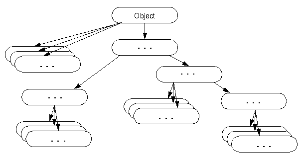<br><sub>Fig 30 - Class Object Inheritance in Java - (<a href='https://www.javatpoint.com/object-class'>Work by  java T Point</a>) </sub></div>

<br>

Let's take an example, there is getObject() method that returns an object but it can be of any type like Employee,Student etc, we can use Object class reference to refer that object. For example:

```java

Object obj=getObject();//we don't know what object will be returned from this method  

```

The Object class provides some common behaviors to all the objects such as object can be compared, object can be cloned, object can be notified etc. 


<br>

<div align="center">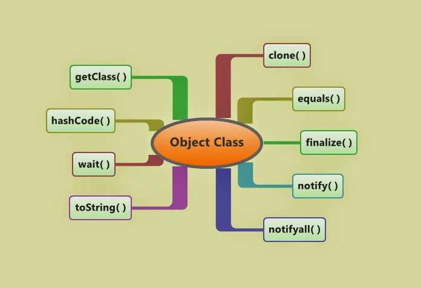<br><sub>Fig 31 - Class Object Methods in Java - (<a href='https://www.javatpoint.com/object-class'>Work by  java T Point</a>) </sub></div>

<br>

**Methods of Object class**

| Method                                                                      | Description     |
| :--------------------------------------------------------------------------:| :--------------:|
| public final Class getClass()                                               | returns the Class class object of this object. The Class class can further be used to get the metadata of this class.       |
| public int hashCode()                                                       | returns the hashcode number for this object. | 
| public boolean equals(Object obj)                                           | compares the given object to this object.             |
| protected Object clone() throws CloneNotSupportedException                  | creates and returns the exact copy (clone) of this object.       |
| public String toString()                                                    |returns the string representation of this object.       |
| public final void notify()                                                  | wakes up single thread, waiting on this object's monitor.       |
| public final void notifyAll()                                               | wakes up all the threads, waiting on this object's monitor.       |
| public final void wait(long timeout)throws InterruptedException             | causes the current thread to wait for the specified milliseconds, until another thread notifies (invokes notify() or notifyAll() method).       |
| public final void wait(long timeout,int nanos)throws InterruptedException   | causes the current thread to wait for the specified milliseconds and nanoseconds, until another thread notifies (invokes notify() or notifyAll() method).       |
| public final void wait()throws InterruptedException                         | causes the current thread to wait, until another thread notifies (invokes notify() or notifyAll() method).       |
| protected void finalize()throws Throwable                                   | is invoked by the garbage collector before object is being garbage collected.       |


Now, we will use the method ```toString()``` that will be able to display the name and attributes of the Product.

**Class Product**

```java

public class Product {

	public String name;
	public double price;
	public int quantity;

	public double totalValueInStock() {
		return price * quantity;
	}

	public void addProducts(int quantity) {
		this.quantity += quantity;
	}

	public void removeProducts(int quantity) {
		this.quantity -= quantity;
	}
	
	public String toString() {
		return name
		+ ", $ "
		+ String.format("%.2f", price)
		+ ", "
		+ quantity
		+ " units, Total: $ "
		+ String.format("%.2f", totalValueInStock());
	}

}

```

**Program**

```java

import java.util.Locale;
import java.util.Scanner;

public class Program {
	
	public static void main(String[] args) {
		
		Locale.setDefault(Locale.US);
		Scanner sc = new Scanner(System.in);
		
		Product product = new Product();
		System.out.println("Enter product data: ");
		System.out.print("Name: ");
		product.name = sc.nextLine();
		System.out.print("Price: ");
		product.price = sc.nextDouble();
		System.out.print("Quantity in stock: ");
		product.quantity = sc.nextInt();
		
		System.out.println();
		System.out.println("Product data: " + product);
		
		System.out.println();
		System.out.print("Enter the number of products to be added in stock: ");
		int quantity = sc.nextInt();
		product.addProducts(quantity);
		
		System.out.println();
		System.out.println("Updated data: " + product);
		
		System.out.println();
		System.out.print("Enter the number of products to be removed from stock: ");
		quantity = sc.nextInt();
		product.removeProducts(quantity);
		
		System.out.println();
		System.out.println("Updated data: " + product);
		
		sc.close();
	}
}

```

#### <a name="chapter6part5.2"></a>Chapter 6 - Part 5.2: Understanding Inheritance

Inheritance is a mechanism where a new class (called a subclass or child class) acquires the properties and behaviors of an existing class (called a superclass or parent class). The subclass inherits the attributes (fields) and methods of the superclass. This allows you to create a hierarchy of classes, where subclasses represent more specialized versions of their superclasses.

**Key Benefits of Inheritance**:

- **Code Reusability**: Avoid writing the same code multiple times. Subclasses inherit the code from their superclass, reducing redundancy.
- **Extensibility**: Easily extend the functionality of existing classes by adding new attributes and methods in subclasses.
- **Organization**: Create a clear hierarchy of classes, making your code more organized and easier to understand.
- **Polymorphism**: (Covered in a later module) Inheritance is a prerequisite for polymorphism, which allows you to treat objects of different classes in a uniform way.

**Real-World Examples:**

- **Vehicles**: Consider a Vehicle class with attributes like speed, color, and methods like startEngine() and stopEngine(). You can create subclasses like Car, Truck, and Motorcycle that inherit these attributes and methods. Each subclass can then add its own specific attributes and methods, such as numberOfDoors for Car or cargoCapacity for Truck.

- **Animals**: An Animal class can have attributes like name, age, and methods like eat() and sleep(). Subclasses like Dog, Cat, and Bird can inherit these and add their own specific behaviors, such as bark() for Dog or fly() for Bird.

**Hypothetical Scenario:**

Imagine you're developing a game. You have a base class called GameObject with attributes like x, y (coordinates), and methods like draw() and update(). You can create subclasses like Player, Enemy, and Projectile that inherit from GameObject. Each subclass can then implement its own specific draw() and update() methods to handle its unique behavior in the game.

#### <a name="chapter6part5.3"></a>Chapter 6 - Part 5.3: The extends Keyword

In Java, the extends keyword is used to establish an inheritance relationship between two classes. The syntax is as follows:

```java
class Subclass extends Superclass {
    // Subclass members (attributes and methods)
}
```

This declares that Subclass inherits from Superclass. The Subclass automatically gains all non-private members (attributes and methods) of the Superclass.

Example:

Let's create a simple example with a Animal class and a Dog subclass:

```java
// Superclass (Parent Class)
class Animal {
    String name;

    public Animal(String name) {
        this.name = name;
    }

    public void eat() {
        System.out.println(name + " is eating.");
    }

    public void sleep() {
        System.out.println(name + " is sleeping.");
    }
}

// Subclass (Child Class) inheriting from Animal
class Dog extends Animal {
    String breed;

    public Dog(String name, String breed) {
        super(name); // Call the constructor of the superclass
        this.breed = breed;
    }

    public void bark() {
        System.out.println("Woof!");
    }
}

public class Main {
    public static void main(String[] args) {
        Dog myDog = new Dog("Buddy", "Golden Retriever");
        myDog.eat();   // Inherited from Animal
        myDog.sleep(); // Inherited from Animal
        myDog.bark();  // Specific to Dog
        System.out.println(myDog.name); // Accessing inherited attribute
    }
}
```

**Explanation**:

- The Dog class extends the Animal class, meaning it inherits the name, eat(), and sleep() members.
- The Dog class has its own attribute, breed, and its own method, bark().
- The super(name) call in the Dog constructor calls the constructor of the Animal class, initializing the name attribute. This is crucial for proper initialization of inherited attributes.

#### <a name="chapter6part5.4"></a>Chapter 6 - Part 5.4: Method Overriding

Method overriding allows a subclass to provide a specific implementation for a method that is already defined in its superclass. This enables you to customize the behavior of inherited methods in the subclass.

**Rules for Method Overriding:**

- The method in the subclass must have the same name, return type, and parameter list as the method in the superclass.
- The access modifier of the overriding method in the subclass must be the same or more accessible than the method in the superclass (e.g., you can override a protected method with a public method, but not with a private method).
- The @Override annotation is optional but highly recommended. It tells the compiler that you intend to override a method, and it will generate an error if the method does not actually override a method in the superclass.

**Example**:

Let's modify the Animal and Dog classes to demonstrate method overriding:

```java
class Animal {
    String name;

    public Animal(String name) {
        this.name = name;
    }

    public void makeSound() {
        System.out.println("Generic animal sound");
    }

    public void eat() {
        System.out.println(name + " is eating.");
    }

    public void sleep() {
        System.out.println(name + " is sleeping.");
    }
}

class Dog extends Animal {
    String breed;

    public Dog(String name, String breed) {
        super(name);
        this.breed = breed;
    }

    @Override
    public void makeSound() {
        System.out.println("Woof!"); // Overriding the makeSound() method
    }

    public void bark() {
        System.out.println("Woof!");
    }
}

public class Main {
    public static void main(String[] args) {
        Animal myAnimal = new Animal("Generic Animal");
        Dog myDog = new Dog("Buddy", "Golden Retriever");

        myAnimal.makeSound(); // Output: Generic animal sound
        myDog.makeSound();    // Output: Woof! (Overridden method)
    }
}
```

**Explanation**:

- The Dog class overrides the makeSound() method from the Animal class.
- When myAnimal.makeSound() is called, the makeSound() method in the Animal class is executed.
- When myDog.makeSound() is called, the makeSound() method in the Dog class is executed, demonstrating method overriding.

#### <a name="chapter6part5.5"></a>Chapter 6 - Part 5.5: The super Keyword

The super keyword is used to access members (attributes and methods) of the superclass from within the subclass. It has two main uses:

- **Calling the Superclass Constructor**: As seen in the previous examples, super(arguments) is used to call the constructor of the superclass. This is essential for initializing inherited attributes. It must be the first statement in the subclass constructor.

- **Accessing Superclass Members**: super.member is used to access a specific attribute or method of the superclass. This is useful when you want to use the superclass's implementation of a method in addition to the subclass's implementation.

**Example**:

Let's extend the previous example to demonstrate both uses of super:

```java
class Animal {
    String name;

    public Animal(String name) {
        this.name = name;
        System.out.println("Animal constructor called");
    }

    public void makeSound() {
        System.out.println("Generic animal sound");
    }

    public void eat() {
        System.out.println(name + " is eating.");
    }

    public void sleep() {
        System.out.println(name + " is sleeping.");
    }
}

class Dog extends Animal {
    String breed;

    public Dog(String name, String breed) {
        super(name); // Calling the Animal constructor
        System.out.println("Dog constructor called");
        this.breed = breed;
    }

    @Override
    public void makeSound() {
        super.makeSound(); // Calling the Animal's makeSound() method
        System.out.println("Woof!"); // Adding Dog-specific sound
    }

    public void displayBreed() {
        System.out.println("Breed: " + breed);
    }
}

public class Main {
    public static void main(String[] args) {
        Dog myDog = new Dog("Buddy", "Golden Retriever");
        myDog.makeSound();
        myDog.displayBreed();
    }
}
```

**Explanation**:

- In the Dog constructor, super(name) calls the Animal constructor, initializing the name attribute. The output will show "Animal constructor called" before "Dog constructor called".

- In the Dog's makeSound() method, super.makeSound() calls the makeSound() method of the Animal class, which prints "Generic animal sound". Then, the Dog's specific sound "Woof!" is printed.

#### <a name="chapter6part6"></a>Chapter 6 - Part 6: The `extends` Keyword: Inheriting from a Parent Class

Inheritance is a cornerstone of object-oriented programming, allowing you to create new classes based on existing ones. This promotes code reuse, reduces redundancy, and establishes a clear hierarchy among your classes. The extends keyword in Java is the mechanism for implementing inheritance, enabling a class to inherit the properties and behaviors of another class. Understanding how to effectively use extends is crucial for building robust and maintainable Java applications.

#### <a name="chapter6part6.1"></a>Chapter 6 - Part 6.1: Understanding the extends Keyword

The extends keyword in Java is used to create a new class that is a subclass (also known as a derived class or child class) of an existing class, called the superclass (also known as a base class or parent class). The subclass inherits the non-private members (fields and methods) of the superclass. This means the subclass automatically has those members as if they were declared within the subclass itself.

**Syntax**

The basic syntax for using extends is:

```java
class SubclassName extends SuperclassName {
    // Class body with additional fields and methods,
    // or overridden methods from the superclass
}
```

- ```SubclassName```: The name of the new class you are creating.
- ```SuperclassName```: The name of the existing class you are inheriting from.
- The curly braces {} enclose the body of the subclass, where you can define new fields and methods, or override existing methods from the superclass.

**Example: A Simple Inheritance Scenario**

Let's consider a simple example with Animal and Dog classes:

```java
// Superclass (Parent Class)
class Animal {
    String name;

    public Animal(String name) {
        this.name = name;
    }

    public void eat() {
        System.out.println(name + " is eating.");
    }

    public void sleep() {
        System.out.println(name + " is sleeping.");
    }
}

// Subclass (Child Class) inheriting from Animal
class Dog extends Animal {
    String breed;

    public Dog(String name, String breed) {
        super(name); // Call the constructor of the Animal class
        this.breed = breed;
    }

    public void bark() {
        System.out.println("Woof! Woof!");
    }
}

public class Main {
    public static void main(String[] args) {
        Dog myDog = new Dog("Buddy", "Golden Retriever");
        myDog.eat();   // Inherited from Animal
        myDog.sleep(); // Inherited from Animal
        myDog.bark();  // Defined in Dog
    }
}
```

In this example:

- Animal is the superclass, with a name field, an eat() method, and a sleep() method.
- Dog is the subclass, inheriting from Animal. It adds its own breed field and bark() method.
- The Dog constructor uses super(name) to call the Animal constructor, initializing the inherited name field.
- In the Main class, we create a Dog object and call methods inherited from Animal (eat() and sleep()) as well as the Dog-specific method (bark()).

**The super Keyword**

The super keyword is used in a subclass to refer to the superclass. It has two primary uses:

- **Calling the Superclass Constructor**: As seen in the Dog constructor, super(name) calls the constructor of the Animal class. This is necessary to initialize the inherited fields. If a subclass constructor does not explicitly call a superclass constructor, Java automatically inserts a call to the superclass's no-argument constructor (super()). If the superclass does not have a no-argument constructor, you must explicitly call one of the superclass's constructors using super().

- **Accessing Superclass Members**: super can also be used to access fields and methods of the superclass that have been hidden or overridden in the subclass. We will explore method overriding in the next lesson.

**Inheritance and Constructors**

Constructors are not inherited. However, as mentioned above, the subclass constructor must call a superclass constructor, either explicitly using super() or implicitly (if the superclass has a no-argument constructor). If the superclass only defines parameterized constructors, the subclass must explicitly call one of them using super(arguments).

**Single Inheritance**

Java supports single inheritance, meaning a class can only inherit from one direct superclass. This is enforced by the extends keyword; you can only specify one class after extends. This restriction helps to avoid the complexities and ambiguities associated with multiple inheritance (where a class inherits from multiple superclasses).

**Example: Inheritance with Multiple Levels**

Inheritance can be multi-level. For example:

```java
// Superclass
class Animal {
    String name;

    public Animal(String name) {
        this.name = name;
    }

    public void eat() {
        System.out.println(name + " is eating.");
    }
}

// Subclass of Animal
class Mammal extends Animal {
    public Mammal(String name) {
        super(name);
    }

    public void giveBirth() {
        System.out.println(name + " is giving birth to live young.");
    }
}

// Subclass of Mammal
class Dog extends Mammal {
    String breed;

    public Dog(String name, String breed) {
        super(name);
        this.breed = breed;
    }

    public void bark() {
        System.out.println("Woof! Woof!");
    }
}

public class Main {
    public static void main(String[] args) {
        Dog myDog = new Dog("Buddy", "Golden Retriever");
        myDog.eat();        // Inherited from Animal
        myDog.giveBirth();  // Inherited from Mammal
        myDog.bark();       // Defined in Dog
    }
}
```

Here, Dog inherits from Mammal, which in turn inherits from Animal. Dog inherits members from both Mammal and Animal.

**```protected``` Access Modifier and Inheritance**

The protected access modifier plays a significant role in inheritance. Members declared as protected in a superclass are accessible to:

- All classes within the same package.
- All subclasses, regardless of the package they are in.

This provides a level of access that is more restrictive than public (accessible everywhere) but less restrictive than private (accessible only within the class itself).

```java
// Superclass
package com.example;

class Animal {
    protected String name; // Accessible to subclasses and classes in the same package

    public Animal(String name) {
        this.name = name;
    }

    protected void eat() { // Accessible to subclasses and classes in the same package
        System.out.println(name + " is eating.");
    }
}

// Subclass in a different package
package com.example.pets;

import com.example.Animal;

class Dog extends Animal {
    public Dog(String name) {
        super(name);
    }

    public void displayAnimalName() {
        System.out.println("The animal's name is: " + name); // Accessing protected member
        eat(); // Accessing protected method
    }
}

public class Main {
    public static void main(String[] args) {
        Dog myDog = new Dog("Buddy");
        myDog.displayAnimalName();
    }
}
```

In this example, even though Dog is in a different package, it can access the protected members (name and eat()) of the Animal class.

**The Object Class**

In Java, every class implicitly inherits from the Object class. If you don't explicitly use the extends keyword, your class still inherits from Object. The Object class provides fundamental methods like equals(), hashCode(), and toString(), which can be overridden in your classes to provide custom behavior.

#### <a name="chapter6part6.2"></a>Chapter 6 - Part 6.2: Practical Examples and Demonstrations

Let's explore some more practical examples to solidify your understanding of inheritance.

**Example 1: Shapes**

```java
// Superclass
class Shape {
    private String color;

    public Shape(String color) {
        this.color = color;
    }

    public String getColor() {
        return color;
    }

    public double getArea() {
        return 0.0; // Default implementation
    }
}

// Subclass: Circle
class Circle extends Shape {
    private double radius;

    public Circle(String color, double radius) {
        super(color);
        this.radius = radius;
    }

    public double getRadius() {
        return radius;
    }

    @Override
    public double getArea() {
        return Math.PI * radius * radius;
    }
}

// Subclass: Rectangle
class Rectangle extends Shape {
    private double width;
    private double height;

    public Rectangle(String color, double width, double height) {
        super(color);
        this.width = width;
        this.height = height;
    }

    public double getWidth() {
        return width;
    }

    public double getHeight() {
        return height;
    }

    @Override
    public double getArea() {
        return width * height;
    }
}

public class Main {
    public static void main(String[] args) {
        Circle myCircle = new Circle("Red", 5.0);
        Rectangle myRectangle = new Rectangle("Blue", 4.0, 6.0);

        System.out.println("Circle Area: " + myCircle.getArea());
        System.out.println("Rectangle Area: " + myRectangle.getArea());
    }
}
```

In this example:

- Shape is the superclass, defining a common color attribute and a default getArea() method.
- Circle and Rectangle are subclasses that inherit from Shape and provide their own implementations of getArea() based on their specific properties (radius, width, and height).
- The @Override annotation indicates that the getArea() method is overriding a method from the superclass (we will discuss method overriding in detail in the next lesson).

**Example 2: Vehicles**

```java
// Superclass
class Vehicle {
    private String modelName;
    private String brand;

    public Vehicle(String modelName, String brand) {
        this.modelName = modelName;
        this.brand = brand;
    }

    public String getModelName() {
        return modelName;
    }

     public String getBrand() {
        return brand;
    }

    public void startEngine() {
        System.out.println("Engine started.");
    }
}

// Subclass: Car
class Car extends Vehicle {
    private int numberOfDoors;

    public Car(String modelName, String brand, int numberOfDoors) {
        super(modelName, brand);
        this.numberOfDoors = numberOfDoors;
    }

    public int getNumberOfDoors() {
        return numberOfDoors;
    }

    public void drive() {
        System.out.println("Driving the car.");
    }
}

// Subclass: Motorcycle
class Motorcycle extends Vehicle {
    private boolean hasSidecar;

    public Motorcycle(String modelName, String brand, boolean hasSidecar) {
        super(modelName, brand);
        this.hasSidecar = hasSidecar;
    }

    public boolean hasSidecar() {
        return hasSidecar;
    }

    public void wheelie() {
        System.out.println("Performing a wheelie!");
    }
}

public class Main {
    public static void main(String[] args) {
        Car myCar = new Car("Sedan", "Toyota", 4);
        Motorcycle myMotorcycle = new Motorcycle("Sportbike", "Honda", false);

        myCar.startEngine();
        myCar.drive();

        myMotorcycle.startEngine();
        myMotorcycle.wheelie();
    }
}
```

In this example:

- Vehicle is the superclass, defining common attributes like modelName and brand, and a startEngine() method.
- Car and Motorcycle are subclasses that inherit from Vehicle and add their own specific attributes (e.g., numberOfDoors for Car, hasSidecar for Motorcycle) and methods (e.g., drive() for Car, wheelie() for Motorcycle).

#### <a name="chapter6part7"></a>Chapter 6 - Part 7: Method Overriding: Changing Inherited Behavior

Method overriding is a cornerstone of object-oriented programming, allowing subclasses to provide specific implementations of methods that are already defined in their parent classes. This capability is crucial for achieving polymorphism and creating flexible, extensible software systems. By understanding method overriding, you can design classes that adapt and specialize inherited behavior to meet specific requirements, leading to more maintainable and reusable code. This lesson will delve into the mechanics of method overriding, its benefits, and how to use it effectively in Java.

#### <a name="chapter6part7.1"></a>Chapter 6 - Part 7.1: Understanding Method Overriding

Method overriding occurs when a subclass provides a different implementation for a method that is already defined in its superclass. The overriding method in the subclass must have the same method signature as the method in the superclass: the same name, the same parameters (including the order and type), and the same return type.

**Key Principles of Method Overriding**

- **Same Method Signature**: The overriding method must have the exact same name, parameters, and return type as the overridden method in the superclass. This ensures that the subclass method can be used wherever the superclass method is expected.
- **Access Modifiers**: The access modifier of the overriding method in the subclass cannot be more restrictive than the access modifier of the overridden method in the superclass. For example, if the superclass method is protected, the overriding method can be protected or public, but not private. It can, however, be less restrictive.
- **```@Override``` Annotation**: While not strictly required, it is highly recommended to use the @Override annotation when overriding a method. This annotation tells the compiler that you intend to override a method, and the compiler will generate an error if the method does not actually override a method in the superclass. This helps to catch errors early and ensures that your code is doing what you intend.
- **Inheritance Requirement**: Method overriding can only occur in the context of inheritance. The subclass must inherit from the superclass in order to override its methods.
- **Return Type Covariance**: In Java 5 and later, overriding methods can have covariant return types. This means that the return type of the overriding method can be a subclass of the return type of the overridden method.

**Example: Basic Method Overriding**

Consider a simple example with a Vehicle class and a Car class that extends Vehicle.

```java
class Vehicle {
    public void startEngine() {
        System.out.println("Generic vehicle engine starting.");
    }

    public String getDescription() {
        return "Generic vehicle";
    }
}

class Car extends Vehicle {
    @Override
    public void startEngine() {
        System.out.println("Car engine starting.");
    }

    @Override
    public String getDescription() {
        return "Car";
    }
}

public class Main {
    public static void main(String[] args) {
        Vehicle vehicle = new Vehicle();
        Car car = new Car();

        vehicle.startEngine(); // Output: Generic vehicle engine starting.
        System.out.println(vehicle.getDescription()); // Output: Generic vehicle

        car.startEngine(); // Output: Car engine starting.
        System.out.println(car.getDescription()); // Output: Car
    }
}
```

In this example:

- The Car class extends the Vehicle class.
- The startEngine() and getDescription() methods are overridden in the Car class to provide a car-specific implementation.
- The @Override annotation is used to indicate that these methods are intended to override methods in the superclass.
- When startEngine() is called on a Car object, the Car's implementation is executed, not the Vehicle's.

**Example: Access Modifiers and Overriding**

```java
class Animal {
    protected void makeSound() {
        System.out.println("Generic animal sound");
    }
}

class Dog extends Animal {
    @Override
    public void makeSound() { // Can be protected or public, but not private
        System.out.println("Woof!");
    }
}

public class Main {
    public static void main(String[] args) {
        Animal animal = new Animal();
        Dog dog = new Dog();

        animal.makeSound(); // Output: Generic animal sound
        dog.makeSound(); // Output: Woof!
    }
}
```

In this example, the makeSound() method in the Animal class is protected. The overriding method in the Dog class can be protected or public, but not private. If you try to make it private, you will get a compile-time error.

**Example: Return Type Covariance**

```java
class Food {
    public String getName() {
        return "Generic Food";
    }
}

class Fruit extends Food {
    @Override
    public String getName() {
        return "Generic Fruit";
    }
}

class Apple extends Fruit {
    @Override
    public String getName() {
        return "Apple";
    }
}

class Tree {
    public Food produce() {
        return new Food();
    }
}

class AppleTree extends Tree {
    @Override
    public Apple produce() {
        return new Apple();
    }
}

public class Main {
    public static void main(String[] args) {
        Tree tree = new Tree();
        AppleTree appleTree = new AppleTree();

        Food food = tree.produce();
        Apple apple = appleTree.produce();

        System.out.println(food.getName()); // Output: Generic Food
        System.out.println(apple.getName()); // Output: Apple
    }
}
```

In this example:

- The produce() method in the Tree class returns a Food object.
- The produce() method in the AppleTree class overrides the produce() method in the Tree class and returns an Apple object, which is a subclass of Food.
- This is an example of return type covariance, where the return type of the overriding method is a subclass of the return type of the overridden method.

#### <a name="chapter6part7.2"></a>Chapter 6 - Part 7.2: The super Keyword and Method Overriding

The super keyword allows you to access members (methods and fields) of the superclass from within the subclass. In the context of method overriding, super is often used to call the overridden method in the superclass from within the overriding method in the subclass. This is useful when you want to extend the behavior of the superclass method rather than completely replace it.

**Example: Using super to Extend Functionality**

```java
class Animal {
    public void makeSound() {
        System.out.println("Generic animal sound");
    }
}

class Dog extends Animal {
    @Override
    public void makeSound() {
        super.makeSound(); // Call the superclass method
        System.out.println("Woof!"); // Add additional behavior
    }
}

public class Main {
    public static void main(String[] args) {
        Dog dog = new Dog();
        dog.makeSound();
        // Output:
        // Generic animal sound
        // Woof!
    }
}
```

In this example:

- The makeSound() method in the Dog class overrides the makeSound() method in the Animal class.
- The super.makeSound() call invokes the makeSound() method in the Animal class, which prints "Generic animal sound".
- The System.out.println("Woof!") statement then adds additional behavior, printing "Woof!".
- This allows the Dog class to extend the behavior of the Animal class without completely replacing it.

**When to Use super**

- **Extending Behavior**: Use super when you want to add additional behavior to the overridden method while still retaining the original behavior of the superclass method.
- **Accessing Superclass Members**: Use super to access fields or methods in the superclass that have been hidden or overridden in the subclass.
- **Calling Superclass Constructors**: Use super() to call the superclass constructor from within the subclass constructor. This is necessary to ensure that the superclass is properly initialized.

#### <a name="chapter6part7.3"></a>Chapter 6 - Part 7.3: Method Overriding vs. Method Overloading

It's important to distinguish between method overriding and method overloading, as they are often confused.

|Feature	|Method Overriding	|Method Overloading|
| :-------: | :-------: | :-------: |
|Definition|	Providing a different implementation in a subclass|	Providing multiple methods with the same name in the same class|
|Relationship|	Occurs between a superclass and a subclass|	Occurs within the same class|
|Signature|	Must have the same name, parameters, and return type|	Must have the same name but different parameters|
|Purpose|	To change the behavior of an inherited method|	To provide different ways to call a method|
|Compile-time|	Resolved at runtime (dynamic binding)|	Resolved at compile time (static binding)|

**Example: Overloading vs. Overriding**

```java
class Calculator {
    public int add(int a, int b) {
        return a + b;
    }

    // Method Overloading: Same name, different parameters
    public double add(double a, double b) {
        return a + b;
    }
}

class ScientificCalculator extends Calculator {
    // Method Overriding: Same name, same parameters, same return type
    @Override
    public int add(int a, int b) {
        System.out.println("Adding integers in ScientificCalculator");
        return a + b;
    }
}

public class Main {
    public static void main(String[] args) {
        Calculator calculator = new Calculator();
        ScientificCalculator scientificCalculator = new ScientificCalculator();

        System.out.println(calculator.add(2, 3)); // Output: 5
        System.out.println(calculator.add(2.5, 3.5)); // Output: 6.0

        System.out.println(scientificCalculator.add(2, 3));
        // Output:
        // Adding integers in ScientificCalculator
        // 5
    }
}
```

In this example:

- The Calculator class has two add() methods with different parameters, which is method overloading.
- The ScientificCalculator class overrides the add(int a, int b) method from the Calculator class, which is method overriding.

#### <a name="chapter6part7.4"></a>Chapter 6 - Part 7.4: Practical Examples and Demonstrations

**Example: Polymorphism and Method Overriding**

Method overriding is a key enabler of polymorphism, which allows you to treat objects of different classes in a uniform way.

```java
class Animal {
    public void makeSound() {
        System.out.println("Generic animal sound");
    }
}

class Dog extends Animal {
    @Override
    public void makeSound() {
        System.out.println("Woof!");
    }
}

class Cat extends Animal {
    @Override
    public void makeSound() {
        System.out.println("Meow!");
    }
}

public class Main {
    public static void main(String[] args) {
        Animal[] animals = new Animal[3];
        animals[0] = new Animal();
        animals[1] = new Dog();
        animals[2] = new Cat();

        for (Animal animal : animals) {
            animal.makeSound();
        }
        // Output:
        // Generic animal sound
        // Woof!
        // Meow!
    }
}
```

In this example:

- An array of Animal objects is created, containing instances of Animal, Dog, and Cat.
- The makeSound() method is called on each element of the array.
- Due to method overriding, the appropriate makeSound() method is called for each object, resulting in different outputs for each animal.
- This demonstrates polymorphism, where objects of different classes can be treated as objects of a common type (Animal) and respond differently to the same method call.

**Example: Overriding toString() Method**

The toString() method is a special method in Java that is used to provide a string representation of an object. It is defined in the Object class, which is the ultimate superclass of all Java classes. You can override the toString() method in your classes to provide a more meaningful string representation of your objects.

```java
class Point {
    private int x;
    private int y;

    public Point(int x, int y) {
        this.x = x;
        this.y = y;
    }

    @Override
    public String toString() {
        return "Point [x=" + x + ", y=" + y + "]";
    }
}

public class Main {
    public static void main(String[] args) {
        Point point = new Point(10, 20);
        System.out.println(point); // Output: Point [x=10, y=20]
    }
}
```

In this example:

- The toString() method is overridden in the Point class to provide a string representation of the Point object that includes the values of its x and y coordinates.
- When System.out.println(point) is called, the toString() method is automatically invoked, and the resulting string is printed to the console.

#### <a name="chapter6part8"></a>Chapter 6 - Part 8: The `super` Keyword: Accessing Parent Class Members

The super keyword in Java is a crucial element in object-oriented programming, particularly when dealing with inheritance. It allows a subclass to access members (methods and variables) of its parent class, enabling code reuse and extension of functionality. Understanding super is essential for creating robust and maintainable class hierarchies. It's not just about accessing parent class members; it's about controlling how you access them, especially when method overriding is involved.

#### <a name="chapter6part8.1"></a>Chapter 6 - Part 8.1: Understanding the super Keyword

The super keyword serves two primary purposes:

- **Calling the Parent Class Constructor**: super() is used to invoke the constructor of the parent class. This is often necessary to initialize the inherited members of the subclass.
- **Accessing Parent Class Members**: super.member is used to access methods or variables defined in the parent class, even if they are hidden or overridden in the subclass.

**Calling the Parent Class Constructor**

When a subclass is instantiated, the constructor of its parent class is automatically called before the subclass constructor. If you don't explicitly call a parent class constructor using super(), Java implicitly calls the no-argument constructor (the constructor with no parameters) of the parent class.

- **Why is this important?** The parent class constructor often initializes important state for the object. Failing to call it can lead to unexpected behavior or errors.

```java
class Animal {
    String name;

    Animal() {
        this("Generic Animal"); // Calls the other constructor in Animal
        System.out.println("Animal constructor called");
    }

    Animal(String name) {
        this.name = name;
        System.out.println("Animal constructor with name called: " + name);
    }
}

class Dog extends Animal {
    Dog() {
        super("Dog"); // Explicitly calls the Animal(String name) constructor
        System.out.println("Dog constructor called");
    }
}

public class Main {
    public static void main(String[] args) {
        Dog myDog = new Dog();
        System.out.println("Dog's name: " + myDog.name);
    }
}
```

**Explanation**:

- The Dog constructor calls super("Dog"), which invokes the Animal(String name) constructor.
- This initializes the name field in the Animal class to "Dog".
- If we didn't call super("Dog"), Java would try to call the Animal() constructor. If Animal only had the constructor with the name parameter, the code would not compile.
- The output demonstrates the order of constructor calls: first the parent, then the child.

- **Important Note**: The call to super() must be the first statement in the subclass constructor. This ensures that the parent class is properly initialized before the subclass attempts to initialize its own members.

**Accessing Parent Class Members (Methods and Variables)**

The super keyword can also be used to access methods and variables defined in the parent class. This is particularly useful when a subclass overrides a method from the parent class but still needs to access the original implementation.

- **Why is this important?** Method overriding allows a subclass to provide its own specific implementation of a method inherited from the parent class. However, sometimes you need to extend the parent's behavior rather than completely replacing it. super allows you to do this.

```java
class Animal {
    public void makeSound() {
        System.out.println("Generic animal sound");
    }
}

class Dog extends Animal {
    @Override
    public void makeSound() {
        super.makeSound(); // Calls the makeSound() method in the Animal class
        System.out.println("Woof!");
    }
}

public class Main {
    public static void main(String[] args) {
        Dog myDog = new Dog();
        myDog.makeSound();
    }
}
```

**Explanation:**

- The Dog class overrides the makeSound() method from the Animal class.
- Inside the Dog's makeSound() method, super.makeSound() is called. This executes the makeSound() method defined in the Animal class, printing "Generic animal sound".
- Then, the Dog's makeSound() method prints "Woof!".
- The output shows that both the parent and child class methods are executed.

- **Accessing Variables**: super can also be used to access variables (fields) of the parent class, even if they are hidden by variables with the same name in the subclass.

```java
class Animal {
    String name = "Animal";
}

class Dog extends Animal {
    String name = "Dog";

    public void printNames() {
        System.out.println("Dog's name: " + name); // Accesses the Dog's name variable
        System.out.println("Animal's name: " + super.name); // Accesses the Animal's name variable
    }
}

public class Main {
    public static void main(String[] args) {
        Dog myDog = new Dog();
        myDog.printNames();
    }
}
```

**Explanation:**

- Both Animal and Dog have a variable named name.
- Inside Dog's printNames() method, name refers to the Dog's name variable, while super.name refers to the Animal's name variable.
- This demonstrates how super can be used to disambiguate between variables with the same name in the parent and child classes.

**Practical Considerations and Best Practices**

- **When to use super()**: Always use super() in a subclass constructor if the parent class requires initialization parameters. Even if the parent class has a no-argument constructor, it's often good practice to explicitly call super() to ensure proper initialization.
- **When to use super.member**: Use super.member when you need to access a specific member (method or variable) of the parent class that has been hidden or overridden in the subclass. This is particularly useful when you want to extend the functionality of the parent class rather than completely replacing it.
- **Avoiding Ambiguity**: If a class inherits from multiple levels of parent classes, using super will always refer to the immediate parent class. There's no direct way to access members of grandparent classes using super directly.
- **Access Modifiers**: The ability to access parent class members using super is subject to access modifiers (public, protected, private, default). You cannot access private members of the parent class using super. protected members are accessible within the subclass and within the same package. public members are accessible everywhere. Default (package-private) members are accessible within the same package.

#### <a name="chapter6part9"></a>Chapter 6 - Part 9: Class Composition and Polymorphism

#### <a name="chapter6part9.1"></a>Chapter 9 - Part 6.1: Modifiers in Java

By now, you are quite familiar with the ```public``` keyword that appears in almost all of our examples:

```java

public class Main

```

The ```public``` keyword is an **access modifier**, meaning that it is used to set the access level for classes, attributes, methods and constructors.

We divide modifiers into two groups:

- Access Modifiers - controls the access level
- Non-Access Modifiers - do not control access level, but provides other functionality

**Access Modifiers**

For **classes**, you can use either ```public``` or default:

| Modifier | Description                                                                                                   |
| :-------:| :------------------------------------------------------------------------------------------------------------:|
| public   | The class is accessible by any other class                                                                    |
| default  | The class is only accessible by classes in the same package. This is used when you don't specify a modifier.  | 

For **attributes, methods and constructors**, you can use the one of the following:

| Modifier   | Description                                                                                       |
| :---------:| :------------------------------------------------------------------------------------------------:|
| public     | The code is accessible for all classes                                                            |
| private    | The code is only accessible within the declared class                                             |
| default    | The code is only accessible in the same package. This is used when you don't specify a modifier.  | 
| protected  | The code is accessible in the same package and subclasses.                                        | 

<br>

<div align="center">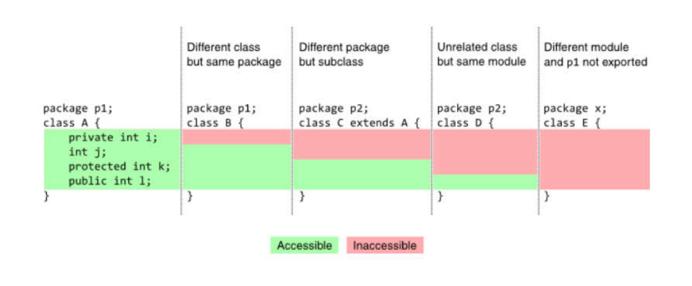<br><sub>Fig 32 - Modifiers in Java - (<a href='https://stackoverflow.com/questions/215497/what-is-the-difference-between-public-protected-package-private-and-private-in'>Work by  aioobe</a>) </sub></div>

<br>

**Non-Access Modifiers**

For **classes**, you can use either ```final``` or ```abstract```:

| Modifier  | Description                                                                                                       |
| :--------:| :----------------------------------------------------------------------------------------------------------------:|
| final     | The class cannot be inherited by other classes                                                                    |
| abstract  | The class cannot be used to create objects (To access an abstract class, it must be inherited from another class. | 

For **attributes and methods**, you can use the one of the following:

| Modifier      | Description                                                                                                       |
| :------------:| :----------------------------------------------------------------------------------------------------------------:|
| final         | Attributes and methods cannot be overridden/modified                                                                    |
| static        | Attributes and methods belongs to the class, rather than an object |
| abstract      | Can only be used in an abstract class, and can only be used on methods. The method does not have a body, for example **abstract void run();**. The body is provided by the subclass (inherited from).  | 
| transient     | Attributes and methods are skipped when serializing the object containing them | 
| synchronized  | Methods can only be accessed by one thread at a time | 
| volatile      | The value of an attribute is not cached thread-locally, and is always read from the "main memory" |

**Final**

If you don't want the ability to override existing attribute values, declare attributes as ```final```:

```java

public class Main {
  final int x = 10;
  final double PI = 3.14;

  public static void main(String[] args) {
    Main myObj = new Main();
    myObj.x = 50; // will generate an error: cannot assign a value to a final variable
    myObj.PI = 25; // will generate an error: cannot assign a value to a final variable
    System.out.println(myObj.x);
  }
}

```

**Static**

A ```static``` method means that it can be accessed without creating an object of the class, unlike ```public```:

An example to demonstrate the differences between ```static``` and ```public``` methods:

```java

public class Main {
  // Static method
  static void myStaticMethod() {
    System.out.println("Static methods can be called without creating objects");
  }

  // Public method
  public void myPublicMethod() {
    System.out.println("Public methods must be called by creating objects");
  }

  // Main method
  public static void main(String[ ] args) {
    myStaticMethod(); // Call the static method
    // myPublicMethod(); This would output an error

    Main myObj = new Main(); // Create an object of Main
    myObj.myPublicMethod(); // Call the public method
  }
}

```

**Abstract**

An ```abstract``` method belongs to an ```abstract``` class, and it does not have a body. The body is provided by the subclass:

```java

// Code from filename: Main.java
// abstract class
abstract class Main {
  public String fname = "John";
  public int age = 24;
  public abstract void study(); // abstract method
}

// Subclass (inherit from Main)
class Student extends Main {
  public int graduationYear = 2018;
  public void study() { // the body of the abstract method is provided here
    System.out.println("Studying all day long");
  }
}
// End code from filename: Main.java

// Code from filename: Second.java
class Second {
  public static void main(String[] args) {
    // create an object of the Student class (which inherits attributes and methods from Main)
    Student myObj = new Student();

    System.out.println("Name: " + myObj.fname);
    System.out.println("Age: " + myObj.age);
    System.out.println("Graduation Year: " + myObj.graduationYear);
    myObj.study(); // call abstract method
  }
}

```

#### <a name="chapter6part9.2"></a>Chapter 6 - Part 9.2: Encapsulation in Java

It is a principle consisting of hide implementation details of a class, exposing only safe operations and maintain objects in a consistent state.

Golden rule: the object must always be in a consistent state, and the class itself must guarantee this.

**An object must NOT expose any attributes (access modifier private)**

**Attributes must be accessed via get and set methods. [JavaBeans](https://en.wikipedia.org/wiki/JavaBeans)**

The meaning of Encapsulation, is to make sure that "sensitive" data is hidden from users. To achieve this, you must:

- declare class variables/attributes as ```private```.
- provide public get and set methods to access and update the value of a ```private``` variable

**Get and Set**

You learned from the previous chapter that ```private``` variables can only be accessed within the same class (an outside class has no access to it). However, it is possible to access them if we provide public get and set methods.

The ```get``` method returns the variable value, and the ```set``` method sets the value.

Syntax for both is that they start with either ```get``` or ```set```, followed by the name of the variable, with the first letter in upper case:

```java

public class Person {
  private String name; // private = restricted access

  // Getter
  public String getName() {
    return name;
  }

  // Setter
  public void setName(String newName) {
    this.name = newName;
  }
}

```

The ```get``` method returns the value of the variable ```name```.

The ```set``` method takes a parameter (```newName```) and assigns it to the ```name``` variable. The ```this``` keyword is used to refer to the current object.

However, as the ```name``` variable is declared as ```private```, we cannot access it from outside this class:

```java

public class Main {
  public static void main(String[] args) {
    Person myObj = new Person();
    myObj.name = "John";  // error
    System.out.println(myObj.name); // error 
  }
}


```

If the variable was declared as ```public```, we would expect the following output:

```John```

However, as we try to access a ```private``` variable, we get an error:

Instead, we use the ```getName()``` and ```setName()``` methods to access and update the variable:

```java

public class Main {
  public static void main(String[] args) {
    Person myObj = new Person();
    myObj.setName("John"); // Set the value of the name variable to "John"
    System.out.println(myObj.getName());
  }
}

// Outputs "John"

```

**Why Encapsulation?**

- Better control of class attributes and methods
- Class attributes can be made read-only (if you only use the ```get``` method), or write-only (if you only use the set method)
- Flexible: the programmer can change one part of the code without affecting other parts
- Increased security of data


```java

public class Product {

	private String name;
	private double price;
	private int quantity;
	
	public Product() {
	}
	
	public Product(String name, double price, int quantity) {
		this.name = name;
		this.price = price;
		this.quantity = quantity;
	}
	
	public Product(String name, double price) {
		this.name = name;
		this.price = price;
	}
	
	public String getName() {
		return name;
	}
	
	public void setName(String name) {
		this.name = name;
	}
	
	public double getPrice() {
		return price;
	}
	
	public void setPrice(double price) {
		this.price = price;
	}
	
	public int getQuantity() {
		return quantity;
	}

```

#### <a name="chapter6part9.3"></a>Chapter 6 - Part 9.3: Classes Composition in Java

It is a type of association that allows one object to contain another

"has-one" or "has-many" relationship

Advantages
- Organization: division of responsibilities
- Cohesion
- Flexibility
- Reuse

<br>

<div align="center">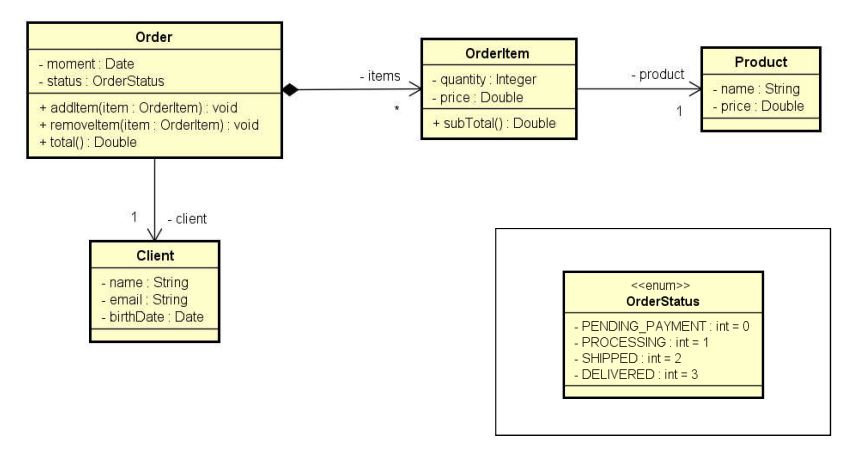<br><sub>Fig 39 - Composition - (<a href='https://www.udemy.com/course/java-curso-completo/'>Work by  Nelio Alves</a>) </sub></div>

<br>

Exercise: Read data from a worker with N contracts (N provided by the user). then request a month and show the employee's salary in that month, as shown in the example

<br>

<div align="center">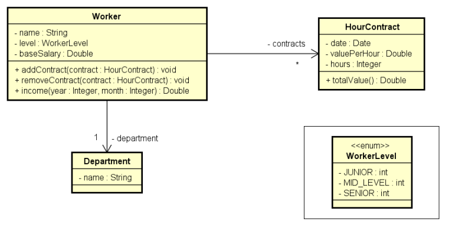<br><sub>Fig 39 - Compostion Exercise - (<a href='https://www.udemy.com/course/java-curso-completo/'>Work by  Nelio Alves</a>) </sub></div>

<br>

<div align="center">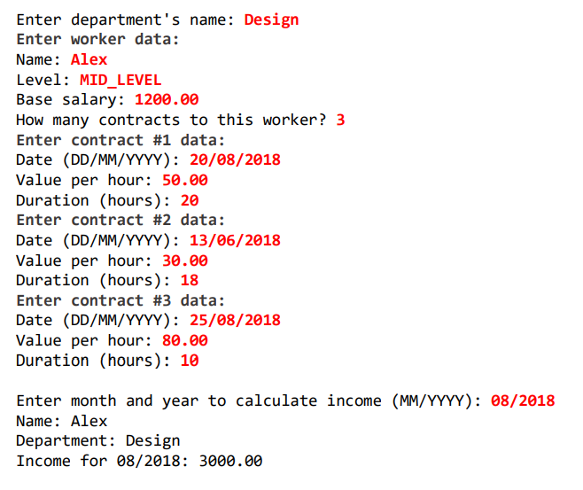<br><sub>Fig 39 - Compostion Exercise - (<a href='https://www.udemy.com/course/java-curso-completo/'>Work by  Nelio Alves</a>) </sub></div>

<br>

Resolution:

**WorkerLevel Class (enum)**

```java

package entities.enums;

public enum WorkerLevel {

	JUNIOR,
	MID_LEVEL,
	SENIOR;
}

```

**Department Class**

```java

package entities;

public class Department {

	private String name;
	
	public Department() {
	}

	public Department(String name) {
		this.name = name;
	}

	public String getName() {
		return name;
	}

	public void setName(String name) {
		this.name = name;
	}
}

```

**HourContract Class**

```java

package entities;

import java.util.Date;

public class HourContract {

	private Date date;
	private Double valuePerHour;
	private Integer hours;
	
	public HourContract() {
	}

	public HourContract(Date date, Double valuePerHour, Integer hours) {
		this.date = date;
		this.valuePerHour = valuePerHour;
		this.hours = hours;
	}

	public Date getDate() {
		return date;
	}

	public void setDate(Date date) {
		this.date = date;
	}

	public Double getValuePerHour() {
		return valuePerHour;
	}

	public void setValuePerHour(Double valuePerHour) {
		this.valuePerHour = valuePerHour;
	}

	public Integer getHours() {
		return hours;
	}

	public void setHours(Integer hours) {
		this.hours = hours;
	}
	
	public double totalValue() {
		return valuePerHour * hours;
	}
}

```

**Worker Class**

```java

package entities;

import java.util.ArrayList;
import java.util.Calendar;
import java.util.List;

import entities.enums.WorkerLevel;

public class Worker {

	private String name;
	private WorkerLevel level;
	private Double baseSalary;
	
	private Department department;
	private List<HourContract> contracts = new ArrayList<>();
	
	public Worker() {
	}

	public Worker(String name, WorkerLevel level, Double baseSalary, Department department) {
		this.name = name;
		this.level = level;
		this.baseSalary = baseSalary;
		this.department = department;
	}

	public String getName() {
		return name;
	}

	public void setName(String name) {
		this.name = name;
	}

	public WorkerLevel getLevel() {
		return level;
	}

	public void setLevel(WorkerLevel level) {
		this.level = level;
	}

	public Double getBaseSalary() {
		return baseSalary;
	}

	public void setBaseSalary(Double baseSalary) {
		this.baseSalary = baseSalary;
	}

	public Department getDepartment() {
		return department;
	}

	public void setDepartment(Department department) {
		this.department = department;
	}

	public List<HourContract> getContracts() {
		return contracts;
	}

	public void addContract(HourContract contract) {
		contracts.add(contract);
	}
	
	public void removeContract(HourContract contract) {
		contracts.remove(contract);
	}
	
	public double income(int year, int month) {
		double sum = baseSalary;
		Calendar cal = Calendar.getInstance();
		for (HourContract c : contracts) {
			cal.setTime(c.getDate());
			int c_year = cal.get(Calendar.YEAR);
			int c_month = 1 + cal.get(Calendar.MONTH);
			if (year == c_year && month == c_month) {
				sum += c.totalValue();
			}
		}
		return sum;
	}
}

```

**Program**

```java

package application;

import java.text.ParseException;
import java.text.SimpleDateFormat;
import java.util.Date;
import java.util.Locale;
import java.util.Scanner;

import entities.Department;
import entities.HourContract;
import entities.Worker;
import entities.enums.WorkerLevel;

public class Program {

	public static void main(String[] args) throws ParseException {

		Locale.setDefault(Locale.US);
		Scanner sc = new Scanner(System.in);
		SimpleDateFormat sdf = new SimpleDateFormat("dd/MM/yyyy");
		
		System.out.print("Enter department's name: ");
		String departmentName = sc.nextLine();
		System.out.println("Enter worker data:");
		System.out.print("Name: ");
		String workerName = sc.nextLine();
		System.out.print("Level: ");
		String workerLevel = sc.nextLine();
		System.out.print("Base salary: ");
		double baseSalary = sc.nextDouble();
		Worker worker = new Worker(workerName, WorkerLevel.valueOf(workerLevel), baseSalary, new Department(departmentName));
		
		System.out.print("How many contracts to this worker? ");
		int n = sc.nextInt();
		
		for (int i=1; i<=n; i++) {
			System.out.println("Enter contract #" + i + " data:");
			System.out.print("Date (DD/MM/YYYY): ");
			Date contractDate = sdf.parse(sc.next());
			System.out.print("Value per hour: ");
			double valuePerHour = sc.nextDouble();
			System.out.print("Duration (hours): ");
			int hours = sc.nextInt();
			HourContract contract = new HourContract(contractDate, valuePerHour, hours);
			worker.addContract(contract);
		}
		
		System.out.println();
		System.out.print("Enter month and year to calculate income (MM/YYYY): ");
		String monthAndYear = sc.next();
		int month = Integer.parseInt(monthAndYear.substring(0, 2));
		int year = Integer.parseInt(monthAndYear.substring(3));
		System.out.println("Name: " + worker.getName());
		System.out.println("Department: " + worker.getDepartment().getName());
		System.out.println("Income for " + monthAndYear + ": " + String.format("%.2f", worker.income(year, month)));
		
		sc.close();
	}
}

```

#### <a name="chapter6part9.4"></a>Chapter 6 - Part 9.4: Inheritance in Java

It is an association type that allows a class to inherit all data and behaviors of another

- Benefits
  - reuse
  - Polymorphism
  
In Java, it is possible to inherit attributes and methods from one class to another. We group the "inheritance concept" into two categories:

- **subclass** (child) - the class that inherits from another class
- **superclass** (parent) - the class being inherited from

To inherit from a class, use the ```extends``` keyword.

Example: In the example below, the ```Car``` class (subclass) inherits the attributes and methods from the ```Vehicle``` class (superclass):

```java

class Vehicle {
  protected String brand = "Ford";        // Vehicle attribute
  public void honk() {                    // Vehicle method
    System.out.println("Tuut, tuut!");
  }
}

class Car extends Vehicle {
  private String modelName = "Mustang";    // Car attribute
  public static void main(String[] args) {

    // Create a myCar object
    Car myCar = new Car();

    // Call the honk() method (from the Vehicle class) on the myCar object
    myCar.honk();

    // Display the value of the brand attribute (from the Vehicle class) and the value of the modelName from the Car class
    System.out.println(myCar.brand + " " + myCar.modelName);
  }
}

```

Another Example: Suppose a banking business that has a common account and an account for companies, and the company account has all account members common plus a borrowing limit and a borrowing operation.

<br>

<div align="center">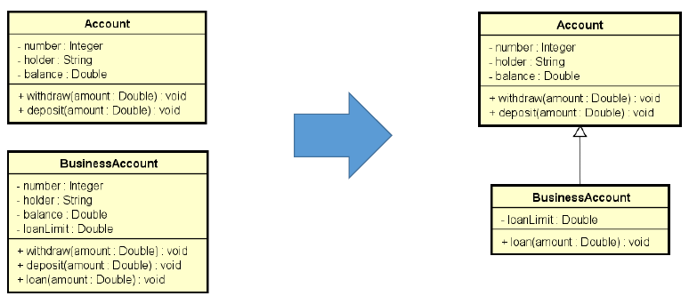<br><sub>Fig 40 - Inheritance - (<a href='https://www.udemy.com/course/java-curso-completo/'>Work by  Nelio Alves</a>) </sub></div>

<br>


Important Definitions:

- "is-a" relationship

- generalization/specialization

- Superclass (base class) / subclass (class derivative)

- inheritance / extension

- Inheritance is an association between classes (not between objects)

Class Account

```java

package entities;

public class Account {

	private Integer number;
	private String holder;
	protected Double balance;
		
	public Account() {
	}
	
	public Account(Integer number, String holder, Double balance) {
		this.number = number;
		this.holder = holder;
		this.balance = balance;
	}

	public Integer getNumber() {
		return number;
	}

	public void setNumber(Integer number) {
		this.number = number;
	}

	public String getHolder() {
		return holder;
	}

	public void setHolder(String holder) {
		this.holder = holder;
	}

	public Double getBalance() {
		return balance;
	}

	public void withdraw(double amount) {
		balance -= amount;
	}

	public void deposit(double amount) {
		balance += amount;
	}
}

```

Did you notice the ```protected``` modifier in ```Account```?

We set the ```balance``` attribute in ```Account``` to a ```protected``` access modifier. If it was set to ```private```, the ```BusinessAccount``` class would not be able to access it.

class BussinesAccount

```java

package entities;

public class BusinessAccount extends Account {

	private Double loanLimit;
	
	public BusinessAccount() {
		super();
	}

	public BusinessAccount(Integer number, String holder, Double balance, Double loanLimit) {
		super(number, holder, balance);
		this.loanLimit = loanLimit;
	}

	public Double getLoanLimit() {
		return loanLimit;
	}

	public void setLoanLimit(Double loanLimit) {
		this.loanLimit = loanLimit;
	}
	
	public void loan(double amount) {
		if (amount <= loanLimit) {
			balance += amount - 10.0;
		}
	}
}

```

Program

```java

package application;

import entities.BusinessAccount;

public class Program {

	public static void main(String[] args) {

		BusinessAccount account = new BusinessAccount(8010, "Bob Brown", 0.0, 500.0);

		System.out.println(account.getBalance());
	}
}

```

**Upcasting and downcasting**

- Upcasting
  - Casting from subclass to superclass
  - Common usage: polymorphism

- Downcasting
  - Casting from superclass to subclass
  - instanceof ```keyword```
  - Common usage: methods that take generic parameters (ex: Equals)
  
Example:

<br>

<div align="center">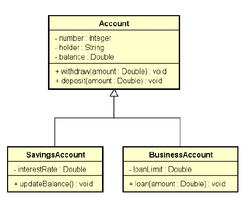<br><sub>Fig 41 - Upcasting and Downcasting - (<a href='https://www.udemy.com/course/java-curso-completo/'>Work by  Nelio Alves</a>) </sub></div>

<br>

Class SavingsAccount

```java

package entities;

public class SavingsAccount extends Account {
	
	private Double interestRate;
	
	public SavingsAccount() {
		super();
	}

	public SavingsAccount(Integer number, String holder, Double balance, Double interestRate) {
		super(number, holder, balance);
		this.interestRate = interestRate;
	}

	public Double getInterestRate() {
		return interestRate;
	}

	public void setInterestRate(Double interestRate) {
		this.interestRate = interestRate;
	}
	
	public void updateBalance() {
		balance += balance * interestRate;
	}
}

```

Program

```java

package application;

import entities.Account;
import entities.BusinessAccount;
import entities.SavingsAccount;

public class Program {

	public static void main(String[] args) {

		Account acc = new Account(1001, "Alex", 0.0);
		BusinessAccount bacc = new BusinessAccount(1002, "Maria", 0.0, 500.0);
		
		// UPCASTING
		
		Account acc1 = bacc;
		Account acc2 = new BusinessAccount(1003, "Bob", 0.0, 200.0);
		Account acc3 = new SavingsAccount(1004, "Anna", 0.0, 0.01);
		
		// DOWNCASTING
		
		BusinessAccount acc4 = (BusinessAccount)acc2;
		acc4.loan(100.0);
		
		// BusinessAccount acc5 = (BusinessAccount)acc3;
		if (acc3 instanceof BusinessAccount) {
			BusinessAccount acc5 = (BusinessAccount)acc3;
			acc5.loan(200.0);
			System.out.println("Loan!");
		}
		
		if (acc3 instanceof SavingsAccount) {
			SavingsAccount acc5 = (SavingsAccount)acc3;
			acc5.updateBalance();
			System.out.println("Update!");
		}
	}
}

```

**Override**

- It is the implementation of a method of a superclass in the subclass
- It is strongly recommended to use the @Override annotation in a method envelope
  - Facilitates reading and understanding of code
  - We notify the compiler (good practice)

class Account

```Java

public void withdraw(double amount) {
	balance -= amount + 5.0;
}

```

SavingsAccount

```java

@Override
public void withdraw(double amount) {
	balance -= amount;
}

```

**Keyword Super**

You can call the superclass implementation using the word super.

Example: suppose that, in the BusinessAccount class, the rule for withdrawal is to perform the draw normally from the superclass, and deduct another 2.0.

In this case, the withdraw method is the same, but with one moddification in the BissinesAccount class, because is tho only diference.

Class BissinesAccount

```java

@Override
public void withdraw(double amount) {
	super.withdraw(amount);
	balance -= 2.0;
}

```

**Keyword Final**

If you don't want other classes to inherit from a class, use the ```final``` keyword:

Example: If you try to access a ```final``` class, Java will generate an error:

```java

final class Vehicle {
  ...
}

class Car extends Vehicle {
  ...
}

// Main.java:9: error: cannot inherit from final Vehicle
//class Main extends Vehicle {
//                  ^
// 1 error)

```

You can use in method. In this case prevents the method under from being overridden

Example: Suppose you don't want the Withdraw method of SavingsAccount is overridden

```java

@Override
public final void withdraw(double amount) {
	balance -= amount;
}

```

why use final?

- Security: Depending on business rules, it is sometimes desirable ensure that a class is not inherited, or that a method is not be superimposed.
  - It is generally convenient to add final in overlapping methods, as Multiple overlays can be a gateway to inconsistencies

- Performance: type attributes of a final class are parsed accordingly. faster at runtime.
  - Classic example: String

#### <a name="chapter6part9.5"></a>Chapter 6 - Part 9.5: Polymorphism in Java

In Object Oriented Programming, polymorphism is a resource that allows variables of the same more generic type to be point to objects of different specific types, thus having different behaviors depending on each specific type.

```java

Account x = new Account(1020, "Alex", 1000.0);
Account y = new SavingsAccount(1023, "Maria", 1000.0, 0.01);

x.withdraw(50.0);
y.withdraw(50.0);

```

Another Example:

For example, think of a superclass called ```Animal``` that has a method called ```animalSound()```. Subclasses of Animals could be Pigs, Cats, Dogs, Birds - And they also have their own implementation of an animal sound (the pig oinks, and the cat meows, etc.):

```java

class Animal {
  public void animalSound() {
    System.out.println("The animal makes a sound");
  }
}

class Pig extends Animal {
  public void animalSound() {
    System.out.println("The pig says: wee wee");
  }
}

class Dog extends Animal {
  public void animalSound() {
    System.out.println("The dog says: bow wow");
  }
}

```
Now we can create ```Pig``` and ```Dog``` objects and call the ```animalSound()``` method on both of them:

```java

class Animal {
  public void animalSound() {
    System.out.println("The animal makes a sound");
  }
}

class Pig extends Animal {
  public void animalSound() {
    System.out.println("The pig says: wee wee");
  }
}

class Dog extends Animal {
  public void animalSound() {
    System.out.println("The dog says: bow wow");
  }
}

class Main {
  public static void main(String[] args) {
    Animal myAnimal = new Animal();  // Create a Animal object
    Animal myPig = new Pig();  // Create a Pig object
    Animal myDog = new Dog();  // Create a Dog object
    myAnimal.animalSound();
    myPig.animalSound();
    myDog.animalSound();
  }
}

```

Why And When To Use "Inheritance" and "Polymorphism"?

- It is useful for code reusability: reuse attributes and methods of an existing class when you create a new class.

Exercise:  A company has its own and outsourced employees. For each employee, you want to record name, hours worked and hourly rate. outsourced employees have an additional expense.

Employee pay corresponds to the hourly rate multiplied by the hours worked, with the outsourced employees still receive a bonus corresponding to 110% of your additional expense.

Write a program to read the data of N employees (N provided by the user) and store them in a list. Later to read all data, show name and payment of each employee in the same order they were entered.

Build the program according to the project on the side. Look example on the next page.

<br>

<div align="center">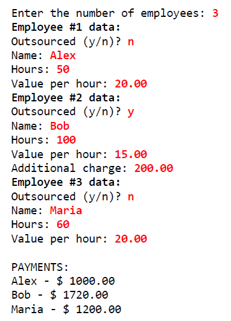<br><sub>Fig 42 - Exercise Polymorphism - (<a href='https://www.udemy.com/course/java-curso-completo/'>Work by  Nelio Alves</a>) </sub></div>

<br>

<div align="center">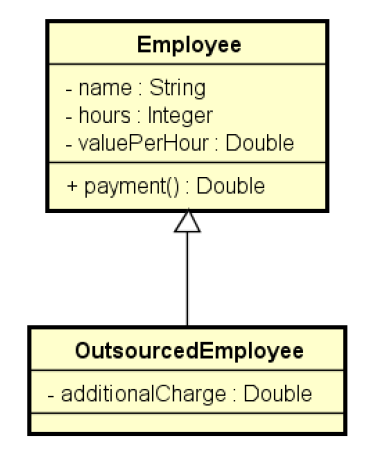<br><sub>Fig 43 - Exercise Polymorphism - (<a href='https://www.udemy.com/course/java-curso-completo/'>Work by  Nelio Alves</a>) </sub></div>

<br>

Class Employee

```java

package entities;

public class Employee {

	private String name;
	private Integer hours;
	private Double valuePerHour;
	
	public Employee() {
	}

	public Employee(String name, Integer hours, Double valuePerHour) {
		this.name = name;
		this.hours = hours;
		this.valuePerHour = valuePerHour;
	}

	public String getName() {
		return name;
	}

	public void setName(String name) {
		this.name = name;
	}

	public Integer getHours() {
		return hours;
	}

	public void setHours(Integer hours) {
		this.hours = hours;
	}

	public Double getValuePerHour() {
		return valuePerHour;
	}

	public void setValuePerHour(Double valuePerHour) {
		this.valuePerHour = valuePerHour;
	}
	
	public double payment() {
		return hours * valuePerHour;
	}
}

```

Class OutsourcedEmployee

```java

package entities;

public class OutsourcedEmployee extends Employee {

	private Double additionalCharge;

	public OutsourcedEmployee() {
		super();
	}
	
	public OutsourcedEmployee(String name, Integer hours, Double valuePerHour, Double additionalCharge) {
		super(name, hours, valuePerHour);
		this.additionalCharge = additionalCharge;
	}

	public Double getAdditionalCharge() {
		return additionalCharge;
	}

	public void setAdditionalCharge(Double additionalCharge) {
		this.additionalCharge = additionalCharge;
	}
	
	@Override
	public double payment() {
		return super.payment() + additionalCharge * 1.1;
	}
}

```

Program

```java

package application;

import java.util.ArrayList;
import java.util.List;
import java.util.Locale;
import java.util.Scanner;

import entities.Employee;
import entities.OutsourcedEmployee;

public class Program {

	public static void main(String[] args) {

		Locale.setDefault(Locale.US);
		Scanner sc = new Scanner(System.in);
		
		List<Employee> list = new ArrayList<>();
		
		System.out.print("Enter the number of employees: ");
		int n = sc.nextInt();
		
		for (int i=1; i<=n; i++) {
			System.out.println("Employee #" + i + " data:");
			System.out.print("Outsourced (y/n)? ");
			char ch = sc.next().charAt(0);
			System.out.print("Name: ");
			sc.nextLine();
			String name = sc.nextLine();
			System.out.print("Hours: ");
			int hours = sc.nextInt();
			System.out.print("Value per hour: ");
			double valuePerHour = sc.nextDouble();
			//OBS: A List of Employee can add Employe or OutsourcedEmploye (polymorphism)
			if (ch == 'y') {
				System.out.print("Additional charge: ");
				double additionalCharge = sc.nextDouble();
				list.add(new OutsourcedEmployee(name, hours, valuePerHour, additionalCharge));
			}
			else {
				list.add(new Employee(name, hours, valuePerHour));
			}
		}
		
		System.out.println();
		System.out.println("PAYMENTS:");
		for (Employee emp : list) {
			System.out.println(emp.getName() + " - $ " + String.format("%.2f", emp.payment()));
		}
		
		sc.close();
	}
}

```

#### <a name="chapter6part9.6"></a>Chapter 6 - Part 9.6: Abstraction Class and methods

Data **abstraction** is the process of hiding certain details and showing only essential information to the user.
Abstraction can be achieved with either **abstract classes** or **interfaces** (which you will learn more about in the next chapter).

The ```abstract``` keyword is a non-access modifier, used for classes and methods:
- **Abstract class**: is a restricted class that cannot be used to create objects (to access it, it must be inherited from another class).
- **Abstract method**: can only be used in an abstract class, and it does not have a body. The body is provided by the subclass (inherited from).

NOTE: In UML is Italic

An abstract class can have both abstract and regular methods:

```java

abstract class Animal {
  public abstract void animalSound();
  public void sleep() {
    System.out.println("Zzz");
  }
}

```

From the example above, it is not possible to create an object of the Animal class:

```java

Animal myObj = new Animal(); // will generate an error

```

To access the abstract class, it must be inherited from another class. Let's convert the Animal class we used in the Polymorphism chapter to an abstract class:

Remember from the Inheritance chapter that we use the extends keyword to inherit from a class.

```java

// Abstract class
abstract class Animal {
  // Abstract method (does not have a body)
  public abstract void animalSound();
  // Regular method
  public void sleep() {
    System.out.println("Zzz");
  }
}

// Subclass (inherit from Animal)
class Pig extends Animal {
  public void animalSound() {
    // The body of animalSound() is provided here
    System.out.println("The pig says: wee wee");
  }
}

class Main {
  public static void main(String[] args) {
    Pig myPig = new Pig(); // Create a Pig object
    myPig.animalSound();
    myPig.sleep();
  }
}

```

NOTE:  If a class has at least one method abstract, so this class is also abstract

Why And When To Use Abstract Classes and Methods?

To achieve security - hide certain details and only show the important details of an object.

Note: Abstraction can also be achieved with Interfaces, which you will learn more about in the next chapter.

Exercise: Write a program to read data from N figures (N provided by the user), and then show the areas of these figures in the same order in which they were entered.

<br>

<div align="center">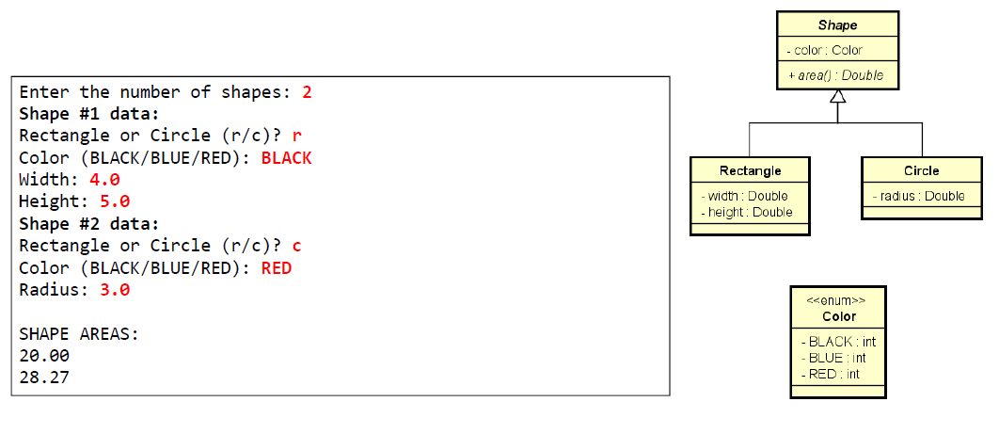<br><sub>Fig 44 - Exercise Abstraction - (<a href='https://www.udemy.com/course/java-curso-completo/'>Work by  Nelio Alves</a>) </sub></div>

<br>

Class Color

```java

package entities.enums;

public enum Color {
	BLACK,
	BLUE,
	RED;
}

```

Class Shape

```java

package entities;

import entities.enums.Color;

public abstract class Shape {

	private Color color;
	
	public Shape() {
	}
	
	public Shape(Color color) {
		this.color = color;
	}

	public Color getColor() {
		return color;
	}

	public void setColor(Color color) {
		this.color = color;
	}
	
	public abstract double area(); //OBS: when you put abstract in the method, you are obligated to put abstract in the class Shape
}

```

Class Circle

```java

package entities;

import entities.enums.Color;

public class Circle extends Shape {

	private Double radius;
	
	public Circle() {
		super();
	}
	
	public Circle(Color color, Double radius) {
		super(color);
		this.radius = radius;
	}

	public Double getRadius() {
		return radius;
	}

	public void setRadius(Double radius) {
		this.radius = radius;
	}

	@Override
	public double area() {
		return Math.PI * radius * radius;
	}
}

```

Class Retangle

```java

package entities;

import entities.enums.Color;

public class Rectangle extends Shape {

	private Double width;
	private Double height;
	
	public Rectangle() {
		super();
	}

	public Rectangle(Color color, Double width, Double height) {
		super(color);
		this.width = width;
		this.height = height;
	}

	public Double getWidth() {
		return width;
	}

	public void setWidth(Double width) {
		this.width = width;
	}

	public Double getHeight() {
		return height;
	}

	public void setHeight(Double height) {
		this.height = height;
	}

	@Override
	public double area() {
		return width * height;
	}
}

```

Program

```java

package application;

import java.util.ArrayList;
import java.util.List;
import java.util.Locale;
import java.util.Scanner;

import entities.Shape;
import entities.Rectangle;
import entities.Circle;
import entities.enums.Color;

public class Program {

	public static void main(String[] args) {

		Locale.setDefault(Locale.US);
		Scanner sc = new Scanner(System.in);
		
		List<Shape> list = new ArrayList<>();
		
		System.out.print("Enter the number of shapes: ");
		int n = sc.nextInt();
		
		for (int i=1; i<=n; i++) {
			System.out.println("Shape #" + i + " data:");
			System.out.print("Rectangle or Circle (r/c)? ");
			char ch = sc.next().charAt(0);
			System.out.print("Color (BLACK/BLUE/RED): ");
			Color color = Color.valueOf(sc.next());
			if (ch == 'r') {
				System.out.print("Width: ");
				double width = sc.nextDouble();
				System.out.print("Height: ");
				double height = sc.nextDouble();
				list.add(new Rectangle(color, width, height));
			}
			else {
				System.out.print("Radius: ");
				double radius = sc.nextDouble();
				list.add(new Circle(color, radius));
			}
		}
		
		System.out.println();
		System.out.println("SHAPE AREAS:");
		for (Shape shape : list) {
			System.out.println(String.format("%.2f", shape.area()));
		}
		
		sc.close();
	}
}

```

## <a name="chapter7"></a>Chapter 7: Exception Handling and Basic Input/Output

#### <a name="chapter7part1"></a>Chapter 7 - Part 1: Introduction to Exception Handling: Dealing with Errors

Exception handling is a crucial aspect of writing robust and reliable Java programs. It allows you to gracefully manage unexpected events or errors that may occur during program execution, preventing your application from crashing and providing a more user-friendly experience. Without proper exception handling, a single error could halt your entire program, leading to data loss or system instability. This lesson introduces the fundamental concepts of exception handling in Java, focusing on how to anticipate, catch, and handle errors effectively.

**Exceptions**

-  An exception is any error condition or behavior unexpected encountered by a running program

- In Java, an exception is an object inherited from the class:
  - java.lang.Exception - compiler forces to handle or propagate
  - java.lang.RuntimeException - compiler does not force to handle or propagate

- When thrown, an exception is propagated down the call stack of running methods, until it is captured (handled) or the program is terminated

<br>

<div align="center">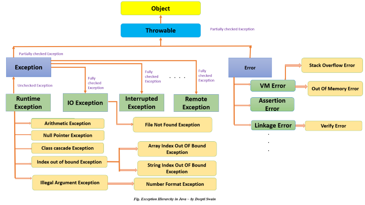<br><sub>Fig 50 - Exceptions in Java - (<a href='https://medium.com/interviewnoodle/exception-in-java-89a0b41e0c45'>Work by Deepti Swain</a>) </sub></div>

<br>

Error subclass is not handled, but Exception subclass need to be handled

**Why Exceptions?**

The exception handling model allows errors to be dealt with consistently and flexibly, using best practices

Benefits:
  - Delega a lógica do erro para a classe responsável por conhecer as regras que podem ocasionar o erro
  - Handles in an organized (including hierarchical) way exceptions of different types
  - The exception can load any data

#### <a name="chapter7part1.1"></a>Chapter 7 - Part 1.1: Understanding Exceptions

An exception is an event that disrupts the normal flow of a program's execution. It's essentially a signal that indicates a problem has occurred. These problems can arise from various sources, such as invalid user input, network connectivity issues, file access errors, or even programming mistakes.

**Checked vs. Unchecked Exceptions**

Java categorizes exceptions into two main types: checked and unchecked. Understanding the difference is crucial for effective exception handling.

- **Checked Exceptions**: These exceptions are checked by the compiler at compile time. If a method might throw a checked exception, it must either handle the exception using a try-catch block or declare that it throws the exception using the throws keyword in its method signature. This forces the programmer to explicitly acknowledge and deal with the potential exception. Examples include IOException (related to file input/output) and SQLException (related to database operations).

Example: Imagine you're writing a program that reads data from a file. The file might not exist, or the program might not have permission to access it. These are potential IOException scenarios. The compiler forces you to handle these possibilities.

- **Unchecked Exceptions**: These exceptions are not checked by the compiler at compile time. They typically represent programming errors or conditions that are difficult to recover from. Unchecked exceptions are subclasses of RuntimeException or Error.. Examples include NullPointerException, ArrayIndexOutOfBoundsException, and IllegalArgumentException. While you can handle unchecked exceptions, you are not required to do so by the compiler.

Example: Consider accessing an element in an array using an index that is out of bounds. This will result in an ArrayIndexOutOfBoundsException. While you could wrap the array access in a try-catch block, it's generally better to prevent the exception from occurring in the first place by validating the index.

|Feature	|Checked Exceptions	|Unchecked Exceptions|
| :-----------: | :-----------: | :-----------: |
|Compilation Check	|Checked at compile time	|Not checked at compile time|
|Handling	|Must be handled or declared in the method signature	|Handling is optional|
|Common Use Cases	|External resources, recoverable errors	|Programming errors, difficult-to-recover errors|
|Examples	|IOException, SQLException	|NullPointerException, IllegalArgumentException|

**The Exception Hierarchy**

In Java, exceptions are organized in a hierarchy with Throwable as the root class. Throwable has two main subclasses: Exception and Error.

- **Exception**: Represents conditions that a reasonable application might want to catch. This is the base class for both checked and unchecked exceptions (excluding RuntimeException).
- **Error**: Represents more serious problems that a reasonable application should not attempt to catch. These are typically related to the Java Virtual Machine (JVM) or system-level issues, such as OutOfMemoryError or StackOverflowError. Errors are usually unrecoverable.

Understanding this hierarchy helps you choose the appropriate way to handle different types of exceptions. You'll primarily focus on handling Exception and its subclasses.

#### <a name="chapter7part1.2"></a>Chapter 7 - Part 1.2: The try-catch Block: Handling Exceptions

The try-catch block is the fundamental mechanism for handling exceptions in Java. It allows you to isolate a section of code that might throw an exception and specify how to respond if an exception occurs.

**Structure of a try-catch Block**

The try-catch block consists of two main parts:

- **```try``` block**: This block encloses the code that might throw an exception. The JVM monitors this code for any exceptions that are thrown.

- **```catch``` block**: This block contains the code that will be executed if a specific type of exception is thrown within the try block. You can have multiple catch blocks to handle different types of exceptions.

```java
try {
    // Code that might throw an exception
    int result = 10 / 0; // This will throw an ArithmeticException
    System.out.println("This line will not be executed if an exception occurs.");
} catch (ArithmeticException e) {
    // Code to handle the ArithmeticException
    System.err.println("Error: Division by zero occurred.");
    // You can also log the exception, display an error message to the user, etc.
}
System.out.println("Program continues after the try-catch block.");
```

In this example, the try block contains a division by zero, which will throw an ArithmeticException. The catch block specifically catches ArithmeticException objects. When the exception is thrown, the JVM immediately jumps to the catch block, executes the code within it, and then continues execution after the try-catch block. The System.out.println statement inside the try block is skipped because the exception occurred before it could be executed.

**Multiple catch Blocks**

You can include multiple catch blocks to handle different types of exceptions that might be thrown within the try block. The catch blocks are examined in the order they appear. The first catch block that matches the type of the thrown exception will be executed.

```java
try {
    // Code that might throw different types of exceptions
    String str = null;
    System.out.println(str.length()); // Might throw a NullPointerException

    int[] arr = new int[5];
    System.out.println(arr[10]); // Might throw an ArrayIndexOutOfBoundsException
} catch (NullPointerException e) {
    System.err.println("Error: NullPointerException occurred.");
} catch (ArrayIndexOutOfBoundsException e) {
    System.err.println("Error: ArrayIndexOutOfBoundsException occurred.");
} catch (Exception e) {
    System.err.println("An unexpected error occurred: " + e.getMessage());
}
System.out.println("Program continues after the try-catch block.");
```

In this example, the try block contains code that might throw either a NullPointerException or an ArrayIndexOutOfBoundsException. There are separate catch blocks to handle each of these exceptions. If an exception is thrown that doesn't match either of these catch blocks, the final catch block, which catches the generic Exception type, will be executed. This is a good practice to ensure that all exceptions are handled in some way.

**Important**: When using multiple catch blocks, the order matters. You should always place more specific exception types before more general exception types. For example, you should catch NullPointerException before catching Exception, because NullPointerException is a subclass of Exception. If you catch Exception first, the catch block for NullPointerException will never be executed.

**The finally Block: Ensuring Code Executes**

The finally block is an optional part of the try-catch structure. It contains code that will always be executed, regardless of whether an exception is thrown or caught. This is useful for performing cleanup operations, such as closing files or releasing resources, that must be done regardless of the outcome of the try block.

```java
import java.io.*;

public class FinallyExample {
    public static void main(String[] args) {
        BufferedReader reader = null;
        try {
            reader = new BufferedReader(new FileReader("example.txt"));
            String line = reader.readLine();
            System.out.println(line);
        } catch (IOException e) {
            System.err.println("Error reading file: " + e.getMessage());
        } finally {
            try {
                if (reader != null) {
                    reader.close(); // Ensure the file is closed
                }
            } catch (IOException e) {
                System.err.println("Error closing file: " + e.getMessage());
            }
            System.out.println("Finally block executed.");
        }
    }
}
```

In this example, the finally block ensures that the BufferedReader is closed, even if an IOException is thrown while reading the file. This prevents resource leaks and ensures that the file is properly closed. Note the nested try-catch block within the finally block. This is necessary because the close() method itself can throw an IOException, and we want to handle that possibility as well.

**try-with-resources Statement (Modern Approach)**

Java 7 introduced the try-with-resources statement, which provides a more concise and safer way to manage resources that need to be closed after use. This statement automatically closes resources that implement the AutoCloseable interface (which includes most I/O resources like BufferedReader, FileOutputStream, etc.) at the end of the try block, regardless of whether an exception is thrown or not.

```java
import java.io.*;

public class TryWithResourcesExample {
    public static void main(String[] args) {
        try (BufferedReader reader = new BufferedReader(new FileReader("example.txt"))) {
            String line = reader.readLine();
            System.out.println(line);
        } catch (IOException e) {
            System.err.println("Error reading file: " + e.getMessage());
        }
        // The reader is automatically closed here
    }
}
```

In this example, the BufferedReader is declared within the parentheses of the try statement. This ensures that the reader will be automatically closed when the try block completes, even if an IOException is thrown. This eliminates the need for a finally block and makes the code cleaner and less error-prone. This is the preferred way to handle resources in modern Java code.

#### <a name="chapter7part1.3"></a>Chapter 7 - Part 1.3: Common Exception Types

Understanding common exception types is essential for effective exception handling. Here are some of the most frequently encountered exceptions in Java:

- ```NullPointerException```: Thrown when you try to access a member (method or field) of a null object. This is a very common exception and often indicates a programming error.

```java
String str = null;
try {
    System.out.println(str.length()); // Throws NullPointerException
} catch (NullPointerException e) {
    System.err.println("Error: Cannot get length of a null string.");
}
```

- ```ArrayIndexOutOfBoundsException```: Thrown when you try to access an array element using an index that is outside the valid range (0 to array length - 1).

```java
int[] arr = new int[5];
try {
    System.out.println(arr[10]); // Throws ArrayIndexOutOfBoundsException
} catch (ArrayIndexOutOfBoundsException e) {
    System.err.println("Error: Array index out of bounds.");
}
```

- ```ArithmeticException```: Thrown when you perform an invalid arithmetic operation, such as dividing by zero.

```java
try {
    int result = 10 / 0; // Throws ArithmeticException
} catch (ArithmeticException e) {
    System.err.println("Error: Division by zero.");
}
```

- ```IllegalArgumentException```: Thrown when a method receives an argument that is not valid.

```java
public static void setAge(int age) {
    if (age < 0) {
        throw new IllegalArgumentException("Age cannot be negative.");
    }
    // ...
}

public static void main(String[] args) {
    try {
        setAge(-5);
    } catch (IllegalArgumentException e) {
        System.err.println("Error: " + e.getMessage());
    }
}
```

- ```IOException```: Thrown when an input or output operation fails. This is a checked exception.

```java
import java.io.*;

public class IOExceptionExample {
    public static void main(String[] args) {
        try (FileReader reader = new FileReader("nonexistent_file.txt")) {
            // ...
        } catch (IOException e) {
            System.err.println("Error reading file: " + e.getMessage());
        }
    }
}
```

#### <a name="chapter7part1.4"></a>Chapter 7 - Part 1.4: Best Practices for Exception Handling

Effective exception handling is crucial for writing robust and maintainable Java code. Here are some best practices to follow:

- **Be Specific**: Catch specific exception types whenever possible. This allows you to handle different types of errors in different ways and provides more informative error messages. Avoid catching the generic Exception class unless you really need to handle all possible exceptions in the same way.

- **Handle Exceptions Appropriately**: Don't just catch exceptions and ignore them. At a minimum, log the exception so that you can investigate the issue later. Ideally, you should also take some action to recover from the error or provide a meaningful error message to the user.

- **Use try-with-resources**: When working with resources that need to be closed (like files, network connections, etc.), use the try-with-resources statement to ensure that the resources are always closed, even if an exception is thrown.

- **Don't Overuse Exceptions**: Exceptions should be used for exceptional circumstances, not for normal control flow. For example, don't use an exception to signal that a user entered invalid input. Instead, validate the input before processing it.

- **Clean Up Resources in finally**: If you can't use try-with-resources (e.g., because you're using an older version of Java), use a finally block to ensure that resources are cleaned up, even if an exception is thrown.

- **Document Exceptions**: If a method might throw a checked exception, document it using the @throws tag in the Javadoc. This informs other developers that they need to handle the exception when calling your method.

- **Consider Custom Exceptions**: For application-specific errors, consider creating your own custom exception classes. This can make your code more readable and maintainable.

#### <a name="chapter7part2"></a>Chapter 7 - Part 2: The `try-catch` Block: Handling Exceptions

Exception handling is a crucial aspect of writing robust and reliable Java programs. It allows you to gracefully handle unexpected events or errors that may occur during program execution, preventing your application from crashing and providing a more user-friendly experience. The try-catch block is the fundamental mechanism for handling exceptions in Java, enabling you to isolate potentially problematic code and define how to respond when an exception is thrown.

#### <a name="chapter7part2.1"></a>Chapter 7 - Part 2.1: Understanding Exceptions

Before diving into the try-catch block, it's essential to understand what exceptions are. In Java, an exception is an event that disrupts the normal flow of the program's execution. Exceptions can occur for various reasons, such as:

- **Invalid Input**: The user enters data in an incorrect format (e.g., entering text when a number is expected).
- **File Not Found**: The program tries to open a file that doesn't exist.
- **Network Issues**: The program attempts to connect to a server that is unavailable.
- **Arithmetic Errors**: The program tries to divide a number by zero.
- **Null Pointer**: The program tries to access a member of an object that is null.
- **Array Index Out of Bounds**: The program tries to access an array element with an invalid index.

Java provides a hierarchy of exception classes, all derived from the Throwable class. Two main categories of exceptions are:

- **Checked Exceptions**: These exceptions are checked at compile time. If a method might throw a checked exception, it must either handle the exception using a try-catch block or declare that it throws the exception using the throws keyword. Examples include IOException and SQLException.

- **Unchecked Exceptions (Runtime Exceptions)**: These exceptions are not checked at compile time. They typically indicate programming errors and are often caused by issues like null pointers or array index out of bounds. Examples include NullPointerException and ArrayIndexOutOfBoundsException.

#### <a name="chapter7part2.2"></a>Chapter 7 - Part 2.2: The try-catch Block: A Detailed Explanation

The try-catch block is used to handle exceptions in Java. It consists of two main parts:

- **```try``` block**: This block encloses the code that might throw an exception.

- **```catch``` block**: This block contains the code that will be executed if an exception of a specific type occurs within the try block.

Here's the basic syntax of a try-catch block:

```java
try {
    // Code that might throw an exception
} catch (ExceptionType1 e) {
    // Code to handle ExceptionType1
} catch (ExceptionType2 e) {
    // Code to handle ExceptionType2
} // ... more catch blocks if needed
```

**Explanation**:

- The code within the try block is executed.

- If an exception occurs within the try block, the Java runtime system searches for a catch block that can handle the exception.

- The catch block's ExceptionType must be the same as or a superclass of the type of the exception that was thrown.

- If a matching catch block is found, the code within that catch block is executed. The exception object is assigned to the variable e, which can be used to access information about the exception.

- If no matching catch block is found, the exception is passed up the call stack to the calling method. If the exception is not handled there, it continues to propagate up the stack until it is either caught or the program terminates.

- After the catch block (if one is executed), the program continues execution after the try-catch block.

**Example 1: Handling ArithmeticException**

This example demonstrates how to handle an ArithmeticException, which occurs when dividing by zero.

```java
public class DivisionExample {
    public static void main(String[] args) {
        int numerator = 10;
        int denominator = 0;
        int result;

        try {
            result = numerator / denominator; // This will cause an ArithmeticException
            System.out.println("Result: " + result); // This line will not be executed if an exception occurs
        } catch (ArithmeticException e) {
            System.out.println("Error: Cannot divide by zero.");
            System.out.println("Exception details: " + e.getMessage()); // Print the exception message
        }

        System.out.println("Program continues after the try-catch block.");
    }
}
```

**Explanation**:

- The try block contains the division operation, which might throw an ArithmeticException if denominator is zero.
- The catch block specifically handles ArithmeticException. If the exception occurs, the code within the catch block is executed, printing an error message and the exception details.
- The line System.out.println("Result: " + result); inside the try block is skipped because the exception occurs before it can be executed.
- The program continues execution after the try-catch block, printing "Program continues after the try-catch block."

**Example 2: Handling ArrayIndexOutOfBoundsException**

This example demonstrates how to handle an ArrayIndexOutOfBoundsException, which occurs when trying to access an array element with an invalid index.

```java
public class ArrayExample {
    public static void main(String[] args) {
        int[] numbers = {1, 2, 3, 4, 5};

        try {
            System.out.println("Element at index 10: " + numbers[10]); // This will cause an ArrayIndexOutOfBoundsException
        } catch (ArrayIndexOutOfBoundsException e) {
            System.out.println("Error: Array index out of bounds.");
            System.out.println("Exception details: " + e.getMessage());
        }

        System.out.println("Program continues after the try-catch block.");
    }
}
```

**Explanation**:

- The try block attempts to access the element at index 10 of the numbers array. Since the array only has elements at indices 0 to 4, this will throw an ArrayIndexOutOfBoundsException.
- The catch block handles the ArrayIndexOutOfBoundsException, printing an error message and the exception details.
- The program continues execution after the try-catch block.

**Example 3: Multiple catch Blocks**

It's possible to have multiple catch blocks to handle different types of exceptions. This allows you to provide specific error handling for each type of exception that might occur.

```java
public class MultipleCatchExample {
    public static void main(String[] args) {
        try {
            // Simulate different exceptions
            int choice = 2; // Change this value to test different scenarios

            if (choice == 1) {
                int result = 10 / 0; // ArithmeticException
            } else if (choice == 2) {
                int[] numbers = {1, 2, 3};
                System.out.println(numbers[5]); // ArrayIndexOutOfBoundsException
            } else {
                String str = null;
                System.out.println(str.length()); // NullPointerException
            }
        } catch (ArithmeticException e) {
            System.out.println("ArithmeticException caught: " + e.getMessage());
        } catch (ArrayIndexOutOfBoundsException e) {
            System.out.println("ArrayIndexOutOfBoundsException caught: " + e.getMessage());
        } catch (NullPointerException e) {
            System.out.println("NullPointerException caught: " + e.getMessage());
        } catch (Exception e) {
            System.out.println("Generic Exception caught: " + e.getMessage()); // Catch-all block
        }

        System.out.println("Program continues...");
    }
}
```

**Explanation**:

- This example demonstrates how to use multiple catch blocks to handle different types of exceptions.
- The try block contains code that might throw an ArithmeticException, ArrayIndexOutOfBoundsException, or NullPointerException, depending on the value of the choice variable.
- Each catch block handles a specific type of exception.
- The catch (Exception e) block is a generic catch-all block that will catch any exception that is not caught by the more specific catch blocks. It's good practice to include a generic catch block as the last catch block to ensure that all exceptions are handled.

- **Important**: The order of catch blocks matters. More specific exception types should be caught before more general exception types. For example, ArithmeticException should be caught before Exception, because ArithmeticException is a subclass of Exception. If you catch Exception first, the ArithmeticException catch block will never be executed.

**Example 4: Nested try-catch Blocks**

try-catch blocks can be nested within each other. This is useful when you have code that might throw an exception and you want to handle it at different levels.

```java
public class NestedTryCatchExample {
    public static void main(String[] args) {
        try {
            // Outer try block
            int[] numbers = {1, 2, 3};

            try {
                // Inner try block
                System.out.println(numbers[5]); // Potential ArrayIndexOutOfBoundsException
            } catch (ArrayIndexOutOfBoundsException e) {
                System.out.println("Inner catch: ArrayIndexOutOfBoundsException caught");
            }

            System.out.println("Outer try block continues");

        } catch (Exception e) {
            System.out.println("Outer catch: Exception caught");
        }

        System.out.println("Program continues...");
    }
}
```

**Explanation**:

- The outer try block contains an inner try-catch block.
- If an ArrayIndexOutOfBoundsException occurs within the inner try block, the inner catch block will handle it.
- If any other exception occurs within the outer try block (but outside the inner try-catch), the outer catch block will handle it.
- If an exception is caught by the inner catch block, the outer catch block will not be executed.

#### <a name="chapter7part2.3"></a>Chapter 7 - Part 2.3: Best Practices for Using try-catch Blocks

- **Be Specific**: Catch specific exception types whenever possible. This allows you to handle each type of exception appropriately. Avoid using a generic catch (Exception e) block as the only catch block unless you truly want to handle all exceptions in the same way.

- **Handle or Re-throw**: When you catch an exception, you should either handle it (e.g., by logging an error, displaying a message to the user, or retrying the operation) or re-throw it if you cannot handle it at the current level. Re-throwing an exception can be done using the throw keyword.

- **Avoid Empty catch Blocks**: An empty catch block (i.e., a catch block that does nothing) is generally a bad practice. It can hide errors and make it difficult to debug your code. At the very least, you should log the exception.

- **Keep try Blocks Small**: The try block should only contain the code that might throw an exception. This makes it easier to identify the source of the exception and to handle it appropriately.

- **Use finally Blocks**: The finally block (which will be covered in the next lesson) can be used to ensure that certain code is always executed, regardless of whether an exception is thrown or caught. This is often used to release resources, such as closing files or network connections.

#### <a name="chapter7part3"></a>Chapter 7 - Part 3: The `finally` Block: Ensuring Code Executes

The finally block in Java is a crucial part of exception handling. It provides a mechanism to guarantee that a section of code is always executed, regardless of whether an exception is thrown or caught within a try block. This is particularly important for tasks like releasing resources, closing files, or cleaning up connections, ensuring that your program remains stable and avoids resource leaks. Understanding and utilizing the finally block effectively is essential for writing robust and reliable Java applications.

#### <a name="chapter7part3.1"></a>Chapter 7 - Part 3.1: Understanding the finally Block

The finally block is an optional block that follows the try and catch blocks in a try-catch construct. Its primary purpose is to execute code that must run, irrespective of whether an exception occurred or was handled. This makes it ideal for cleanup operations.

**Syntax and Structure**

The basic structure of a try-catch-finally block is as follows:

```java
try {
    // Code that might throw an exception
} catch (ExceptionType1 e1) {
    // Handle ExceptionType1
} catch (ExceptionType2 e2) {
    // Handle ExceptionType2
} finally {
    // Code that always executes
}
```

- **```try``` block**: Encloses the code that might potentially throw an exception.
- **```catch``` block(s)**: Handles specific types of exceptions that might be thrown within the try block. There can be multiple catch blocks to handle different exception types.
- **```finally``` block**: Contains code that is guaranteed to execute, regardless of whether an exception is thrown or caught.

**Execution Flow**

The execution flow within a try-catch-finally block can be summarized as follows:

- The code within the try block is executed.
- If an exception occurs within the try block:
  - The JVM searches for a matching catch block to handle the exception.
  - If a matching catch block is found, the code within that catch block is executed.
  - After the catch block (or if no exception occurred), the code within the finally block is executed.
  - If no matching catch block is found, the finally block is executed, and then the exception is propagated up the call stack.
- If no exception occurs within the try block, the code within the finally block is executed after the try block completes.

**Key Characteristics**

- **Always Executes**: The code in the finally block is always executed, except in very rare circumstances (e.g., the JVM crashes or System.exit() is called).
- **Cleanup Operations**: It's primarily used for releasing resources, closing connections, and performing other cleanup tasks.
- **Optional**: The finally block is optional. You can have a try-catch block without a finally block, or a try-finally block without any catch blocks (though this is less common).
- **Order of Execution**: The finally block is executed after the try block completes normally or after a catch block handles an exception.

#### <a name="chapter7part3.2"></a>Chapter 7 - Part 3.2: Practical Examples of Using finally

**Example 1: Closing a File**

One of the most common uses of the finally block is to ensure that files are closed properly, even if an error occurs while reading or writing to them.

```java
import java.io.BufferedReader;
import java.io.FileReader;
import java.io.IOException;

public class FinallyExample {

    public static void main(String[] args) {
        BufferedReader reader = null;
        try {
            reader = new BufferedReader(new FileReader("example.txt")); // Assume example.txt exists
            String line;
            while ((line = reader.readLine()) != null) {
                System.out.println(line);
                // Simulate an exception occurring during reading
                if (line.contains("error")) {
                    throw new IOException("Simulated error while reading the file.");
                }
            }
        } catch (IOException e) {
            System.err.println("An IOException occurred: " + e.getMessage());
        } finally {
            try {
                if (reader != null) {
                    reader.close();
                    System.out.println("File reader closed in finally block.");
                }
            } catch (IOException e) {
                System.err.println("Error closing the file: " + e.getMessage());
            }
        }
    }
}
```

In this example:

- A BufferedReader is used to read from a file.
- The try block attempts to read the file line by line.
- An IOException is caught if any error occurs during file reading.
- The finally block ensures that the BufferedReader is closed, regardless of whether an exception was thrown or caught. This prevents resource leaks.
- Note the nested try-catch within the finally block. This is important because the close() method itself can throw an IOException, and we want to handle that possibility without preventing the finally block from completing.

**Example 2: Releasing Database Connections**

Another common use case is releasing database connections. Database connections are a limited resource, and it's crucial to release them when they are no longer needed.

```java
import java.sql.Connection;
import java.sql.DriverManager;
import java.sql.SQLException;
import java.sql.Statement;

public class DatabaseFinallyExample {

    public static void main(String[] args) {
        Connection connection = null;
        Statement statement = null;
        try {
            // Replace with your database URL, username, and password
            String url = "jdbc:mysql://localhost:3306/mydatabase";
            String user = "myuser";
            String password = "mypassword";

            connection = DriverManager.getConnection(url, user, password);
            statement = connection.createStatement();

            // Execute a query
            String sql = "SELECT * FROM users";
            statement.execute(sql);

            // Simulate an exception
            //throw new SQLException("Simulated SQL exception");

        } catch (SQLException e) {
            System.err.println("A SQLException occurred: " + e.getMessage());
        } finally {
            try {
                if (statement != null) {
                    statement.close();
                    System.out.println("Statement closed in finally block.");
                }
                if (connection != null) {
                    connection.close();
                    System.out.println("Connection closed in finally block.");
                }
            } catch (SQLException e) {
                System.err.println("Error closing connection or statement: " + e.getMessage());
            }
        }
    }
}
```

In this example:

- A database connection is established within the try block.
- A Statement is created to execute SQL queries.
- The finally block ensures that both the Statement and the Connection are closed, regardless of whether an SQLException is thrown or caught.
- Again, nested try-catch blocks are used within the finally block to handle potential SQLExceptions during the closing of the resources.

**Example 3: Handling Resources in a Method**

The finally block is also useful when dealing with resources within a method that might throw exceptions.

```java
public class MethodFinallyExample {

    public static String processData() {
        StringBuilder result = new StringBuilder();
        try {
            result.append("Data processing started.\n");
            // Simulate some data processing
            result.append("Data processed successfully.\n");
            // Simulate a potential error
            //throw new RuntimeException("Simulated processing error.");
            return result.toString(); // Return the result if no exception occurs
        } catch (RuntimeException e) {
            result.append("Error during processing: ").append(e.getMessage()).append("\n");
            return result.toString(); // Return the result with the error message
        } finally {
            result.append("Data processing completed (finally block).\n");
            // Note: Returning from the finally block is generally discouraged
            // as it can override returns from try or catch blocks.
        }
    }

    public static void main(String[] args) {
        String output = processData();
        System.out.println(output);
    }
}
```

In this example:

- The processData() method simulates some data processing.
- A RuntimeException is caught if any error occurs during processing.
- The finally block appends a message indicating that data processing is completed, regardless of whether an exception was thrown or caught.

- **Important Note**: While this example demonstrates the execution of the finally block, returning a value from within a finally block is generally discouraged. If a return statement is present in both the try or catch block and the finally block, the return statement in the finally block will override the return statement in the try or catch block. This can lead to unexpected behavior and make debugging difficult.

#### <a name="chapter7part3.3"></a>Chapter 7 - Part 3.3: Best Practices and Considerations

- **Resource Management**: Always use the finally block to release resources such as file handles, database connections, and network sockets.
- **Avoid Returning from finally**: As mentioned earlier, avoid returning values from within a finally block, as it can override return values from try or catch blocks.
- **Nested try-catch**: Use nested try-catch blocks within the finally block to handle exceptions that might be thrown by the cleanup code itself (e.g., when closing a file).
- **try-with-resources**: In Java 7 and later, the try-with-resources statement provides a more concise and safer way to manage resources. It automatically closes resources that implement the AutoCloseable interface, eliminating the need for a finally block in many cases. We will cover this in a later lesson.
- **Logging**: Consider adding logging statements within the finally block to track resource release and cleanup operations. This can be helpful for debugging and auditing purposes.

#### <a name="chapter7part4"></a>Chapter 7 - Part 4: Common Exception Types: NullPointerException, ArrayIndexOutOfBoundsException

Exception handling is a crucial aspect of writing robust and reliable Java programs. It allows you to gracefully handle unexpected errors or exceptional situations that may arise during program execution, preventing your program from crashing and providing a more user-friendly experience. This lesson focuses on two of the most common exception types you'll encounter: NullPointerException and ArrayIndexOutOfBoundsException. Understanding these exceptions and how to prevent them is essential for writing stable and error-free code.

#### <a name="chapter7part4.1"></a>Chapter 7 - Part 4.1: Understanding Exceptions

In Java, an exception is an event that disrupts the normal flow of the program's execution. Exceptions can occur for various reasons, such as invalid user input, network issues, or programming errors. Java uses a mechanism called exception handling to deal with these situations.

When an exception occurs, the program creates an exception object containing information about the error. This object is then "thrown," and the Java runtime system attempts to find a suitable "handler" to deal with the exception. If no handler is found, the program terminates abruptly.

#### <a name="chapter7part4.2"></a>Chapter 7 - Part 4.2: The NullPointerException

The NullPointerException (NPE) is one of the most frequently encountered exceptions in Java. It occurs when you try to access a member (field or method) of an object through a null reference. In simpler terms, you're trying to use an object that doesn't actually exist.

**What Causes a NullPointerException?**

A NullPointerException is thrown when you attempt to:

- Call a method on a null object.
- Access a field of a null object.
- Take the length of null as if it were an array.
- Access or modify the slots of null as if it were an array.
- Throw null as if it were a Throwable value.

**Example of a NullPointerException**

```java
public class NullPointerExceptionExample {

    public static void main(String[] args) {
        String str = null; // str is a null reference

        try {
            int length = str.length(); // Attempting to call a method on a null reference
            System.out.println("Length of the string: " + length);
        } catch (NullPointerException e) {
            System.out.println("Caught a NullPointerException: " + e.getMessage());
        }
    }
}
```

In this example, the str variable is assigned null. When we try to call the length() method on str, a NullPointerException is thrown. The try-catch block catches the exception, and the error message is printed to the console.

**Preventing NullPointerException**

Here are some strategies to prevent NullPointerException:

- **Always initialize variables**: Ensure that your object variables are properly initialized before you use them. Avoid leaving variables uninitialized, as they will default to null.

- **Check for null before accessing members**: Before calling a method or accessing a field of an object, check if the object is null. You can use an if statement to perform this check.

```java
String str = getStringFromSomewhere(); // Could return null

if (str != null) {
    int length = str.length();
    System.out.println("Length of the string: " + length);
} else {
    System.out.println("String is null, cannot get the length.");
}
```

- **Use defensive programming**: Be cautious when working with methods that might return null. Always consider the possibility of a null return value and handle it appropriately.

- **Use the Objects.requireNonNull() method**: Java provides the Objects.requireNonNull() method, which throws a NullPointerException if the provided object is null. This can be useful for validating method parameters.

```java
import java.util.Objects;

public class Example {
    public void processString(String str) {
        Objects.requireNonNull(str, "String cannot be null"); // Throws NPE if str is null
        // ... process the string
    }
}
```

- **Consider using Optional**: The Optional class (introduced in Java 8) is a container object that may or may not contain a non-null value. Using Optional can help you avoid NullPointerException by explicitly handling the case where a value might be absent.

```java
import java.util.Optional;

public class OptionalExample {
    public static void main(String[] args) {
        Optional<String> optionalString = Optional.ofNullable(getStringFromSomewhere());

        if (optionalString.isPresent()) {
            String str = optionalString.get();
            System.out.println("String length: " + str.length());
        } else {
            System.out.println("String is absent.");
        }
    }

    public static String getStringFromSomewhere() {
        return null; // Simulate a method that might return null
    }
}
```

**Advanced NullPointerException Example**

Consider a scenario where you're working with nested objects:

```java
public class Address {
    private String street;

    public String getStreet() {
        return street;
    }

    public void setStreet(String street) {
        this.street = street;
    }
}

public class Person {
    private Address address;

    public Address getAddress() {
        return address;
    }

    public void setAddress(Address address) {
        this.address = address;
    }
}

public class NullPointerExceptionAdvancedExample {
    public static void main(String[] args) {
        Person person = new Person(); // Address is null
        try {
            String street = person.getAddress().getStreet().toUpperCase(); // Potential NPE
            System.out.println("Street in uppercase: " + street);
        } catch (NullPointerException e) {
            System.out.println("Caught a NullPointerException: " + e.getMessage());
        }
    }
}
```

In this case, person.getAddress() returns null because the address field of the Person object hasn't been initialized. Consequently, calling getStreet() on a null Address object results in a NullPointerException.

To prevent this, you need to check for null at each level:

```java
public class NullPointerExceptionSafeExample {
    public static void main(String[] args) {
        Person person = new Person();

        if (person != null && person.getAddress() != null && person.getAddress().getStreet() != null) {
            String street = person.getAddress().getStreet().toUpperCase();
            System.out.println("Street in uppercase: " + street);
        } else {
            System.out.println("Could not retrieve street information.");
        }
    }
}
```

This code avoids the NullPointerException by checking for null at each step of the object hierarchy. While verbose, it's a safe approach. Using Optional could also simplify this.

#### <a name="chapter7part4.3"></a>Chapter 7 - Part 4.3: The ArrayIndexOutOfBoundsException

The ArrayIndexOutOfBoundsException is thrown when you try to access an array element using an index that is either negative or greater than or equal to the array's length. Arrays in Java are zero-indexed, meaning the first element is at index 0, and the last element is at index length - 1.

**What Causes an ArrayIndexOutOfBoundsException?**

This exception occurs when you attempt to:

- Access an array element with a negative index.
- Access an array element with an index greater than or equal to the array's length.

**Example of an ArrayIndexOutOfBoundsException**

```java
public class ArrayIndexOutOfBoundsExceptionExample {

    public static void main(String[] args) {
        int[] numbers = {1, 2, 3, 4, 5};

        try {
            int element = numbers[5]; // Attempting to access an element beyond the array's bounds
            System.out.println("Element at index 5: " + element);
        } catch (ArrayIndexOutOfBoundsException e) {
            System.out.println("Caught an ArrayIndexOutOfBoundsException: " + e.getMessage());
        }
    }
}
```

In this example, the numbers array has a length of 5, so valid indices are 0 to 4. Trying to access numbers[5] throws an ArrayIndexOutOfBoundsException.

**Preventing ArrayIndexOutOfBoundsException**

Here are some strategies to prevent ArrayIndexOutOfBoundsException:

- **Check array bounds before accessing elements**: Before accessing an array element, ensure that the index is within the valid range (0 to length - 1).

```java
int[] numbers = {1, 2, 3, 4, 5};
int index = 5;

if (index >= 0 && index < numbers.length) {
    int element = numbers[index];
    System.out.println("Element at index " + index + ": " + element);
} else {
    System.out.println("Index is out of bounds.");
}
```

- **Use loops carefully**: When iterating through arrays using loops, make sure your loop condition prevents accessing elements outside the array's bounds.

```java
int[] numbers = {1, 2, 3, 4, 5};

for (int i = 0; i < numbers.length; i++) { // Correct loop condition
    System.out.println("Element at index " + i + ": " + numbers[i]);
}
```

Incorrect loop condition (example):

```java
// This will cause an ArrayIndexOutOfBoundsException
// for (int i = 0; i <= numbers.length; i++) {
//     System.out.println("Element at index " + i + ": " + numbers[i]);
// }
```

- **Be mindful of array length**: When creating arrays, ensure you allocate enough space to store the required elements. If you're dynamically adding elements to an array, consider using data structures like ArrayList that automatically resize. ArrayList will be covered in a later module.

- **Validate input**: If the array index comes from user input or an external source, validate the input to ensure it's within the valid range.

**Advanced ArrayIndexOutOfBoundsException Example**

Consider a scenario where you're working with multidimensional arrays:

```java
public class ArrayIndexOutOfBoundsExceptionAdvancedExample {
    public static void main(String[] args) {
        int[][] matrix = {
                {1, 2, 3},
                {4, 5, 6}
        };

        try {
            int element = matrix[2][0]; // Accessing a row that doesn't exist
            System.out.println("Element at matrix[2][0]: " + element);
        } catch (ArrayIndexOutOfBoundsException e) {
            System.out.println("Caught an ArrayIndexOutOfBoundsException: " + e.getMessage());
        }
    }
}
```

In this example, matrix is a 2x3 array (2 rows, 3 columns). Trying to access matrix[2][0] throws an ArrayIndexOutOfBoundsException because there is no row at index 2.

To prevent this, you need to check the bounds for each dimension:

```java
public class ArrayIndexOutOfBoundsExceptionSafeMatrixExample {
    public static void main(String[] args) {
        int[][] matrix = {
                {1, 2, 3},
                {4, 5, 6}
        };

        int row = 2;
        int col = 0;

        if (row >= 0 && row < matrix.length && col >= 0 && col < matrix[0].length) {
            int element = matrix[row][col];
            System.out.println("Element at matrix[" + row + "][" + col + "]: " + element);
        } else {
            System.out.println("Index is out of bounds.");
        }
    }
}
```

This code avoids the ArrayIndexOutOfBoundsException by checking that both the row and column indices are within the valid bounds of the matrix array.

#### <a name="chapter7part5"></a>Chapter 7 - Part 5: Custom Exceptions

When the built-in exception classes in Java don't fully describe a problem that can occur in your application, you can create custom exceptions. This involves defining your own exception classes that inherit from the Exception class or one of its subclasses.

#### <a name="chapter7part5.1"></a>Chapter 7 - Part 5.1: What is Custom Exception

- **Specific Error Handling**: Custom exceptions allow you to handle errors in a way that is specific to your application.
- **Improved Readability**: They make your code more readable by providing meaningful names for specific error conditions.
- **Encapsulation**: They encapsulate error information, making it easier to manage and propagate errors.
- **Checked vs. Unchecked**: You can decide whether your custom exception should be checked (must be declared in the method signature) or unchecked (extends RuntimeException).

#### <a name="chapter7part5.2"></a>Chapter 7 - Part 5.2: Creating Custom Exceptions

- **Define a New Class**: Create a new class that extends the Exception class (for checked exceptions) or RuntimeException (for unchecked exceptions).
- **Provide Constructors**: Include constructors that allow you to set the exception message.
- **Add Custom Fields/Methods (Optional)**: You can add additional fields or methods to store more information about the error, if needed.

Here's a basic example of a custom checked exception:

```java
class InsufficientFundsException extends Exception {
    public InsufficientFundsException(String message) {
        super(message);
    }
}
```

And here's an example of a custom unchecked exception:

```java
class InvalidInputException extends RuntimeException {
    public InvalidInputException(String message) {
        super(message);
    }
}
```

**How to Use Custom Exceptions**

- **Throw the Exception**: In your code, when an error condition occurs that your custom exception represents, throw an instance of your custom exception.
- **Handle the Exception**: Use a try-catch block to catch and handle the exception.

Here's an example of how to use the InsufficientFundsException:

```java
class BankAccount {
    private double balance;

    public BankAccount(double initialBalance) {
        this.balance = initialBalance;
    }

    public void withdraw(double amount) throws InsufficientFundsException {
        if (amount > balance) {
            throw new InsufficientFundsException("Insufficient funds: balance is " + balance);
        }
        balance -= amount;
    }

    public static void main(String[] args) {
        BankAccount account = new BankAccount(100.0);
        try {
            account.withdraw(150.0);
        } catch (InsufficientFundsException e) {
            System.out.println("Exception caught: " + e.getMessage());
        }
    }
}
```

In this example:

- The InsufficientFundsException is a custom checked exception.
- The withdraw method throws this exception when the withdrawal amount is greater than the account balance.
- The main method catches this exception and prints an error message.

**Checked vs. Unchecked Custom Exceptions**

- **Checked Exceptions**: Extend Exception (excluding RuntimeException). These must be declared in the throws clause of a method and handled in a try-catch block or re-thrown. They are used for conditions that a calling method should reasonably be expected to recover from.

- **Unchecked Exceptions**: Extend RuntimeException. These do not need to be declared or caught. They are typically used for programming errors (like passing a null argument) that indicate a bug in the code.

**Example: Creating a Checked Exception**

```java
// Custom checked exception for insufficient funds
class InsufficientFundsException extends Exception {
    private double amount;

    // Default constructor
    public InsufficientFundsException() {
        super("Insufficient funds"); // Call the constructor of the Exception class with a default message
    }

    // Constructor with a custom message
    public InsufficientFundsException(String message) {
        super(message); // Call the constructor of the Exception class with the provided message
    }

    // Constructor with a custom message and the amount that caused the exception
    public InsufficientFundsException(String message, double amount) {
        super(message);
        this.amount = amount;
    }

    public double getAmount() {
        return amount;
    }
}

// Example usage
class BankAccount {
    private double balance;

    public BankAccount(double initialBalance) {
        this.balance = initialBalance;
    }

    // Method to withdraw money
    public void withdraw(double amount) throws InsufficientFundsException {
        if (amount > balance) {
            // Throw the custom exception if there are insufficient funds
            throw new InsufficientFundsException("Withdrawal amount exceeds balance", amount);
        }
        balance -= amount;
        System.out.println("Withdrawal successful. Remaining balance: " + balance);
    }

    public static void main(String[] args) {
        BankAccount account = new BankAccount(1000);
        try {
            account.withdraw(1500); // Attempt to withdraw more than the balance
        } catch (InsufficientFundsException e) {
            System.out.println("Exception caught: " + e.getMessage());
            System.out.println("Amount requested: " + e.getAmount());
        }
    }
}
```

In this example:

- InsufficientFundsException extends Exception, making it a checked exception.
- It has constructors to create the exception with a default message or a custom message.
- It includes a field amount to store the amount that caused the exception.
- The withdraw method throws the exception if the withdrawal amount exceeds the balance.
- The main method catches the exception and prints the error message and the requested amount.

**Example: Creating an Unchecked Exception**

```java
// Custom unchecked exception for invalid input
class InvalidInputException extends IllegalArgumentException {

    // Default constructor
    public InvalidInputException() {
        super("Invalid input");
    }

    // Constructor with a custom message
    public InvalidInputException(String message) {
        super(message);
    }
}

// Example usage
class DataValidator {
    // Method to validate age
    public void validateAge(int age) {
        if (age < 0 || age > 150) {
            // Throw the custom unchecked exception if the age is invalid
            throw new InvalidInputException("Age must be between 0 and 150");
        }
        System.out.println("Age is valid: " + age);
    }

    public static void main(String[] args) {
        DataValidator validator = new DataValidator();
        // No try-catch block needed for unchecked exceptions (but you can use one)
        validator.validateAge(-10); // Attempt to validate an invalid age
    }
}
```

In this example:

- InvalidInputException extends IllegalArgumentException, making it an unchecked exception.
- It has constructors to create the exception with a default message or a custom message.
- The validateAge method throws the exception if the age is invalid.
- The main method does not need to catch the exception (although it can).

**Best Practices**

- **Meaningful Names**: Give your custom exceptions clear, descriptive names that indicate the nature of the error.
- **Include Relevant Information**: Provide enough information in the exception message or custom fields to help diagnose the problem.
- **Use Sparingly**: Only create custom exceptions when the existing exception classes don't adequately represent the error condition.
- **Document**: Document your custom exceptions so that other developers understand when and why they should be used.

#### <a name="chapter7part6"></a>Chapter 7 - Part 6: Reading Input from the Console: Using the `Scanner` Class

The ability for a program to interact with the user is fundamental to creating useful and engaging applications. In Java, one of the most common ways to achieve this is by reading input directly from the console. This lesson will focus on using the Scanner class, a powerful tool in Java's standard library, to capture user input and integrate it into your programs. We'll explore how to create Scanner objects, read different types of data, and handle potential input errors, building upon the foundational concepts of data types and variables covered in Module 2.

#### <a name="chapter7part6.1"></a>Chapter 7 - Part 6.1: Introduction to the Scanner Class

The Scanner class, part of the java.util package, provides a convenient way to parse primitive types and strings from various input sources, including the console, files, and even strings. It essentially breaks down the input into tokens, which can then be converted into the desired data types.

**Importing the Scanner Class**

Before you can use the Scanner class, you need to import it into your Java program. This is done using the import statement at the beginning of your code:

```java
import java.util.Scanner;
```

This line tells the Java compiler that you intend to use the Scanner class from the java.util package.

**Creating a Scanner Object**

To start reading input, you need to create an instance of the Scanner class. When reading from the console, you typically pass System.in as the argument to the Scanner constructor. System.in represents the standard input stream, which is usually the keyboard.

```java
Scanner scanner = new Scanner(System.in);
```

This line creates a Scanner object named scanner that is ready to read input from the console. It's crucial to understand that scanner is just a variable name; you can choose any valid variable name you prefer.

**Closing the Scanner**

It's a good practice to close the Scanner object when you're finished using it to release the resources it's holding. This is done using the close() method:

```java
scanner.close();
```

While not strictly mandatory for System.in (as the stream is managed by the system), closing the scanner becomes essential when reading from files, as it ensures that the file is properly closed and any buffered data is written to disk. We will cover file I/O in a later lesson.

#### <a name="chapter7part6.2"></a>Chapter 7 - Part 6.2: Reading Different Data Types

The Scanner class provides various methods for reading different data types from the input stream. Here are some of the most commonly used methods:

- ```nextInt()```: Reads an integer value.
- ```nextDouble()```: Reads a double value.
- ```nextFloat()```: Reads a float value.
- ```nextBoolean()```: Reads a boolean value.
- ```next()```: Reads the next token as a string (delimited by whitespace).
- ```nextLine()```: Reads the entire line of input as a string.

**Reading an Integer (nextInt())**

The nextInt() method reads the next token from the input stream and attempts to parse it as an integer. If the input is not a valid integer, it will throw an InputMismatchException. We will cover exception handling in more detail later in this module.

```java
import java.util.Scanner;

public class ReadInteger {
    public static void main(String[] args) {
        Scanner scanner = new Scanner(System.in);

        System.out.print("Enter an integer: ");
        int number = scanner.nextInt(); // Reads an integer from the console

        System.out.println("You entered: " + number);

        scanner.close();
    }
}
```

In this example, the program prompts the user to enter an integer. The nextInt() method reads the input and stores it in the number variable. The program then prints the entered number to the console.

Example:

If the user enters 123, the output will be:

```
You entered: 123
```

Counterexample:

If the user enters abc, the program will throw an InputMismatchException because abc is not a valid integer.

**Reading a Double (nextDouble())**

The nextDouble() method reads the next token from the input stream and attempts to parse it as a double-precision floating-point number. Similar to nextInt(), it throws an InputMismatchException if the input is not a valid double.

```java
import java.util.Scanner;

public class ReadDouble {
    public static void main(String[] args) {
        Scanner scanner = new Scanner(System.in);

        System.out.print("Enter a double: ");
        double number = scanner.nextDouble(); // Reads a double from the console

        System.out.println("You entered: " + number);

        scanner.close();
    }
}
```

This program prompts the user to enter a double value, reads it using nextDouble(), and then prints the entered value.

Example:

If the user enters 3.14, the output will be:

```
You entered: 3.14
```

Counterexample:

If the user enters hello, the program will throw an InputMismatchException because hello is not a valid double.

**Reading a String (next() and nextLine())**

The next() and nextLine() methods are used to read strings from the input stream, but they behave differently.

- **next()**: Reads the next token, which is a sequence of characters delimited by whitespace (spaces, tabs, newlines).
- **nextLine()**: Reads the entire line of input, including any leading or trailing whitespace, until it encounters a newline character.

```java
import java.util.Scanner;

public class ReadString {
    public static void main(String[] args) {
        Scanner scanner = new Scanner(System.in);

        System.out.print("Enter your first name: ");
        String firstName = scanner.next(); // Reads the first name

        System.out.print("Enter your last name: ");
        String lastName = scanner.next(); // Reads the last name

        System.out.println("Hello, " + firstName + " " + lastName + "!");

        scanner.close();
    }
}
```

In this example, next() is used to read the first and last names separately. If the user enters "John Doe", firstName will be "John" and lastName will be "Doe".

Now, let's look at nextLine():

```java
import java.util.Scanner;

public class ReadLine {
    public static void main(String[] args) {
        Scanner scanner = new Scanner(System.in);

        System.out.print("Enter your full name: ");
        String fullName = scanner.nextLine(); // Reads the entire line

        System.out.println("Hello, " + fullName + "!");

        scanner.close();
    }
}
```

If the user enters "John Doe", fullName will be "John Doe".

Important Note: A common issue arises when using nextLine() after nextInt(), nextDouble(), or other next...() methods. These methods do not consume the newline character that is generated when the user presses Enter. This can lead to nextLine() reading an empty string. To avoid this, you can add an extra nextLine() call to consume the newline character:

```java
import java.util.Scanner;

public class NextLineProblem {
    public static void main(String[] args) {
        Scanner scanner = new Scanner(System.in);

        System.out.print("Enter your age: ");
        int age = scanner.nextInt();

        scanner.nextLine(); // Consume the newline character

        System.out.print("Enter your name: ");
        String name = scanner.nextLine();

        System.out.println("Hello, " + name + "! You are " + age + " years old.");

        scanner.close();
    }
}
```

Without scanner.nextLine(); after scanner.nextInt();, the name variable would be assigned an empty string because nextLine() would read the leftover newline character.

**Reading a Boolean (nextBoolean())**

The nextBoolean() method reads the next token from the input stream and attempts to parse it as a boolean value. It accepts "true" or "false" (case-insensitive) as valid boolean values.

```java
import java.util.Scanner;

public class ReadBoolean {
    public static void main(String[] args) {
        Scanner scanner = new Scanner(System.in);

        System.out.print("Enter true or false: ");
        boolean value = scanner.nextBoolean(); // Reads a boolean from the console

        System.out.println("You entered: " + value);

        scanner.close();
    }
}
```

Example:

If the user enters true, the output will be:

```
You entered: true
```

If the user enters False, the output will be:

```
You entered: false
```

Counterexample:

If the user enters yes, the program will throw an InputMismatchException because yes is not a valid boolean value.

#### <a name="chapter7part6.3"></a>Chapter 7 - Part 6.3: Handling Input Mismatch Exceptions

As mentioned earlier, the Scanner methods like nextInt(), nextDouble(), and nextBoolean() can throw an InputMismatchException if the input does not match the expected data type. To handle these exceptions, you can use a try-catch block, which we will cover in more detail later in this module. For now, here's a basic example:

```java
import java.util.Scanner;
import java.util.InputMismatchException;

public class ExceptionHandling {
    public static void main(String[] args) {
        Scanner scanner = new Scanner(System.in);

        try {
            System.out.print("Enter an integer: ");
            int number = scanner.nextInt();
            System.out.println("You entered: " + number);
        } catch (InputMismatchException e) {
            System.out.println("Invalid input. Please enter an integer.");
            // Optionally, you can clear the invalid input from the scanner
            scanner.next(); // Discards the invalid token
        } finally {
            scanner.close();
        }
    }
}
```

In this example, the code that might throw an InputMismatchException is placed inside the try block. If an exception occurs, the code inside the catch block is executed, which prints an error message to the console. The finally block ensures that the Scanner is closed, regardless of whether an exception occurred or not.

#### <a name="chapter7part6.4"></a>Chapter 7 - Part 6.4: Practical Examples and Demonstrations

Let's look at some more practical examples of using the Scanner class.

**Example 1: Simple Calculator**

This program takes two numbers as input from the user and performs a simple addition.

```java
import java.util.Scanner;

public class SimpleCalculator {
    public static void main(String[] args) {
        Scanner scanner = new Scanner(System.in);

        System.out.print("Enter the first number: ");
        double num1 = scanner.nextDouble();

        System.out.print("Enter the second number: ");
        double num2 = scanner.nextDouble();

        double sum = num1 + num2;

        System.out.println("The sum is: " + sum);

        scanner.close();
    }
}
```

**Example 2: Reading Multiple Inputs**

This program reads a name, age, and salary from the user.

```java
import java.util.Scanner;

public class ReadMultipleInputs {
    public static void main(String[] args) {
        Scanner scanner = new Scanner(System.in);

        System.out.print("Enter your name: ");
        String name = scanner.nextLine();

        System.out.print("Enter your age: ");
        int age = scanner.nextInt();
        scanner.nextLine(); // Consume the newline character

        System.out.print("Enter your salary: ");
        double salary = scanner.nextDouble();

        System.out.println("Name: " + name);
        System.out.println("Age: " + age);
        System.out.println("Salary: " + salary);

        scanner.close();
    }
}
```

**Example 3: Interactive Menu**

This program presents a menu to the user and performs different actions based on their choice.

```java
import java.util.Scanner;

public class InteractiveMenu {
    public static void main(String[] args) {
        Scanner scanner = new Scanner(System.in);

        while (true) {
            System.out.println("Menu:");
            System.out.println("1. Say Hello");
            System.out.println("2. Calculate Square");
            System.out.println("3. Exit");
            System.out.print("Enter your choice: ");

            int choice = scanner.nextInt();
            scanner.nextLine(); // Consume the newline character

            switch (choice) {
                case 1:
                    System.out.println("Hello!");
                    break;
                case 2:
                    System.out.print("Enter a number: ");
                    double number = scanner.nextDouble();
                    System.out.println("Square: " + number * number);
                    scanner.nextLine(); // Consume the newline character
                    break;
                case 3:
                    System.out.println("Exiting...");
                    scanner.close();
                    return;
                default:
                    System.out.println("Invalid choice.");
            }
        }
    }
}
```

#### <a name="chapter7part7"></a>Chapter 7 - Part 7: Writing Output to the Console: Using `System.out.println()`

System.out.println() is your primary tool for displaying information to the console in Java. It's fundamental for debugging, providing user feedback, and generally making your programs interactive. Mastering its use is essential for any Java programmer.

#### <a name="chapter7part7.1"></a>Chapter 7 - Part 7.1: Understanding System.out.println()

System.out.println() is a method in Java that prints a line of text to the console (standard output). Let's break down each part:

- ```System```: This is a final class in the java.lang package that provides access to system-related resources. You don't need to import it because java.lang is automatically imported into every Java program.
- ```out```: This is a static member field of the System class. It's an instance of the PrintStream class, which is responsible for directing output to the console.
- ```println()```: This is a method of the PrintStream class. It prints a string of characters to the console and then moves the cursor to the next line. This is why subsequent output appears on a new line.

**Different Ways to Use println()**

The println() method is overloaded, meaning there are multiple versions of the method that accept different types of arguments. This allows you to print various data types directly without having to convert them to strings manually.

Here are some common ways to use println():

- **Printing a String Literal**:

```java
public class PrintString {
    public static void main(String[] args) {
        System.out.println("Hello, world!"); // Prints "Hello, world!" to the console
    }
}
```

This is the most basic usage. You simply pass a string of characters enclosed in double quotes to the println() method.

- **Printing a Variable**:

```java
public class PrintVariable {
    public static void main(String[] args) {
        String message = "This is a message from a variable.";
        System.out.println(message); // Prints the value of the 'message' variable
    }
}
```

You can print the value of a variable by passing the variable name to println(). Java will automatically convert the variable's value to a string representation.

- **Printing Numbers**:

```java
public class PrintNumbers {
    public static void main(String[] args) {
        int age = 30;
        double price = 19.99;
        System.out.println(age);   // Prints 30
        System.out.println(price); // Prints 19.99
    }
}
```

println() can handle integer and floating-point numbers directly.

- **Printing Boolean Values**:

```java
public class PrintBoolean {
    public static void main(String[] args) {
        boolean isJavaFun = true;
        System.out.println(isJavaFun); // Prints true
    }
}
```

Boolean values (true or false) can also be printed directly.

- **Printing Characters**:

```java
public class PrintCharacter {
    public static void main(String[] args) {
        char initial = 'J';
        System.out.println(initial); // Prints J
    }
}
```

Characters are printed as their character representation.

- **Printing the Result of an Expression**:

```java
public class PrintExpression {
    public static void main(String[] args) {
        int x = 5;
        int y = 10;
        System.out.println(x + y); // Prints 15 (the result of the addition)
    }
}
```

You can include expressions directly within the println() method. Java will evaluate the expression and print the result.

- **Concatenating Strings and Variables**:

```java
public class PrintConcatenation {
    public static void main(String[] args) {
        String name = "Alice";
        int score = 100;
        System.out.println("Name: " + name + ", Score: " + score); // Prints "Name: Alice, Score: 100"
    }
}
```

The + operator can be used to concatenate strings and variables. Java will convert the variables to their string representations and combine them into a single string.

- **Using printf() for Formatted Output (Brief Mention)**:

While the focus is on println(), it's worth briefly mentioning System.out.printf(). This method allows you to format your output using format specifiers (like %s for strings, %d for integers, and %f for floating-point numbers). We will not go into detail here, but it's a more advanced way to control the appearance of your output.

```java
public class PrintfExample {
    public static void main(String[] args) {
        String name = "Bob";
        int age = 25;
        System.out.printf("Name: %s, Age: %d%n", name, age); // Prints "Name: Bob, Age: 25"
    }
}
```

The %n is a platform-independent newline character, similar to what println() does automatically.

**The Importance of Newlines**

The println() method automatically adds a newline character (\n) at the end of the output. This means that each call to println() will print its output on a new line. If you don't want a newline, you can use System.out.print() instead.

```java
public class PrintVsPrintln {
    public static void main(String[] args) {
        System.out.print("This will be on the same line ");
        System.out.println("as this.");

        System.out.println("This will be on a new line.");
    }
}
```

Output:

```
This will be on the same line as this.
This will be on a new line.
```

#### <a name="chapter7part7.2"></a>Chapter 7 - Part 7.2: Practical Examples and Demonstrations

Let's look at some more practical examples of how you might use System.out.println() in a Java program.

**Example 1: Displaying User Input (Preparing for the Next Lesson)**

While we haven't covered reading user input yet (that's the next lesson!), let's imagine we have a way to get the user's name and age. We can then use println() to display this information back to the user.

```java
public class DisplayUserInfo {
    public static void main(String[] args) {
        // Assume we have code here to get the user's name and age
        String name = "Charlie"; // For now, let's hardcode the values
        int age = 35;

        System.out.println("User Information:");
        System.out.println("Name: " + name);
        System.out.println("Age: " + age);
    }
}
```

This example demonstrates how println() can be used to present information to the user in a clear and organized way. The next lesson will cover how to actually get the user's name and age using the Scanner class.

**Example 2: Debugging with println()**

System.out.println() is invaluable for debugging. You can insert println() statements at various points in your code to check the values of variables and see if your code is executing as expected.

```java
public class DebuggingExample {
    public static void main(String[] args) {
        int x = 10;
        int y = 0;

        System.out.println("Before division: x = " + x + ", y = " + y); // Debugging statement

        int result;
        try {
            result = x / y;
            System.out.println("Result: " + result);
        } catch (ArithmeticException e) {
            System.out.println("Error: Division by zero!");
        }

        System.out.println("After division (if it happened): Program continues..."); // Debugging statement
    }
}
```

In this example, the println() statements help you track the values of x and y before the division and confirm whether the ArithmeticException is being caught. This is a simplified example; in more complex scenarios, strategically placed println() statements can save you hours of debugging time.

**Example 3: Displaying Array Contents**

Let's revisit arrays from Module 4. You can use println() to display the contents of an array.

```java
public class PrintArray {
    public static void main(String[] args) {
        int[] numbers = {1, 2, 3, 4, 5};

        System.out.println("Array elements:");
        for (int i = 0; i < numbers.length; i++) {
            System.out.println("Element at index " + i + ": " + numbers[i]);
        }
    }
}
```

This example iterates through the numbers array and prints each element along with its index.

#### <a name="chapter7part8"></a>Chapter 7 - Part 8: Introduction to File Input/Output: Reading and Writing Text Files

Introduction to File Input/Output: Reading and Writing Text Files is a crucial skill for any Java programmer. It allows your programs to interact with the outside world, persisting data beyond the program's runtime and processing information from external sources. This lesson will cover the fundamentals of reading from and writing to text files, providing you with the tools to build more robust and useful applications. We'll focus on the core Java classes used for file I/O and demonstrate how to handle potential errors gracefully.

#### <a name="chapter7part8.1"></a>Chapter 7 - Part 8.1: Understanding File Input/Output (I/O)

File I/O refers to the process of reading data from and writing data to files stored on a storage device (e.g., hard drive, SSD). In Java, this is achieved through streams, which represent a sequence of data flowing from a source (input stream) or to a destination (output stream).

**Input Streams**

An input stream is used to read data from a source, such as a file. Java provides several classes for reading data, including:

- ```FileInputStream```: Reads data as raw bytes from a file.
- ```FileReader```: Reads data as characters from a file, using the default character encoding.
- ```BufferedReader```: Reads text from a character-input stream, buffering characters so as to provide for the efficient reading of characters, arrays, and lines.

**Output Streams**

An output stream is used to write data to a destination, such as a file. Java provides several classes for writing data, including:

- ```FileOutputStream```: Writes data as raw bytes to a file.
- ```FileWriter```: Writes data as characters to a file, using the default character encoding.
- ```BufferedWriter```: Writes text to a character-output stream, buffering characters so as to provide for the efficient writing of characters, arrays, and lines.
- ```PrintWriter```: Prints formatted representations of objects to a text-output stream.

**Character Encoding**

Character encoding is a system for representing characters as numbers. Different encodings exist, such as UTF-8, UTF-16, and ASCII. When reading or writing text files, it's important to be aware of the character encoding used to ensure that the data is interpreted correctly. The FileReader and FileWriter classes use the default character encoding of the system, which may vary depending on the operating system and locale. To specify a particular character encoding, you can use the InputStreamReader and OutputStreamWriter classes in conjunction with FileInputStream and FileOutputStream.

#### <a name="chapter7part8.2"></a>Chapter 7 - Part 8.2: Reading Text Files

Reading a text file involves opening the file, reading its contents, and then closing the file. It's crucial to handle potential exceptions that may occur during this process, such as FileNotFoundException (if the file doesn't exist) or IOException (if an error occurs during reading).

**Using FileReader and BufferedReader**

The FileReader class provides a simple way to read characters from a file. However, it's often more efficient to wrap a FileReader in a BufferedReader, which buffers the input and allows you to read the file line by line.

```java
import java.io.BufferedReader;
import java.io.FileReader;
import java.io.IOException;

public class ReadFileExample {

    public static void main(String[] args) {
        String fileName = "example.txt"; // Replace with your file name

        try (BufferedReader reader = new BufferedReader(new FileReader(fileName))) {
            String line;
            while ((line = reader.readLine()) != null) {
                System.out.println(line);
            }
        } catch (IOException e) {
            System.err.println("An error occurred while reading the file: " + e.getMessage());
        }
    }
}
```

Explanation:

- **Import necessary classes**: BufferedReader, FileReader, and IOException.
- **Specify the file name**: The fileName variable stores the name of the file to be read.
- **Try-with-resources**: The try block uses a try-with-resources statement, which automatically closes the BufferedReader when the block is finished, even if an exception occurs. This ensures that the file is properly closed and resources are released.
- **Create a BufferedReader**: A BufferedReader is created, wrapping a FileReader that reads from the specified file.
- **Read the file line by line**: The readLine() method reads a line of text from the file. The while loop continues as long as readLine() returns a non-null value (i.e., there are more lines to read).
- **Print each line**: Each line read from the file is printed to the console using System.out.println().
- **Catch IOException**: The catch block handles any IOException that may occur during the file reading process. It prints an error message to the console.

**Handling FileNotFoundException**

The previous example only catches IOException. It's good practice to specifically handle FileNotFoundException to provide a more informative error message if the file does not exist.

```java
import java.io.BufferedReader;
import java.io.FileReader;
import java.io.IOException;
import java.io.FileNotFoundException;

public class ReadFileExample {

    public static void main(String[] args) {
        String fileName = "example.txt"; // Replace with your file name

        try {
            BufferedReader reader = new BufferedReader(new FileReader(fileName));
            String line;
            while ((line = reader.readLine()) != null) {
                System.out.println(line);
            }
            reader.close(); // Close the reader in a finally block (see below)
        } catch (FileNotFoundException e) {
            System.err.println("File not found: " + fileName);
        } catch (IOException e) {
            System.err.println("An error occurred while reading the file: " + e.getMessage());
        }
    }
}
```

**Explanation of Changes**:

- **Import FileNotFoundException**: The java.io.FileNotFoundException class is imported.
- **Separate catch block**: A separate catch block is added to specifically handle FileNotFoundException.
- **Informative error message**: If a FileNotFoundException is caught, an error message is printed to the console indicating that the file was not found.
- **Reader closing**: The reader.close() method is called inside the try block. It's important to close the reader to release resources.

**Ensuring Resources are Closed: The finally Block**

While try-with-resources is the preferred approach, it's important to understand how to use a finally block to ensure resources are closed, especially when working with older code or situations where try-with-resources isn't applicable.

```java
import java.io.BufferedReader;
import java.io.FileReader;
import java.io.IOException;
import java.io.FileNotFoundException;

public class ReadFileExample {

    public static void main(String[] args) {
        String fileName = "example.txt"; // Replace with your file name
        BufferedReader reader = null; // Initialize reader outside the try block

        try {
            reader = new BufferedReader(new FileReader(fileName));
            String line;
            while ((line = reader.readLine()) != null) {
                System.out.println(line);
            }
        } catch (FileNotFoundException e) {
            System.err.println("File not found: " + fileName);
        } catch (IOException e) {
            System.err.println("An error occurred while reading the file: " + e.getMessage());
        } finally {
            try {
                if (reader != null) {
                    reader.close();
                }
            } catch (IOException e) {
                System.err.println("Error closing the reader: " + e.getMessage());
            }
        }
    }
}
```

Explanation:

- **reader declared outside try**: The BufferedReader is declared outside the try block and initialized to null. This makes it accessible in the finally block.
- **finally block**: The finally block is guaranteed to execute regardless of whether an exception is thrown or not.
- **Check for null**: Inside the finally block, we check if reader is not null before attempting to close it. This prevents a NullPointerException if the FileReader failed to initialize in the first place (e.g., due to a FileNotFoundException).
- **Nested try-catch**: A nested try-catch block is used within the finally block to handle any IOException that may occur while closing the reader.

#### <a name="chapter7part8.3"></a>Chapter 7 - Part 8.3: Writing Text Files

Writing to a text file involves opening the file for writing, writing data to the file, and then closing the file. Similar to reading, it's important to handle potential exceptions.

**Using FileWriter and BufferedWriter**

The FileWriter class provides a simple way to write characters to a file. For efficiency, it's often wrapped in a BufferedWriter.

```java
import java.io.BufferedWriter;
import java.io.FileWriter;
import java.io.IOException;

public class WriteFileExample {

    public static void main(String[] args) {
        String fileName = "output.txt"; // Replace with your desired file name

        try (BufferedWriter writer = new BufferedWriter(new FileWriter(fileName))) {
            writer.write("This is the first line.");
            writer.newLine(); // Add a new line
            writer.write("This is the second line.");
            writer.newLine();
            writer.write("And this is the third line.");
        } catch (IOException e) {
            System.err.println("An error occurred while writing to the file: " + e.getMessage());
        }
    }
}
```

**Explanation**:

- **Import necessary classes**: BufferedWriter, FileWriter, and IOException.
- **Specify the file name**: The fileName variable stores the name of the file to be written to.
- **Try-with-resources**: The try block uses a try-with-resources statement to automatically close the BufferedWriter.
- **Create a BufferedWriter**: A BufferedWriter is created, wrapping a FileWriter that writes to the specified file.
- **Write data to the file**: The write() method writes a string to the file.
- **Add new lines**: The newLine() method adds a platform-specific line separator to the file. This ensures that the text is formatted correctly on different operating systems.
- **Catch IOException**: The catch block handles any IOException that may occur during the file writing process.

**Appending to a File**

By default, FileWriter overwrites the contents of the file if it already exists. To append to an existing file, you can use the FileWriter constructor that takes an append parameter.

```java
import java.io.BufferedWriter;
import java.io.FileWriter;
import java.io.IOException;

public class AppendFileExample {

    public static void main(String[] args) {
        String fileName = "output.txt"; // Replace with your desired file name

        try (BufferedWriter writer = new BufferedWriter(new FileWriter(fileName, true))) { // true for append mode
            writer.newLine(); // Add a new line before appending
            writer.write("This line is appended to the file.");
        } catch (IOException e) {
            System.err.println("An error occurred while appending to the file: " + e.getMessage());
        }
    }
}
```

**Explanation of Changes:**

- **FileWriter(fileName, true)**: The FileWriter constructor is called with the append parameter set to true. This tells the FileWriter to append to the file instead of overwriting it.
- **newLine() before appending**: A newLine() method is called before writing the new line to ensure that the appended text starts on a new line.

**Using PrintWriter for Formatted Output**

The PrintWriter class provides a convenient way to write formatted output to a file, similar to using System.out.println() for console output.

```java
import java.io.PrintWriter;
import java.io.IOException;

public class PrintWriterExample {

    public static void main(String[] args) {
        String fileName = "formatted_output.txt"; // Replace with your desired file name

        try (PrintWriter writer = new PrintWriter(fileName)) {
            String name = "Alice";
            int age = 30;
            double salary = 50000.0;

            writer.printf("Name: %s, Age: %d, Salary: %.2f%n", name, age, salary);
            writer.println("Another line of text.");
        } catch (IOException e) {
            System.err.println("An error occurred while writing to the file: " + e.getMessage());
        }
    }
}
```

**Explanation**:

- **Import PrintWriter**: The java.io.PrintWriter class is imported.
- **Create a PrintWriter**: A PrintWriter is created, writing to the specified file.
- **printf() method**: The printf() method is used to write formatted output to the file. The format string specifies the format of the output, and the arguments provide the values to be formatted.
- **println() method**: The println() method is used to write a line of text to the file, followed by a newline character.

## <a name="chapter8"></a>Chapter 8: Java Date and Time

#### <a name="chapter8part1"></a>Chapter 8 - Part 1: Java Date and Time

**Java Dates**

Java does not have a built-in Date class, but we can import the ```java.time``` package to work with the date and time API. The package includes many date and time classes. For example:

| Class             | Description                                                             |
| :----------------:| :----------------------------------------------------------------------:|
| LocalDate         | Represents a date (year, month, day (yyyy-MM-dd))                       |
| LocalTime         | Represents a time (hour, minute, second and nanoseconds (HH-mm-ss-ns))  |
| LocalDateTime     | Represents both a date and a time (yyyy-MM-dd-HH-mm-ss-ns)              | 
| DateTimeFormatter | Formatter for displaying and parsing date-time objects                  | 

**Display Current Date**

To display the current date, import the ```java.time.LocalDate``` class, and use its ```now()``` method:

```java

import java.time.LocalDate; // import the LocalDate class

public class Main {
  public static void main(String[] args) {
    LocalDate myObj = LocalDate.now(); // Create a date object
    System.out.println(myObj); // Display the current date //2022-11-04 
  }
}

**Display Current Time**

To display the current time (hour, minute, second, and nanoseconds), import the ```java.time.LocalTime``` class, and use its ```now()``` method:

```java

import java.time.LocalTime; // import the LocalTime class

public class Main {
  public static void main(String[] args) {
    LocalTime myObj = LocalTime.now();
    System.out.println(myObj); //14:30:40.994046 
  }
}

```

**Display Current Date and Time**

To display the current date and time, import the ```java.time.LocalDateTime class```, and use its ```now()``` method:

```java

import java.time.LocalDateTime; // import the LocalDateTime class

public class Main {
  public static void main(String[] args) {
    LocalDateTime myObj = LocalDateTime.now();
    System.out.println(myObj); //2022-11-04T14:30:40.994110 
  }
}

```

**Formatting Date and Time**

The "T" in the example above is used to separate the date from the time. You can use the ```DateTimeFormatter``` class with the ```ofPattern()``` method in the same package to format or parse date-time objects. The following example will remove both the "T" and nanoseconds from the date-time:

```java

import java.time.LocalDateTime; // Import the LocalDateTime class
import java.time.format.DateTimeFormatter; // Import the DateTimeFormatter class

public class Main {
  public static void main(String[] args) {
    LocalDateTime myDateObj = LocalDateTime.now();
    System.out.println("Before formatting: " + myDateObj); //Before Formatting: 2022-11-04T14:30:40.995494 
    DateTimeFormatter myFormatObj = DateTimeFormatter.ofPattern("dd-MM-yyyy HH:mm:ss");

    String formattedDate = myDateObj.format(myFormatObj);
    System.out.println("After formatting: " + formattedDate); //After Formatting: 04-11-2022 14:30:40 
  }
}

```

The ```ofPattern()``` method accepts all sorts of values, if you want to display the date and time in a different format. For example:

| Value          | Example            |
| :-------------:| :-----------------:|
| yyyy-MM-dd     | "1988-09-29"       |
| dd/MM/yyyy     | "29/09/1988"       |
| dd-MMM-yyyy    | "29-Sep-1988"      | 
| E, MMM dd yyyy | "Thu, Sep 29 1988" |

## <a name="chapter9"></a>Chapter 9: Java Enums

#### <a name="chapter9part1"></a>Chapter 9 - Part 1: Java Enums

It is a special type that serves to literally specify a set of related constants

Keyword in Java: ```enum```

Advantage: better semantics, more readable code and supported by compiler

Example: life cycle of a request.

```java

package entities.enums;

public enum OrderStatus {

	PENDING_PAYMENT,
	PROCESSING,
	SHIPPED,
	DELIVERED;
}

```

```java

package entities;

import java.util.Date;

import entities.enums.OrderStatus;

public class Order {

	private Integer id;
	private Date moment;
	private OrderStatus status;
	
	public Order() {
	}

	public Order(Integer id, Date moment, OrderStatus status) {
		this.id = id;
		this.moment = moment;
		this.status = status;
	}

	public Integer getId() {
		return id;
	}

	public void setId(Integer id) {
		this.id = id;
	}

	public Date getMoment() {
		return moment;
	}

	public void setMoment(Date moment) {
		this.moment = moment;
	}

	public OrderStatus getStatus() {
		return status;
	}

	public void setStatus(OrderStatus status) {
		this.status = status;
	}

	@Override
	public String toString() {
		return "Order [id=" + id + ", moment=" + moment + ", status=" + status + "]";
	}
}

```

```java

package application;

import java.util.Date;

import entities.Order;
import entities.enums.OrderStatus;

public class Program {

	public static void main(String[] args) {

		Order order = new Order(1080, new Date(), OrderStatus.PENDING_PAYMENT);
		
		System.out.println(order);
		
		OrderStatus os1 = OrderStatus.DELIVERED;
		
		OrderStatus os2 = OrderStatus.valueOf("DELIVERED");
		
		System.out.println(os1);
		System.out.println(os2);
	}
}

```

**Convertion String to enum**

```java

OrderStatus os1 = OrderStatus.DELIVERED;

OrderStatus os2 = OrderStatus.valueOf("DELIVERED");

```

UML Annotation

<br>

<div align="center">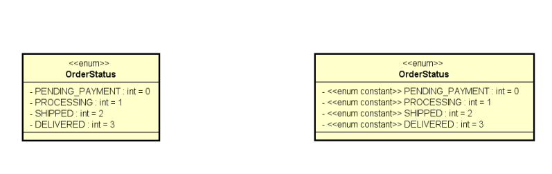<br><sub>Fig 39 - Enum UML representation - (<a href='https://www.udemy.com/course/java-curso-completo/'>Work by  Nelio Alves</a>) </sub></div>

<br>


## <a name="chapter10"></a>Chapter 10: Reference Type vs. Value Types, Garbage Collector, Boxing, unboxing and wrapper classes

#### <a name="chapter8part1"></a>Chapter 10 - Part 1: Reference Type vs. Value Types

Java provides two types of data types **primitive** and **reference** data type. The **primitive data types (value type)** are predefined in Java that serves as a fundamental building block while the **reference** data type refers to where data is stored.

<br>

<div align="center"><br><sub>Fig 13 -Java Data Types - (<a href='https://getkt.com/blog/reintroduction-to-java-data-types/'>Work by neotam</a>) </sub></div>

<br>

**Reference types**

In Java, **non-primitive** data types are known as **reference types**. In other words, a variable of class type is called **reference data type**. It contains the address (or reference) of dynamically created objects. For example, if **Demo** is a class and we have created its object **d**, then the variable d is known as a reference type.

It refers to objects. It is not pre-defined. It is created by the programmer if required. The reference types hold the references of objects. All **reference types** are a subclass of type **java.lang.Object**. It provides access to the objects stored in the memory.

Example: In the example above the p2 variable refence the memory address where p1 was created.

```java

Product p1, p2;
p1 = new Product("TV", 900.00, 0);
p2 = p1;

```

<br>

<div align="center">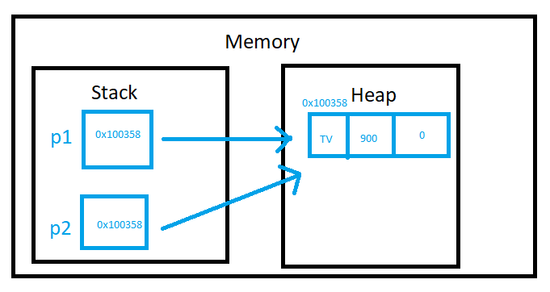<br><sub>Fig 34 -Referency Types - (<a href='https://www.udemy.com/course/java-curso-completo/'>Work by Nelio Alves</a>) </sub></div>

<br>

The default values when we use ```new``` in Class and Arrays is:

- Numbers: 0
- boolean: false
- char: 0 code
- object: null

Reference type alow "null" value. This means they not reference any body.

**Primitive types**

In Java, primitive types is value types.

Example: y receive a copy of x

```java

double x, y;
x = 10;
y = x;

```

The primitive types needs a value to initiate:

```java

int p;
System.out.println(p); // error: variable not initiated

p = 10;
System.out.println(p);

```

<br>

<div align="center">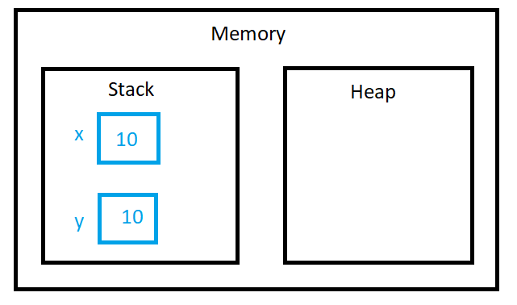<br><sub>Fig 35 -Primitive Types - (<a href='https://www.udemy.com/course/java-curso-completo/'>Work by Nelio Alves</a>) </sub></div>

<br>

<br>

<div align="center"><br><sub>Fig 14 -Java Data Primitive Types - (<a href='https://getkt.com/blog/reintroduction-to-java-data-types/'>Work by neotam</a>) </sub></div>

<br>

| Reference Type                                                                 | Primitive Type                                                         |
| :-----------------------------------------------------------------------------:| :---------------------------------------------------------------------:|
| It is not pre-defined except the String.                                       | It is pre-defined in Java.                                             |
| All reference type begins with Uppercase letter.                               | All primitive type begins with a lowercase letter.                     | 
| Non-primitive types have all the same size.                                    | The size of a primitive type depends on the data type.                 |
| It is used to invoke or call methods.                                          | We cannot invoke the method with a primitive type.                     |
| It can be null.                                                                | It cannot be null. It always has value.                                |
| Examples of reference data types are class, Arrays, String, Interface, etc.    | Examples of primitive data types are int, float, double, Boolean, long.|
| JVM allocates 8 bytes for each reference variable, by default.                 | Its size depends on the data type.                                     |
| **Example**: Demo d1;                                                          | **Example**: int num=78;                                               |
| Advantage: enjoys all OO features                                              | Advantage: it is simpler and more performant                           |
| Objects must be instantiated using new, or point to an existing object.        | Does not instantiate. Once declared, they are ready for use.           |
| Accepts null value                                                             | Does not accept null value                                             |
| Y = X; "Y starts pointing to where X points Y = X;                             | Y = X; "Y receives a copy of X"                                        |
| Objects instantiated on the heap                                               | "Objects" instantiated on the stack                                    |
| Unused objects are deallocated in a close moment by garbage collector          | "Objects" are deallocated immediately when your execution scope is terminated   |

#### <a name="chapter8part2"></a>Chapter 10 - Part 2: Garbage Collector

In Java, the ```new``` keyword is used to create an **instance** of the class. In other words, it instantiates a class by allocating **memory** for a new object and returning a reference to that memory. Objects occupy memory in the **Java heap space**. We can also use the ```new``` keyword to create the array object.

```java

ClassName objectName = new ClassName();  

```

If there are no references to an object, the memory used by that object can be reclaimed during the garbage collection process.

**Garbage Collector

It is a process that automates the memory management of a program running

Garbage collector monitors dynamically allocated objects by the program (on the heap), deallocating those that are no longer being used.

In java, garbage means unreferenced objects.

Garbage Collection is process of reclaiming the runtime unused memory automatically. In other words, it is a way to destroy the unused objects.

To do so, we were using free() function in C language and delete() in C++. But, in java it is performed automatically. So, java provides better memory management.

**Advantage of Garbage Collection**

- It makes java memory efficient because garbage collector removes the unreferenced objects from heap memory.

- It is automatically done by the garbage collector(a part of JVM) so we don't need to make extra efforts.

**How can an object be unreferenced?**

- By nulling the reference

```java

    Employee e=new Employee();  
    e=null;  

```

- By assigning a reference to another

```java

    Employee e1=new Employee();  
    Employee e2=new Employee();  
    e1=e2;//now the first object referred by e1 is available for garbage collection  

```

- By anonymous object etc.

```java

    new Employee();  

```

**finalize() method**

The finalize() method is invoked each time before the object is garbage collected. This method can be used to perform cleanup processing. This method is defined in Object class as:

```java

    protected void finalize(){}  

```

OBS: The Garbage collector of JVM collects only those objects that are created by new keyword. So if you have created any object without new, you can use finalize method to perform cleanup processing (destroying remaining objects).

**gc() method**

The gc() method is used to invoke the garbage collector to perform cleanup processing. The gc() is found in System and Runtime classes. 

```java

    public static void gc(){}  

```

OBS: Garbage collection is performed by a daemon thread called Garbage Collector(GC). This thread calls the finalize() method before object is garbage collected.

```java

    public class TestGarbage1{  
     public void finalize(){System.out.println("object is garbage collected");}  
     public static void main(String args[]){  
      TestGarbage1 s1=new TestGarbage1();  
      TestGarbage1 s2=new TestGarbage1();  
      s1=null;  
      s2=null;  
      System.gc();  
     }  
    }  
    
    //object is garbage collected
    //object is garbage collected

```

#### <a name="chapter8part3"></a>Chapter 10 - Part 3:  Boxing, unboxing and wrapper classes

**Boxing**

It is the process of converting a value type object to an object compatible reference type

```java

int x = 20;

Object obj = x;

```

**Unboxing**

It is the process of converting a reference-type object to a object type compatible value

```java

int x = 20;

Object obj = x;

int y = (int) obj;

```

**Comparing Reference Type**

Reference types are comparable in Java. Equality operators and the equals method can be used to assist with comparisons.

- Using the Equality Operators ```(==)```

The ```!=``` and ```==``` equality operators are used to compare the memory locations of two objects. If the memory addresses of the objects being compared are the same, the objects are considered equal. These equality operators are not used to compare the contents of two objects.

```java

String guest1 = new String("name");
String guest2 = guest1;
if (guest1 == guest2)
  System.out.println("They are equal");

```

In the following example, the memory addresses are not equal, so the statement "They are not equal" is output:

```java

String guest1 = new String("name");
String guest2 = new String("name");
if (guest1 != guest2)
  System.out.println("They are not equal");


```

- Using the ```equals()``` Method

To compare the contents of two class objects, the ```equals()``` method from class ```Object``` can be used or overridden. When the ```equals()``` method is overridden, the ```hashCode()``` method should also be overridden. This is done for compatibility with hash-based collections such as ```HashMap()``` and ```HashSet()```.

By default, the ```equals()``` method uses only the ```==``` operator for comparisons. This method has to be overridden to really be useful.

For example, if you want to compare values contained in two instances of the same class, you should use a programmer-defined equals() method.

**Comparing Strings**

There are two ways to check whether strings are equal in Java, but the definition of “equal” for each of them is different:

- The ```equals()``` method compares two strings, character by character, to determine equality. This is not the default implementation of the ```equals()``` method provided by the Object class. This is the overridden implementation provided by String class.

- The ```==``` operator checks to see whether two object references refer to the same instance of an object.

Here is a program that shows how strings are evaluated using the ```equals()``` method and the ```==``` operator

```java

class MyComparisons {

  // Add string to pool
  String first = "chairs";
  // Use string from pool
  String second = "chairs";
  // Create a new string
  String third = new String ("chairs");

 void myMethod() {

  /*
   * Contrary to popular belief, this evaluates
   * to true. Try it!
   */
  if (first == second) {
    System.out.println("first == second");
  }

  // This evaluates to true
  if (first.equals(second)) {
    System.out.println("first equals second");
  }
  // This evaluates to false
  if (first == third) {
    System.out.println("first == third");
  }
  // This evaluates to true
  if (first.equals(third)) {
    System.out.println("first equals third");
  }
 } // End myMethod()
} //end class

```


**Wrapper Classes**

These are classes that are equivalent to primitive types.

Boxing and unboxing is done automaticaly

Common usage: Entity fields in information systems (IMPORTANT!)
Because reference types (classes) accept null value and take advantage of Object Oriented resources

<br>

<div align="center">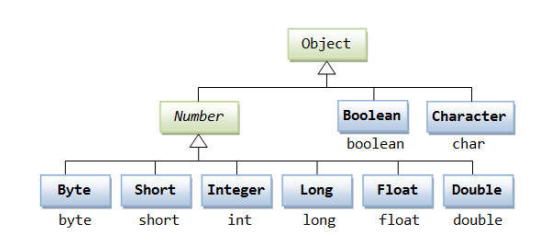<br><sub>Fig 37 - Wrapper Classes - (<a href='https://www.javatpoint.com/collections-in-java'>Work by  Java T Point</a>) </sub></div>

<br>

#### <a name="chapter8part4"></a>Chapter 10 - Part 4:  hashCode and equals

**hashCode and equals**

- They are operations of the Object class used to compare if an object is the same as another
- equals: slow, 100% response
- hashCode: fast, but positive response is not 100%
- Common types (String, Date, Integer, Double, etc.) already have implementation for these operations. custom classes need to overlay them.

**Equals**

- Method that compares if the object is equal to another, returning true or false.

```java

String a = "Maria";
String b = "Alex";

System.out.println(a.equals(b)); //false

```

```java

String a = "Maria";
String b = "Naria";

System.out.println(a.equals(b)); //true

```

**HashCode**

- Method that returns an integer representing a generated code from object information

```java

String a = "Maria";
String b = "Alex";

System.out.println(a.hashCode()); //74113750
System.out.println(b.hashCode()); //2043454

```

```java

String a = "Maria";
String b = "Maria";

System.out.println(a.hashCode()); //74113750
System.out.println(b.hashCode()); //74113750

```

If the hashCode of two objects is different, then the two objects are many different

If the code of two objects is the same, most likely the objects they are the same

## <a name="chapter11"></a>Chapter 11: Advanced Object-Oriented Programming

#### <a name="chapter11part1"></a>Chapter 11 - Part 1: Understanding and Implementing Abstract Classes

Abstract classes are a cornerstone of object-oriented programming in Java, providing a powerful mechanism for defining common interfaces and behaviors while enforcing specific implementation requirements on subclasses. They enable you to create flexible and extensible class hierarchies, promoting code reuse and maintainability. Understanding abstract classes is crucial for designing robust and well-structured applications.

#### <a name="chapter11part1.1"></a>Chapter 11 - Part 1.1: Understanding Abstract Classes

An abstract class is a class that cannot be instantiated directly. It serves as a blueprint for other classes, defining a common interface and potentially providing partial implementations. Abstract classes are declared using the abstract keyword.

**Key Characteristics of Abstract Classes**

- **Cannot be instantiated**: You cannot create an object directly from an abstract class using the new keyword.
- **May contain abstract methods**: An abstract method is a method declared without an implementation. It's essentially a placeholder that must be implemented by any concrete (non-abstract) subclass.
- **May contain concrete methods**: Abstract classes can also contain methods with full implementations, which subclasses can inherit and use directly.
- **Must be extended**: To be used, an abstract class must be extended (subclassed) by another class.
- **Abstract methods must be implemented**: Any concrete subclass must provide implementations for all abstract methods inherited from the abstract class. If a subclass doesn't implement all abstract methods, it must also be declared as abstract.

**Abstract Methods**

Abstract methods are declared using the abstract keyword and do not have a body (implementation). They end with a semicolon.

```java
public abstract class Shape {
    public abstract double getArea(); // Abstract method
}
```

In this example, getArea() is an abstract method. Any concrete class that extends Shape must provide an implementation for getArea().

**Concrete Methods**

Abstract classes can also contain concrete methods (methods with implementations). These methods are inherited by subclasses and can be used as is or overridden.

```java
public abstract class Shape {
    public abstract double getArea();

    public String getDescription() {
        return "This is a shape.";
    }
}
```

In this example, getDescription() is a concrete method. Subclasses of Shape inherit this method and can use it directly or override it to provide a more specific description.

**Why Use Abstract Classes?**

- **Define a common interface**: Abstract classes allow you to define a common interface for a group of related classes. This ensures that all subclasses have certain methods, promoting consistency and predictability.
- **Provide partial implementation**: Abstract classes can provide a partial implementation of the interface, reducing code duplication and simplifying the development of subclasses.
- **Enforce implementation requirements**: By declaring abstract methods, abstract classes force subclasses to provide specific implementations, ensuring that certain functionality is always present.
- **Achieve abstraction**: Abstract classes hide the implementation details of the subclasses from the client code. The client code only interacts with the abstract class, which provides a high-level view of the functionality.

#### <a name="chapter11part1.2"></a>Chapter 11 - Part 1.2: Implementing Abstract Classes

Let's illustrate the implementation of abstract classes with a practical example. Consider a scenario where you're designing a system for handling different types of media files.

**Example: Media File Processing**

```java
// Abstract class representing a generic media file
public abstract class MediaFile {
    private String filename;
    private String fileType;

    public MediaFile(String filename, String fileType) {
        this.filename = filename;
        this.fileType = fileType;
    }

    public String getFilename() {
        return filename;
    }

    public String getFileType() {
        return fileType;
    }

    // Abstract method to process the media file
    public abstract void processFile();

    // Concrete method to display file information
    public void displayInfo() {
        System.out.println("Filename: " + filename);
        System.out.println("File Type: " + fileType);
    }
}

// Concrete class representing an image file
public class ImageFile extends MediaFile {
    private int width;
    private int height;

    public ImageFile(String filename, int width, int height) {
        super(filename, "image");
        this.width = width;
        this.height = height;
    }

    @Override
    public void processFile() {
        System.out.println("Processing image file: " + getFilename());
        System.out.println("Resizing image to " + width + "x" + height);
        // Image processing logic here
    }

    @Override
    public void displayInfo() {
        super.displayInfo();
        System.out.println("Width: " + width);
        System.out.println("Height: " + height);
    }
}

// Concrete class representing a video file
public class VideoFile extends MediaFile {
    private int duration;
    private int frameRate;

    public VideoFile(String filename, int duration, int frameRate) {
        super(filename, "video");
        this.duration = duration;
        this.frameRate = frameRate;
    }

    @Override
    public void processFile() {
        System.out.println("Processing video file: " + getFilename());
        System.out.println("Duration: " + duration + " seconds");
        System.out.println("Frame Rate: " + frameRate + " fps");
        // Video processing logic here
    }
}

public class Main {
    public static void main(String[] args) {
        // Cannot instantiate MediaFile directly
        // MediaFile file = new MediaFile("generic.media", "media"); // This will cause a compilation error

        ImageFile image = new ImageFile("image.jpg", 800, 600);
        VideoFile video = new VideoFile("video.mp4", 120, 30);

        image.displayInfo();
        image.processFile();

        video.displayInfo();
        video.processFile();
    }
}
```

In this example:

- MediaFile is an abstract class that defines the common properties and behavior for all media files.
- processFile() is an abstract method that must be implemented by subclasses.
- displayInfo() is a concrete method that provides a default implementation for displaying file information.
- ImageFile and VideoFile are concrete classes that extend MediaFile and provide specific implementations for processFile().
- The Main class demonstrates how to create and use instances of the concrete classes.

**Extending Abstract Classes**

When extending an abstract class, you must provide implementations for all abstract methods. If you don't, the subclass must also be declared as abstract.

```java
public abstract class AbstractClass {
    public abstract void abstractMethod1();
    public abstract int abstractMethod2(int x);

    public void concreteMethod() {
        System.out.println("Concrete method in AbstractClass");
    }
}

// Concrete subclass implementing all abstract methods
public class ConcreteClass extends AbstractClass {
    @Override
    public void abstractMethod1() {
        System.out.println("Implementation of abstractMethod1");
    }

    @Override
    public int abstractMethod2(int x) {
        System.out.println("Implementation of abstractMethod2");
        return x * 2;
    }
}

// Abstract subclass - doesn't implement all abstract methods
public abstract class AnotherAbstractClass extends AbstractClass {
    @Override
    public void abstractMethod1() {
        System.out.println("Partial implementation of abstractMethod1");
    }

    // abstractMethod2 is not implemented, so this class must be abstract
}
```

**Abstract Classes and Constructors**

Abstract classes can have constructors. However, since you cannot instantiate an abstract class directly, the constructor is only called when a subclass is instantiated. The constructor is used to initialize the state of the abstract class.

```java
public abstract class BaseClass {
    private String name;

    public BaseClass(String name) {
        this.name = name;
        System.out.println("BaseClass constructor called with name: " + name);
    }

    public String getName() {
        return name;
    }

    public abstract void display();
}

public class DerivedClass extends BaseClass {
    public DerivedClass(String name) {
        super(name); // Calling the constructor of the BaseClass
        System.out.println("DerivedClass constructor called");
    }

    @Override
    public void display() {
        System.out.println("Name: " + getName());
    }

    public static void main(String[] args) {
        DerivedClass derived = new DerivedClass("Test");
        derived.display();
    }
}
```

In this example, when you create an instance of DerivedClass, the constructor of BaseClass is called first, initializing the name field.

#### <a name="chapter11part1.3"></a>Chapter 11 - Part 1.3: Abstract Classes vs. Interfaces

Abstract classes and interfaces are both used to define abstract types in Java, but they have some key differences.

|Feature|	Abstract Class|	Interface|
| :-----------: | :-----------: | :-----------: |
|Instantiation|	Cannot be instantiated	|Cannot be instantiated|
|Methods	|Can have abstract and concrete methods	|Can only have abstract methods (before Java 8)|
|Multiple Inheritance	|Not supported|	Supported|
|Fields	|Can have instance variables|	Can only have constants (final static)|
|Constructor	|Can have constructors	|Cannot have constructors|
|default methods	|Not applicable	|Supported (from Java 8)|
|static methods	|Supported	|Supported (from Java 8)|

**When to Use Abstract Classes**

- When you want to define a common interface and provide a partial implementation.
- When you want to enforce implementation requirements on subclasses.
- When you need to have instance variables in the base class.
- When you want to provide a common constructor for subclasses.

**When to Use Interfaces**

- When you want to define a contract for a class, specifying what methods it must implement.
- When you want to achieve multiple inheritance.
- When you only need to define constants and method signatures.
- When you want to decouple the implementation from the interface.

#### <a name="chapter11part2"></a>Chapter 11 - Part 2: Mastering Interfaces and Multiple Inheritance

Interfaces are a cornerstone of object-oriented programming in Java, providing a powerful mechanism for abstraction and achieving a form of multiple inheritance. While Java doesn't support multiple inheritance of implementation, interfaces allow a class to implement multiple interfaces, inheriting multiple types. This capability is crucial for designing flexible, extensible, and maintainable software systems. Understanding interfaces and their proper usage is essential for any intermediate Java developer.

#### <a name="chapter11part2.1"></a>Chapter 11 - Part 2.1: Understanding Interfaces

An interface in Java is a blueprint of a class. It has static constants and abstract methods. The interface in Java is a mechanism to achieve abstraction. There can be only abstract methods in the Java interface, not method body. It is used to achieve abstraction and multiple inheritance in Java.

**Defining Interfaces**

An interface is declared using the ```interface``` keyword. All methods in an interface are implicitly ```public``` and ```abstract``` (before Java 8). Fields declared in an interface are implicitly ```public```, ```static```, and ```final```.

```java
interface MyInterface {
    // Implicitly public, static, and final
    int MY_CONSTANT = 10;

    // Implicitly public and abstract
    void myMethod();

    String anotherMethod(int value);
}
```

**Implementing Interfaces**

A class implements an interface using the implements keyword. A class that implements an interface must provide concrete implementations for all the methods declared in the interface, unless the class is abstract.

```java
class MyClass implements MyInterface {
    @Override
    public void myMethod() {
        System.out.println("Implementation of myMethod");
    }

    @Override
    public String anotherMethod(int value) {
        return "Implementation of anotherMethod with value: " + value;
    }
}
```

**Multiple Inheritance with Interfaces**

Java does not allow a class to inherit from multiple classes (multiple inheritance of implementation). However, a class can implement multiple interfaces, achieving a form of multiple inheritance of type. This means a class can inherit multiple type definitions.

```java
interface InterfaceA {
    void methodA();
}

interface InterfaceB {
    void methodB();
}

class MyClass implements InterfaceA, InterfaceB {
    @Override
    public void methodA() {
        System.out.println("Implementation of methodA");
    }

    @Override
    public void methodB() {
        System.out.println("Implementation of methodB");
    }
}
```

In this example, MyClass implements both InterfaceA and InterfaceB, effectively inheriting the method signatures from both.

#### <a name="chapter11part2.2"></a>Chapter 11 - Part 2.2: Default Methods in Interfaces (Java 8+)

Java 8 introduced default methods in interfaces. Default methods provide a default implementation for a method in an interface. This allows you to add new methods to an interface without breaking existing classes that implement the interface.

```java
interface MyInterface {
    void myMethod();

    default void defaultMethod() {
        System.out.println("Default implementation of defaultMethod");
    }
}

class MyClass implements MyInterface {
    @Override
    public void myMethod() {
        System.out.println("Implementation of myMethod");
    }
    // Optionally override defaultMethod
}

class AnotherClass implements MyInterface {
    @Override
    public void myMethod() {
        System.out.println("Implementation of myMethod in AnotherClass");
    }

    @Override
    public void defaultMethod() {
        System.out.println("Overridden implementation of defaultMethod in AnotherClass");
    }
}
```

In this example, MyClass inherits the default implementation of defaultMethod, while AnotherClass overrides it with its own implementation.

#### <a name="chapter11part2.3"></a>Chapter 11 - Part 2.3: Static Methods in Interfaces (Java 8+)

Java 8 also introduced static methods in interfaces. Static methods in interfaces are similar to static methods in classes. They are associated with the interface itself and can be called using the interface name.

```java
interface MyInterface {
    void myMethod();

    static void staticMethod() {
        System.out.println("Static method in MyInterface");
    }
}

public class InterfaceStaticMethodExample {
    public static void main(String[] args) {
        MyInterface.staticMethod(); // Calling the static method
    }
}
```

#### <a name="chapter11part2.4"></a>Chapter 11 - Part 2.4: Functional Interfaces (Java 8+)

A functional interface is an interface that contains only one abstract method. They are also known as Single Abstract Method (SAM) interfaces. Functional interfaces can have any number of default or static methods. Functional interfaces are used extensively with lambda expressions and method references.

```java
@FunctionalInterface
interface MyFunctionalInterface {
    int myMethod(int a, int b);
}

public class FunctionalInterfaceExample {
    public static void main(String[] args) {
        // Using lambda expression to implement the functional interface
        MyFunctionalInterface adder = (a, b) -> a + b;
        System.out.println("Result: " + adder.myMethod(5, 3)); // Output: Result: 8
    }
}
```

The @FunctionalInterface annotation is optional but recommended. It instructs the compiler to enforce that the interface has only one abstract method.

#### <a name="chapter11part2.5"></a>Chapter 11 - Part 2.5: Comparable Interfaces

The Comparable interface in Java is used to define a natural ordering for objects of a class. By implementing this interface, you enable instances of your class to be compared with each other, which is essential for sorting and searching algorithms.

**Key Concepts**

- **Natural Ordering**: The Comparable interface defines the natural ordering of objects. This means it specifies how objects of a class are typically sorted.

- **compareTo() Method**: The interface includes a single method, compareTo(Object o), which you must implement. This method compares the current object with the specified object and returns:
  - A negative integer if the current object is less than the specified object.
  - Zero if the current object is equal to the specified object.
  - A positive integer if the current object is greater than the specified object.
 
- **Single Implementation**: A class can implement only one Comparable interface because it defines the natural order.

**Implementing the Comparable Interface**

**Implementing the Comparable Interface**

- **Declare the Implementation**: Modify your class declaration to include implements Comparable<YourClass>.

- **Implement the compareTo() Method**: Provide an implementation for the compareTo() method that compares the current object with another object of the same class.

```java
public class Student implements Comparable<Student> {
    private String name;
    private int age;

    public Student(String name, int age) {
        this.name = name;
        this.age = age;
    }

    public String getName() {
        return name;
    }

    public int getAge() {
        return age;
    }

    @Override
    public int compareTo(Student other) {
        // Compare based on age
        return Integer.compare(this.age, other.age);
    }

    @Override
    public String toString() {
        return "Student{" +
               "name='" + name + '\'' +
               ", age=" + age +
               '}';
    }

    public static void main(String[] args) {
        Student student1 = new Student("Alice", 20);
        Student student2 = new Student("Bob", 22);
        Student student3 = new Student("Charlie", 20);

        System.out.println("Comparing Alice and Bob: " + student1.compareTo(student2)); // Output: Negative
        System.out.println("Comparing Bob and Alice: " + student2.compareTo(student1)); // Output: Positive
        System.out.println("Comparing Alice and Charlie: " + student1.compareTo(student3)); // Output: Zero
    }
}
```

In this example:

- The Student class implements Comparable<Student>.
- The compareTo() method compares Student objects based on their age.

**Using Comparable for Sorting**

Once a class implements Comparable, you can use it to sort collections of objects using methods like Collections.sort() or Arrays.sort().

```java
import java.util.ArrayList;
import java.util.Collections;
import java.util.List;

public class ComparableExample {

    public static void main(String[] args) {
        List<Student> students = new ArrayList<>();
        students.add(new Student("Alice", 20));
        students.add(new Student("Bob", 22));
        students.add(new Student("Charlie", 20));
        students.add(new Student("David", 18));

        System.out.println("Before sorting: " + students);

        Collections.sort(students);

        System.out.println("After sorting: " + students);
    }
}
```

**Best Practices and Considerations**

- **Consistency with equals()**: Ensure that your compareTo() method is consistent with your equals() method. If a.equals(b) is true, then a.compareTo(b) should return 0.
- **Immutability**: If possible, make the fields used in the compareTo() method immutable to avoid unexpected behavior when the object's state changes after being used in a sorted collection.
- **Null Handling**: Be careful when handling null values in the compareTo() method. A common approach is to throw a NullPointerException or treat null as either the smallest or largest possible value.

**Use Cases**

- **Sorting**: Sorting collections of custom objects based on a specific attribute.
- **Searching**: Implementing binary search on collections of custom objects.
- **Data Structures**: Using custom objects in sorted data structures like TreeSet and TreeMap.

#### <a name="chapter11part2.6"></a>Chapter 11 - Part 2.6: Resolving Conflicts in Multiple Inheritance

When a class implements multiple interfaces that have methods with the same signature, conflicts can arise. Java provides mechanisms to resolve these conflicts.

**The Diamond Problem**

The "diamond problem" is a common issue in multiple inheritance scenarios. It occurs when a class inherits from two interfaces that both inherit from a common interface, and both interfaces provide a default implementation for a method defined in the common interface.

```java
interface Animal {
    default String makeSound() {
        return "Generic animal sound";
    }
}

interface Mammal extends Animal {
    @Override
    default String makeSound() {
        return "Mammal sound";
    }
}

interface Bird extends Animal {
    @Override
    default String makeSound() {
        return "Bird sound";
    }
}

class Bat implements Mammal, Bird {
    // Need to override makeSound() to resolve the conflict
    @Override
    public String makeSound() {
        return Mammal.super.makeSound(); // Or Bird.super.makeSound(); or a custom implementation
    }
}
```

In this example, Bat inherits two different implementations of makeSound() from Mammal and Bird. To resolve this conflict, Bat must override the makeSound() method and explicitly choose which implementation to use or provide its own.

**Resolving Conflicts with super**

When a class implements multiple interfaces with conflicting default methods, you can use the super keyword to specify which interface's default implementation to use.

```java
interface InterfaceA {
    default void myMethod() {
        System.out.println("InterfaceA's myMethod");
    }
}

interface InterfaceB {
    default void myMethod() {
        System.out.println("InterfaceB's myMethod");
    }
}

class MyClass implements InterfaceA, InterfaceB {
    @Override
    public void myMethod() {
        InterfaceA.super.myMethod(); // Call InterfaceA's implementation
        InterfaceB.super.myMethod(); // Call InterfaceB's implementation
        System.out.println("MyClass's myMethod"); // Custom implementation
    }
}

public class ConflictResolutionExample {
    public static void main(String[] args) {
        MyClass obj = new MyClass();
        obj.myMethod();
    }
}
```

In this example, MyClass implements both InterfaceA and InterfaceB, which both have a default method myMethod(). The MyClass overrides myMethod() and uses InterfaceA.super.myMethod() and InterfaceB.super.myMethod() to call the default implementations from both interfaces.

#### <a name="chapter11part2.7"></a>Chapter 11 - Part 2.7: Practical Examples and Demonstrations

**Example 1: Implementing Multiple Interfaces**

Consider a scenario where you have different types of devices, such as printers and scanners. You can define interfaces for each functionality and then have a class implement multiple interfaces to provide combined functionality.

```java
interface Printable {
    void print(String content);
}

interface Scannable {
    String scan();
}

class MultiFunctionDevice implements Printable, Scannable {
    @Override
    public void print(String content) {
        System.out.println("Printing: " + content);
    }

    @Override
    public String scan() {
        return "Scanned content";
    }
}
```

**Example 2: Using Default Methods for Extensibility**

Suppose you have an existing Shape interface and you want to add a new method to calculate the area. You can use a default method to provide a default implementation without forcing all implementing classes to change.

```java
interface Shape {
    double getArea();
    double getPerimeter();

    default String getDescription() {
        return "This is a shape.";
    }
}

class Circle implements Shape {
    private double radius;

    public Circle(double radius) {
        this.radius = radius;
    }

    @Override
    public double getArea() {
        return Math.PI * radius * radius;
    }

    @Override
    public double getPerimeter() {
        return 2 * Math.PI * radius;
    }
}

class Rectangle implements Shape {
    private double length;
    private double width;

    public Rectangle(double length, double width) {
        this.length = length;
        this.width = width;
    }

    @Override
    public double getArea() {
        return length * width;
    }

     @Override
    public double getPerimeter() {
        return 2 * (length + width);
    }
}
```

**Example 3: Functional Interfaces and Lambda Expressions**

Functional interfaces are commonly used with lambda expressions to create concise and readable code.

```java
interface Calculator {
    int operate(int a, int b);
}

public class LambdaExample {
    public static void main(String[] args) {
        Calculator addition = (a, b) -> a + b;
        Calculator subtraction = (a, b) -> a - b;

        System.out.println("Addition: " + addition.operate(5, 3)); // Output: Addition: 8
        System.out.println("Subtraction: " + subtraction.operate(5, 3)); // Output: Subtraction: 2
    }
}
```

#### <a name="chapter11part3"></a>Chapter 11 - Part 3: Deep Dive into Polymorphism and Dynamic Binding

Polymorphism and dynamic binding are fundamental concepts in object-oriented programming, enabling flexibility and extensibility in software design. Polymorphism, meaning "many forms," allows objects of different classes to be treated as objects of a common type. Dynamic binding, also known as late binding, determines the specific method to be executed at runtime, based on the actual object type. Understanding these concepts is crucial for writing maintainable, scalable, and robust Java applications. This lesson will delve into the intricacies of polymorphism and dynamic binding, exploring their mechanisms and practical applications.

#### <a name="chapter11part3.1"></a>Chapter 11 - Part 3.1: Understanding Polymorphism

Polymorphism is the ability of an object to take on many forms. In Java, this is primarily achieved through inheritance and interfaces. There are two main types of polymorphism: compile-time polymorphism (also known as static polymorphism or method overloading) and runtime polymorphism (also known as dynamic polymorphism or method overriding).

**Compile-Time Polymorphism (Method Overloading)**

Compile-time polymorphism is achieved through method overloading. Method overloading allows a class to have multiple methods with the same name but different parameters (different number of parameters, different types of parameters, or different order of parameters). The compiler determines which method to call based on the arguments passed during the method call.

```java
class Calculator {
    // Method to add two integers
    public int add(int a, int b) {
        return a + b;
    }

    // Method to add three integers
    public int add(int a, int b, int c) {
        return a + b + c;
    }

    // Method to add two doubles
    public double add(double a, double b) {
        return a + b;
    }
}

public class Main {
    public static void main(String[] args) {
        Calculator calculator = new Calculator();
        System.out.println(calculator.add(2, 3));       // Output: 5
        System.out.println(calculator.add(2, 3, 4));    // Output: 9
        System.out.println(calculator.add(2.5, 3.5));   // Output: 6.0
    }
}
```

In this example, the Calculator class has three add methods with different parameter lists. The compiler determines which add method to call based on the arguments passed in the main method. This is resolved at compile time, hence the name compile-time polymorphism.

**Runtime Polymorphism (Method Overriding)**

Runtime polymorphism is achieved through method overriding. Method overriding occurs when a subclass provides a specific implementation for a method that is already defined in its superclass. The method in the subclass must have the same name, return type, and parameter list as the method in the superclass. The specific method to be executed is determined at runtime based on the actual object type.

```java
class Animal {
    public void makeSound() {
        System.out.println("Generic animal sound");
    }
}

class Dog extends Animal {
    @Override
    public void makeSound() {
        System.out.println("Woof!");
    }
}

class Cat extends Animal {
    @Override
    public void makeSound() {
        System.out.println("Meow!");
    }
}

public class Main {
    public static void main(String[] args) {
        Animal animal1 = new Animal();
        Animal animal2 = new Dog();
        Animal animal3 = new Cat();

        animal1.makeSound(); // Output: Generic animal sound
        animal2.makeSound(); // Output: Woof!
        animal3.makeSound(); // Output: Meow!
    }
}
```

In this example, the Dog and Cat classes override the makeSound method of the Animal class. When makeSound is called on animal2 (which is a Dog object) and animal3 (which is a Cat object), the overridden methods in the respective subclasses are executed. This is determined at runtime, hence the name runtime polymorphism. The @Override annotation is optional but highly recommended as it instructs the compiler to verify that the method is indeed overriding a method from the superclass, preventing potential errors.

#### <a name="chapter11part3.2"></a>Chapter 11 - Part 3.2: Dynamic Binding (Late Binding)

Dynamic binding, also known as late binding, is the process of determining which method implementation to execute at runtime. This is a key aspect of runtime polymorphism. In Java, dynamic binding is primarily used when calling overridden methods.

When a method is called on an object, the Java Virtual Machine (JVM) determines the actual type of the object at runtime and then searches for the appropriate method to execute. If the method is overridden in a subclass, the JVM will execute the overridden method in the subclass. If the method is not overridden, the JVM will execute the method in the superclass.

Consider the previous Animal, Dog, and Cat example. When animal2.makeSound() is called, the JVM determines that animal2 is actually a Dog object at runtime. It then searches for the makeSound method in the Dog class and executes it. This dynamic determination of the method to be executed is dynamic binding.

**How Dynamic Binding Works**

- **Object Creation**: An object is created, and its type is determined at compile time based on the class used to instantiate it.
- **Method Call**: A method is called on the object through a reference variable.
- **Runtime Type Determination**: At runtime, the JVM determines the actual type of the object that the reference variable is pointing to.
- **Method Lookup**: The JVM searches for the method to be executed, starting from the object's actual class and moving up the inheritance hierarchy until the method is found.
- **Method Execution**: The JVM executes the method that was found.

**Importance of Dynamic Binding**

Dynamic binding is crucial for achieving flexibility and extensibility in object-oriented programming. It allows you to write code that can work with objects of different types without knowing their specific types at compile time. This makes it easier to add new classes and functionality to your application without modifying existing code.

#### <a name="chapter11part3.3"></a>Chapter 11 - Part 3.3: Dependency Injection and How to Implement

Dependency Injection is a design pattern that promotes loose coupling between classes. Instead of a class creating its dependencies, the dependencies are "injected" into the class from an external source. This makes the class more reusable, testable, and maintainable.

**Key Concepts**

- **Dependency**: A dependency is an object that another object (the client) uses.
- **Injection**: The act of providing the dependencies to the client.
- **Injector**: An external entity (framework or container) responsible for creating and injecting the dependencies.

**How it Works**

- **Identify Dependencies**: Determine what objects a class needs to function.
- **Declare Dependencies**: Instead of creating the dependencies within the class, declare them as constructor parameters, setter methods, or interface injections.
- **Injection**: An external injector (like a DI framework or a manual factory) creates the dependency objects and provides them to the class.

**Types of Dependency Injection**

- **Constructor Injection**: Dependencies are provided through the class constructor. This is generally the preferred method as it ensures that the class always has its required dependencies.
- **Setter Injection**: Dependencies are provided through setter methods. This allows for optional dependencies.
- **Interface Injection**: The class implements an interface that provides a method for setting the dependency. This is less common.

**Benefits of Dependency Injection**

- **Loose Coupling**: Classes are less dependent on concrete implementations, making the system more flexible.
- **Increased Reusability**: Classes can be easily reused in different contexts with different dependencies.
- **Improved Testability**: Dependencies can be easily mocked or stubbed for unit testing.
- **Enhanced Maintainability**: Changes to dependencies have less impact on the dependent classes.

**Example (Constructor Injection):**

```java
// Interface representing the dependency
interface MessageService {
    void sendMessage(String message);
}

// Concrete implementation of the dependency
class EmailService implements MessageService {
    @Override
    public void sendMessage(String message) {
        System.out.println("Sending email: " + message);
    }
}

// Client class that depends on MessageService
class NotificationService {
    private final MessageService messageService;

    // Constructor injection
    public NotificationService(MessageService messageService) {
        this.messageService = messageService;
    }

    public void sendNotification(String message) {
        messageService.sendMessage(message);
    }
}

// Main class to demonstrate Dependency Injection
public class Main {
    public static void main(String[] args) {
        // Create the dependency
        MessageService emailService = new EmailService();

        // Inject the dependency into the client
        NotificationService notificationService = new NotificationService(emailService);

        // Use the client
        notificationService.sendNotification("Hello, world!");
    }
}
```

In this example, NotificationService doesn't create EmailService itself. Instead, it receives an instance of MessageService through its constructor. This allows you to easily switch to a different message service (e.g., SMSService) without modifying NotificationService.


**Setter Injection Example**

```java
// Interface representing the dependency
interface Logger {
    void log(String message);
}

// Concrete implementation of the dependency
class FileLogger implements Logger {
    @Override
    public void log(String message) {
        System.out.println("Logging to file: " + message);
    }
}

// Client class that depends on Logger
class Application {
    private Logger logger;

    // Setter injection
    public void setLogger(Logger logger) {
        this.logger = logger;
    }

    public void run() {
        if (logger != null) {
            logger.log("Application started");
        } else {
            System.out.println("Logger not set. Running without logging.");
        }
        // Application logic here
    }
}

// Main class to demonstrate Setter Injection
public class Main {
    public static void main(String[] args) {
        // Create the dependency
        Logger fileLogger = new FileLogger();

        // Create the client
        Application application = new Application();

        // Inject the dependency using the setter method
        application.setLogger(fileLogger);

        // Run the application
        application.run();
    }
}
```

In this example:

- The Application class depends on the Logger interface.
- The setLogger method is used to inject the Logger dependency.
- The Main class creates an instance of FileLogger and injects it into the Application instance using the setter method.
- Setter injection is useful when a dependency is optional. The application can still run even if the logger is not set.

**Interface Injection Example**

```java
// Interface representing the dependency injector
interface LoggerInjector {
    void setLogger(Logger logger);
}

// Interface representing the dependency
interface Logger {
    void log(String message);
}

// Concrete implementation of the dependency
class ConsoleLogger implements Logger {
    @Override
    public void log(String message) {
        System.out.println("Logging to console: " + message);
    }
}

// Client class that depends on Logger and implements LoggerInjector
class Service implements LoggerInjector {
    private Logger logger;

    @Override
    public void setLogger(Logger logger) {
        this.logger = logger;
    }

    public void doSomething() {
        if (logger != null) {
            logger.log("Service is doing something");
        } else {
            System.out.println("Logger not set. Cannot log.");
        }
    }
}

// Main class to demonstrate Interface Injection
public class Main {
    public static void main(String[] args) {
        // Create the dependency
        Logger consoleLogger = new ConsoleLogger();

        // Create the client
        Service service = new Service();

        // Inject the dependency by calling the setLogger method
        service.setLogger(consoleLogger);

        // Use the service
        service.doSomething();
    }
}
```

In this example:

- The LoggerInjector interface defines the setLogger method, which is used to inject the Logger dependency.
- The Service class implements the LoggerInjector interface and provides an implementation for the setLogger method.
- The Main class creates an instance of ConsoleLogger and injects it into the Service instance by calling the setLogger method.
- Interface injection is less common than constructor or setter injection. It requires the client class to implement a specific interface for dependency injection.

**DI Frameworks**

Popular Java DI frameworks include:

- Spring: A comprehensive framework with a powerful DI container.
- Guice: A lightweight and fast DI framework from Google.
- CDI (Contexts and Dependency Injection): A standard DI framework for Java EE applications.

#### <a name="chapter11part3.4"></a>Chapter 11 - Part 3.4: Practical Examples and Demonstrations

**Example 1: Shape Hierarchy**

Consider a scenario where you have a hierarchy of shapes, including Circle, Rectangle, and Triangle. Each shape has a method called draw that draws the shape on the screen.

```java
class Shape {
    public void draw() {
        System.out.println("Drawing a generic shape");
    }
}

class Circle extends Shape {
    @Override
    public void draw() {
        System.out.println("Drawing a circle");
    }
}

class Rectangle extends Shape {
    @Override
    public void draw() {
        System.out.println("Drawing a rectangle");
    }
}

class Triangle extends Shape {
    @Override
    public void draw() {
        System.out.println("Drawing a triangle");
    }
}

public class Main {
    public static void main(String[] args) {
        Shape[] shapes = new Shape[3];
        shapes[0] = new Circle();
        shapes[1] = new Rectangle();
        shapes[2] = new Triangle();

        for (Shape shape : shapes) {
            shape.draw();
        }
    }
}
```

In this example, the draw method is overridden in each subclass to provide a specific implementation for drawing that shape. The main method creates an array of Shape objects, each pointing to a different type of shape. When the draw method is called on each element in the array, the JVM dynamically determines the actual type of the object and executes the appropriate draw method.

**Example 2: Payment Processing System**

Building upon the "Flexible Payment Processing System" case study introduced in previous lessons, let's see how polymorphism and dynamic binding can be applied. Assume we have a PaymentProcessor class that processes payments using different payment methods.

```java
class PaymentMethod {
    public void processPayment(double amount) {
        System.out.println("Processing payment of $" + amount + " using a generic payment method");
    }
}

class CreditCardPayment extends PaymentMethod {
    @Override
    public void processPayment(double amount) {
        System.out.println("Processing credit card payment of $" + amount);
    }
}

class PayPalPayment extends PaymentMethod {
    @Override
    public void processPayment(double amount) {
        System.out.println("Processing PayPal payment of $" + amount);
    }
}

class PaymentProcessor {
    public void process(PaymentMethod paymentMethod, double amount) {
        paymentMethod.processPayment(amount);
    }
}

public class Main {
    public static void main(String[] args) {
        PaymentProcessor paymentProcessor = new PaymentProcessor();
        PaymentMethod creditCard = new CreditCardPayment();
        PaymentMethod paypal = new PayPalPayment();

        paymentProcessor.process(creditCard, 100.0); // Output: Processing credit card payment of $100.0
        paymentProcessor.process(paypal, 50.0);    // Output: Processing PayPal payment of $50.0
    }
}
```

In this example, the PaymentProcessor class takes a PaymentMethod object as a parameter and calls its processPayment method. The specific implementation of processPayment that is executed depends on the actual type of the PaymentMethod object passed to the process method. This demonstrates how polymorphism and dynamic binding can be used to create a flexible and extensible payment processing system.

**Example 3: Employee Salary Calculation**

Consider a system for calculating employee salaries, where different types of employees (e.g., salaried, hourly) have different calculation methods.

```java
class Employee {
    public double calculateSalary() {
        return 0.0; // Default salary calculation
    }
}

class SalariedEmployee extends Employee {
    private double monthlySalary;

    public SalariedEmployee(double monthlySalary) {
        this.monthlySalary = monthlySalary;
    }

    @Override
    public double calculateSalary() {
        return monthlySalary;
    }
}

class HourlyEmployee extends Employee {
    private double hourlyRate;
    private double hoursWorked;

    public HourlyEmployee(double hourlyRate, double hoursWorked) {
        this.hourlyRate = hourlyRate;
        this.hoursWorked = hoursWorked;
    }

    @Override
    public double calculateSalary() {
        return hourlyRate * hoursWorked;
    }
}

public class Main {
    public static void main(String[] args) {
        Employee salariedEmployee = new SalariedEmployee(5000.0);
        Employee hourlyEmployee = new HourlyEmployee(20.0, 160.0);

        System.out.println("Salaried Employee Salary: $" + salariedEmployee.calculateSalary()); // Output: Salaried Employee Salary: $5000.0
        System.out.println("Hourly Employee Salary: $" + hourlyEmployee.calculateSalary());   // Output: Hourly Employee Salary: $3200.0
    }
}
```

Here, calculateSalary is overridden in SalariedEmployee and HourlyEmployee to provide specific salary calculations. Dynamic binding ensures the correct calculation is performed based on the actual employee type.

#### <a name="chapter11part4"></a>Chapter 11 - Part 4: Exploring Design Patterns: Singleton and Factory

Design patterns are reusable solutions to commonly occurring problems in software design. They represent best practices evolved over time and provide a template for solving recurring design challenges. This lesson explores two fundamental creational design patterns: Singleton and Factory. Creational patterns deal with object creation mechanisms, trying to create objects in a manner suitable to the situation. Understanding these patterns will enable you to write more maintainable, flexible, and robust code.

#### <a name="chapter11part4.1"></a>Chapter 11 - Part 4.1: Singleton Design Pattern

The Singleton pattern ensures that a class has only one instance and provides a global point of access to it. This is useful when exactly one object is needed to coordinate actions across the system.

**Core Principles**

- **Single Instance**: Only one instance of the class can exist.
- **Global Access**: A global point of access to that instance is provided.
- **Lazy Initialization (Optional)**: The instance can be created only when it's needed.

**Implementation**

The implementation involves:

- Making the constructor private to prevent direct instantiation from outside the class.
- Creating a static instance of the class within the class itself.
- Providing a static method that returns the instance of the class.

Here's a basic implementation in Java:

```java
public class Singleton {

    private static Singleton instance; // Static instance

    private Singleton() {
        // Private constructor to prevent external instantiation
    }

    public static Singleton getInstance() {
        if (instance == null) {
            instance = new Singleton(); // Lazy initialization
        }
        return instance;
    }

    public void doSomething() {
        System.out.println("Singleton is doing something!");
    }

    public static void main(String[] args) {
        Singleton singleton = Singleton.getInstance();
        singleton.doSomething();
    }
}
```

Explanation:

- private static Singleton instance;: This declares a static variable instance of type Singleton. This variable will hold the single instance of the Singleton class. It's declared private to prevent direct access from outside the class and static so that it belongs to the class itself, not to any specific instance.
- private Singleton(): This declares a private constructor. By making the constructor private, you prevent other classes from directly creating instances of the Singleton class using the new keyword. This ensures that the Singleton class controls the instantiation process.
- public static Singleton getInstance(): This is a static method that provides a global point of access to the Singleton instance. It first checks if the instance variable is null. If it is, it means that no instance of the Singleton class has been created yet. In this case, it creates a new instance of the Singleton class and assigns it to the instance variable. If the instance variable is not null, it means that an instance of the Singleton class already exists, so it simply returns the existing instance.
- public void doSomething(): This is a sample method that demonstrates how to use the Singleton instance. In this example, it simply prints a message to the console.
- Singleton singleton = Singleton.getInstance();: This line retrieves the Singleton instance using the getInstance() method and assigns it to the singleton variable.
- singleton.doSomething();: This line calls the doSomething() method on the Singleton instance.

**Thread Safety**

The above implementation is not thread-safe. In a multithreaded environment, multiple threads could simultaneously enter the if (instance == null) block and create multiple instances. To make it thread-safe, you can use synchronization:

```java
public class Singleton {

    private static Singleton instance;

    private Singleton() {
    }

    public static synchronized Singleton getInstance() {
        if (instance == null) {
            instance = new Singleton();
        }
        return instance;
    }

    public void doSomething() {
        System.out.println("Singleton is doing something!");
    }
}
```

Explanation:

- public static synchronized Singleton getInstance(): The synchronized keyword ensures that only one thread can execute this method at a time. This prevents multiple threads from creating multiple instances of the Singleton class simultaneously.

However, synchronizing the entire method can impact performance. A more efficient approach is to use double-checked locking:

```java
public class Singleton {

    private static volatile Singleton instance;

    private Singleton() {
    }

    public static Singleton getInstance() {
        if (instance == null) {
            synchronized (Singleton.class) {
                if (instance == null) {
                    instance = new Singleton();
                }
            }
        }
        return instance;
    }

    public void doSomething() {
        System.out.println("Singleton is doing something!");
    }
}
```

Explanation:

- private static volatile Singleton instance;: The volatile keyword ensures that changes to the instance variable are immediately visible to all threads. This is important because without volatile, a thread might see a partially constructed Singleton instance.
- The outer if (instance == null) check reduces the overhead of synchronization by only entering the synchronized block if the instance is null.
- The inner if (instance == null) check ensures that only one thread creates the instance.

**Eager Initialization**

Another approach is eager initialization, where the instance is created when the class is loaded:

```java
public class Singleton {

    private static final Singleton instance = new Singleton();

    private Singleton() {
    }

    public static Singleton getInstance() {
        return instance;
    }

    public void doSomething() {
        System.out.println("Singleton is doing something!");
    }
}
```

Explanation:

- private static final Singleton instance = new Singleton();: The instance is created when the class is loaded, so there's no need for synchronization.
- This approach guarantees thread safety but might not be suitable if the instance is resource-intensive and not always needed.

**Real-World Examples**

- **Logger**: A logging system often uses a Singleton to ensure that all log messages are written to the same file or console.
- **Configuration Manager**: A configuration manager can be implemented as a Singleton to provide a single point of access to application configuration settings.
- **Database Connection Pool**: A database connection pool can be implemented as a Singleton to manage a single pool of database connections.

#### <a name="chapter11part4.2"></a>Chapter 11 - Part 4.2: Factory Design Pattern

The Factory pattern provides an interface for creating objects but lets subclasses decide which class to instantiate. It promotes loose coupling by decoupling the object creation logic from the client code.

**Core Principles**

- **Abstraction**: Defines an interface for creating objects.
- **Delegation**: Subclasses decide which class to instantiate.
- **Loose Coupling**: Decouples object creation from client code.

**Types of Factory Patterns**

- **Simple Factory**: A single class that creates objects based on input parameters.
- **Factory Method**: Defines an interface for creating objects, but lets subclasses alter the type of objects that will be created.
- **Abstract Factory**: Provides an interface for creating families of related or dependent objects without specifying their concrete classes.

**Simple Factory**

The Simple Factory is not strictly a design pattern, but it's a common way to encapsulate object creation logic.

```java
interface Animal {
    void makeSound();
}

class Dog implements Animal {
    @Override
    public void makeSound() {
        System.out.println("Woof!");
    }
}

class Cat implements Animal {
    @Override
    public void makeSound() {
        System.out.println("Meow!");
    }
}

class AnimalFactory {
    public static Animal createAnimal(String type) {
        if ("dog".equalsIgnoreCase(type)) {
            return new Dog();
        } else if ("cat".equalsIgnoreCase(type)) {
            return new Cat();
        } else {
            throw new IllegalArgumentException("Unknown animal type: " + type);
        }
    }

    public static void main(String[] args) {
        Animal dog = AnimalFactory.createAnimal("dog");
        dog.makeSound(); // Output: Woof!

        Animal cat = AnimalFactory.createAnimal("cat");
        cat.makeSound(); // Output: Meow!
    }
}
```

Explanation:

- Animal interface: Defines the common interface for all animal types.
- Dog and Cat classes: Implement the Animal interface and provide their specific implementations of the makeSound() method.
- AnimalFactory class: Contains the createAnimal() method, which takes a string representing the animal type as input and returns an instance of the corresponding animal class.

**Factory Method**

The Factory Method pattern defines an interface for creating an object, but lets subclasses decide which class to instantiate.

```java
interface Animal {
    void makeSound();
}

class Dog implements Animal {
    @Override
    public void makeSound() {
        System.out.println("Woof!");
    }
}

class Cat implements Animal {
    @Override
    public void makeSound() {
        System.out.println("Meow!");
    }
}

abstract class AnimalFactory {
    public abstract Animal createAnimal();

    public static void main(String[] args) {
        AnimalFactory dogFactory = new DogFactory();
        Animal dog = dogFactory.createAnimal();
        dog.makeSound(); // Output: Woof!

        AnimalFactory catFactory = new CatFactory();
        Animal cat = catFactory.createAnimal();
        cat.makeSound(); // Output: Meow!
    }
}

class DogFactory extends AnimalFactory {
    @Override
    public Animal createAnimal() {
        return new Dog();
    }
}

class CatFactory extends AnimalFactory {
    @Override
    public Animal createAnimal() {
        return new Cat();
    }
}
```

Explanation:

- Animal interface: Defines the common interface for all animal types.
- Dog and Cat classes: Implement the Animal interface and provide their specific implementations of the makeSound() method.
- AnimalFactory abstract class: Defines the createAnimal() method, which is responsible for creating an instance of an Animal. The createAnimal() method is declared as abstract, which means that subclasses must provide their own implementation of this method.
- DogFactory and CatFactory classes: Extend the AnimalFactory class and provide their specific implementations of the createAnimal() method. The DogFactory class creates an instance of the Dog class, and the CatFactory class creates an instance of the Cat class.

**Abstract Factory**

The Abstract Factory pattern provides an interface for creating families of related or dependent objects without specifying their concrete classes.

```java
interface Button {
    void paint();
}

interface Checkbox {
    void paint();
}

class WindowsButton implements Button {
    @Override
    public void paint() {
        System.out.println("Rendering a Windows button");
    }
}

class MacOSButton implements Button {
    @Override
    public void paint() {
        System.out.println("Rendering a MacOS button");
    }
}

class WindowsCheckbox implements Checkbox {
    @Override
    public void paint() {
        System.out.println("Rendering a Windows checkbox");
    }
}

class MacOSCheckbox implements Checkbox {
    @Override
    public void paint() {
        System.out.println("Rendering a MacOS checkbox");
    }
}

interface GUIFactory {
    Button createButton();
    Checkbox createCheckbox();
}

class WindowsFactory implements GUIFactory {
    @Override
    public Button createButton() {
        return new WindowsButton();
    }

    @Override
    public Checkbox createCheckbox() {
        return new WindowsCheckbox();
    }
}

class MacOSFactory implements GUIFactory {
    @Override
    public Button createButton() {
        return new MacOSButton();
    }

    @Override
    public Checkbox createCheckbox() {
        return new MacOSCheckbox();
    }
}

public class Main {
    public static void main(String[] args) {
        GUIFactory factory = new WindowsFactory();
        Button button = factory.createButton();
        Checkbox checkbox = factory.createCheckbox();

        button.paint();
        checkbox.paint();
    }
}
```

Explanation:

- Button and Checkbox interfaces: Define the common interfaces for all button and checkbox types.
- WindowsButton, MacOSButton, WindowsCheckbox, and MacOSCheckbox classes: Implement the Button and Checkbox interfaces and provide their specific implementations of the paint() method.
- GUIFactory interface: Defines the createButton() and createCheckbox() methods, which are responsible for creating instances of Button and Checkbox objects.
- WindowsFactory and MacOSFactory classes: Implement the GUIFactory interface and provide their specific implementations of the createButton() and createCheckbox() methods. The WindowsFactory class creates instances of WindowsButton and WindowsCheckbox objects, and the MacOSFactory class creates instances of MacOSButton and MacOSCheckbox objects.

**Real-World Examples**

- **Document Processing**: A document processing application might use a Factory to create different types of documents (e.g., PDF, Word, HTML) based on user input.
- **UI Frameworks**: UI frameworks often use Factories to create different types of UI elements (e.g., buttons, text fields, labels) based on the platform or theme.
- **Database Access**: A database access library might use a Factory to create different types of database connections (e.g., MySQL, PostgreSQL, Oracle) based on the configuration settings.

#### <a name="chapter11part5"></a>Chapter 11 - Part 5: Implementing the Strategy Design Pattern

The Strategy design pattern is a behavioral design pattern that enables you to select an algorithm at runtime. It defines a family of algorithms, encapsulates each one, and makes them interchangeable. This allows the client to choose an algorithm from a family of algorithms without modifying its code. This pattern is particularly useful when you have multiple ways of performing a specific task and you want to be able to switch between them easily. It promotes flexibility, reusability, and maintainability in your code.

#### <a name="chapter11part5.1"></a>Chapter 11 - Part 5.1: Core Concepts of the Strategy Pattern

The Strategy pattern revolves around three key components:

- **The Context**: This is the class that contains a reference to a Strategy object. It doesn't implement the algorithm directly but delegates it to the chosen Strategy. The Context is responsible for using the Strategy to perform the desired operation.
- **The Strategy Interface**: This interface defines the contract that all concrete Strategy classes must implement. It typically contains a single method that performs the algorithm.
- **Concrete Strategies**: These classes implement the Strategy interface and provide the specific implementations of the algorithm. Each Concrete Strategy represents a different way of performing the task.

**Benefits of Using the Strategy Pattern**

- **Flexibility**: You can easily switch between different algorithms at runtime without modifying the Context class.
- **Open/Closed Principle**: You can add new algorithms without modifying the existing Context or Strategy classes. This adheres to the Open/Closed Principle, which states that software entities should be open for extension but closed for modification.
- **Code Reusability**: The Concrete Strategy classes can be reused in other parts of the application.
- **Improved Maintainability**: The code is more modular and easier to understand, making it easier to maintain.
- **Reduced Conditional Statements**: The Strategy pattern can help to eliminate large conditional statements (e.g., if-else or switch statements) that select the appropriate algorithm.

**Drawbacks of Using the Strategy Pattern**

- **Increased Number of Classes**: The Strategy pattern can lead to an increased number of classes, especially if you have many different algorithms.
- **Client Awareness**: The client needs to be aware of the different Strategies in order to choose the appropriate one. This can add complexity to the client code.
- **Communication Overhead**: There might be a slight performance overhead due to the indirection of calling the algorithm through the Strategy interface.

#### <a name="chapter11part5.2"></a>Chapter 11 - Part 5.2: Implementing the Strategy Pattern in Java

Let's illustrate the Strategy pattern with a practical example. Consider a scenario where you need to implement different sorting algorithms.

**Example: Sorting Algorithms**

In this example, we'll create a Sorter class (the Context) that can use different sorting algorithms (the Strategies) to sort an array of integers.

- **1. Define the Strategy Interface**

First, we define the SortingStrategy interface:

```java
// SortingStrategy.java
interface SortingStrategy {
    int[] sort(int[] array);
}
```

This interface declares a single method, sort, which takes an array of integers as input and returns the sorted array.

- **2. Implement Concrete Strategies**

Next, we implement two concrete strategies: BubbleSort and QuickSort.

```java
// BubbleSort.java
class BubbleSort implements SortingStrategy {
    @Override
    public int[] sort(int[] array) {
        int n = array.length;
        for (int i = 0; i < n - 1; i++) {
            for (int j = 0; j < n - i - 1; j++) {
                if (array[j] > array[j + 1]) {
                    // swap array[j+1] and array[j]
                    int temp = array[j];
                    array[j] = array[j + 1];
                    array[j + 1] = temp;
                }
            }
        }
        return array;
    }
}

// QuickSort.java
class QuickSort implements SortingStrategy {
    @Override
    public int[] sort(int[] array) {
        quickSort(array, 0, array.length - 1);
        return array;
    }

    private void quickSort(int[] array, int low, int high) {
        if (low < high) {
            int pi = partition(array, low, high);

            quickSort(array, low, pi - 1);
            quickSort(array, pi + 1, high);
        }
    }

    private int partition(int[] array, int low, int high) {
        int pivot = array[high];
        int i = (low - 1); // index of smaller element
        for (int j = low; j < high; j++) {
            // If current element is smaller than or
            // equal to pivot
            if (array[j] <= pivot) {
                i++;

                // swap array[i] and array[j]
                int temp = array[i];
                array[i] = array[j];
                array[j] = temp;
            }
        }

        // swap array[i+1] and array[high] (or pivot)
        int temp = array[i + 1];
        array[i + 1] = array[high];
        array[high] = temp;

        return i + 1;
    }
}
```

These classes provide the specific implementations of the Bubble Sort and Quick Sort algorithms.

- **3. Define the Context Class**

Now, we define the Sorter class, which is the Context:

```java
// Sorter.java
class Sorter {
    private SortingStrategy strategy;

    public Sorter(SortingStrategy strategy) {
        this.strategy = strategy;
    }

    public void setStrategy(SortingStrategy strategy) {
        this.strategy = strategy;
    }

    public int[] sortArray(int[] array) {
        return strategy.sort(array);
    }
}
```

The Sorter class has a SortingStrategy field, which is set in the constructor. It also has a setStrategy method that allows you to change the sorting strategy at runtime. The sortArray method delegates the sorting to the chosen strategy.

- **4. Using the Strategy Pattern**

Finally, let's see how to use the Strategy pattern:

```java
// Main.java
import java.util.Arrays;

public class Main {
    public static void main(String[] args) {
        int[] array = {5, 2, 8, 1, 9, 4};

        // Use Bubble Sort
        Sorter sorter = new Sorter(new BubbleSort());
        int[] sortedArrayBubble = sorter.sortArray(Arrays.copyOf(array, array.length)); // Create a copy to avoid modifying the original
        System.out.println("Sorted array using Bubble Sort: " + Arrays.toString(sortedArrayBubble));

        // Use Quick Sort
        sorter.setStrategy(new QuickSort());
        int[] sortedArrayQuick = sorter.sortArray(Arrays.copyOf(array, array.length)); // Create a copy to avoid modifying the original
        System.out.println("Sorted array using Quick Sort: " + Arrays.toString(sortedArrayQuick));
    }
}
```

In this example, we first create a Sorter object with the BubbleSort strategy. Then, we sort the array using the sortArray method. After that, we change the strategy to QuickSort and sort the array again.

**Hypothetical Scenario: Tax Calculation**

Imagine a system that calculates taxes based on different regions or tax laws. The TaxCalculator class would be the Context, the TaxStrategy interface would define the calculateTax method, and concrete strategies like USTaxStrategy, EUTaxStrategy, and AsianTaxStrategy would implement the specific tax calculation logic for each region. This allows the system to easily adapt to different tax regulations without modifying the core TaxCalculator class.

#### <a name="chapter11part6"></a>Chapter 11 - Part 6: Case Study: Designing a Flexible Payment Processing System

Designing a flexible payment processing system is a crucial aspect of modern software architecture, especially for e-commerce platforms and any application that handles financial transactions. A well-designed system should be adaptable to various payment methods, currencies, and regional regulations. This requires a robust object-oriented design that leverages principles like abstraction, polymorphism, and design patterns. This lesson explores how to apply these principles to create a payment processing system that is both extensible and maintainable.

#### <a name="chapter11part6.1"></a>Chapter 11 - Part 6.1: Core Components of a Payment Processing System

A payment processing system typically involves several key components working together. These components can be modeled as classes and interfaces in an object-oriented design.

- **Payment Method**: Represents the different ways a customer can pay (e.g., credit card, PayPal, bank transfer).
- **Payment Gateway**: An interface to external payment processors (e.g., Stripe, PayPal API).
- **Transaction**: Represents a single payment transaction, including details like amount, currency, and status.
- **Customer**: Represents the customer making the payment.
- **Order**: Represents the order being paid for.
- **Payment Processor**: Orchestrates the payment process, interacting with the payment method and gateway.

#### <a name="chapter11part6.2"></a>Chapter 11 - Part 6.2: Applying Abstraction and Interfaces

Abstraction allows us to define a general interface for payment methods, hiding the specific implementation details of each method. An interface defines a contract that all concrete payment methods must adhere to.

**PaymentMethod Interface**

```java
// Defines the contract for all payment methods
interface PaymentMethod {
    boolean validatePaymentDetails(); // Validates the payment details provided by the user
    Transaction initiatePayment(double amount, Currency currency); // Initiates the payment process
    PaymentGateway getPaymentGateway(); // Returns the payment gateway associated with this payment method
}
```

This PaymentMethod interface declares methods for validating payment details, initiating a payment, and retrieving the associated payment gateway. Concrete payment methods like CreditCardPayment and PayPalPayment will implement this interface.

**PaymentGateway Interface**

```java
// Defines the contract for interacting with different payment processors
interface PaymentGateway {
    Transaction processPayment(double amount, Currency currency, PaymentMethod paymentMethod); // Processes the payment
    Transaction refundPayment(String transactionId, double amount, Currency currency); // Refunds a payment
    String getName(); // Returns the name of the payment gateway
}
```

The PaymentGateway interface defines methods for processing payments and refunding payments. Concrete payment gateways like StripeGateway and PayPalGateway will implement this interface.

**Example: CreditCardPayment Class**

```java
class CreditCardPayment implements PaymentMethod {
    private String cardNumber;
    private String expiryDate;
    private String cvv;
    private PaymentGateway paymentGateway;

    public CreditCardPayment(String cardNumber, String expiryDate, String cvv, PaymentGateway paymentGateway) {
        this.cardNumber = cardNumber;
        this.expiryDate = expiryDate;
        this.cvv = cvv;
        this.paymentGateway = paymentGateway;
    }

    @Override
    public boolean validatePaymentDetails() {
        // Implement credit card validation logic here (e.g., Luhn algorithm)
        System.out.println("Validating credit card details...");
        return true; // Placeholder
    }

    @Override
    public Transaction initiatePayment(double amount, Currency currency) {
        if (validatePaymentDetails()) {
            System.out.println("Initiating credit card payment...");
            return paymentGateway.processPayment(amount, currency, this);
        } else {
            System.out.println("Credit card details are invalid.");
            return null;
        }
    }

    @Override
    public PaymentGateway getPaymentGateway() {
        return paymentGateway;
    }

    // Getters and setters for cardNumber, expiryDate, and cvv
}
```

This CreditCardPayment class implements the PaymentMethod interface and provides specific implementations for validating credit card details and initiating a payment using a PaymentGateway.

**Example: PayPalPayment Class**

```java
class PayPalPayment implements PaymentMethod {
    private String email;
    private String password;
    private PaymentGateway paymentGateway;

    public PayPalPayment(String email, String password, PaymentGateway paymentGateway) {
        this.email = email;
        this.password = password;
        this.paymentGateway = paymentGateway;
    }

    @Override
    public boolean validatePaymentDetails() {
        // Implement PayPal validation logic here
        System.out.println("Validating PayPal details...");
        return true; // Placeholder
    }

    @Override
    public Transaction initiatePayment(double amount, Currency currency) {
        if (validatePaymentDetails()) {
            System.out.println("Initiating PayPal payment...");
            return paymentGateway.processPayment(amount, currency, this);
        } else {
            System.out.println("PayPal details are invalid.");
            return null;
        }
    }

    @Override
    public PaymentGateway getPaymentGateway() {
        return paymentGateway;
    }

    // Getters and setters for email and password
}
```

This PayPalPayment class implements the PaymentMethod interface for PayPal payments.

#### <a name="chapter11part6.3"></a>Chapter 11 - Part 6.3: Polymorphism and Dynamic Binding

Polymorphism allows us to treat objects of different classes in a uniform way. In the context of a payment processing system, this means we can handle different payment methods through a common PaymentMethod interface. Dynamic binding ensures that the correct implementation of a method is called at runtime, based on the actual type of the object.

**Example: PaymentProcessor Class**

```java
class PaymentProcessor {
    public Transaction processPayment(PaymentMethod paymentMethod, double amount, Currency currency) {
        System.out.println("Processing payment...");
        return paymentMethod.initiatePayment(amount, currency);
    }
}
```

The PaymentProcessor class takes a PaymentMethod object as input. The processPayment method calls the initiatePayment method on the PaymentMethod object. Due to polymorphism and dynamic binding, the correct initiatePayment method (either from CreditCardPayment or PayPalPayment) will be called at runtime, based on the actual type of the paymentMethod object.

**Example: Usage**

```java
public class Main {
    public static void main(String[] args) {
        PaymentGateway stripeGateway = new StripeGateway("stripe_api_key");
        PaymentMethod creditCardPayment = new CreditCardPayment("1234567890123456", "12/24", "123", stripeGateway);
        PaymentMethod paypalPayment = new PayPalPayment("test@example.com", "password", stripeGateway);

        PaymentProcessor paymentProcessor = new PaymentProcessor();

        Transaction creditCardTransaction = paymentProcessor.processPayment(creditCardPayment, 100.0, Currency.USD);
        Transaction paypalTransaction = paymentProcessor.processPayment(paypalPayment, 50.0, Currency.EUR);

        // Process the transactions
    }
}
```

In this example, the PaymentProcessor can handle both CreditCardPayment and PayPalPayment objects through the common PaymentMethod interface. This demonstrates the power of polymorphism and dynamic binding in creating a flexible payment processing system.

#### <a name="chapter11part6.4"></a>Chapter 11 - Part 6.4: Design Patterns: Strategy Pattern

The Strategy pattern allows you to define a family of algorithms, encapsulate each one, and make them interchangeable. In a payment processing system, the payment gateway can be considered a strategy.

**PaymentGateway Implementations**

```java
class StripeGateway implements PaymentGateway {
    private String apiKey;

    public StripeGateway(String apiKey) {
        this.apiKey = apiKey;
    }

    @Override
    public Transaction processPayment(double amount, Currency currency, PaymentMethod paymentMethod) {
        // Implement Stripe payment processing logic here
        System.out.println("Processing payment through Stripe...");
        return new Transaction("stripe_transaction_id", amount, currency, "success"); // Placeholder
    }

    @Override
    public Transaction refundPayment(String transactionId, double amount, Currency currency) {
        // Implement Stripe refund logic here
        System.out.println("Refunding payment through Stripe...");
        return new Transaction("stripe_refund_id", amount, currency, "success"); // Placeholder
    }

    @Override
    public String getName() {
        return "Stripe";
    }
}

class PayPalGateway implements PaymentGateway {
    private String clientId;
    private String clientSecret;

    public PayPalGateway(String clientId, String clientSecret) {
        this.clientId = clientId;
        this.clientSecret = clientSecret;
    }

    @Override
    public Transaction processPayment(double amount, Currency currency, PaymentMethod paymentMethod) {
        // Implement PayPal payment processing logic here
        System.out.println("Processing payment through PayPal...");
        return new Transaction("paypal_transaction_id", amount, currency, "success"); // Placeholder
    }

    @Override
    public Transaction refundPayment(String transactionId, double amount, Currency currency) {
        // Implement PayPal refund logic here
        System.out.println("Refunding payment through PayPal...");
        return new Transaction("paypal_refund_id", amount, currency, "success"); // Placeholder
    }

    @Override
    public String getName() {
        return "PayPal";
    }
}
```

These classes implement the PaymentGateway interface and provide specific implementations for processing payments and refunds using the Stripe and PayPal APIs, respectively. The PaymentMethod classes can then use these gateways to process payments.

**Benefits of the Strategy Pattern**

- **Flexibility**: Easily switch between different payment gateways without modifying the core payment processing logic.
- **Extensibility**: Add new payment gateways by implementing the PaymentGateway interface.
- **Maintainability**: Each payment gateway is encapsulated in its own class, making it easier to maintain and update.

#### <a name="chapter11part6.5"></a>Chapter 11 - Part 6.5: Handling Different Currencies

A flexible payment processing system should support multiple currencies. This can be achieved by using the java.util.Currency class and ensuring that all monetary values are handled consistently.

**Example: Currency Enum**

```java
enum Currency {
    USD,
    EUR,
    GBP,
    JPY
}
```

This Currency enum defines the supported currencies. The Transaction class should include a Currency field to indicate the currency of the transaction.

**Example: Transaction Class**

```java
class Transaction {
    private String transactionId;
    private double amount;
    private Currency currency;
    private String status;

    public Transaction(String transactionId, double amount, Currency currency, String status) {
        this.transactionId = transactionId;
        this.amount = amount;
        this.currency = currency;
        this.status = status;
    }

    // Getters and setters for transactionId, amount, currency, and status
}
```

The Transaction class includes a Currency field to indicate the currency of the transaction.

#### <a name="chapter11part6.6"></a>Chapter 11 - Part 6.6: Handling Regional Regulations

Different regions may have different regulations regarding payment processing. A flexible system should be able to adapt to these regulations. This can be achieved by using configuration files or databases to store regional settings and applying these settings during the payment process.

**Example: RegionalSettings Class**

```java
class RegionalSettings {
    private String regionCode;
    private double taxRate;
    private Currency defaultCurrency;

    public RegionalSettings(String regionCode, double taxRate, Currency defaultCurrency) {
        this.regionCode = regionCode;
        this.taxRate = taxRate;
        this.defaultCurrency = defaultCurrency;
    }

    // Getters and setters for regionCode, taxRate, and defaultCurrency
}
```

This RegionalSettings class stores regional settings such as tax rate and default currency. The payment processing system can use this class to apply regional regulations during the payment process.

## <a name="chapter12"></a>Chapter 12: Collections

<br>

<div align="center">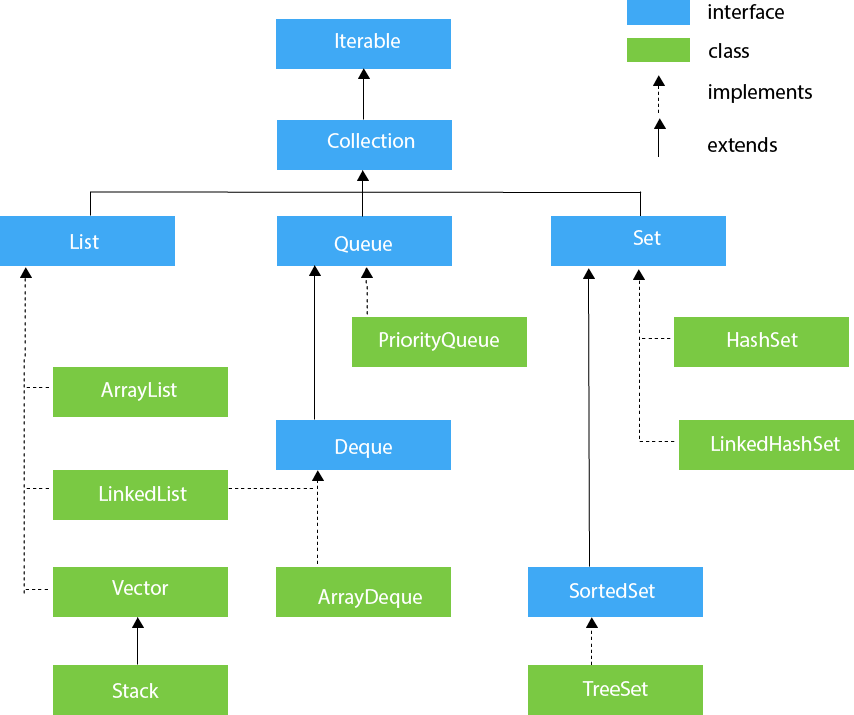<br><sub>Fig 36 - Collections - (<a href='https://www.javatpoint.com/collections-in-java'>Work by  Java T Point</a>) </sub></div>

<br>

#### <a name="chapter12part1"></a>Chapter 12 - Part 1: Working with Lists: ArrayList vs. LinkedList Performance

Understanding the performance characteristics of ArrayList and LinkedList is crucial for efficient Java development. Both implement the List interface, but their underlying data structures lead to different performance profiles for common operations. Choosing the right list implementation can significantly impact the performance of your application, especially when dealing with large datasets or performance-critical sections of code. This lesson will delve into the internal workings of each list type, analyze their time complexities for various operations, and provide practical guidance on when to use one over the other.

#### <a name="chapter12part1.1"></a>Chapter 12 - Part 1.1: ArrayList Internals and Performance

ArrayList is backed by a dynamically resizable array. This means that elements are stored in contiguous memory locations, allowing for fast access using an index.

**Key Characteristics of ArrayList:**

- **Underlying Data Structure**: Dynamically resizable array.
- **Memory Allocation**: Contiguous memory allocation.
- **Random Access**: Excellent (O(1)).
- **Insertion/Deletion at the End**: Generally fast (O(1) amortized), but can be O(n) if resizing is required.
- **Insertion/Deletion at the Beginning/Middle**: Slow (O(n)) due to element shifting.

**Detailed Explanation:**

When you create an ArrayList, it is initialized with a default capacity (typically 10). As you add elements, the ArrayList checks if the underlying array has enough space. If not, it creates a new array with a larger capacity (usually 1.5 times the original size), copies the existing elements to the new array, and then adds the new element. This resizing operation can be expensive, especially for large lists. However, because resizing doesn't happen with every insertion, the amortized time complexity for adding elements at the end is O(1).

Accessing an element at a specific index is very efficient because the ArrayList can directly calculate the memory address of the element using the index. This is why random access has a time complexity of O(1).

Inserting or deleting elements at the beginning or middle of the list requires shifting all subsequent elements to make space or fill the gap. This shifting operation takes O(n) time, where n is the number of elements that need to be shifted.

**Code Example: ArrayList Operations**

```java
import java.util.ArrayList;
import java.util.List;

public class ArrayListExample {

    public static void main(String[] args) {
        // Creating an ArrayList
        List<String> arrayList = new ArrayList<>();

        // Adding elements
        arrayList.add("Apple"); // O(1) amortized
        arrayList.add("Banana"); // O(1) amortized
        arrayList.add("Cherry"); // O(1) amortized

        // Accessing an element
        String element = arrayList.get(1); // O(1)
        System.out.println("Element at index 1: " + element);

        // Inserting an element at a specific index
        arrayList.add(1, "Mango"); // O(n)
        System.out.println("ArrayList after insertion: " + arrayList);

        // Removing an element at a specific index
        arrayList.remove(2); // O(n)
        System.out.println("ArrayList after removal: " + arrayList);

        //Adding multiple elements
        List<String> moreFruits = new ArrayList<>();
        moreFruits.add("Grapes");
        moreFruits.add("Kiwi");
        arrayList.addAll(moreFruits); // O(n), where n is the size of moreFruits
        System.out.println("ArrayList after adding all: " + arrayList);
    }
}
```

**ArrayList Capacity and ensureCapacity()**

The ArrayList class provides a method called ensureCapacity() that allows you to pre-allocate the underlying array's size. This can be useful when you know in advance how many elements you will be adding to the list, as it can prevent multiple resizing operations and improve performance.

```java
import java.util.ArrayList;
import java.util.List;

public class ArrayListCapacityExample {

    public static void main(String[] args) {
        // Creating an ArrayList with an initial capacity
        List<Integer> arrayList = new ArrayList<>(100); // Initial capacity of 100

        // Ensuring capacity before adding elements
        ((ArrayList<Integer>) arrayList).ensureCapacity(150); // Increase capacity to 150 if needed

        // Adding elements
        for (int i = 0; i < 120; i++) {
            arrayList.add(i);
        }

        System.out.println("ArrayList size: " + arrayList.size());
    }
}
```

In this example, we create an ArrayList with an initial capacity of 100. Then, we use the ensureCapacity() method to ensure that the underlying array can hold at least 150 elements. This prevents the ArrayList from having to resize the array multiple times as we add elements, which can improve performance. Note the cast to ArrayList<Integer> is required to access the ensureCapacity() method, as it's not part of the List interface.

#### <a name="chapter12part1.2"></a>Chapter 12 - Part 1.2: LinkedList Internals and Performance

LinkedList is based on a doubly-linked list data structure. Each element in the list is stored in a node, which contains a reference to the previous and next nodes in the list.

**Key Characteristics of LinkedList:**

- **Underlying Data Structure**: Doubly-linked list.
- **Memory Allocation**: Non-contiguous memory allocation.
- **Random Access**: Poor (O(n)).
- **Insertion/Deletion at the Beginning/End**: Fast (O(1)).
- **Insertion/Deletion at the Middle**: Can be faster than ArrayList if the position is known (O(1) if you have a reference to the node, O(n) to find the node).

**Detailed Explanation:**

In a LinkedList, elements are not stored in contiguous memory locations. Instead, each element (node) contains a pointer to the next and previous elements in the list. This structure makes it easy to insert or delete elements at any position in the list, as it only requires updating the pointers of the surrounding nodes. However, accessing an element at a specific index requires traversing the list from the beginning or end until the desired index is reached, resulting in O(n) time complexity for random access.

Adding or removing elements at the beginning or end of the list is very efficient because it only involves updating the head or tail pointers of the list. This operation takes O(1) time. Inserting or deleting elements in the middle of the list requires finding the node at the desired position, which takes O(n) time. However, if you already have a reference to the node where you want to insert or delete an element, the insertion or deletion operation itself takes only O(1) time.

**Code Example: LinkedList Operations**

```java
import java.util.LinkedList;
import java.util.List;

public class LinkedListExample {

    public static void main(String[] args) {
        // Creating a LinkedList
        List<String> linkedList = new LinkedList<>();

        // Adding elements
        linkedList.add("Apple"); // O(1)
        linkedList.add("Banana"); // O(1)
        linkedList.add("Cherry"); // O(1)

        // Accessing an element (inefficient)
        String element = linkedList.get(1); // O(n)
        System.out.println("Element at index 1: " + element);

        // Inserting an element at a specific index
        linkedList.add(1, "Mango"); // O(n) to find index, O(1) to insert
        System.out.println("LinkedList after insertion: " + linkedList);

        // Removing an element at a specific index
        linkedList.remove(2); // O(n) to find index, O(1) to remove
        System.out.println("LinkedList after removal: " + linkedList);

        // Adding element at the beginning
        ((LinkedList<String>) linkedList).addFirst("Strawberry"); // O(1)
        System.out.println("LinkedList after adding at the beginning: " + linkedList);

        // Removing element from the end
        ((LinkedList<String>) linkedList).removeLast(); // O(1)
        System.out.println("LinkedList after removing from the end: " + linkedList);
    }
}
```

Note the casts to LinkedList<String> are required to access the addFirst() and removeLast() methods, as they're not part of the List interface.

#### <a name="chapter12part1.3"></a>Chapter 12 - Part 1.3: Performance Comparison: ArrayList vs. LinkedList

|Operation|	ArrayList|	LinkedList|
| :-----------: | :-----------: | :-----------: |
|Random Access (get(i))	|O(1)|	O(n)|
|Insertion at Beginning	|O(n)|	O(1)|
|Insertion at End	|O(1) amortized	|O(1)|
|Insertion in Middle	|O(n)	|O(n)|
|Deletion at Beginning	|O(n)	|O(1)|
|Deletion at End	|O(1)	|O(1)|
|Deletion in Middle|	O(n)|	O(n)|
|Iteration	|O(n)	|O(n)|
|Memory Overhead	|Lower	|Higher|

**When to Use ArrayList:**

- Frequent random access is required.
- Insertion and deletion operations are mostly performed at the end of the list.
- Memory usage is a concern.

**When to Use LinkedList:**

-Frequent insertion and deletion operations are required at the beginning or middle of the list.
-Random access is not a primary requirement.
-You need to implement a queue or a deque (double-ended queue).

#### <a name="chapter12part2"></a>Chapter 12 - Part 2: Understanding Sets: HashSet, TreeSet, and LinkedHashSet

Sets are a fundamental data structure in Java's Collections Framework, providing a way to store unique elements. Unlike lists, sets do not allow duplicate entries, and they don't guarantee any specific order of elements (unless a specific implementation enforces it). This lesson explores three primary implementations of the Set interface: HashSet, TreeSet, and LinkedHashSet, detailing their characteristics, performance implications, and use cases. Understanding the nuances of each implementation is crucial for selecting the most appropriate set type for a given task, optimizing performance, and writing efficient Java code.

#### <a name="chapter12part2.1"></a>Chapter 12 - Part 2.1: Understanding the Set Interface

The Set interface extends the Collection interface and represents a collection of unique elements. This means that a Set cannot contain duplicate elements. More formally, a Set contains no pair of elements e1 and e2 such that e1.equals(e2), and at most one null element.

Key characteristics of the Set interface:

- **Uniqueness**: Ensures that each element in the set is unique.
- **No Indexing**: Does not support accessing elements by index, unlike lists.
- **Core Operations**: Supports basic operations like adding elements, removing elements, checking for membership, and iterating over elements.

Common methods defined in the Set interface include:

- add(E e): Adds the specified element to the set if it is not already present.
- remove(Object o): Removes the specified element from the set if it is present.
- contains(Object o): Returns true if the set contains the specified element.
- size(): Returns the number of elements in the set.
- isEmpty(): Returns true if the set contains no elements.
- iterator(): Returns an iterator over the elements in the set.
- clear(): Removes all of the elements from this set.

#### <a name="chapter12part2.2"></a>Chapter 12 - Part 2.2: HashSet: The Unordered Champion

HashSet is a general-purpose implementation of the Set interface that uses a hash table for storage. It offers excellent performance for basic operations like adding, removing, and checking for the presence of elements, especially when the set contains a large number of elements. However, HashSet does not guarantee any specific order of elements.

**Key Characteristics of HashSet**

- **Implementation**: Uses a hash table (specifically, a HashMap instance) to store elements.
- **Performance**: Provides constant-time performance (O(1)) for add, remove, and contains operations on average, assuming a good hash function and proper distribution of elements. Worst-case performance can degrade to O(n) if all elements hash to the same bucket.
- **Ordering**: Does not guarantee any specific order of elements. The order may change over time as elements are added or removed.
- **Null Elements**: Allows one null element.
- **Synchronization**: Not synchronized. If multiple threads access a HashSet concurrently, and at least one of the threads modifies the set, it must be synchronized externally.

**HashSet Example**

```java
import java.util.HashSet;
import java.util.Set;

public class HashSetExample {

    public static void main(String[] args) {
        // Creating a HashSet
        Set<String> hashSet = new HashSet<>();

        // Adding elements to the HashSet
        hashSet.add("Apple");
        hashSet.add("Banana");
        hashSet.add("Orange");
        hashSet.add("Apple"); // Adding a duplicate element (ignored)
        hashSet.add(null);    // Adding a null element

        // Printing the HashSet
        System.out.println("HashSet: " + hashSet); // Output: HashSet: [null, Orange, Banana, Apple] (order may vary)

        // Checking if an element exists
        boolean containsBanana = hashSet.contains("Banana");
        System.out.println("Contains Banana: " + containsBanana); // Output: Contains Banana: true

        // Removing an element
        hashSet.remove("Orange");
        System.out.println("HashSet after removing Orange: " + hashSet); // Output: HashSet after removing Orange: [null, Banana, Apple] (order may vary)

        // Iterating over the HashSet
        System.out.println("Iterating over HashSet:");
        for (String element : hashSet) {
            System.out.println(element); // Output: null, Banana, Apple (order may vary)
        }
    }
}
```

**Understanding the Code**

- The code creates a HashSet of strings.
- It adds several elements, including a duplicate ("Apple"), which is ignored, and a null element, which is allowed.
- The output demonstrates that the order of elements is not guaranteed.
- The code then checks for the presence of an element and removes another element.
- Finally, it iterates over the HashSet and prints each element.

**HashSet and Custom Objects**

When using HashSet with custom objects, it's crucial to override the hashCode() and equals() methods in the custom class. The hashCode() method provides a hash code for the object, which is used to determine the bucket in the hash table where the object is stored. The equals() method is used to compare objects for equality within the same bucket.

If these methods are not properly overridden, HashSet may not function correctly, and duplicate objects may be added to the set.

```java
import java.util.HashSet;
import java.util.Set;
import java.util.Objects;

class Point {
    private int x;
    private int y;

    public Point(int x, int y) {
        this.x = x;
        this.y = y;
    }

    public int getX() {
        return x;
    }

    public int getY() {
        return y;
    }

    @Override
    public boolean equals(Object o) {
        if (this == o) return true;
        if (o == null || getClass() != o.getClass()) return false;
        Point point = (Point) o;
        return x == point.x && y == point.y;
    }

    @Override
    public int hashCode() {
        return Objects.hash(x, y);
    }

    @Override
    public String toString() {
        return "Point{" +
                "x=" + x +
                ", y=" + y +
                '}';
    }
}

public class HashSetCustomObjectExample {
    public static void main(String[] args) {
        Set<Point> points = new HashSet<>();

        Point p1 = new Point(1, 2);
        Point p2 = new Point(1, 2);
        Point p3 = new Point(3, 4);

        points.add(p1);
        points.add(p2); // Duplicate, will not be added
        points.add(p3);

        System.out.println("HashSet of Points: " + points); // Output: HashSet of Points: [Point{x=3, y=4}, Point{x=1, y=2}]
        System.out.println("Size of HashSet: " + points.size()); // Output: Size of HashSet: 2
    }
}
```

**Explanation of the Code**

- The Point class represents a point in 2D space.
- The equals() method compares two Point objects based on their x and y coordinates.
- The hashCode() method generates a hash code based on the x and y coordinates.
- The HashSet correctly identifies p1 and p2 as duplicates because they have the same coordinates and, therefore, the same hash code and are equal according to the equals() method.

#### <a name="chapter12part2.3"></a>Chapter 12 - Part 2.3: TreeSet: The Sorted Set

TreeSet is another implementation of the Set interface that uses a tree structure (specifically, a TreeMap) for storage. Unlike HashSet, TreeSet guarantees that the elements will be stored in ascending order, according to their natural ordering or a custom Comparator provided at the time of creation.

**Key Characteristics of TreeSet**

- **Implementation**: Uses a tree structure (specifically, a TreeMap instance) to store elements.
- **Performance**: Provides logarithmic-time performance (O(log n)) for add, remove, and contains operations, where n is the number of elements in the set.
- **Ordering**: Guarantees that elements are stored in ascending order, according to their natural ordering or a custom Comparator.
- **Null Elements**: Does not allow null elements (unless a custom Comparator is provided that can handle null values).
- **Synchronization**: Not synchronized. If multiple threads access a TreeSet concurrently, and at least one of the threads modifies the set, it must be synchronized externally.

**TreeSet Example with Natural Ordering**

```java
import java.util.Set;
import java.util.TreeSet;

public class TreeSetExample {

    public static void main(String[] args) {
        // Creating a TreeSet with natural ordering
        Set<String> treeSet = new TreeSet<>();

        // Adding elements to the TreeSet
        treeSet.add("Banana");
        treeSet.add("Apple");
        treeSet.add("Orange");
        treeSet.add("Apple"); // Adding a duplicate element (ignored)

        // Printing the TreeSet
        System.out.println("TreeSet: " + treeSet); // Output: TreeSet: [Apple, Banana, Orange] (elements are sorted)

        // Checking if an element exists
        boolean containsBanana = treeSet.contains("Banana");
        System.out.println("Contains Banana: " + containsBanana); // Output: Contains Banana: true

        // Removing an element
        treeSet.remove("Orange");
        System.out.println("TreeSet after removing Orange: " + treeSet); // Output: TreeSet after removing Orange: [Apple, Banana]

        // Iterating over the TreeSet
        System.out.println("Iterating over TreeSet:");
        for (String element : treeSet) {
            System.out.println(element); // Output: Apple, Banana (elements are sorted)
        }
    }
}
```

**Understanding the Code**

- The code creates a TreeSet of strings, which uses the natural ordering of strings (alphabetical order).
- The output demonstrates that the elements are stored in ascending order.
- The code then checks for the presence of an element and removes another element.
- Finally, it iterates over the TreeSet and prints each element in sorted order.

**TreeSet with Custom Comparator**

To use TreeSet with custom objects or to define a custom ordering, you can provide a Comparator to the TreeSet constructor. The Comparator interface defines a method called compare(T o1, T o2) that compares two objects and returns a negative integer, zero, or a positive integer if o1 is less than, equal to, or greater than o2, respectively.

```java
import java.util.Comparator;
import java.util.Set;
import java.util.TreeSet;

class Point {
    private int x;
    private int y;

    public Point(int x, int y) {
        this.x = x;
        this.y = y;
    }

    public int getX() {
        return x;
    }

    public int getY() {
        return y;
    }

    @Override
    public String toString() {
        return "Point{" +
                "x=" + x +
                ", y=" + y +
                '}';
    }
}

public class TreeSetCustomComparatorExample {

    public static void main(String[] args) {
        // Creating a TreeSet with a custom comparator
        Set<Point> treeSet = new TreeSet<>(Comparator.comparingInt(Point::getX).thenComparingInt(Point::getY));

        // Adding elements to the TreeSet
        treeSet.add(new Point(1, 2));
        treeSet.add(new Point(1, 1));
        treeSet.add(new Point(2, 1));
        treeSet.add(new Point(1, 2)); // Adding a duplicate element (ignored)

        // Printing the TreeSet
        System.out.println("TreeSet: " + treeSet); // Output: TreeSet: [Point{x=1, y=1}, Point{x=1, y=2}, Point{x=2, y=1}] (elements are sorted by x, then by y)

        // Iterating over the TreeSet
        System.out.println("Iterating over TreeSet:");
        for (Point element : treeSet) {
            System.out.println(element); // Output: Point{x=1, y=1}, Point{x=1, y=2}, Point{x=2, y=1} (elements are sorted by x, then by y)
        }
    }
}
```

**Explanation of the Code**

- The code creates a TreeSet of Point objects, using a custom Comparator that compares points first by their x coordinate and then by their y coordinate.
- The output demonstrates that the elements are stored in ascending order based on the custom Comparator.

#### <a name="chapter12part2.4"></a>Chapter 12 - Part 2.4: LinkedHashSet: The Ordered Set

LinkedHashSet is an implementation of the Set interface that combines the characteristics of HashSet and LinkedList. It uses a hash table for storage, like HashSet, but it also maintains a doubly-linked list of the elements in the order they were inserted. This means that LinkedHashSet provides constant-time performance for basic operations and also guarantees that the elements will be iterated in the order they were inserted.

**Key Characteristics of LinkedHashSet**

- **Implementation**: Uses a hash table (specifically, a HashMap instance) to store elements and a doubly-linked list to maintain insertion order.
- **Performance**: Provides constant-time performance (O(1)) for add, remove, and contains operations on average, similar to HashSet.
- **Ordering**: Guarantees that elements are iterated in the order they were inserted.
- **Null Elements**: Allows one null element.
- **Synchronization**: Not synchronized. If multiple threads access a LinkedHashSet concurrently, and at least one of the threads modifies the set, it must be synchronized externally.

**LinkedHashSet Example**

```java
import java.util.LinkedHashSet;
import java.util.Set;

public class LinkedHashSetExample {

    public static void main(String[] args) {
        // Creating a LinkedHashSet
        Set<String> linkedHashSet = new LinkedHashSet<>();

        // Adding elements to the LinkedHashSet
        linkedHashSet.add("Banana");
        linkedHashSet.add("Apple");
        linkedHashSet.add("Orange");
        linkedHashSet.add("Apple"); // Adding a duplicate element (ignored)
        linkedHashSet.add(null);    // Adding a null element

        // Printing the LinkedHashSet
        System.out.println("LinkedHashSet: " + linkedHashSet); // Output: LinkedHashSet: [Banana, Apple, Orange, null] (elements are in insertion order)

        // Checking if an element exists
        boolean containsBanana = linkedHashSet.contains("Banana");
        System.out.println("Contains Banana: " + containsBanana); // Output: Contains Banana: true

        // Removing an element
        linkedHashSet.remove("Orange");
        System.out.println("LinkedHashSet after removing Orange: " + linkedHashSet); // Output: LinkedHashSet after removing Orange: [Banana, Apple, null]

        // Iterating over the LinkedHashSet
        System.out.println("Iterating over LinkedHashSet:");
        for (String element : linkedHashSet) {
            System.out.println(element); // Output: Banana, Apple, null (elements are in insertion order)
        }
    }
}
```

**Understanding the Code**

- The code creates a LinkedHashSet of strings.
- The output demonstrates that the elements are stored and iterated in the order they were inserted.
- The code then checks for the presence of an element and removes another element.
- Finally, it iterates over the LinkedHashSet and prints each element in insertion order.

#### <a name="chapter12part2.5"></a>Chapter 12 - Part 2.5: Performance Comparison

|Feature	|HashSet	|TreeSet	|LinkedHashSet|
| :-----------: | :-----------: | :-----------: | :-----------: |
|Implementation|	Hash table|	Tree structure|	Hash table + Linked list|
|Ordering|	Unordered|	Sorted (natural or Comparator)|	Insertion order|
|Performance|	O(1) average, O(n) worst|	O(log n)|	O(1) average, O(n) worst|
|Null Elements|	One null element allowed|	Not allowed|	One null element allowed|
|Memory Usage|	Generally lower|	Higher|	Higher than HashSet|

#### <a name="chapter12part2.6"></a>Chapter 12 - Part 2.6: Choosing the Right Set Implementation

The choice of which Set implementation to use depends on the specific requirements of the application:

**Use HashSet when:**
- You need the best possible performance for add, remove, and contains operations.
- The order of elements is not important.

**Use TreeSet when:**
- You need the elements to be stored in sorted order.
- Performance is less critical than ordering.

**Use LinkedHashSet when:**
- You need to maintain the insertion order of elements.
- Performance is important, but not as critical as with HashSet.

#### <a name="chapter12part3"></a>Chapter 12 - Part 3: Mastering Maps: HashMap, TreeMap, and LinkedHashMap

Maps are fundamental data structures that allow you to store and retrieve data using key-value pairs. In Java, the Map interface is implemented by several classes, each with its own unique characteristics and performance trade-offs. Understanding the differences between HashMap, TreeMap, and LinkedHashMap is crucial for choosing the right map implementation for your specific needs. This lesson will delve into the intricacies of these three classes, exploring their internal workings, performance characteristics, and use cases.

#### <a name="chapter12part3.1"></a>Chapter 12 - Part 3.1: Understanding the Map Interface

Before diving into the specific implementations, let's briefly review the Map interface itself. The Map interface, part of the Java Collections Framework, defines the contract for storing and retrieving data in key-value pairs. Key characteristics of a Map include:

- Keys must be unique: A Map cannot contain duplicate keys.
- Values can be duplicated: Multiple keys can map to the same value.
- Provides methods for:
  - put(key, value): Inserts a key-value pair into the map.
  - get(key): Retrieves the value associated with the given key.
  - remove(key): Removes the key-value pair associated with the given key.
  - containsKey(key): Checks if the map contains the given key.
  - containsValue(value): Checks if the map contains the given value.
  - size(): Returns the number of key-value pairs in the map.
  - isEmpty(): Checks if the map is empty.
  - keySet(): Returns a Set view of the keys contained in the map.
  - values(): Returns a Collection view of the values contained in the map.
  - entrySet(): Returns a Set view of the key-value mappings contained in the map.

#### <a name="chapter12part3.2"></a>Chapter 12 - Part 3.2: HashMap: The Unordered Champion

HashMap is the most commonly used implementation of the Map interface in Java. It provides constant-time average performance for basic operations like get and put, assuming a good hash function and proper distribution of keys.

**Internal Working of HashMap**

HashMap works by using a hash function to compute an index (a hash code) for each key. This hash code is then used to determine the bucket in which the key-value pair will be stored. The buckets are typically implemented as an array of linked lists or, in more recent versions of Java (since Java 8), as an array of trees (specifically, balanced trees) when a bucket contains a large number of elements with colliding hash codes.

When you call put(key, value), the HashMap calculates the hash code of the key, finds the appropriate bucket, and adds the key-value pair to that bucket. If the key already exists in the bucket, the old value is replaced with the new value.

When you call get(key), the HashMap calculates the hash code of the key, finds the appropriate bucket, and searches the bucket for the key. If the key is found, the associated value is returned.

**HashMap Example**

```java
import java.util.HashMap;
import java.util.Map;

public class HashMapExample {
    public static void main(String[] args) {
        // Creating a HashMap
        Map<String, Integer> studentGrades = new HashMap<>();

        // Adding key-value pairs
        studentGrades.put("Alice", 95);
        studentGrades.put("Bob", 80);
        studentGrades.put("Charlie", 90);

        // Retrieving values
        System.out.println("Alice's grade: " + studentGrades.get("Alice")); // Output: Alice's grade: 95

        // Checking if a key exists
        System.out.println("Contains key 'Bob': " + studentGrades.containsKey("Bob")); // Output: Contains key 'Bob': true

        // Iterating over the HashMap
        System.out.println("Student Grades:");
        for (Map.Entry<String, Integer> entry : studentGrades.entrySet()) {
            System.out.println(entry.getKey() + ": " + entry.getValue());
        }
        // Possible Output:
        // Student Grades:
        // Bob: 80
        // Alice: 95
        // Charlie: 90
    }
}
```

**HashMap Performance**

- Average Case: O(1) for get, put, remove, and containsKey operations.
- Worst Case: O(n) for get, put, remove, and containsKey operations, where n is the number of key-value pairs in the map. This occurs when all keys have the same hash code, resulting in all entries being placed in the same bucket. However, with the introduction of treeified buckets in Java 8, the worst-case performance degrades to O(log n) when a bucket exceeds a certain threshold (TREEIFY_THRESHOLD = 8).

**HashMap Considerations**

- HashMap allows one null key and multiple null values.
- HashMap does not guarantee any specific order of elements. The order may change over time.
- HashMap is not synchronized, meaning it is not thread-safe. If you need a thread-safe map, consider using ConcurrentHashMap (which will be covered in a later module) or synchronizing access to the HashMap externally.

#### <a name="chapter12part3.3"></a>Chapter 12 - Part 3.3: TreeMap: The Sorted Map

TreeMap is an implementation of the SortedMap interface, which means that it maintains its entries in a sorted order based on the keys. This sorting is achieved using a red-black tree data structure.

**Internal Working of TreeMap**

TreeMap stores its entries in a red-black tree. A red-black tree is a self-balancing binary search tree that guarantees logarithmic time complexity for basic operations. The keys are sorted according to their natural ordering (if they implement the Comparable interface) or according to a Comparator provided at the time of TreeMap creation.

When you call put(key, value), the TreeMap inserts the key-value pair into the tree in the correct sorted position. If the key already exists, the old value is replaced with the new value.

When you call get(key), the TreeMap searches the tree for the key, taking advantage of the sorted order to efficiently locate the key.

**TreeMap Example**

```java
import java.util.Map;
import java.util.TreeMap;

public class TreeMapExample {
    public static void main(String[] args) {
        // Creating a TreeMap
        Map<String, Integer> studentAges = new TreeMap<>();

        // Adding key-value pairs
        studentAges.put("Charlie", 20);
        studentAges.put("Alice", 18);
        studentAges.put("Bob", 19);

        // Iterating over the TreeMap (entries are sorted by key)
        System.out.println("Student Ages (sorted by name):");
        for (Map.Entry<String, Integer> entry : studentAges.entrySet()) {
            System.out.println(entry.getKey() + ": " + entry.getValue());
        }
        // Output:
        // Student Ages (sorted by name):
        // Alice: 18
        // Bob: 19
        // Charlie: 20
    }
}
```

**TreeMap Performance**

- Average Case: O(log n) for get, put, remove, and containsKey operations, where n is the number of key-value pairs in the map.
- Worst Case: O(log n) for get, put, remove, and containsKey operations. Red-black trees guarantee logarithmic performance even in the worst case.

**TreeMap Considerations**

- TreeMap does not allow null keys if the TreeMap uses the natural ordering of its keys, because null cannot be compared. However, null values are allowed. If a Comparator is provided that can handle null keys, then null keys are allowed.
- TreeMap maintains its entries in a sorted order based on the keys.
- TreeMap is not synchronized, meaning it is not thread-safe.

#### <a name="chapter12part3.4"></a>Chapter 12 - Part 3.4: LinkedHashMap: The Ordered HashMap

LinkedHashMap is a subclass of HashMap that maintains the insertion order of its entries. It provides constant-time average performance for basic operations, like HashMap, but also preserves the order in which elements were inserted.

**Internal Working of LinkedHashMap**

LinkedHashMap uses a doubly-linked list to maintain the insertion order of its entries. In addition to the hash table used by HashMap, LinkedHashMap also maintains a linked list that connects all the entries in the order they were inserted.

When you call put(key, value), the LinkedHashMap calculates the hash code of the key, finds the appropriate bucket, and adds the key-value pair to that bucket. It also updates the linked list to reflect the insertion order. If the key already exists, the old value is replaced with the new value, and the linked list is updated to reflect the access order (if access-order is enabled, see below).

When you call get(key), the LinkedHashMap calculates the hash code of the key, finds the appropriate bucket, and searches the bucket for the key. If the key is found, the associated value is returned, and the linked list is updated to reflect the access order (if access-order is enabled).

**LinkedHashMap Example**

```java
import java.util.LinkedHashMap;
import java.util.Map;

public class LinkedHashMapExample {
    public static void main(String[] args) {
        // Creating a LinkedHashMap
        Map<String, Integer> studentScores = new LinkedHashMap<>();

        // Adding key-value pairs
        studentScores.put("Alice", 85);
        studentScores.put("Bob", 92);
        studentScores.put("Charlie", 78);

        // Iterating over the LinkedHashMap (entries are in insertion order)
        System.out.println("Student Scores (in insertion order):");
        for (Map.Entry<String, Integer> entry : studentScores.entrySet()) {
            System.out.println(entry.getKey() + ": " + entry.getValue());
        }
        // Output:
        // Student Scores (in insertion order):
        // Alice: 85
        // Bob: 92
        // Charlie: 78
    }
}
```

**LinkedHashMap Performance**

- Average Case: O(1) for get, put, remove, and containsKey operations.
- Worst Case: O(n) for get, put, remove, and containsKey operations (similar to HashMap, but mitigated by treeification in Java 8+).
- Iteration over the entries is O(n), where n is the number of entries in the map, regardless of the map's capacity. This makes LinkedHashMap a good choice when you need to iterate over the entries in a predictable order.

**LinkedHashMap Considerations**

- LinkedHashMap allows one null key and multiple null values, just like HashMap.
- LinkedHashMap maintains its entries in insertion order (by default) or access order (if specified in the constructor).
- LinkedHashMap is not synchronized, meaning it is not thread-safe.
- LinkedHashMap can be used to implement a simple LRU (Least Recently Used) cache by overriding the removeEldestEntry method.

**Access-Order LinkedHashMap**

LinkedHashMap provides an option to maintain entries in access order instead of insertion order. This is controlled by a constructor parameter:

```java
LinkedHashMap<KeyType, ValueType> map = new LinkedHashMap<>(initialCapacity, loadFactor, accessOrder);
```

- accessOrder = true: The map maintains entries in the order they were last accessed (i.e., the order in which get or put operations were called).
- accessOrder = false: The map maintains entries in the order they were inserted (the default).

When accessOrder is true, each time you access an element using get or put, that element is moved to the end of the linked list. This makes it easy to identify the least recently used elements in the map.

**LRU Cache Implementation with LinkedHashMap**

Here's an example of how to use LinkedHashMap to implement a simple LRU cache:

```java
import java.util.LinkedHashMap;
import java.util.Map;

public class LRUCache<K, V> extends LinkedHashMap<K, V> {
    private int capacity;

    public LRUCache(int capacity) {
        super(capacity, 0.75f, true); // accessOrder = true
        this.capacity = capacity;
    }

    @Override
    protected boolean removeEldestEntry(Map.Entry<K, V> eldest) {
        return size() > capacity;
    }

    public static void main(String[] args) {
        LRUCache<String, String> cache = new LRUCache<>(3);

        cache.put("A", "Apple");
        cache.put("B", "Banana");
        cache.put("C", "Cherry");

        System.out.println(cache); // Output: {A=Apple, B=Banana, C=Cherry}

        cache.get("B"); // Access "B", moving it to the end
        System.out.println(cache); // Output: {A=Apple, C=Cherry, B=Banana}

        cache.put("D", "Date"); // "A" is the least recently used, so it's removed
        System.out.println(cache); // Output: {C=Cherry, B=Banana, D=Date}
    }
}
```

In this example, the removeEldestEntry method is overridden to remove the eldest (least recently used) entry when the cache exceeds its capacity.

#### <a name="chapter12part3.5"></a>Chapter 12 - Part 3.5: Choosing the Right Map Implementation

The choice between HashMap, TreeMap, and LinkedHashMap depends on your specific requirements:

- HashMap: Use HashMap when you need the fastest possible get and put operations and the order of elements doesn't matter.
- TreeMap: Use TreeMap when you need to maintain the entries in a sorted order based on the keys.
- LinkedHashMap: Use LinkedHashMap when you need to maintain the entries in insertion order or access order. This is useful for implementing caches or when you need to iterate over the entries in a predictable order.


|Feature	|HashMap	|TreeMap	|LinkedHashMap|
| :-----------: | :-----------: | :-----------: | :-----------: |
|Ordering|	Unordered|	Sorted by key|	Insertion order or access order|
|Performance|	O(1) average, O(n) worst case|	O(log n)|	O(1) average, O(n) worst case|
|Null Keys|	One null key allowed|	Null keys not allowed (unless Comparator allows it)|	One null key allowed|
|Implementation|	Hash table|	Red-black tree|	Hash table + doubly-linked list|
|Memory Usage|	Generally lower than LinkedHashMap/TreeMap|	Higher than HashMap|	Higher than HashMap|
|Use Cases|	General-purpose map|	Sorted data, range queries|	Caches, maintaining insertion order|

#### <a name="chapter12part4"></a>Chapter 12 - Part 4: Implementing Custom Data Structures: Linked List

Implementing a custom data structure like a linked list provides a deeper understanding of how data is organized and manipulated in memory. While Java's LinkedList class offers a ready-made implementation, building one from scratch allows you to appreciate the underlying mechanics and tailor the structure to specific needs. This lesson will cover the fundamental principles of linked lists, their different types, and how to implement them in Java. We'll explore the core operations, analyze their time complexities, and discuss the advantages and disadvantages of using linked lists compared to other data structures.

#### <a name="chapter12part4.1"></a>Chapter 12 - Part 4.1: Understanding Linked Lists

A linked list is a linear data structure where elements are not stored in contiguous memory locations. Instead, each element, called a node, contains a value and a pointer (or link) to the next node in the sequence. This structure allows for dynamic memory allocation and efficient insertion and deletion of elements at any position.

**Core Concepts**

- **Node**: The basic building block of a linked list. Each node contains two parts:
  - **Data**: The actual value stored in the node. This can be of any data type.
  - **Next**: A reference (or pointer) to the next node in the list. If it's the last node, the next reference is typically null.
- **Head**: The first node in the linked list. It serves as the entry point to the list. If the list is empty, the head is null.
- **Tail**: The last node in the linked list. The next reference of the tail node is always null.

**Types of Linked Lists**

There are several variations of linked lists, each with its own characteristics and use cases:

- **Singly Linked List**: Each node points only to the next node in the sequence. Traversal is possible only in one direction, from head to tail.
- **Doubly Linked List**: Each node contains pointers to both the next and the previous nodes. This allows for bidirectional traversal, making certain operations more efficient.
- **Circular Linked List**: The last node points back to the first node, forming a circle. This type is useful for representing repeating sequences or when you need to traverse the list indefinitely.

#### <a name="chapter12part4.2"></a>Chapter 12 - Part 4.2: Implementing a Singly Linked List in Java

Let's start by implementing a singly linked list in Java. We'll define a Node class and a LinkedList class to manage the list.

**The Node Class**

```java
public class Node {
    public int data; // Data stored in the node
    public Node next; // Reference to the next node

    public Node(int data) {
        this.data = data;
        this.next = null; // Initially, the next node is null
    }
}
```

This Node class is a simple representation of a node in a singly linked list. It contains an integer data field and a next field that points to the next node in the list. The constructor initializes the data field and sets the next field to null.

**The LinkedList Class**

```java
public class LinkedList {
    public Node head; // Reference to the first node in the list

    public LinkedList() {
        this.head = null; // Initially, the list is empty
    }

    // Method to insert a new node at the beginning of the list
    public void insertAtBeginning(int data) {
        Node newNode = new Node(data); // Create a new node
        newNode.next = head; // Point the new node's next to the current head
        head = newNode; // Update the head to the new node
    }

    // Method to insert a new node at the end of the list
    public void insertAtEnd(int data) {
        Node newNode = new Node(data); // Create a new node

        if (head == null) {
            // If the list is empty, the new node becomes the head
            head = newNode;
            return;
        }

        Node current = head;
        while (current.next != null) {
            // Traverse to the last node
            current = current.next;
        }

        current.next = newNode; // Add the new node to the end
    }

    // Method to delete a node with a given value
    public void deleteNode(int data) {
        if (head == null) {
            // If the list is empty, there's nothing to delete
            return;
        }

        if (head.data == data) {
            // If the head node contains the data to be deleted, update the head
            head = head.next;
            return;
        }

        Node current = head;
        Node previous = null;

        while (current != null && current.data != data) {
            // Traverse the list to find the node to be deleted
            previous = current;
            current = current.next;
        }

        if (current == null) {
            // If the data is not found in the list, do nothing
            return;
        }

        // Remove the node by updating the previous node's next reference
        previous.next = current.next;
    }

    // Method to print the linked list
    public void printList() {
        Node current = head;
        while (current != null) {
            System.out.print(current.data + " ");
            current = current.next;
        }
        System.out.println();
    }
}
```

This LinkedList class provides the basic operations for managing a singly linked list:

- insertAtBeginning(int data): Inserts a new node at the beginning of the list.
- insertAtEnd(int data): Inserts a new node at the end of the list.
- deleteNode(int data): Deletes a node with the specified data value.
- printList(): Prints the elements of the list.

**Example Usage**

```java
public class Main {
    public static void main(String[] args) {
        LinkedList list = new LinkedList();

        list.insertAtEnd(1);
        list.insertAtEnd(2);
        list.insertAtEnd(3);

        System.out.println("Linked List after inserting 1, 2, and 3 at the end:");
        list.printList(); // Output: 1 2 3

        list.insertAtBeginning(0);
        System.out.println("Linked List after inserting 0 at the beginning:");
        list.printList(); // Output: 0 1 2 3

        list.deleteNode(2);
        System.out.println("Linked List after deleting 2:");
        list.printList(); // Output: 0 1 3
    }
}
```

This example demonstrates how to use the LinkedList class to create a linked list, insert elements, and delete elements.

#### <a name="chapter12part4.3"></a>Chapter 12 - Part 4.3: Implementing a Doubly Linked List in Java

A doubly linked list is similar to a singly linked list, but each node also has a reference to the previous node. This allows for bidirectional traversal.

**The Doubly Linked Node Class**

```java
public class DoublyLinkedNode {
    public int data;
    public DoublyLinkedNode next;
    public DoublyLinkedNode prev;

    public DoublyLinkedNode(int data) {
        this.data = data;
        this.next = null;
        this.prev = null;
    }
}
```

**The Doubly LinkedList Class**

```java
public class DoublyLinkedList {
    public DoublyLinkedNode head;
    public DoublyLinkedNode tail; // Keep track of the tail for efficient insertion at the end

    public DoublyLinkedList() {
        this.head = null;
        this.tail = null;
    }

    public void insertAtBeginning(int data) {
        DoublyLinkedNode newNode = new DoublyLinkedNode(data);

        if (head == null) {
            head = newNode;
            tail = newNode;
        } else {
            newNode.next = head;
            head.prev = newNode;
            head = newNode;
        }
    }

    public void insertAtEnd(int data) {
        DoublyLinkedNode newNode = new DoublyLinkedNode(data);

        if (tail == null) {
            head = newNode;
            tail = newNode;
        } else {
            newNode.prev = tail;
            tail.next = newNode;
            tail = newNode;
        }
    }

    public void deleteNode(int data) {
        DoublyLinkedNode current = head;

        while (current != null) {
            if (current.data == data) {
                if (current == head) {
                    head = current.next;
                    if (head != null) {
                        head.prev = null;
                    } else {
                        tail = null; // List is now empty
                    }
                } else if (current == tail) {
                    tail = current.prev;
                    tail.next = null;
                } else {
                    current.prev.next = current.next;
                    current.next.prev = current.prev;
                }
                return;
            }
            current = current.next;
        }
    }

    public void printList() {
        DoublyLinkedNode current = head;
        while (current != null) {
            System.out.print(current.data + " ");
            current = current.next;
        }
        System.out.println();
    }
}
```

The DoublyLinkedList class includes a tail reference for efficient insertion at the end. The deleteNode method handles different cases: deleting the head, deleting the tail, or deleting a node in the middle of the list.

#### <a name="chapter12part4.4"></a>Chapter 12 - Part 4.4: Time Complexity Analysis

Understanding the time complexity of linked list operations is crucial for choosing the right data structure for a particular application.

|Operation	|Singly Linked List|	Doubly Linked List|
| :-----------: | :-----------: | :-----------: |
|Insert at Beginning|	O(1)|	O(1)|
|Insert at End|	O(n)|	O(1)|
|Delete Node (by value)|	O(n)|	O(n)|
|Search (by value)|	O(n)|	O(n)|

- **Insert at Beginning**: In both singly and doubly linked lists, inserting at the beginning takes constant time, O(1), as it only involves updating the head reference.
- **Insert at End**: In a singly linked list, inserting at the end requires traversing the entire list to find the last node, resulting in O(n) time complexity. However, in a doubly linked list, if you maintain a tail pointer, you can insert at the end in O(1) time.
- **Delete Node (by value)**: Deleting a node by value requires searching for the node first, which takes O(n) time. Once the node is found, the deletion process itself takes O(1) time, but the overall complexity remains O(n).
- **Search (by value)**: Searching for a node with a specific value requires traversing the list, resulting in O(n) time complexity.

#### <a name="chapter12part4.5"></a>Chapter 12 - Part 4.5: Advantages and Disadvantages of Linked Lists

**Advantages**

- **Dynamic Size**: Linked lists can grow or shrink dynamically at runtime, as memory is allocated for each node as needed.
- **Efficient Insertion and Deletion**: Inserting or deleting elements at any position in a linked list is generally faster than in arrays, especially when the position is known.
- **No Memory Wastage**: Memory is only allocated for the nodes that are actually in use, reducing memory wastage compared to arrays where a fixed amount of memory is allocated upfront.

**Disadvantages**

- **Memory Overhead**: Each node requires extra memory to store the pointer to the next (and previous, in the case of doubly linked lists) node.
- **No Random Access**: Accessing an element in a linked list requires traversing the list from the head, resulting in O(n) time complexity. Arrays, on the other hand, provide random access with O(1) time complexity.
- **Cache Inefficiency**: Linked list nodes are not stored in contiguous memory locations, which can lead to cache misses and reduced performance.

#### <a name="chapter12part5"></a>Chapter 12 - Part 5: Implementing Custom Data Structures: Binary Search Tree

Binary Search Trees (BSTs) are a fundamental data structure in computer science, offering efficient searching, insertion, and deletion operations. Unlike linear data structures like linked lists, BSTs provide logarithmic time complexity for these operations in the average case, making them suitable for large datasets. This lesson delves into the implementation of a custom Binary Search Tree in Java, covering the core concepts, algorithms, and practical considerations involved in building this essential data structure. We will build upon the concepts of linked lists from the previous lesson to understand how tree structures differ and where they excel.

#### <a name="chapter12part5.1"></a>Chapter 12 - Part 5.1: Understanding Binary Search Tree Properties

A Binary Search Tree is a tree-based data structure where each node has at most two children, referred to as the left child and the right child. The key property of a BST is that for any given node:

- All nodes in its left subtree have keys less than the node's key.
- All nodes in its right subtree have keys greater than the node's key.

This property ensures that the tree is ordered, enabling efficient searching.

**BST Node Structure**

The basic building block of a BST is the node. A node typically contains the following:

- ```key```: The value stored in the node (used for comparison).
- ```left```: A reference to the left child node.
- ```right```: A reference to the right child node.

In Java, this can be represented as:

```java
class Node {
    int key;
    Node left, right;

    public Node(int data){
        key = data;
        left = right = null;
    }
}
```

**BST Example**

Consider the following set of numbers: 50, 30, 20, 40, 70, 60, 80. A BST constructed from these numbers would look like this:

```
        50
       /  \
      30   70
     /  \ /  \
    20  40 60  80
```

Notice how the BST property holds true for each node. For example, at node 50, all nodes in the left subtree (30, 20, 40) are less than 50, and all nodes in the right subtree (70, 60, 80) are greater than 50.

#### <a name="chapter12part5.2"></a>Chapter 12 - Part 5.2: Implementing Core BST Operations

The primary operations performed on a BST are insertion, deletion, searching, and traversal.

**Insertion**

The insertion operation involves adding a new node to the BST while maintaining the BST property. The algorithm is as follows:

- Start at the root node.
- Compare the key of the new node with the key of the current node.
- If the new key is less than the current key, move to the left child.
- If the new key is greater than the current key, move to the right child.
- Repeat steps 2-4 until you reach a null node (an empty spot).
- Insert the new node at that empty spot.

```java
class BinarySearchTree {
    Node root;

    BinarySearchTree() {
        root = null;
    }

    void insert(int key) {
        root = insertRec(root, key);
    }

    /* A recursive function to insert a new key in BST */
    Node insertRec(Node root, int key) {

        /* If the tree is empty, return a new node */
        if (root == null) {
            root = new Node(key);
            return root;
        }

        /* Otherwise, recur down the tree */
        if (key < root.key)
            root.left = insertRec(root.left, key);
        else if (key > root.key)
            root.right = insertRec(root.right, key);

        /* return the (unchanged) node pointer */
        return root;
    }
    // Other methods will be added here
}
```

Example: Inserting the value 55 into the BST above.

- Start at the root (50). 55 > 50, so move to the right child (70).
- 55 < 70, so move to the left child (60).
- 55 < 60, so move to the left child. This is currently null.
- Insert a new node with the key 55 as the left child of 60.

The updated tree would be:

```
        50
       /  \
      30   70
     /  \ /  \
    20  40 60  80
           /
          55
```

**Searching**

The search operation involves finding a node with a specific key in the BST. The algorithm is similar to insertion:

- Start at the root node.
- Compare the key being searched for with the key of the current node.
- If the keys are equal, the node is found.
- If the search key is less than the current key, move to the left child.
- If the search key is greater than the current key, move to the right child.
- Repeat steps 2-5 until the node is found or a null node is reached (in which case, the key is not in the tree).

```java
 // This method mainly calls searchRec()
    boolean search(int key)  {
        return searchRec(root, key);
    }

    // A recursive function to search a key in BST
    boolean searchRec(Node root, int key) {
        // Base Cases: root is null or key is present at root
        if (root==null || root.key==key)
            return root != null;

        // Key is greater than root's key
        if (root.key < key)
            return searchRec(root.right, key);

        // Key is smaller than root's key
        return searchRec(root.left, key);
    }
```

Example: Searching for the value 40 in the BST.

- Start at the root (50). 40 < 50, so move to the left child (30).
- 40 > 30, so move to the right child (40).
- 40 == 40, so the node is found.

**Deletion**

The deletion operation involves removing a node from the BST while maintaining the BST property. This is the most complex operation, with three possible scenarios:

- Node to be deleted is a leaf node: Simply remove the node.
- Node to be deleted has one child: Replace the node with its child.
- Node to be deleted has two children: Find the inorder successor (the smallest node in the right subtree) of the node to be deleted, replace the node to be deleted with the inorder successor, and then delete the inorder successor from its original position.

```java
  void deleteKey(int key) {
        root = deleteRec(root, key);
    }

    /* A recursive function to delete a key in BST */
    Node deleteRec(Node root, int key) {
        /* Base Case: If the tree is empty */
        if (root == null)  return root;

        /* Otherwise, recur down the tree */
        if (key < root.key)
            root.left = deleteRec(root.left, key);
        else if (key > root.key)
            root.right = deleteRec(root.right, key);

            // if key is same as root's key, then This is the node
            // to be deleted
        else {
            // node with only one child or no child
            if (root.left == null)
                return root.right;
            else if (root.right == null)
                return root.left;

            // node with two children: Get the inorder successor (smallest
            // in the right subtree)
            root.key = minValue(root.right);

            // Delete the inorder successor
            root.right = deleteRec(root.right, root.key);
        }

        return root;
    }

    int minValue(Node root) {
        int minv = root.key;
        while (root.left != null) {
            minv = root.left.key;
            root = root.left;
        }
        return minv;
    }
```

Example: Deleting the value 70 from the BST.

- Start at the root (50). 70 > 50, so move to the right child (70).
- 70 == 70, so this is the node to be deleted.
- Node 70 has two children (60 and 80).
- Find the inorder successor of 70, which is 80.
- Replace 70 with 80.
- Delete the original node 80 (which is now a leaf node).

The updated tree would be:

```
        50
       /  \
      30   80
     /  \ /
    20  40 60
           /
          55
```

**Traversal**

Tree traversal involves visiting each node in the tree in a specific order. There are two main types of traversals:

- **Inorder Traversal**: Visits the left subtree, then the current node, then the right subtree. For a BST, this traversal results in visiting the nodes in ascending order of their keys.
- **Preorder Traversal**: Visits the current node, then the left subtree, then the right subtree.
- **Postorder Traversal**: Visits the left subtree, then the right subtree, then the current node.

```java
 // Inorder traversal of the tree
    void inorder() {
        inorderRec(root);
    }

    // A recursive function to do inorder traversal of BST
    void inorderRec(Node root) {
        if (root != null) {
            inorderRec(root.left);
            System.out.print(root.key + " ");
            inorderRec(root.right);
        }
    }
```

Example: Inorder traversal of the BST:

```
        50
       /  \
      30   70
     /  \ /  \
    20  40 60  80
```

The inorder traversal would produce the following output: 20 30 40 50 60 70 80

#### <a name="chapter12part5.3"></a>Chapter 12 - Part 5.3: Balancing BSTs

A significant issue with BSTs is that their performance degrades to O(n) in the worst-case scenario, which occurs when the tree becomes skewed (i.e., resembles a linked list). This happens when elements are inserted in a sorted order.

To mitigate this, self-balancing BSTs are used. These trees automatically adjust their structure to maintain a balanced height, ensuring logarithmic time complexity for search, insertion, and deletion operations. Examples of self-balancing BSTs include AVL trees and Red-Black trees. While we won't implement these in this lesson (as they are more advanced), it's important to be aware of their existence and purpose.

#### <a name="chapter12part6"></a>Chapter 12 - Part 6: Practical Exercise: Building a Cache using HashMap

Building a Cache using HashMap is a fundamental exercise that demonstrates the practical application of the HashMap data structure. Caching is a crucial optimization technique used extensively in software development to improve performance by storing frequently accessed data in a fast-access location. This lesson will explore how to implement a simple cache using HashMap in Java, covering key concepts such as cache eviction policies and thread safety considerations.

#### <a name="chapter12part6.1"></a>Chapter 12 - Part 6.1: Understanding Caching and its Importance

Caching is a technique used to store frequently accessed data in a temporary storage location (the cache) to reduce the latency and improve the performance of data retrieval. Instead of fetching data from the original source (e.g., a database, a remote server), the application first checks the cache. If the data is present in the cache (a "cache hit"), it is retrieved quickly. If the data is not in the cache (a "cache miss"), it is fetched from the original source, stored in the cache, and then returned to the application.

**Benefits of Caching**

- **Reduced Latency**: Accessing data from the cache is significantly faster than fetching it from the original source.
- **Improved Performance**: By serving data from the cache, the application can handle more requests and improve overall throughput.
- **Reduced Load on Original Source**: Caching reduces the number of requests to the original data source, which can help prevent overload and improve scalability.
- **Cost Savings**: In scenarios where accessing the original data source incurs costs (e.g., cloud-based services), caching can reduce these costs by minimizing the number of requests.

**Real-World Examples of Caching**

- **Web Browsers**: Web browsers cache static assets like images, CSS files, and JavaScript files to reduce page load times. When you revisit a website, the browser retrieves these assets from the cache instead of downloading them again from the server.
- **Content Delivery Networks (CDNs)**: CDNs cache content closer to the end-users, reducing latency and improving the delivery of web content. When a user requests content, the CDN server closest to them serves the content from its cache.
- **Database Caching**: Databases often use caching to store frequently accessed data in memory, reducing the need to read data from disk. This can significantly improve query performance.

**Hypothetical Scenario**

Imagine an e-commerce application that displays product details. Without caching, every time a user views a product, the application would need to fetch the product details from the database. This can be slow and resource-intensive, especially for popular products that are viewed frequently. By implementing a cache, the application can store the product details in memory and serve them directly from the cache, reducing the load on the database and improving the user experience.

#### <a name="chapter12part6.2"></a>Chapter 12 - Part 6.2: Implementing a Simple Cache using HashMap

HashMap is a suitable data structure for implementing a simple cache due to its fast average-case performance for get and put operations (O(1)). The keys of the HashMap represent the cache keys, and the values represent the cached data.

**Basic Cache Implementation**

Here's a basic implementation of a cache using HashMap in Java:

```java
import java.util.HashMap;
import java.util.Map;

public class SimpleCache<K, V> {

    private final Map<K, V> cache = new HashMap<>();

    public V get(K key) {
        return cache.get(key);
    }

    public void put(K key, V value) {
        cache.put(key, value);
    }

    public void remove(K key) {
        cache.remove(key);
    }

    public void clear() {
        cache.clear();
    }

    public int size() {
        return cache.size();
    }

    public static void main(String[] args) {
        SimpleCache<String, String> cache = new SimpleCache<>();
        cache.put("key1", "value1");
        cache.put("key2", "value2");

        System.out.println("Value for key1: " + cache.get("key1")); // Output: Value for key1: value1
        System.out.println("Cache size: " + cache.size()); // Output: Cache size: 2

        cache.remove("key1");
        System.out.println("Cache size after removing key1: " + cache.size()); // Output: Cache size after removing key1: 1

        cache.clear();
        System.out.println("Cache size after clearing: " + cache.size()); // Output: Cache size after clearing: 0
    }
}
```

Explanation:

- The SimpleCache class uses a HashMap to store the cached data.
- The get method retrieves a value from the cache based on the key.
- The put method adds a key-value pair to the cache.
- The remove method removes a key-value pair from the cache.
- The clear method clears the entire cache.
- The size method returns the number of entries in the cache.

**Limitations of the Basic Implementation**

- **Unbounded Size**: The cache can grow indefinitely, potentially consuming excessive memory.
- **No Eviction Policy**: There is no mechanism to remove stale or less frequently used data from the cache.
- **Not Thread-Safe**: The HashMap is not thread-safe, which can lead to data corruption in concurrent environments.

#### <a name="chapter12part6.3"></a>Chapter 12 - Part 6.3: Implementing Cache Eviction Policies

To address the unbounded size issue, cache eviction policies are used to automatically remove entries from the cache when it reaches its maximum capacity. Common eviction policies include:

- **Least Recently Used (LRU)**: Evicts the least recently accessed entry.
- **Least Frequently Used (LFU)**: Evicts the least frequently accessed entry.
- **First-In-First-Out (FIFO)**: Evicts the oldest entry.
- **Time-To-Live (TTL)**: Evicts entries that have expired based on a specified time-to-live.

**Implementing LRU Cache**

LRU cache can be implemented using a LinkedHashMap, which maintains the order of insertion. By setting the accessOrder parameter to true in the LinkedHashMap constructor, the map will order entries by access time.

```java
import java.util.LinkedHashMap;
import java.util.Map;

public class LRUCache<K, V> extends LinkedHashMap<K, V> {

    private final int capacity;

    public LRUCache(int capacity) {
        super(capacity, 0.75f, true);
        this.capacity = capacity;
    }

    @Override
    protected boolean removeEldestEntry(Map.Entry<K, V> eldest) {
        return size() > capacity;
    }

    public static void main(String[] args) {
        LRUCache<String, String> cache = new LRUCache<>(3);
        cache.put("key1", "value1");
        cache.put("key2", "value2");
        cache.put("key3", "value3");

        System.out.println("Cache: " + cache); // Output: Cache: {key1=value1, key2=value2, key3=value3}

        cache.get("key1"); // Access key1, moving it to the end of the access order
        cache.put("key4", "value4"); // This will evict key2 as it's the least recently used

        System.out.println("Cache after adding key4: " + cache); // Output: Cache after adding key4: {key3=value3, key1=value1, key4=value4}
    }
}
```

Explanation:

- The LRUCache class extends LinkedHashMap and overrides the removeEldestEntry method.
- The constructor takes the cache capacity as a parameter and initializes the LinkedHashMap with accessOrder set to true.
- The removeEldestEntry method is called by put and putAll after inserting a new entry. It returns true if the eldest entry should be removed.
- In this implementation, the eldest entry is removed when the cache size exceeds the capacity.

**Implementing TTL Cache**

TTL cache evicts entries based on their expiration time. This can be implemented by storing the expiration time along with the cached value.

```java
import java.util.HashMap;
import java.util.Map;

public class TTLCache<K, V> {

    private final Map<K, CacheEntry<V>> cache = new HashMap<>();
    private final long ttlMillis;

    public TTLCache(long ttlMillis) {
        this.ttlMillis = ttlMillis;
    }

    public V get(K key) {
        CacheEntry<V> entry = cache.get(key);
        if (entry != null && !entry.isExpired()) {
            return entry.getValue();
        } else {
            cache.remove(key); // Remove expired entry
            return null;
        }
    }

    public void put(K key, V value) {
        cache.put(key, new CacheEntry<>(value, System.currentTimeMillis() + ttlMillis));
    }

    private class CacheEntry<V> {
        private final V value;
        private final long expiryTime;

        public CacheEntry(V value, long expiryTime) {
            this.value = value;
            this.expiryTime = expiryTime;
        }

        public V getValue() {
            return value;
        }

        public boolean isExpired() {
            return System.currentTimeMillis() > expiryTime;
        }
    }

    public static void main(String[] args) throws InterruptedException {
        TTLCache<String, String> cache = new TTLCache<>(2000); // TTL of 2 seconds
        cache.put("key1", "value1");
        System.out.println("Value for key1: " + cache.get("key1")); // Output: Value for key1: value1

        Thread.sleep(3000); // Wait for 3 seconds

        System.out.println("Value for key1 after TTL: " + cache.get("key1")); // Output: Value for key1 after TTL: null
    }
}
```

**Explanation**:

- The TTLCache class uses a HashMap to store the cached data along with its expiration time.
- The CacheEntry class holds the cached value and its expiry time.
- The get method checks if the entry is expired before returning the value. If the entry is expired, it is removed from the cache.
- The put method adds a new entry to the cache with the current time plus the TTL.

#### <a name="chapter12part6.4"></a>Chapter 12 - Part 6.4: Addressing Thread Safety

HashMap is not thread-safe, which means that concurrent access from multiple threads can lead to data corruption. To make the cache thread-safe, you can use one of the following approaches:

- **Synchronized HashMap**: Use Collections.synchronizedMap to create a thread-safe wrapper around the HashMap.
- **ConcurrentHashMap**: Use ConcurrentHashMap, which provides thread-safe concurrent access with better performance than a synchronized HashMap.
- **Explicit Locking**: Use explicit locks (e.g., ReentrantLock) to synchronize access to the HashMap.

**Using ConcurrentHashMap**

ConcurrentHashMap provides thread-safe operations without the need for external synchronization. It uses internal locking mechanisms to allow concurrent read and write operations.

```java
import java.util.concurrent.ConcurrentHashMap;
import java.util.Map;

public class ConcurrentCache<K, V> {

    private final Map<K, V> cache = new ConcurrentHashMap<>();

    public V get(K key) {
        return cache.get(key);
    }

    public void put(K key, V value) {
        cache.put(key, value);
    }

    public void remove(K key) {
        cache.remove(key);
    }

    public void clear() {
        cache.clear();
    }

    public int size() {
        return cache.size();
    }

    public static void main(String[] args) throws InterruptedException {
        ConcurrentCache<String, String> cache = new ConcurrentCache<>();

        // Simulate multiple threads accessing the cache
        Thread t1 = new Thread(() -> {
            for (int i = 0; i < 1000; i++) {
                cache.put("key" + i, "value" + i);
            }
        });

        Thread t2 = new Thread(() -> {
            for (int i = 0; i < 1000; i++) {
                cache.get("key" + i);
            }
        });

        t1.start();
        t2.start();

        t1.join();
        t2.join();

        System.out.println("Cache size: " + cache.size()); // Output: Cache size: 1000 (approximately)
    }
}
```

Explanation:

- The ConcurrentCache class uses a ConcurrentHashMap to store the cached data.
- The ConcurrentHashMap provides thread-safe get and put operations, allowing multiple threads to access the cache concurrently without data corruption.

## <a name="chapter13"></a>Chapter 13: Lambda Expressions and Functional Interfaces

Lambda expressions are a powerful feature introduced in Java 8 that enables functional programming paradigms. They allow you to treat functionality as a method argument, or code as data. This leads to more concise, readable, and maintainable code, especially when working with collections and streams. Lambda expressions are closely tied to functional interfaces, which provide the context for lambda expressions to operate. Understanding lambda expressions and functional interfaces is crucial for leveraging the full potential of the Stream API and writing modern, efficient Java code.

#### <a name="chapter13part1"></a>Chapter 13 - Part 1: Introduction to Lambda Expressions and Functional Programming

Lambda expressions are a powerful feature introduced in Java 8 that enables functional programming paradigms. They allow you to treat functionality as a method argument, or code as data. This leads to more concise, readable, and maintainable code, especially when working with collections and streams. Lambda expressions are closely tied to functional interfaces, which provide the context for lambda expressions to operate. Understanding lambda expressions and functional interfaces is crucial for leveraging the full potential of the Stream API and writing modern, efficient Java code.

#### <a name="chapter13part1.1"></a>Chapter 13 - Part 1.1: Understanding Lambda Expressions

A lambda expression is essentially an anonymous function – a function without a name. It can be passed around and executed. The basic syntax of a lambda expression is:

```
(parameters) -> expression
```

or

```
(parameters) -> { statements; }
```

Let's break down the components:

- **(parameters)**: This is a comma-separated list of input parameters, similar to a method. The data type of the parameters can be explicitly declared or inferred by the compiler. If there are no parameters, you use empty parentheses ().
- **```->```**: This is the arrow operator, which separates the parameters from the lambda body.
- **expression**: This is the body of the lambda expression. It can be a single expression or a block of statements enclosed in curly braces {}. If it's a single expression, the result of the expression is automatically returned. If it's a block of statements, you need to use the return keyword to return a value.

**Examples of Lambda Expressions**

Let's look at some examples to illustrate the different forms of lambda expressions:

**No parameters:**

```java
() -> System.out.println("Hello, Lambda!");
```

This lambda expression takes no parameters and simply prints a message to the console.

**Single parameter:**

```java
name -> System.out.println("Hello, " + name);
```

This lambda expression takes a single parameter name and prints a greeting. The type of name is inferred.

**Multiple parameters:**

```java
(x, y) -> x + y
```

This lambda expression takes two parameters, x and y, and returns their sum. The types of x and y are inferred.

**Explicitly typed parameters:**

```java
(int x, int y) -> x * y
```

This lambda expression takes two integer parameters, x and y, and returns their product. The types of x and y are explicitly declared as int.

**Block of statements:**

```java
(String message) -> {
    System.out.println("Processing message: " + message);
    return message.toUpperCase();
}
```

This lambda expression takes a string parameter message, prints a message to the console, converts the message to uppercase, and returns the uppercase version.

**Type Inference**

Java's compiler can often infer the data types of lambda expression parameters, which simplifies the syntax. This is known as type inference. However, you can explicitly declare the types if needed, especially when dealing with complex scenarios or when you want to improve code readability.

For example, instead of:

```java
(x, y) -> x + y
```

You can write:

```java
(Integer x, Integer y) -> x + y
```

Both are valid, but the second version explicitly states that x and y are Integer objects.

#### <a name="chapter13part1.2"></a>Chapter 13 - Part 1.2: Functional Interfaces

Lambda expressions can only be used in the context of a functional interface. A functional interface is an interface that contains exactly one abstract method. It can have multiple default methods or static methods, but only one abstract method.

The @FunctionalInterface annotation is used to mark an interface as a functional interface. Although it's not strictly required, it's a good practice to use it because the compiler will issue an error if the interface does not meet the requirements of a functional interface.

**Examples of Functional Interfaces**

Here are some examples of functional interfaces:

**Runnable**:

```java
@FunctionalInterface
public interface Runnable {
    public abstract void run();
}
```

The Runnable interface has a single abstract method run(), which takes no arguments and returns nothing.

**Callable:**

```java
@FunctionalInterface
public interface Callable<V> {
    V call() throws Exception;
}
```

The Callable interface has a single abstract method call(), which takes no arguments and returns a value of type V. It can also throw an exception.

**Custom Functional Interface:**

```java
@FunctionalInterface
public interface MyInterface {
    int myMethod(int x, int y);
}
```

This is a custom functional interface with a single abstract method myMethod(), which takes two integer arguments and returns an integer.

**Using Lambda Expressions with Functional Interfaces**

Lambda expressions provide the implementation for the abstract method of a functional interface. The lambda expression's parameter list and return type must be compatible with the functional interface's abstract method.

Let's see how we can use lambda expressions with the functional interfaces mentioned above:

**Runnable:**

```java
Runnable myRunnable = () -> System.out.println("Running in a separate thread");
new Thread(myRunnable).start();
```

Here, the lambda expression () -> System.out.println("Running in a separate thread") provides the implementation for the run() method of the Runnable interface.

**Callable:**

```java
Callable<Integer> myCallable = () -> {
    return 42;
};

ExecutorService executor = Executors.newFixedThreadPool(1);
Future<Integer> future = executor.submit(myCallable);

try {
    Integer result = future.get();
    System.out.println("Result: " + result);
} catch (InterruptedException | ExecutionException e) {
    e.printStackTrace();
} finally {
    executor.shutdown();
}
```

The lambda expression () -> { return 42; } provides the implementation for the call() method of the Callable interface.

**Custom Functional Interface:**

```java
@FunctionalInterface
interface MyInterface {
    int myMethod(int x, int y);
}

public class Main {
    public static void main(String[] args) {
        MyInterface adder = (a, b) -> a + b;
        MyInterface multiplier = (a, b) -> a * b;

        System.out.println("Sum: " + adder.myMethod(5, 3)); // Output: Sum: 8
        System.out.println("Product: " + multiplier.myMethod(5, 3)); // Output: Product: 15
    }
}
```

In this example, we define a custom functional interface MyInterface and use lambda expressions to provide implementations for its myMethod() method.

#### <a name="chapter13part1.3"></a>Chapter 13 - Part 1.3: Common Functional Interfaces in Java

Java provides several built-in functional interfaces in the java.util.function package. These interfaces cover a wide range of common use cases and can significantly simplify your code. Here are some of the most commonly used functional interfaces:

- **Predicate**: Represents a boolean-valued function of one argument. It has a single abstract method test(T t), which returns true if the input argument satisfies the predicate, and false otherwise.
- **Function<T, R>**: Represents a function that accepts one argument of type T and produces a result of type R. It has a single abstract method apply(T t), which returns the result of applying the function to the input argument.
- **Consumer**: Represents an operation that accepts a single input argument of type T and returns no result. It has a single abstract method accept(T t), which performs the operation on the input argument.
- **Supplier**: Represents a supplier of results. It has a single abstract method get(), which takes no arguments and returns a value of type T.

#### <a name="chapter13part1.4"></a>Chapter 13 - Part 1.4: Practical Examples and Demonstrations

Let's look at some practical examples of using lambda expressions and functional interfaces to solve common programming problems.

**Example 1: Filtering a List of Integers**

Suppose you have a list of integers and you want to filter out the even numbers. You can use the Predicate functional interface and a lambda expression to achieve this:

```java
import java.util.Arrays;
import java.util.List;
import java.util.function.Predicate;
import java.util.stream.Collectors;

public class FilterEvenNumbers {
    public static void main(String[] args) {
        List<Integer> numbers = Arrays.asList(1, 2, 3, 4, 5, 6, 7, 8, 9, 10);

        // Use a lambda expression to define a predicate that checks if a number is even
        Predicate<Integer> isEven = n -> n % 2 == 0;

        // Use the filter method to filter the list based on the predicate
        List<Integer> evenNumbers = numbers.stream()
                .filter(isEven)
                .collect(Collectors.toList());

        System.out.println("Even numbers: " + evenNumbers); // Output: Even numbers: [2, 4, 6, 8, 10]
    }
}
```

In this example, the lambda expression n -> n % 2 == 0 provides the implementation for the test() method of the Predicate interface. It checks if a number is even and returns true if it is, and false otherwise.

**Example 2: Transforming a List of Strings**

Suppose you have a list of strings and you want to convert them to uppercase. You can use the Function functional interface and a lambda expression to achieve this:

```java
import java.util.Arrays;
import java.util.List;
import java.util.function.Function;
import java.util.stream.Collectors;

public class ConvertToUppercase {
    public static void main(String[] args) {
        List<String> strings = Arrays.asList("apple", "banana", "cherry");

        // Use a lambda expression to define a function that converts a string to uppercase
        Function<String, String> toUppercase = s -> s.toUpperCase();

        // Use the map method to transform the list based on the function
        List<String> uppercaseStrings = strings.stream()
                .map(toUppercase)
                .collect(Collectors.toList());

        System.out.println("Uppercase strings: " + uppercaseStrings); // Output: Uppercase strings: [APPLE, BANANA, CHERRY]
    }
}
```

In this example, the lambda expression s -> s.toUpperCase() provides the implementation for the apply() method of the Function interface. It converts a string to uppercase and returns the uppercase version.

**Example 3: Iterating over a List and Performing an Action**

Suppose you have a list of names and you want to print each name to the console. You can use the Consumer functional interface and a lambda expression to achieve this:

```java
import java.util.Arrays;
import java.util.List;
import java.util.function.Consumer;

public class PrintNames {
    public static void main(String[] args) {
        List<String> names = Arrays.asList("Alice", "Bob", "Charlie");

        // Use a lambda expression to define a consumer that prints a name to the console
        Consumer<String> printName = name -> System.out.println("Hello, " + name);

        // Use the forEach method to iterate over the list and perform the action for each element
        names.forEach(printName);
    }
}
```

In this example, the lambda expression name -> System.out.println("Hello, " + name) provides the implementation for the accept() method of the Consumer interface. It prints a greeting to the console for each name.

**Example 4: Generating a List of Random Numbers**

Suppose you want to generate a list of random numbers. You can use the Supplier functional interface and a lambda expression to achieve this:

```java
import java.util.List;
import java.util.Random;
import java.util.function.Supplier;
import java.util.stream.Collectors;
import java.util.stream.Stream;

public class GenerateRandomNumbers {
    public static void main(String[] args) {
        // Use a lambda expression to define a supplier that generates a random number
        Supplier<Integer> randomNumberSupplier = () -> new Random().nextInt(100);

        // Use the Stream.generate method to generate a stream of random numbers
        List<Integer> randomNumbers = Stream.generate(randomNumberSupplier)
                .limit(10)
                .collect(Collectors.toList());

        System.out.println("Random numbers: " + randomNumbers);
    }
}
```

In this example, the lambda expression () -> new Random().nextInt(100) provides the implementation for the get() method of the Supplier interface. It generates a random integer between 0 and 99.

#### <a name="chapter13part2"></a>Chapter 13 - Part 2: Understanding Functional Interfaces: Predicate, Function, Consumer, Supplier

Lambda expressions, introduced in Java 8, revolutionized how we approach functional programming. At the heart of this paradigm shift are functional interfaces. These interfaces, with their single abstract method, provide the target type for lambda expressions and method references, enabling concise and expressive code. Understanding the core functional interfaces – Predicate, Function, Consumer, and Supplier – is crucial for effectively utilizing lambda expressions and the Stream API, which we will explore in the upcoming lessons. This lesson will provide a comprehensive exploration of these interfaces, equipping you with the knowledge to leverage their power in your Java applications.

#### <a name="chapter13part2.1"></a>Chapter 13 - Part 2.1: Understanding Functional Interfaces

A functional interface is an interface that contains only one abstract method. While it can have default and static methods, the single abstract method (SAM) is what defines its functionality. Functional interfaces provide the target type for lambda expressions and method references. The @FunctionalInterface annotation is optional but recommended; it instructs the compiler to enforce the single abstract method rule.

**The @FunctionalInterface Annotation**

The @FunctionalInterface annotation is a safeguard. If you attempt to add a second abstract method to an interface marked with this annotation, the compiler will generate an error. This helps maintain the integrity of functional interfaces and prevents accidental breaking changes.

```java
@FunctionalInterface
public interface MyFunctionalInterface {
    void myMethod();
    // void anotherMethod(); // Compilation error: Invalid '@FunctionalInterface' annotation; MyFunctionalInterface is not a functional interface
}
```

**Core Functional Interfaces in java.util.function**

Java provides a set of pre-defined functional interfaces in the java.util.function package. These interfaces cover common use cases and reduce the need to define custom functional interfaces for every scenario. We will focus on Predicate, Function, Consumer, and Supplier in this lesson.

#### <a name="chapter13part2.2"></a>Chapter 13 - Part 2.2: Predicate

The Predicate interface represents a boolean-valued function of one argument. It's used to test whether an object satisfies a certain condition.

```java
@FunctionalInterface
public interface Predicate<T> {
    boolean test(T t);
}
```

**Example: Filtering a List of Numbers**

```java
import java.util.Arrays;
import java.util.List;
import java.util.function.Predicate;
import java.util.stream.Collectors;

public class PredicateExample {
    public static void main(String[] args) {
        List<Integer> numbers = Arrays.asList(1, 2, 3, 4, 5, 6, 7, 8, 9, 10);

        // Predicate to check if a number is even
        Predicate<Integer> isEven = n -> n % 2 == 0;

        // Filter the list to get only even numbers
        List<Integer> evenNumbers = numbers.stream()
                .filter(isEven)
                .collect(Collectors.toList());

        System.out.println("Even numbers: " + evenNumbers); // Output: Even numbers: [2, 4, 6, 8, 10]

        // Predicate to check if a number is greater than 5
        Predicate<Integer> isGreaterThan5 = n -> n > 5;

        // Combining predicates using and()
        Predicate<Integer> isEvenAndGreaterThan5 = isEven.and(isGreaterThan5);

        List<Integer> evenAndGreaterThan5 = numbers.stream()
                .filter(isEvenAndGreaterThan5)
                .collect(Collectors.toList());

        System.out.println("Even numbers greater than 5: " + evenAndGreaterThan5); // Output: Even numbers greater than 5: [6, 8, 10]

        // Combining predicates using or()
        Predicate<Integer> isEvenOrGreaterThan5 = isEven.or(isGreaterThan5);

        List<Integer> evenOrGreaterThan5 = numbers.stream()
                .filter(isEvenOrGreaterThan5)
                .collect(Collectors.toList());

        System.out.println("Even or greater than 5: " + evenOrGreaterThan5); // Output: Even or greater than 5: [2, 4, 6, 7, 8, 9, 10]

        // Negating a predicate using negate()
        Predicate<Integer> isNotEven = isEven.negate();

        List<Integer> oddNumbers = numbers.stream()
                .filter(isNotEven)
                .collect(Collectors.toList());

        System.out.println("Odd numbers: " + oddNumbers); // Output: Odd numbers: [1, 3, 5, 7, 9]
    }
}
```

**Example: Validating User Input**

```java
import java.util.function.Predicate;

public class UserValidation {

    public static void main(String[] args) {
        String username = "johndoe123";
        String email = "john.doe@example.com";

        Predicate<String> isValidUsername = u -> u.matches("^[a-zA-Z0-9._-]{3,20}$");
        Predicate<String> isValidEmail = e -> e.contains("@") && e.contains(".");

        if (isValidUsername.test(username)) {
            System.out.println("Username is valid.");
        } else {
            System.out.println("Username is invalid.");
        }

        if (isValidEmail.test(email)) {
            System.out.println("Email is valid.");
        } else {
            System.out.println("Email is invalid.");
        }
    }
}
```

**Hypothetical Scenario: Access Control**

Imagine a system where access to resources is determined by user roles and permissions. A Predicate could be used to check if a user has the necessary permissions to access a specific resource. For example:

```java
import java.util.function.Predicate;

class Resource {
    String name;
    String requiredPermission;

    public Resource(String name, String requiredPermission) {
        this.name = name;
        this.requiredPermission = requiredPermission;
    }
}

class User {
    String username;
    String role;
    String permissions;

    public User(String username, String role, String permissions) {
        this.username = username;
        this.role = role;
        this.permissions = permissions;
    }
}

public class AccessControl {
    public static void main(String[] args) {
        Resource sensitiveData = new Resource("Sensitive Data", "read:sensitive");
        User adminUser = new User("admin", "admin", "read:sensitive,write:sensitive");
        User guestUser = new User("guest", "guest", "read:public");

        Predicate<User> hasAccess = user -> adminUser.permissions.contains(sensitiveData.requiredPermission);

        if (hasAccess.test(adminUser)) {
            System.out.println(adminUser.username + " has access to " + sensitiveData.name);
        } else {
            System.out.println(adminUser.username + " does not have access to " + sensitiveData.name);
        }

        Predicate<User> guestHasAccess = user -> guestUser.permissions.contains(sensitiveData.requiredPermission);

        if (guestHasAccess.test(guestUser)) {
            System.out.println(guestUser.username + " has access to " + sensitiveData.name);
        } else {
            System.out.println(guestUser.username + " does not have access to " + sensitiveData.name);
        }
    }
}
```

#### <a name="chapter13part2.3"></a>Chapter 13 - Part 2.3: Function

The Function interface represents a function that accepts one argument and produces a result. It's used to transform an object from one type to another.

```java
@FunctionalInterface
public interface Function<T, R> {
    R apply(T t);
}
```

**Example: Converting a String to an Integer**

```java
import java.util.function.Function;

public class FunctionExample {
    public static void main(String[] args) {
        // Function to convert a String to an Integer
        Function<String, Integer> stringToInt = s -> Integer.parseInt(s);

        String numberString = "123";
        Integer number = stringToInt.apply(numberString);

        System.out.println("Number: " + number); // Output: Number: 123

        // Function to square an Integer
        Function<Integer, Integer> square = n -> n * n;

        // Chaining functions using andThen()
        Function<String, Integer> stringToIntThenSquare = stringToInt.andThen(square);

        Integer squaredNumber = stringToIntThenSquare.apply(numberString);

        System.out.println("Squared number: " + squaredNumber); // Output: Squared number: 15129

        // Chaining functions using compose()
        Function<Integer, String> intToString = i -> "Result: " + i;
        Function<Integer, String> squareThenIntToString = intToString.compose(square);

        String result = squareThenIntToString.apply(5);
        System.out.println(result); // Output: Result: 25
    }
}
```

**Example: Extracting Data from Objects**

```java
import java.util.function.Function;

class Person {
    String name;
    int age;

    public Person(String name, int age) {
        this.name = name;
        this.age = age;
    }

    public String getName() {
        return name;
    }

    public int getAge() {
        return age;
    }
}

public class PersonDataExtractor {
    public static void main(String[] args) {
        Person person = new Person("Alice", 30);

        Function<Person, String> getName = Person::getName;
        Function<Person, Integer> getAge = Person::getAge;

        String name = getName.apply(person);
        int age = getAge.apply(person);

        System.out.println("Name: " + name); // Output: Name: Alice
        System.out.println("Age: " + age); // Output: Age: 30
    }
}
```

**Hypothetical Scenario: Data Transformation Pipeline**

Consider a data processing pipeline where data needs to be transformed through multiple stages. Each stage can be represented by a Function. For example, cleaning data, converting data types, and enriching data with external sources.

```java
import java.util.function.Function;

public class DataPipeline {
    public static void main(String[] args) {
        String rawData = "  123.45  ";

        // Function to trim whitespace
        Function<String, String> trim = String::trim;

        // Function to parse to Double
        Function<String, Double> parseDouble = Double::parseDouble;

        // Function to format as currency
        Function<Double, String> formatCurrency = d -> String.format("$%.2f", d);

        // Build the pipeline
        Function<String, String> pipeline = trim.andThen(parseDouble).andThen(formatCurrency);

        String formattedData = pipeline.apply(rawData);
        System.out.println("Formatted data: " + formattedData); // Output: Formatted data: $123.45
    }
}
```

#### <a name="chapter13part2.4"></a>Chapter 13 - Part 2.4: Consumer

The Consumer interface represents an operation that accepts a single input argument and returns no result. It's used to perform side-effects, such as printing to the console or updating an object's state.

```java
@FunctionalInterface
public interface Consumer<T> {
    void accept(T t);
}
```

**Example: Printing a List of Names**

```java
import java.util.Arrays;
import java.util.List;
import java.util.function.Consumer;

public class ConsumerExample {
    public static void main(String[] args) {
        List<String> names = Arrays.asList("Alice", "Bob", "Charlie");

        // Consumer to print each name
        Consumer<String> printName = name -> System.out.println("Hello, " + name + "!");

        // Iterate through the list and apply the consumer
        names.forEach(printName);
        // Output:
        // Hello, Alice!
        // Hello, Bob!
        // Hello, Charlie!

        // Consumer to print the name in uppercase
        Consumer<String> printNameUpperCase = name -> System.out.println("HELLO, " + name.toUpperCase() + "!");

        // Chaining consumers using andThen()
        Consumer<String> printNameAndUpperCase = printName.andThen(printNameUpperCase);

        names.forEach(printNameAndUpperCase);
        // Output:
        // Hello, Alice!
        // HELLO, ALICE!
        // Hello, Bob!
        // HELLO, BOB!
        // Hello, Charlie!
        // HELLO, CHARLIE!
    }
}
```

**Example: Updating Object Properties**

```java
import java.util.function.Consumer;

class Product {
    String name;
    double price;

    public Product(String name, double price) {
        this.name = name;
        this.price = price;
    }

    public void setPrice(double price) {
        this.price = price;
    }

    public String getName() {
        return name;
    }

    public double getPrice() {
        return price;
    }

    @Override
    public String toString() {
        return "Product{" +
                "name='" + name + '\'' +
                ", price=" + price +
                '}';
    }
}

public class ProductUpdater {
    public static void main(String[] args) {
        Product product = new Product("Laptop", 1200.00);

        Consumer<Product> applyDiscount = p -> p.setPrice(p.getPrice() * 0.9); // 10% discount

        applyDiscount.accept(product);

        System.out.println("Updated product: " + product); // Output: Updated product: Product{name='Laptop', price=1080.0}
    }
}
```

**Hypothetical Scenario: Logging Events**

In a system that generates numerous events, a Consumer can be used to log these events to a file or database. This allows for auditing and debugging without affecting the core functionality of the system.

```java
import java.util.function.Consumer;

class Event {
    String type;
    String message;

    public Event(String type, String message) {
        this.type = type;
        this.message = message;
    }

    @Override
    public String toString() {
        return "Event{" +
                "type='" + type + '\'' +
                ", message='" + message + '\'' +
        '}';
    }
}

public class EventLogger {
    public static void main(String[] args) {
        Event event = new Event("UserLogin", "User 'johndoe' logged in.");

        Consumer<Event> logEvent = e -> System.out.println("Logging event: " + e); // In real scenario, log to file/DB

        logEvent.accept(event); // Output: Logging event: Event{type='UserLogin', message='User 'johndoe' logged in.'}
    }
}
```

#### <a name="chapter13part2.5"></a>Chapter 13 - Part 2.5: Supplier

The Supplier interface represents a function that takes no arguments and returns a result. It's used to generate new objects or provide access to existing resources.

```java
@FunctionalInterface
public interface Supplier<T> {
    T get();
}
```

**Example: Generating Random Numbers**

```java
import java.util.Random;
import java.util.function.Supplier;

public class SupplierExample {
    public static void main(String[] args) {
        // Supplier to generate a random integer
        Supplier<Integer> randomInteger = () -> new Random().nextInt(100);

        // Get a random number
        Integer randomNumber = randomInteger.get();

        System.out.println("Random number: " + randomNumber); // Output: Random number: (a random number between 0 and 99)
    }
}
```

**Example: Creating New Objects**

```java
import java.util.function.Supplier;

class Book {
    String title;

    public Book(String title) {
        this.title = title;
    }

    public String getTitle() {
        return title;
    }

    @Override
    public String toString() {
        return "Book{" +
                "title='" + title + '\'' +
                '}';
    }
}

public class BookFactory {
    public static void main(String[] args) {
        // Supplier to create a new Book object
        Supplier<Book> bookSupplier = () -> new Book("The Lord of the Rings");

        // Get a new book
        Book newBook = bookSupplier.get();

        System.out.println("New book: " + newBook); // Output: New book: Book{title='The Lord of the Rings'}
    }
}
```

**Hypothetical Scenario: Lazy Initialization**

In scenarios where object creation is expensive or only needed under certain conditions, a Supplier can be used to implement lazy initialization. The object is only created when the get() method is called.

```java
import java.util.function.Supplier;

class Configuration {
    String databaseUrl;

    public Configuration() {
        System.out.println("Loading configuration...");
        // Simulate loading configuration from a file or database
        try {
            Thread.sleep(1000);
        } catch (InterruptedException e) {
            e.printStackTrace();
        }
        this.databaseUrl = "jdbc:mydb://localhost:5432/mydatabase";
        System.out.println("Configuration loaded.");
    }

    public String getDatabaseUrl() {
        return databaseUrl;
    }
}

public class LazyConfiguration {
    public static void main(String[] args) {
        // Supplier for lazy initialization of Configuration
        Supplier<Configuration> configurationSupplier = Configuration::new;

        // Configuration is only loaded when get() is called
        System.out.println("Getting configuration...");
        Configuration config = configurationSupplier.get();
        System.out.println("Database URL: " + config.getDatabaseUrl());
    }
}
```

#### <a name="chapter13part3"></a>Chapter 13 - Part 3: Using Lambda Expressions with Collections: Stream API

Lambda expressions provide a concise way to represent anonymous functions, and when combined with the Stream API, they offer a powerful mechanism for processing collections in Java. The Stream API introduces a functional programming style to collection manipulation, enabling you to perform complex operations like filtering, mapping, and reducing data in a declarative and efficient manner. This lesson explores how to effectively use lambda expressions with the Stream API to enhance code readability and performance when working with collections.

#### <a name="chapter13part3.1"></a>Chapter 13 - Part 3.1: Understanding the Stream API

The Stream API, introduced in Java 8, provides an abstraction for processing sequences of elements. A stream represents a sequence of objects from a source, which supports aggregate operations. These operations can be executed sequentially or in parallel. Streams do not store data; they operate on the source collection without modifying it.

**Stream Creation**

Streams can be created from various sources, including collections, arrays, and I/O channels.

- **From a Collection**: The stream() method is used to create a stream from a Collection.

```java
import java.util.Arrays;
import java.util.List;
import java.util.stream.Stream;

public class StreamCreation {
    public static void main(String[] args) {
        List<String> names = Arrays.asList("Alice", "Bob", "Charlie");
        Stream<String> nameStream = names.stream(); // Creating a stream from a list
        nameStream.forEach(System.out::println);
    }
}
```

- **From an Array**: The Arrays.stream() method is used to create a stream from an array.

```java
import java.util.Arrays;
import java.util.stream.IntStream;

public class StreamFromArray {
    public static void main(String[] args) {
        int[] numbers = {1, 2, 3, 4, 5};
        IntStream numberStream = Arrays.stream(numbers); // Creating a stream from an array
        numberStream.forEach(System.out::println);
    }
}
```

- **Using Stream.of()**: The Stream.of() method can create a stream from individual elements.

```java
import java.util.stream.Stream;

public class StreamOf {
    public static void main(String[] args) {
        Stream<String> stringStream = Stream.of("Java", "Stream", "API"); // Creating a stream from elements
        stringStream.forEach(System.out::println);
    }
}
```

**Stream Operations**

Stream operations are divided into intermediate and terminal operations. Intermediate operations return a new stream, allowing operations to be chained together. Terminal operations produce a result or side-effect and mark the end of the stream pipeline.

**Intermediate Operations**

- **filter(Predicate<T>)**: Filters elements based on a given predicate (a boolean-valued function).

```java
import java.util.Arrays;
import java.util.List;

public class StreamFilter {
    public static void main(String[] args) {
        List<String> names = Arrays.asList("Alice", "Bob", "Charlie", "David");
        names.stream()
             .filter(name -> name.startsWith("A")) // Filters names starting with "A"
             .forEach(System.out::println); // Output: Alice
    }
}
```

- **map(Function<T, R>)**: Transforms each element to another value using a given function.

```java
import java.util.Arrays;
import java.util.List;

public class StreamMap {
    public static void main(String[] args) {
        List<String> names = Arrays.asList("Alice", "Bob", "Charlie");
        names.stream()
             .map(String::toUpperCase) // Converts names to uppercase
             .forEach(System.out::println); // Output: ALICE BOB CHARLIE
    }
}
```

- **flatMap(Function<T, Stream<R>>)**: Transforms each element to a stream of values, then flattens the resulting streams into a single stream.

```java
import java.util.Arrays;
import java.util.List;
import java.util.stream.Stream;

public class StreamFlatMap {
    public static void main(String[] args) {
        List<List<String>> listOfLists = Arrays.asList(
                Arrays.asList("Alice", "Bob"),
                Arrays.asList("Charlie", "David")
        );

        listOfLists.stream()
                   .flatMap(List::stream) // Flattens the list of lists into a single stream
                   .forEach(System.out::println); // Output: Alice Bob Charlie David
    }
}
```

- **distinct()**: Returns a stream consisting of the distinct elements (according to Object.equals(Object)).

```java
import java.util.Arrays;
import java.util.List;

public class StreamDistinct {
    public static void main(String[] args) {
        List<String> names = Arrays.asList("Alice", "Bob", "Alice", "Charlie");
        names.stream()
             .distinct() // Removes duplicate names
             .forEach(System.out::println); // Output: Alice Bob Charlie
    }
}
```

- **sorted()**: Returns a stream consisting of the elements sorted according to natural order.

```java
import java.util.Arrays;
import java.util.List;

public class StreamSorted {
    public static void main(String[] args) {
        List<String> names = Arrays.asList("Charlie", "Alice", "Bob");
        names.stream()
             .sorted() // Sorts names alphabetically
             .forEach(System.out::println); // Output: Alice Bob Charlie
    }
}
```

- **peek(Consumer<T>)**: Returns a stream with the elements of the original stream, additionally performing the provided action on each element as it is consumed from the resulting stream. This is primarily useful for debugging.

```java
import java.util.Arrays;
import java.util.List;

public class StreamPeek {
    public static void main(String[] args) {
        List<String> names = Arrays.asList("Alice", "Bob", "Charlie");
        names.stream()
             .peek(name -> System.out.println("Before: " + name)) // Prints each name before processing
             .map(String::toUpperCase)
             .peek(name -> System.out.println("After: " + name)) // Prints each name after processing
             .forEach(System.out::println);
    }
}
```

- **limit(long maxSize)**: Returns a stream consisting of the elements of this stream, truncated to be no longer than maxSize in length.

```java
import java.util.Arrays;
import java.util.List;

public class StreamLimit {
    public static void main(String[] args) {
        List<String> names = Arrays.asList("Alice", "Bob", "Charlie", "David");
        names.stream()
             .limit(2) // Limits the stream to the first 2 elements
             .forEach(System.out::println); // Output: Alice Bob
    }
}
```

- **skip(long n)**: Returns a stream consisting of the remaining elements of this stream after discarding the first n elements of the stream.

```java
import java.util.Arrays;
import java.util.List;

public class StreamSkip {
    public static void main(String[] args) {
        List<String> names = Arrays.asList("Alice", "Bob", "Charlie", "David");
        names.stream()
             .skip(2) // Skips the first 2 elements
             .forEach(System.out::println); // Output: Charlie David
    }
}
```

**Terminal Operations**

- **forEach(Consumer<T>)**: Performs an action for each element of the stream.

```java
import java.util.Arrays;
import java.util.List;

public class StreamForEach {
    public static void main(String[] args) {
        List<String> names = Arrays.asList("Alice", "Bob", "Charlie");
        names.stream()
             .forEach(System.out::println); // Prints each name
    }
}
```

- **toArray()**: Returns an array containing the elements of the stream.

```java
import java.util.Arrays;
import java.util.List;

public class StreamToArray {
    public static void main(String[] args) {
        List<String> names = Arrays.asList("Alice", "Bob", "Charlie");
        String[] nameArray = names.stream().toArray(String[]::new); // Converts the stream to an array
        System.out.println(Arrays.toString(nameArray)); // Output: [Alice, Bob, Charlie]
    }
}
```

- **reduce(BinaryOperator<T>)**: Reduces the elements of the stream to a single value.

```java
import java.util.Arrays;
import java.util.List;

public class StreamReduce {
    public static void main(String[] args) {
        List<Integer> numbers = Arrays.asList(1, 2, 3, 4, 5);
        int sum = numbers.stream()
                         .reduce(0, Integer::sum); // Calculates the sum of the numbers
        System.out.println("Sum: " + sum); // Output: Sum: 15
    }
}
```

- **collect(Collector<T, A, R>)**: Collects the elements of the stream into a collection or other data structure.

```java
import java.util.Arrays;
import java.util.List;
import java.util.stream.Collectors;

public class StreamCollect {
    public static void main(String[] args) {
        List<String> names = Arrays.asList("Alice", "Bob", "Charlie");
        List<String> upperCaseNames = names.stream()
                                           .map(String::toUpperCase)
                                           .collect(Collectors.toList()); // Collects the uppercase names into a list
        System.out.println(upperCaseNames); // Output: [ALICE, BOB, CHARLIE]
    }
}
```

- **min(Comparator<T>)**: Returns the minimum element of the stream according to the provided Comparator

```java
import java.util.Arrays;
import java.util.List;

public class StreamMin {
    public static void main(String[] args) {
        List<Integer> numbers = Arrays.asList(5, 2, 8, 1, 9);
        Integer min = numbers.stream()
                             .min(Integer::compare) // Finds the minimum number
                             .orElse(null);
        System.out.println("Min: " + min); // Output: Min: 1
    }
}
```

- **max(Comparator<T>)**: Returns the maximum element of the stream according to the provided Comparator.

```java
import java.util.Arrays;
import java.util.List;

public class StreamMax {
    public static void main(String[] args) {
        List<Integer> numbers = Arrays.asList(5, 2, 8, 1, 9);
        Integer max = numbers.stream()
                             .max(Integer::compare) // Finds the maximum number
                             .orElse(null);
        System.out.println("Max: " + max); // Output: Max: 9
    }
}
```

- **count()**: Returns the number of elements in the stream.

```java
import java.util.Arrays;
import java.util.List;

public class StreamCount {
    public static void main(String[] args) {
        List<String> names = Arrays.asList("Alice", "Bob", "Charlie");
        long count = names.stream().count(); // Counts the number of names
        System.out.println("Count: " + count); // Output: Count: 3
    }
}
```

- **anyMatch(Predicate<T>)**: Returns whether any elements of the stream match the provided predicate.

```java
import java.util.Arrays;
import java.util.List;

public class StreamAnyMatch {
    public static void main(String[] args) {
        List<String> names = Arrays.asList("Alice", "Bob", "Charlie");
        boolean anyMatch = names.stream()
                                .anyMatch(name -> name.startsWith("A")); // Checks if any name starts with "A"
        System.out.println("Any match: " + anyMatch); // Output: Any match: true
    }
}
```

- **allMatch(Predicate<T>)**: Returns whether all elements of the stream match the provided predicate.

```java
import java.util.Arrays;
import java.util.List;

public class StreamAllMatch {
    public static void main(String[] args) {
        List<String> names = Arrays.asList("Alice", "Bob", "Charlie");
        boolean allMatch = names.stream()
                                .allMatch(name -> name.length() > 2); // Checks if all names have length greater than 2
        System.out.println("All match: " + allMatch); // Output: All match: true
    }
}
```

- **noneMatch(Predicate<T>)**: Returns whether no elements of the stream match the provided predicate.

```java
import java.util.Arrays;
import java.util.List;

public class StreamNoneMatch {
    public static void main(String[] args) {
        List<String> names = Arrays.asList("Alice", "Bob", "Charlie");
        boolean noneMatch = names.stream()
                                 .noneMatch(name -> name.startsWith("Z")); // Checks if no name starts with "Z"
        System.out.println("None match: " + noneMatch); // Output: None match: true
    }
}
```

- **findFirst()**: Returns an Optional describing the first element of the stream, or an empty Optional if the stream is empty.

```java
import java.util.Arrays;
import java.util.List;
import java.util.Optional;

public class StreamFindFirst {
    public static void main(String[] args) {
        List<String> names = Arrays.asList("Alice", "Bob", "Charlie");
        Optional<String> first = names.stream().findFirst(); // Finds the first name
        System.out.println("First: " + first.orElse(null)); // Output: First: Alice
    }
}
```

- **findAny()**: Returns an Optional describing some element of the stream, or an empty Optional if the stream is empty. This operation is useful for parallel streams.

```java
import java.util.Arrays;
import java.util.List;
import java.util.Optional;

public class StreamFindAny {
    public static void main(String[] args) {
        List<String> names = Arrays.asList("Alice", "Bob", "Charlie");
        Optional<String> any = names.stream().findAny(); // Finds any name
        System.out.println("Any: " + any.orElse(null)); // Output: Any: Alice (may vary in parallel streams)
    }
}
```

#### <a name="chapter13part3.2"></a>Chapter 13 - Part 3.2: Using Lambda Expressions with Stream API

Lambda expressions are instrumental in making the Stream API concise and readable. They provide the implementation for functional interfaces used in stream operations.

**Filtering with Lambda Expressions**

The filter() operation accepts a Predicate, which is a functional interface that tests a condition and returns a boolean. Lambda expressions provide a succinct way to define this condition.

```java
import java.util.Arrays;
import java.util.List;

public class LambdaFilter {
    public static void main(String[] args) {
        List<Integer> numbers = Arrays.asList(1, 2, 3, 4, 5, 6);

        // Filter even numbers using a lambda expression
        numbers.stream()
               .filter(n -> n % 2 == 0)
               .forEach(System.out::println); // Output: 2 4 6
    }
}
```

In this example, n -> n % 2 == 0 is a lambda expression that checks if a number is even. The filter() operation applies this lambda expression to each element in the stream, keeping only the even numbers.

**Mapping with Lambda Expressions**

The map() operation accepts a Function, which is a functional interface that transforms an element from one type to another. Lambda expressions are used to define this transformation.

```java
import java.util.Arrays;
import java.util.List;

public class LambdaMap {
    public static void main(String[] args) {
        List<String> names = Arrays.asList("Alice", "Bob", "Charlie");

        // Convert names to uppercase using a lambda expression
        names.stream()
             .map(name -> name.toUpperCase())
             .forEach(System.out::println); // Output: ALICE BOB CHARLIE
    }
}
```

Here, name -> name.toUpperCase() is a lambda expression that converts a string to uppercase. The map() operation applies this lambda expression to each name in the stream, producing a new stream of uppercase names.

**Reducing with Lambda Expressions**

The reduce() operation accepts a BinaryOperator, which is a functional interface that combines two elements of the same type into a single result. Lambda expressions are used to define this combination logic.

```java
import java.util.Arrays;
import java.util.List;

public class LambdaReduce {
    public static void main(String[] args) {
        List<Integer> numbers = Arrays.asList(1, 2, 3, 4, 5);

        // Calculate the sum of numbers using a lambda expression
        int sum = numbers.stream()
                         .reduce(0, (a, b) -> a + b);
        System.out.println("Sum: " + sum); // Output: Sum: 15
    }
}
```

In this example, (a, b) -> a + b is a lambda expression that adds two numbers together. The reduce() operation starts with an initial value of 0 and applies this lambda expression to each element in the stream, accumulating the sum.

**Combining Operations**

Lambda expressions can be combined with multiple stream operations to perform complex data manipulations in a single pipeline.

```java
import java.util.Arrays;
import java.util.List;
import java.util.stream.Collectors;

public class CombinedOperations {
    public static void main(String[] args) {
        List<String> names = Arrays.asList("Alice", "Bob", "Charlie", "Anna", "David");

        // Filter names starting with "A", convert to uppercase, and collect into a list
        List<String> result = names.stream()
                                   .filter(name -> name.startsWith("A"))
                                   .map(String::toUpperCase)
                                   .collect(Collectors.toList());

        System.out.println(result); // Output: [ALICE, ANNA]
    }
}
```

This example demonstrates how to chain multiple stream operations using lambda expressions. First, it filters the names that start with "A", then converts them to uppercase, and finally collects the results into a list.

#### <a name="chapter13part3.3"></a>Chapter 13 - Part 3.3: Practical Examples and Demonstrations

**Example 1: Processing a List of Products**

Consider a list of Product objects, each having a name, category, and price.

```java
import java.util.Arrays;
import java.util.List;

class Product {
    private String name;
    private String category;
    private double price;

    public Product(String name, String category, double price) {
        this.name = name;
        this.category = category;
        this.price = price;
    }

    public String getName() {
        return name;
    }

    public String getCategory() {
        return category;
    }

    public double getPrice() {
        return price;
    }

    @Override
    public String toString() {
        return "Product{" +
               "name='" + name + '\'' +
               ", category='" + category + '\'' +
               ", price=" + price +
               '}';
    }
}

public class ProductStream {
    public static void main(String[] args) {
        List<Product> products = Arrays.asList(
                new Product("Laptop", "Electronics", 1200.0),
                new Product("Keyboard", "Electronics", 75.0),
                new Product("T-shirt", "Clothing", 25.0),
                new Product("Jeans", "Clothing", 60.0)
        );

        // Filter products in the "Electronics" category and print their names
        products.stream()
                .filter(product -> product.getCategory().equals("Electronics"))
                .forEach(product -> System.out.println(product.getName()));

        // Calculate the average price of all products
        double averagePrice = products.stream()
                                     .mapToDouble(Product::getPrice)
                                     .average()
                                     .orElse(0.0);

        System.out.println("Average price: " + averagePrice);

        // Find the most expensive product
        Product mostExpensive = products.stream()
                                        .max((p1, p2) -> Double.compare(p1.getPrice(), p2.getPrice()))
                                        .orElse(null);

        System.out.println("Most expensive product: " + mostExpensive);
    }
}
```

This example demonstrates how to use lambda expressions with the Stream API to filter products by category, calculate the average price, and find the most expensive product.

**Example 2: Processing a List of Orders**

Consider a list of Order objects, each having an order ID, customer name, and total amount.

```java
import java.util.Arrays;
import java.util.List;

class Order {
    private int orderId;
    private String customerName;
    private double totalAmount;

    public Order(int orderId, String customerName, double totalAmount) {
        this.orderId = orderId;
        this.customerName = customerName;
        this.totalAmount = totalAmount;
    }

    public int getOrderId() {
        return orderId;
    }

    public String getCustomerName() {
        return customerName;
    }

    public double getTotalAmount() {
        return totalAmount;
    }

    @Override
    public String toString() {
        return "Order{" +
               "orderId=" + orderId +
               ", customerName='" + customerName + '\'' +
               ", totalAmount=" + totalAmount +
               '}';
    }
}

public class OrderStream {
    public static void main(String[] args) {
        List<Order> orders = Arrays.asList(
                new Order(1, "Alice", 150.0),
                new Order(2, "Bob", 200.0),
                new Order(3, "Alice", 300.0),
                new Order(4, "Charlie", 100.0)
        );

        // Calculate the total amount for each customer
        orders.stream()
              .forEach(order -> System.out.println(order.getCustomerName() + ": " + order.getTotalAmount()));

        // Calculate the total amount for orders placed by "Alice"
        double totalAlice = orders.stream()
                                  .filter(order -> order.getCustomerName().equals("Alice"))
                                  .mapToDouble(Order::getTotalAmount)
                                  .sum();

        System.out.println("Total amount for Alice: " + totalAlice);

        // Find the order with the highest total amount
        Order highestOrder = orders.stream()
                                   .max((o1, o2) -> Double.compare(o1.getTotalAmount(), o2.getTotalAmount()))
                                   .orElse(null);

        System.out.println("Highest order: " + highestOrder);
    }
}
```

This example demonstrates how to use lambda expressions with the Stream API to process a list of orders, calculate the total amount for each customer, and find the order with the highest total amount.

#### <a name="chapter13part4"></a>Chapter 13 - Part 4: Performing Aggregate Operations with Streams: Map, Filter, Reduce

Lambda expressions and the Stream API have revolutionized how we process collections in Java. This lesson delves into the core aggregate operations offered by the Stream API: map, filter, and reduce. Mastering these operations is crucial for writing concise, readable, and efficient code when dealing with collections of data. We'll explore each operation in detail, providing practical examples and exercises to solidify your understanding.

#### <a name="chapter13part4.1"></a>Chapter 13 - Part 4.1: Understanding Aggregate Operations: Map, Filter, Reduce

The Stream API provides a powerful and flexible way to process collections of data. The map, filter, and reduce operations are fundamental building blocks for performing complex data transformations and aggregations. These operations are non-interfering (they don't modify the original data source) and stateless (they don't rely on any external state during processing), which makes them ideal for parallel processing.

**Map: Transforming Elements**

The map operation transforms each element in a stream into a new element. It applies a function to each element and returns a new stream containing the transformed elements. The function passed to map should be a stateless function, meaning its output depends only on the input element and not on any external state.

**Example 1: Converting Strings to Uppercase**

Let's say we have a list of strings and we want to convert each string to uppercase.

```java
import java.util.Arrays;
import java.util.List;
import java.util.stream.Collectors;

public class MapExample {

    public static void main(String[] args) {
        List<String> words = Arrays.asList("hello", "world", "java");

        // Convert each word to uppercase using map
        List<String> upperCaseWords = words.stream()
                .map(String::toUpperCase) // Method reference to String.toUpperCase()
                .collect(Collectors.toList());

        System.out.println(upperCaseWords); // Output: [HELLO, WORLD, JAVA]
    }
}
```

In this example, we use the map operation to apply the toUpperCase method to each string in the words list. The String::toUpperCase is a method reference, a concise way to represent a lambda expression that calls an existing method. The collect(Collectors.toList()) part collects the transformed elements into a new list.

**Example 2: Calculating the Length of Strings**

We can also use map to transform elements into a different data type. For example, we can calculate the length of each string in a list.

```java
import java.util.Arrays;
import java.util.List;
import java.util.stream.Collectors;

public class MapExample2 {

    public static void main(String[] args) {
        List<String> words = Arrays.asList("hello", "world", "java");

        // Calculate the length of each word using map
        List<Integer> wordLengths = words.stream()
                .map(String::length) // Method reference to String.length()
                .collect(Collectors.toList());

        System.out.println(wordLengths); // Output: [5, 5, 4]
    }
}
```

Here, we use map to apply the length method to each string, transforming each string into its corresponding length (an integer).

**Example 3: Transforming Objects**

Let's consider a Person class:

```java
class Person {
    private String name;
    private int age;

    public Person(String name, int age) {
        this.name = name;
        this.age = age;
    }

    public String getName() {
        return name;
    }

    public int getAge() {
        return age;
    }

    @Override
    public String toString() {
        return "Person{" +
                "name='" + name + '\'' +
                ", age=" + age +
                '}';
    }
}
```

We can use map to extract the names of all people in a list:

```java
import java.util.Arrays;
import java.util.List;
import java.util.stream.Collectors;

public class MapExample3 {

    public static void main(String[] args) {
        List<Person> people = Arrays.asList(
                new Person("Alice", 30),
                new Person("Bob", 25),
                new Person("Charlie", 35)
        );

        // Extract the names of all people using map
        List<String> names = people.stream()
                .map(Person::getName) // Method reference to Person.getName()
                .collect(Collectors.toList());

        System.out.println(names); // Output: [Alice, Bob, Charlie]
    }
}
```

In this case, map transforms each Person object into its name (a string).

**Filter: Selecting Elements**

The filter operation selects elements from a stream based on a given condition. It applies a predicate (a function that returns a boolean value) to each element and includes only the elements for which the predicate returns true in the resulting stream.

**Example 1: Filtering Even Numbers**

Let's say we have a list of integers and we want to filter out only the even numbers.

```java
import java.util.Arrays;
import java.util.List;
import java.util.stream.Collectors;

public class FilterExample {

    public static void main(String[] args) {
        List<Integer> numbers = Arrays.asList(1, 2, 3, 4, 5, 6, 7, 8, 9, 10);

        // Filter out even numbers using filter
        List<Integer> evenNumbers = numbers.stream()
                .filter(n -> n % 2 == 0) // Lambda expression: n -> n % 2 == 0
                .collect(Collectors.toList());

        System.out.println(evenNumbers); // Output: [2, 4, 6, 8, 10]
    }
}
```

Here, we use the filter operation with a lambda expression n -> n % 2 == 0 that checks if a number is even. Only the even numbers are included in the resulting evenNumbers list.

**Example 2: Filtering Strings by Length**

We can also filter strings based on their length.

```java
import java.util.Arrays;
import java.util.List;
import java.util.stream.Collectors;

public class FilterExample2 {

    public static void main(String[] args) {
        List<String> words = Arrays.asList("hello", "world", "java", "python", "c++");

        // Filter out words with length greater than 4
        List<String> longWords = words.stream()
                .filter(s -> s.length() > 4) // Lambda expression: s -> s.length() > 4
                .collect(Collectors.toList());

        System.out.println(longWords); // Output: [hello, world, python]
    }
}
```

In this example, we filter out words whose length is greater than 4.

**Example 3: Filtering Objects**

Using the Person class from the map examples, we can filter people based on their age.

```java
import java.util.Arrays;
import java.util.List;
import java.util.stream.Collectors;

public class FilterExample3 {

    public static void main(String[] args) {
        List<Person> people = Arrays.asList(
                new Person("Alice", 30),
                new Person("Bob", 25),
                new Person("Charlie", 35)
        );

        // Filter out people older than 28
        List<Person> olderPeople = people.stream()
                .filter(p -> p.getAge() > 28) // Lambda expression: p -> p.getAge() > 28
                .collect(Collectors.toList());

        System.out.println(olderPeople); // Output: [Person{name='Alice', age=30}, Person{name='Charlie', age=35}]
    }
}
```

Here, we filter out people whose age is greater than 28.

**Reduce: Combining Elements**

The reduce operation combines the elements of a stream into a single result. It takes an identity value (an initial value) and an accumulator function. The accumulator function takes two arguments: the accumulated result so far and the next element in the stream. It returns a new accumulated result. The reduce operation applies the accumulator function repeatedly to combine the elements of the stream until a single result is obtained.

**Example 1: Summing Numbers**

Let's say we have a list of integers and we want to calculate their sum.

```java
import java.util.Arrays;
import java.util.List;

public class ReduceExample {

    public static void main(String[] args) {
        List<Integer> numbers = Arrays.asList(1, 2, 3, 4, 5);

        // Calculate the sum of numbers using reduce
        int sum = numbers.stream()
                .reduce(0, (a, b) -> a + b); // Identity: 0, Accumulator: (a, b) -> a + b

        System.out.println(sum); // Output: 15
    }
}
```

In this example, the identity value is 0 (the initial sum), and the accumulator function is (a, b) -> a + b, which adds the current element b to the accumulated sum a.

**Example 2: Concatenating Strings**

We can also use reduce to concatenate strings.

```java
import java.util.Arrays;
import java.util.List;

public class ReduceExample2 {

    public static void main(String[] args) {
        List<String> words = Arrays.asList("hello", "world", "java");

        // Concatenate strings using reduce
        String concatenatedString = words.stream()
                .reduce("", (a, b) -> a + " " + b); // Identity: "", Accumulator: (a, b) -> a + " " + b

        System.out.println(concatenatedString); // Output:  hello world java
    }
}
```

Here, the identity value is an empty string, and the accumulator function concatenates the current word b to the accumulated string a, with a space in between.

**Example 3: Finding the Oldest Person**

Using the Person class, we can find the oldest person in a list.

```java
import java.util.Arrays;
import java.util.List;
import java.util.Optional;

public class ReduceExample3 {

    public static void main(String[] args) {
        List<Person> people = Arrays.asList(
                new Person("Alice", 30),
                new Person("Bob", 25),
                new Person("Charlie", 35)
        );

        // Find the oldest person using reduce
        Optional<Person> oldestPerson = people.stream()
                .reduce((p1, p2) -> p1.getAge() > p2.getAge() ? p1 : p2); // Accumulator: (p1, p2) -> p1.getAge() > p2.getAge() ? p1 : p2

        oldestPerson.ifPresent(person -> System.out.println("Oldest person: " + person)); // Output: Oldest person: Person{name='Charlie', age=35}
    }
}
```

In this example, the accumulator function compares the ages of two people and returns the older person. Note that this version of reduce without an identity returns an Optional<Person> because the stream might be empty.

#### <a name="chapter13part4.2"></a>Chapter 13 - Part 4.2: Combining Map, Filter, and Reduce

The real power of the Stream API comes from combining these operations to perform complex data processing tasks.

**Example: Finding the Sum of Ages of People Older Than 28**

Let's combine map, filter, and reduce to find the sum of ages of people older than 28.

```java
import java.util.Arrays;
import java.util.List;

public class CombinedExample {

    public static void main(String[] args) {
        List<Person> people = Arrays.asList(
                new Person("Alice", 30),
                new Person("Bob", 25),
                new Person("Charlie", 35)
        );

        // Find the sum of ages of people older than 28
        int sumOfAges = people.stream()
                .filter(p -> p.getAge() > 28) // Filter people older than 28
                .map(Person::getAge)         // Map each person to their age
                .reduce(0, Integer::sum);      // Reduce to calculate the sum of ages

        System.out.println("Sum of ages of people older than 28: " + sumOfAges); // Output: Sum of ages of people older than 28: 65
    }
}
```

In this example, we first filter the list of people to include only those older than 28. Then, we map each person to their age. Finally, we reduce the stream of ages to calculate their sum.

#### <a name="chapter13part5"></a>Chapter 13 - Part 5: Exploring Method References

Method references provide a concise way to refer to methods or constructors without executing them. They are essentially shorthand lambda expressions for methods that already exist. Understanding method references is crucial for writing cleaner, more readable, and maintainable code, especially when working with functional interfaces and the Stream API. This lesson will explore the different types of method references, their syntax, and how they can be used to simplify lambda expressions.

#### <a name="chapter13part5.1"></a>Chapter 13 - Part 5.1: Types of Method References

Method references come in four flavors, each corresponding to a different way of referencing a method:

- Static method references
- Instance method references of a particular object
- Instance method references of an arbitrary object of a particular type
- Constructor references

Let's examine each type in detail.

**Static Method References**

A static method reference refers to a static method of a class. The syntax is ClassName::staticMethodName.

**Example:**

Consider a functional interface Converter that converts a string to an integer:

```java
@FunctionalInterface
interface Converter {
    Integer convert(String from);
}
```

We can use a lambda expression to implement this interface using the Integer.parseInt() static method:

```java
Converter converter = (from) -> Integer.parseInt(from);
Integer result = converter.convert("123"); // result is 123
```

Using a static method reference, we can simplify this:

```java
Converter converter = Integer::parseInt;
Integer result = converter.convert("123"); // result is 123
```

In this case, Integer::parseInt is equivalent to the lambda expression (from) -> Integer.parseInt(from). The compiler infers the type of the input parameter from from the functional interface Converter.

**Explanation:**

The method reference Integer::parseInt directly refers to the static method parseInt of the Integer class. When the convert method of the Converter interface is called, it effectively calls Integer.parseInt with the provided argument.

**Another Example:**

```java
class StringUtils {
    public static String toUpperCase(String s) {
        return s.toUpperCase();
    }
}

@FunctionalInterface
interface StringConverter {
    String convert(String s);
}

public class StaticMethodReferenceExample {
    public static void main(String[] args) {
        StringConverter converter = StringUtils::toUpperCase;
        String result = converter.convert("hello"); // result is "HELLO"
        System.out.println(result);
    }
}
```

Here, StringUtils::toUpperCase is a static method reference to the toUpperCase method in the StringUtils class.

**Instance Method References of a Particular Object**

An instance method reference of a particular object refers to a non-static method of a specific object. The syntax is object::instanceMethodName.

```java
class StringTransformer {
    public String toLowerCase() {
        return "EXAMPLE".toLowerCase();
    }
}

@FunctionalInterface
interface Transformer {
    String transform();
}

public class InstanceMethodReferenceExample {
    public static void main(String[] args) {
        StringTransformer transformerObject = new StringTransformer();
        Transformer transformer = transformerObject::toLowerCase;
        String result = transformer.transform(); // result is "example"
        System.out.println(result);
    }
}
```

In this example, transformerObject::toLowerCase refers to the toLowerCase method of the transformerObject instance.

**Explanation:**

The method reference transformerObject::toLowerCase is equivalent to a lambda expression like () -> transformerObject.toLowerCase(). The lambda expression captures the specific instance transformerObject and calls its toLowerCase method.

**Another Example:**

```java
import java.util.Arrays;
import java.util.List;

public class InstanceMethodReferenceExample2 {
    public static void main(String[] args) {
        List<String> names = Arrays.asList("Alice", "Bob", "Charlie");
        names.forEach(System.out::println); // Equivalent to names.forEach(name -> System.out.println(name));
    }
}
```

Here, System.out::println is an instance method reference where System.out is the object and println is the method.

**Instance Method References of an Arbitrary Object of a Particular Type**

An instance method reference of an arbitrary object of a particular type refers to a non-static method of any object of a specific class. The syntax is ClassName::instanceMethodName.

Example:

Consider a functional interface StringComparator that compares two strings:

```java
@FunctionalInterface
interface StringComparator {
    int compare(String a, String b);
}
```

We can use a lambda expression to implement this interface using the String.compareTo() method:

```java
StringComparator comparator = (a, b) -> a.compareTo(b);
int result = comparator.compare("apple", "banana"); // result is a negative number
```

Using an instance method reference of an arbitrary object, we can simplify this:

```java
StringComparator comparator = String::compareTo;
int result = comparator.compare("apple", "banana"); // result is a negative number
```

In this case, String::compareTo is equivalent to the lambda expression (a, b) -> a.compareTo(b). The compiler infers that the first argument to the compare method should be used to call the compareTo method.

**Explanation:**

The method reference String::compareTo refers to the compareTo method of the String class. When the compare method of the StringComparator interface is called, it effectively calls a.compareTo(b) where a and b are the arguments passed to the compare method.

**Another Example:**

```java
import java.util.Arrays;
import java.util.List;

public class ArbitraryObjectMethodReferenceExample {
    public static void main(String[] args) {
        List<String> words = Arrays.asList("apple", "banana", "kiwi", "orange");

        // Sort the list alphabetically using String::compareToIgnoreCase
        words.sort(String::compareToIgnoreCase);

        System.out.println(words); // Output: [apple, banana, kiwi, orange]
    }
}
```

Here, String::compareToIgnoreCase is an instance method reference to the compareToIgnoreCase method of the String class.

**Constructor References**

A constructor reference refers to a constructor of a class. The syntax is ClassName::new.

**Example:**

Consider a functional interface StringFactory that creates a string:

```java
@FunctionalInterface
interface StringFactory {
    String create(char[] chars);
}
```

We can use a lambda expression to implement this interface using the String constructor:

```java
StringFactory factory = (chars) -> new String(chars);
String str = factory.create(new char[]{'h', 'e', 'l', 'l', 'o'}); // str is "hello"
```

Using a constructor reference, we can simplify this:

```java
StringFactory factory = String::new;
String str = factory.create(new char[]{'h', 'e', 'l', 'l', 'o'}); // str is "hello"
```

In this case, String::new is equivalent to the lambda expression (chars) -> new String(chars). The compiler infers the type of the input parameter chars from the functional interface StringFactory.

**Explanation:**

The method reference String::new directly refers to the constructor of the String class. When the create method of the StringFactory interface is called, it effectively calls new String(chars) with the provided argument.

**Another Example:**

```java
import java.util.function.Supplier;

class MyClass {
    private String message;

    public MyClass() {
        this.message = "Default Message";
    }

    public MyClass(String message) {
        this.message = message;
    }

    public String getMessage() {
        return message;
    }
}

public class ConstructorReferenceExample {
    public static void main(String[] args) {
        // Reference to the default constructor
        Supplier<MyClass> defaultConstructor = MyClass::new;
        MyClass obj1 = defaultConstructor.get();
        System.out.println(obj1.getMessage()); // Output: Default Message

        // Reference to the constructor with a String argument
        java.util.function.Function<String, MyClass> parameterizedConstructor = MyClass::new;
        MyClass obj2 = parameterizedConstructor.apply("Hello, Constructor!");
        System.out.println(obj2.getMessage()); // Output: Hello, Constructor!
    }
}
```

Here, MyClass::new refers to the constructor of the MyClass class. The compiler selects the appropriate constructor based on the functional interface's method signature.

#### <a name="chapter13part5.2"></a>Chapter 13 - Part 5.2: Practical Examples and Demonstrations

Let's explore some practical examples of using method references in common scenarios.

**Example 1: Sorting a List of Strings**

```java
import java.util.Arrays;
import java.util.List;

public class SortingExample {
    public static void main(String[] args) {
        List<String> names = Arrays.asList("Charlie", "Alice", "Bob", "David");

        // Using a lambda expression
        names.sort((a, b) -> a.compareTo(b));
        System.out.println("Sorted with lambda: " + names); // Output: [Alice, Bob, Charlie, David]

        names = Arrays.asList("Charlie", "Alice", "Bob", "David"); // Reset the list

        // Using a method reference
        names.sort(String::compareTo);
        System.out.println("Sorted with method reference: " + names); // Output: [Alice, Bob, Charlie, David]
    }
}
```

**Example 2: Using Method References with Streams**

```java
import java.util.Arrays;
import java.util.List;
import java.util.stream.Collectors;

public class StreamExample {
    public static void main(String[] args) {
        List<String> numbers = Arrays.asList("1", "2", "3", "4", "5");

        // Using a lambda expression to convert strings to integers
        List<Integer> integers = numbers.stream()
                .map(s -> Integer.parseInt(s))
                .collect(Collectors.toList());
        System.out.println("Integers with lambda: " + integers); // Output: [1, 2, 3, 4, 5]

        numbers = Arrays.asList("1", "2", "3", "4", "5"); // Reset the list

        // Using a method reference to convert strings to integers
        List<Integer> integersWithReference = numbers.stream()
                .map(Integer::parseInt)
                .collect(Collectors.toList());
        System.out.println("Integers with method reference: " + integersWithReference); // Output: [1, 2, 3, 4, 5]

        // Using a method reference to convert strings to uppercase
        List<String> names = Arrays.asList("alice", "bob", "charlie");
        List<String> upperCaseNames = names.stream()
                .map(String::toUpperCase)
                .collect(Collectors.toList());
        System.out.println("Uppercase names: " + upperCaseNames); // Output: [ALICE, BOB, CHARLIE]
    }
}
```

**Example 3: Using Constructor References to Create Objects**

```java
import java.util.function.Supplier;

class Person {
    private String name;

    public Person() {
        this.name = "Unknown";
    }

    public Person(String name) {
        this.name = name;
    }

    public String getName() {
        return name;
    }
}

public class ConstructorReferenceExample2 {
    public static void main(String[] args) {
        // Using a lambda expression
        Supplier<Person> personSupplier = () -> new Person();
        Person person1 = personSupplier.get();
        System.out.println("Person 1 name: " + person1.getName()); // Output: Unknown

        // Using a constructor reference
        Supplier<Person> personSupplierReference = Person::new;
        Person person2 = personSupplierReference.get();
        System.out.println("Person 2 name: " + person2.getName()); // Output: Unknown

        java.util.function.Function<String, Person> personCreator = Person::new;
        Person person3 = personCreator.apply("Alice");
        System.out.println("Person 3 name: " + person3.getName());
    }
}
```

#### <a name="chapter13part6"></a>Chapter 13 - Part 6: Case Study: Refactoring Code with Lambda Expressions and Streams

Refactoring code is a crucial skill for any developer, especially when transitioning to more modern and efficient paradigms. Lambda expressions and the Stream API provide powerful tools for simplifying and enhancing code readability and maintainability. This lesson explores how to leverage these features to refactor existing code, making it more concise, expressive, and less prone to errors. We'll focus on practical examples and demonstrate how to identify opportunities for refactoring using lambda expressions and streams.

#### <a name="chapter13part6.1"></a>Chapter 13 - Part 6.1: Identifying Refactoring Opportunities

Before diving into the refactoring process, it's essential to identify code segments that can benefit from lambda expressions and streams. Look for the following patterns:

- **Anonymous Inner Classes**: Code that uses anonymous inner classes, especially for simple tasks like event handling or callbacks, can often be replaced with lambda expressions.
- **Iterative Loops**: Traditional for loops or while loops used for filtering, transforming, or aggregating data within collections are prime candidates for Stream API operations.
- **Verbose Conditional Logic**: Complex if-else statements or nested conditional blocks can sometimes be simplified using functional interfaces like Predicate and lambda expressions.
- **Repetitive Code**: Code that performs similar operations on different data sets can be generalized and refactored using lambda expressions and higher-order functions.

#### <a name="chapter13part6.2"></a>Chapter 13 - Part 6.2: Refactoring Anonymous Inner Classes

Anonymous inner classes were commonly used before the introduction of lambda expressions to implement interfaces with a single method. Lambda expressions provide a more concise and readable alternative.

**Example: Event Handling**

Consider a scenario where you have a button and you want to add an action listener to it.

**Before (Anonymous Inner Class):**

```java
import javax.swing.*;
import java.awt.event.ActionEvent;
import java.awt.event.ActionListener;

public class AnonymousInnerClassExample {

    public static void main(String[] args) {
        JFrame frame = new JFrame("Anonymous Inner Class Example");
        JButton button = new JButton("Click Me");

        // Anonymous inner class to handle button click
        button.addActionListener(new ActionListener() {
            @Override
            public void actionPerformed(ActionEvent e) {
                System.out.println("Button clicked!");
            }
        });

        frame.add(button);
        frame.setSize(300, 200);
        frame.setDefaultCloseOperation(JFrame.EXIT_ON_CLOSE);
        frame.setVisible(true);
    }
}
```

**After (Lambda Expression):**

```java
import javax.swing.*;

public class LambdaExpressionExample {

    public static void main(String[] args) {
        JFrame frame = new JFrame("Lambda Expression Example");
        JButton button = new JButton("Click Me");

        // Lambda expression to handle button click
        button.addActionListener(e -> System.out.println("Button clicked!"));

        frame.add(button);
        frame.setSize(300, 200);
        frame.setDefaultCloseOperation(JFrame.EXIT_ON_CLOSE);
        frame.setVisible(true);
    }
}
```

In this example, the anonymous inner class implementing ActionListener is replaced with a lambda expression e -> System.out.println("Button clicked!"). This significantly reduces the amount of boilerplate code and improves readability.

#### <a name="chapter13part6.3"></a>Chapter 13 - Part 6.3: Refactoring Iterative Loops with Streams

The Stream API provides a powerful and declarative way to process collections of data. Traditional for loops can often be replaced with Stream operations like filter, map, and reduce to make the code more concise and expressive.

**Example: Filtering and Transforming a List**

Consider a scenario where you have a list of integers and you want to filter out the even numbers and then square the remaining odd numbers.

**Before (Iterative Loop):**

```java
import java.util.ArrayList;
import java.util.List;

public class IterativeLoopExample {

    public static void main(String[] args) {
        List<Integer> numbers = List.of(1, 2, 3, 4, 5, 6, 7, 8, 9, 10);
        List<Integer> squaredOddNumbers = new ArrayList<>();

        for (int number : numbers) {
            if (number % 2 != 0) {
                squaredOddNumbers.add(number * number);
            }
        }

        System.out.println(squaredOddNumbers); // Output: [1, 9, 25, 49, 81]
    }
}
```

**After (Stream API):**

```java
import java.util.List;

public class StreamAPIExample {

    public static void main(String[] args) {
        List<Integer> numbers = List.of(1, 2, 3, 4, 5, 6, 7, 8, 9, 10);

        List<Integer> squaredOddNumbers = numbers.stream()
                .filter(number -> number % 2 != 0)
                .map(number -> number * number)
                .toList();

        System.out.println(squaredOddNumbers); // Output: [1, 9, 25, 49, 81]
    }
}
```

In this example, the for loop is replaced with a stream pipeline that first filters the odd numbers using the filter operation and then squares them using the map operation. The toList() method collects the results into a new list. This approach is more declarative and easier to read.

**Example: Aggregating Data**

Consider calculating the sum of all even numbers in a list.

**Before (Iterative Loop):**

```java
import java.util.List;

public class IterativeSumExample {

    public static void main(String[] args) {
        List<Integer> numbers = List.of(1, 2, 3, 4, 5, 6, 7, 8, 9, 10);
        int sum = 0;

        for (int number : numbers) {
            if (number % 2 == 0) {
                sum += number;
            }
        }

        System.out.println("Sum of even numbers: " + sum); // Output: Sum of even numbers: 30
    }
}
```

**After (Stream API):**

```java
import java.util.List;

public class StreamAPISumExample {

    public static void main(String[] args) {
        List<Integer> numbers = List.of(1, 2, 3, 4, 5, 6, 7, 8, 9, 10);

        int sum = numbers.stream()
                .filter(number -> number % 2 == 0)
                .reduce(0, Integer::sum);

        System.out.println("Sum of even numbers: " + sum); // Output: Sum of even numbers: 30
    }
}
```

Here, the reduce operation is used to calculate the sum of the even numbers. The Integer::sum is a method reference that provides a concise way to specify the summing operation.

#### <a name="chapter13part6.4"></a>Chapter 13 - Part 6.4: Refactoring Verbose Conditional Logic

Functional interfaces like Predicate, Function, Consumer, and Supplier, combined with lambda expressions, can help simplify complex conditional logic.

**Example: Using Predicate for Filtering**

Consider a scenario where you have a list of strings and you want to filter out the strings that start with a specific prefix.

**Before (Verbose Conditional Logic):**

```java
import java.util.ArrayList;
import java.util.List;

public class VerboseConditionalExample {

    public static void main(String[] args) {
        List<String> names = List.of("Alice", "Bob", "Charlie", "Anna", "David");
        List<String> filteredNames = new ArrayList<>();
        String prefix = "A";

        for (String name : names) {
            if (name.startsWith(prefix)) {
                filteredNames.add(name);
            }
        }

        System.out.println(filteredNames); // Output: [Alice, Anna]
    }
}
```

**After (Using Predicate):**

```java
import java.util.List;
import java.util.function.Predicate;

public class PredicateExample {

    public static void main(String[] args) {
        List<String> names = List.of("Alice", "Bob", "Charlie", "Anna", "David");
        String prefix = "A";

        Predicate<String> startsWithA = name -> name.startsWith(prefix);

        List<String> filteredNames = names.stream()
                .filter(startsWithA)
                .toList();

        System.out.println(filteredNames); // Output: [Alice, Anna]
    }
}
```

In this example, a Predicate is used to encapsulate the filtering logic. This makes the code more readable and reusable.

#### <a name="chapter13part6.5"></a>Chapter 13 - Part 6.5: Refactoring Repetitive Code

Lambda expressions can be used to abstract away repetitive code patterns, making the code more maintainable and less prone to errors.

**Example: Using Function for Transformation**

Consider a scenario where you have a list of strings and you want to convert them to uppercase and then to lowercase.

**Before (Repetitive Code):**

```java
import java.util.ArrayList;
import java.util.List;

public class RepetitiveCodeExample {

    public static void main(String[] args) {
        List<String> names = List.of("Alice", "Bob", "Charlie");
        List<String> uppercaseNames = new ArrayList<>();
        List<String> lowercaseNames = new ArrayList<>();

        for (String name : names) {
            uppercaseNames.add(name.toUpperCase());
        }

        for (String name : names) {
            lowercaseNames.add(name.toLowerCase());
        }

        System.out.println("Uppercase: " + uppercaseNames); // Output: Uppercase: [ALICE, BOB, CHARLIE]
        System.out.println("Lowercase: " + lowercaseNames); // Output: Lowercase: [alice, bob, charlie]
    }
}
```

**After (Using Function):**

```java
import java.util.List;
import java.util.function.Function;
import java.util.stream.Collectors;

public class FunctionExample {

    public static void main(String[] args) {
        List<String> names = List.of("Alice", "Bob", "Charlie");

        Function<String, String> toUppercase = String::toUpperCase;
        Function<String, String> toLowercase = String::toLowerCase;

        List<String> uppercaseNames = names.stream()
                .map(toUppercase)
                .collect(Collectors.toList());

        List<String> lowercaseNames = names.stream()
                .map(toLowercase)
                .collect(Collectors.toList());

        System.out.println("Uppercase: " + uppercaseNames); // Output: Uppercase: [ALICE, BOB, CHARLIE]
        System.out.println("Lowercase: " + lowercaseNames); // Output: Lowercase: [alice, bob, charlie]
    }
}
```

In this example, Function is used to define the transformation logic (uppercase and lowercase conversions). This avoids code duplication and makes the code more flexible.

## <a name="chapter14"></a>Chapter 14: Generics and Reflection

#### <a name="chapter14part1"></a>Chapter 14 - Part 1: Understanding Generic Classes and Methods

Generics are a powerful feature in Java that allows you to write code that can work with different types of objects in a type-safe manner. Before generics, developers relied heavily on Object as a universal type, leading to verbose casting and potential runtime errors. Generics address these issues by enabling you to define classes, interfaces, and methods that operate on parameterized types. This lesson will explore the fundamentals of generic classes and methods, providing you with the knowledge and skills to leverage this feature effectively in your Java projects.

#### <a name="chapter14part1.1"></a>Chapter 14 - Part 1.1: Understanding Generic Classes

A generic class is a class that can operate on different types of objects while maintaining type safety. This is achieved by defining type parameters, which are placeholders for the actual types that will be used when the class is instantiated.

**Defining a Generic Class**

To define a generic class, you include one or more type parameters in the class declaration. Type parameters are enclosed in angle brackets (<>) and are typically represented by single uppercase letters, such as T, E, K, or V.

```java
// Generic class with a single type parameter T
public class Box<T> {
    private T t;

    public void set(T t) {
        this.t = t;
    }

    public T get() {
        return t;
    }
}
```

In this example, Box is a generic class with a type parameter T. The T represents the type of the object that the Box will hold.

**Instantiating a Generic Class**

When you instantiate a generic class, you specify the actual type that will be used for the type parameter. This is done by providing the type within angle brackets after the class name.

```java
// Creating a Box that holds an Integer
Box<Integer> integerBox = new Box<>();
integerBox.set(10);
Integer integerValue = integerBox.get(); // No casting needed

// Creating a Box that holds a String
Box<String> stringBox = new Box<>();
stringBox.set("Hello");
String stringValue = stringBox.get(); // No casting needed
```

As you can see, when using generics, there is no need to cast the returned value from the get() method. The compiler knows the type of the object that the Box holds, so it can perform type checking at compile time.

**Multiple Type Parameters**

A generic class can have multiple type parameters. Each type parameter is separated by a comma.

```java
// Generic class with two type parameters: K and V
public class Pair<K, V> {
    private K key;
    private V value;

    public Pair(K key, V value) {
        this.key = key;
        this.value = value;
    }

    public K getKey() {
        return key;
    }

    public V getValue() {
        return value;
    }
}
```

In this example, Pair is a generic class with two type parameters: K and V. The K represents the type of the key, and the V represents the type of the value.

```java
// Creating a Pair with String as the key and Integer as the value
Pair<String, Integer> pair = new Pair<>("age", 30);
String key = pair.getKey();
Integer value = pair.getValue();
```

**Generic Class and Inheritance**

You can subclass a generic class, and the subclass can also be generic or non-generic.

```java
// Generic subclass of a generic class
class GenericSubclass<T, U> extends Box<T> {
    private U u;

    public GenericSubclass(U u) {
        this.u = u;
    }

    public U getU() {
        return u;
    }
}

// Non-generic subclass of a generic class
class StringBox extends Box<String> {
    // Additional methods specific to String
}
```

In the GenericSubclass, we extend Box<T> and introduce a new type parameter U. In the StringBox, we extend Box<String>, making it a non-generic class that specifically works with String objects.

**Practical Example: Generic List Implementation**

Let's consider a simplified generic list implementation:

```java
public class GenericList<T> {
    private T[] items;
    private int size;

    public GenericList(int capacity) {
        items = (T[]) new Object[capacity]; // Type casting required
        size = 0;
    }

    public void add(T item) {
        if (size == items.length) {
            // Resize the array (simplified for brevity)
            T[] newItems = (T[]) new Object[items.length * 2];
            System.arraycopy(items, 0, newItems, 0, items.length);
            items = newItems;
        }
        items[size++] = item;
    }

    public T get(int index) {
        if (index < 0 || index >= size) {
            throw new IndexOutOfBoundsException("Index: " + index + ", Size: " + size);
        }
        return items[index];
    }

    public int size() {
        return size;
    }
}
```

**Explanation:**

- The GenericList<T> class uses a type parameter T to represent the type of elements it will store.
- The constructor initializes an array of type T. Note the type casting required when creating the array because of Java's type erasure.
- The add method adds an element of type T to the list.
- The get method retrieves an element of type T from the list.
- The size method returns the number of elements in the list.

**Usage:**

```java
GenericList<Integer> intList = new GenericList<>(10);
intList.add(5);
intList.add(10);
int value = intList.get(0); // value is 5

GenericList<String> stringList = new GenericList<>(5);
stringList.add("Hello");
stringList.add("World");
String text = stringList.get(1); // text is "World"
```

#### <a name="chapter14part1.2"></a>Chapter 14 - Part 1.2: Understanding Generic Methods

A generic method is a method that can operate on different types of objects while maintaining type safety. Similar to generic classes, generic methods use type parameters to represent the types of the objects they operate on.

**Defining a Generic Method**

To define a generic method, you include one or more type parameters in the method declaration. The type parameters are enclosed in angle brackets (<>) and are placed before the return type of the method.

```java
// Generic method with a single type parameter T
public static <T> boolean isEqual(T a, T b) {
    return a.equals(b);
}
```

In this example, isEqual is a generic method with a type parameter T. The T represents the type of the objects that the method will compare.

**Calling a Generic Method**

When you call a generic method, you can explicitly specify the type that will be used for the type parameter, or you can let the compiler infer the type based on the arguments passed to the method.

```java
// Explicitly specifying the type parameter
boolean areEqual = GenericMethods.<Integer>isEqual(5, 5);

// Letting the compiler infer the type parameter
boolean areEqual2 = GenericMethods.isEqual(5, 5);

boolean areEqual3 = GenericMethods.isEqual("Hello", "Hello");
```

In the first example, we explicitly specify that the type parameter T is Integer. In the second example, we let the compiler infer that the type parameter T is Integer based on the arguments passed to the method. The third example shows the compiler inferring the type parameter T as String.

**Generic Methods within Generic Classes**

Generic methods can also be defined within generic classes.

```java
public class GenericClass<T> {

    public <U> void printType(U value) {
        System.out.println("Type of value: " + value.getClass().getName());
        System.out.println("Type of T (from class): " + this.getClass().getTypeParameters()[0].getName());
    }
}
```

In this example, printType is a generic method within the GenericClass<T>. The method has its own type parameter U, which is independent of the type parameter T of the class.

```java
GenericClass<Integer> genericObject = new GenericClass<>();
genericObject.printType("Hello"); // Type of value: java.lang.String
                                   // Type of T (from class): T
```

**Practical Example: Generic Array Reverser**

Let's create a generic method that reverses the elements of an array:

```java
public class ArrayUtil {
    public static <T> void reverseArray(T[] arr) {
        int start = 0;
        int end = arr.length - 1;
        while (start < end) {
            T temp = arr[start];
            arr[start] = arr[end];
            arr[end] = temp;
            start++;
            end--;
        }
    }
}
```

**Explanation:**

- The reverseArray method is a generic method with a type parameter T.
- It takes an array of type T as input.
- It reverses the elements of the array using a simple swapping algorithm.

**Usage:**

```java
Integer[] intArray = {1, 2, 3, 4, 5};
ArrayUtil.reverseArray(intArray);
System.out.println(Arrays.toString(intArray)); // Output: [5, 4, 3, 2, 1]

String[] stringArray = {"A", "B", "C", "D"};
ArrayUtil.reverseArray(stringArray);
System.out.println(Arrays.toString(stringArray)); // Output: [D, C, B, A]
```

#### <a name="chapter14part2"></a>Chapter 14 - Part 2: Implementing Bounded Type Parameters

Bounded type parameters are a crucial aspect of generics in Java, allowing you to restrict the types that can be used as type arguments. This provides a way to enforce type safety and enable more specific operations on generic types. By defining upper or lower bounds, you can ensure that only certain classes or interfaces (or their subtypes) can be used, leading to more robust and predictable code. This lesson will explore the mechanics of bounded type parameters, their practical applications, and how they contribute to writing more maintainable and type-safe Java code.

#### <a name="chapter14part2.1"></a>Chapter 14 - Part 2.1: Understanding Bounded Type Parameters

Bounded type parameters allow you to restrict the types that can be used as type arguments in a generic class or method. This is achieved by specifying an upper or lower bound for the type parameter.

**Upper Bounded Type Parameters**

An upper bounded type parameter restricts the type argument to be a subtype of a specified class or interface. The syntax for an upper bounded type parameter is <T extends BoundType>, where T is the type parameter and BoundType is the upper bound. This means that T must be either BoundType itself or a class that extends BoundType, or a class that implements BoundType if it is an interface.

**Example:**

```java
class Box<T extends Number> { // T must be Number or a subclass of Number
    private T t;

    public void set(T t) {
        this.t = t;
    }

    public T get() {
        return t;
    }
}

public class UpperBoundExample {
    public static void main(String[] args) {
        Box<Integer> integerBox = new Box<>(); // Valid: Integer is a subclass of Number
        integerBox.set(10);
        System.out.println(integerBox.get());

        Box<Double> doubleBox = new Box<>(); // Valid: Double is a subclass of Number
        doubleBox.set(10.5);
        System.out.println(doubleBox.get());

        // Box<String> stringBox = new Box<>(); // Invalid: String is not a subclass of Number
    }
}
```

In this example, the Box class is parameterized with an upper bound of Number. This means that you can only create Box objects with type arguments that are subclasses of Number, such as Integer and Double. Attempting to use String as a type argument will result in a compile-time error.

**Multiple Bounds:**

A type parameter can have multiple upper bounds using the & operator. In this case, the type argument must be a subtype of all the specified bounds. One of the bounds can be a class, and the rest must be interfaces.

```java
interface Printable {
    void print();
}

interface Serializable {}

class Data implements Printable, Serializable {
    @Override
    public void print() {
        System.out.println("Data object");
    }
}

class GenericPrinter {
    public static <T extends Printable & Serializable> void printObject(T obj) {
        obj.print();
    }
}

public class MultipleBoundsExample {
    public static void main(String[] args) {
        Data data = new Data();
        GenericPrinter.printObject(data); // Valid: Data implements Printable and Serializable

        // GenericPrinter.printObject("Hello"); // Invalid: String does not implement Printable and Serializable
    }
}
```

Here, the printObject method accepts a type T that must implement both Printable and Serializable interfaces.

**Lower Bounded Type Parameters**

A lower bounded type parameter restricts the type argument to be a supertype of a specified class. The syntax for a lower bounded type parameter is <T super BoundType>, where T is the type parameter and BoundType is the lower bound. This means that T must be either BoundType itself or a superclass of BoundType. Lower bounds are less commonly used than upper bounds, but they are useful in certain situations, particularly when dealing with collections and performing operations that involve adding elements to a collection.

**Example:**

```java
import java.util.ArrayList;
import java.util.List;

public class LowerBoundExample {

    public static void addIntegers(List<? super Integer> list) {
        list.add(1);
        list.add(2);
    }

    public static void main(String[] args) {
        List<Integer> integerList = new ArrayList<>();
        addIntegers(integerList);
        System.out.println("Integer List: " + integerList);

        List<Number> numberList = new ArrayList<>();
        addIntegers(numberList);
        System.out.println("Number List: " + numberList);

        List<Object> objectList = new ArrayList<>();
        addIntegers(objectList);
        System.out.println("Object List: " + objectList);

        // List<Double> doubleList = new ArrayList<>();
        // addIntegers(doubleList); // Compilation error: Double is not a supertype of Integer
    }
}
```

In this example, the addIntegers method accepts a list of type <? super Integer>. This means that the list can be a list of Integer, Number, Object, or any other superclass of Integer. The method can safely add Integer objects to the list because it knows that the list will accept Integer objects or any of its supertypes.

**Use Cases and Benefits**

Bounded type parameters offer several benefits:

- **Type Safety**: They enforce type constraints at compile time, preventing runtime errors caused by incompatible types.
- **Code Reusability**: They allow you to write generic code that works with a range of types while still maintaining type safety.
- **Improved Readability**: They make the code more expressive and easier to understand by clearly specifying the allowed types.
- **Flexibility**: They provide flexibility in defining the types that can be used with a generic class or method, allowing you to tailor the code to specific requirements.

#### <a name="chapter14part2.2"></a>Chapter 14 - Part 2.2: Practical Examples and Demonstrations

Let's explore some practical examples that demonstrate the use of bounded type parameters.

**Example 1: Generic Method with Upper Bound**

Consider a scenario where you want to write a generic method that finds the maximum element in an array. You can use an upper bounded type parameter to ensure that the elements in the array are comparable.

```java
public class MaxValue {

    public static <T extends Comparable<T>> T max(T[] array) {
        if (array == null || array.length == 0) {
            return null;
        }

        T max = array[0];
        for (int i = 1; i < array.length; i++) {
            if (array[i].compareTo(max) > 0) {
                max = array[i];
            }
        }
        return max;
    }

    public static void main(String[] args) {
        Integer[] intArray = {1, 5, 2, 8, 3};
        Integer maxInt = max(intArray);
        System.out.println("Max Integer: " + maxInt);

        String[] stringArray = {"apple", "banana", "orange"};
        String maxString = max(stringArray);
        System.out.println("Max String: " + maxString);

        // Custom class that implements Comparable
        class Person implements Comparable<Person> {
            String name;
            int age;

            public Person(String name, int age) {
                this.name = name;
                this.age = age;
            }

            @Override
            public int compareTo(Person other) {
                return Integer.compare(this.age, other.age);
            }

            @Override
            public String toString() {
                return name + " (" + age + ")";
            }
        }

        Person[] personArray = {
            new Person("Alice", 30),
            new Person("Bob", 25),
            new Person("Charlie", 35)
        };
        Person maxPerson = max(personArray);
        System.out.println("Oldest Person: " + maxPerson);
    }
}
```

In this example, the max method is parameterized with an upper bound of Comparable<T>. This ensures that the type T must implement the Comparable interface, allowing you to compare the elements in the array using the compareTo method.

**Example 2: Generic Class with Upper Bound and Interface**

Consider a scenario where you want to create a generic class that can process objects that have a specific property, such as a name. You can use an upper bounded type parameter with an interface to enforce this constraint.

```java
interface Named {
    String getName();
}

class Person implements Named {
    private String name;

    public Person(String name) {
        this.name = name;
    }

    @Override
    public String getName() {
        return name;
    }
}

class Item implements Named {
    private String name;

    public Item(String name) {
        this.name = name;
    }

    @Override
    public String getName() {
        return name;
    }
}

class NameProcessor<T extends Named> {
    public String processName(T obj) {
        return "Processing name: " + obj.getName();
    }
}

public class InterfaceBoundExample {
    public static void main(String[] args) {
        NameProcessor<Person> personProcessor = new NameProcessor<>();
        Person person = new Person("Alice");
        System.out.println(personProcessor.processName(person));

        NameProcessor<Item> itemProcessor = new NameProcessor<>();
        Item item = new Item("Book");
        System.out.println(itemProcessor.processName(item));

        // NameProcessor<String> stringProcessor = new NameProcessor<>(); // Compilation error: String does not implement Named
    }
}
```

In this example, the NameProcessor class is parameterized with an upper bound of Named. This ensures that the type T must implement the Named interface, allowing you to access the getName method of the objects being processed.

**Example 3: Generic Method with Lower Bound**

Consider a scenario where you want to write a method that adds elements to a list, where the elements are of a specific type or a supertype of that type. You can use a lower bounded type parameter to achieve this.

```java
import java.util.ArrayList;
import java.util.List;

class Animal {
    public void eat() {
        System.out.println("Animal is eating");
    }
}

class Dog extends Animal {
    @Override
    public void eat() {
        System.out.println("Dog is eating");
    }

    public void bark() {
        System.out.println("Dog is barking");
    }
}

public class LowerBoundListExample {

    public static void addAnimal(List<? super Dog> animalList, Dog animal) {
        animalList.add(animal);
    }

    public static void main(String[] args) {
        List<Animal> animalList = new ArrayList<>();
        Dog myDog = new Dog();
        addAnimal(animalList, myDog);
        System.out.println("Animal List: " + animalList.size());

        List<Object> objectList = new ArrayList<>();
        addAnimal(objectList, myDog);
        System.out.println("Object List: " + objectList.size());

        List<Dog> dogList = new ArrayList<>();
        addAnimal(dogList, myDog);
        System.out.println("Dog List: " + dogList.size());

        // List<String> stringList = new ArrayList<>();
        // addAnimal(stringList, myDog); // Compilation error: String is not a supertype of Dog
    }
}
```

In this example, the addAnimal method accepts a list of type <? super Dog>. This means that the list can be a list of Dog, Animal, Object, or any other superclass of Dog. The method can safely add Dog objects to the list because it knows that the list will accept Dog objects or any of its supertypes.

#### <a name="chapter14part3"></a>Chapter 14 - Part 3: Exploring Wildcards in Generics

Wildcards in generics provide a powerful mechanism for increasing the flexibility of your code by allowing you to work with collections of related types. They address the limitations of strict type enforcement in generics, enabling you to create methods that can accept a wider range of arguments while maintaining type safety. Understanding wildcards is crucial for writing reusable and maintainable generic code.

#### <a name="chapter14part3.1"></a>Chapter 14 - Part 3.1: Understanding Wildcards: The Need for Flexibility

Generics in Java enforce strict type checking at compile time. While this provides type safety, it can sometimes be too restrictive. Consider a scenario where you want to write a method that prints the elements of a list. Without wildcards, you might be tempted to write separate methods for List<Integer>, List<String>, and so on. Wildcards provide a way to generalize this.

**Upper Bounded Wildcards: ```? extends Type```**

An upper bounded wildcard restricts the unknown type to be a specific type or any of its subtypes. This is useful when you want to read data from a generic type but don't need to write to it.

**Example:**

```java
import java.util.List;

class Animal {
    public void eat() {
        System.out.println("Animal is eating");
    }
}

class Cat extends Animal {
    @Override
    public void eat() {
        System.out.println("Cat is eating");
    }
    public void meow() {
        System.out.println("Cat is meowing");
    }
}

class Dog extends Animal {
    @Override
    public void eat() {
        System.out.println("Dog is eating");
    }
    public void bark() {
        System.out.println("Dog is barking");
    }
}

public class UpperBoundedWildcard {

    public static void printAnimalSounds(List<? extends Animal> animals) {
        for (Animal animal : animals) {
            animal.eat();
            if (animal instanceof Cat) {
                ((Cat) animal).meow();
            } else if (animal instanceof Dog) {
                ((Dog) animal).bark();
            }
        }
    }

    public static void main(String[] args) {
        List<Cat> cats = List.of(new Cat(), new Cat());
        List<Dog> dogs = List.of(new Dog(), new Dog());

        printAnimalSounds(cats);
        printAnimalSounds(dogs);
    }
}
```

In this example, printAnimalSounds accepts a List of any type that extends Animal. This allows you to pass in a List<Cat>, List<Dog>, or List<Animal>. Inside the method, you can safely call methods defined in the Animal class because you know that all elements in the list are at least Animals.

**Why use ```? extends Animal``` instead of ```List<Animal>```?**

A List<Animal> can only accept Animal objects. It cannot accept Cat or Dog objects directly, even though Cat and Dog are subtypes of Animal. List<? extends Animal> provides the flexibility to accept lists of any subtype of Animal.

**Limitations:**

You cannot add elements to a list with an upper bounded wildcard (except for null). This is because the compiler doesn't know the exact type of the list. Adding a Cat to a List<? extends Animal> might violate type safety if the actual list is a List<Dog>.

**Lower Bounded Wildcards: ```? super Type```**

A lower bounded wildcard restricts the unknown type to be a specific type or any of its supertypes. This is useful when you want to write data to a generic type.

**Example:**

```java
import java.util.List;
import java.util.ArrayList;

class Animal {
    public void eat() {
        System.out.println("Animal is eating");
    }
}

class Cat extends Animal {
    @Override
    public void eat() {
        System.out.println("Cat is eating");
    }
    public void meow() {
        System.out.println("Cat is meowing");
    }
}

public class LowerBoundedWildcard {

    public static void addCat(List<? super Cat> cats) {
        cats.add(new Cat());
    }

    public static void main(String[] args) {
        List<Animal> animals = new ArrayList<>();
        List<Object> objects = new ArrayList<>();
        List<Cat> cats = new ArrayList<>();

        addCat(animals);
        addCat(objects);
        addCat(cats);

        System.out.println("Animals: " + animals);
        System.out.println("Objects: " + objects);
        System.out.println("Cats: " + cats);
    }
}
```

In this example, addCat accepts a List of any type that is a supertype of Cat. This allows you to pass in a List<Cat>, List<Animal>, or List<Object>. You can safely add a Cat object to the list because you know that the list can hold at least Cat objects.

**Why use ```? super Cat``` instead of ```List<Cat>```?**

List<Cat> can only accept a list of Cat objects. ? super Cat allows you to pass in lists that can hold Cat objects, but are of a more general type like Animal or Object.

**Limitations:**

When using lower bounded wildcards, you lose some type information when reading from the list. For example, if you have a List<? super Cat>, you can only be sure that the elements in the list are Objects. You would need to cast them to Cat or Animal if you want to use their specific methods.

**Unbounded Wildcards: ```?```**

An unbounded wildcard represents an unknown type. It is useful when you want to write a method that can work with a List of any type, but you don't need to know the specific type.

Example:

```java
import java.util.List;

public class UnboundedWildcard {

    public static void printList(List<?> list) {
        for (Object element : list) {
            System.out.println(element);
        }
    }

    public static void main(String[] args) {
        List<Integer> numbers = List.of(1, 2, 3);
        List<String> names = List.of("Alice", "Bob", "Charlie");

        printList(numbers);
        printList(names);
    }
}
```

In this example, printList accepts a List of any type. Inside the method, you can only treat the elements as Objects.

**When to use ```?``` instead of ```<T>```?

You can often use either an unbounded wildcard ? or a type parameter <T>. However, there are subtle differences. Use ? when the type parameter is only used once in the method signature and you don't need to capture the type. Use <T> when you need to refer to the type parameter multiple times or when you need to capture the type for further use.

**Limitations:**

You cannot add elements to a list with an unbounded wildcard (except for null). This is because the compiler doesn't know the exact type of the list.

#### <a name="chapter14part3.2"></a>Chapter 14 - Part 3.2: PECS: Producer Extends, Consumer Super

A helpful mnemonic for remembering when to use extends and super is PECS:

- Producer extends: If you need to read from a collection (i.e., the collection produces values), use extends.
- Consumer super: If you need to write to a collection (i.e., the collection consumes values), use super.

If you need to both read and write, you should not use wildcards.

#### <a name="chapter14part3.3"></a>Chapter 14 - Part 3.3: Practical Examples and Demonstrations

**Example 1: Copying Elements from One List to Another**

```java
import java.util.List;
import java.util.ArrayList;

public class WildcardCopy {

    public static <T> void copy(List<? super T> dest, List<? extends T> src) {
        for (T element : src) {
            dest.add(element);
        }
    }

    public static void main(String[] args) {
        List<Integer> source = List.of(1, 2, 3);
        List<Number> destination = new ArrayList<>();

        copy(destination, source);

        System.out.println("Destination: " + destination);
    }
}
```

In this example, the copy method uses both extends and super. The src list is a producer (we read from it), so we use ? extends T. The dest list is a consumer (we write to it), so we use ? super T.

**Example 2: Finding the Maximum Element in a List**

```java
import java.util.List;

public class WildcardMax {

    public static <T extends Comparable<T>> T max(List<? extends T> list) {
        if (list == null || list.isEmpty()) {
            throw new IllegalArgumentException("List cannot be null or empty");
        }

        T maxElement = list.get(0);
        for (int i = 1; i < list.size(); i++) {
            T currentElement = list.get(i);
            if (currentElement.compareTo(maxElement) > 0) {
                maxElement = currentElement;
            }
        }
        return maxElement;
    }

    public static void main(String[] args) {
        List<Integer> numbers = List.of(1, 5, 2, 8, 3);
        Integer maxNumber = max(numbers);
        System.out.println("Max number: " + maxNumber);

        List<String> names = List.of("Alice", "Bob", "Charlie");
        String maxName = max(names);
        System.out.println("Max name: " + maxName);
    }
}
```

In this example, the max method uses an upper bounded wildcard ? extends T because we are reading from the list. The type parameter T is bounded by Comparable<T> to ensure that the elements in the list can be compared.

#### <a name="chapter14part4"></a>Chapter 14 - Part 4: Introduction to Reflection and its Uses

Reflection is a powerful feature in Java that allows you to inspect and manipulate classes, interfaces, constructors, methods, and fields at runtime. It provides a way to examine the metadata of a class and dynamically interact with its members, even if you don't know the class's structure at compile time. This capability opens doors to various advanced programming techniques, such as dynamic class loading, dependency injection, and creating generic frameworks. While reflection offers great flexibility, it's important to use it judiciously, as it can impact performance and introduce potential security risks.

#### <a name="chapter14part4.1"></a>Chapter 14 - Part 4.1: Core Concepts of Reflection

Reflection revolves around the java.lang.reflect package, which provides classes and interfaces to interact with the reflective capabilities of the Java Virtual Machine (JVM). The primary entry point for reflection is the java.lang.Class class.

**The Class Object**

Every class and interface in Java has an associated Class object. This object provides methods to obtain information about the class, such as its name, modifiers, fields, methods, constructors, and superclasses. You can obtain a Class object in several ways:

- **Using ```Class.forName(String className)```**: This method dynamically loads a class by its fully qualified name. It throws a ClassNotFoundException if the class is not found.

```java
try {
    Class<?> myClass = Class.forName("com.example.MyClass");
    System.out.println("Class name: " + myClass.getName());
} catch (ClassNotFoundException e) {
    System.err.println("Class not found: " + e.getMessage());
}
```

- **Using the ```.class``` literal**: This is the simplest way to obtain the Class object for a known class at compile time.

```java
Class<?> myClass = MyClass.class;
System.out.println("Class name: " + myClass.getName());
```

- **Using ```object.getClass()```**: This method returns the Class object of an existing object instance.

**Examining Class Members**

Once you have a Class object, you can use its methods to inspect the class's members:

- ```getFields()```: Returns an array of Field objects representing all public fields of the class and its superclasses.
- ```getDeclaredFields()```: Returns an array of Field objects representing all fields declared in the class, regardless of their access modifiers (public, protected, private, package-private).
- ```getMethods()```: Returns an array of Method objects representing all public methods of the class and its superclasses.
- ```getDeclaredMethods()```: Returns an array of Method objects representing all methods declared in the class, regardless of their access modifiers.
- ```getConstructors()```: Returns an array of Constructor objects representing all public constructors of the class.
- ```getDeclaredConstructors()```: Returns an array of Constructor objects representing all constructors declared in the class, regardless of their access modifiers.
- ```getName()```: Returns the fully qualified name of the class.
- ```getSimpleName()```: Returns the simple name of the class (without the package name).
- ```getSuperclass()```: Returns the Class object representing the superclass of the class.
- ```getInterfaces()```: Returns an array of Class objects representing the interfaces implemented by the class.
- ```getAnnotations()```: Returns an array of Annotation objects representing the annotations present on the class.

**Accessing and Modifying Members**

Reflection allows you to not only inspect class members but also to access and modify them at runtime. This involves using the Field, Method, and Constructor objects obtained from the Class object.

- ```Field.get(Object obj)```: Returns the value of the field for the specified object. If the field is static, obj can be null.
- ```Field.set(Object obj, Object value)```: Sets the value of the field for the specified object. If the field is static, obj can be null.
- ```Method.invoke(Object obj, Object... args)```: Invokes the method on the specified object with the given arguments. If the method is static, obj can be null.
- ```Constructor.newInstance(Object... args)```: Creates a new instance of the class using the specified constructor and arguments.

**Important**: When working with non-public members (private, protected, or package-private), you need to call the setAccessible(true) method on the Field, Method, or Constructor object before accessing or modifying it. This bypasses the normal access control checks and allows you to interact with the member. However, use this with caution, as it can break encapsulation and potentially lead to unexpected behavior.

#### <a name="chapter14part4.2"></a>Chapter 14 - Part 4.2: Practical Examples and Demonstrations

Let's illustrate these concepts with some practical examples.

**Example 1: Inspecting a Class**

```java
import java.lang.reflect.*;

public class ClassInspector {

    public static void main(String[] args) {
        try {
            Class<?> myClass = Class.forName("java.util.ArrayList"); // Example: Inspect ArrayList
            System.out.println("Class Name: " + myClass.getName());
            System.out.println("Simple Name: " + myClass.getSimpleName());
            System.out.println("Superclass: " + myClass.getSuperclass().getName());

            System.out.println("\nInterfaces:");
            Class<?>[] interfaces = myClass.getInterfaces();
            for (Class<?> i : interfaces) {
                System.out.println("  - " + i.getName());
            }

            System.out.println("\nFields:");
            Field[] fields = myClass.getDeclaredFields();
            for (Field field : fields) {
                System.out.println("  - " + field.getName() + " (" + field.getType().getSimpleName() + ")");
            }

            System.out.println("\nMethods:");
            Method[] methods = myClass.getDeclaredMethods();
            for (Method method : methods) {
                System.out.println("  - " + method.getName());
            }

            System.out.println("\nConstructors:");
            Constructor<?>[] constructors = myClass.getDeclaredConstructors();
            for (Constructor<?> constructor : constructors) {
                System.out.println("  - " + constructor.getName());
            }

        } catch (ClassNotFoundException e) {
            System.err.println("Class not found: " + e.getMessage());
        }
    }
}
```

This code snippet demonstrates how to use reflection to inspect the java.util.ArrayList class. It prints the class name, superclass, implemented interfaces, fields, methods, and constructors.

**Example 2: Accessing and Modifying a Private Field**

```java
import java.lang.reflect.Field;

class MyClass {
    private String privateField = "Original Value";

    private String getPrivateFieldValue() {
        return privateField;
    }
}

public class PrivateFieldAccess {

    public static void main(String[] args) {
        MyClass obj = new MyClass();

        try {
            Field field = MyClass.getDeclaredField("privateField");
            field.setAccessible(true); // Bypass access control

            System.out.println("Original value: " + field.get(obj));

            field.set(obj, "New Value");
            System.out.println("Modified value: " + field.get(obj));

        } catch (NoSuchFieldException | IllegalAccessException e) {
            e.printStackTrace();
        }
    }
}
```

This example shows how to access and modify a private field using reflection. The setAccessible(true) method is crucial for bypassing the access control and allowing the modification of the private field.

**Example 3: Invoking a Private Method**

```java
import java.lang.reflect.Method;

class MyClass {
    private String privateMethod(String arg) {
        return "Hello, " + arg;
    }
}

public class PrivateMethodInvocation {

    public static void main(String[] args) {
        MyClass obj = new MyClass();

        try {
            Method method = MyClass.getDeclaredMethod("privateMethod", String.class);
            method.setAccessible(true);

            String result = (String) method.invoke(obj, "Reflection");
            System.out.println("Result: " + result);

        } catch (Exception e) {
            e.printStackTrace();
        }
    }
}
```

This example demonstrates how to invoke a private method using reflection. Similar to accessing private fields, setAccessible(true) is required to bypass access control.

#### <a name="chapter14part4.3"></a>Chapter 14 - Part 4.3: Uses of Reflection

Reflection is used in a variety of scenarios:

- **Frameworks and Libraries**: Many Java frameworks, such as Spring and Hibernate, use reflection extensively for dependency injection, object-relational mapping (ORM), and other advanced features.
- **Testing**: Reflection can be used to access and test private methods and fields, which is useful for unit testing and debugging.
- **Dynamic Class Loading**: Reflection allows you to load and instantiate classes at runtime, which is useful for creating plugin architectures and extensible applications.
- **Serialization and Deserialization**: Libraries like Gson and Jackson use reflection to serialize and deserialize objects to and from JSON format.
- **IDEs and Debuggers**: Integrated Development Environments (IDEs) and debuggers use reflection to inspect the state of objects and classes at runtime.

#### <a name="chapter14part4.4"></a>Chapter 14 - Part 4.4: Potential Drawbacks

While reflection is a powerful tool, it's important to be aware of its potential drawbacks:

- **Performance Overhead**: Reflection is generally slower than direct method calls and field access because it involves runtime analysis and dynamic dispatch.
- **Security Risks**: Reflection can bypass access control mechanisms, which can potentially be exploited by malicious code.
- **Increased Complexity**: Reflection can make code more complex and harder to understand, especially for developers who are not familiar with the concept.
- **Maintainability Issues**: Code that relies heavily on reflection can be more difficult to maintain and refactor because the relationships between classes are not always explicit at compile time.

#### <a name="chapter14part5"></a>Chapter 14 - Part 5: Accessing and Modifying Class Members using Reflection

Reflection allows us to inspect and manipulate classes, interfaces, constructors, methods, and fields at runtime. This capability is incredibly powerful, enabling dynamic behavior and advanced programming techniques. This lesson delves into accessing and modifying class members using reflection, building upon the foundational understanding of reflection introduced in the previous lesson. We'll explore how to retrieve information about fields and methods, and how to change their values and accessibility, even for private members.

#### <a name="chapter14part5.1"></a>Chapter 14 - Part 5.1: Accessing Fields Using Reflection

Reflection provides the ability to inspect and interact with the fields of a class, regardless of their declared accessibility (public, protected, private, or package-private).

**Retrieving Field Objects**

The Class object provides several methods for obtaining Field objects:

- ```getField(String name)```: Returns a Field object representing the specified public field of the class. Throws a NoSuchFieldException if the field is not found or is not public.
- ```getDeclaredField(String name)```: Returns a Field object representing the specified field of the class, regardless of its access modifier. Throws a NoSuchFieldException if the field is not found.
- ```getFields()```: Returns an array of Field objects representing all the public fields of the class and its superclasses.
- ```getDeclaredFields()```: Returns an array of Field objects representing all the fields declared in the class, regardless of their access modifiers.

**Example:**

```java
import java.lang.reflect.Field;

class MyClass {
    public String publicField = "Public Value";
    private int privateField = 10;
}

public class FieldAccessExample {
    public static void main(String[] args) throws NoSuchFieldException, IllegalAccessException {
        MyClass obj = new MyClass();
        Class<?> clazz = obj.getClass();

        // Accessing a public field
        Field publicField = clazz.getField("publicField");
        System.out.println("Public Field Name: " + publicField.getName());
        System.out.println("Public Field Value: " + publicField.get(obj));

        // Accessing a private field
        Field privateField = clazz.getDeclaredField("privateField");
        privateField.setAccessible(true); // Required to access private fields
        System.out.println("Private Field Name: " + privateField.getName());
        System.out.println("Private Field Value: " + privateField.get(obj));
    }
}
```

In this example, we first access the public field publicField using getField(). Then, we access the private field privateField using getDeclaredField(). Note that we need to call setAccessible(true) on the privateField object to bypass the access restrictions and allow us to read its value.

**Getting and Setting Field Values**

Once you have a Field object, you can get and set its value using the get() and set() methods, respectively.

- ```get(Object obj)```: Returns the value of the field for the specified object. If the field is static, the object argument can be null.
- ```set(Object obj, Object value)```: Sets the value of the field for the specified object to the specified value. If the field is static, the object argument can be null.

**Example:**

```java
import java.lang.reflect.Field;

class MyClass {
    private String name = "Original Name";
    public static int count = 0;
}

public class FieldManipulationExample {
    public static void main(String[] args) throws NoSuchFieldException, IllegalAccessException {
        MyClass obj = new MyClass();
        Class<?> clazz = obj.getClass();

        // Accessing and modifying a private field
        Field nameField = clazz.getDeclaredField("name");
        nameField.setAccessible(true);
        System.out.println("Original Name: " + nameField.get(obj));
        nameField.set(obj, "New Name");
        System.out.println("Modified Name: " + nameField.get(obj));

        // Accessing and modifying a static field
        Field countField = clazz.getField("count");
        System.out.println("Original Count: " + countField.get(null)); // null because it's static
        countField.set(null, 10);
        System.out.println("Modified Count: " + countField.get(null));
    }
}
```

This example demonstrates how to modify both instance and static fields using reflection. For the private name field, we again use setAccessible(true) to bypass access restrictions. For the static count field, we pass null as the object argument to get() and set() because static fields belong to the class itself, not to any specific instance.

**Handling Exceptions**

When working with reflection, it's crucial to handle potential exceptions:

- ```NoSuchFieldException```: Thrown if the specified field does not exist.
- ```IllegalAccessException```: Thrown if you don't have permission to access the field (e.g., trying to access a private field without calling setAccessible(true)).
- ```IllegalArgumentException```: Thrown if the object argument to get() or set() is not an instance of the class declaring the field, or if the value argument to set() is not of the correct type.
- ```NullPointerException```: Thrown if you try to access a field on a null object.

Always wrap your reflection code in try-catch blocks to handle these exceptions gracefully.

#### <a name="chapter14part5.2"></a>Chapter 14 - Part 5.2: Accessing Methods Using Reflection

Similar to fields, reflection allows you to access and invoke methods of a class, regardless of their access modifiers.

**Retrieving Method Objects**

The Class object provides methods for obtaining Method objects:

- ```getMethod(String name, Class<?>... parameterTypes)```: Returns a Method object representing the specified public method of the class. Throws a NoSuchMethodException if the method is not found or is not public. The parameterTypes argument specifies the types of the method's parameters.
- ```getDeclaredMethod(String name, Class<?>... parameterTypes)```: Returns a Method object representing the specified method of the class, regardless of its access modifier. Throws a NoSuchMethodException if the method is not found. The parameterTypes argument specifies the types of the method's parameters.
- ```getMethods()```: Returns an array of Method objects representing all the public methods of the class and its superclasses.
- ```getDeclaredMethods()```: Returns an array of Method objects representing all the methods declared in the class, regardless of their access modifiers.

**Example:**

```java
import java.lang.reflect.Method;

class MyClass {
    public void publicMethod(String message) {
        System.out.println("Public Method: " + message);
    }

    private int privateMethod(int x, int y) {
        return x + y;
    }
}

public class MethodAccessExample {
    public static void main(String[] args) throws Exception {
        MyClass obj = new MyClass();
        Class<?> clazz = obj.getClass();

        // Accessing a public method
        Method publicMethod = clazz.getMethod("publicMethod", String.class);
        System.out.println("Public Method Name: " + publicMethod.getName());

        // Accessing a private method
        Method privateMethod = clazz.getDeclaredMethod("privateMethod", int.class, int.class);
        privateMethod.setAccessible(true);
        System.out.println("Private Method Name: " + privateMethod.getName());
    }
}
```

In this example, we retrieve both a public method (publicMethod) and a private method (privateMethod). Note that when retrieving methods, you must specify the parameter types to uniquely identify the method, especially if there are overloaded methods with the same name.

**Invoking Methods**

Once you have a Method object, you can invoke it using the invoke() method.

- ```invoke(Object obj, Object... args)```: Invokes the method on the specified object with the specified arguments. Returns the result of the method invocation. If the method is static, the object argument can be null.

**Example:**

```java
import java.lang.reflect.Method;

class MyClass {
    public String publicMethod(String message) {
        return "Public Method: " + message;
    }

    private int privateMethod(int x, int y) {
        return x + y;
    }
}

public class MethodInvocationExample {
    public static void main(String[] args) throws Exception {
        MyClass obj = new MyClass();
        Class<?> clazz = obj.getClass();

        // Invoking a public method
        Method publicMethod = clazz.getMethod("publicMethod", String.class);
        String publicResult = (String) publicMethod.invoke(obj, "Hello");
        System.out.println("Public Method Result: " + publicResult);

        // Invoking a private method
        Method privateMethod = clazz.getDeclaredMethod("privateMethod", int.class, int.class);
        privateMethod.setAccessible(true);
        int privateResult = (int) privateMethod.invoke(obj, 5, 3);
        System.out.println("Private Method Result: " + privateResult);
    }
}
```

This example demonstrates how to invoke both public and private methods using reflection. The invoke() method returns an Object, so you need to cast the result to the appropriate type.

**Handling Exceptions**

Similar to accessing fields, invoking methods using reflection can throw exceptions:

- ```NoSuchMethodException```: Thrown if the specified method does not exist.
- ```IllegalAccessException```: Thrown if you don't have permission to access the method (e.g., trying to access a private method without calling setAccessible(true)).
- ```IllegalArgumentException```: Thrown if the object argument to invoke() is not an instance of the class declaring the method, or if the arguments to invoke() do not match the method's parameter types.
- ```InvocationTargetException```: Thrown if the underlying method throws an exception. You can get the actual exception thrown by the method using InvocationTargetException.getCause().
- ```NullPointerException```: Thrown if you try to invoke a method on a null object.

Always handle these exceptions appropriately in your code.

#### <a name="chapter14part5.3"></a>Chapter 14 - Part 5.3: Modifying Final Fields

While reflection allows you to bypass access restrictions, modifying final fields requires an extra step. final fields are designed to be immutable after initialization. However, reflection can still be used to change their values, although it's generally discouraged and can lead to unexpected behavior.

**Example:**

```java
import java.lang.reflect.Field;

class MyClass {
    private final String immutableField = "Initial Value";
}

public class FinalFieldModificationExample {
    public static void main(String[] args) throws Exception {
        MyClass obj = new MyClass();
        Class<?> clazz = obj.getClass();

        Field field = clazz.getDeclaredField("immutableField");
        field.setAccessible(true);

        // Remove the final modifier
        Field modifiersField = Field.class.getDeclaredField("modifiers");
        modifiersField.setAccessible(true);
        modifiersField.setInt(field, field.getModifiers() & ~java.lang.reflect.Modifier.FINAL);

        // Now we can modify the final field
        field.set(obj, "Modified Value");

        System.out.println("Modified Final Field: " + field.get(obj));
    }
}
```

This example demonstrates how to modify a final field using reflection. First, we get the Field object for the immutableField. Then, we use reflection to access the modifiers field of the Field class itself. We remove the FINAL modifier from the field's modifiers. After that, we can set the value of the final field.

**Important Considerations:**

- Modifying final fields can break the intended behavior of the class and lead to unpredictable results.
- The Java Virtual Machine (JVM) may optimize code based on the assumption that final fields are immutable, so changing their values can cause unexpected behavior.
- This technique may not work in all JVM implementations or security contexts.
- Use this technique with extreme caution and only when absolutely necessary.

#### <a name="chapter14part5.4"></a>Chapter 14 - Part 5.4: Practical Exercises

#### <a name="chapter14part6"></a>Chapter 14 - Part 6: Practical Exercise: Building a Generic Data Validator

Building a Generic Data Validator is a crucial skill for any Java developer, especially when dealing with data integrity and type safety. Generics allow us to write code that works with different types without sacrificing type safety, while reflection allows us to inspect and manipulate classes and objects at runtime. Combining these two powerful features, we can create a flexible and reusable data validator that can be applied to various data types and validation rules. This lesson will explore how to build such a validator, focusing on practical implementation and best practices.

#### <a name="chapter14part6.1"></a>Chapter 14 - Part 6.1: Understanding the Need for a Generic Data Validator

Data validation is a critical aspect of software development. It ensures that the data entering our system is correct, consistent, and reliable. Without proper validation, applications can be vulnerable to errors, security breaches, and data corruption. A generic data validator provides a reusable and type-safe way to enforce validation rules across different data types.

**Benefits of Using Generics in Data Validation**

- **Type Safety**: Generics ensure that the validator works with the correct data type, preventing runtime errors.
- **Reusability**: A generic validator can be used with different data types without requiring code duplication.
- **Flexibility**: Generics allow us to define validation rules that are specific to each data type.

**Benefits of Using Reflection in Data Validation**

- **Dynamic Validation**: Reflection allows us to inspect the properties of an object at runtime and apply validation rules based on its structure.
- **Annotation-Based Validation**: We can use annotations to define validation rules directly in the class definition, making the code more readable and maintainable.
- **Extensibility**: Reflection allows us to easily add new validation rules without modifying the core validator logic.

#### <a name="chapter14part6.2"></a>Chapter 14 - Part 6.2: Implementing a Generic Data Validator

Let's start by creating a simple generic data validator that can be used to validate different types of data. We'll use reflection to inspect the fields of an object and apply validation rules based on annotations.

**Defining Validation Annotations**

First, we need to define annotations that will be used to specify validation rules. Here are a few examples:

```java
import java.lang.annotation.ElementType;
import java.lang.annotation.Retention;
import java.lang.annotation.RetentionPolicy;
import java.lang.annotation.Target;

@Retention(RetentionPolicy.RUNTIME)
@Target(ElementType.FIELD)
public @interface NotNull {
    String message() default "Field cannot be null";
}

@Retention(RetentionPolicy.RUNTIME)
@Target(ElementType.FIELD)
public @interface Size {
    int min() default 0;
    int max() default Integer.MAX_VALUE;
    String message() default "Field size must be between {min} and {max}";
}

@Retention(RetentionPolicy.RUNTIME)
@Target(ElementType.FIELD)
public @interface Pattern {
    String regexp();
    String message() default "Field must match the pattern {regexp}";
}
```

- ```@NotNull```: Specifies that a field cannot be null.
- ```@Size```: Specifies the minimum and maximum size of a field (e.g., string length, collection size).
- ```@Pattern```: Specifies a regular expression that a field must match.

**Creating the Generic Validator Class**

Now, let's create the generic validator class that will use reflection to inspect the fields of an object and apply the validation rules.

```java
import java.lang.reflect.Field;
import java.util.ArrayList;
import java.util.List;
import java.util.regex.Matcher;
import java.util.regex.Pattern;

public class GenericValidator {

    public <T> List<String> validate(T object) throws IllegalAccessException {
        List<String> errors = new ArrayList<>();
        Class<?> clazz = object.getClass();

        for (Field field : clazz.getDeclaredFields()) {
            field.setAccessible(true); // Allow access to private fields

            // Validate @NotNull
            if (field.isAnnotationPresent(NotNull.class)) {
                NotNull notNull = field.getAnnotation(NotNull.class);
                Object value = field.get(object);
                if (value == null) {
                    errors.add(notNull.message().replace("{field}", field.getName()));
                }
            }

            // Validate @Size
            if (field.isAnnotationPresent(Size.class)) {
                Size size = field.getAnnotation(Size.class);
                Object value = field.get(object);
                if (value != null) {
                    if (value instanceof String) {
                        String strValue = (String) value;
                        if (strValue.length() < size.min() || strValue.length() > size.max()) {
                            errors.add(size.message().replace("{field}", field.getName())
                                    .replace("{min}", String.valueOf(size.min()))
                                    .replace("{max}", String.valueOf(size.max())));
                        }
                    } else if (value instanceof List) {
                        List<?> listValue = (List<?>) value;
                        if (listValue.size() < size.min() || listValue.size() > size.max()) {
                             errors.add(size.message().replace("{field}", field.getName())
                                    .replace("{min}", String.valueOf(size.min()))
                                    .replace("{max}", String.valueOf(size.max())));
                        }
                    }
                }
            }

            // Validate @Pattern
            if (field.isAnnotationPresent(Pattern.class)) {
                Pattern pattern = field.getAnnotation(Pattern.class);
                Object value = field.get(object);
                if (value != null && value instanceof String) {
                    String strValue = (String) value;
                    java.util.regex.Pattern regex = java.util.regex.Pattern.compile(pattern.regexp());
                    Matcher matcher = regex.matcher(strValue);
                    if (!matcher.matches()) {
                        errors.add(pattern.message().replace("{field}", field.getName())
                                .replace("{regexp}", pattern.regexp()));
                    }
                }
            }
        }

        return errors;
    }
}
```

- The validate method takes a generic object T as input.
- It uses reflection to iterate through the fields of the object's class.
- For each field, it checks if any of the validation annotations are present.
- If an annotation is present, it retrieves the value of the field and applies the corresponding validation rule.
- If a validation rule is violated, an error message is added to the list of errors.
- Finally, the method returns the list of errors.

**Using the Generic Validator**

To use the generic validator, we need to create a class with fields annotated with the validation annotations. Here's an example:

```java
import java.util.List;

public class User {
    @NotNull(message = "Username cannot be null")
    @Size(min = 3, max = 20, message = "Username must be between 3 and 20 characters")
    private String username;

    @NotNull(message = "Email cannot be null")
    @Pattern(regexp = "^[\\w-\\.]+@([\\w-]+\\.)+[\\w-]{2,4}$", message = "Invalid email format")
    private String email;

    @Size(min = 8, message = "Password must be at least 8 characters")
    private String password;

    private List<String> roles;

    public User(String username, String email, String password, List<String> roles) {
        this.username = username;
        this.email = email;
        this.password = password;
        this.roles = roles;
    }

    public String getUsername() {
        return username;
    }

    public String getEmail() {
        return email;
    }

    public String getPassword() {
        return password;
    }

     public List<String> getRoles() {
        return roles;
    }

    public void setRoles(List<String> roles) {
        this.roles = roles;
    }

    public void setUsername(String username) {
        this.username = username;
    }

    public void setEmail(String email) {
        this.email = email;
    }

    public void setPassword(String password) {
        this.password = password;
    }
}
```

Now, we can use the GenericValidator to validate an instance of the User class:

```java
import java.util.Arrays;
import java.util.List;

public class Main {
    public static void main(String[] args) throws IllegalAccessException {
        User user = new User("John", "invalid-email", "1234567", Arrays.asList("admin", "user"));

        GenericValidator validator = new GenericValidator();
        List<String> errors = validator.validate(user);

        if (errors.isEmpty()) {
            System.out.println("User is valid");
        } else {
            System.out.println("User is invalid:");
            for (String error : errors) {
                System.out.println("- " + error);
            }
        }
    }
}
```

This will output:

```
User is invalid:
- Invalid email format
- Password must be at least 8 characters
```

#### <a name="chapter14part6.3"></a>Chapter 14 - Part 6.3: Advanced Validation Techniques

**Custom Validation Logic**

In some cases, you may need to implement custom validation logic that cannot be expressed using simple annotations. You can achieve this by creating a custom validation annotation and a corresponding validator class.

```java
import java.lang.annotation.ElementType;
import java.lang.annotation.Retention;
import java.lang.annotation.RetentionPolicy;
import java.lang.annotation.Target;

@Retention(RetentionPolicy.RUNTIME)
@Target(ElementType.FIELD)
public @interface ValidPassword {
    String message() default "Invalid password";
}
```

```java
import java.lang.reflect.Field;
import java.util.ArrayList;
import java.util.List;

public class GenericValidator {

    public <T> List<String> validate(T object) throws IllegalAccessException {
        List<String> errors = new ArrayList<>();
        Class<?> clazz = object.getClass();

        for (Field field : clazz.getDeclaredFields()) {
            field.setAccessible(true); // Allow access to private fields

            // Validate @NotNull
            if (field.isAnnotationPresent(NotNull.class)) {
                NotNull notNull = field.getAnnotation(NotNull.class);
                Object value = field.get(object);
                if (value == null) {
                    errors.add(notNull.message().replace("{field}", field.getName()));
                }
            }

            // Validate @Size
            if (field.isAnnotationPresent(Size.class)) {
                Size size = field.getAnnotation(Size.class);
                Object value = field.get(object);
                if (value != null) {
                    if (value instanceof String) {
                        String strValue = (String) value;
                        if (strValue.length() < size.min() || strValue.length() > size.max()) {
                            errors.add(size.message().replace("{field}", field.getName())
                                    .replace("{min}", String.valueOf(size.min()))
                                    .replace("{max}", String.valueOf(size.max())));
                        }
                    } else if (value instanceof List) {
                        List<?> listValue = (List<?>) value;
                        if (listValue.size() < size.min() || listValue.size() > size.max()) {
                             errors.add(size.message().replace("{field}", field.getName())
                                    .replace("{min}", String.valueOf(size.min()))
                                    .replace("{max}", String.valueOf(size.max())));
                        }
                    }
                }
            }

            // Validate @Pattern
            if (field.isAnnotationPresent(Pattern.class)) {
                Pattern pattern = field.getAnnotation(Pattern.class);
                Object value = field.get(object);
                if (value != null && value instanceof String) {
                    String strValue = (String) value;
                    java.util.regex.Pattern regex = java.util.regex.Pattern.compile(pattern.regexp());
                    Matcher matcher = regex.matcher(strValue);
                    if (!matcher.matches()) {
                        errors.add(pattern.message().replace("{field}", field.getName())
                                .replace("{regexp}", pattern.regexp()));
                    }
                }
            }

            // Validate @ValidPassword
            if (field.isAnnotationPresent(ValidPassword.class)) {
                ValidPassword validPassword = field.getAnnotation(ValidPassword.class);
                Object value = field.get(object);
                if (value != null && value instanceof String) {
                    String password = (String) value;
                    if (!isValidPassword(password)) {
                        errors.add(validPassword.message().replace("{field}", field.getName()));
                    }
                }
            }
        }

        return errors;
    }

    private boolean isValidPassword(String password) {
        // Custom password validation logic
        return password != null && password.length() >= 8 && password.matches(".*[A-Z].*") && password.matches(".*[0-9].*");
    }
}
```

In this example, the isValidPassword method contains the custom validation logic.

**Grouping Validation Rules**

Sometimes, you may want to apply different sets of validation rules based on the context. For example, you may want to apply a stricter set of rules when creating a new user than when updating an existing user. You can achieve this by using validation groups.

First, define marker interfaces for each validation group:

```java
public interface Create {
}

public interface Update {
}
```

Then, modify the validation annotations to include a groups attribute:

```java
import java.lang.annotation.ElementType;
import java.lang.annotation.Retention;
import java.lang.annotation.RetentionPolicy;
import java.lang.annotation.Target;

@Retention(RetentionPolicy.RUNTIME)
@Target(ElementType.FIELD)
public @interface NotNull {
    String message() default "Field cannot be null";
    Class<?>[] groups() default {};
}

@Retention(RetentionPolicy.RUNTIME)
@Target(ElementType.FIELD)
public @interface Size {
    int min() default 0;
    int max() default Integer.MAX_VALUE;
    String message() default "Field size must be between {min} and {max}";
    Class<?>[] groups() default {};
}

@Retention(RetentionPolicy.RUNTIME)
@Target(ElementType.FIELD)
public @interface Pattern {
    String regexp();
    String message() default "Field must match the pattern {regexp}";
    Class<?>[] groups() default {};
}
```

Modify the User class to use the validation groups:

```java
import java.util.List;

public class User {
    @NotNull(message = "Username cannot be null", groups = {Create.class})
    @Size(min = 3, max = 20, message = "Username must be between 3 and 20 characters")
    private String username;

    @NotNull(message = "Email cannot be null", groups = {Create.class, Update.class})
    @Pattern(regexp = "^[\\w-\\.]+@([\\w-]+\\.)+[\\w-]{2,4}$", message = "Invalid email format")
    private String email;

    @Size(min = 8, message = "Password must be at least 8 characters", groups = {Create.class})
    private String password;

    private List<String> roles;

    public User(String username, String email, String password, List<String> roles) {
        this.username = username;
        this.email = email;
        this.password = password;
        this.roles = roles;
    }

    public String getUsername() {
        return username;
    }

    public String getEmail() {
        return email;
    }

    public String getPassword() {
        return password;
    }

     public List<String> getRoles() {
        return roles;
    }

    public void setRoles(List<String> roles) {
        this.roles = roles;
    }

    public void setUsername(String username) {
        this.username = username;
    }

    public void setEmail(String email) {
        this.email = email;
    }

    public void setPassword(String password) {
        this.password = password;
    }
}
```

Finally, modify the GenericValidator to accept a list of groups to validate:

```java
import java.lang.reflect.Field;
import java.lang.annotation.Annotation;
import java.util.ArrayList;
import java.util.Arrays;
import java.util.List;
import java.util.regex.Matcher;
import java.util.regex.Pattern;

public class GenericValidator {

    public <T> List<String> validate(T object, Class<?>... groups) throws IllegalAccessException {
        List<String> errors = new ArrayList<>();
        Class<?> clazz = object.getClass();

        for (Field field : clazz.getDeclaredFields()) {
            field.setAccessible(true); // Allow access to private fields

            // Validate @NotNull
            if (field.isAnnotationPresent(NotNull.class)) {
                NotNull notNull = field.getAnnotation(NotNull.class);
                if (isValidGroup(notNull.groups(), groups)) {
                    Object value = field.get(object);
                    if (value == null) {
                        errors.add(notNull.message().replace("{field}", field.getName()));
                    }
                }
            }

            // Validate @Size
            if (field.isAnnotationPresent(Size.class)) {
                Size size = field.getAnnotation(Size.class);
                if (isValidGroup(size.groups(), groups)) {
                    Object value = field.get(object);
                    if (value != null) {
                        if (value instanceof String) {
                            String strValue = (String) value;
                            if (strValue.length() < size.min() || strValue.length() > size.max()) {
                                errors.add(size.message().replace("{field}", field.getName())
                                        .replace("{min}", String.valueOf(size.min()))
                                        .replace("{max}", String.valueOf(size.max())));
                            }
                        } else if (value instanceof List) {
                            List<?> listValue = (List<?>) value;
                            if (listValue.size() < size.min() || listValue.size() > size.max()) {
                                 errors.add(size.message().replace("{field}", field.getName())
                                        .replace("{min}", String.valueOf(size.min()))
                                        .replace("{max}", String.valueOf(size.max())));
                            }
                        }
                    }
                }
            }

            // Validate @Pattern
            if (field.isAnnotationPresent(Pattern.class)) {
                Pattern pattern = field.getAnnotation(Pattern.class);
                if (isValidGroup(pattern.groups(), groups)) {
                    Object value = field.get(object);
                    if (value != null && value instanceof String) {
                        String strValue = (String) value;
                        java.util.regex.Pattern regex = java.util.regex.Pattern.compile(pattern.regexp());
                        Matcher matcher = regex.matcher(strValue);
                        if (!matcher.matches()) {
                            errors.add(pattern.message().replace("{field}", field.getName())
                                    .replace("{regexp}", pattern.regexp()));
                        }
                    }
                }
            }
        }

        return errors;
    }

    private boolean isValidGroup(Class<?>[] annotationGroups, Class<?>[] groups) {
        if (annotationGroups.length == 0) {
            return groups.length == 0; // If no groups are specified on the annotation, only validate if no groups are specified in the validation call
        }
        return Arrays.stream(groups).anyMatch(group -> Arrays.asList(annotationGroups).contains(group));
    }
}
```

Now, you can validate the User object with specific groups:

```java
import java.util.Arrays;
import java.util.List;

public class Main {
    public static void main(String[] args) throws IllegalAccessException {
        User user = new User("John", "invalid-email", "1234567", Arrays.asList("admin", "user"));

        GenericValidator validator = new GenericValidator();
        List<String> errors = validator.validate(user, Create.class);

        if (errors.isEmpty()) {
            System.out.println("User is valid");
        } else {
            System.out.println("User is invalid:");
            for (String error : errors) {
                System.out.println("- " + error);
            }
        }
    }
}
```

This will output:

```
User is invalid:
- Username cannot be null
- Invalid email format
- Password must be at least 8 characters
```

If you validate with Update.class, you will only get the email error.

**Integrating with Existing Validation Frameworks**

While building a custom validator can be useful for learning purposes, it's often more practical to integrate with existing validation frameworks like Bean Validation (JSR-303) or Spring Validation. These frameworks provide a more comprehensive set of features and are widely used in the industry.

## <a name="chapter15"></a>Chapter 15: Input/Output (I/O) and Serialization

#### <a name="chapter15part1"></a>Chapter 15 - Part 1: Working with Character Streams: Reader and Writer

#### <a name="chapter15part1.1"></a>Chapter 15 - Part 1.1: Understanding Reader and Writer Classes

#### <a name="chapter15part1.2"></a>Chapter 15 - Part 1.2: Common Reader and Writer Implementations

#### <a name="chapter15part1.3"></a>Chapter 15 - Part 1.3: Best Practices for Character Stream Usage

#### <a name="chapter15part2"></a>Chapter 15 - Part 2: Working with Byte Streams: InputStream and OutputStream

#### <a name="chapter15part2.1"></a>Chapter 15 - Part 2.1: Understanding InputStream

#### <a name="chapter15part2.2"></a>Chapter 15 - Part 2.2: Understanding OutputStream

#### <a name="chapter15part2.3"></a>Chapter 15 - Part 2.3: Best Practices for Working with Byte Streams

#### <a name="chapter15part3"></a>Chapter 15 - Part 3: Understanding File I/O and Directory Operations

#### <a name="chapter15part3.1"></a>Chapter 15 - Part 3.1: Understanding java.io.File

#### <a name="chapter15part3.2"></a>Chapter 15 - Part 3.2: Working with File Streams

#### <a name="chapter15part4"></a>Chapter 15 - Part 4: Implementing Object Serialization and Deserialization

#### <a name="chapter15part4.1"></a>Chapter 15 - Part 4.1: Understanding Object Serialization

#### <a name="chapter15part4.2"></a>Chapter 15 - Part 4.2: Practical Examples and Demonstrations

#### <a name="chapter15part5"></a>Chapter 15 - Part 5: Exploring Java NIO for Non-Blocking I/O

#### <a name="chapter15part5.1"></a>Chapter 15 - Part 5.1: Core Components of Java NIO

#### <a name="chapter15part5.2"></a>Chapter 15 - Part 5.2: Non-Blocking I/O

#### <a name="chapter15part5.3"></a>Chapter 15 - Part 5.3: Practical Examples and Demonstrations

#### <a name="chapter15part6"></a>Chapter 15 - Part 6: Practical Exercise: Building a File Compression Utility

#### <a name="chapter15part6.1"></a>Chapter 15 - Part 6.1: Understanding File Compression

#### <a name="chapter15part6.2"></a>Chapter 15 - Part 6.2: Implementing File Compression with GZIP

#### <a name="chapter15part6.3"></a>Chapter 15 - Part 6.3: Implementing File Compression with Deflate

## <a name="chapter16"></a>Chapter 16: Multithreading and Concurrency

#### <a name="chapter16part1"></a>Chapter 16 - Part 1: Introduction to Threads and Processes

#### <a name="chapter16part1.1"></a>Chapter 16 - Part 1.1: Understanding Processes

#### <a name="chapter16part1.2"></a>Chapter 16 - Part 1.2: Understanding Threads

#### <a name="chapter16part1.3"></a>Chapter 16 - Part 1.3: Threads vs. Processes: A Detailed Comparison

#### <a name="chapter16part1.4"></a>Chapter 16 - Part 1.4: Concurrency vs. Parallelism

#### <a name="chapter16part1.5"></a>Chapter 16 - Part 1.5: Threads in Java

#### <a name="chapter16part2"></a>Chapter 16 - Part 2: Creating and Managing Threads in Java

#### <a name="chapter16part2.1"></a>Chapter 16 - Part 2.1: Ways to Create Threads

#### <a name="chapter16part2.2"></a>Chapter 16 - Part 2.2: Thread Lifecycle

#### <a name="chapter16part2.3"></a>Chapter 16 - Part 2.3: Thread Naming and Prioritization

#### <a name="chapter16part3"></a>Chapter 16 - Part 3: Understanding Thread Synchronization and Locks

#### <a name="chapter16part3.1"></a>Chapter 16 - Part 3.1: Understanding the Need for Thread Synchronization

#### <a name="chapter16part3.2"></a>Chapter 16 - Part 3.2: Synchronization Techniques in Java

#### <a name="chapter16part4"></a>Chapter 16 - Part 4: Exploring Concurrent Collections: ConcurrentHashMap and BlockingQueue

#### <a name="chapter16part4.1"></a>Chapter 16 - Part 4.1: ConcurrentHashMap: Thread-Safe Hash Map

#### <a name="chapter16part4.2"></a>Chapter 16 - Part 4.2: BlockingQueue: Thread-Safe Queue for Data Transfer

#### <a name="chapter16part5"></a>Chapter 16 - Part 5: Implementing Thread Pools for Efficient Task Execution

#### <a name="chapter16part5.1"></a>Chapter 16 - Part 5.1: Understanding Thread Pools

#### <a name="chapter16part5.2"></a>Chapter 16 - Part 5.2: Implementing Thread Pools in Java

#### <a name="chapter16part5.3"></a>Chapter 16 - Part 5.3: Thread Pool Configuration

#### <a name="chapter16part5.4"></a>Chapter 16 - Part 5.4: Handling Rejected Tasks

#### <a name="chapter16part5.5"></a>Chapter 16 - Part 5.5: Monitoring Thread Pools

#### <a name="chapter16part6"></a>Chapter 16 - Part 6: Case Study: Building a Concurrent Web Server

#### <a name="chapter16part6.1"></a>Chapter 16 - Part 6.1: Core Components of a Web Server

#### <a name="chapter16part6.2"></a>Chapter 16 - Part 6.2: Threading Model for Concurrency

#### <a name="chapter16part6.3"></a>Chapter 16 - Part 6.3: Implementing the Concurrent Web Server

#### <a name="chapter16part6.4"></a>Chapter 16 - Part 6.4: Handling HTTP Requests

#### <a name="chapter16part6.5"></a>Chapter 16 - Part 6.5: Resource Management and Synchronization

#### <a name="chapter16part6.6"></a>Chapter 16 - Part 6.6: Error Handling and Logging

## <a name="chapter17"></a>Chapter 17: Working with Databases using JDBC

#### <a name="chapter17part1"></a>Chapter 17 - Part 1: Introduction to JDBC and Database Connectivity

#### <a name="chapter17part1.1"></a>Chapter 17 - Part 1.1: Understanding JDBC Architecture

#### <a name="chapter17part1.2"></a>Chapter 17 - Part 1.2: Establishing a Database Connection

#### <a name="chapter17part1.3"></a>Chapter 17 - Part 1.3: Practical Examples and Demonstrations

#### <a name="chapter17part2"></a>Chapter 17 - Part 2: Performing CRUD Operations with JDBC

#### <a name="chapter17part2.1"></a>Chapter 17 - Part 2.1: Creating Data (INSERT)

#### <a name="chapter17part2.2"></a>Chapter 17 - Part 2.2: Reading Data (SELECT)

#### <a name="chapter17part2.3"></a>Chapter 17 - Part 2.3: Updating Data (UPDATE)

#### <a name="chapter17part2.4"></a>Chapter 17 - Part 2.4: Deleting Data (DELETE)

#### <a name="chapter17part3"></a>Chapter 17 - Part 3: Understanding Prepared Statements and Preventing SQL Injection

#### <a name="chapter17part3.1"></a>Chapter 17 - Part 3.1: Understanding Prepared Statements

#### <a name="chapter17part3.2"></a>Chapter 17 - Part 3.2: Preventing SQL Injection

#### <a name="chapter17part4"></a>Chapter 17 - Part 4: Managing Transactions in JDBC

#### <a name="chapter17part4.1"></a>Chapter 17 - Part 4.1: Understanding ACID Properties

#### <a name="chapter17part4.2"></a>Chapter 17 - Part 4.2: JDBC Transaction Management

#### <a name="chapter17part4.3"></a>Chapter 17 - Part 4.3: Best Practices for Transaction Management

#### <a name="chapter17part5"></a>Chapter 17 - Part 5: Exploring Connection Pooling for Performance Optimization

#### <a name="chapter17part5.1"></a>Chapter 17 - Part 5.1: Understanding Connection Pooling

#### <a name="chapter17part5.2"></a>Chapter 17 - Part 5.2: Implementing Connection Pooling in Java

#### <a name="chapter17part6"></a>Chapter 17 - Part 6: Case Study: Building a Simple Inventory Management System

#### <a name="chapter17part6.1"></a>Chapter 17 - Part 6.1: System Requirements and Design

#### <a name="chapter17part6.2"></a>Chapter 17 - Part 6.2: Implementing the Inventory Management System

#### <a name="chapter17part6.3"></a>Chapter 17 - Part 6.3: Complete InventoryManager Class

	
<!-- URL's -->
